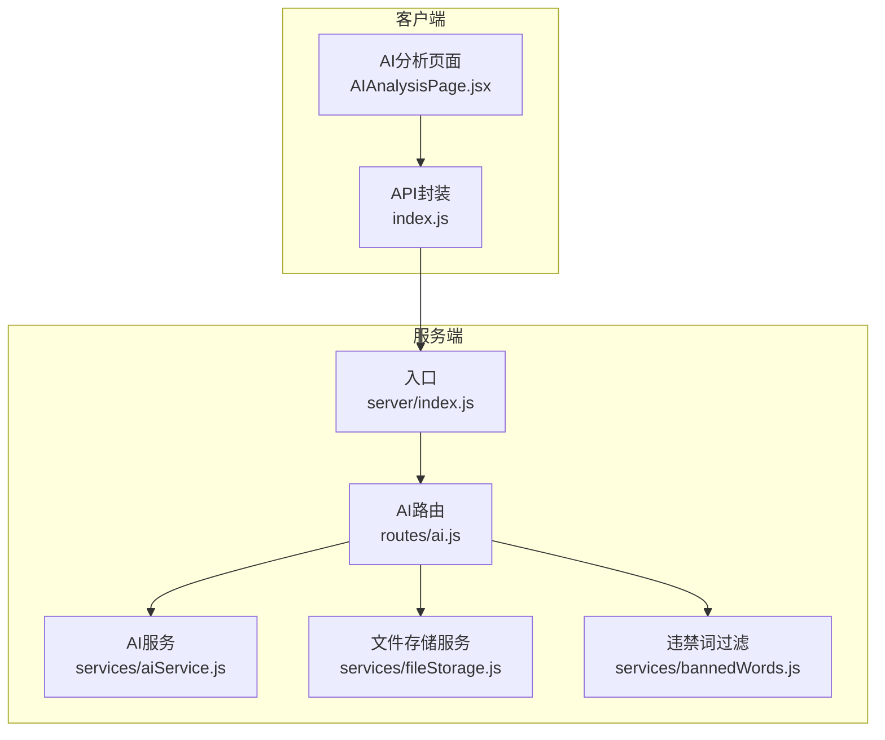
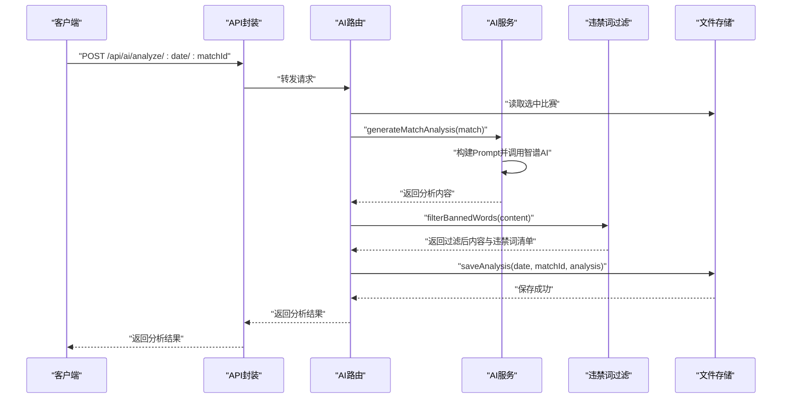
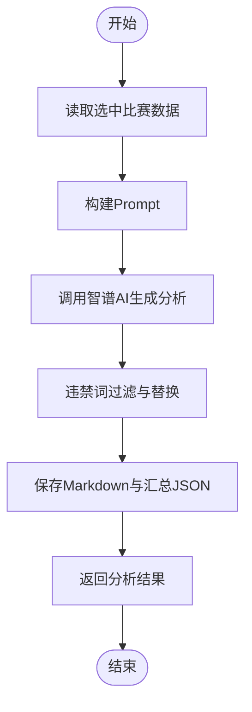
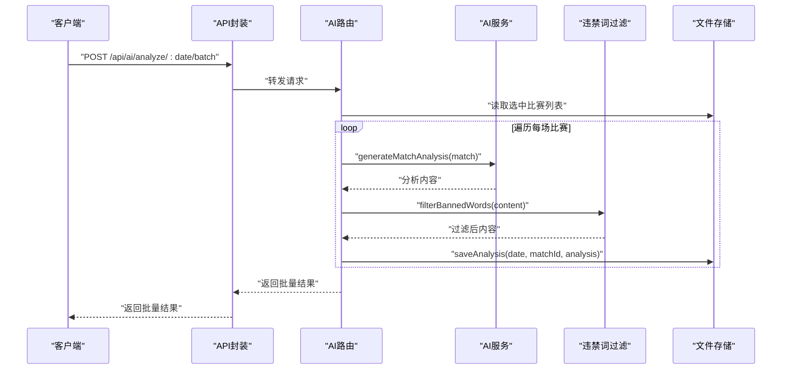
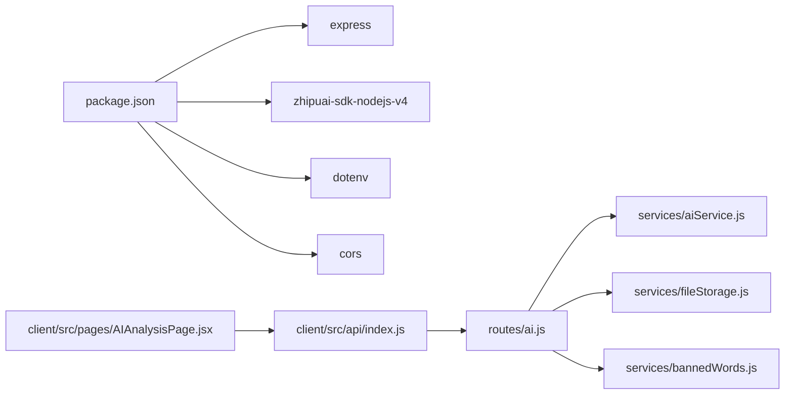

# AI分析API

<cite>
**本文引用的文件**
- [server/index.js](file://server/index.js)
- [server/routes/ai.js](file://server/routes/ai.js)
- [server/services/aiService.js](file://server/services/aiService.js)
- [server/services/fileStorage.js](file://server/services/fileStorage.js)
- [server/services/bannedWords.js](file://server/services/bannedWords.js)
- [client/src/api/index.js](file://client/src/api/index.js)
- [client/src/pages/AIAnalysisPage.jsx](file://client/src/pages/AIAnalysisPage.jsx)
- [package.json](file://package.json)
</cite>

## 目录
1. [简介](#简介)
2. [项目结构](#项目结构)
3. [核心组件](#核心组件)
4. [架构总览](#架构总览)
5. [详细接口文档](#详细接口文档)
6. [AI分析流程](#ai分析流程)
7. [批量处理机制](#批量处理机制)
8. [分析内容管理](#分析内容管理)
9. [智谱AI集成配置](#智谱ai集成配置)
10. [Prompt工程设计](#prompt工程设计)
11. [违禁词过滤机制](#违禁词过滤机制)
12. [依赖关系分析](#依赖关系分析)
13. [性能考虑](#性能考虑)
14. [故障排查指南](#故障排查指南)
15. [结论](#结论)

## 简介
本文件为AI分析API的完整技术文档，覆盖以下端点：
- POST /api/ai/analyze/:date/:matchId：生成单场比赛AI分析
- POST /api/ai/analyze/:date/batch：批量生成AI分析
- GET /api/ai/analyses/:date：获取指定日期所有AI分析
- PUT /api/ai/analyses/:date/:matchId：更新AI分析内容

文档还详细说明了AI分析生成流程、批量处理机制、分析内容管理、智谱AI集成配置、Prompt工程设计以及违禁词过滤机制，并提供分析质量评估与内容优化建议。

## 项目结构
后端采用Express框架，按功能分层组织：
- 路由层：定义REST接口与参数校验
- 服务层：封装业务逻辑（AI生成、文件存储、违禁词过滤）
- 客户端：基于Ant Design的React页面，调用API完成分析管理

图表来源
- [server/index.js:1-49](file://server/index.js#L1-L49)
- [server/routes/ai.js:1-102](file://server/routes/ai.js#L1-L102)
- [server/services/aiService.js:1-212](file://server/services/aiService.js#L1-L212)
- [server/services/fileStorage.js:1-196](file://server/services/fileStorage.js#L1-L196)
- [server/services/bannedWords.js:1-114](file://server/services/bannedWords.js#L1-L114)
- [client/src/api/index.js:1-50](file://client/src/api/index.js#L1-L50)
- [client/src/pages/AIAnalysisPage.jsx:1-203](file://client/src/pages/AIAnalysisPage.jsx#L1-L203)

章节来源
- [server/index.js:1-49](file://server/index.js#L1-L49)
- [package.json:1-23](file://package.json#L1-L23)

## 核心组件
- Express入口与静态资源：负责CORS、JSON解析、静态数据目录挂载、路由注册与健康检查
- AI路由：提供分析生成、批量生成、查询与更新接口
- AI服务：封装智谱AI调用、Prompt工程与响应解析
- 文件存储服务：按日期组织数据目录，支持分析内容的持久化与汇总
- 违禁词过滤：提供合规化文本处理，确保内容符合平台规范

章节来源
- [server/index.js:1-49](file://server/index.js#L1-L49)
- [server/routes/ai.js:1-102](file://server/routes/ai.js#L1-L102)
- [server/services/aiService.js:1-212](file://server/services/aiService.js#L1-L212)
- [server/services/fileStorage.js:1-196](file://server/services/fileStorage.js#L1-L196)
- [server/services/bannedWords.js:1-114](file://server/services/bannedWords.js#L1-L114)

## 架构总览
AI分析API的调用链路如下：
- 客户端通过API封装发起请求
- Express路由层接收请求，读取选中比赛数据
- AI服务调用智谱AI生成分析内容
- 违禁词过滤模块对生成内容进行合规化处理
- 文件存储服务写入Markdown与汇总JSON
- 客户端渲染分析结果并支持编辑与复制

图表来源
- [server/routes/ai.js:10-34](file://server/routes/ai.js#L10-L34)
- [server/services/aiService.js:18-65](file://server/services/aiService.js#L18-L65)
- [server/services/bannedWords.js:70-96](file://server/services/bannedWords.js#L70-L96)
- [server/services/fileStorage.js:74-98](file://server/services/fileStorage.js#L74-L98)
- [client/src/api/index.js:33-34](file://client/src/api/index.js#L33-L34)

## 详细接口文档

### POST /api/ai/analyze/:date/:matchId
- 功能：为指定日期与比赛ID生成单场AI分析
- 请求参数
  - 路径参数
    - date：日期字符串（YYYY-MM-DD）
    - matchId：比赛唯一标识
- 请求体：无
- 成功响应
  - data：分析对象
    - matchId：比赛ID
    - homeTeam：主队名称
    - awayTeam：客队名称
    - prediction：分析师预测
    - content：AI生成的分析内容
    - createdAt：创建时间
    - bannedWordsFound：过滤到的违禁词数组（可选）
- 错误响应
  - 404：未找到该比赛
  - 500：AI生成失败或存储异常

章节来源
- [server/routes/ai.js:10-34](file://server/routes/ai.js#L10-L34)

### POST /api/ai/analyze/:date/batch
- 功能：批量生成指定日期的所有选中比赛AI分析
- 请求参数
  - 路径参数
    - date：日期字符串（YYYY-MM-DD）
- 请求体：无
- 成功响应
  - data：数组，每个元素为单场比赛的分析对象或错误对象
    - 若成功：分析对象（同上）
    - 若失败：包含 matchId 与 error 的对象
- 错误响应
  - 400：没有选中比赛
  - 500：服务器内部错误

章节来源
- [server/routes/ai.js:39-69](file://server/routes/ai.js#L39-L69)

### GET /api/ai/analyses/:date
- 功能：获取指定日期的所有AI分析
- 请求参数
  - 路径参数
    - date：日期字符串（YYYY-MM-DD）
- 请求体：无
- 成功响应
  - data：分析对象数组（按matchId聚合）

章节来源
- [server/routes/ai.js:74-82](file://server/routes/ai.js#L74-L82)

### PUT /api/ai/analyses/:date/:matchId
- 功能：更新指定日期与比赛ID的AI分析内容
- 请求参数
  - 路径参数
    - date：日期字符串（YYYY-MM-DD）
    - matchId：比赛唯一标识
- 请求体
  - content：新的分析内容
- 成功响应
  - 无内容，仅返回200 OK

章节来源
- [server/routes/ai.js:87-99](file://server/routes/ai.js#L87-L99)

## AI分析流程
- 输入：选中比赛数据（来自文件存储）
- Prompt工程：基于比赛信息构造专业、合规的分析提示
- 智谱AI调用：使用glm-4模型生成分析内容
- 合规化处理：违禁词过滤与替换
- 内容持久化：写入Markdown与汇总JSON
- 响应返回：返回分析结果给客户端

图表来源
- [server/services/aiService.js:18-65](file://server/services/aiService.js#L18-L65)
- [server/services/bannedWords.js:70-96](file://server/services/bannedWords.js#L70-L96)
- [server/services/fileStorage.js:74-98](file://server/services/fileStorage.js#L74-L98)

## 批量处理机制
- 读取指定日期的选中比赛列表
- 逐个生成分析，捕获单个失败不影响整体
- 将成功与失败结果合并返回
- 支持前端展示批量生成进度与结果统计

图表来源
- [server/routes/ai.js:39-69](file://server/routes/ai.js#L39-L69)
- [server/services/aiService.js:18-65](file://server/services/aiService.js#L18-L65)
- [server/services/bannedWords.js:70-96](file://server/services/bannedWords.js#L70-L96)
- [server/services/fileStorage.js:74-98](file://server/services/fileStorage.js#L74-L98)

## 分析内容管理
- 存储结构
  - Markdown文件：按比赛ID命名的分析内容
  - 汇总JSON：all_analyses.json，包含所有分析对象
- 查询策略
  - 读取汇总JSON获取全部分析
  - 支持按matchId更新content字段
- 前端交互
  - 支持复制、编辑、保存更新后的分析内容
  - 展示违禁词过滤标记

章节来源
- [server/services/fileStorage.js:74-107](file://server/services/fileStorage.js#L74-L107)
- [client/src/pages/AIAnalysisPage.jsx:49-71](file://client/src/pages/AIAnalysisPage.jsx#L49-L71)

## 智谱AI集成配置
- SDK安装与依赖
  - 使用 zhipuai-sdk-nodejs-v4
- API密钥管理
  - 从环境变量读取ZHIPU_API_KEY
  - 若未配置或为默认值，将抛出错误
- 模型与参数
  - 模型：glm-4
  - temperature：0.7（平衡创造性与稳定性）
  - max_tokens：500（单场分析）
  - 公众号与直播文案分别设置不同temperature与max_tokens

章节来源
- [package.json:20](file://package.json#L20)
- [server/services/aiService.js:3-13](file://server/services/aiService.js#L3-L13)
- [server/services/aiService.js:42-50](file://server/services/aiService.js#L42-L50)
- [server/services/aiService.js:115-124](file://server/services/aiService.js#L115-L124)
- [server/services/aiService.js:186-194](file://server/services/aiService.js#L186-L194)

## Prompt工程设计
- 单场分析Prompt要点
  - 比赛信息：主客队、联赛、时间、赔率、让球、预测、信心指数、分析笔记
  - 输出要求：200字左右，逻辑闭环，专业但不晦涩
  - 禁用词汇：盘口、庄家、赌博、博彩、投注、赔率等
  - 替换词汇：数据走势、数据指标、让步等
- 公众号文案Prompt要点
  - 标题吸引眼球、开头制造悬念、重点分析热门比赛、逻辑层层递进
  - 禁用词汇清单与替换策略
- 直播文案Prompt要点
  - 开场白、逐场分析（每场300-400字）、结尾引导互动
  - 严格限制只能从基本面角度分析

章节来源
- [server/services/aiService.js:21-39](file://server/services/aiService.js#L21-L39)
- [server/services/aiService.js:73-113](file://server/services/aiService.js#L73-L113)
- [server/services/aiService.js:153-183](file://server/services/aiService.js#L153-L183)

## 违禁词过滤机制
- 过滤策略
  - 违禁词映射表：提供替换词或删除策略
  - 按词长降序匹配，优先处理长词
  - 清理多余空格与重复标点
- 返回信息
  - 过滤后文本
  - 发现的违禁词列表
- 使用场景
  - 单场分析生成后立即执行
  - 在客户端显示被过滤的违禁词清单

章节来源
- [server/services/bannedWords.js:6-63](file://server/services/bannedWords.js#L6-L63)
- [server/services/bannedWords.js:70-96](file://server/services/bannedWords.js#L70-L96)
- [client/src/pages/AIAnalysisPage.jsx:185-189](file://client/src/pages/AIAnalysisPage.jsx#L185-L189)

## 依赖关系分析
- 外部依赖
  - Express：Web框架
  - zhipuai-sdk-nodejs-v4：智谱AI SDK
  - dotenv：环境变量加载
  - cors：跨域支持
- 内部依赖
  - 路由依赖服务层
  - 服务层依赖SDK与文件系统
  - 客户端依赖API封装与UI组件

图表来源
- [package.json:15-21](file://package.json#L15-L21)
- [server/routes/ai.js:1-5](file://server/routes/ai.js#L1-L5)
- [client/src/api/index.js:1-13](file://client/src/api/index.js#L1-L13)

## 性能考虑
- 模型参数调优
  - temperature与max_tokens需平衡生成质量与时延
  - 对批量任务可考虑并发限制与速率控制
- 存储策略
  - Markdown与JSON分离，便于增量更新与快速读取
  - 大量分析时建议定期清理旧数据
- 前端体验
  - 批量生成时显示进度与成功计数
  - 编辑模式下提供即时保存与撤销

## 故障排查指南
- 环境变量未配置
  - 症状：AI服务初始化报错
  - 处理：在.env中设置ZHIPU_API_KEY
- 未找到比赛
  - 症状：404错误
  - 处理：确认选中比赛数据已保存
- 存储目录权限
  - 症状：保存失败
  - 处理：检查DATA_DIR目录权限与磁盘空间
- 违禁词过滤异常
  - 症状：过滤后文本异常
  - 处理：检查映射表与正则清理规则

章节来源
- [server/services/aiService.js:9-13](file://server/services/aiService.js#L9-L13)
- [server/routes/ai.js:16-18](file://server/routes/ai.js#L16-L18)
- [server/services/fileStorage.js:9-13](file://server/services/fileStorage.js#L9-L13)
- [server/services/bannedWords.js:70-96](file://server/services/bannedWords.js#L70-L96)

## 结论
AI分析API通过清晰的分层架构与完善的合规机制，实现了从数据输入到分析输出的全链路自动化。结合智谱AI的强大能力与严谨的Prompt工程，能够稳定产出高质量的分析内容；批量处理与内容管理功能进一步提升了运营效率。建议持续优化Prompt与过滤策略，以适配更严格的平台规范与更高的质量标准。