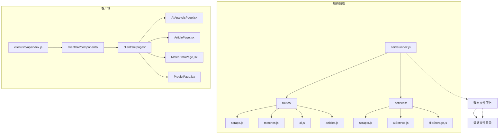
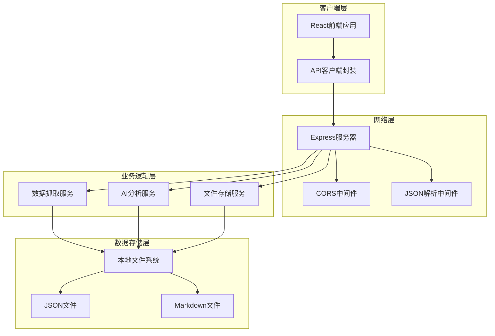
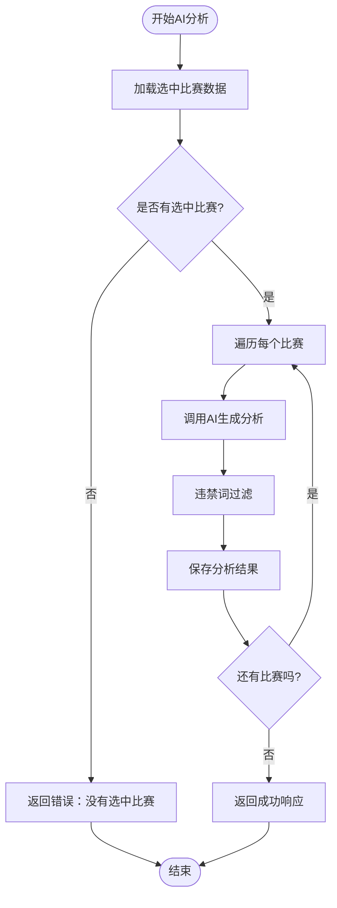
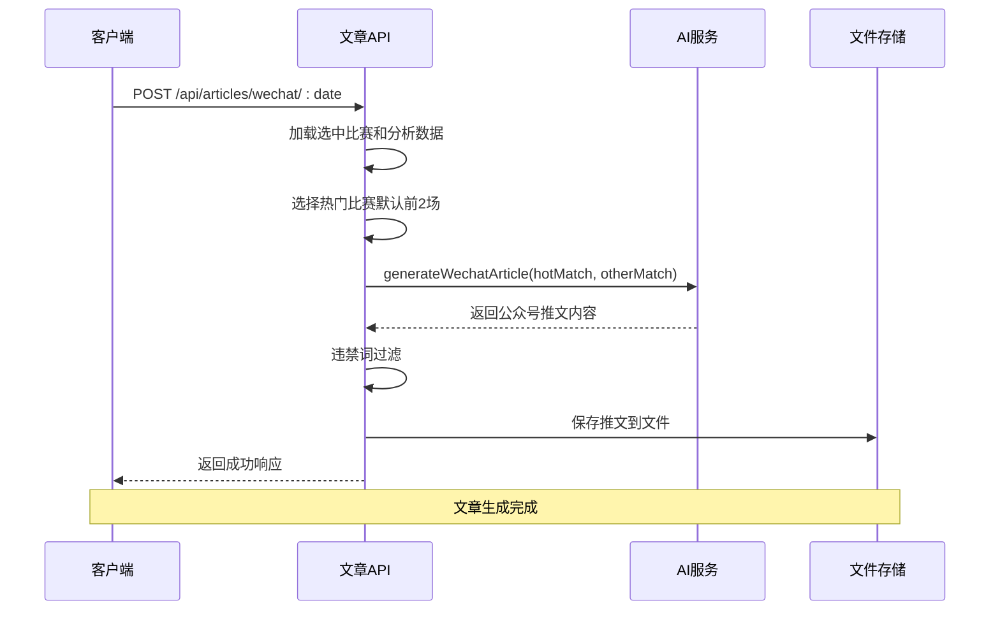
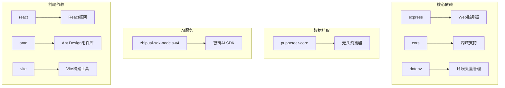
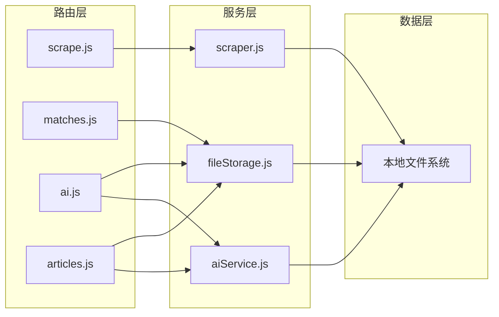

# API接口文档

<cite>
**本文档引用的文件**
- [server/index.js](file://server/index.js)
- [server/routes/scrape.js](file://server/routes/scrape.js)
- [server/routes/matches.js](file://server/routes/matches.js)
- [server/routes/ai.js](file://server/routes/ai.js)
- [server/routes/articles.js](file://server/routes/articles.js)
- [server/services/scraper.js](file://server/services/scraper.js)
- [server/services/aiService.js](file://server/services/aiService.js)
- [server/services/fileStorage.js](file://server/services/fileStorage.js)
- [client/src/api/index.js](file://client/src/api/index.js)
- [PRD.md](file://PRD.md)
- [package.json](file://package.json)
</cite>

## 目录
1. [简介](#简介)
2. [项目结构](#项目结构)
3. [核心组件](#核心组件)
4. [架构概览](#架构概览)
5. [详细组件分析](#详细组件分析)
6. [依赖关系分析](#依赖关系分析)
7. [性能考虑](#性能考虑)
8. [故障排除指南](#故障排除指南)
9. [结论](#结论)
10. [附录](#附录)

## 简介

AutoMatch是一个面向足球竞彩分析师的本地化智能分析工具，集成了赛事数据抓取、智能选场、AI辅助分析、文案生成等功能。本项目采用前后端分离架构，后端基于Node.js + Express提供RESTful API服务，前端使用React + Vite构建用户界面。

项目主要功能包括：
- **数据抓取**：从500彩票网自动抓取竞彩足球比赛数据
- **智能选场**：筛选重点比赛并录入分析师预测
- **AI分析**：调用智谱GLM-4大模型生成专业赛事分析
- **文案生成**：自动生成公众号推文和直播文案

## 项目结构

AutoMatch项目采用模块化的文件组织方式，主要分为以下几个部分：



**图表来源**
- [server/index.js:1-49](file://server/index.js#L1-L49)
- [server/routes/scrape.js:1-26](file://server/routes/scrape.js#L1-L26)
- [server/routes/matches.js:1-75](file://server/routes/matches.js#L1-L75)
- [server/routes/ai.js:1-102](file://server/routes/ai.js#L1-L102)
- [server/routes/articles.js:1-113](file://server/routes/articles.js#L1-L113)

**章节来源**
- [server/index.js:1-49](file://server/index.js#L1-L49)
- [package.json:1-23](file://package.json#L1-L23)

## 核心组件

### 服务器端架构

AutoMatch的服务器端采用Express框架构建，主要包含以下核心组件：

1. **路由层**：负责HTTP请求的接收和分发
2. **服务层**：包含业务逻辑处理和数据操作
3. **数据存储层**：基于本地文件系统的数据持久化

### 客户端架构

前端采用React + Vite技术栈，通过统一的API接口与后端通信，提供四个主要功能页面：
- 赛事数据页面
- 预测分析页面  
- AI分析页面
- 文章管理页面

**章节来源**
- [server/index.js:11-25](file://server/index.js#L11-L25)
- [client/src/api/index.js:1-50](file://client/src/api/index.js#L1-L50)

## 架构概览



**图表来源**
- [server/index.js:14-25](file://server/index.js#L14-L25)
- [server/services/scraper.js:1-295](file://server/services/scraper.js#L1-L295)
- [server/services/aiService.js:1-212](file://server/services/aiService.js#L1-L212)
- [server/services/fileStorage.js:1-196](file://server/services/fileStorage.js#L1-L196)

## 详细组件分析

### 数据抓取API

#### 接口定义

| 属性 | 详情 |
|------|------|
| 方法 | POST |
| 路径 | `/api/scrape` |
| 功能 | 触发抓取500彩票网竞彩足球比赛数据 |

#### 请求参数

- **请求体**：无
- **查询参数**：无

#### 响应格式

成功响应：
```json
{
  "success": true,
  "count": 45,
  "data": [
    {
      "matchId": "周六001",
      "league": "英超",
      "homeTeam": "曼城",
      "awayTeam": "利物浦",
      "matchTime": "2026-04-16 20:00",
      "oddsWin": 1.85,
      "oddsDraw": 3.40,
      "oddsLoss": 4.20,
      "handicapLine": "-1",
      "handicapWin": 2.10,
      "handicapDraw": 3.20,
      "handicapLoss": 3.30,
      "scrapedAt": "2026-04-16T10:30:00Z",
      "index": 1
    }
  ]
}
```

失败响应：
```json
{
  "success": false,
  "error": "抓取失败：网络连接超时"
}
```

#### 使用示例

```javascript
// 使用fetch
fetch('/api/scrape', {
  method: 'POST',
  headers: {
    'Content-Type': 'application/json'
  }
})
.then(response => response.json())
.then(data => {
  if (data.success) {
    console.log(`成功抓取 ${data.count} 场比赛`);
  }
});

// 使用客户端API封装
import { scrapeMatches } from './api';

try {
  const result = await scrapeMatches();
  console.log(`抓取完成，共 ${result.data.length} 场比赛`);
} catch (error) {
  console.error('抓取失败:', error.message);
}
```

**章节来源**
- [server/routes/scrape.js:5-23](file://server/routes/scrape.js#L5-L23)
- [server/services/scraper.js:22-214](file://server/services/scraper.js#L22-L214)

### 比赛数据API

#### 日期列表查询

| 属性 | 详情 |
|------|------|
| 方法 | GET |
| 路径 | `/api/matches/dates` |
| 功能 | 获取所有有数据的日期列表 |

#### 指定日期比赛数据

| 属性 | 详情 |
|------|------|
| 方法 | GET |
| 路径 | `/api/matches/:date` |
| 参数 | `date`: 日期字符串（格式：YYYY-MM-DD） |
| 功能 | 获取指定日期的比赛数据 |

#### 保存重点比赛

| 属性 | 详情 |
|------|------|
| 方法 | PUT |
| 路径 | `/api/matches/:date/select` |
| 参数 | `date`: 日期字符串 |
| 功能 | 保存选中的重点比赛 |

#### 保存单场比赛预测

| 属性 | 详情 |
|------|------|
| 方法 | PUT |
| 路径 | `/api/matches/:date/predict/:matchId` |
| 参数 | `date`: 日期字符串<br/>`matchId`: 比赛ID |
| 功能 | 保存单场比赛的预测信息 |

#### 请求参数规范

**保存重点比赛请求体**：
```json
{
  "selectedMatches": [
    {
      "matchId": "周六001",
      "prediction": "主胜",
      "confidence": 4,
      "analysisNote": "曼城主场优势明显",
      "isHot": true
    }
  ]
}
```

**保存预测请求体**：
```json
{
  "prediction": "平局",
  "confidence": 3,
  "analysisNote": "双方实力接近",
  "isHot": false
}
```

#### 响应格式

**日期列表响应**：
```json
{
  "success": true,
  "data": ["2026-04-16", "2026-04-15", "2026-04-14"]
}
```

**比赛数据响应**：
```json
{
  "success": true,
  "data": {
    "raw": [
      {
        "matchId": "周六001",
        "league": "英超",
        "homeTeam": "曼城",
        "awayTeam": "利物浦",
        "matchTime": "2026-04-16 20:00",
        "oddsWin": 1.85,
        "oddsDraw": 3.40,
        "oddsLoss": 4.20
      }
    ],
    "selected": [
      {
        "matchId": "周六001",
        "prediction": "主胜",
        "confidence": 4,
        "analysisNote": "曼城主场优势明显",
        "isHot": true
      }
    ]
  }
}
```

**章节来源**
- [server/routes/matches.js:5-72](file://server/routes/matches.js#L5-L72)
- [server/services/fileStorage.js:32-69](file://server/services/fileStorage.js#L32-L69)

### AI分析API

#### 单场比赛AI分析

| 属性 | 详情 |
|------|------|
| 方法 | POST |
| 路径 | `/api/ai/analyze/:date/:matchId` |
| 参数 | `date`: 日期字符串<br/>`matchId`: 比赛ID |
| 功能 | 生成单场比赛的AI分析报告 |

#### 批量AI分析

| 属性 | 详情 |
|------|------|
| 方法 | POST |
| 路径 | `/api/ai/analyze/:date/batch` |
| 参数 | `date`: 日期字符串 |
| 功能 | 批量生成所有选中比赛的AI分析

#### 获取AI分析列表

| 属性 | 详情 |
|------|------|
| 方法 | GET |
| 路径 | `/api/ai/analyses/:date` |
| 参数 | `date`: 日期字符串 |
| 功能 | 获取指定日期的所有AI分析

#### 更新AI分析内容

| 属性 | 详情 |
|------|------|
| 方法 | PUT |
| 路径 | `/api/ai/analyses/:date/:matchId` |
| 参数 | `date`: 日期字符串<br/>`matchId`: 比赛ID |
| 功能 | 更新AI分析内容

#### AI分析请求体

```json
{
  "content": "曼城在主场拥有明显优势，近期状态稳定，利物浦客场表现一般。综合赔率走势分析，曼城获胜概率较高。"
}
```

#### AI分析响应格式

**单场分析响应**：
```json
{
  "success": true,
  "data": {
    "matchId": "周六001",
    "homeTeam": "曼城",
    "awayTeam": "利物浦",
    "prediction": "主胜",
    "content": "曼城在主场拥有明显优势，近期状态稳定，利物浦客场表现一般。综合赔率走势分析，曼城获胜概率较高。",
    "createdAt": "2026-04-16T11:30:00Z",
    "bannedWordsFound": ["数据走势", "数据指标"]
  }
}
```

**批量分析响应**：
```json
{
  "success": true,
  "data": [
    {
      "matchId": "周六001",
      "content": "曼城分析内容...",
      "createdAt": "2026-04-16T11:30:00Z"
    },
    {
      "matchId": "周六002",
      "error": "AI分析生成失败：API调用超时"
    }
  ]
}
```

#### AI分析流程图



**图表来源**
- [server/routes/ai.js:39-69](file://server/routes/ai.js#L39-L69)
- [server/services/aiService.js:18-65](file://server/services/aiService.js#L18-L65)

**章节来源**
- [server/routes/ai.js:7-99](file://server/routes/ai.js#L7-L99)
- [server/services/aiService.js:18-212](file://server/services/aiService.js#L18-L212)

### 文章管理API

#### 公众号推文生成

| 属性 | 详情 |
|------|------|
| 方法 | POST |
| 路径 | `/api/articles/wechat/:date` |
| 参数 | `date`: 日期字符串 |
| 功能 | 生成微信公众号推文

#### 直播文案生成

| 属性 | 详情 |
|------|------|
| 方法 | POST |
| 路径 | `/api/articles/live/:date` |
| 参数 | `date`: 日期字符串 |
| 功能 | 生成直播文案

#### 获取所有文章

| 属性 | 详情 |
|------|------|
| 方法 | GET |
| 路径 | `/api/articles/:date` |
| 参数 | `date`: 日期字符串 |
| 功能 | 获取指定日期的所有文章

#### 文章生成流程



**图表来源**
- [server/routes/articles.js:10-51](file://server/routes/articles.js#L10-L51)
- [server/services/aiService.js:70-135](file://server/services/aiService.js#L70-L135)

#### 请求参数和响应格式

**公众号推文请求体**：
```json
{
  "hotMatch": {
    "matchId": "周六001",
    "homeTeam": "曼城",
    "awayTeam": "利物浦",
    "prediction": "主胜",
    "confidence": 4,
    "analysisNote": "曼城主场优势明显",
    "aiAnalysis": "AI分析摘要..."
  },
  "otherMatch": {
    "matchId": "周六002",
    "homeTeam": "拜仁",
    "awayTeam": "多特蒙德",
    "prediction": "平局",
    "confidence": 3,
    "analysisNote": "德甲经典对决"
  }
}
```

**公众号推文响应**：
```json
{
  "success": true,
  "data": {
    "hotMatch": "曼城 vs 利物浦",
    "content": "公众号推文内容...",
    "createdAt": "2026-04-16T12:00:00Z"
  }
}
```

**章节来源**
- [server/routes/articles.js:7-110](file://server/routes/articles.js#L7-L110)
- [server/services/aiService.js:70-205](file://server/services/aiService.js#L70-L205)

## 依赖关系分析

### 外部依赖

AutoMatch项目的主要外部依赖包括：



**图表来源**
- [package.json:15-21](file://package.json#L15-L21)

### 内部模块依赖



**图表来源**
- [server/routes/scrape.js:3](file://server/routes/scrape.js#L3)
- [server/routes/matches.js:3](file://server/routes/matches.js#L3)
- [server/routes/ai.js:3-5](file://server/routes/ai.js#L3-L5)
- [server/routes/articles.js:3-5](file://server/routes/articles.js#L3-L5)

**章节来源**
- [package.json:15-21](file://package.json#L15-L21)

## 性能考虑

### 性能指标

根据PRD文档，AutoMatch项目的关键性能指标：

- **数据抓取**：控制在30秒内完成
- **AI分析**：单场控制在10秒内
- **并发处理**：批量AI分析采用顺序处理，确保稳定性

### 性能优化建议

1. **缓存策略**：对于频繁访问的数据可以考虑内存缓存
2. **异步处理**：长时间运行的任务应该异步处理，避免阻塞主线程
3. **资源管理**：合理管理Puppeteer浏览器实例的生命周期
4. **错误重试**：为网络请求实现合理的重试机制

### 内存使用

- **文件大小限制**：Express JSON解析设置为10MB，适用于大多数请求
- **文件存储**：使用流式写入避免大文件内存占用
- **浏览器资源**：Puppeteer会占用较多内存，需要合理管理

## 故障排除指南

### 常见错误类型

#### 1. 数据抓取失败

**可能原因**：
- 网络连接不稳定
- 500彩票网页面结构变更
- 浏览器启动失败

**解决方案**：
- 检查网络连接
- 更新页面选择器
- 验证Chrome路径配置

#### 2. AI分析生成失败

**可能原因**：
- 智谱API Key配置错误
- API调用超时
- 违禁词过滤异常

**解决方案**：
- 检查`.env`文件中的API Key
- 增加超时时间设置
- 检查AI服务可用性

#### 3. 文件存储错误

**可能原因**：
- 数据目录权限不足
- 磁盘空间不足
- 文件路径不存在

**解决方案**：
- 检查目录权限设置
- 清理磁盘空间
- 确认基础目录存在

### 调试技巧

1. **启用详细日志**：在开发环境中启用详细的console日志
2. **检查环境变量**：确认所有必需的环境变量都已正确配置
3. **验证API响应**：使用curl或Postman测试API接口
4. **监控资源使用**：关注内存和CPU使用情况

**章节来源**
- [server/services/scraper.js:206-213](file://server/services/scraper.js#L206-L213)
- [server/services/aiService.js:9-13](file://server/services/aiService.js#L9-L13)
- [server/services/fileStorage.js:9-13](file://server/services/fileStorage.js#L9-L13)

## 结论

AutoMatch项目提供了一个完整的足球赛事智能分析解决方案，具有以下特点：

**技术优势**：
- 模块化架构设计，职责清晰
- 基于本地文件系统的数据存储，便于维护
- 集成AI服务，提升分析效率
- 前后端分离，便于扩展

**功能完整性**：
- 覆盖了从数据抓取到文章生成的完整工作流程
- 支持批量处理和单场分析
- 提供违禁词过滤，确保内容合规

**使用建议**：
- 建议定期备份数据文件
- 合理配置环境变量
- 监控API使用情况
- 根据实际需求调整性能参数

该项目为足球竞彩分析师提供了高效的自动化工具，能够显著提升日常工作的效率和质量。

## 附录

### API客户端使用指南

#### 基础配置

```javascript
// 客户端API封装示例
const BASE_URL = '/api';

async function request(url, options = {}) {
  const res = await fetch(`${BASE_URL}${url}`, {
    headers: { 'Content-Type': 'application/json' },
    ...options,
  });
  const data = await res.json();
  if (!data.success) {
    throw new Error(data.error || '请求失败');
  }
  return data;
}
```

#### 最佳实践

1. **错误处理**：始终检查`success`字段
2. **数据验证**：对接收到的数据进行基本验证
3. **状态管理**：在UI中显示加载状态
4. **重试机制**：为关键操作实现重试逻辑

#### 版本控制

当前版本：1.0.0
- 采用语义化版本控制
- 主版本号：重大架构变更
- 次版本号：新增功能
- 修订号：bug修复和小改进

#### 认证机制

AutoMatch项目采用本地部署模式，未实现传统意义上的API认证。建议在生产环境中：

1. 添加JWT令牌认证
2. 实现API密钥管理
3. 配置HTTPS加密传输
4. 添加访问频率限制

**章节来源**
- [client/src/api/index.js:1-13](file://client/src/api/index.js#L1-L13)
- [PRD.md:274-288](file://PRD.md#L274-L288)