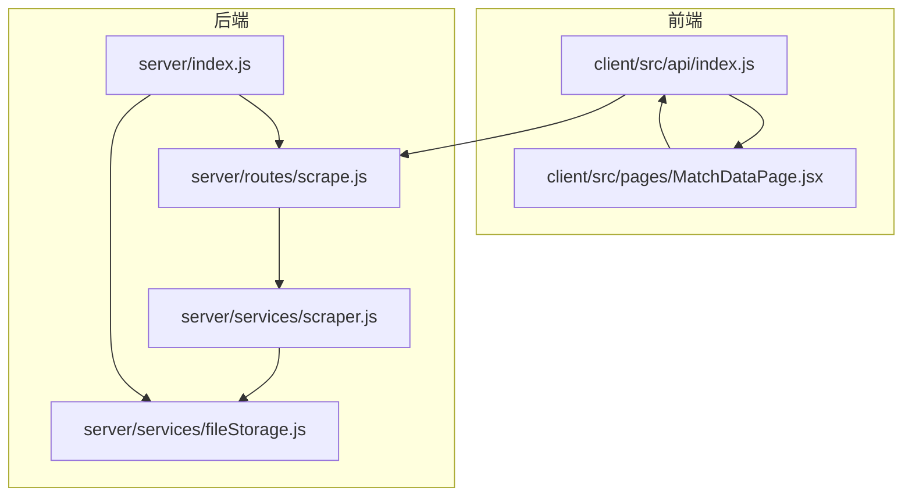
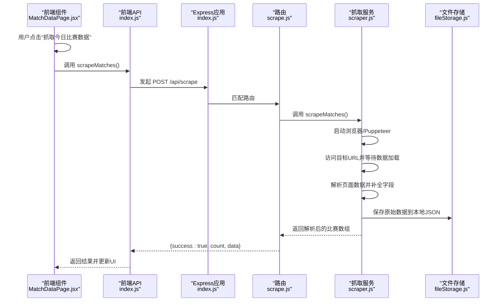
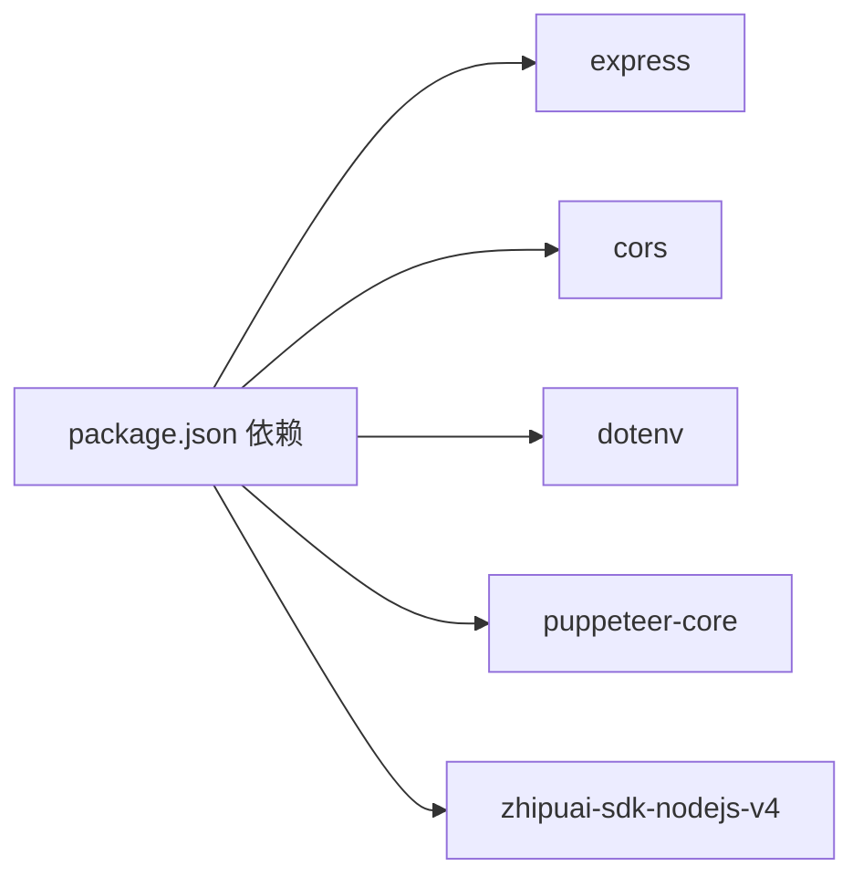

# 数据抓取API

<cite>
**本文引用的文件**
- [server/index.js](file://server/index.js)
- [server/routes/scrape.js](file://server/routes/scrape.js)
- [server/services/scraper.js](file://server/services/scraper.js)
- [server/services/fileStorage.js](file://server/services/fileStorage.js)
- [client/src/api/index.js](file://client/src/api/index.js)
- [client/src/pages/MatchDataPage.jsx](file://client/src/pages/MatchDataPage.jsx)
- [PRD.md](file://PRD.md)
- [package.json](file://package.json)
</cite>

## 目录
1. [简介](#简介)
2. [项目结构](#项目结构)
3. [核心组件](#核心组件)
4. [架构总览](#架构总览)
5. [详细组件分析](#详细组件分析)
6. [依赖关系分析](#依赖关系分析)
7. [性能考量](#性能考量)
8. [故障排除指南](#故障排除指南)
9. [结论](#结论)
10. [附录](#附录)

## 简介
本文件为“数据抓取API”的详细接口文档，聚焦于 POST /api/scrape 端点，涵盖触发机制、Puppeteer 自动化流程、数据存储过程、请求与响应格式、错误处理、并发控制与重试机制现状、状态监控与故障排除建议。该API用于从指定竞彩网站抓取当日比赛数据，返回结构化JSON，并将原始数据持久化至本地文件系统。

## 项目结构
后端采用 Express 框架，路由集中在 server/routes，业务逻辑分布在 server/services。前端通过 client/src/api/index.js 调用后端API，MatchDataPage.jsx 展示并触发抓取。

图表来源
- [server/index.js:1-49](file://server/index.js#L1-L49)
- [server/routes/scrape.js:1-26](file://server/routes/scrape.js#L1-L26)
- [server/services/scraper.js:1-295](file://server/services/scraper.js#L1-L295)
- [server/services/fileStorage.js:1-196](file://server/services/fileStorage.js#L1-L196)
- [client/src/api/index.js:1-50](file://client/src/api/index.js#L1-L50)
- [client/src/pages/MatchDataPage.jsx:1-198](file://client/src/pages/MatchDataPage.jsx#L1-L198)

章节来源
- [server/index.js:1-49](file://server/index.js#L1-L49)
- [server/routes/scrape.js:1-26](file://server/routes/scrape.js#L1-L26)
- [server/services/scraper.js:1-295](file://server/services/scraper.js#L1-L295)
- [server/services/fileStorage.js:1-196](file://server/services/fileStorage.js#L1-L196)
- [client/src/api/index.js:1-50](file://client/src/api/index.js#L1-L50)
- [client/src/pages/MatchDataPage.jsx:1-198](file://client/src/pages/MatchDataPage.jsx#L1-L198)

## 核心组件
- 路由层：负责接收HTTP请求并转发给服务层，统一错误处理与响应格式。
- 服务层（抓取）：封装Puppeteer自动化流程，解析页面数据，补充唯一标识与时间戳，最终调用文件存储服务。
- 文件存储服务：负责本地目录结构管理、原始数据与各类分析/文案的持久化。
- 前端API封装：统一封装fetch请求，校验success字段并抛出错误，便于组件层统一处理。

章节来源
- [server/routes/scrape.js:1-26](file://server/routes/scrape.js#L1-L26)
- [server/services/scraper.js:1-295](file://server/services/scraper.js#L1-L295)
- [server/services/fileStorage.js:1-196](file://server/services/fileStorage.js#L1-L196)
- [client/src/api/index.js:1-50](file://client/src/api/index.js#L1-L50)

## 架构总览
POST /api/scrape 的完整调用链如下：

图表来源
- [client/src/pages/MatchDataPage.jsx:25-38](file://client/src/pages/MatchDataPage.jsx#L25-L38)
- [client/src/api/index.js:15-16](file://client/src/api/index.js#L15-L16)
- [server/index.js:21-25](file://server/index.js#L21-L25)
- [server/routes/scrape.js:8-23](file://server/routes/scrape.js#L8-L23)
- [server/services/scraper.js:22-214](file://server/services/scraper.js#L22-L214)
- [server/services/fileStorage.js:32-39](file://server/services/fileStorage.js#L32-L39)

## 详细组件分析

### 接口定义：POST /api/scrape
- 方法：POST
- 路径：/api/scrape
- 请求体：无（空体）
- 响应体：
  - 成功时：{ success: true, count: number, data: Match[] }
  - 失败时：{ success: false, error: string }
- 说明：
  - 成功响应包含本次抓取的总场次与结构化数据数组。
  - 失败响应包含错误信息，HTTP状态码为500。

章节来源
- [server/routes/scrape.js:5-23](file://server/routes/scrape.js#L5-L23)
- [PRD.md:254-256](file://PRD.md#L254-L256)

### 数据抓取触发机制
- 前端通过调用 scrapeMatches() 触发抓取；该函数封装了 fetch 调用并统一错误处理。
- 后端路由接收到请求后，直接调用服务层的 scrapeMatches()，无需额外参数。
- 服务层内部会启动浏览器、访问目标URL、等待页面数据加载、解析并返回结果。

章节来源
- [client/src/api/index.js:15-16](file://client/src/api/index.js#L15-L16)
- [client/src/pages/MatchDataPage.jsx:25-38](file://client/src/pages/MatchDataPage.jsx#L25-L38)
- [server/routes/scrape.js:8-10](file://server/routes/scrape.js#L8-L10)
- [server/services/scraper.js:22-214](file://server/services/scraper.js#L22-L214)

### Puppeteer自动化流程
- 浏览器启动：
  - 使用可执行路径检测策略，支持macOS常见Chrome/Chromium安装路径与环境变量覆盖。
  - 以“新无头模式”启动，设置必要参数规避自动化检测。
- 页面访问与等待：
  - 设置User-Agent与视口尺寸，访问目标URL并等待网络空闲。
  - 等待关键选择器出现，若超时则静默忽略，再额外等待固定时间确保数据渲染。
- 数据解析：
  - 使用 evaluate 在页面上下文中提取表格行数据，兼容多种页面结构。
  - 对赔率与让球盘口进行数值过滤与顺序提取，避免异常值。
  - 若标准解析为空，则回退到深度解析（基于文本正则与表格遍历）。
- 补充字段：
  - 为每条记录生成唯一ID（若缺失）、添加抓取时间戳与序号。
- 错误处理：
  - 捕获异常并抛出，最终关闭浏览器，避免资源泄漏。

章节来源
- [server/services/scraper.js:10-17](file://server/services/scraper.js#L10-L17)
- [server/services/scraper.js:27-51](file://server/services/scraper.js#L27-L51)
- [server/services/scraper.js:62-183](file://server/services/scraper.js#L62-L183)
- [server/services/scraper.js:186-190](file://server/services/scraper.js#L186-L190)
- [server/services/scraper.js:194-198](file://server/services/scraper.js#L194-L198)
- [server/services/scraper.js:206-213](file://server/services/scraper.js#L206-L213)

### 数据存储过程
- 目录结构：
  - 基础目录由环境变量或默认路径决定，按“YYYY-MM-DD”日期分目录。
  - 每日目录下包含“01_原始数据”子目录，存放 matches.json。
- 存储内容：
  - 原始数据：matches.json，保存抓取到的结构化比赛数据。
- 前端静态访问：
  - 服务器挂载 /data 静态目录，允许前端直接访问本地数据文件。

章节来源
- [server/services/fileStorage.js:4-39](file://server/services/fileStorage.js#L4-L39)
- [server/index.js:17-19](file://server/index.js#L17-L19)

### 请求与响应格式
- 请求示例（curl）
  - curl -X POST http://localhost:3001/api/scrape
- 成功响应示例
  - {
      "success": true,
      "count": 24,
      "data": [
        {
          "matchId": "周六001",
          "league": "英超",
          "homeTeam": "曼城",
          "awayTeam": "阿森纳",
          "matchTime": "2026-04-16 20:00",
          "oddsWin": 1.85,
          "oddsDraw": 3.40,
          "oddsLoss": 4.20,
          "handicapLine": "-1",
          "handicapWin": 2.10,
          "handicapDraw": 3.20,
          "handicapLoss": 3.30,
          "scrapedAt": "2026-04-16T12:34:56.789Z",
          "index": 1
        },
        ...
      ]
    }
- 失败响应示例
  - {
      "success": false,
      "error": "浏览器启动失败：找不到Chrome可执行文件"
    }

章节来源
- [server/routes/scrape.js:11-22](file://server/routes/scrape.js#L11-L22)
- [server/services/scraper.js:206-208](file://server/services/scraper.js#L206-L208)
- [PRD.md:35-49](file://PRD.md#L35-L49)

### 错误处理机制
- 路由层：
  - 捕获服务层抛出的异常，记录日志并返回 { success: false, error }。
- 服务层：
  - 捕获Puppeteer与页面解析异常，统一抛出，确保finally中关闭浏览器。
- 前端：
  - request函数在响应中校验 success 字段，失败时抛出错误，由调用方捕获并提示用户。

章节来源
- [server/routes/scrape.js:16-22](file://server/routes/scrape.js#L16-L22)
- [server/services/scraper.js:206-213](file://server/services/scraper.js#L206-L213)
- [client/src/api/index.js:9-12](file://client/src/api/index.js#L9-L12)

### 并发控制与重试机制
- 现状：
  - 代码未实现显式的并发限制或重试策略。
  - 服务层在finally中保证浏览器关闭，避免资源泄漏。
- 建议（非强制）：
  - 在路由层增加请求排队或互斥锁，避免多实例同时启动浏览器导致资源争用。
  - 在服务层对关键步骤（如页面访问、等待选择器）增加有限重试与指数退避。
  - 对外部站点访问设置超时与断路器，防止长时间阻塞。

章节来源
- [server/routes/scrape.js:8-23](file://server/routes/scrape.js#L8-L23)
- [server/services/scraper.js:27-51](file://server/services/scraper.js#L27-L51)
- [PRD.md:276-278](file://PRD.md#L276-L278)

### 数据结构说明
- 比赛对象字段（部分）
  - matchId: 比赛编号（若页面未提供则自动生成）
  - league: 联赛名称
  - homeTeam/awayTeam: 主队/客队
  - matchTime: 比赛时间
  - oddsWin/oddsDraw/oddsLoss: 初盘胜/平/负赔率
  - handicapLine: 让球数
  - handicapWin/handicapDraw/handicapLoss: 让球胜/平/负赔率
  - scrapedAt: 抓取时间戳
  - index: 本批次序号
- 存储文件
  - 日期目录下的 matches.json，保存原始数据数组。

章节来源
- [PRD.md:35-49](file://PRD.md#L35-L49)
- [server/services/scraper.js:74-87](file://server/services/scraper.js#L74-L87)
- [server/services/scraper.js:194-198](file://server/services/scraper.js#L194-L198)
- [server/services/fileStorage.js:32-39](file://server/services/fileStorage.js#L32-L39)

## 依赖关系分析

图表来源
- [package.json:15-21](file://package.json#L15-L21)

章节来源
- [package.json:15-21](file://package.json#L15-L21)

## 性能考量
- 抓取耗时：受网络与页面渲染影响，建议控制在产品需求范围内。
- 浏览器资源：确保finally中关闭浏览器，避免进程堆积。
- 前端交互：抓取过程中显示加载提示，完成后刷新数据列表。

章节来源
- [PRD.md:276-278](file://PRD.md#L276-L278)
- [server/services/scraper.js:209-213](file://server/services/scraper.js#L209-L213)
- [client/src/pages/MatchDataPage.jsx:25-38](file://client/src/pages/MatchDataPage.jsx#L25-L38)

## 故障排除指南
- 浏览器启动失败
  - 症状：返回错误信息提示找不到Chrome可执行文件。
  - 排查：确认Chrome/Chromium安装路径，或设置环境变量 CHROME_PATH 指向可执行文件。
- 页面加载超时
  - 症状：等待选择器超时或页面未渲染完成。
  - 排查：检查网络连通性，适当延长等待时间；确认目标URL可访问。
- 数据解析为空
  - 症状：标准解析未获取到数据。
  - 排查：服务层会回退到深度解析；若仍为空，检查页面结构变化或选择器适配。
- 文件写入失败
  - 症状：无法保存到本地目录。
  - 排查：确认 DATA_DIR 权限与磁盘空间，确保目录可写。
- 前端无法访问数据
  - 症状：/data 目录无法访问。
  - 排查：确认服务器已挂载 /data 静态目录，且路径正确。

章节来源
- [server/services/scraper.js:10-17](file://server/services/scraper.js#L10-L17)
- [server/services/scraper.js:54-57](file://server/services/scraper.js#L54-L57)
- [server/services/scraper.js:186-190](file://server/services/scraper.js#L186-L190)
- [server/services/fileStorage.js:32-39](file://server/services/fileStorage.js#L32-L39)
- [server/index.js:17-19](file://server/index.js#L17-L19)

## 结论
POST /api/scrape 提供了从竞彩网站抓取当日比赛数据的能力，具备基础的错误处理与本地文件存储。当前未实现并发控制与重试机制，建议在生产环境中增加互斥与重试策略以提升稳定性与性能。前端通过统一API封装与状态提示，提供了良好的用户体验。

## 附录

### API定义表
- POST /api/scrape
  - 请求体：无
  - 成功响应：{ success: true, count: number, data: Match[] }
  - 失败响应：{ success: false, error: string }

章节来源
- [server/routes/scrape.js:5-23](file://server/routes/scrape.js#L5-L23)
- [PRD.md:254-256](file://PRD.md#L254-L256)