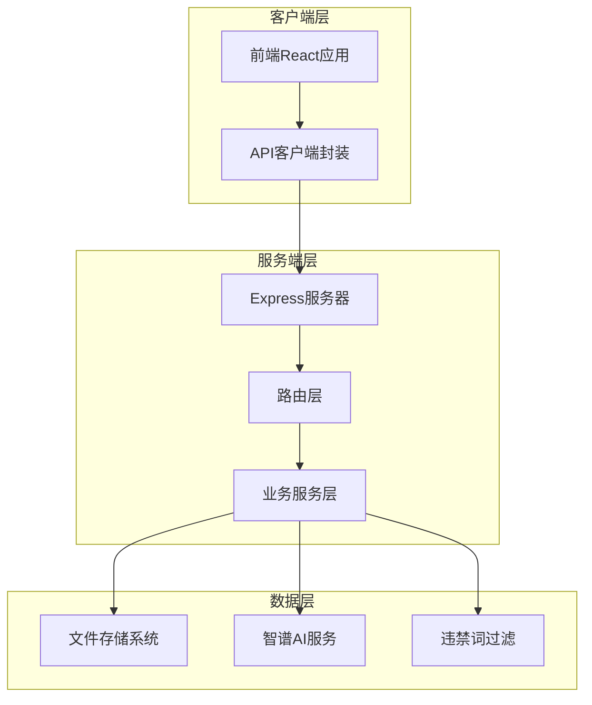
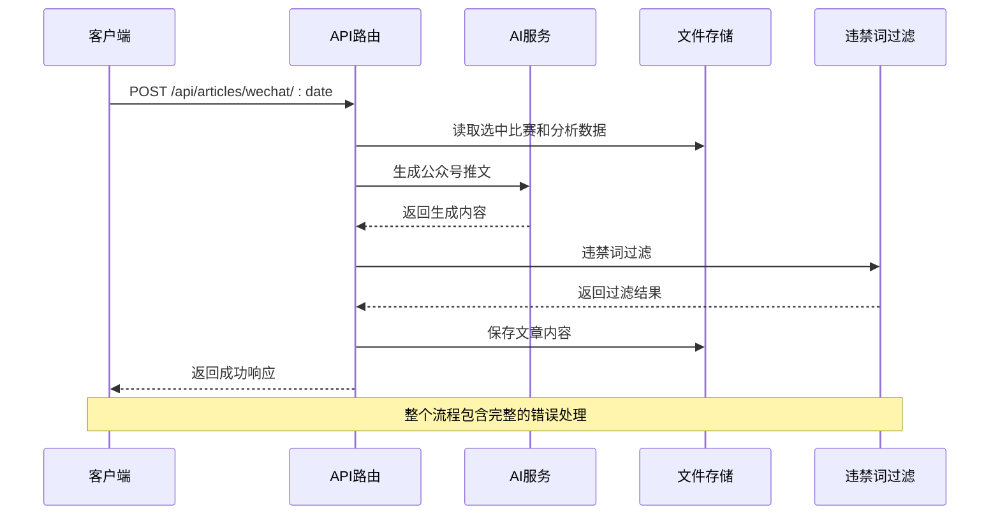
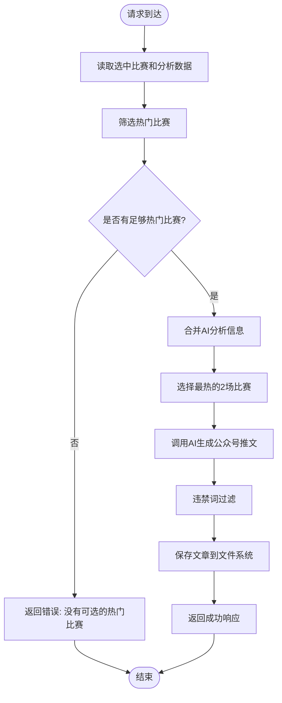
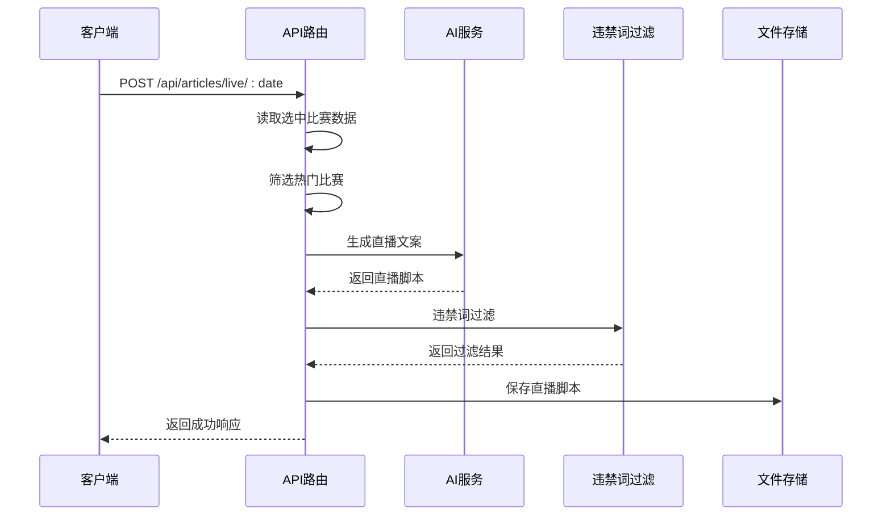
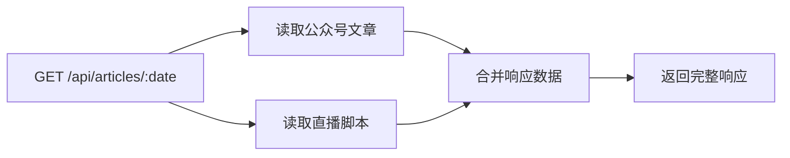
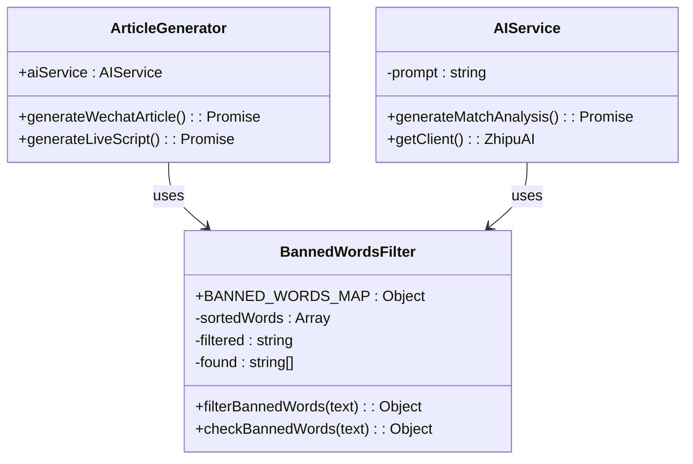
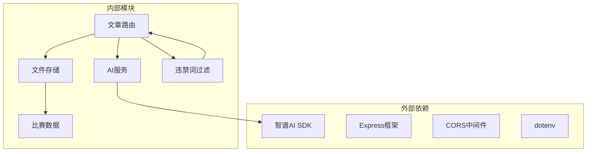
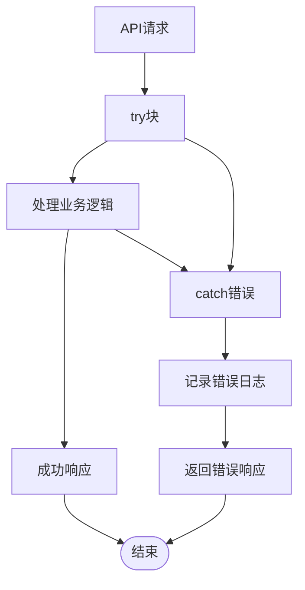

# 文章生成API

<cite>
**本文档引用的文件**
- [server/routes/articles.js](file://server/routes/articles.js)
- [server/services/aiService.js](file://server/services/aiService.js)
- [server/services/fileStorage.js](file://server/services/fileStorage.js)
- [server/services/bannedWords.js](file://server/services/bannedWords.js)
- [server/routes/ai.js](file://server/routes/ai.js)
- [client/src/api/index.js](file://client/src/api/index.js)
- [client/src/pages/ArticlePage.jsx](file://client/src/pages/ArticlePage.jsx)
- [server/index.js](file://server/index.js)
- [PRD.md](file://PRD.md)
- [package.json](file://package.json)
</cite>

## 目录
1. [简介](#简介)
2. [项目结构](#项目结构)
3. [核心组件](#核心组件)
4. [架构概览](#架构概览)
5. [详细组件分析](#详细组件分析)
6. [依赖关系分析](#依赖关系分析)
7. [性能考虑](#性能考虑)
8. [故障排除指南](#故障排除指南)
9. [结论](#结论)

## 简介

AutoMatch是一个面向足球竞彩分析师的智能分析工具，专注于自动化生成公众号推文和直播文案。该系统集成了赛事数据抓取、智能选场、AI辅助分析和内容生成等功能，帮助分析师高效完成每日赛事分析工作。

本文档详细介绍了文章生成API的核心功能，包括：
- 公众号推文生成（POST /api/articles/wechat/:date）
- 直播文案生成（POST /api/articles/live/:date）
- 文章管理查询（GET /api/articles/:date）

系统采用模块化设计，确保内容合规性和批量生成优化，提供完整的错误处理策略和质量评估标准。

## 项目结构

AutoMatch采用前后端分离的架构设计，主要由以下组件构成：



**图表来源**
- [server/index.js:1-49](file://server/index.js#L1-L49)
- [server/routes/articles.js:1-113](file://server/routes/articles.js#L1-L113)

**章节来源**
- [server/index.js:1-49](file://server/index.js#L1-L49)
- [package.json:1-23](file://package.json#L1-L23)

## 核心组件

### API路由模块

系统的核心路由模块位于`server/routes/articles.js`，提供了三个主要的API端点：

1. **公众号推文生成**: `POST /api/articles/wechat/:date`
2. **直播文案生成**: `POST /api/articles/live/:date`  
3. **文章查询**: `GET /api/articles/:date`

每个端点都实现了完整的错误处理和数据验证机制。

### AI服务模块

AI服务模块位于`server/services/aiService.js`，负责与智谱AI进行交互，生成高质量的分析内容。该模块支持：
- 单场比赛分析生成
- 公众号推文模板生成
- 直播文案模板生成

### 文件存储服务

文件存储服务位于`server/services/fileStorage.js`，采用本地文件系统存储所有生成的内容，支持：
- 按日期组织的目录结构
- JSON和Markdown格式的混合存储
- 自动化的文件管理和读取

### 违禁词过滤系统

违禁词过滤系统位于`server/services/bannedWords.js`，专门处理微信公众号和直播内容的合规性检查，包含：
- 完整的违禁词映射表
- 智能替换和删除机制
- 实时检测和报告功能

**章节来源**
- [server/routes/articles.js:1-113](file://server/routes/articles.js#L1-L113)
- [server/services/aiService.js:1-212](file://server/services/aiService.js#L1-L212)
- [server/services/fileStorage.js:1-196](file://server/services/fileStorage.js#L1-L196)
- [server/services/bannedWords.js:1-114](file://server/services/bannedWords.js#L1-L114)

## 架构概览

系统采用分层架构设计，确保各组件之间的松耦合和高内聚：



**图表来源**
- [server/routes/articles.js:10-51](file://server/routes/articles.js#L10-L51)
- [server/services/aiService.js:70-135](file://server/services/aiService.js#L70-L135)
- [server/services/fileStorage.js:112-123](file://server/services/fileStorage.js#L112-L123)
- [server/services/bannedWords.js:70-96](file://server/services/bannedWords.js#L70-L96)

## 详细组件分析

### 公众号推文生成API

#### 接口定义

**HTTP方法**: `POST`
**路径**: `/api/articles/wechat/:date`
**参数**: `date` (路径参数，格式: YYYY-MM-DD)

#### 请求处理流程



**图表来源**
- [server/routes/articles.js:10-51](file://server/routes/articles.js#L10-L51)

#### 数据处理逻辑

1. **热门比赛筛选**: 优先选择标记为`isHot`的比赛，如果不足则选择前2场
2. **AI内容生成**: 使用预定义的提示模板生成专业分析内容
3. **合规性检查**: 自动检测并替换违禁词
4. **文件存储**: 同时保存Markdown和JSON格式

#### 响应格式

```javascript
{
  "success": true,
  "data": {
    "hotMatch": "球队A vs 球队B",
    "content": "生成的公众号推文内容",
    "createdAt": "2026-04-16T10:30:00Z",
    "bannedWordsFound": ["违禁词列表"]
  }
}
```

**章节来源**
- [server/routes/articles.js:7-51](file://server/routes/articles.js#L7-L51)
- [server/services/aiService.js:68-135](file://server/services/aiService.js#L68-L135)
- [server/services/bannedWords.js:65-96](file://server/services/bannedWords.js#L65-L96)

### 直播文案生成API

#### 接口定义

**HTTP方法**: `POST`
**路径**: `/api/articles/live/:date`
**参数**: `date` (路径参数，格式: YYYY-MM-DD)

#### 请求处理流程



**图表来源**
- [server/routes/articles.js:56-93](file://server/routes/articles.js#L56-L93)
- [server/services/aiService.js:137-205](file://server/services/aiService.js#L137-L205)

#### 直播文案特点

1. **结构化内容**: 包含开场白、逐场分析和结尾互动
2. **合规要求**: 严格遵循微信视频号直播规范
3. **实用性**: 专为直播场景设计，适合口头朗读
4. **批量处理**: 支持多场比赛的综合分析

#### 响应格式

```javascript
{
  "success": true,
  "data": {
    "matches": ["球队A vs 球队B", "球队C vs 球队D"],
    "content": "生成的直播文案内容",
    "createdAt": "2026-04-16T10:30:00Z",
    "bannedWordsFound": ["违禁词列表"]
  }
}
```

**章节来源**
- [server/routes/articles.js:53-93](file://server/routes/articles.js#L53-L93)
- [server/services/aiService.js:137-205](file://server/services/aiService.js#L137-L205)
- [server/services/bannedWords.js:98-111](file://server/services/bannedWords.js#L98-L111)

### 文章管理查询API

#### 接口定义

**HTTP方法**: `GET`
**路径**: `/api/articles/:date`
**参数**: `date` (路径参数，格式: YYYY-MM-DD)

#### 查询逻辑

该API提供统一的文章管理接口，可以同时获取公众号推文和直播文案：



**图表来源**
- [server/routes/articles.js:95-110](file://server/routes/articles.js#L95-L110)

#### 响应格式

```javascript
{
  "success": true,
  "data": {
    "wechat": {
      "hotMatch": "球队A vs 球队B",
      "content": "公众号推文内容",
      "createdAt": "2026-04-16T10:30:00Z"
    },
    "live": {
      "matches": ["球队A vs 球队B", "球队C vs 球队D"],
      "content": "直播文案内容",
      "createdAt": "2026-04-16T10:30:00Z"
    }
  }
}
```

**章节来源**
- [server/routes/articles.js:95-110](file://server/routes/articles.js#L95-L110)

### 违禁词过滤机制

系统实现了多层次的违禁词过滤机制：



**图表来源**
- [server/services/bannedWords.js:1-114](file://server/services/bannedWords.js#L1-L114)
- [server/services/aiService.js:1-212](file://server/services/aiService.js#L1-L212)

#### 过滤策略

1. **智能替换**: 将违禁词替换为合规词汇
2. **内容删除**: 对于敏感内容直接删除
3. **顺序优化**: 按词长降序处理，优先匹配长词
4. **格式清理**: 自动清理多余的空格和标点符号

**章节来源**
- [server/services/bannedWords.js:65-111](file://server/services/bannedWords.js#L65-L111)

## 依赖关系分析

系统的关键依赖关系如下：



**图表来源**
- [server/index.js:1-49](file://server/index.js#L1-L49)
- [package.json:15-21](file://package.json#L15-L21)

### 外部依赖

系统依赖以下关键外部库：

- **zhipuai-sdk-nodejs-v4**: 智谱AI服务SDK
- **express**: Web应用框架
- **cors**: 跨域资源共享中间件
- **dotenv**: 环境变量管理

### 内部模块依赖

- **文章路由**依赖**AI服务**和**文件存储**
- **AI服务**依赖**智谱AI SDK**和**违禁词过滤**
- **文件存储**独立运行，为所有模块提供数据持久化

**章节来源**
- [package.json:15-21](file://package.json#L15-L21)
- [server/index.js:1-49](file://server/index.js#L1-L49)

## 性能考虑

### 批量生成优化

系统支持批量生成AI分析，通过以下机制优化性能：

1. **异步处理**: 每场比赛的生成是异步独立执行
2. **错误隔离**: 单场比赛的失败不会影响其他比赛的生成
3. **进度反馈**: 提供详细的生成进度和错误信息

### 存储优化

- **文件系统缓存**: 使用本地文件系统减少数据库压力
- **增量更新**: 只更新发生变化的数据文件
- **目录结构优化**: 按日期组织文件，便于管理和清理

### API性能

- **请求限制**: Express配置了10MB的请求体大小限制
- **静态文件服务**: 直接提供数据文件访问，减少服务器负载
- **健康检查**: 提供`/api/health`端点监控服务状态

## 故障排除指南

### 常见错误类型

#### 1. AI服务配置错误

**症状**: API调用返回"请在.env文件中配置ZHIPU_API_KEY"

**解决方案**:
1. 创建`.env`文件
2. 添加`ZHIPU_API_KEY=your_actual_api_key`
3. 重启服务器

#### 2. 缺少选中比赛

**症状**: 返回"没有可选的热门比赛"

**解决方案**:
1. 确保已完成选场预测步骤
2. 至少标记1个`isHot`比赛
3. 或者确保有至少1场比赛被选中

#### 3. AI生成失败

**症状**: 返回"AI分析生成失败"或类似错误

**解决方案**:
1. 检查网络连接
2. 验证API密钥有效性
3. 查看服务器日志获取详细错误信息

### 错误处理策略

系统实现了完善的错误处理机制：



**图表来源**
- [server/routes/articles.js:47-50](file://server/routes/articles.js#L47-L50)

### 调试建议

1. **启用详细日志**: 查看服务器控制台输出
2. **检查文件权限**: 确保应用程序有写入数据目录的权限
3. **验证数据完整性**: 确保选中比赛和分析数据存在
4. **测试AI连接**: 验证智谱AI服务的可用性

**章节来源**
- [server/routes/articles.js:47-50](file://server/routes/articles.js#L47-L50)
- [server/services/aiService.js:9-13](file://server/services/aiService.js#L9-L13)

## 结论

AutoMatch文章生成API提供了一个完整、合规且高效的解决方案，专门针对足球竞彩分析师的需求设计。系统的主要优势包括：

### 核心优势

1. **合规性强**: 内置违禁词过滤机制，确保内容符合微信平台规范
2. **智能化程度高**: 集成AI服务，自动生成专业级分析内容
3. **用户体验优秀**: 提供直观的前端界面和完整的错误处理
4. **扩展性强**: 模块化设计便于功能扩展和维护

### 技术特色

- **多模态内容生成**: 支持公众号推文和直播文案两种不同格式
- **批量处理能力**: 高效处理多个比赛的分析和生成任务
- **本地化部署**: 无需云端服务，完全本地运行
- **数据持久化**: 完整的文件存储系统，便于内容管理和复用

### 应用场景

该API特别适用于：
- 足球竞彩分析师的日常工作流
- 微信公众号的内容生产
- 直播间的实时内容生成
- 赛事分析的标准化流程

通过合理使用这些API，分析师可以显著提高工作效率，专注于更高价值的分析工作，而不是重复性的内容创作任务。