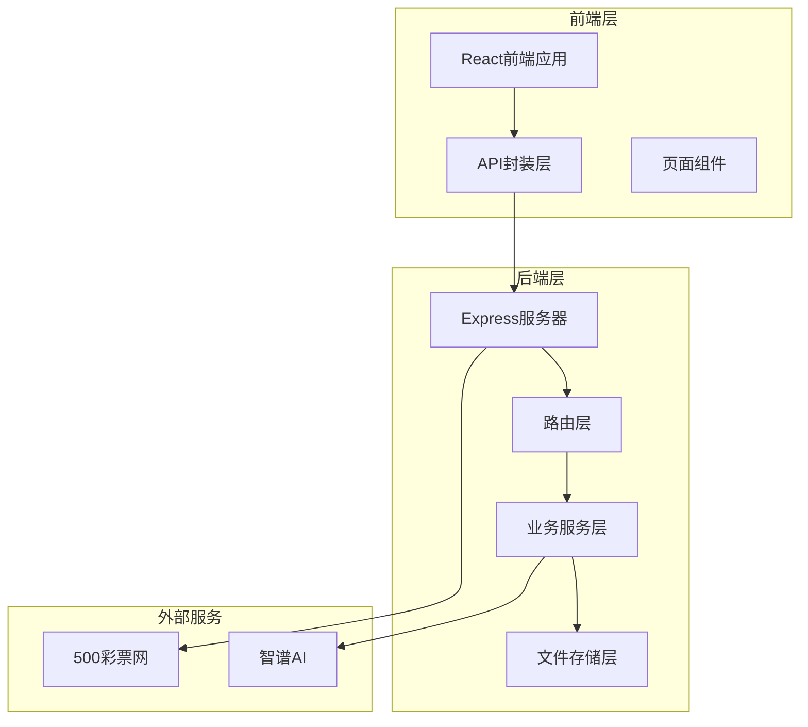
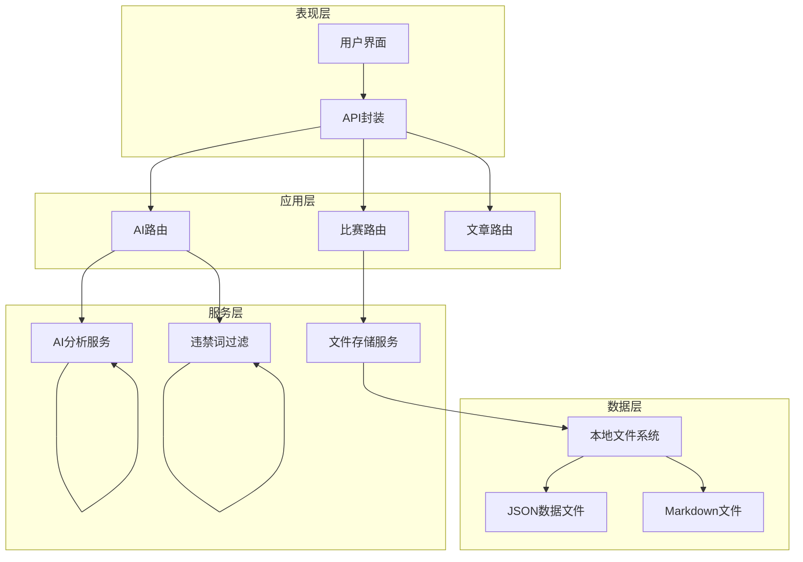
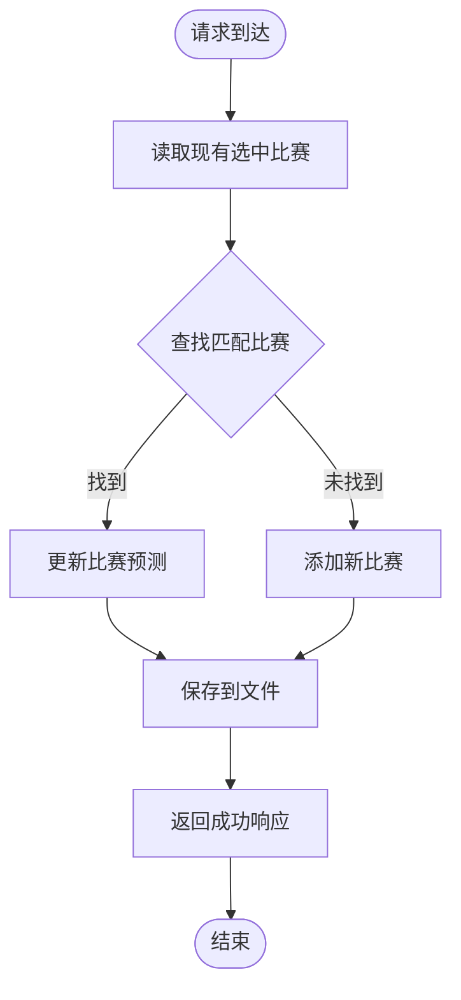
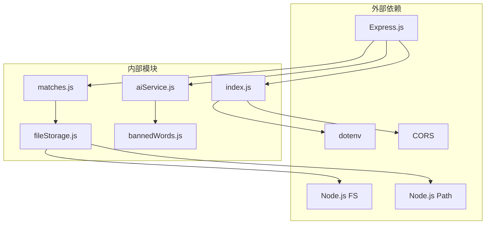
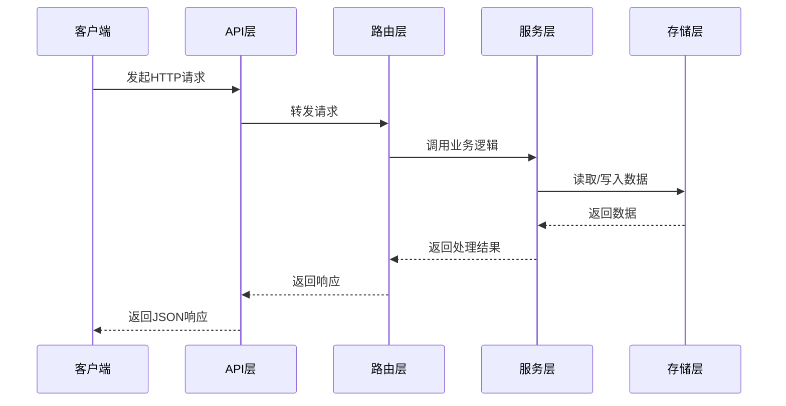

# 比赛数据管理API

<cite>
**本文档引用的文件**
- [server/index.js](file://server/index.js)
- [server/routes/matches.js](file://server/routes/matches.js)
- [server/services/fileStorage.js](file://server/services/fileStorage.js)
- [client/src/api/index.js](file://client/src/api/index.js)
- [PRD.md](file://PRD.md)
- [server/services/aiService.js](file://server/services/aiService.js)
- [server/routes/ai.js](file://server/routes/ai.js)
- [server/services/bannedWords.js](file://server/services/bannedWords.js)
- [client/src/pages/MatchDataPage.jsx](file://client/src/pages/MatchDataPage.jsx)
- [client/src/pages/PredictPage.jsx](file://client/src/pages/PredictPage.jsx)
</cite>

## 目录
1. [简介](#简介)
2. [项目结构](#项目结构)
3. [核心组件](#核心组件)
4. [架构概览](#架构概览)
5. [详细组件分析](#详细组件分析)
6. [依赖关系分析](#依赖关系分析)
7. [性能考虑](#性能考虑)
8. [故障排除指南](#故障排除指南)
9. [结论](#结论)
10. [附录](#附录)

## 简介
AutoMatch是一个面向足球竞彩分析师的本地化工具，集成了赛事数据抓取、智能选场、AI辅助分析、文案生成等功能。本项目专注于比赛数据管理API的设计与实现，为分析师提供完整的比赛数据生命周期管理能力。

## 项目结构
该项目采用前后端分离架构，主要包含以下核心模块：



**图表来源**
- [server/index.js:1-49](file://server/index.js#L1-L49)
- [server/routes/matches.js:1-75](file://server/routes/matches.js#L1-L75)
- [server/services/fileStorage.js:1-196](file://server/services/fileStorage.js#L1-L196)

**章节来源**
- [server/index.js:1-49](file://server/index.js#L1-L49)
- [PRD.md:14-21](file://PRD.md#L14-L21)

## 核心组件
比赛数据管理API的核心组件包括：

### 1. 路由控制器
- **日期管理路由**：处理日期相关的API请求
- **比赛数据路由**：管理比赛数据的增删改查
- **AI分析路由**：集成AI分析功能
- **文案生成路由**：处理公众号和直播文案

### 2. 业务服务层
- **文件存储服务**：负责数据的持久化存储
- **AI服务**：集成智谱AI进行智能分析
- **违禁词过滤**：确保内容合规性

### 3. 前端API封装
- **统一请求处理**：封装fetch请求，统一错误处理
- **业务API映射**：提供直观的函数式API

**章节来源**
- [server/routes/matches.js:1-75](file://server/routes/matches.js#L1-L75)
- [server/services/fileStorage.js:1-196](file://server/services/fileStorage.js#L1-L196)
- [client/src/api/index.js:1-50](file://client/src/api/index.js#L1-L50)

## 架构概览
系统采用分层架构设计，确保各层职责清晰、耦合度低：



**图表来源**
- [server/index.js:6-25](file://server/index.js#L6-L25)
- [server/services/fileStorage.js:4-196](file://server/services/fileStorage.js#L4-L196)
- [server/services/aiService.js:1-212](file://server/services/aiService.js#L1-L212)

## 详细组件分析

### GET /api/matches/dates 接口
该接口用于获取所有有数据的日期列表。

#### 请求参数
- **方法**：GET
- **路径**：/api/matches/dates
- **认证**：无需认证
- **请求体**：无

#### 响应结构
```javascript
{
  success: boolean,      // 操作是否成功
  data: string[]         // 日期数组，格式：YYYY-MM-DD
}
```

#### 错误处理
- 文件系统异常：返回500状态码
- 无数据时返回空数组

**章节来源**
- [server/routes/matches.js:5-15](file://server/routes/matches.js#L5-L15)
- [server/services/fileStorage.js:160-168](file://server/services/fileStorage.js#L160-L168)

### GET /api/matches/:date 接口
该接口用于获取指定日期的比赛数据，包含原始数据和选中数据。

#### 请求参数
- **方法**：GET
- **路径**：/api/matches/:date
- **路径参数**：
  - date (必需)：日期，格式YYYY-MM-DD
- **认证**：无需认证

#### 响应结构
```javascript
{
  success: boolean,
  data: {
    raw: Array,        // 原始比赛数据
    selected: Array    // 选中的重点比赛数据
  }
}
```

#### 数据格式规范
**原始比赛数据结构**：
```javascript
{
  matchId: string,           // 比赛编号
  league: string,            // 联赛名称
  homeTeam: string,          // 主队名称
  awayTeam: string,          // 客队名称
  matchTime: string,         // 比赛时间
  oddsWin: number,           // 主胜赔率
  oddsDraw: number,          // 平局赔率
  oddsLoss: number,          // 客胜赔率
  handicapLine: number,      // 让球数
  handicapWin: number,       // 让球主胜赔率
  handicapDraw: number,      // 让球平局赔率
  handicapLoss: number       // 让球客胜赔率
}
```

**选中比赛数据结构**：
```javascript
{
  matchId: string,           // 比赛编号
  prediction: string,        // 预测结果
  confidence: number,        // 信心指数 (1-5)
  analysisNote: string,      // 分析笔记
  isHot: boolean             // 是否热门比赛
}
```

**章节来源**
- [server/routes/matches.js:17-35](file://server/routes/matches.js#L17-L35)
- [PRD.md:35-50](file://PRD.md#L35-L50)
- [PRD.md:81-88](file://PRD.md#L81-L88)

### PUT /api/matches/:date/select 接口
该接口用于保存选中的重点比赛。

#### 请求参数
- **方法**：PUT
- **路径**：/api/matches/:date/select
- **路径参数**：
  - date (必需)：日期，格式YYYY-MM-DD
- **认证**：无需认证
- **请求体**：
```javascript
{
  selectedMatches: Array    // 选中的比赛数组
}
```

#### 响应结构
```javascript
{
  success: boolean
}
```

#### 参数验证
- **必填字段**：selectedMatches
- **数据类型**：Array
- **长度限制**：根据比赛总数动态确定

#### 最佳实践
- 建议在保存前进行数据完整性验证
- 支持批量操作，提高效率
- 保持数据格式一致性

**章节来源**
- [server/routes/matches.js:37-49](file://server/routes/matches.js#L37-L49)
- [PRD.md:68-74](file://PRD.md#L68-L74)

### PUT /api/matches/:date/predict/:matchId 接口
该接口用于保存单场比赛的预测信息。

#### 请求参数
- **方法**：PUT
- **路径**：/api/matches/:date/predict/:matchId
- **路径参数**：
  - date (必需)：日期，格式YYYY-MM-DD
  - matchId (必需)：比赛编号
- **认证**：无需认证
- **请求体**：
```javascript
{
  prediction: string,        // 预测结果
  confidence: number,        // 信心指数 (1-5)
  analysisNote: string,      // 分析笔记
  isHot: boolean             // 是否热门比赛
}
```

#### 响应结构
```javascript
{
  success: boolean
}
```

#### 处理流程


**图表来源**
- [server/routes/matches.js:51-72](file://server/routes/matches.js#L51-L72)

#### 错误处理
- 比赛不存在：返回404状态码
- 文件写入失败：返回500状态码

**章节来源**
- [server/routes/matches.js:51-72](file://server/routes/matches.js#L51-L72)

### 数据存储架构
系统采用本地文件系统进行数据存储，具有以下特点：

```mermaid
graph TB
subgraph "存储根目录"
Root[~/Desktop/AutoMatch/]
subgraph "日期目录"
DateDir[YYYY-MM-DD/]
subgraph "子目录结构"
RawData[01_原始数据/]
Selected[02_重点比赛/]
AIAnalysis[03_AI分析/]
WeChat[04_公众号文案/]
Live[05_直播文案/]
end
end
end
Root --> DateDir
DateDir --> RawData
DateDir --> Selected
DateDir --> AIAnalysis
DateDir --> WeChat
DateDir --> Live
RawData --> RawJSON[matches.json]
Selected --> SelectedJSON[selected.json]
AIAnalysis --> AnalysisMD[match_{id}_analysis.md]
AIAnalysis --> AllAnalyses[all_analyses.json]
WeChat --> WeChatMD[wechat_article.md]
WeChat --> WeChatJSON[wechat_article.json]
Live --> LiveMD[live_script.md]
Live --> LiveJSON[live_script.json]
```

**图表来源**
- [server/services/fileStorage.js:32-98](file://server/services/fileStorage.js#L32-L98)
- [PRD.md:210-228](file://PRD.md#L210-L228)

**章节来源**
- [server/services/fileStorage.js:1-196](file://server/services/fileStorage.js#L1-L196)
- [PRD.md:205-234](file://PRD.md#L205-L234)

## 依赖关系分析

### 组件依赖图


**图表来源**
- [server/index.js:1-49](file://server/index.js#L1-L49)
- [server/routes/matches.js:1-75](file://server/routes/matches.js#L1-L75)
- [server/services/fileStorage.js:1-196](file://server/services/fileStorage.js#L1-L196)

### 数据流分析


**图表来源**
- [client/src/api/index.js:1-50](file://client/src/api/index.js#L1-L50)
- [server/routes/matches.js:1-75](file://server/routes/matches.js#L1-L75)

**章节来源**
- [client/src/api/index.js:1-50](file://client/src/api/index.js#L1-L50)
- [server/index.js:14-25](file://server/index.js#L14-L25)

## 性能考虑
基于PRD文档中的性能要求，系统在设计时考虑了以下优化策略：

### 性能指标
- **数据抓取**：控制在30秒内完成
- **AI分析**：单场控制在10秒内
- **API响应**：快速响应用户操作

### 优化建议
1. **缓存策略**：对于频繁访问的数据可以考虑内存缓存
2. **批量操作**：支持批量保存选中比赛，减少网络请求
3. **数据压缩**：对于大量数据传输时考虑压缩
4. **异步处理**：长时间运行的操作采用异步处理

## 故障排除指南

### 常见问题及解决方案

#### 1. API请求失败
**症状**：客户端收到错误响应
**可能原因**：
- 服务器未启动
- 路径参数错误
- 文件系统权限问题

**解决步骤**：
1. 检查服务器状态：`curl http://localhost:3001/api/health`
2. 验证路径参数格式
3. 检查数据目录权限

#### 2. 数据无法保存
**症状**：保存操作返回失败
**可能原因**：
- 文件写入权限不足
- 磁盘空间不足
- 目录结构损坏

**解决步骤**：
1. 检查数据目录是否存在
2. 验证磁盘空间
3. 重新创建目录结构

#### 3. AI分析生成失败
**症状**：AI分析接口返回错误
**可能原因**：
- API密钥配置错误
- 网络连接问题
- 智谱AI服务异常

**解决步骤**：
1. 检查环境变量配置
2. 验证网络连接
3. 重试请求

**章节来源**
- [server/services/aiService.js:8-13](file://server/services/aiService.js#L8-L13)
- [server/services/fileStorage.js:9-13](file://server/services/fileStorage.js#L9-L13)

## 结论
AutoMatch比赛数据管理API提供了完整的比赛数据生命周期管理能力，包括数据获取、选场管理、预测录入和AI分析等功能。系统采用模块化设计，具有良好的扩展性和维护性。

### 主要优势
1. **完整的功能覆盖**：从数据抓取到分析生成的全流程支持
2. **灵活的存储方案**：本地文件系统存储，便于备份和迁移
3. **合规的内容处理**：内置违禁词过滤机制
4. **直观的API设计**：RESTful接口设计，易于理解和使用

### 改进建议
1. **增加输入验证**：在路由层增加更严格的参数验证
2. **添加日志记录**：增强系统的可观测性
3. **实现数据校验**：增加数据完整性检查
4. **支持并发控制**：防止多个进程同时修改同一文件

## 附录

### API使用最佳实践

#### 批量操作指南
```javascript
// 批量保存选中比赛
const selectedMatches = [
  { matchId: '周日001', prediction: '主胜', confidence: 4 },
  { matchId: '周日002', prediction: '平局', confidence: 3 }
];

await saveSelected('2026-04-16', selectedMatches);
```

#### 单个操作指南
```javascript
// 保存单场比赛预测
await savePrediction('2026-04-16', '周日001', {
  prediction: '主胜',
  confidence: 4,
  analysisNote: '主队近期状态良好',
  isHot: true
});
```

#### 错误处理模式
```javascript
try {
  const response = await getMatches('2026-04-16');
  if (!response.success) {
    throw new Error(response.error);
  }
  // 处理成功响应
} catch (error) {
  // 处理错误
  console.error('API调用失败:', error.message);
}
```

### 数据格式参考
- **日期格式**：YYYY-MM-DD
- **时间格式**：YYYY-MM-DD HH:mm
- **赔率格式**：数字类型
- **信心指数**：1-5的整数

**章节来源**
- [client/src/pages/MatchDataPage.jsx:15-38](file://client/src/pages/MatchDataPage.jsx#L15-L38)
- [client/src/pages/PredictPage.jsx:101-113](file://client/src/pages/PredictPage.jsx#L101-L113)