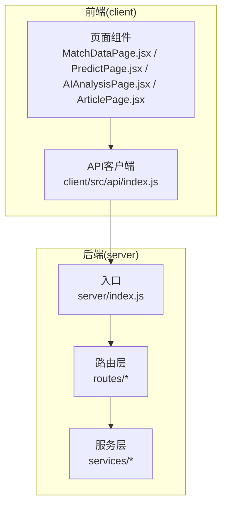
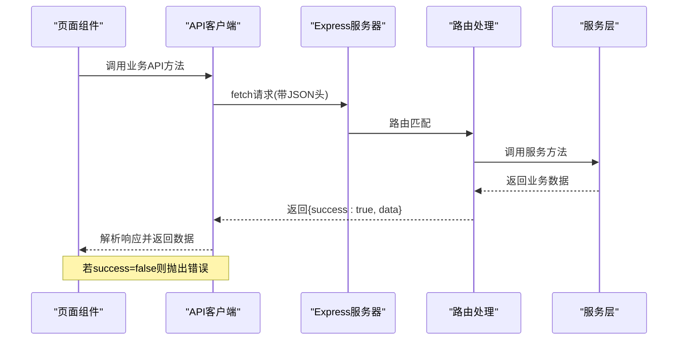
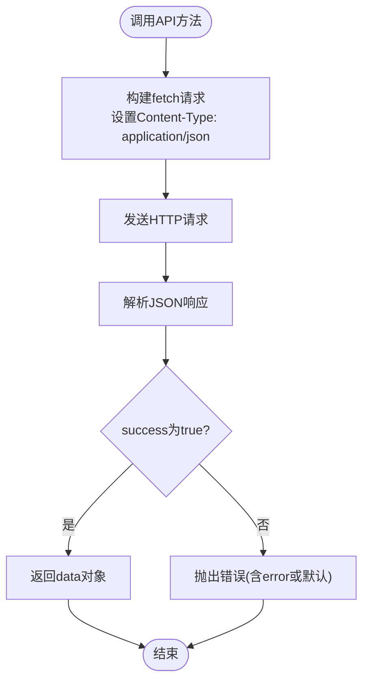
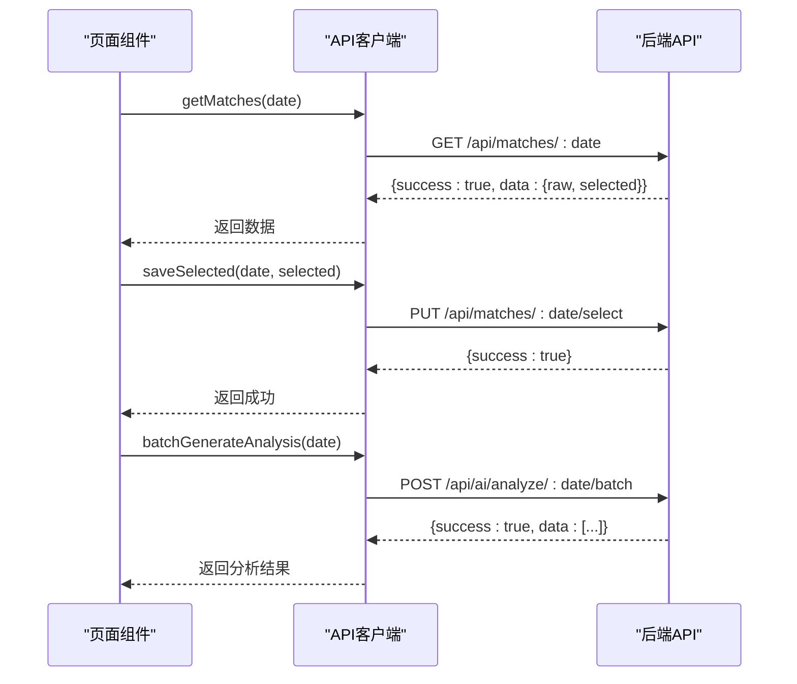
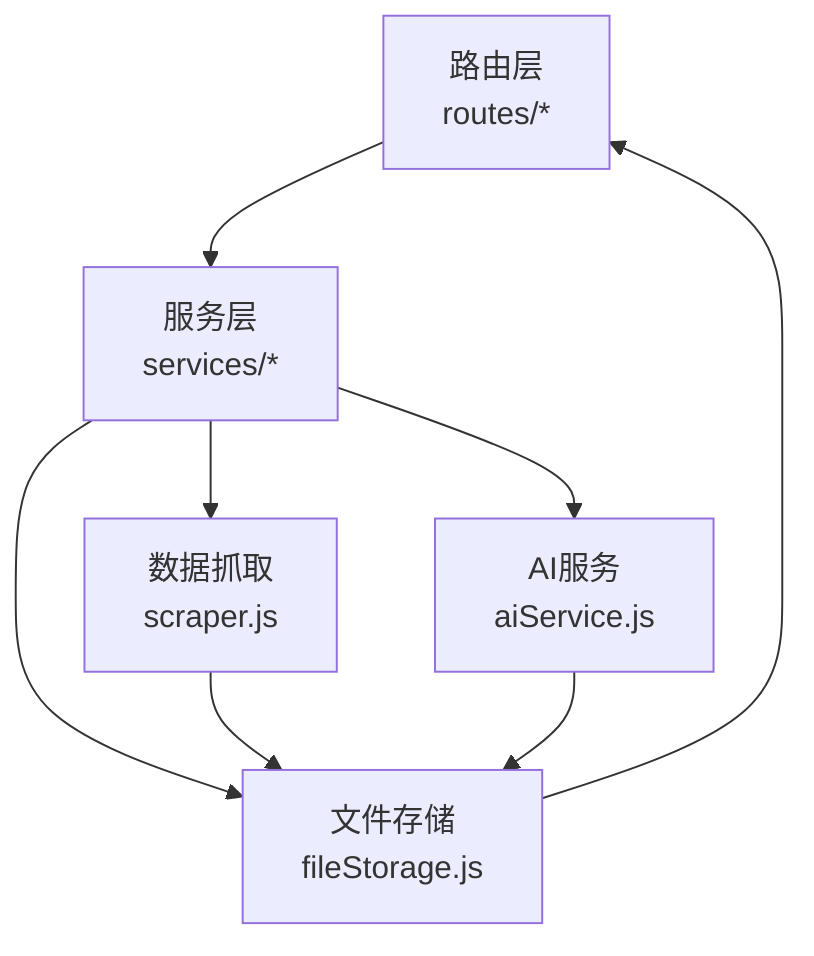
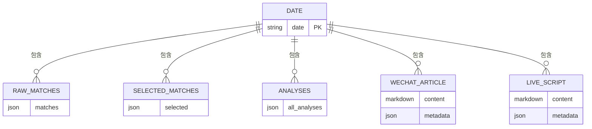
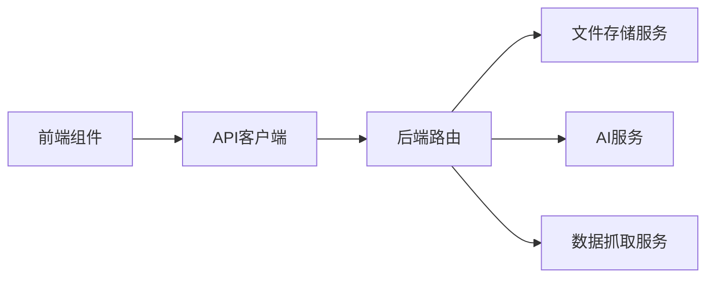

# API客户端集成

<cite>
**本文档引用的文件**
- [client/src/api/index.js](file://client/src/api/index.js)
- [client/src/pages/MatchDataPage.jsx](file://client/src/pages/MatchDataPage.jsx)
- [client/src/pages/PredictPage.jsx](file://client/src/pages/PredictPage.jsx)
- [client/src/pages/AIAnalysisPage.jsx](file://client/src/pages/AIAnalysisPage.jsx)
- [client/src/pages/ArticlePage.jsx](file://client/src/pages/ArticlePage.jsx)
- [server/index.js](file://server/index.js)
- [server/routes/scrape.js](file://server/routes/scrape.js)
- [server/routes/matches.js](file://server/routes/matches.js)
- [server/routes/ai.js](file://server/routes/ai.js)
- [server/routes/articles.js](file://server/routes/articles.js)
- [server/services/scraper.js](file://server/services/scraper.js)
- [server/services/fileStorage.js](file://server/services/fileStorage.js)
- [server/services/aiService.js](file://server/services/aiService.js)
- [PRD.md](file://PRD.md)
</cite>

## 目录
1. [简介](#简介)
2. [项目结构](#项目结构)
3. [核心组件](#核心组件)
4. [架构概览](#架构概览)
5. [详细组件分析](#详细组件分析)
6. [依赖关系分析](#依赖关系分析)
7. [性能考虑](#性能考虑)
8. [故障排除指南](#故障排除指南)
9. [结论](#结论)
10. [附录](#附录)

## 简介
本文件针对AutoMatch项目的API客户端集成进行全面技术文档化，重点覆盖：
- API客户端设计模式与实现细节
- HTTP请求封装、错误处理机制、数据转换与缓存策略
- 与后端服务的通信协议与数据格式
- API调用最佳实践与性能优化技巧
- 具体代码示例与使用指南，便于开发者理解与扩展

AutoMatch是一个面向足球竞彩分析师的本地化工具，前端采用React + Vite + Ant Design，后端采用Node.js + Express，结合Puppeteer进行数据抓取、智谱AI进行智能分析、本地文件系统进行数据持久化。

## 项目结构
项目采用前后端分离架构，前端负责UI交互与API调用，后端提供RESTful API与静态资源服务。

**图表来源**
- [client/src/api/index.js:1-50](file://client/src/api/index.js#L1-L50)
- [server/index.js:1-49](file://server/index.js#L1-L49)

**章节来源**
- [client/src/api/index.js:1-50](file://client/src/api/index.js#L1-L50)
- [server/index.js:1-49](file://server/index.js#L1-L49)

## 核心组件
- API客户端封装：统一的HTTP请求封装函数与模块化导出的业务API方法，支持基础URL前缀、JSON头部、响应体success字段校验与错误抛出。
- 页面组件：四个核心页面组件分别调用不同的API集合，实现数据抓取、选场预测、AI分析与文案生成的完整工作流。
- 后端路由与服务：提供完整的REST接口，配合文件存储服务实现数据持久化与静态资源访问。

关键实现要点：
- 请求封装：统一设置Content-Type为application/json，解析JSON响应体，基于success字段判断业务错误并抛出异常。
- 错误处理：后端路由在try/catch中捕获异常，返回包含success:false与error消息的标准化响应；前端组件在useEffect与事件回调中捕获并提示。
- 数据格式：后端统一返回包含success字段的对象，前端据此决定业务逻辑分支。
- 缓存策略：当前实现未显式引入HTTP缓存头或内存缓存，但可通过前端组件的状态缓存与本地存储策略进行优化。

**章节来源**
- [client/src/api/index.js:1-50](file://client/src/api/index.js#L1-L50)
- [server/routes/scrape.js:1-26](file://server/routes/scrape.js#L1-L26)
- [server/routes/matches.js:1-75](file://server/routes/matches.js#L1-L75)
- [server/routes/ai.js:1-102](file://server/routes/ai.js#L1-L102)
- [server/routes/articles.js:1-113](file://server/routes/articles.js#L1-L113)

## 架构概览
整体架构遵循前后端分离模式，前端通过fetch发起HTTP请求，后端提供REST API并以本地文件系统作为数据存储。

**图表来源**
- [client/src/api/index.js:3-13](file://client/src/api/index.js#L3-L13)
- [server/routes/scrape.js:8-23](file://server/routes/scrape.js#L8-L23)
- [server/routes/matches.js:20-35](file://server/routes/matches.js#L20-L35)
- [server/routes/ai.js:10-34](file://server/routes/ai.js#L10-L34)
- [server/routes/articles.js:10-51](file://server/routes/articles.js#L10-L51)

## 详细组件分析

### API客户端设计与实现
- 设计模式：函数式封装 + 模块化导出，每个业务API独立封装，便于复用与测试。
- HTTP请求封装：统一设置Content-Type为application/json，合并传入的options，确保请求头一致性。
- 错误处理：解析JSON响应后检查success字段，若为false则抛出包含error或默认“请求失败”的错误，便于上层组件捕获与提示。
- 业务API导出：按模块导出抓取、比赛、AI分析、文案生成等API方法，参数与后端路由保持一致。

**图表来源**
- [client/src/api/index.js:3-13](file://client/src/api/index.js#L3-L13)

**章节来源**
- [client/src/api/index.js:1-50](file://client/src/api/index.js#L1-L50)

### 页面组件与API调用流程
- 赛事数据页：调用抓取与获取比赛数据API，展示原始数据与已选比赛状态，支持手动触发抓取与刷新。
- 选场预测页：加载比赛数据，提供智能推荐与手动选择，保存选中比赛与预测信息。
- AI分析页：加载选中比赛与已有分析，批量生成AI分析，支持编辑与复制。
- 文案生成页：加载选中比赛与分析，生成公众号推文与直播文案，支持复制与查看违禁词过滤记录。

**图表来源**
- [client/src/pages/MatchDataPage.jsx:15-23](file://client/src/pages/MatchDataPage.jsx#L15-L23)
- [client/src/pages/PredictPage.jsx:21-29](file://client/src/pages/PredictPage.jsx#L21-L29)
- [client/src/pages/AIAnalysisPage.jsx:20-29](file://client/src/pages/AIAnalysisPage.jsx#L20-L29)
- [client/src/pages/ArticlePage.jsx:26-38](file://client/src/pages/ArticlePage.jsx#L26-L38)

**章节来源**
- [client/src/pages/MatchDataPage.jsx:1-198](file://client/src/pages/MatchDataPage.jsx#L1-L198)
- [client/src/pages/PredictPage.jsx:1-322](file://client/src/pages/PredictPage.jsx#L1-L322)
- [client/src/pages/AIAnalysisPage.jsx:1-203](file://client/src/pages/AIAnalysisPage.jsx#L1-L203)
- [client/src/pages/ArticlePage.jsx:1-267](file://client/src/pages/ArticlePage.jsx#L1-L267)

### 后端API与数据流
- 路由层：定义了抓取、比赛、AI分析、文章生成等REST接口，统一返回{success, data|error}结构。
- 服务层：实现数据抓取、文件存储、AI分析生成等核心逻辑，确保数据一致性与合规性。
- 文件存储：按日期组织目录结构，分别保存原始数据、选中比赛、AI分析、公众号文案、直播文案，支持JSON与Markdown格式。

**图表来源**
- [server/routes/scrape.js:1-26](file://server/routes/scrape.js#L1-L26)
- [server/routes/matches.js:1-75](file://server/routes/matches.js#L1-L75)
- [server/routes/ai.js:1-102](file://server/routes/ai.js#L1-L102)
- [server/routes/articles.js:1-113](file://server/routes/articles.js#L1-L113)
- [server/services/fileStorage.js:1-196](file://server/services/fileStorage.js#L1-L196)
- [server/services/scraper.js:1-295](file://server/services/scraper.js#L1-L295)
- [server/services/aiService.js:1-212](file://server/services/aiService.js#L1-L212)

**章节来源**
- [server/routes/scrape.js:1-26](file://server/routes/scrape.js#L1-L26)
- [server/routes/matches.js:1-75](file://server/routes/matches.js#L1-L75)
- [server/routes/ai.js:1-102](file://server/routes/ai.js#L1-L102)
- [server/routes/articles.js:1-113](file://server/routes/articles.js#L1-L113)
- [server/services/fileStorage.js:1-196](file://server/services/fileStorage.js#L1-L196)
- [server/services/scraper.js:1-295](file://server/services/scraper.js#L1-L295)
- [server/services/aiService.js:1-212](file://server/services/aiService.js#L1-L212)

### 数据模型与存储结构
- 目录结构：按日期分目录，包含原始数据、重点比赛、AI分析、公众号文案、直播文案子目录。
- 文件格式：比赛数据为JSON，AI分析与文案为Markdown，同时提供JSON汇总以便前端读取。
- 数据一致性：AI分析与文案生成时会进行违禁词过滤，确保内容合规。

**图表来源**
- [PRD.md:205-234](file://PRD.md#L205-L234)
- [server/services/fileStorage.js:32-98](file://server/services/fileStorage.js#L32-L98)
- [server/services/fileStorage.js:112-139](file://server/services/fileStorage.js#L112-L139)

**章节来源**
- [PRD.md:205-234](file://PRD.md#L205-L234)
- [server/services/fileStorage.js:1-196](file://server/services/fileStorage.js#L1-L196)

## 依赖关系分析
- 前端依赖：React、Ant Design、dayjs等，API客户端通过原生fetch与后端交互。
- 后端依赖：Express、CORS、Puppeteer、智谱AI SDK、本地文件系统。
- 耦合与内聚：API客户端与页面组件松耦合，通过统一的API方法调用；后端路由与服务层职责清晰，文件存储与AI服务相互独立。

**图表来源**
- [client/src/pages/MatchDataPage.jsx:4](file://client/src/pages/MatchDataPage.jsx#L4)
- [client/src/pages/PredictPage.jsx:4](file://client/src/pages/PredictPage.jsx#L4)
- [client/src/pages/AIAnalysisPage.jsx:4](file://client/src/pages/AIAnalysisPage.jsx#L4)
- [client/src/pages/ArticlePage.jsx:10](file://client/src/pages/ArticlePage.jsx#L10)
- [server/index.js:6-25](file://server/index.js#L6-L25)

**章节来源**
- [client/src/pages/MatchDataPage.jsx:1-198](file://client/src/pages/MatchDataPage.jsx#L1-L198)
- [client/src/pages/PredictPage.jsx:1-322](file://client/src/pages/PredictPage.jsx#L1-L322)
- [client/src/pages/AIAnalysisPage.jsx:1-203](file://client/src/pages/AIAnalysisPage.jsx#L1-L203)
- [client/src/pages/ArticlePage.jsx:1-267](file://client/src/pages/ArticlePage.jsx#L1-L267)
- [server/index.js:1-49](file://server/index.js#L1-L49)

## 性能考虑
- 响应时间目标：根据PRD，抓取操作控制在30秒内，AI分析单场控制在10秒内。
- 前端优化建议：
  - 使用状态缓存：在页面组件中缓存getMatches与getAnalyses的结果，减少重复请求。
  - 批量操作：批量生成AI分析时，前端可显示进度与分片处理，避免长时间阻塞。
  - 防抖与节流：在频繁触发的API调用（如搜索、筛选）中加入防抖/节流。
- 后端优化建议：
  - 数据抓取：合理设置Puppeteer的headless模式与超时参数，避免长时间等待。
  - AI调用：控制temperature与max_tokens，平衡质量与速度。
  - 文件I/O：批量写入时使用异步方法，避免阻塞主线程。

[本节为通用性能指导，无需具体文件分析]

## 故障排除指南
- 常见错误类型：
  - 网络错误：fetch请求失败或跨域问题，检查CORS配置与代理设置。
  - 业务错误：后端返回success:false，前端需根据error消息提示用户。
  - 数据缺失：文件存储中缺少必要文件导致读取失败，需确认数据抓取与保存流程。
- 排查步骤：
  - 检查后端健康检查接口与日志输出。
  - 确认环境变量（如ZHIPU_API_KEY、DATA_DIR）配置正确。
  - 验证API返回格式与前端解析逻辑一致。
- 建议的日志与监控：
  - 前端：在API调用前后记录请求与响应，便于定位问题。
  - 后端：在路由与服务层增加错误日志与性能指标。

**章节来源**
- [server/index.js:40-48](file://server/index.js#L40-L48)
- [server/routes/scrape.js:16-22](file://server/routes/scrape.js#L16-L22)
- [server/routes/ai.js:30-33](file://server/routes/ai.js#L30-L33)
- [server/routes/articles.js:47-50](file://server/routes/articles.js#L47-L50)

## 结论
AutoMatch的API客户端集成采用简洁而稳健的设计：前端通过统一的API封装与模块化导出，实现对后端REST接口的清晰调用；后端通过路由与服务层分离，确保业务逻辑与数据持久化的解耦。整体架构满足本地化运行、数据合规与性能目标的要求。建议在现有基础上进一步完善前端缓存策略与错误恢复机制，以提升用户体验与系统稳定性。

[本节为总结性内容，无需具体文件分析]

## 附录

### API调用最佳实践
- 请求头：统一设置Content-Type为application/json，确保后端正确解析。
- 错误处理：始终检查success字段，业务错误与网络错误分别处理。
- 参数传递：日期与比赛ID等参数需与后端路由严格一致。
- 数据转换：前端对返回数据进行必要的字段映射与格式化。

### 性能优化技巧
- 前端：使用状态缓存、批量请求、防抖/节流。
- 后端：合理配置Puppeteer与AI调用参数，优化文件I/O性能。

### 使用指南
- 初始化：确保后端服务启动并监听端口，前端通过Vite开发服务器访问。
- 环境配置：配置ZHIPU_API_KEY与DATA_DIR等环境变量。
- 页面操作：按页面流程依次完成数据抓取、选场预测、AI分析与文案生成。

**章节来源**
- [PRD.md:274-288](file://PRD.md#L274-L288)
- [server/index.js:14-19](file://server/index.js#L14-L19)