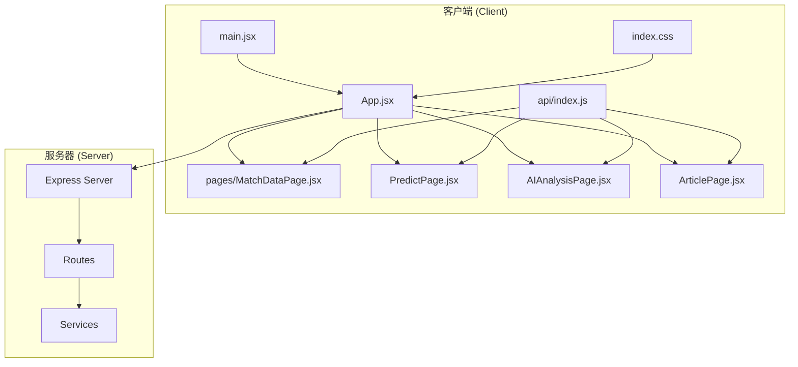
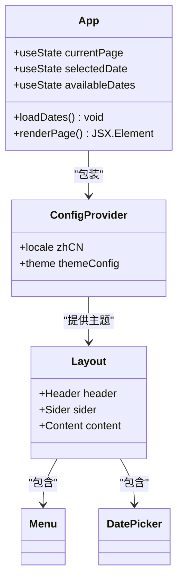
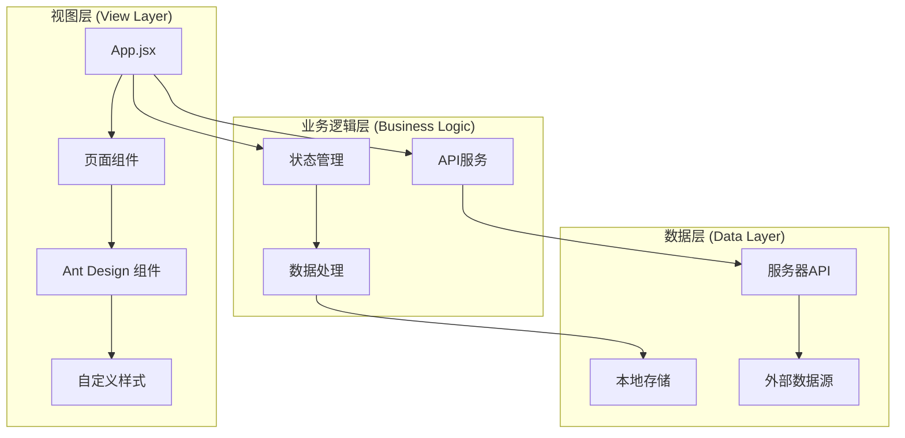
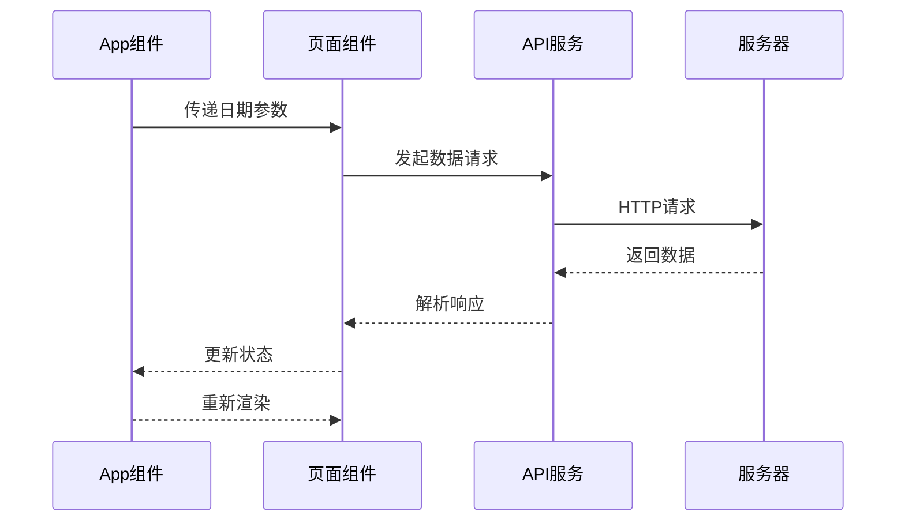
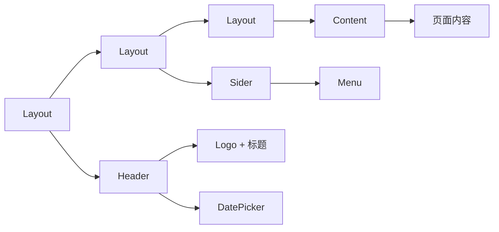
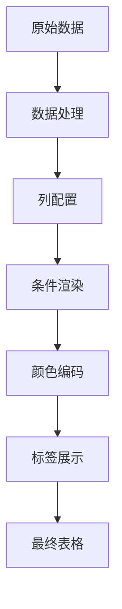
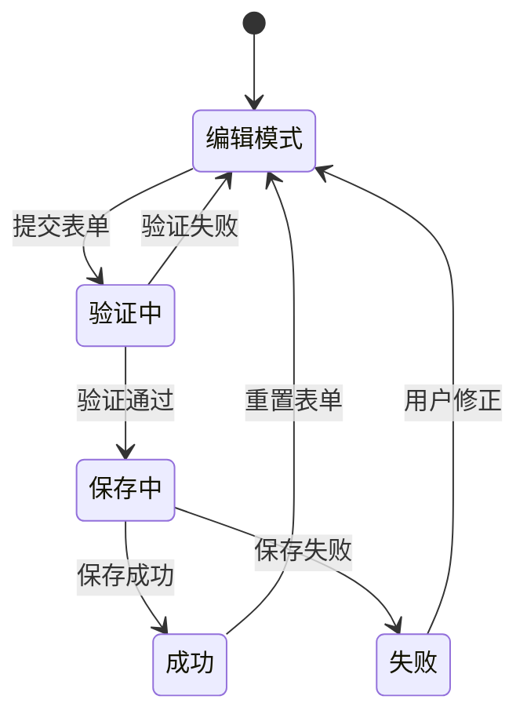
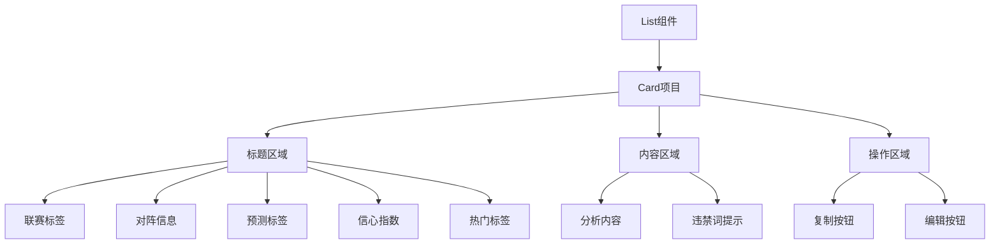
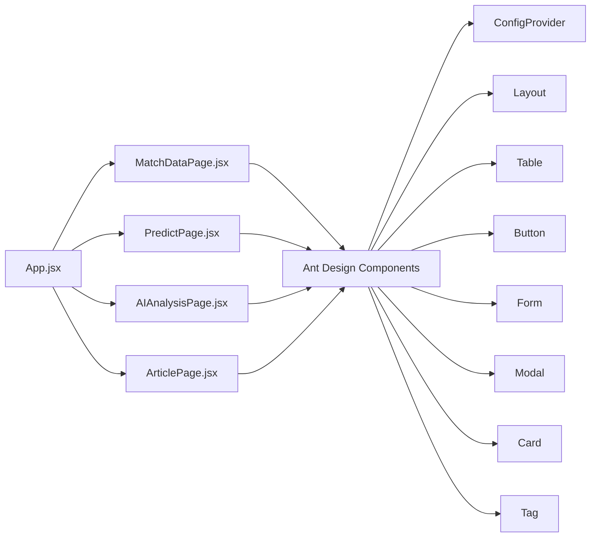
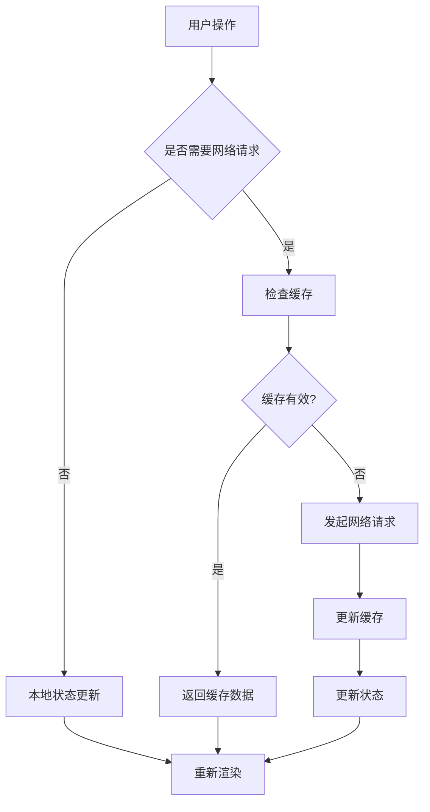

# UI组件设计规范

<cite>
**本文档引用的文件**
- [App.jsx](file://client/src/App.jsx)
- [main.jsx](file://client/src/main.jsx)
- [index.css](file://client/src/index.css)
- [MatchDataPage.jsx](file://client/src/pages/MatchDataPage.jsx)
- [PredictPage.jsx](file://client/src/pages/PredictPage.jsx)
- [AIAnalysisPage.jsx](file://client/src/pages/AIAnalysisPage.jsx)
- [ArticlePage.jsx](file://client/src/pages/ArticlePage.jsx)
- [api/index.js](file://client/src/api/index.js)
- [package.json](file://client/package.json)
- [vite.config.js](file://client/vite.config.js)
- [PRD.md](file://PRD.md)
</cite>

## 目录
1. [简介](#简介)
2. [项目结构](#项目结构)
3. [核心组件](#核心组件)
4. [架构概览](#架构概览)
5. [详细组件分析](#详细组件分析)
6. [依赖分析](#依赖分析)
7. [性能考虑](#性能考虑)
8. [故障排除指南](#故障排除指南)
9. [结论](#结论)
10. [附录](#附录)

## 简介

AutoMatch是一个基于React + Ant Design的足球赛事智能分析工具，专为竞彩分析师设计。本项目集成了赛事数据抓取、智能选场、AI辅助分析、文案生成等核心功能，旨在帮助分析师高效完成每日赛事分析、公众号推文和直播文案撰写工作。

本UI组件设计规范文档深入分析了Ant Design组件的使用和定制策略，包括主题配置、样式覆盖和响应式设计，为开发者提供统一的视觉规范和最佳实践指导。

## 项目结构

AutoMatch采用前后端分离的架构设计，前端使用React + Vite + Ant Design技术栈构建。



**图表来源**
- [main.jsx:1-11](file://client/src/main.jsx#L1-L11)
- [App.jsx:1-117](file://client/src/App.jsx#L1-L117)

**章节来源**
- [main.jsx:1-11](file://client/src/main.jsx#L1-L11)
- [package.json:1-31](file://client/package.json#L1-L31)

## 核心组件

### 主应用容器 (App.jsx)

App组件作为整个应用的根容器，负责全局状态管理和页面路由切换。它集成了Ant Design的ConfigProvider组件，实现了全局主题配置和国际化设置。



**图表来源**
- [App.jsx:23-117](file://client/src/App.jsx#L23-L117)

### 页面组件架构

四个核心页面组件都遵循统一的设计模式：

1. **MatchDataPage**: 赛事数据展示和抓取
2. **PredictPage**: 智能选场和预测录入  
3. **AIAnalysisPage**: AI分析生成和编辑
4. **ArticlePage**: 文案生成和管理

每个页面都使用Ant Design的Card、Table、Button等基础组件构建，确保视觉一致性。

**章节来源**
- [App.jsx:48-56](file://client/src/App.jsx#L48-L56)
- [MatchDataPage.jsx:6-198](file://client/src/pages/MatchDataPage.jsx#L6-L198)
- [PredictPage.jsx:9-322](file://client/src/pages/PredictPage.jsx#L9-L322)
- [AIAnalysisPage.jsx:9-203](file://client/src/pages/AIAnalysisPage.jsx#L9-L203)
- [ArticlePage.jsx:14-267](file://client/src/pages/ArticlePage.jsx#L14-L267)

## 架构概览

AutoMatch采用分层架构设计，确保组件间的松耦合和高内聚。



**图表来源**
- [App.jsx:14-15](file://client/src/App.jsx#L14-L15)
- [api/index.js:1-50](file://client/src/api/index.js#L1-L50)

### 组件通信机制



**图表来源**
- [App.jsx:24-39](file://client/src/App.jsx#L24-L39)
- [api/index.js:15-50](file://client/src/api/index.js#L15-L50)

## 详细组件分析

### 主题系统设计

AutoMatch采用Ant Design的ConfigProvider组件实现全局主题配置，确保整个应用的视觉一致性。

#### 主题配置要点

| 配置项 | 值 | 说明 |
|--------|-----|------|
| colorPrimary | #1677ff | 主色调，用于主要操作按钮和链接 |
| borderRadius | 8 | 圆角半径，统一组件边角样式 |
| algorithm | defaultAlgorithm | 默认算法，确保颜色层次正确 |

#### 国际化配置

应用支持中文界面，通过zhCN locale实现完整的中文本地化。

**章节来源**
- [App.jsx:59-65](file://client/src/App.jsx#L59-L65)
- [App.jsx:16](file://client/src/App.jsx#L16)

### 布局系统实现

应用采用Ant Design的Layout组件实现响应式布局，支持桌面端和移动端的自适应。

#### 布局层次结构



**图表来源**
- [App.jsx:21-113](file://client/src/App.jsx#L21-L113)

#### 响应式设计策略

- **桌面端**: 180px宽度的侧边栏菜单，内容区域自适应
- **移动端**: 通过Ant Design的响应式断点自动调整布局
- **触摸设备**: 所有交互元素保持足够的点击面积

**章节来源**
- [App.jsx:66-113](file://client/src/App.jsx#L66-L113)

### 表格组件优化

MatchDataPage和PredictPage都使用Ant Design的Table组件展示大量数据，针对性能和用户体验进行了专门优化。

#### 表格特性配置

| 特性 | 配置 | 作用 |
|------|------|------|
| scroll.x | 1300/1100 | 横向滚动支持，避免列重叠 |
| pagination | false | 手动分页控制，提升大数据量性能 |
| size | middle | 中等尺寸，平衡可读性和空间占用 |
| rowClassName | 条件样式 | 高亮显示选中行 |

#### 数据可视化设计



**图表来源**
- [MatchDataPage.jsx:42-143](file://client/src/pages/MatchDataPage.jsx#L42-L143)
- [PredictPage.jsx:146-252](file://client/src/pages/PredictPage.jsx#L146-L252)

**章节来源**
- [MatchDataPage.jsx:177-185](file://client/src/pages/MatchDataPage.jsx#L177-L185)
- [PredictPage.jsx:278-286](file://client/src/pages/PredictPage.jsx#L278-L286)

### 表单组件设计

PredictPage和AIAnalysisPage使用Ant Design的Form组件实现复杂的表单交互。

#### 表单设计原则

1. **清晰的字段分组**: 使用Card组件将相关字段组织在一起
2. **直观的标签**: 使用语义化的标签描述字段含义
3. **合理的默认值**: 提供合理的初始值减少用户输入
4. **实时验证**: 使用Form.Item的rules实现即时错误提示

#### 表单交互模式



**图表来源**
- [PredictPage.jsx:116-144](file://client/src/pages/PredictPage.jsx#L116-L144)

**章节来源**
- [PredictPage.jsx:115-144](file://client/src/pages/PredictPage.jsx#L115-L144)
- [AIAnalysisPage.jsx:49-58](file://client/src/pages/AIAnalysisPage.jsx#L49-L58)

### 弹窗组件使用

PredictPage使用Modal组件实现预测编辑功能，提供非侵入式的交互体验。

#### 弹窗设计要点

- **尺寸控制**: 设置合适的宽度(560px)确保内容完整显示
- **内容组织**: 使用垂直布局的Form组织复杂表单字段
- **操作反馈**: 提供明确的确认和取消按钮
- **状态管理**: 使用独立的状态控制弹窗的打开和关闭

**章节来源**
- [PredictPage.jsx:288-313](file://client/src/pages/PredictPage.jsx#L288-L313)

### 列表组件应用

AIAnalysisPage使用List组件展示AI分析结果，结合Card组件提供卡片式布局。

#### 列表设计模式



**图表来源**
- [AIAnalysisPage.jsx:115-199](file://client/src/pages/AIAnalysisPage.jsx#L115-L199)

**章节来源**
- [AIAnalysisPage.jsx:115-199](file://client/src/pages/AIAnalysisPage.jsx#L115-L199)

### 标签和徽章系统

应用广泛使用Ant Design的Tag组件进行状态标识和分类展示。

#### 标签设计规范

| 标签类型 | 颜色方案 | 使用场景 |
|----------|----------|----------|
| 联赛标签 | 橙色系 | 标识比赛所属联赛 |
| 编号标签 | 蓝色系 | 显示比赛唯一标识 |
| 状态标签 | 金色/灰色 | 显示选中状态 |
| 热门标签 | 红色系 | 标识热门比赛 |
| 违禁词标签 | 橙色系 | 提示过滤的违禁词 |

**章节来源**
- [MatchDataPage.jsx:55-141](file://client/src/pages/MatchDataPage.jsx#L55-L141)
- [PredictPage.jsx:158-251](file://client/src/pages/PredictPage.jsx#L158-L251)

## 依赖分析

### 技术栈依赖关系

```mermaid
graph TD
A[React 19.2.4] --> B[Ant Design 6.3.5]
A --> C[Day.js 1.11.20]
B --> D[@ant-design/icons]
E[Vite 8.0.4] --> A
E --> F[@vitejs/plugin-react]
G[ESLint] --> H[eslint-plugin-react-hooks]
G --> I[eslint-plugin-react-refresh]
```

**图表来源**
- [package.json:12-28](file://client/package.json#L12-L28)

### 组件依赖关系



**图表来源**
- [App.jsx:10-13](file://client/src/App.jsx#L10-L13)
- [MatchDataPage.jsx:2-4](file://client/src/pages/MatchDataPage.jsx#L2-L4)

**章节来源**
- [package.json:12-28](file://client/package.json#L12-L28)

## 性能考虑

### 渲染性能优化

1. **虚拟滚动**: 对于大量数据的表格，考虑使用虚拟滚动技术
2. **懒加载**: 图片和长列表内容采用懒加载策略
3. **防抖处理**: 输入框的搜索和筛选操作使用防抖优化
4. **状态分割**: 将大型状态对象分割为多个小状态，减少不必要的重渲染

### 网络请求优化



**图表来源**
- [api/index.js:3-13](file://client/src/api/index.js#L3-L13)

### 移动端性能优化

1. **触摸友好**: 所有交互元素至少44px点击区域
2. **内存管理**: 及时清理事件监听器和定时器
3. **图片优化**: 使用适当的图片格式和尺寸
4. **网络优化**: 实现离线缓存和增量更新

## 故障排除指南

### 常见问题诊断

#### 主题配置问题

**症状**: 组件样式不符合预期
**解决方案**: 
1. 检查ConfigProvider的theme配置
2. 确认colorPrimary值的有效性
3. 验证算法兼容性

#### 布局异常问题

**症状**: 页面布局错乱或组件重叠
**解决方案**:
1. 检查Layout组件的嵌套结构
2. 验证Sider和Content的宽度设置
3. 确认响应式断点配置

#### 表格性能问题

**症状**: 大数据量表格渲染缓慢
**解决方案**:
1. 实现虚拟滚动
2. 减少列的数量和复杂度
3. 使用分页或无限滚动

**章节来源**
- [App.jsx:59-65](file://client/src/App.jsx#L59-L65)
- [MatchDataPage.jsx:177-185](file://client/src/pages/MatchDataPage.jsx#L177-L185)

### 调试技巧

1. **React DevTools**: 使用组件树检查组件层级
2. **Ant Design调试**: 利用组件的className进行样式调试
3. **网络监控**: 检查API请求的响应时间和错误
4. **性能分析**: 使用浏览器性能面板分析渲染性能

## 结论

AutoMatch的UI组件设计规范体现了现代前端开发的最佳实践，通过合理运用Ant Design组件库和React生态系统的工具，实现了高度一致性和良好的用户体验。

### 设计优势

1. **一致性**: 全局主题配置确保视觉风格统一
2. **可维护性**: 组件化设计便于代码维护和扩展
3. **性能**: 针对大数据量的优化策略保证了良好性能
4. **可访问性**: 符合无障碍设计标准，支持键盘导航

### 改进建议

1. **暗色模式**: 考虑添加暗色主题支持
2. **动画效果**: 添加适度的过渡动画提升用户体验
3. **国际化**: 扩展多语言支持
4. **可测试性**: 增加单元测试覆盖率

## 附录

### 设计原则总结

1. **简洁性**: 保持界面简洁，避免视觉噪音
2. **一致性**: 统一的颜色、字体和间距标准
3. **可用性**: 优先考虑用户的操作习惯和需求
4. **可扩展性**: 为未来功能扩展预留空间

### 视觉规范对照表

| 设计要素 | 规范值 | 用途 |
|----------|--------|------|
| 主色调 | #1677ff | 主要操作按钮和链接 |
| 辅助色 | #722ed1 | 特殊功能按钮 |
| 背景色 | #fff | 内容区域背景 |
| 字体大小 | 14px | 正文字体 |
| 间距标准 | 8px网格系统 | 组件间距 |
| 圆角半径 | 8px | 组件边角 |
| 阴影效果 | 浅阴影 | 卡片和浮层 |

### 组件复用策略

1. **高阶组件**: 将通用功能封装为高阶组件
2. **自定义Hook**: 提取可复用的业务逻辑
3. **组件库**: 建立内部组件库，统一风格
4. **样式系统**: 使用CSS变量和主题系统