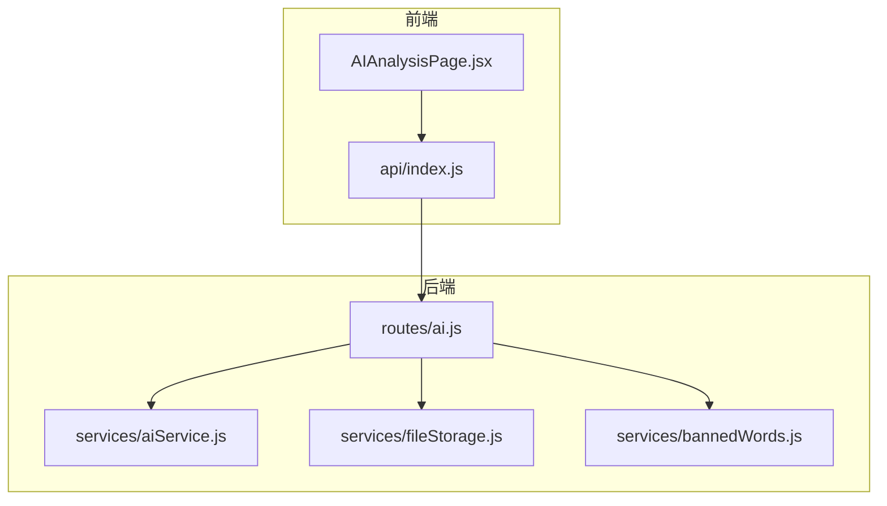
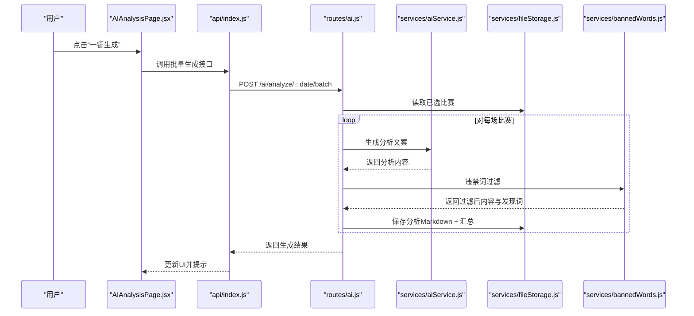
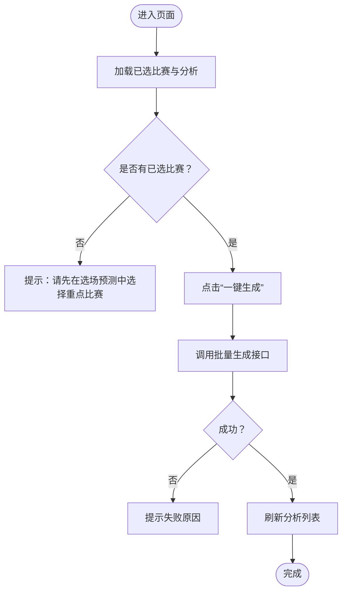
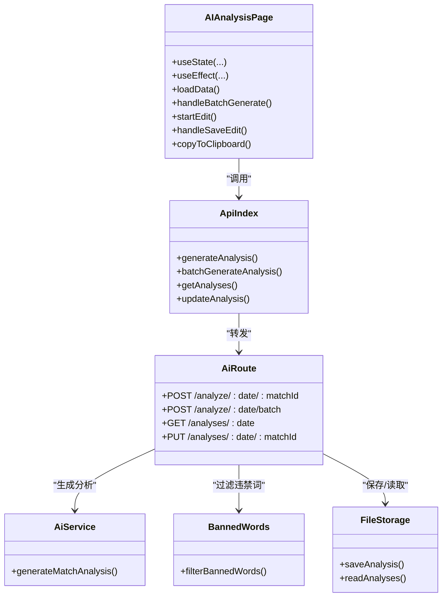

# AI分析页面

<cite>
**本文引用的文件**
- [AIAnalysisPage.jsx](file://client/src/pages/AIAnalysisPage.jsx)
- [index.js](file://client/src/api/index.js)
- [ai.js](file://server/routes/ai.js)
- [aiService.js](file://server/services/aiService.js)
- [bannedWords.js](file://server/services/bannedWords.js)
- [fileStorage.js](file://server/services/fileStorage.js)
- [PRD.md](file://PRD.md)
</cite>

## 目录
1. [简介](#简介)
2. [项目结构](#项目结构)
3. [核心组件](#核心组件)
4. [架构总览](#架构总览)
5. [详细组件分析](#详细组件分析)
6. [依赖关系分析](#依赖关系分析)
7. [性能考量](#性能考量)
8. [故障排查指南](#故障排查指南)
9. [结论](#结论)
10. [附录](#附录)

## 简介
本文件针对 AutoMatch 的 AI 分析页面进行深入技术文档化，围绕 AIAnalysisPage 组件的设计与实现展开，涵盖以下主题：
- AI 分析触发机制（单场与批量）
- 分析结果展示与编辑保存
- 违禁词过滤与合规性检查
- 文本复制与历史记录管理
- 组件与后端 AI 服务的集成方式
- 错误处理策略与用户体验优化

## 项目结构
AI 分析页面位于前端 React 应用中，通过统一的 API 封装层与后端 Express 路由对接；后端路由再调用 AI 服务与文件存储服务，实现从数据抓取、选场预测、AI 分析到文案生成的完整链路。

图表来源
- [AIAnalysisPage.jsx:1-203](file://client/src/pages/AIAnalysisPage.jsx#L1-L203)
- [index.js:1-50](file://client/src/api/index.js#L1-L50)
- [ai.js:1-102](file://server/routes/ai.js#L1-L102)
- [aiService.js:1-212](file://server/services/aiService.js#L1-L212)
- [fileStorage.js:1-196](file://server/services/fileStorage.js#L1-L196)
- [bannedWords.js:1-114](file://server/services/bannedWords.js#L1-L114)

章节来源
- [AIAnalysisPage.jsx:1-203](file://client/src/pages/AIAnalysisPage.jsx#L1-L203)
- [index.js:1-50](file://client/src/api/index.js#L1-L50)
- [ai.js:1-102](file://server/routes/ai.js#L1-L102)
- [aiService.js:1-212](file://server/services/aiService.js#L1-L212)
- [fileStorage.js:1-196](file://server/services/fileStorage.js#L1-L196)
- [bannedWords.js:1-114](file://server/services/bannedWords.js#L1-L114)

## 核心组件
- AIAnalysisPage.jsx：负责渲染“已选比赛”列表，触发 AI 分析，展示与编辑分析内容，复制文本，以及统计展示。
- api/index.js：封装前端与后端交互的请求方法，统一错误处理与响应结构。
- routes/ai.js：提供 AI 分析的 REST 接口，包括单场生成、批量生成、查询与更新分析。
- services/aiService.js：封装智谱 AI 的调用，构造 Prompt，生成分析文案。
- services/bannedWords.js：提供违禁词过滤与合规检查。
- services/fileStorage.js：负责按日期组织的数据目录结构，保存/读取分析与文案。

章节来源
- [AIAnalysisPage.jsx:1-203](file://client/src/pages/AIAnalysisPage.jsx#L1-L203)
- [index.js:1-50](file://client/src/api/index.js#L1-L50)
- [ai.js:1-102](file://server/routes/ai.js#L1-L102)
- [aiService.js:1-212](file://server/services/aiService.js#L1-L212)
- [bannedWords.js:1-114](file://server/services/bannedWords.js#L1-L114)
- [fileStorage.js:1-196](file://server/services/fileStorage.js#L1-L196)

## 架构总览
AI 分析页面的端到端流程如下：
- 用户在页面点击“一键生成所有AI分析”，前端调用批量生成接口。
- 后端路由读取“已选比赛”，逐场调用 AI 服务生成分析文案。
- AI 服务调用智谱 GLM-4，返回分析内容。
- 后端对分析内容执行违禁词过滤，记录发现的违禁词。
- 过滤后的分析内容写入文件存储（Markdown + 汇总 JSON），并返回给前端。
- 前端刷新列表，展示分析内容与违禁词提示，并支持复制与编辑保存。

图表来源
- [AIAnalysisPage.jsx:31-47](file://client/src/pages/AIAnalysisPage.jsx#L31-L47)
- [index.js:35-36](file://client/src/api/index.js#L35-L36)
- [ai.js:39-69](file://server/routes/ai.js#L39-L69)
- [aiService.js:18-65](file://server/services/aiService.js#L18-L65)
- [bannedWords.js:70-96](file://server/services/bannedWords.js#L70-L96)
- [fileStorage.js:74-98](file://server/services/fileStorage.js#L74-L98)

## 详细组件分析

### 组件：AIAnalysisPage.jsx
- 状态管理
  - selected：当前日期“已选比赛”列表（来自后端 matches 接口）
  - analyses：当前日期“AI分析”列表（来自后端 analyses 接口）
  - loading：批量生成时的加载态
  - editingId/editContent：编辑模式的状态，支持逐条编辑与保存
- 生命周期
  - 组件挂载与日期变更时，拉取“已选比赛”和“AI分析”数据
- 交互逻辑
  - handleBatchGenerate：校验已选比赛数量，调用批量生成接口，提示成功/失败，刷新数据
  - startEdit/handleSaveEdit：进入/退出编辑模式并保存修改
  - copyToClipboard：复制分析内容到剪贴板
  - getMatchInfo/getAnalysis：辅助函数，从 selected 和 analyses 中查找对应数据
- 展示逻辑
  - 列表卡片展示比赛信息、分析师预测、信心指数、是否热门等标签
  - 若已有分析：显示内容与违禁词提示；若无分析：提示“暂无AI分析”
  - 编辑模式：提供文本域与保存/取消按钮
  - 顶部操作区：一键生成、刷新、统计信息

图表来源
- [AIAnalysisPage.jsx:16-47](file://client/src/pages/AIAnalysisPage.jsx#L16-L47)

章节来源
- [AIAnalysisPage.jsx:1-203](file://client/src/pages/AIAnalysisPage.jsx#L1-L203)

### API 封装：api/index.js
- 统一封装 fetch 请求，约定后端返回 { success, data|error } 结构
- 提供 AI 分析相关方法：
  - generateAnalysis(date, matchId)
  - batchGenerateAnalysis(date)
  - getAnalyses(date)
  - updateAnalysis(date, matchId, content)

章节来源
- [index.js:1-50](file://client/src/api/index.js#L1-L50)

### 后端路由：routes/ai.js
- 单场分析：POST /api/ai/analyze/:date/:matchId
  - 读取已选比赛，校验 matchId
  - 调用 AI 服务生成分析
  - 违禁词过滤，记录发现的违禁词
  - 保存至文件存储，返回分析结果
- 批量分析：POST /api/ai/analyze/:date/batch
  - 读取已选比赛，逐场生成并过滤，保存，返回结果数组
- 查询分析：GET /api/ai/analyses/:date
- 更新分析：PUT /api/ai/analyses/:date/:matchId

章节来源
- [ai.js:1-102](file://server/routes/ai.js#L1-L102)

### AI 服务：services/aiService.js
- 客户端初始化：从环境变量读取 API Key，校验有效性
- generateMatchAnalysis(matchData)
  - 构造 Prompt，调用智谱 GLM-4 chat.completions
  - 返回标准化的分析对象（包含 matchId、teams、prediction、content、createdAt）
- generateWechatArticle/handleLiveScript：用于公众号与直播文案生成（本页面不直接调用）

章节来源
- [aiService.js:1-212](file://server/services/aiService.js#L1-L212)

### 违禁词过滤：services/bannedWords.js
- 违禁词映射表：覆盖盘口、赔率、投注、博彩、赌博、让球等敏感词
- 过滤算法：按词长降序匹配，优先替换为对应词或删除
- 输出：过滤后文本与发现的违禁词列表

章节来源
- [bannedWords.js:1-114](file://server/services/bannedWords.js#L1-L114)

### 文件存储：services/fileStorage.js
- 目录结构：按日期分目录，包含原始数据、重点比赛、AI分析、公众号文案、直播文案
- 保存/读取：
  - saveAnalysis：保存 Markdown 单场分析 + 更新 all_analyses.json 汇总
  - readAnalyses：读取汇总 JSON
- 其他：saveSelectedMatches/readSelectedMatches、saveWechatArticle/saveLiveScript、getAvailableDates 等

章节来源
- [fileStorage.js:1-196](file://server/services/fileStorage.js#L1-L196)

## 依赖关系分析

图表来源
- [AIAnalysisPage.jsx:1-203](file://client/src/pages/AIAnalysisPage.jsx#L1-L203)
- [index.js:1-50](file://client/src/api/index.js#L1-L50)
- [ai.js:1-102](file://server/routes/ai.js#L1-L102)
- [aiService.js:1-212](file://server/services/aiService.js#L1-L212)
- [bannedWords.js:1-114](file://server/services/bannedWords.js#L1-L114)
- [fileStorage.js:1-196](file://server/services/fileStorage.js#L1-L196)

章节来源
- [AIAnalysisPage.jsx:1-203](file://client/src/pages/AIAnalysisPage.jsx#L1-L203)
- [index.js:1-50](file://client/src/api/index.js#L1-L50)
- [ai.js:1-102](file://server/routes/ai.js#L1-L102)
- [aiService.js:1-212](file://server/services/aiService.js#L1-L212)
- [bannedWords.js:1-114](file://server/services/bannedWords.js#L1-L114)
- [fileStorage.js:1-196](file://server/services/fileStorage.js#L1-L196)

## 性能考量
- 单场生成耗时：AI 服务设置合理的 max_tokens 与温度参数，确保生成稳定且快速
- 批量生成：逐场顺序执行，若需提升吞吐，可考虑并发限制与错误聚合
- 前端渲染：列表按列网格渲染，避免一次性渲染过多节点；编辑模式仅在当前行激活
- 存储写入：批量保存时先写 Markdown，再更新汇总 JSON，减少重复 IO

[本节为通用性能建议，无需特定文件引用]

## 故障排查指南
- AI 服务不可用
  - 确认环境变量 ZHIPU_API_KEY 已正确配置
  - 检查网络连通性与智谱 API 可用性
- 生成失败
  - 后端会捕获异常并返回错误信息；前端提示具体失败原因
  - 检查已选比赛是否存在、matchId 是否匹配
- 违禁词过滤问题
  - 若发现违禁词未被替换，检查映射表是否覆盖该词
  - 过滤后文本可能存在多余空格，系统已做清理
- 分析内容未显示
  - 确认文件存储目录存在且 all_analyses.json 可读
  - 刷新页面或重新生成分析
- 编辑保存失败
  - 检查后端更新接口返回的 success 字段
  - 确认日期与 matchId 参数正确

章节来源
- [aiService.js:8-13](file://server/services/aiService.js#L8-L13)
- [ai.js:30-34](file://server/routes/ai.js#L30-L34)
- [bannedWords.js:70-96](file://server/services/bannedWords.js#L70-L96)
- [fileStorage.js:103-107](file://server/services/fileStorage.js#L103-L107)

## 结论
AI 分析页面通过清晰的前端组件与后端路由协作，实现了从“已选比赛”到“AI分析”的完整闭环。其关键特性包括：
- 一键批量生成与逐条编辑保存
- 违禁词过滤与合规性提示
- 历史分析的持久化与检索
- 统一的错误处理与用户反馈

该设计既满足了分析师日常工作的效率诉求，也兼顾了内容合规与可维护性。

[本节为总结性内容，无需特定文件引用]

## 附录

### API 定义概览
- 批量生成分析
  - 方法：POST
  - 路径：/api/ai/analyze/{date}/batch
  - 成功返回：包含每场比赛生成结果的数组
- 单场生成分析
  - 方法：POST
  - 路径：/api/ai/analyze/{date}/{matchId}
  - 成功返回：单场分析对象（含 bannedWordsFound）
- 获取分析列表
  - 方法：GET
  - 路径：/api/ai/analyses/{date}
  - 成功返回：all_analyses.json 内容
- 更新分析
  - 方法：PUT
  - 路径：/api/ai/analyses/{date}/{matchId}
  - 请求体：{ content }

章节来源
- [index.js:33-42](file://client/src/api/index.js#L33-L42)
- [ai.js:10-34](file://server/routes/ai.js#L10-L34)
- [ai.js:74-99](file://server/routes/ai.js#L74-L99)

### 产品背景与数据流
- 产品定位：面向竞彩分析师的本地化工具，集成数据抓取、选场、AI 分析与文案生成
- 数据存储：按日期分目录，AI 分析以 Markdown 与汇总 JSON 保存
- 页面流程：数据页 → 预测页 → AI 分析页 → 文案页

章节来源
- [PRD.md:1-301](file://PRD.md#L1-L301)