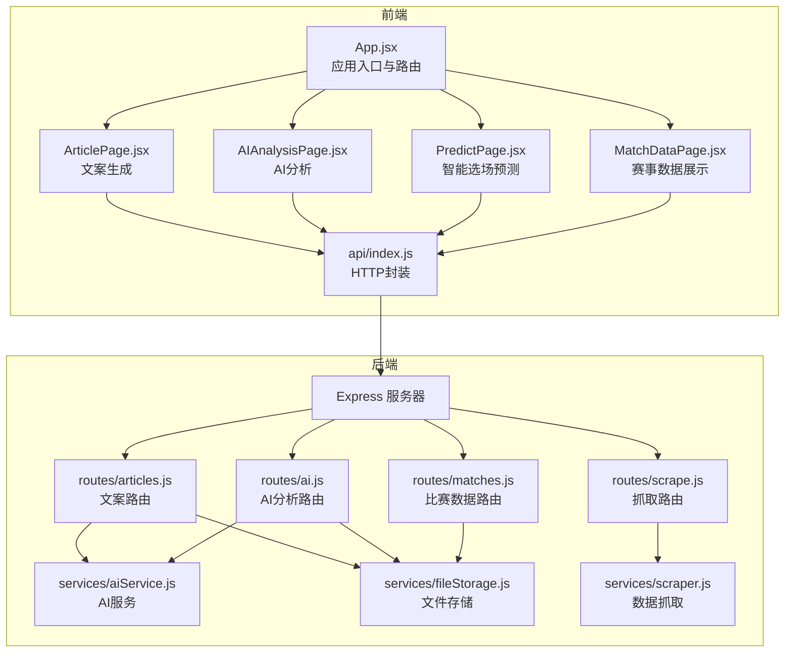
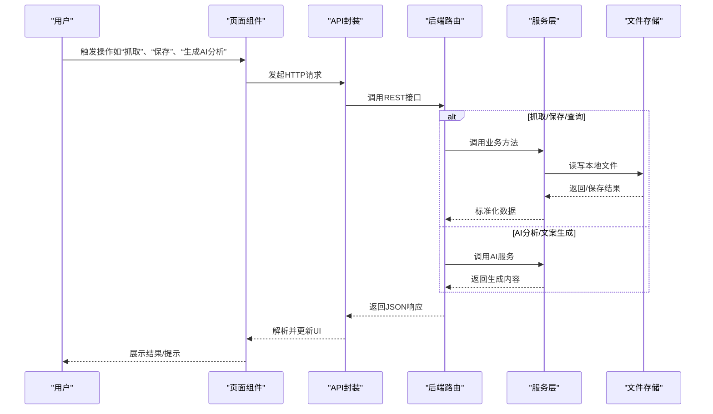
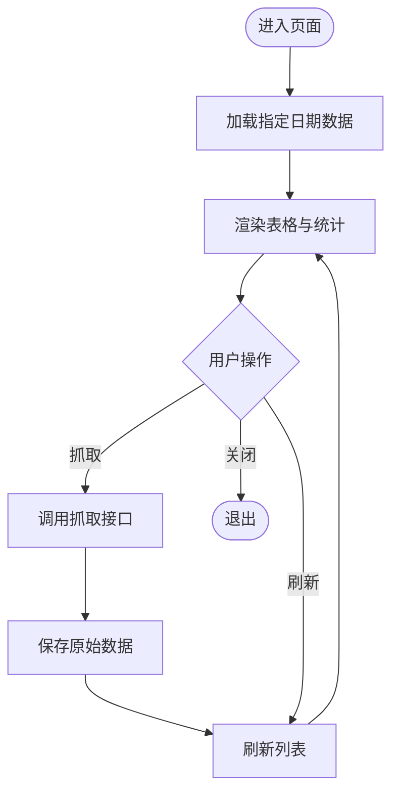
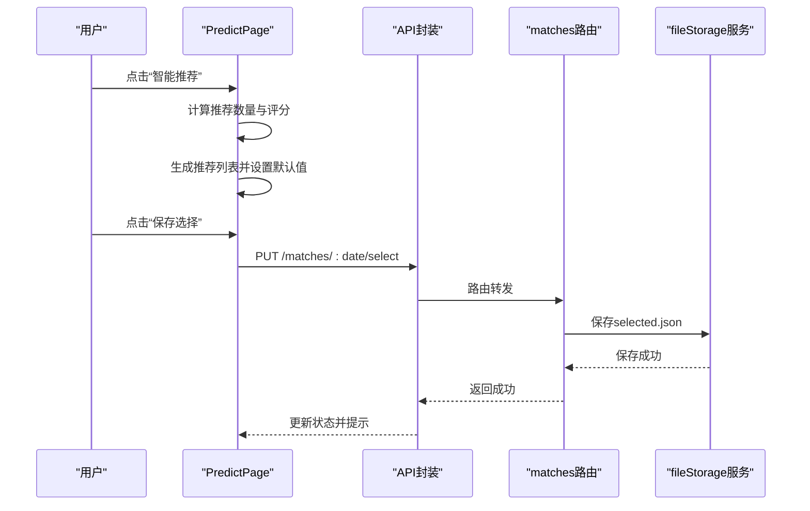
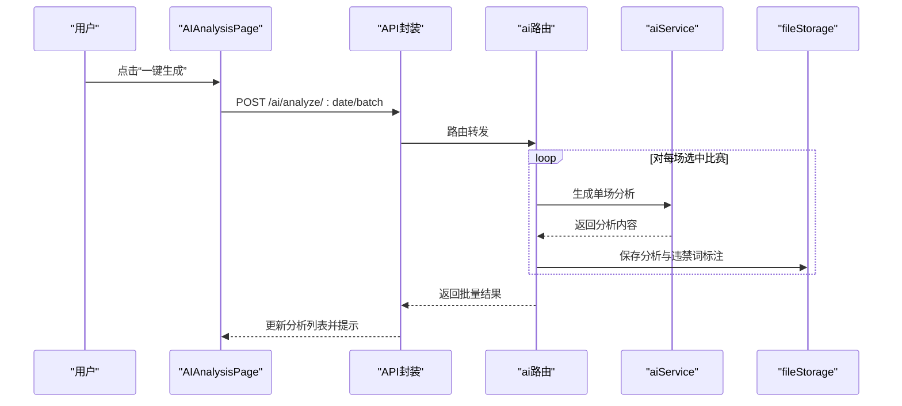
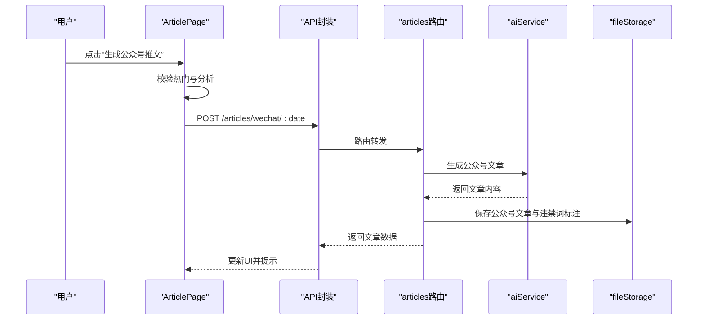
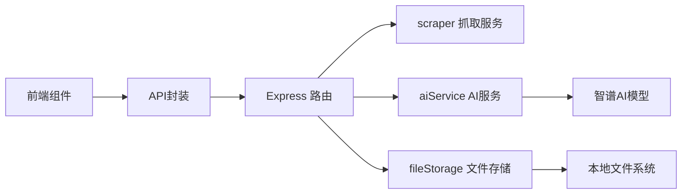

# 主要页面组件

<cite>
**本文引用的文件**
- [App.jsx](file://client/src/App.jsx)
- [MatchDataPage.jsx](file://client/src/pages/MatchDataPage.jsx)
- [PredictPage.jsx](file://client/src/pages/PredictPage.jsx)
- [AIAnalysisPage.jsx](file://client/src/pages/AIAnalysisPage.jsx)
- [ArticlePage.jsx](file://client/src/pages/ArticlePage.jsx)
- [api/index.js](file://client/src/api/index.js)
- [routes/matches.js](file://server/routes/matches.js)
- [routes/ai.js](file://server/routes/ai.js)
- [routes/articles.js](file://server/routes/articles.js)
- [routes/scrape.js](file://server/routes/scrape.js)
- [services/aiService.js](file://server/services/aiService.js)
- [services/fileStorage.js](file://server/services/fileStorage.js)
- [services/scraper.js](file://server/services/scraper.js)
- [package.json](file://package.json)
- [PRD.md](file://PRD.md)
</cite>

## 目录
1. [简介](#简介)
2. [项目结构](#项目结构)
3. [核心组件](#核心组件)
4. [架构总览](#架构总览)
5. [详细组件分析](#详细组件分析)
6. [依赖关系分析](#依赖关系分析)
7. [性能考量](#性能考量)
8. [故障排查指南](#故障排查指南)
9. [结论](#结论)
10. [附录](#附录)

## 简介
本文件聚焦AutoMatch的主要页面组件，围绕四大核心功能页面进行深入解析：赛事数据展示页面、智能选场预测页面、AI分析页面、文案生成页面。文档从组件结构、数据绑定、用户交互、业务逻辑与前后端集成等维度，提供可操作的说明与可视化图示，帮助开发者与运营人员快速理解与维护系统。

## 项目结构
AutoMatch采用前后端分离架构：
- 前端基于React + Vite + Ant Design，负责页面渲染与用户交互。
- 后端基于Node.js + Express，提供REST接口与业务逻辑。
- 数据抓取使用Puppeteer无头浏览器，AI分析对接智谱GLM-4，数据持久化采用本地文件系统。

图表来源
- [App.jsx:1-117](file://client/src/App.jsx#L1-L117)
- [MatchDataPage.jsx:1-198](file://client/src/pages/MatchDataPage.jsx#L1-L198)
- [PredictPage.jsx:1-322](file://client/src/pages/PredictPage.jsx#L1-L322)
- [AIAnalysisPage.jsx:1-203](file://client/src/pages/AIAnalysisPage.jsx#L1-L203)
- [ArticlePage.jsx:1-267](file://client/src/pages/ArticlePage.jsx#L1-L267)
- [api/index.js:1-50](file://client/src/api/index.js#L1-L50)
- [routes/matches.js:1-75](file://server/routes/matches.js#L1-L75)
- [routes/ai.js:1-102](file://server/routes/ai.js#L1-L102)
- [routes/articles.js:1-113](file://server/routes/articles.js#L1-L113)
- [routes/scrape.js:1-26](file://server/routes/scrape.js#L1-L26)
- [services/aiService.js:1-212](file://server/services/aiService.js#L1-L212)
- [services/fileStorage.js:1-196](file://server/services/fileStorage.js#L1-L196)
- [services/scraper.js:1-295](file://server/services/scraper.js#L1-L295)

章节来源
- [package.json:1-23](file://package.json#L1-L23)
- [PRD.md:14-21](file://PRD.md#L14-L21)

## 核心组件
- 应用入口与路由：负责菜单切换、日期选择、页面渲染与全局主题配置。
- 赛事数据展示：抓取原始比赛数据、展示表格、统计概览、刷新与下载。
- 智能选场预测：自动推荐重点比赛、手动选择/取消、录入预测、保存选中与预测。
- AI分析：批量生成AI分析、查看/编辑、复制、违禁词过滤。
- 文案生成：公众号推文与直播文案生成、复制、违禁词过滤、时间戳展示。

章节来源
- [App.jsx:41-56](file://client/src/App.jsx#L41-L56)
- [MatchDataPage.jsx:6-23](file://client/src/pages/MatchDataPage.jsx#L6-L23)
- [PredictPage.jsx:9-29](file://client/src/pages/PredictPage.jsx#L9-L29)
- [AIAnalysisPage.jsx:9-29](file://client/src/pages/AIAnalysisPage.jsx#L9-L29)
- [ArticlePage.jsx:14-38](file://client/src/pages/ArticlePage.jsx#L14-L38)

## 架构总览
AutoMatch的前端通过统一的HTTP封装调用后端接口，后端路由将请求分发至对应服务层，服务层负责AI生成、文件存储与数据抓取，最终返回标准化响应。

图表来源
- [api/index.js:15-50](file://client/src/api/index.js#L15-L50)
- [routes/matches.js:17-72](file://server/routes/matches.js#L17-L72)
- [routes/ai.js:7-69](file://server/routes/ai.js#L7-L69)
- [routes/articles.js:7-93](file://server/routes/articles.js#L7-L93)
- [services/fileStorage.js:32-157](file://server/services/fileStorage.js#L32-L157)
- [services/aiService.js:18-211](file://server/services/aiService.js#L18-L211)

## 详细组件分析

### 赛事数据展示页面（MatchDataPage）
- 组件职责
  - 加载指定日期的原始比赛数据与已选重点比赛。
  - 提供“抓取今日数据”“刷新”等操作。
  - 表格列包含编号、联赛、对阵、时间、赔率、让球等关键字段。
  - 已选重点比赛高亮显示，便于识别。
- 数据绑定
  - 通过日期参数驱动数据加载，支持外部日期变更回调刷新可用日期。
- 用户交互
  - 点击“抓取”触发数据抓取，显示加载消息与成功/失败提示。
  - 点击“刷新”重新拉取最新数据。
- 业务逻辑
  - 抓取流程：调用抓取接口 -> 保存原始数据 -> 刷新列表。
  - 展示流程：拉取原始数据与已选数据 -> 渲染表格与统计卡片。
- 错误处理
  - 抓取异常捕获并提示；加载失败记录日志。

图表来源
- [MatchDataPage.jsx:15-38](file://client/src/pages/MatchDataPage.jsx#L15-L38)
- [api/index.js:15-20](file://client/src/api/index.js#L15-L20)
- [services/fileStorage.js:32-48](file://server/services/fileStorage.js#L32-L48)

章节来源
- [MatchDataPage.jsx:6-198](file://client/src/pages/MatchDataPage.jsx#L6-L198)
- [routes/matches.js:17-35](file://server/routes/matches.js#L17-L35)
- [routes/scrape.js:8-23](file://server/routes/scrape.js#L8-L23)

### 智能选场预测页面（PredictPage）
- 组件职责
  - 展示原始比赛列表与已选重点比赛。
  - 自动推荐重点比赛（依据联赛热度与赔率差异）。
  - 手动选择/取消选择，限制最大选场数。
  - 弹窗录入预测（预测结果、信心指数、分析笔记、是否热门）。
  - 保存选中与预测，刷新数据。
- 数据绑定
  - 通过日期参数驱动数据加载。
  - 选中集合与预测表单双向绑定。
- 用户交互
  - “智能推荐”一键生成推荐列表。
  - “保存选择”提交选中集合。
  - “预测”打开表单，校验必填后保存预测。
- 业务逻辑
  - 推荐策略：联赛热度排序 + 赔率差异评分 + 截取推荐数量。
  - 保存流程：更新内存状态 -> 调用保存接口 -> 刷新列表。
- 错误处理
  - 无数据时提示先抓取；超出上限提示；保存失败提示。

图表来源
- [PredictPage.jsx:33-113](file://client/src/pages/PredictPage.jsx#L33-L113)
- [api/index.js:21-30](file://client/src/api/index.js#L21-L30)
- [routes/matches.js:37-49](file://server/routes/matches.js#L37-L49)
- [services/fileStorage.js:52-69](file://server/services/fileStorage.js#L52-L69)

章节来源
- [PredictPage.jsx:9-322](file://client/src/pages/PredictPage.jsx#L9-L322)
- [routes/matches.js:51-72](file://server/routes/matches.js#L51-L72)

### AI分析页面（AIAnalysisPage）
- 组件职责
  - 加载已选重点比赛与已有AI分析。
  - 一键批量生成AI分析，支持逐条查看/编辑/复制。
  - 违禁词过滤与标注。
- 数据绑定
  - 选中集合与分析列表双向绑定，编辑态独立状态管理。
- 用户交互
  - “一键生成”触发批量生成，显示加载动画。
  - “复制”将分析内容复制到剪贴板。
  - “编辑”进入编辑模式，保存后刷新。
- 业务逻辑
  - 批量生成：遍历选中比赛，逐个调用AI生成并保存，聚合结果。
  - 编辑更新：调用更新接口，写入最新内容与更新时间。
- 错误处理
  - 无选中比赛时提示先在“选场预测”中选择；生成失败提示。

图表来源
- [AIAnalysisPage.jsx:31-47](file://client/src/pages/AIAnalysisPage.jsx#L31-L47)
- [api/index.js:35-42](file://client/src/api/index.js#L35-L42)
- [routes/ai.js:36-69](file://server/routes/ai.js#L36-L69)
- [services/aiService.js:18-65](file://server/services/aiService.js#L18-L65)
- [services/fileStorage.js:74-107](file://server/services/fileStorage.js#L74-L107)

章节来源
- [AIAnalysisPage.jsx:9-203](file://client/src/pages/AIAnalysisPage.jsx#L9-L203)
- [routes/ai.js:71-99](file://server/routes/ai.js#L71-L99)

### 文案生成页面（ArticlePage）
- 组件职责
  - 加载已选重点比赛、AI分析与现有文案。
  - 生成公众号推文与直播文案，支持复制与违禁词标注。
  - 条件校验：需有热门比赛且已完成AI分析。
- 数据绑定
  - 选中集合、分析列表与文案内容双向绑定。
- 用户交互
  - “生成公众号推文”与“生成直播文案”按钮，条件满足后触发。
  - “复制文案”一键复制到剪贴板。
- 业务逻辑
  - 公众号：取至少1场热门比赛（不足则取前2），合并AI分析摘要，调用AI生成并保存。
  - 直播：取至少1场热门比赛（不足则取前2），调用AI生成脚本并保存。
- 错误处理
  - 无热门或无分析时提示先完成前置步骤。

图表来源
- [ArticlePage.jsx:44-86](file://client/src/pages/ArticlePage.jsx#L44-L86)
- [api/index.js:45-49](file://client/src/api/index.js#L45-L49)
- [routes/articles.js:7-51](file://server/routes/articles.js#L7-L51)
- [services/aiService.js:70-135](file://server/services/aiService.js#L70-L135)
- [services/fileStorage.js:112-148](file://server/services/fileStorage.js#L112-L148)

章节来源
- [ArticlePage.jsx:14-267](file://client/src/pages/ArticlePage.jsx#L14-L267)
- [routes/articles.js:53-110](file://server/routes/articles.js#L53-L110)

## 依赖关系分析
- 前端依赖
  - React生态：组件化与状态管理。
  - Ant Design：UI组件库与样式。
  - dayjs：日期处理。
- 后端依赖
  - Express：Web框架。
  - Puppeteer：无头浏览器抓取。
  - zhipuai-sdk-nodejs-v4：智谱AI SDK。
  - dotenv：环境变量加载。
- 数据流
  - 前端通过统一API封装调用后端路由，路由将请求委派给服务层，服务层与文件系统交互，AI服务调用第三方模型。

图表来源
- [package.json:15-21](file://package.json#L15-L21)
- [services/scraper.js:1-295](file://server/services/scraper.js#L1-L295)
- [services/aiService.js:1-212](file://server/services/aiService.js#L1-L212)
- [services/fileStorage.js:1-196](file://server/services/fileStorage.js#L1-L196)

章节来源
- [package.json:15-21](file://package.json#L15-L21)

## 性能考量
- 抓取性能：无头浏览器启动与页面解析控制在合理时间内，必要时增加重试与超时配置。
- AI生成：单场生成控制在秒级以内，批量生成时注意并发与错误聚合。
- 前端渲染：表格滚动与大数据量时建议虚拟化或分页，减少DOM压力。
- 存储策略：本地文件读写频繁时注意磁盘IO，避免重复序列化。

## 故障排查指南
- 抓取失败
  - 现象：抓取接口报错或无数据。
  - 排查：确认Chrome路径配置、网络连通性、页面结构变化。
  - 参考：抓取路由与服务实现。
- AI生成失败
  - 现象：AI分析接口报错或内容为空。
  - 排查：检查API Key配置、网络与模型可用性。
  - 参考：AI服务与路由。
- 文案生成失败
  - 现象：公众号/直播文案生成接口报错。
  - 排查：确认选中集合与分析数据是否存在、热门标记是否正确。
  - 参考：文案路由与AI服务。
- 文件存储异常
  - 现象：保存失败或读取不到数据。
  - 排查：确认数据目录权限、磁盘空间、文件格式一致性。
  - 参考：文件存储服务。

章节来源
- [routes/scrape.js:8-23](file://server/routes/scrape.js#L8-L23)
- [services/scraper.js:22-214](file://server/services/scraper.js#L22-L214)
- [services/aiService.js:8-13](file://server/services/aiService.js#L8-L13)
- [routes/ai.js:39-69](file://server/routes/ai.js#L39-L69)
- [routes/articles.js:56-93](file://server/routes/articles.js#L56-L93)
- [services/fileStorage.js:32-157](file://server/services/fileStorage.js#L32-L157)

## 结论
AutoMatch通过清晰的页面分工与前后端协作，实现了从数据抓取、智能选场、AI分析到文案生成的完整工作流。页面组件围绕数据驱动与用户交互展开，配合后端路由与服务层，形成稳定可扩展的体系。建议在后续迭代中增强错误监控、日志追踪与性能优化，提升整体稳定性与用户体验。

## 附录
- API一览
  - 抓取相关：POST /api/scrape
  - 比赛相关：GET /api/matches/:date、PUT /api/matches/:date/select、PUT /api/matches/:date/predict/:matchId
  - AI分析：POST /api/ai/analyze/:date/:matchId、POST /api/ai/analyze/:date/batch、GET /api/ai/analyses/:date、PUT /api/ai/analyses/:date/:matchId
  - 文案相关：POST /api/articles/wechat/:date、POST /api/articles/live/:date、GET /api/articles/:date

章节来源
- [PRD.md:252-271](file://PRD.md#L252-L271)
- [api/index.js:15-50](file://client/src/api/index.js#L15-L50)