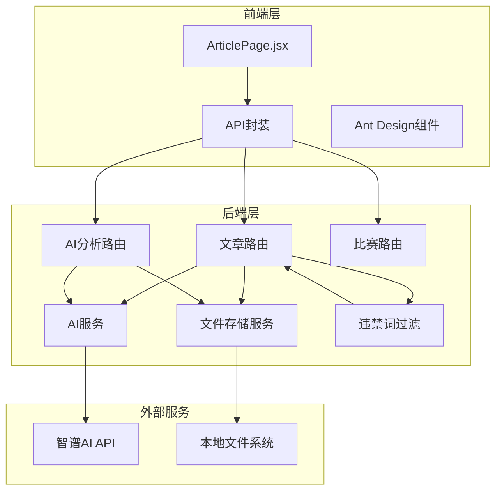
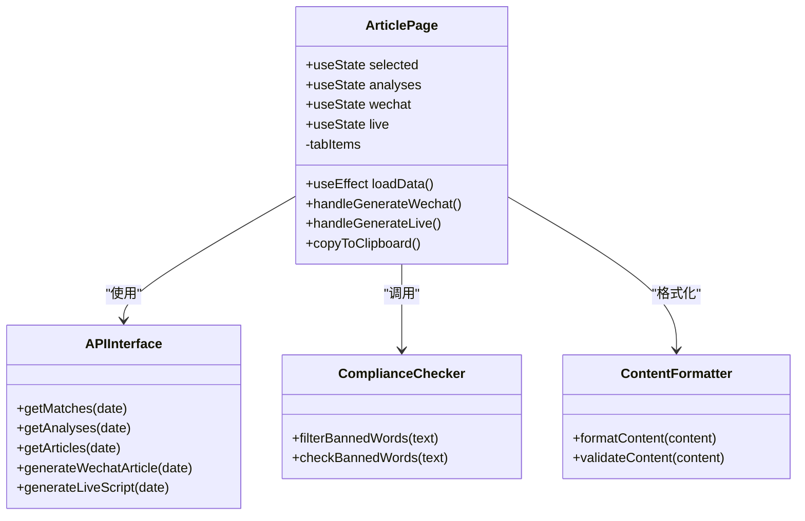
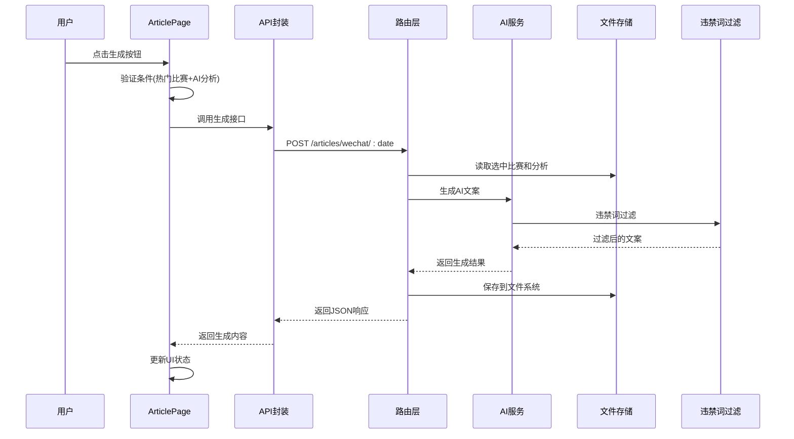
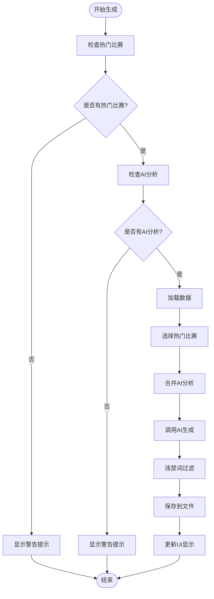
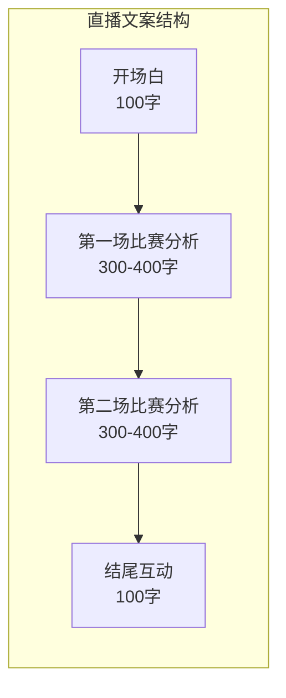
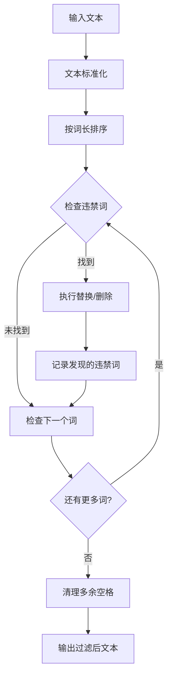
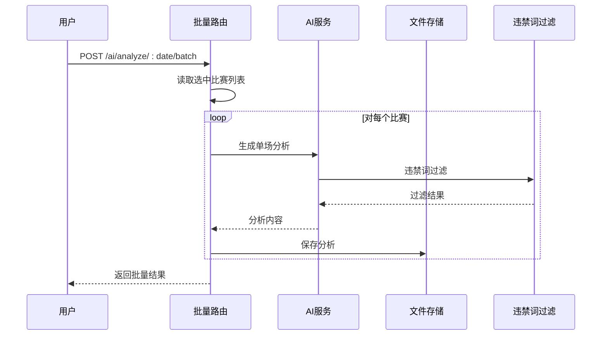
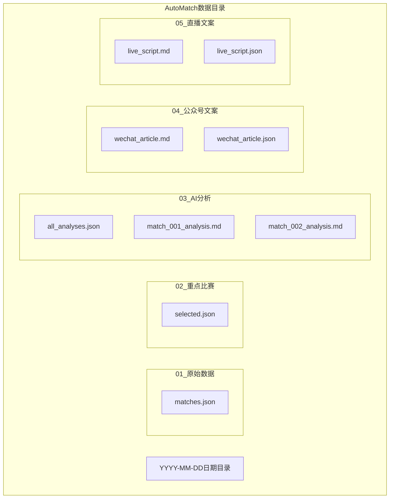
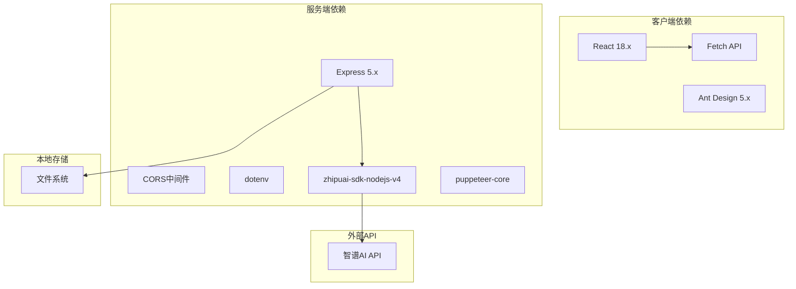

# 文案生成页面

<cite>
**本文引用的文件**
- [ArticlePage.jsx](file://client/src/pages/ArticlePage.jsx)
- [index.js](file://client/src/api/index.js)
- [articles.js](file://server/routes/articles.js)
- [ai.js](file://server/routes/ai.js)
- [matches.js](file://server/routes/matches.js)
- [aiService.js](file://server/services/aiService.js)
- [bannedWords.js](file://server/services/bannedWords.js)
- [fileStorage.js](file://server/services/fileStorage.js)
- [PRD.md](file://PRD.md)
- [package.json](file://package.json)
</cite>

## 目录
1. [简介](#简介)
2. [项目结构](#项目结构)
3. [核心组件](#核心组件)
4. [架构概览](#架构概览)
5. [详细组件分析](#详细组件分析)
6. [依赖关系分析](#依赖关系分析)
7. [性能考虑](#性能考虑)
8. [故障排除指南](#故障排除指南)
9. [结论](#结论)

## 简介

AutoMatch是一个面向足球竞彩分析师的本地化工具，专门用于自动化生成营销文案。本文档深入分析ArticlePage组件的设计和实现，涵盖公众号推文生成、直播文案创建、内容模板管理、合规检查和批量处理功能。该组件基于选中的比赛和AI分析结果，自动生成不同类型的营销文案，处理内容格式，进行合规性审核，并管理生成的历史内容。

## 项目结构

AutoMatch采用前后端分离架构，主要由以下部分组成：

**图表来源**
- [ArticlePage.jsx:1-267](file://client/src/pages/ArticlePage.jsx#L1-L267)
- [articles.js:1-113](file://server/routes/articles.js#L1-L113)
- [ai.js:1-102](file://server/routes/ai.js#L1-L102)
- [aiService.js:1-212](file://server/services/aiService.js#L1-L212)

**章节来源**
- [PRD.md:14-21](file://PRD.md#L14-L21)
- [package.json:15-21](file://package.json#L15-L21)

## 核心组件

ArticlePage组件是整个文案生成功能的核心，负责协调用户交互、数据加载、AI生成和合规检查。该组件具有以下关键特性：

### 组件架构设计

**图表来源**
- [ArticlePage.jsx:14-267](file://client/src/pages/ArticlePage.jsx#L14-L267)
- [index.js:45-49](file://client/src/api/index.js#L45-L49)

### 数据流处理

组件采用异步数据流处理模式，确保用户体验的流畅性：

1. **初始化加载**：组件挂载时自动加载当天的选中比赛、AI分析和现有文案
2. **条件验证**：生成前检查热门比赛标记和AI分析状态
3. **异步生成**：调用后端API进行AI文案生成
4. **实时更新**：生成完成后自动刷新显示内容

**章节来源**
- [ArticlePage.jsx:22-38](file://client/src/pages/ArticlePage.jsx#L22-L38)
- [ArticlePage.jsx:44-86](file://client/src/pages/ArticlePage.jsx#L44-L86)

## 架构概览

AutoMatch的文案生成架构遵循分层设计原则，确保各组件职责清晰、耦合度低：

**图表来源**
- [ArticlePage.jsx:44-86](file://client/src/pages/ArticlePage.jsx#L44-L86)
- [articles.js:10-51](file://server/routes/articles.js#L10-L51)
- [aiService.js:70-135](file://server/services/aiService.js#L70-L135)

## 详细组件分析

### 公众号推文生成模块

公众号推文生成功能是ArticlePage的核心功能之一，专门用于生成吸引新粉丝关注的营销内容。

#### 生成流程

**图表来源**
- [ArticlePage.jsx:44-64](file://client/src/pages/ArticlePage.jsx#L44-L64)
- [articles.js:10-51](file://server/routes/articles.js#L10-L51)

#### AI生成参数

公众号推文生成使用精心设计的Prompt模板，包含以下关键要素：

- **热门比赛信息**：主队vs客队、联赛、比赛时间
- **分析师预测**：预测结果和信心指数
- **AI分析摘要**：基于AI分析的要点总结
- **合规要求**：严格遵守微信公众号内容规范

**章节来源**
- [aiService.js:70-135](file://server/services/aiService.js#L70-L135)
- [PRD.md:146-180](file://PRD.md#L146-L180)

### 直播文案生成模块

直播文案生成模块专为微信视频号直播场景设计，提供适合口头表达的直播脚本。

#### 生成策略

直播文案采用多场比赛的综合分析模式：

1. **双场比赛分析**：从热门比赛中选择2场比赛进行深度分析
2. **结构化内容**：包含开场白、逐场分析、结尾互动
3. **口语化表达**：确保文案适合直播场景的自然表达

#### 内容结构

**图表来源**
- [aiService.js:140-205](file://server/services/aiService.js#L140-L205)
- [PRD.md:181-202](file://PRD.md#L181-L202)

**章节来源**
- [aiService.js:140-205](file://server/services/aiService.js#L140-L205)
- [PRD.md:181-202](file://PRD.md#L181-L202)

### 合规检查系统

违禁词过滤系统是AutoMatch的重要安全机制，确保生成内容符合微信平台的内容规范。

#### 过滤机制

**图表来源**
- [bannedWords.js:70-96](file://server/services/bannedWords.js#L70-L96)

#### 违禁词映射表

系统维护了完整的违禁词映射表，涵盖所有可能涉及的敏感词汇：

| 违禁词类别 | 违禁词 | 替换词 |
|-----------|--------|--------|
| 赔率相关 | 赔率 | 数据指标 |
| 盘口相关 | 盘口 | 数据走势 |
| 投注相关 | 投注 | 关注方向 |
| 赌博相关 | 赌博 | 无 |
| 让球相关 | 让球 | 让步 |

**章节来源**
- [bannedWords.js:6-63](file://server/services/bannedWords.js#L6-L63)
- [PRD.md:158-174](file://PRD.md#L158-L174)

### 批量处理功能

AutoMatch支持批量处理多个比赛的AI分析和文案生成，提高工作效率。

#### 批量生成流程

**图表来源**
- [ai.js:39-69](file://server/routes/ai.js#L39-L69)

**章节来源**
- [ai.js:39-69](file://server/routes/ai.js#L39-L69)

### 内容管理与历史记录

系统采用文件存储方案管理生成的历史内容，确保数据的持久性和可追溯性。

#### 存储结构

**图表来源**
- [fileStorage.js:112-157](file://server/services/fileStorage.js#L112-L157)
- [PRD.md:210-228](file://PRD.md#L210-L228)

**章节来源**
- [fileStorage.js:112-157](file://server/services/fileStorage.js#L112-L157)
- [PRD.md:205-234](file://PRD.md#L205-L234)

## 依赖关系分析

AutoMatch的依赖关系体现了清晰的分层架构设计：

**图表来源**
- [package.json:15-21](file://package.json#L15-L21)

### 组件耦合度分析

- **低耦合设计**：前端组件与后端服务通过RESTful API通信
- **职责分离**：AI服务、文件存储、违禁词过滤各自独立
- **可扩展性**：新增功能可通过添加新的路由和服务实现

**章节来源**
- [package.json:15-21](file://package.json#L15-L21)

## 性能考虑

AutoMatch在设计时充分考虑了性能优化：

### 前端性能优化

1. **懒加载策略**：仅在需要时加载AI分析数据
2. **状态缓存**：避免重复的API调用
3. **异步处理**：生成过程不影响用户交互

### 后端性能优化

1. **批量处理**：支持批量生成AI分析，减少API调用次数
2. **文件缓存**：本地文件存储减少数据库查询
3. **并发控制**：合理控制AI生成的并发数量

### 网络性能

- **API设计**：简洁的RESTful接口，减少数据传输
- **错误处理**：完善的错误处理机制，避免资源浪费

## 故障排除指南

### 常见问题及解决方案

#### AI生成失败

**问题症状**：生成按钮无响应或显示错误信息

**可能原因**：
1. 智谱API密钥配置错误
2. 网络连接不稳定
3. AI服务暂时不可用

**解决步骤**：
1. 检查`.env`文件中的API密钥配置
2. 验证网络连接状态
3. 查看服务器日志获取详细错误信息

#### 文案生成失败

**问题症状**：无法生成公众号或直播文案

**可能原因**：
1. 未标记热门比赛
2. 未生成AI分析
3. 文件存储权限问题

**解决步骤**：
1. 在"选场预测"页面标记至少1个热门比赛
2. 确保已完成AI分析生成
3. 检查文件存储目录权限

#### 违禁词过滤异常

**问题症状**：生成的文案被过度修改

**可能原因**：
1. 违禁词过滤规则过于严格
2. 文本中包含意外的敏感词汇

**解决步骤**：
1. 检查违禁词映射表配置
2. 审核生成的文案内容
3. 调整过滤规则以平衡合规性和内容质量

**章节来源**
- [aiService.js:9-13](file://server/services/aiService.js#L9-L13)
- [articles.js:24-26](file://server/routes/articles.js#L24-L26)

## 结论

ArticlePage组件作为AutoMatch的核心功能模块，展现了优秀的软件工程实践。通过精心设计的架构、严格的合规检查和高效的批量处理机制，该组件能够满足足球竞彩分析师的日常需求。

### 主要优势

1. **用户体验优秀**：直观的界面设计和流畅的交互体验
2. **功能完整**：涵盖从数据准备到内容发布的完整流程
3. **合规性强**：内置违禁词过滤系统，确保内容安全
4. **扩展性好**：模块化设计便于功能扩展和维护

### 技术亮点

- 基于React的现代化前端架构
- 基于Express的稳定后端服务
- 智谱AI的高质量内容生成
- 本地文件系统的可靠存储

该组件为AutoMatch项目奠定了坚实的技术基础，为后续的功能扩展提供了良好的架构支撑。