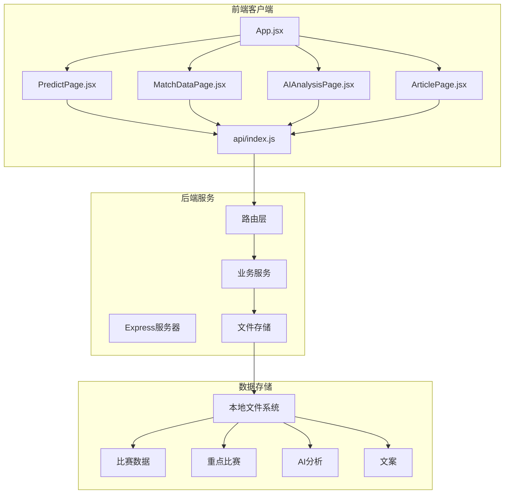
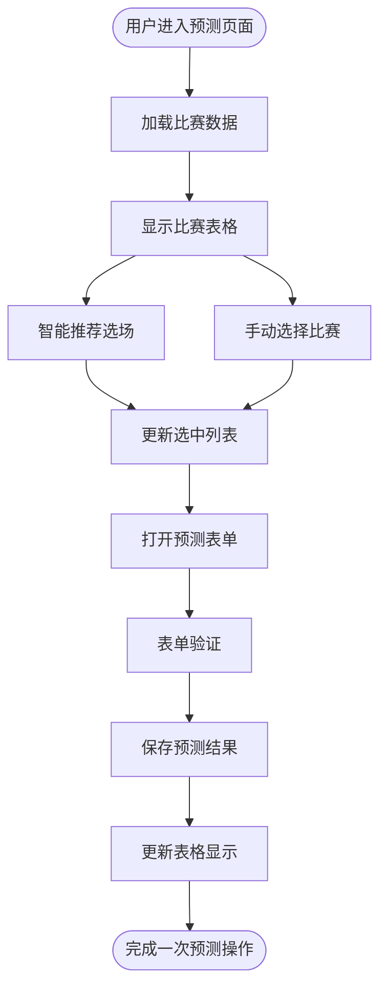
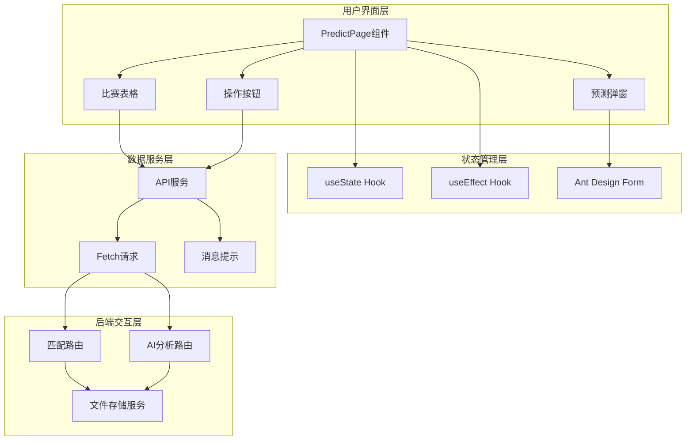
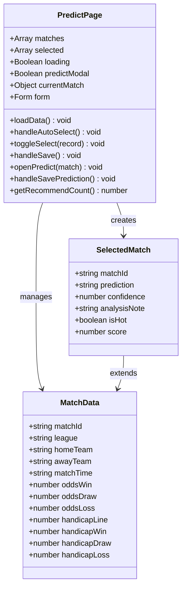
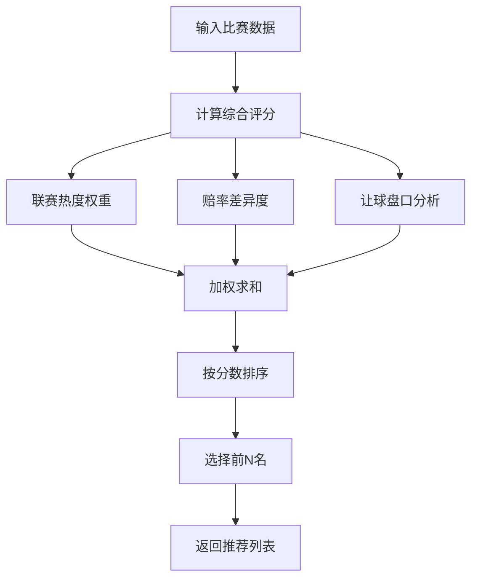
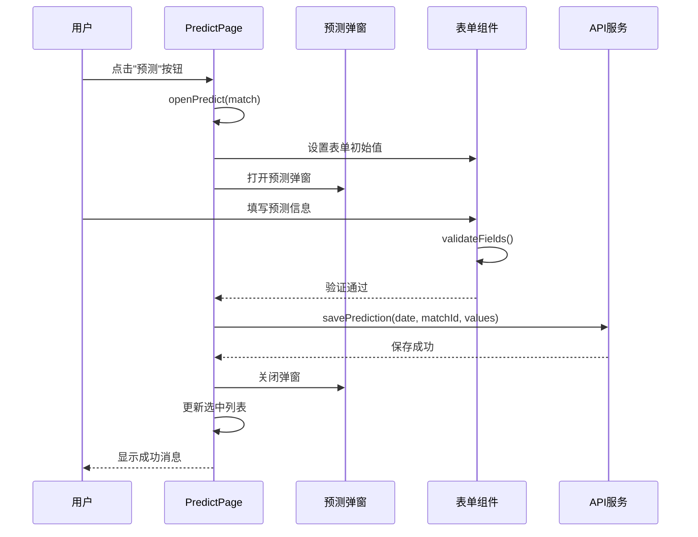
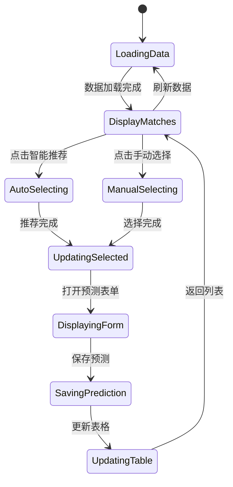
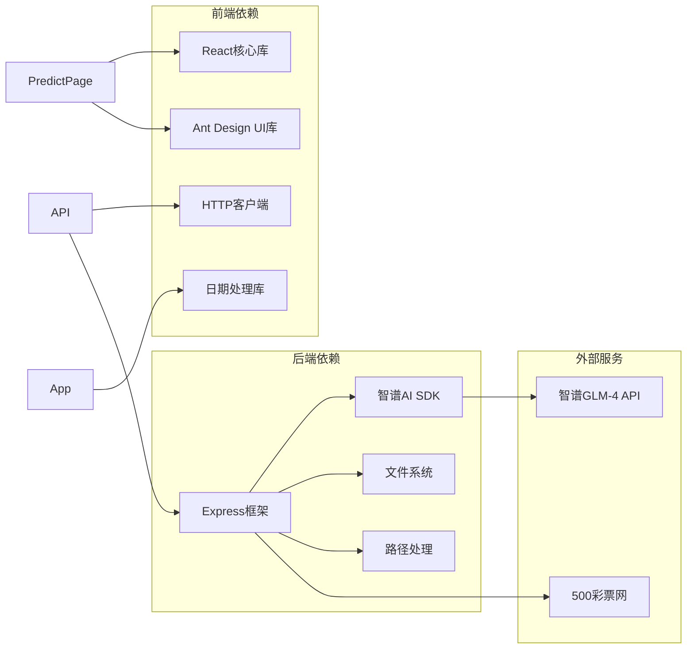
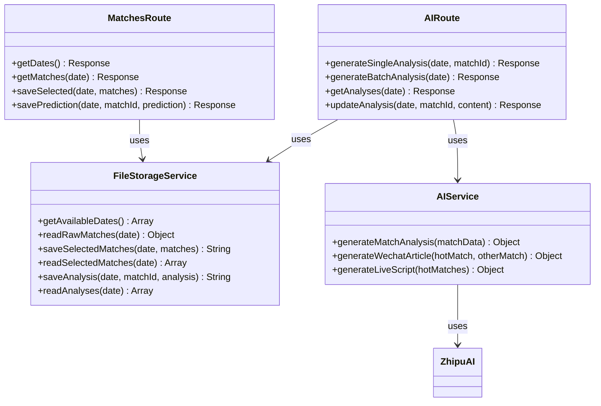

# 智能选场预测页面

<cite>
**本文档引用的文件**
- [PredictPage.jsx](file://client/src/pages/PredictPage.jsx)
- [api/index.js](file://client/src/api/index.js)
- [App.jsx](file://client/src/App.jsx)
- [MatchDataPage.jsx](file://client/src/pages/MatchDataPage.jsx)
- [AIAnalysisPage.jsx](file://client/src/pages/AIAnalysisPage.jsx)
- [ArticlePage.jsx](file://client/src/pages/ArticlePage.jsx)
- [routes/matches.js](file://server/routes/matches.js)
- [routes/ai.js](file://server/routes/ai.js)
- [services/aiService.js](file://server/services/aiService.js)
- [services/fileStorage.js](file://server/services/fileStorage.js)
- [PRD.md](file://PRD.md)
</cite>

## 目录
1. [简介](#简介)
2. [项目结构](#项目结构)
3. [核心组件](#核心组件)
4. [架构概览](#架构概览)
5. [详细组件分析](#详细组件分析)
6. [依赖关系分析](#依赖关系分析)
7. [性能考虑](#性能考虑)
8. [故障排除指南](#故障排除指南)
9. [结论](#结论)

## 简介

智能选场预测页面是AutoMatch足球赛事智能分析工具的核心功能模块之一。该页面为足球竞彩分析师提供了完整的比赛选择、预测录入和数据分析管理功能，支持智能推荐重点比赛、手动选择、预测结果录入、信心指数评估和分析笔记记录等核心功能。

AutoMatch是一个面向足球竞彩分析师的本地化工具，集成了赛事数据抓取、智能选场、AI辅助分析、文案生成等功能，帮助分析师高效完成每日赛事分析、公众号推文和直播文案撰写工作。

## 项目结构

AutoMatch采用前后端分离的架构设计，前端使用React + Vite + Ant Design技术栈，后端使用Node.js + Express框架。

**图表来源**
- [App.jsx:1-117](file://client/src/App.jsx#L1-L117)
- [PredictPage.jsx:1-322](file://client/src/pages/PredictPage.jsx#L1-L322)
- [api/index.js:1-50](file://client/src/api/index.js#L1-L50)

**章节来源**
- [App.jsx:1-117](file://client/src/App.jsx#L1-L117)
- [PRD.md:14-21](file://PRD.md#L14-L21)

## 核心组件

智能选场预测页面由多个核心组件协同工作，形成完整的预测分析流程：

### 主要功能模块

1. **智能选场推荐系统** - 基于联赛热度和赔率差异度的自动化推荐算法
2. **手动选择机制** - 支持分析师手动添加/移除重点比赛
3. **预测录入表单** - 包含预测结果、信心指数、分析笔记的完整表单系统
4. **数据分析展示** - 实时展示选中比赛的详细信息和状态
5. **状态管理** - 完整的组件状态管理和数据绑定机制

### 数据流架构

**图表来源**
- [PredictPage.jsx:21-144](file://client/src/pages/PredictPage.jsx#L21-L144)

**章节来源**
- [PredictPage.jsx:9-322](file://client/src/pages/PredictPage.jsx#L9-L322)
- [PRD.md:63-88](file://PRD.md#L63-L88)

## 架构概览

智能选场预测页面采用响应式设计和状态驱动的架构模式，确保用户能够高效地完成比赛选择和预测录入任务。

**图表来源**
- [PredictPage.jsx:1-322](file://client/src/pages/PredictPage.jsx#L1-L322)
- [api/index.js:1-50](file://client/src/api/index.js#L1-L50)
- [routes/matches.js:1-75](file://server/routes/matches.js#L1-L75)

## 详细组件分析

### PredictPage组件架构

PredictPage组件是智能选场预测页面的核心，负责管理整个预测流程的所有状态和交互逻辑。

#### 组件状态管理

**图表来源**
- [PredictPage.jsx:10-15](file://client/src/pages/PredictPage.jsx#L10-L15)
- [PredictPage.jsx:91-98](file://client/src/pages/PredictPage.jsx#L91-L98)

#### 智能推荐算法

智能推荐系统基于多维度评分机制，为分析师提供科学的选场建议：

**图表来源**
- [PredictPage.jsx:42-78](file://client/src/pages/PredictPage.jsx#L42-L78)

#### 预测录入表单设计

预测表单采用Ant Design的Form组件，提供完整的数据验证和用户体验：

**图表来源**
- [PredictPage.jsx:116-144](file://client/src/pages/PredictPage.jsx#L116-L144)
- [api/index.js:26-30](file://client/src/api/index.js#L26-L30)

**章节来源**
- [PredictPage.jsx:1-322](file://client/src/pages/PredictPage.jsx#L1-L322)

### 数据绑定和状态同步

组件采用React的useState和useEffect钩子实现双向数据绑定，确保UI状态与业务状态保持同步。

#### 状态更新流程

**图表来源**
- [PredictPage.jsx:17-29](file://client/src/pages/PredictPage.jsx#L17-L29)
- [PredictPage.jsx:102-113](file://client/src/pages/PredictPage.jsx#L102-L113)

**章节来源**
- [PredictPage.jsx:17-113](file://client/src/pages/PredictPage.jsx#L17-L113)

### 表单验证和错误处理

预测表单实现了多层次的数据验证，确保分析师输入的信息准确完整：

#### 表单字段验证规则

| 字段名称 | 验证规则 | 错误提示 | 必填 |
|---------|---------|---------|------|
| prediction | 必填选项 | 请选择预测结果 | 是 |
| confidence | 1-5星评分 | 信心指数 | 否 |
| isHot | 布尔值开关 | 热门比赛标记 | 否 |
| analysisNote | 最大长度限制 | 分析笔记 | 否 |

**章节来源**
- [PredictPage.jsx:296-311](file://client/src/pages/PredictPage.jsx#L296-L311)

## 依赖关系分析

智能选场预测页面与后端服务的依赖关系紧密且清晰，形成了完整的数据流转链路。

**图表来源**
- [api/index.js:1-50](file://client/src/api/index.js#L1-L50)
- [services/aiService.js:1-212](file://server/services/aiService.js#L1-L212)

### API接口依赖

预测页面主要依赖以下API接口：

| 接口名称 | HTTP方法 | 路径 | 功能描述 |
|---------|---------|------|----------|
| getMatches | GET | `/api/matches/:date` | 获取指定日期的比赛数据 |
| saveSelected | PUT | `/api/matches/:date/select` | 保存选中的重点比赛 |
| savePrediction | PUT | `/api/matches/:date/predict/:matchId` | 保存单场比赛预测 |
| scrapeMatches | POST | `/api/scrape` | 触发比赛数据抓取 |

**章节来源**
- [api/index.js:15-30](file://client/src/api/index.js#L15-L30)
- [PRD.md:252-271](file://PRD.md#L252-L271)

### 后端服务依赖

后端服务依赖关系清晰，每个模块职责明确：

**图表来源**
- [routes/matches.js:1-75](file://server/routes/matches.js#L1-L75)
- [routes/ai.js:1-102](file://server/routes/ai.js#L1-L102)
- [services/fileStorage.js:1-196](file://server/services/fileStorage.js#L1-L196)

**章节来源**
- [routes/matches.js:1-75](file://server/routes/matches.js#L1-L75)
- [routes/ai.js:1-102](file://server/routes/ai.js#L1-L102)
- [services/fileStorage.js:1-196](file://server/services/fileStorage.js#L1-L196)

## 性能考虑

智能选场预测页面在设计时充分考虑了性能优化，确保在大量比赛数据下的流畅体验。

### 前端性能优化

1. **虚拟滚动** - 对于大量比赛数据，使用虚拟滚动技术提升渲染性能
2. **状态缓存** - 使用React.memo和useMemo避免不必要的重新渲染
3. **异步加载** - 所有网络请求采用异步处理，避免阻塞UI线程
4. **防抖处理** - 输入验证采用防抖机制，减少频繁的API调用

### 后端性能优化

1. **文件系统缓存** - 使用内存缓存减少文件系统IO操作
2. **批量处理** - AI分析支持批量处理，提高处理效率
3. **连接池管理** - 合理管理数据库连接，避免资源浪费
4. **错误重试机制** - 对外部API调用实现智能重试

## 故障排除指南

### 常见问题及解决方案

#### 数据加载失败

**问题症状**: 页面显示空表格或加载指示器持续显示

**可能原因**:
1. 网络连接异常
2. 后端服务未启动
3. 日期参数错误
4. 文件存储权限问题

**解决步骤**:
1. 检查网络连接状态
2. 验证后端服务是否正常运行
3. 确认日期格式正确
4. 检查文件存储目录权限

#### 预测保存失败

**问题症状**: 预测录入后无法保存，显示错误提示

**可能原因**:
1. 表单验证失败
2. API请求超时
3. 后端服务异常
4. 权限不足

**解决步骤**:
1. 检查必填字段是否完整
2. 查看浏览器开发者工具的网络请求
3. 确认后端服务日志
4. 验证用户权限设置

#### 智能推荐无效

**问题症状**: 点击智能推荐按钮无响应或推荐结果不合理

**可能原因**:
1. 比赛数据为空
2. 联赛热度配置缺失
3. 赔率数据异常
4. 算法参数错误

**解决步骤**:
1. 确认已有比赛数据
2. 检查联赛热度权重配置
3. 验证赔率数据完整性
4. 调整推荐算法参数

**章节来源**
- [PredictPage.jsx:26-28](file://client/src/pages/PredictPage.jsx#L26-L28)
- [PredictPage.jsx:108-112](file://client/src/pages/PredictPage.jsx#L108-L112)

## 结论

智能选场预测页面作为AutoMatch的核心功能模块，成功实现了分析师对重点比赛的智能化选择和管理。通过科学的推荐算法、直观的用户界面和可靠的后端服务，该页面为足球竞彩分析师提供了高效的工作流程支持。

### 主要优势

1. **智能化推荐**: 基于联赛热度和赔率差异度的智能选场算法
2. **灵活的手动选择**: 支持分析师根据个人经验进行手动调整
3. **完整的预测体系**: 预测结果、信心指数、分析笔记的完整记录
4. **实时数据同步**: 前后端数据实时同步，确保信息一致性
5. **良好的用户体验**: 响应式设计和友好的交互反馈

### 技术亮点

1. **模块化设计**: 清晰的组件划分和职责分离
2. **状态管理**: 完善的状态管理和数据绑定机制
3. **错误处理**: 全面的错误处理和用户反馈机制
4. **性能优化**: 针对大数据量的性能优化策略
5. **可扩展性**: 良好的架构设计便于功能扩展

该页面不仅满足了当前的功能需求，还为未来的功能扩展奠定了坚实的技术基础，是AutoMatch项目中最具实用价值的功能模块之一。