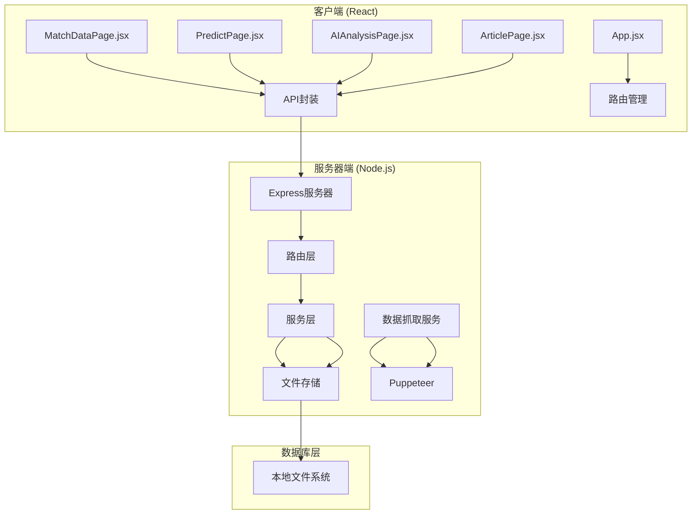
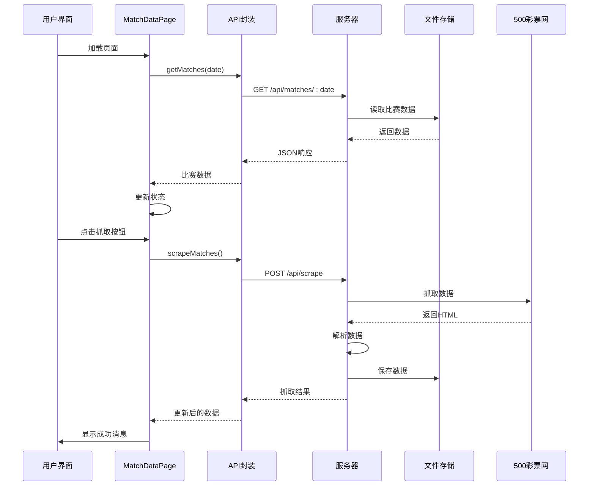
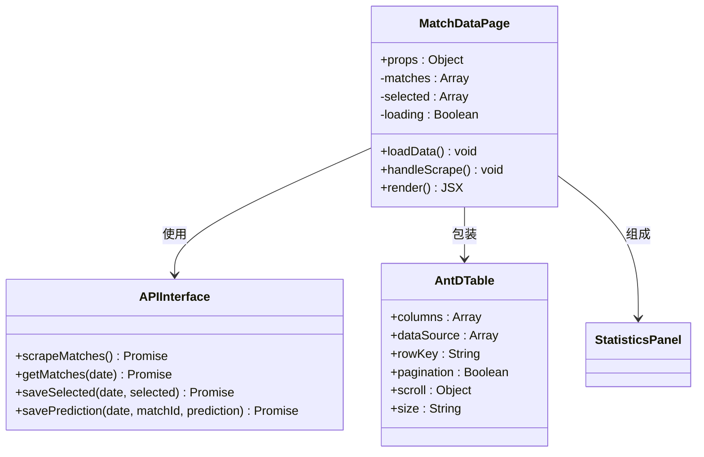
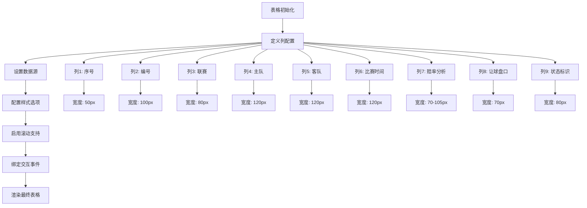
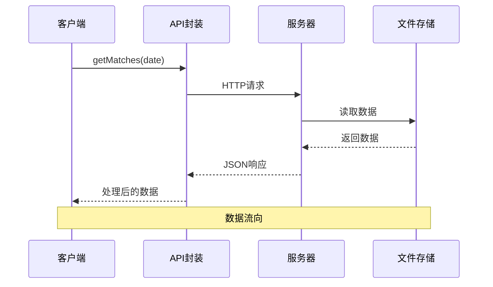
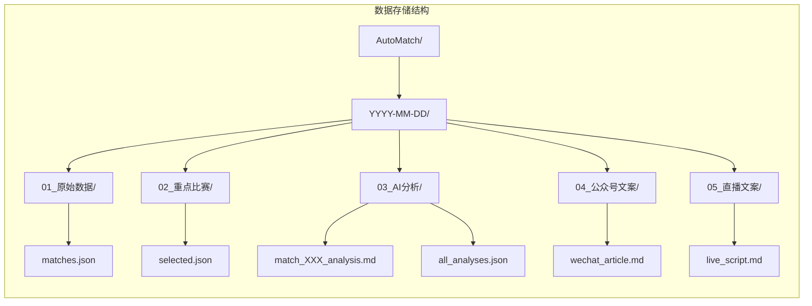
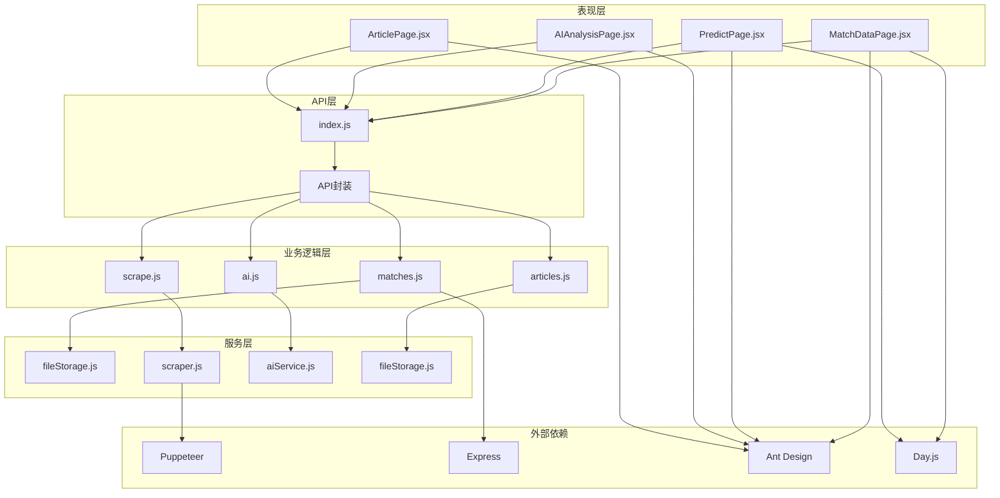

# 赛事数据展示页面

<cite>
**本文档引用的文件**
- [MatchDataPage.jsx](file://client/src/pages/MatchDataPage.jsx)
- [index.js](file://client/src/api/index.js)
- [matches.js](file://server/routes/matches.js)
- [scrape.js](file://server/routes/scrape.js)
- [fileStorage.js](file://server/services/fileStorage.js)
- [scraper.js](file://server/services/scraper.js)
- [App.jsx](file://client/src/App.jsx)
- [PredictPage.jsx](file://client/src/pages/PredictPage.jsx)
- [PRD.md](file://PRD.md)
- [package.json](file://package.json)
</cite>

## 目录
1. [简介](#简介)
2. [项目结构](#项目结构)
3. [核心组件](#核心组件)
4. [架构概览](#架构概览)
5. [详细组件分析](#详细组件分析)
6. [依赖关系分析](#依赖关系分析)
7. [性能考虑](#性能考虑)
8. [故障排除指南](#故障排除指南)
9. [结论](#结论)

## 简介

AutoMatch是一个面向足球竞彩分析师的本地化工具，集成了赛事数据抓取、智能选场、AI辅助分析、文案生成等功能。本文档专注于赛事数据展示页面（MatchDataPage），深入分析其设计和实现，包括数据抓取功能、比赛表格展示、选中状态管理、统计信息显示等核心功能。

该页面采用React + Ant Design技术栈构建，提供了一个直观的界面来展示和管理每日的足球比赛数据。通过与后端API的集成，实现了从500彩票网的数据抓取、本地存储和实时展示功能。

## 项目结构

AutoMatch项目采用前后端分离的架构设计，主要分为客户端（React应用）和服务器端（Node.js + Express）两个部分：

**图表来源**
- [MatchDataPage.jsx:1-198](file://client/src/pages/MatchDataPage.jsx#L1-L198)
- [App.jsx:1-117](file://client/src/App.jsx#L1-L117)
- [matches.js:1-75](file://server/routes/matches.js#L1-L75)
- [fileStorage.js:1-196](file://server/services/fileStorage.js#L1-L196)

**章节来源**
- [package.json:1-23](file://package.json#L1-L23)
- [PRD.md:14-21](file://PRD.md#L14-L21)

## 核心组件

MatchDataPage组件是整个应用的核心界面之一，负责展示和管理比赛数据。该组件具有以下关键特性：

### 主要功能模块

1. **数据加载与同步**
   - 自动加载指定日期的比赛数据
   - 支持手动刷新功能
   - 与日期选择器联动

2. **数据抓取功能**
   - 集成500彩票网数据抓取
   - 实时状态反馈和进度提示
   - 错误处理和异常恢复

3. **表格展示系统**
   - Ant Design表格组件配置
   - 动态列定义和渲染
   - 选中状态可视化

4. **统计信息面板**
   - 比赛总数统计
   - 已选重点比赛统计
   - 实时数据更新

**章节来源**
- [MatchDataPage.jsx:6-38](file://client/src/pages/MatchDataPage.jsx#L6-L38)
- [MatchDataPage.jsx:145-197](file://client/src/pages/MatchDataPage.jsx#L145-L197)

## 架构概览

系统采用经典的三层架构模式，从前端用户界面到后端数据处理形成完整的数据流：

**图表来源**
- [MatchDataPage.jsx:15-38](file://client/src/pages/MatchDataPage.jsx#L15-L38)
- [index.js:15-25](file://client/src/api/index.js#L15-L25)
- [scrape.js:8-23](file://server/routes/scrape.js#L8-L23)
- [scraper.js:22-214](file://server/services/scraper.js#L22-L214)

## 详细组件分析

### MatchDataPage组件架构

MatchDataPage组件采用了函数式组件的设计模式，结合React Hooks实现状态管理和生命周期控制：

**图表来源**
- [MatchDataPage.jsx:1-198](file://client/src/pages/MatchDataPage.jsx#L1-L198)
- [index.js:15-30](file://client/src/api/index.js#L15-L30)

#### 数据状态管理

组件内部维护了三个核心状态：

1. **matches**: 存储从服务器获取的所有比赛数据
2. **selected**: 存储已选中的重点比赛
3. **loading**: 控制抓取操作的加载状态

这些状态通过React的useState Hook进行管理，确保组件能够响应用户交互和数据变化。

**章节来源**
- [MatchDataPage.jsx:7-9](file://client/src/pages/MatchDataPage.jsx#L7-L9)

#### Ant Design表格配置

表格组件经过精心配置以满足专业的体育数据分析需求：

**图表来源**
- [MatchDataPage.jsx:42-143](file://client/src/pages/MatchDataPage.jsx#L42-L143)

每个列都经过专门设计以突出不同类型的信息：

- **序号列**: 粗体显示，便于快速定位
- **编号列**: 蓝色标签样式，突出唯一标识
- **联赛列**: 橙色标签样式，区分不同级别
- **队伍列**: 加粗显示，增强可读性
- **赔率列**: 彩色标识（红、紫、蓝），直观反映市场情绪
- **让球列**: 绿色标签，强调特殊盘口
- **状态列**: 颜色编码（金黄已选/灰色待选）

**章节来源**
- [MatchDataPage.jsx:42-143](file://client/src/pages/MatchDataPage.jsx#L42-L143)

#### 用户交互处理

组件提供了丰富的用户交互功能：

1. **数据抓取**: 一键从500彩票网抓取最新数据
2. **手动刷新**: 手动重新加载现有数据
3. **状态反馈**: 通过消息提示系统提供操作反馈
4. **视觉反馈**: 选中状态的高亮显示

**章节来源**
- [MatchDataPage.jsx:25-38](file://client/src/pages/MatchDataPage.jsx#L25-L38)
- [MatchDataPage.jsx:156-172](file://client/src/pages/MatchDataPage.jsx#L156-L172)

### API集成机制

前端通过统一的API封装层与后端服务进行通信：

**图表来源**
- [index.js:19-25](file://client/src/api/index.js#L19-L25)
- [matches.js:20-35](file://server/routes/matches.js#L20-L35)

API封装提供了简洁的接口：

- `scrapeMatches()`: 触发数据抓取
- `getMatches(date)`: 获取指定日期的比赛数据
- `saveSelected()`: 保存选中的重点比赛
- `savePrediction()`: 保存预测信息

**章节来源**
- [index.js:15-30](file://client/src/api/index.js#L15-L30)

### 数据存储架构

后端采用本地文件系统作为数据存储方案，实现了完整的数据持久化：

**图表来源**
- [fileStorage.js:32-69](file://server/services/fileStorage.js#L32-L69)
- [PRD.md:210-228](file://PRD.md#L210-L228)

这种存储架构的优势：

1. **简单可靠**: 无需额外的数据库配置
2. **版本控制友好**: 文件格式便于版本管理
3. **数据透明**: 直接查看和编辑文件内容
4. **成本低廉**: 仅需本地磁盘空间

**章节来源**
- [fileStorage.js:162-168](file://server/services/fileStorage.js#L162-L168)

## 依赖关系分析

系统各组件之间的依赖关系形成了清晰的层次结构：

**图表来源**
- [MatchDataPage.jsx:1-4](file://client/src/pages/MatchDataPage.jsx#L1-L4)
- [index.js:1-13](file://client/src/api/index.js#L1-L13)
- [matches.js:1-75](file://server/routes/matches.js#L1-L75)
- [scraper.js:1-3](file://server/services/scraper.js#L1-L3)

### 核心依赖关系

1. **前端依赖**: React、Ant Design、Day.js
2. **后端依赖**: Express、Puppeteer、本地文件系统
3. **数据依赖**: JSON文件格式、Markdown格式

这些依赖关系确保了系统的稳定性和可维护性。

**章节来源**
- [package.json:15-21](file://package.json#L15-L21)

## 性能考虑

### 前端性能优化

1. **虚拟滚动**: 对于大量数据的表格，可以考虑实现虚拟滚动以提升渲染性能
2. **懒加载**: 图片和大数据的延迟加载
3. **缓存策略**: 本地缓存减少重复请求
4. **防抖处理**: 输入框和搜索功能的防抖优化

### 后端性能优化

1. **数据抓取优化**: Puppeteer的资源管理和并发控制
2. **文件I/O优化**: 批量写入和异步处理
3. **内存管理**: 大数据集的内存使用控制
4. **错误恢复**: 抓取失败的重试机制

### 网络性能

1. **请求合并**: 减少HTTP请求次数
2. **压缩传输**: Gzip压缩减少数据传输量
3. **CDN加速**: 静态资源的CDN部署

## 故障排除指南

### 常见问题及解决方案

#### 数据抓取失败

**症状**: 抓取按钮点击后无响应或报错

**可能原因**:
1. 网络连接问题
2. 500彩票网页面结构变更
3. Puppeteer启动失败
4. Chrome浏览器路径配置错误

**解决步骤**:
1. 检查网络连接状态
2. 验证Chrome浏览器安装路径
3. 查看浏览器控制台错误信息
4. 重启应用后重试

#### 数据加载缓慢

**症状**: 页面加载时间过长

**可能原因**:
1. 服务器响应慢
2. 数据量过大
3. 网络延迟高
4. 本地存储读取慢

**解决方法**:
1. 优化文件存储结构
2. 实现数据分页加载
3. 添加加载进度指示器
4. 考虑数据缓存机制

#### 表格显示异常

**症状**: 表格列宽异常或内容截断

**解决方法**:
1. 调整列宽配置
2. 启用水平滚动
3. 优化响应式设计
4. 检查CSS样式冲突

**章节来源**
- [MatchDataPage.jsx:20-23](file://client/src/pages/MatchDataPage.jsx#L20-L23)
- [MatchDataPage.jsx:33-37](file://client/src/pages/MatchDataPage.jsx#L33-L37)

### 调试技巧

1. **浏览器开发者工具**: 检查网络请求和JavaScript错误
2. **控制台日志**: 添加详细的日志输出
3. **状态检查**: 使用React DevTools检查组件状态
4. **API测试**: 使用Postman测试后端接口

## 结论

AutoMatch的赛事数据展示页面展现了现代Web应用的最佳实践。通过精心设计的组件架构、完善的API集成和可靠的后端服务，该页面成功实现了以下目标：

### 技术成就

1. **用户体验优化**: 直观的界面设计和流畅的交互体验
2. **数据完整性**: 从500彩票网抓取的完整比赛数据
3. **状态管理**: 清晰的状态流转和用户反馈机制
4. **扩展性**: 模块化的架构便于功能扩展

### 架构优势

1. **前后端分离**: 清晰的职责划分和独立开发
2. **数据持久化**: 本地文件系统确保数据安全
3. **错误处理**: 完善的异常捕获和用户提示
4. **性能优化**: 合理的资源管理和加载策略

### 发展建议

1. **功能增强**: 添加更多分析工具和可视化图表
2. **移动端适配**: 优化移动设备的显示效果
3. **国际化支持**: 添加多语言支持
4. **自动化测试**: 建立完整的测试体系

该页面为足球竞彩分析师提供了强大的数据支撑工具，通过持续的优化和改进，将成为一个更加完善的专业分析平台。