# 前端应用技术文档

<cite>
**本文档引用的文件**
- [client/src/App.jsx](file://client/src/App.jsx)
- [client/src/main.jsx](file://client/src/main.jsx)
- [client/src/api/index.js](file://client/src/api/index.js)
- [client/src/pages/MatchDataPage.jsx](file://client/src/pages/MatchDataPage.jsx)
- [client/src/pages/PredictPage.jsx](file://client/src/pages/PredictPage.jsx)
- [client/src/pages/AIAnalysisPage.jsx](file://client/src/pages/AIAnalysisPage.jsx)
- [client/src/pages/ArticlePage.jsx](file://client/src/pages/ArticlePage.jsx)
- [client/src/index.css](file://client/src/index.css)
- [client/vite.config.js](file://client/vite.config.js)
- [client/package.json](file://client/package.json)
- [PRD.md](file://PRD.md)
</cite>

## 目录
1. [项目概述](#项目概述)
2. [项目结构](#项目结构)
3. [核心组件架构](#核心组件架构)
4. [API客户端设计](#api客户端设计)
5. [功能页面详解](#功能页面详解)
6. [状态管理与组件通信](#状态管理与组件通信)
7. [UI组件设计规范](#ui组件设计规范)
8. [响应式布局与用户体验](#响应式布局与用户体验)
9. [性能考虑](#性能考虑)
10. [故障排除指南](#故障排除指南)
11. [总结](#总结)

## 项目概述

AutoMatch是一个面向足球竞彩分析师的本地化工具，集成了赛事数据抓取、智能选场、AI辅助分析、文案生成等功能。该应用采用React + Vite + Ant Design技术栈构建，为分析师提供高效完成每日赛事分析、公众号推文和直播文案撰写工作的完整解决方案。

### 核心特性
- **赛事数据抓取**：自动从500彩票网抓取竞彩足球比赛数据
- **智能选场预测**：基于联赛热度和赔率差异的智能推荐算法
- **AI分析生成**：集成智谱GLM-4大模型进行专业赛事分析
- **文案自动生成**：支持公众号推文和直播文案的智能生成
- **本地化存储**：所有数据以JSON/Markdown格式保存到本地文件系统

**章节来源**
- [PRD.md:14-21](file://PRD.md#L14-L21)
- [PRD.md:8-12](file://PRD.md#L8-L12)

## 项目结构

项目采用清晰的功能模块化组织方式，主要分为前端客户端和后端服务端两大部分：

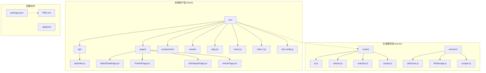

**图表来源**
- [client/src/App.jsx:1-117](file://client/src/App.jsx#L1-L117)
- [client/src/main.jsx:1-11](file://client/src/main.jsx#L1-L11)
- [client/src/api/index.js:1-50](file://client/src/api/index.js#L1-L50)

### 目录结构说明

- **src/**：源代码根目录
  - **api/**：API客户端封装，统一管理所有HTTP请求
  - **pages/**：四大功能页面组件
  - **components/**：可复用的UI组件（当前为空，预留扩展）
  - **assets/**：静态资源文件
- **public/**：静态公共资源目录
- **server/**：Node.js后端服务，提供RESTful API接口

**章节来源**
- [client/src/App.jsx:10-13](file://client/src/App.jsx#L10-L13)
- [client/src/main.jsx:1-11](file://client/src/main.jsx#L1-L11)

## 核心组件架构

### 应用入口与路由管理

应用采用Ant Design的Layout组件系统构建，实现了经典的侧边栏导航 + 主内容区域的布局模式。主应用组件App.jsx作为整个应用的容器，负责全局状态管理和页面路由切换。

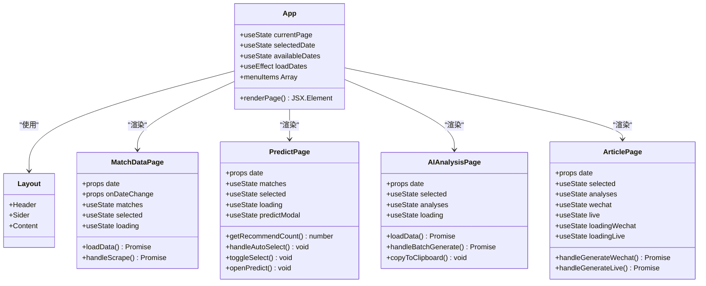

**图表来源**
- [client/src/App.jsx:23-56](file://client/src/App.jsx#L23-L56)
- [client/src/pages/MatchDataPage.jsx:6-23](file://client/src/pages/MatchDataPage.jsx#L6-L23)
- [client/src/pages/PredictPage.jsx:9-29](file://client/src/pages/PredictPage.jsx#L9-L29)
- [client/src/pages/AIAnalysisPage.jsx:9-29](file://client/src/pages/AIAnalysisPage.jsx#L9-L29)
- [client/src/pages/ArticlePage.jsx:14-38](file://client/src/pages/ArticlePage.jsx#L14-L38)

### 状态管理模式

应用采用React Hooks的状态管理模式，实现了从顶层到子组件的单向数据流：

1. **全局状态**：App.jsx管理当前页面、选中日期、可用日期列表
2. **页面状态**：各功能页面管理自身的业务状态
3. **组件状态**：UI组件管理局部交互状态

**章节来源**
- [client/src/App.jsx:24-26](file://client/src/App.jsx#L24-L26)
- [client/src/pages/MatchDataPage.jsx:7-9](file://client/src/pages/MatchDataPage.jsx#L7-L9)
- [client/src/pages/PredictPage.jsx:10-15](file://client/src/pages/PredictPage.jsx#L10-L15)

## API客户端设计

### 设计模式

API客户端采用了统一的请求封装模式，通过一个基础的request函数处理所有HTTP请求，确保了代码的一致性和可维护性。

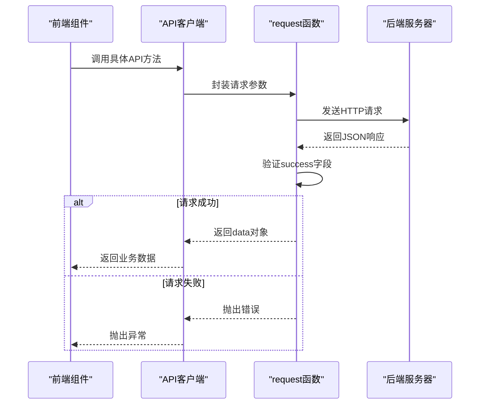

**图表来源**
- [client/src/api/index.js:3-13](file://client/src/api/index.js#L3-L13)

### 数据获取策略

API客户端实现了统一的错误处理和响应验证机制：

1. **统一基地址**：所有API请求都以`/api`为前缀
2. **响应验证**：检查`data.success`字段确保请求成功
3. **错误处理**：统一捕获并抛出业务错误
4. **类型转换**：自动处理JSON解析和字符串序列化

### API方法分类

#### 抓取相关
- `scrapeMatches()`：触发500彩票网数据抓取
- `getDates()`：获取可用比赛日期列表

#### 比赛相关
- `getMatches(date)`：获取指定日期的比赛数据
- `saveSelected(date, selectedMatches)`：保存选中的重点比赛
- `savePrediction(date, matchId, prediction)`：保存预测信息

#### AI分析相关
- `generateAnalysis(date, matchId)`：生成单场比赛AI分析
- `batchGenerateAnalysis(date)`：批量生成AI分析
- `getAnalyses(date)`：获取指定日期所有分析
- `updateAnalysis(date, matchId, content)`：更新分析内容

#### 文案相关
- `generateWechatArticle(date)`：生成公众号推文
- `generateLiveScript(date)`：生成直播文案
- `getArticles(date)`：获取指定日期所有文案

**章节来源**
- [client/src/api/index.js:15-50](file://client/src/api/index.js#L15-L50)

## 功能页面详解

### 赛事数据展示页面

MatchDataPage.jsx实现了完整的比赛数据展示和管理功能：

#### 核心功能
- **数据展示**：以表格形式展示所有比赛信息
- **数据抓取**：一键从500彩票网抓取最新比赛数据
- **状态管理**：高亮显示已选择的重点比赛
- **统计信息**：实时显示比赛总数和已选数量

#### 数据结构设计

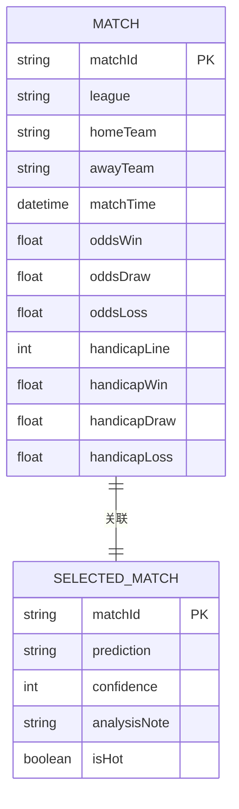

**图表来源**
- [client/src/pages/MatchDataPage.jsx:42-143](file://client/src/pages/MatchDataPage.jsx#L42-L143)

#### 用户交互流程

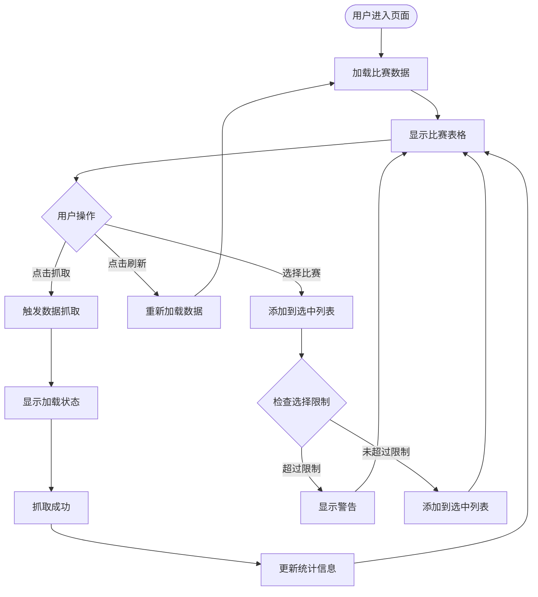

**图表来源**
- [client/src/pages/MatchDataPage.jsx:25-38](file://client/src/pages/MatchDataPage.jsx#L25-L38)
- [client/src/pages/MatchDataPage.jsx:40-40](file://client/src/pages/MatchDataPage.jsx#L40-L40)

**章节来源**
- [client/src/pages/MatchDataPage.jsx:1-198](file://client/src/pages/MatchDataPage.jsx#L1-L198)

### 智能选场预测页面

PredictPage.jsx实现了智能选场推荐和预测录入功能：

#### 智能推荐算法

系统采用多维度评分算法自动推荐重点比赛：

1. **联赛热度排序**：五大联赛优先级最高
2. **赔率差异度**：胜负平赔率差距大的比赛更有分析价值
3. **推荐数量计算**：根据总比赛数动态确定推荐数量

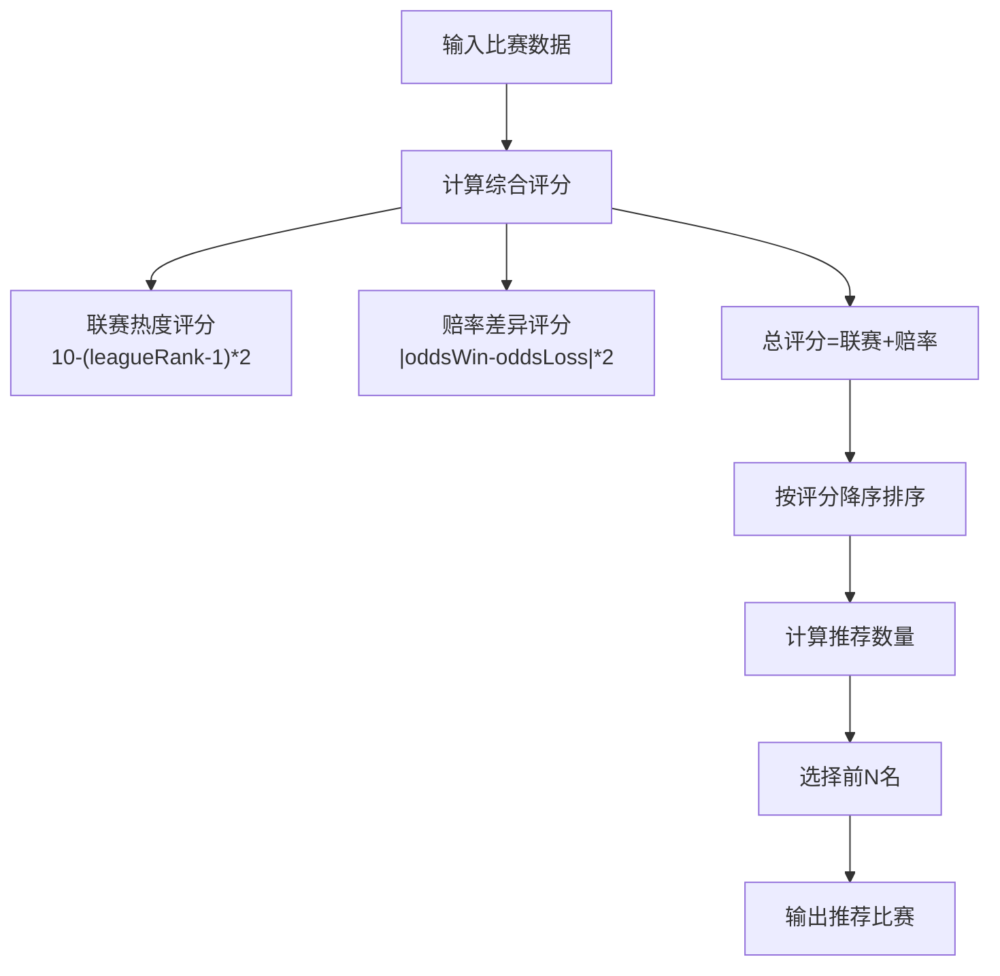

**图表来源**
- [client/src/pages/PredictPage.jsx:49-78](file://client/src/pages/PredictPage.jsx#L49-L78)

#### 预测录入表单

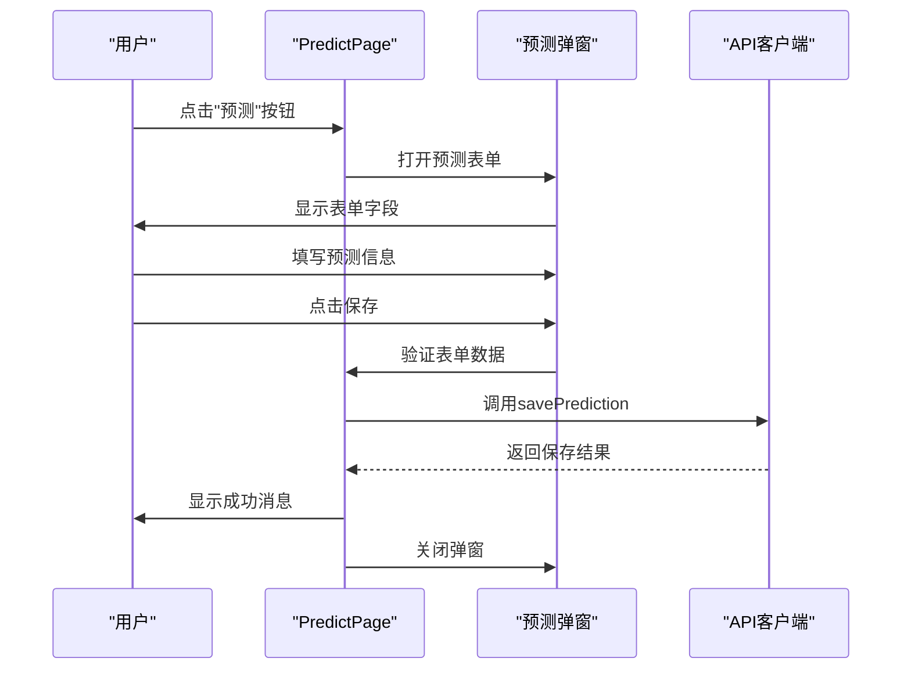

**图表来源**
- [client/src/pages/PredictPage.jsx:115-144](file://client/src/pages/PredictPage.jsx#L115-L144)

**章节来源**
- [client/src/pages/PredictPage.jsx:1-322](file://client/src/pages/PredictPage.jsx#L1-L322)

### AI分析页面

AIAnalysisPage.jsx提供了AI辅助分析的完整功能：

#### 批量生成流程

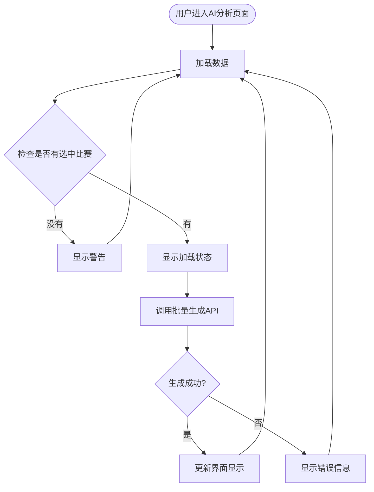

**图表来源**
- [client/src/pages/AIAnalysisPage.jsx:31-47](file://client/src/pages/AIAnalysisPage.jsx#L31-L47)

#### 编辑与复制功能

页面支持对AI生成的分析内容进行编辑和复制：

1. **内容复制**：一键复制分析内容到剪贴板
2. **内容编辑**：支持对AI生成内容进行人工优化
3. **违禁词检测**：自动检测并标注违禁词

**章节来源**
- [client/src/pages/AIAnalysisPage.jsx:1-203](file://client/src/pages/AIAnalysisPage.jsx#L1-L203)

### 文案生成页面

ArticlePage.jsx实现了公众号推文和直播文案的智能生成：

#### 生成条件检查

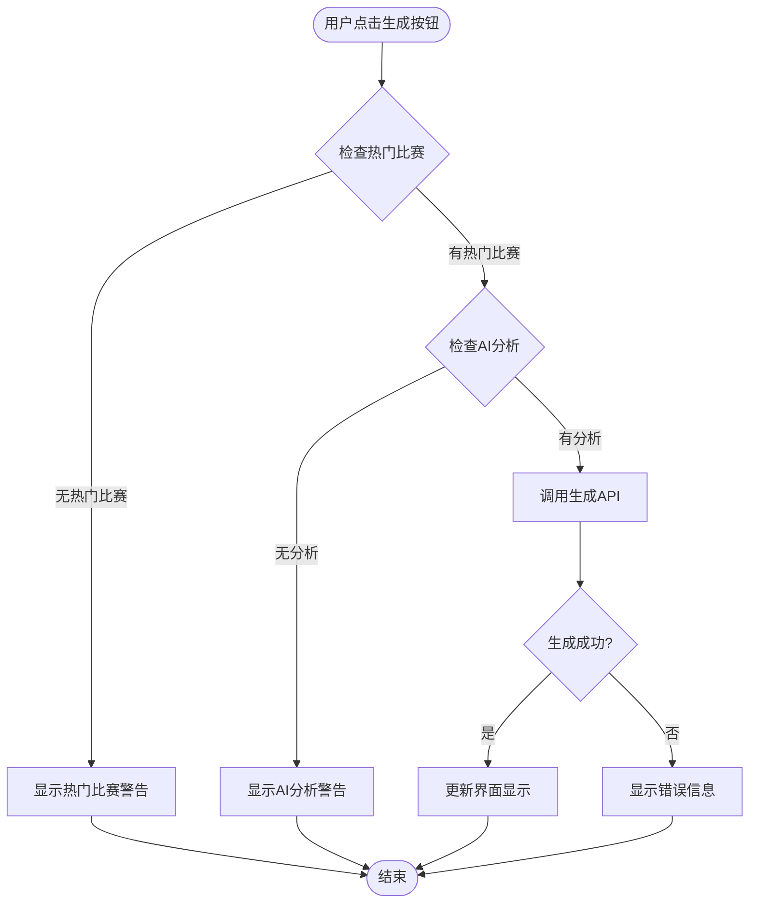

**图表来源**
- [client/src/pages/ArticlePage.jsx:44-86](file://client/src/pages/ArticlePage.jsx#L44-L86)

#### 文案类型对比

| 功能特性 | 公众号推文 | 直播文案 |
|---------|-----------|---------|
| 生成目标 | 吸引新粉丝关注 | 20:30直播使用 |
| 内容结构 | 开头-基本面-赔率解读-结论-结尾 | 开场白-每场分析-基本面-结论-互动 |
| 风格要求 | 专业、高深、逻辑闭环 | 口语化、自信、有节奏感 |
| 合规要求 | 符合微信公众号规范 | 符合视频号直播规范 |
| 违禁词过滤 | 是 | 是 |

**章节来源**
- [client/src/pages/ArticlePage.jsx:1-267](file://client/src/pages/ArticlePage.jsx#L1-L267)

## 状态管理与组件通信

### 父子组件通信机制

应用采用Props传递和回调函数的方式实现组件间通信：

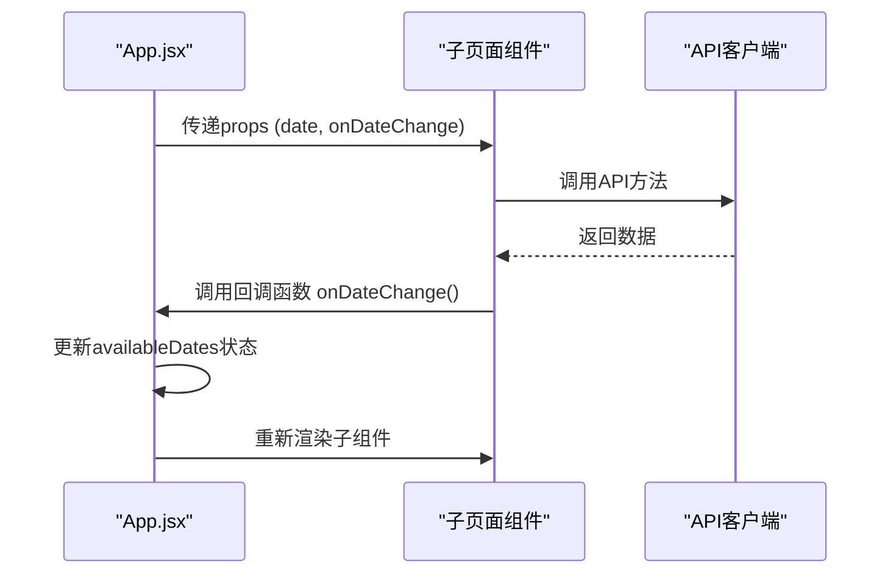

**图表来源**
- [client/src/App.jsx:50-53](file://client/src/App.jsx#L50-L53)
- [client/src/pages/MatchDataPage.jsx:32-32](file://client/src/pages/MatchDataPage.jsx#L32-L32)

### 状态提升策略

对于跨组件共享的状态，采用状态提升到最近公共祖先的方式：

1. **日期选择**：App.jsx管理当前选中日期
2. **日期列表**：App.jsx管理可用日期列表
3. **页面切换**：App.jsx管理当前显示页面

### 错误边界处理

各页面组件都实现了完善的错误处理机制：

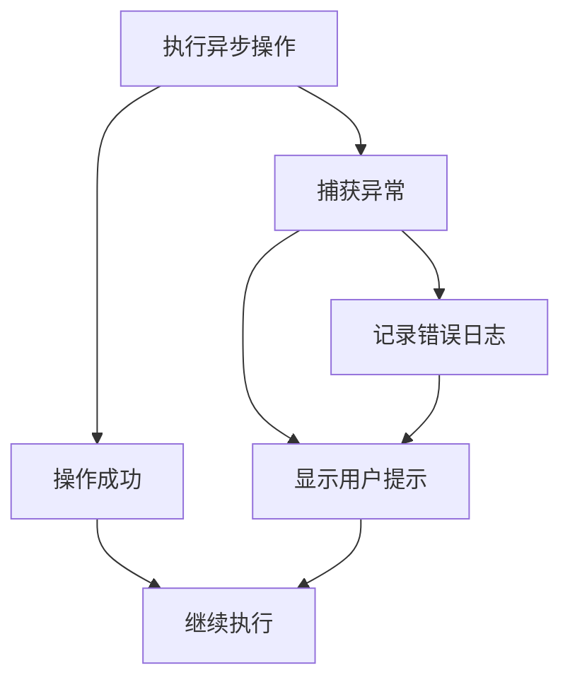

**图表来源**
- [client/src/pages/MatchDataPage.jsx:20-22](file://client/src/pages/MatchDataPage.jsx#L20-L22)
- [client/src/pages/PredictPage.jsx:26-28](file://client/src/pages/PredictPage.jsx#L26-L28)

**章节来源**
- [client/src/App.jsx:23-56](file://client/src/App.jsx#L23-L56)

## UI组件设计规范

### Ant Design组件体系

应用全面采用Ant Design组件库，确保了界面的一致性和用户体验的统一性：

#### 布局组件
- **Layout**：提供完整的页面布局结构
- **Card**：用于内容区块的卡片式展示
- **Row/Col**：响应式栅格系统

#### 表单组件
- **Form**：表单数据收集和验证
- **Input/Select**：各种输入控件
- **Rate**：星级评分组件
- **Switch**：开关控件

#### 数据展示组件
- **Table**：表格数据展示
- **List**：列表数据展示
- **Tabs**：标签页切换

#### 反馈组件
- **message**：全局消息提示
- **Modal**：模态框对话
- **Alert**：警告提示

### 自定义样式规范

应用实现了统一的样式规范和主题定制：

#### 主题色板
- **主色调**：#1677ff（蓝色）
- **背景色**：渐变背景（#1a1a2e 到 #16213e）
- **强调色**：绿色（#52c41a）、红色（#ff4d4f）

#### 组件样式
- **选中行高亮**：#fff7e6背景色
- **标签间距**：统一的margin-bottom
- **卡片内边距**：合理的内边距设置

**章节来源**
- [client/src/App.jsx:59-65](file://client/src/App.jsx#L59-L65)
- [client/src/index.css:17-34](file://client/src/index.css#L17-L34)

## 响应式布局与用户体验

### 响应式设计策略

应用采用Ant Design的响应式栅格系统，确保在不同设备上的良好体验：

#### 断点设置
- **移动端**：屏幕宽度小于768px
- **平板**：屏幕宽度768px-1024px
- **桌面端**：屏幕宽度大于1024px

#### 栅格系统
- **移动端**：2列布局
- **平板端**：4列布局  
- **桌面端**：8列布局

### 用户体验优化

#### 加载状态管理
- **骨架屏**：关键数据加载时显示占位符
- **进度指示器**：长时间操作显示进度条
- **状态反馈**：操作成功/失败的即时反馈

#### 交互设计
- **确认对话框**：重要操作前的二次确认
- **表单验证**：实时的表单输入验证
- **键盘快捷键**：支持键盘操作提高效率

#### 错误处理
- **友好的错误提示**：清晰的错误信息说明
- **重试机制**：网络错误时提供重试选项
- **降级方案**：部分功能不可用时的替代方案

**章节来源**
- [client/src/pages/MatchDataPage.jsx:25-38](file://client/src/pages/MatchDataPage.jsx#L25-L38)
- [client/src/pages/AIAnalysisPage.jsx:109-113](file://client/src/pages/AIAnalysisPage.jsx#L109-L113)

## 性能考虑

### 前端性能优化

#### 代码分割
- **路由懒加载**：按需加载页面组件
- **组件拆分**：将大型组件拆分为更小的可复用组件

#### 缓存策略
- **数据缓存**：避免重复的API请求
- **状态缓存**：保持组件状态减少重新渲染

#### 渲染优化
- **虚拟滚动**：大数据量表格使用虚拟滚动
- **防抖节流**：输入框和搜索功能使用防抖

### 网络请求优化

#### 请求合并
- **批量操作**：支持批量生成和批量保存
- **请求去重**：避免重复发送相同的请求

#### 错误恢复
- **自动重试**：网络错误时自动重试
- **超时处理**：设置合理的请求超时时间

**章节来源**
- [client/src/api/index.js:3-13](file://client/src/api/index.js#L3-L13)

## 故障排除指南

### 常见问题诊断

#### API连接问题
1. **检查代理配置**：确认Vite代理指向正确的后端地址
2. **验证CORS设置**：确保后端允许跨域请求
3. **检查网络连接**：确认能够访问后端服务

#### 数据加载失败
1. **检查日期格式**：确保传入的日期格式正确
2. **验证API返回**：检查后端API是否正常返回数据
3. **查看控制台错误**：分析JavaScript错误信息

#### UI显示异常
1. **检查CSS样式**：确认自定义样式是否正确加载
2. **验证组件依赖**：检查Ant Design组件版本兼容性
3. **清理浏览器缓存**：清除可能影响样式的缓存

### 调试技巧

#### 开发工具使用
- **React DevTools**：检查组件树和状态变化
- **Network面板**：监控API请求和响应
- **Console面板**：查看错误日志和调试信息

#### 日志记录
- **关键操作日志**：记录重要的用户操作
- **错误堆栈跟踪**：保留详细的错误信息
- **性能指标**：监控页面加载时间和API响应时间

**章节来源**
- [client/vite.config.js:9-14](file://client/vite.config.js#L9-L14)

## 总结

AutoMatch前端应用展现了现代React应用的最佳实践，通过清晰的组件架构、统一的API设计、完善的错误处理和优秀的用户体验设计，为足球竞彩分析师提供了一个功能完整、易于使用的工具平台。

### 技术亮点

1. **模块化设计**：清晰的功能模块划分，便于维护和扩展
2. **状态管理**：合理的状态提升和单向数据流设计
3. **API抽象**：统一的API客户端封装，简化数据获取
4. **用户体验**：丰富的交互反馈和响应式设计
5. **错误处理**：完善的错误捕获和用户提示机制

### 未来改进方向

1. **状态管理升级**：考虑引入Redux或Zustand进行复杂状态管理
2. **组件库扩展**：增加更多可复用的UI组件
3. **性能监控**：集成性能监控工具进行持续优化
4. **测试覆盖**：增加单元测试和集成测试
5. **国际化支持**：考虑支持多语言界面

该应用为类似的专业工具开发提供了良好的参考模板，其设计理念和实现方式值得在其他项目中借鉴和应用。