# 前端架构概览

<cite>
**本文档引用的文件**
- [client/src/App.jsx](file://client/src/App.jsx)
- [client/src/main.jsx](file://client/src/main.jsx)
- [client/src/api/index.js](file://client/src/api/index.js)
- [client/src/pages/MatchDataPage.jsx](file://client/src/pages/MatchDataPage.jsx)
- [client/src/pages/PredictPage.jsx](file://client/src/pages/PredictPage.jsx)
- [client/src/pages/AIAnalysisPage.jsx](file://client/src/pages/AIAnalysisPage.jsx)
- [client/src/pages/ArticlePage.jsx](file://client/src/pages/ArticlePage.jsx)
- [client/src/index.css](file://client/src/index.css)
- [client/package.json](file://client/package.json)
- [client/vite.config.js](file://client/vite.config.js)
- [client/README.md](file://client/README.md)
- [PRD.md](file://PRD.md)
</cite>

## 目录
1. [项目概述](#项目概述)
2. [项目结构](#项目结构)
3. [核心组件架构](#核心组件架构)
4. [状态管理机制](#状态管理机制)
5. [路由管理机制](#路由管理机制)
6. [UI框架集成](#ui框架集成)
7. [布局系统实现](#布局系统实现)
8. [国际化配置](#国际化配置)
9. [主题定制配置](#主题定制配置)
10. [组件间通信模式](#组件间通信模式)
11. [数据流分析](#数据流分析)
12. [性能考虑](#性能考虑)
13. [故障排除指南](#故障排除指南)
14. [总结](#总结)

## 项目概述

AutoMatch是一个基于React + Vite + Ant Design构建的足球赛事智能分析工具前端应用。该应用旨在为足球竞彩分析师提供一套完整的本地化解决方案，集成了赛事数据抓取、智能选场、AI辅助分析、文案生成等功能模块。

### 核心特性
- **实时数据抓取**: 从500彩票网自动抓取竞彩足球比赛数据
- **智能选场推荐**: 基于联赛热度和赔率差异的自动推荐算法
- **AI分析生成**: 集成智谱GLM-4大模型进行专业赛事分析
- **多平台文案生成**: 支持公众号推文和直播文案的自动生成
- **本地化存储**: 基于文件系统的数据持久化方案

**章节来源**
- [PRD.md:14-21](file://PRD.md#L14-L21)
- [PRD.md:24-301](file://PRD.md#L24-L301)

## 项目结构

前端项目采用模块化的文件组织结构，主要分为以下几个核心目录：

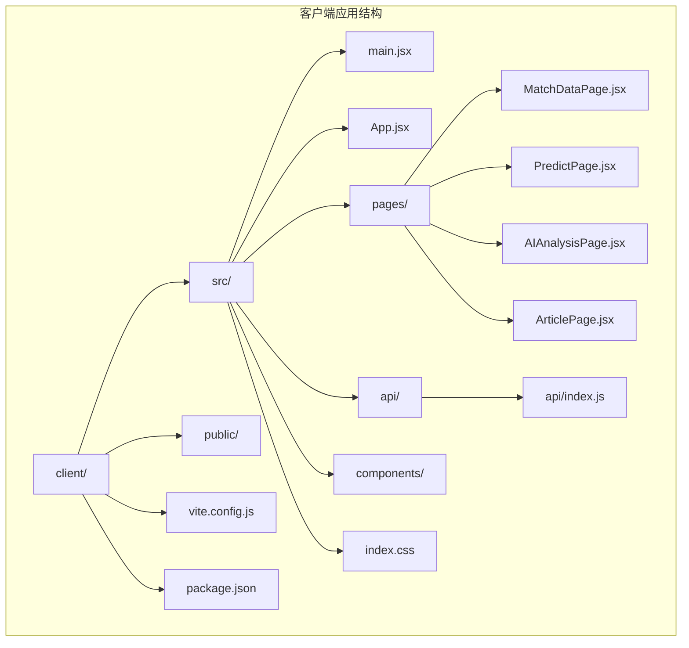

**图表来源**
- [client/src/main.jsx:1-11](file://client/src/main.jsx#L1-L11)
- [client/src/App.jsx:1-117](file://client/src/App.jsx#L1-L117)

### 目录结构说明

- **src/**: 源代码目录，包含所有React组件和页面
- **public/**: 静态资源目录
- **api/**: 封装的API请求模块，统一处理HTTP请求
- **pages/**: 页面级组件，每个页面对应一个功能模块
- **components/**: 可复用的UI组件（当前项目中为空）

**章节来源**
- [client/src/main.jsx:1-11](file://client/src/main.jsx#L1-L11)
- [client/package.json:1-31](file://client/package.json#L1-L31)

## 核心组件架构

### 应用根组件结构

应用采用单一入口点的设计，通过App.jsx作为根组件管理整个应用的状态和布局：

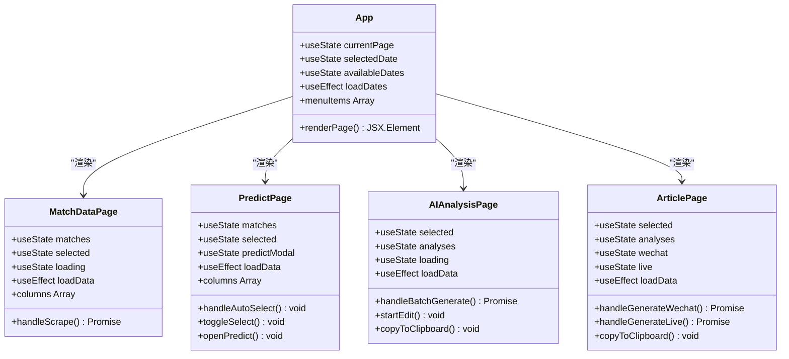

**图表来源**
- [client/src/App.jsx:23-117](file://client/src/App.jsx#L23-L117)
- [client/src/pages/MatchDataPage.jsx:6-198](file://client/src/pages/MatchDataPage.jsx#L6-L198)
- [client/src/pages/PredictPage.jsx:9-322](file://client/src/pages/PredictPage.jsx#L9-L322)
- [client/src/pages/AIAnalysisPage.jsx:9-203](file://client/src/pages/AIAnalysisPage.jsx#L9-L203)
- [client/src/pages/ArticlePage.jsx:14-267](file://client/src/pages/ArticlePage.jsx#L14-L267)

### 组件层次关系

应用采用自上而下的组件层次结构，每个页面组件都继承自基础的App组件状态：

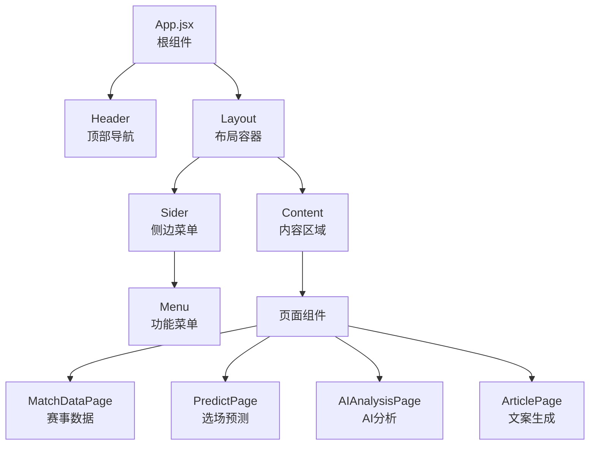

**图表来源**
- [client/src/App.jsx:58-114](file://client/src/App.jsx#L58-L114)

**章节来源**
- [client/src/App.jsx:23-117](file://client/src/App.jsx#L23-L117)

## 状态管理机制

### 全局状态管理

应用采用React内置的状态管理机制，通过useState和useEffect实现状态的声明式管理：

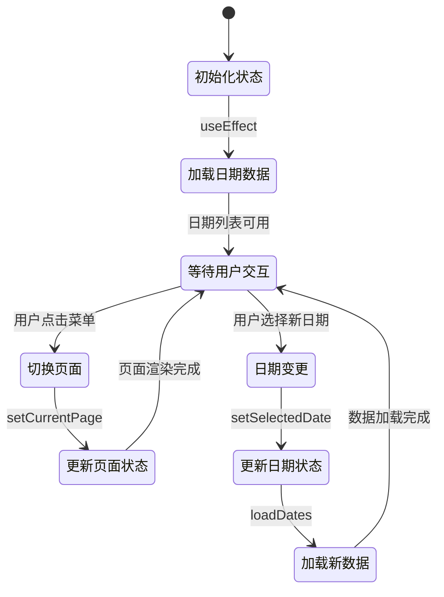

**图表来源**
- [client/src/App.jsx:24-40](file://client/src/App.jsx#L24-L40)

### 页面级状态管理

每个页面组件都有独立的状态管理逻辑，通过props传递共享状态：

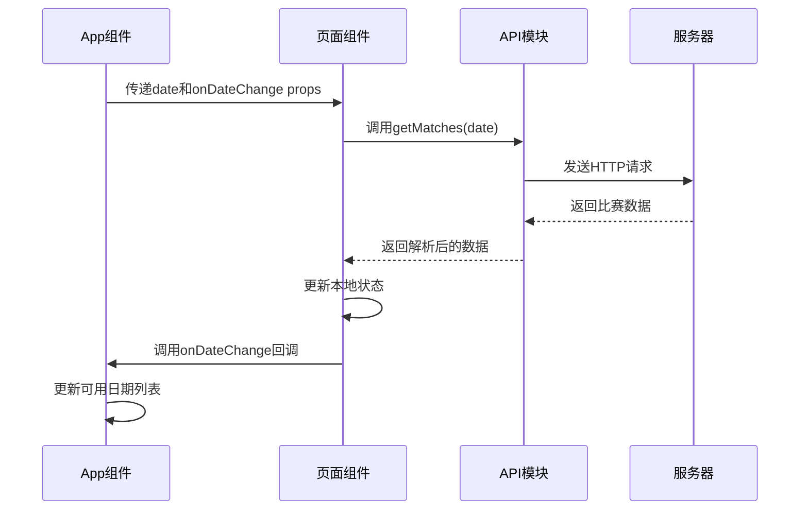

**图表来源**
- [client/src/pages/MatchDataPage.jsx:15-23](file://client/src/pages/MatchDataPage.jsx#L15-L23)
- [client/src/api/index.js:19-25](file://client/src/api/index.js#L19-L25)

**章节来源**
- [client/src/App.jsx:24-56](file://client/src/App.jsx#L24-L56)
- [client/src/pages/MatchDataPage.jsx:6-38](file://client/src/pages/MatchDataPage.jsx#L6-L38)

## 路由管理机制

### 基于组件的路由实现

应用采用基于组件的路由管理方式，通过状态切换实现页面导航：

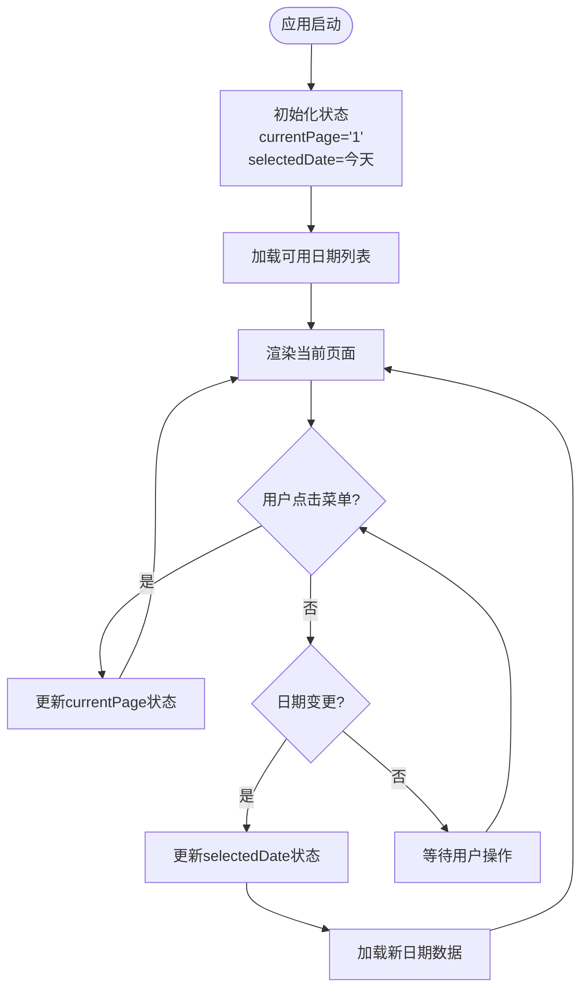

**图表来源**
- [client/src/App.jsx:48-56](file://client/src/App.jsx#L48-L56)
- [client/src/App.jsx:92-98](file://client/src/App.jsx#L92-L98)

### 页面切换逻辑

页面切换通过简单的switch语句实现，确保了路由逻辑的简洁性和可维护性：

| 菜单项 | 页面组件 | 状态键 | 功能描述 |
|--------|----------|--------|----------|
| 赛事数据 | MatchDataPage | '1' | 比赛数据展示和抓取 |
| 选场预测 | PredictPage | '2' | 重点比赛选择和预测 |
| AI分析 | AIAnalysisPage | '3' | AI分析生成和管理 |
| 文案生成 | ArticlePage | '4' | 公众号和直播文案生成 |

**章节来源**
- [client/src/App.jsx:41-56](file://client/src/App.jsx#L41-L56)
- [client/src/App.jsx:92-98](file://client/src/App.jsx#L92-L98)

## UI框架集成

### Ant Design集成架构

应用深度集成了Ant Design UI框架，提供了丰富的组件库和设计系统：

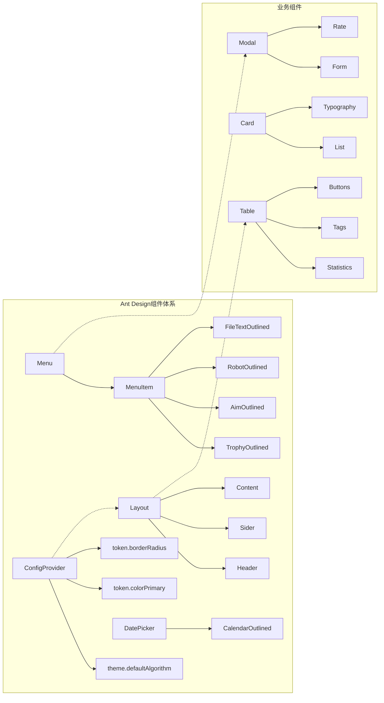

**图表来源**
- [client/src/App.jsx:1-18](file://client/src/App.jsx#L1-L18)
- [client/src/App.jsx:59-65](file://client/src/App.jsx#L59-L65)
- [client/src/App.jsx:91-98](file://client/src/App.jsx#L91-L98)

### 组件使用模式

应用中Ant Design组件的使用遵循统一的模式：

1. **布局组件**: 使用Layout、Header、Sider、Content构建页面骨架
2. **导航组件**: 使用Menu和ConfigProvider实现主题和国际化支持
3. **数据展示**: 使用Table、Card、List等组件展示业务数据
4. **表单交互**: 使用Form、Modal、Button等组件处理用户输入

**章节来源**
- [client/src/App.jsx:1-117](file://client/src/App.jsx#L1-L117)

## 布局系统实现

### 响应式布局架构

应用采用Ant Design的Layout组件实现响应式布局，确保在不同设备上的良好体验：

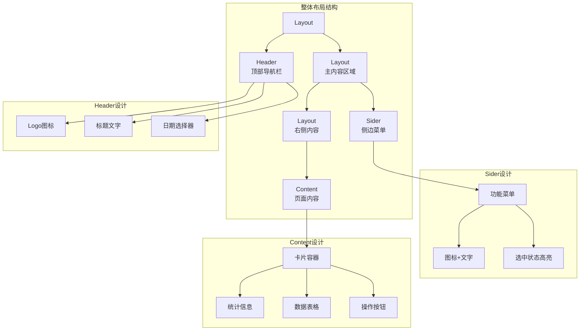

**图表来源**
- [client/src/App.jsx:58-114](file://client/src/App.jsx#L58-L114)

### 设计元素配置

应用在CSS中定义了特定的设计元素：

| 设计元素 | 配置值 | 作用 |
|----------|--------|------|
| 选中行高亮 | #fff7e6 | 突出显示已选中的比赛 |
| 选中行悬停 | #ffe7ba | 提供交互反馈 |
| 卡片段落间距 | 8px | 改善阅读体验 |
| 标签底部间距 | 2px | 优化标签布局 |

**章节来源**
- [client/src/index.css:17-34](file://client/src/index.css#L17-L34)
- [client/src/App.jsx:67-89](file://client/src/App.jsx#L67-L89)

## 国际化配置

### 语言环境设置

应用集成了Ant Design的国际化支持，采用简体中文作为默认语言：

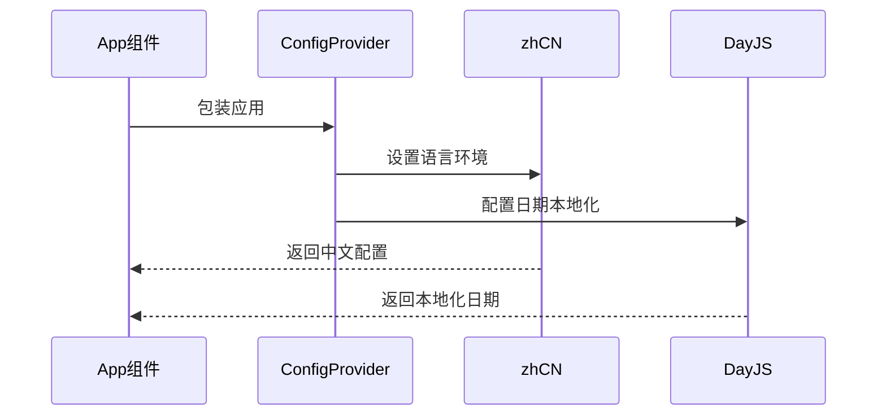

**图表来源**
- [client/src/App.jsx:16-19](file://client/src/App.jsx#L16-L19)
- [client/src/App.jsx:59-65](file://client/src/App.jsx#L59-L65)

### 国际化实现细节

1. **Ant Design国际化**: 通过ConfigProvider组件设置locale属性
2. **日期本地化**: 使用dayjs库进行中文日期格式化
3. **组件本地化**: 所有Ant Design组件自动适配中文界面

**章节来源**
- [client/src/App.jsx:16-19](file://client/src/App.jsx#L16-L19)
- [client/src/App.jsx:59-65](file://client/src/App.jsx#L59-L65)

## 主题定制配置

### Ant Design主题系统

应用使用Ant Design的主题系统进行视觉定制，实现了品牌化的视觉效果：

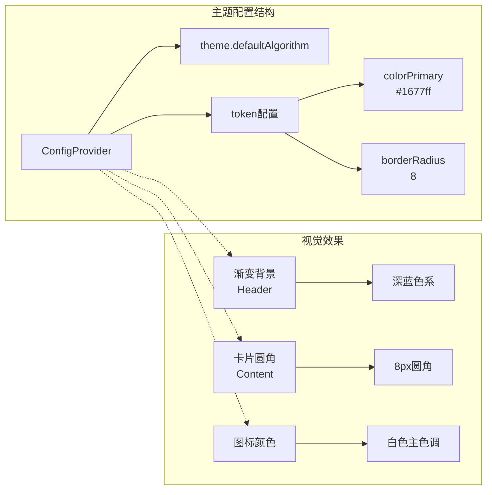

**图表来源**
- [client/src/App.jsx:59-65](file://client/src/App.jsx#L59-L65)
- [client/src/App.jsx:67-89](file://client/src/App.jsx#L67-L89)

### 主题定制要点

1. **主色调**: 使用#1677ff蓝色作为品牌主色
2. **圆角设计**: 统一8px圆角半径，提升现代感
3. **渐变背景**: Header采用深色渐变背景，增强层次感
4. **字体系统**: 采用系统默认字体，确保跨平台一致性

**章节来源**
- [client/src/App.jsx:59-65](file://client/src/App.jsx#L59-L65)
- [client/src/App.jsx:67-89](file://client/src/App.jsx#L67-L89)

## 组件间通信模式

### Props传递模式

应用采用Props驱动的组件通信模式，实现了清晰的数据流向：

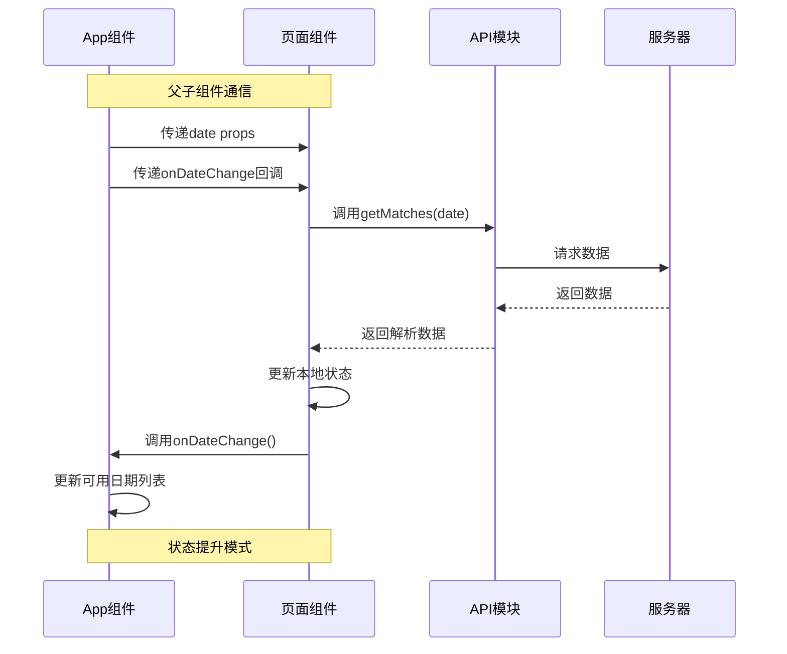

**图表来源**
- [client/src/pages/MatchDataPage.jsx:32-33](file://client/src/pages/MatchDataPage.jsx#L32-L33)
- [client/src/App.jsx:28-39](file://client/src/App.jsx#L28-L39)

### 回调函数模式

应用广泛使用回调函数实现组件间的异步通信：

| 回调类型 | 函数名 | 参数 | 用途 |
|----------|--------|------|------|
| 日期变更回调 | onDateChange | () => void | 通知父组件日期更新 |
| 预测保存回调 | savePrediction | (date, matchId, values) | 保存预测数据 |
| 分析更新回调 | updateAnalysis | (date, matchId, content) | 更新AI分析内容 |

**章节来源**
- [client/src/pages/MatchDataPage.jsx:32-33](file://client/src/pages/MatchDataPage.jsx#L32-L33)
- [client/src/pages/PredictPage.jsx:138-144](file://client/src/pages/PredictPage.jsx#L138-L144)
- [client/src/pages/AIAnalysisPage.jsx:51-58](file://client/src/pages/AIAnalysisPage.jsx#L51-L58)

## 数据流分析

### API请求流程

应用通过统一的API模块管理所有HTTP请求，实现了清晰的数据流：

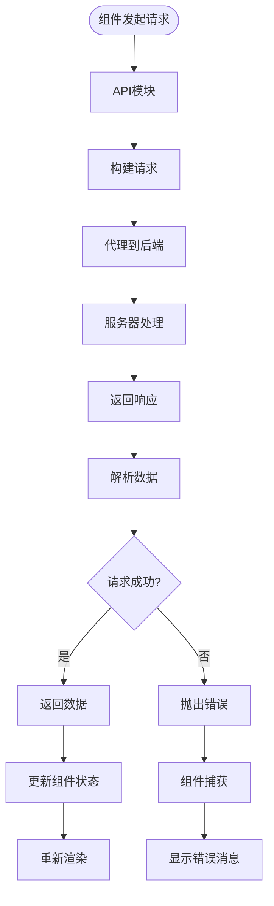

**图表来源**
- [client/src/api/index.js:3-13](file://client/src/api/index.js#L3-L13)
- [client/vite.config.js:9-15](file://client/vite.config.js#L9-L15)

### 错误处理机制

应用实现了多层次的错误处理机制：

1. **网络层错误**: 通过fetch API的异常处理
2. **业务层错误**: 通过response.success字段判断
3. **UI层错误**: 通过message组件显示用户友好的错误信息

**章节来源**
- [client/src/api/index.js:3-13](file://client/src/api/index.js#L3-L13)
- [client/src/pages/MatchDataPage.jsx:20-23](file://client/src/pages/MatchDataPage.jsx#L20-L23)

## 性能考虑

### 构建配置优化

应用使用Vite作为构建工具，提供了快速的开发体验和高效的生产构建：

```mermaid
graph TB
subgraph "开发配置"
A[Vite Dev Server] --> B[端口5173]
A --> C[代理配置]
C --> D[/api -> localhost:3001]
end
subgraph "生产构建"
E[Vite Build] --> F[代码分割]
E --> G[Tree Shaking]
E --> H[压缩优化]
end
subgraph "依赖管理"
I[React 19.2.4] --> J[轻量级核心]
K[Ant Design 6.3.5] --> L[按需加载]
M[DayJS 1.11.20] --> N[轻量级日期处理]
end
```

**图表来源**
- [client/vite.config.js:5-16](file://client/vite.config.js#L5-L16)
- [client/package.json:12-18](file://client/package.json#L12-L18)

### 性能优化策略

1. **按需加载**: Ant Design组件按需导入，减少包体积
2. **虚拟滚动**: 大数据表格使用虚拟滚动优化渲染性能
3. **状态缓存**: 合理使用useState避免不必要的重渲染
4. **懒加载**: 图标组件按需加载，提升首屏性能

**章节来源**
- [client/vite.config.js:5-16](file://client/vite.config.js#L5-L16)
- [client/package.json:12-18](file://client/package.json#L12-L18)

## 故障排除指南

### 常见问题诊断

#### API连接问题
- **症状**: 页面无法加载数据，控制台显示网络错误
- **原因**: 代理配置不正确或后端服务未启动
- **解决**: 检查vite.config.js中的代理配置和后端服务状态

#### 国际化显示问题
- **症状**: 界面显示英文而非中文
- **原因**: zhCN配置未正确应用或locale文件未加载
- **解决**: 确认ConfigProvider的locale属性设置

#### 主题样式问题
- **症状**: 组件样式不符合预期或主题未生效
- **原因**: ConfigProvider配置错误或CSS优先级问题
- **解决**: 检查token配置和CSS加载顺序

**章节来源**
- [client/vite.config.js:9-15](file://client/vite.config.js#L9-L15)
- [client/src/App.jsx:59-65](file://client/src/App.jsx#L59-L65)

## 总结

AutoMatch前端应用展现了现代React应用的最佳实践，通过合理的架构设计和组件组织，实现了功能完整且用户体验优秀的体育数据分析工具。

### 架构优势

1. **清晰的层次结构**: 从App.jsx到具体页面组件的层次分明
2. **统一的状态管理**: 基于React Hooks的状态管理模式
3. **完善的UI集成**: Ant Design的深度集成提供了丰富的组件生态
4. **灵活的主题定制**: 支持品牌化的视觉设计
5. **高效的构建系统**: Vite提供的快速开发体验

### 技术亮点

- **组件化设计**: 每个功能模块独立封装，便于维护和扩展
- **响应式布局**: 适配不同屏幕尺寸的现代化布局
- **国际化支持**: 完整的多语言支持方案
- **错误处理**: 多层次的错误处理和用户反馈机制

该应用为足球竞彩分析师提供了高效的工作流程支持，通过智能化的功能设计和专业的界面设计，显著提升了工作效率和分析质量。