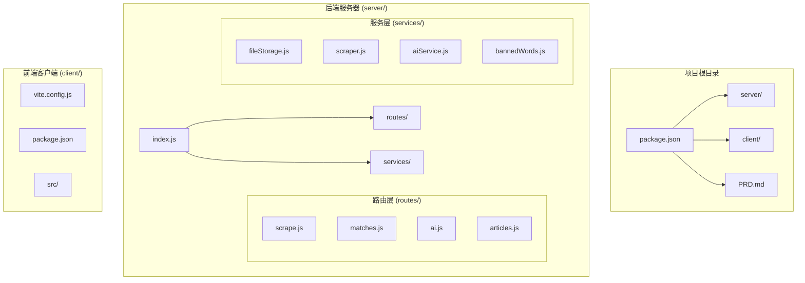
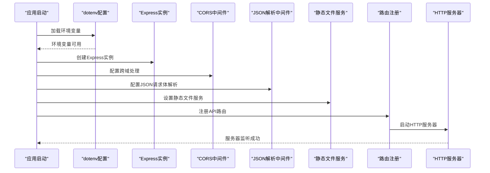
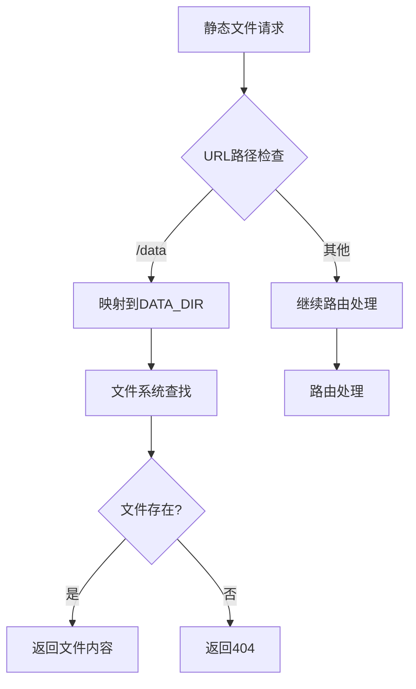
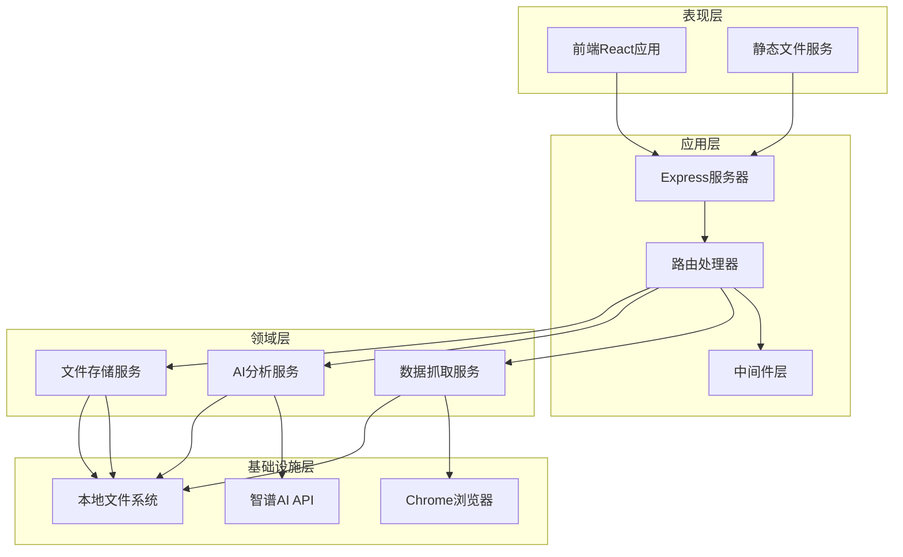
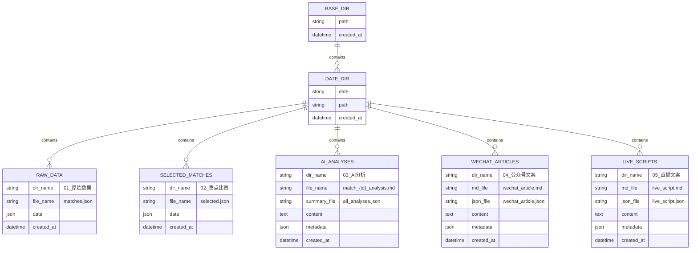
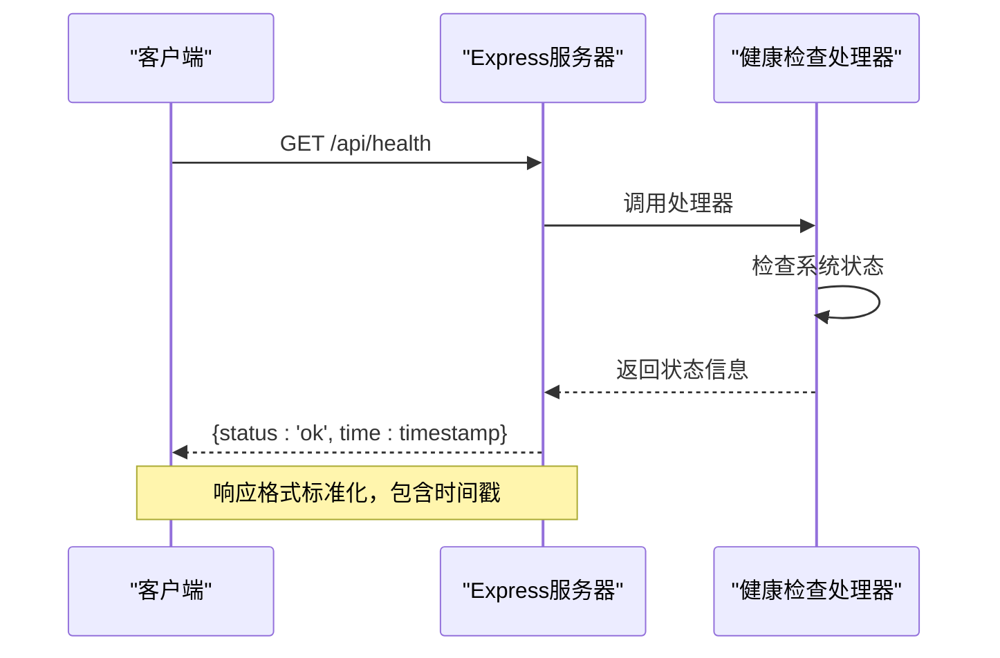
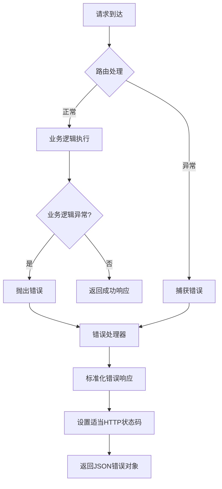
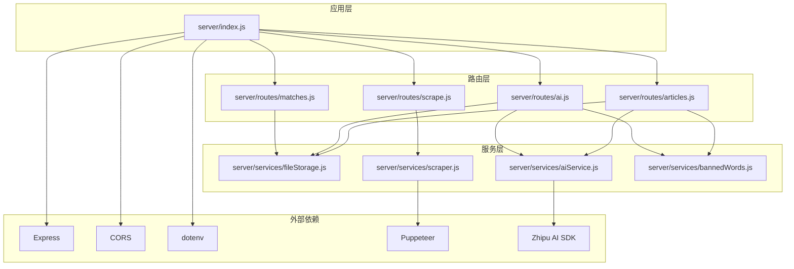
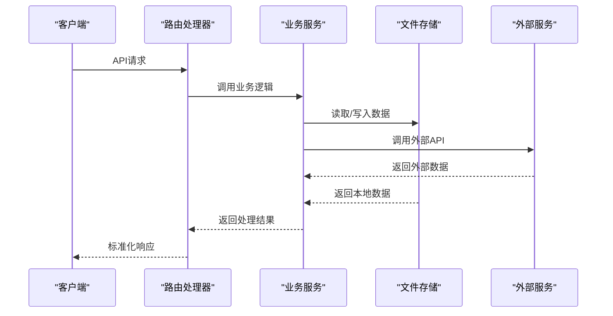

# Express应用配置

<cite>
**本文档引用的文件**
- [server/index.js](file://server/index.js)
- [package.json](file://package.json)
- [PRD.md](file://PRD.md)
- [server/routes/scrape.js](file://server/routes/scrape.js)
- [server/routes/matches.js](file://server/routes/matches.js)
- [server/routes/ai.js](file://server/routes/ai.js)
- [server/routes/articles.js](file://server/routes/articles.js)
- [server/services/fileStorage.js](file://server/services/fileStorage.js)
- [server/services/scraper.js](file://server/services/scraper.js)
- [server/services/aiService.js](file://server/services/aiService.js)
- [server/services/bannedWords.js](file://server/services/bannedWords.js)
</cite>

## 目录
1. [简介](#简介)
2. [项目结构](#项目结构)
3. [核心组件](#核心组件)
4. [架构概览](#架构概览)
5. [详细组件分析](#详细组件分析)
6. [依赖关系分析](#依赖关系分析)
7. [性能考虑](#性能考虑)
8. [故障排除指南](#故障排除指南)
9. [结论](#结论)

## 简介

AutoMatch是一个基于Node.js和Express的足球赛事智能分析工具。该项目集成了赛事数据抓取、智能选场、AI辅助分析、文案生成等功能，为足球竞彩分析师提供本地化的智能分析助手。

本项目采用前后端分离架构，后端使用Express.js提供RESTful API服务，前端使用React + Vite构建用户界面。核心功能包括：
- 赛事数据抓取（Puppeteer无头浏览器）
- AI智能分析（智谱GLM-4大模型）
- 文案自动生成（公众号推文、直播脚本）
- 本地文件存储系统

## 项目结构

AutoMatch项目采用模块化组织方式，主要分为以下几个核心部分：



**图表来源**
- [server/index.js:1-49](file://server/index.js#L1-L49)
- [package.json:1-23](file://package.json#L1-L23)

**章节来源**
- [server/index.js:1-49](file://server/index.js#L1-L49)
- [package.json:1-23](file://package.json#L1-L23)

## 核心组件

### 应用初始化流程

Express应用的初始化过程遵循标准的模块化模式，包含环境配置、中间件设置、路由注册和服务器启动等步骤。



**图表来源**
- [server/index.js:1-49](file://server/index.js#L1-L49)

### 环境变量配置

应用使用dotenv库来管理环境变量，支持以下关键配置：

| 环境变量 | 默认值 | 用途 | 必需性 |
|---------|--------|------|--------|
| PORT | 3001 | 服务器监听端口 | 否 |
| DATA_DIR | ~/Desktop/AutoMatch | 数据存储目录 | 否 |
| ZHIPU_API_KEY | 无 | 智谱AI API密钥 | 是 |
| CHROME_PATH | 系统路径 | Chrome浏览器路径 | 否 |

**章节来源**
- [server/index.js:1-12](file://server/index.js#L1-L12)
- [server/services/fileStorage.js:4](file://server/services/fileStorage.js#L4)
- [server/services/aiService.js:3](file://server/services/aiService.js#L3)

### CORS跨域处理配置

应用使用默认配置的CORS中间件，允许来自任何源的跨域请求。这种配置适用于本地开发环境，但在生产环境中建议限制特定域名。

**章节来源**
- [server/index.js:14](file://server/index.js#L14)

### JSON请求体解析配置

应用配置了支持10MB大小的JSON请求体解析，满足AI分析和大量数据传输的需求。

**章节来源**
- [server/index.js:15](file://server/index.js#L15)

### 静态文件服务配置

应用提供数据文件的静态访问服务，默认指向用户桌面的AutoMatch目录：



**图表来源**
- [server/index.js:17-19](file://server/index.js#L17-L19)
- [server/services/fileStorage.js:4](file://server/services/fileStorage.js#L4)

**章节来源**
- [server/index.js:17-19](file://server/index.js#L17-L19)
- [server/services/fileStorage.js:4](file://server/services/fileStorage.js#L4)

## 架构概览

AutoMatch采用分层架构设计，清晰分离关注点：



**图表来源**
- [server/index.js:6-25](file://server/index.js#L6-L25)
- [server/services/scraper.js:1-295](file://server/services/scraper.js#L1-L295)
- [server/services/aiService.js:1-212](file://server/services/aiService.js#L1-L212)
- [server/services/fileStorage.js:1-196](file://server/services/fileStorage.js#L1-L196)

## 详细组件分析

### 数据目录配置与文件服务

文件存储系统实现了完整的数据持久化机制，支持按日期组织的多层级目录结构：



**图表来源**
- [PRD.md:205-234](file://PRD.md#L205-L234)
- [server/services/fileStorage.js:32-139](file://server/services/fileStorage.js#L32-L139)

#### 目录结构设计原则

1. **按日期分层**：每个日期创建独立目录，便于数据管理和备份
2. **功能模块化**：不同类型的文件存放在专门的子目录中
3. **文件格式标准化**：原始数据使用JSON，分析内容使用Markdown
4. **双格式存储**：重要文件同时保存为MD和JSON格式，便于不同场景使用

**章节来源**
- [PRD.md:205-234](file://PRD.md#L205-L234)
- [server/services/fileStorage.js:32-139](file://server/services/fileStorage.js#L32-L139)

### 路由中间件注册机制

应用采用模块化路由设计，每个功能模块都有独立的路由文件：

```mermaid
graph LR
subgraph "路由注册流程"
A[server/index.js] --> B[导入路由模块]
B --> C[注册API路由]
C --> D[/api/scrape]
C --> E[/api/matches]
C --> F[/api/ai]
C --> G[/api/articles]
C --> H[/data]
end
subgraph "静态文件路由"
H --> I[DATA_DIR映射]
I --> J[文件系统访问]
end
```

**图表来源**
- [server/index.js:22-25](file://server/index.js#L22-L25)

#### 健康检查端点设计

应用提供了简单的健康检查端点，用于监控服务器状态：



**图表来源**
- [server/index.js:40-43](file://server/index.js#L40-L43)

**章节来源**
- [server/index.js:22-25](file://server/index.js#L22-L25)
- [server/index.js:40-43](file://server/index.js#L40-L43)

### 错误处理机制

应用采用了统一的错误处理模式，确保API响应的一致性和可靠性：



**图表来源**
- [server/routes/scrape.js:16-22](file://server/routes/scrape.js#L16-L22)
- [server/routes/matches.js:12-14](file://server/routes/matches.js#L12-L14)
- [server/routes/ai.js:30-33](file://server/routes/ai.js#L30-L33)

**章节来源**
- [server/routes/scrape.js:16-22](file://server/routes/scrape.js#L16-L22)
- [server/routes/matches.js:12-14](file://server/routes/matches.js#L12-L14)
- [server/routes/ai.js:30-33](file://server/routes/ai.js#L30-L33)

## 依赖关系分析

### 核心依赖关系



**图表来源**
- [server/index.js:6-9](file://server/index.js#L6-L9)
- [package.json:15-21](file://package.json#L15-L21)

### 数据流分析

应用的数据流遵循清晰的层次结构：



**图表来源**
- [server/routes/matches.js:20-35](file://server/routes/matches.js#L20-L35)
- [server/services/fileStorage.js:32-48](file://server/services/fileStorage.js#L32-L48)

**章节来源**
- [package.json:15-21](file://package.json#L15-L21)
- [server/index.js:6-9](file://server/index.js#L6-L9)

## 性能考虑

### 请求体大小限制

应用配置了10MB的JSON请求体大小限制，这足以支持：
- 大批量比赛数据的传输
- AI分析生成的长文本内容
- 多场比赛的批量操作

### 文件系统性能优化

1. **异步I/O操作**：所有文件操作都使用异步方法，避免阻塞事件循环
2. **目录预创建**：在保存文件前确保目录存在，减少运行时错误
3. **增量更新**：AI分析采用增量更新策略，只更新变更的部分

### 浏览器抓取性能

1. **无头模式**：使用最新的无头浏览器模式，提高稳定性
2. **超时控制**：合理的超时设置平衡性能和可靠性
3. **资源清理**：确保浏览器实例在使用后正确关闭

## 故障排除指南

### 常见问题诊断

#### 环境变量配置问题

**症状**：应用启动时报错，提示缺少必要的配置项

**解决方案**：
1. 检查`.env`文件是否存在
2. 验证`ZHIPU_API_KEY`是否正确配置
3. 确认`DATA_DIR`路径权限设置

#### 数据目录访问问题

**症状**：静态文件服务无法访问数据文件

**解决方案**：
1. 验证`DATA_DIR`环境变量设置
2. 检查目录权限和存在性
3. 确认文件系统挂载状态

#### AI服务连接问题

**症状**：AI分析功能报错，无法生成分析内容

**解决方案**：
1. 验证`ZHIPU_API_KEY`配置
2. 检查网络连接状态
3. 确认智谱AI服务可用性

#### 浏览器抓取失败

**症状**：数据抓取功能异常

**解决方案**：
1. 验证Chrome浏览器安装路径
2. 检查Puppeteer依赖版本
3. 确认网络代理设置

**章节来源**
- [server/services/aiService.js:9-13](file://server/services/aiService.js#L9-L13)
- [server/services/scraper.js:10-17](file://server/services/scraper.js#L10-L17)

## 结论

AutoMatch的Express应用配置展现了现代Node.js应用的最佳实践：

### 设计优势

1. **模块化架构**：清晰的分层设计便于维护和扩展
2. **配置驱动**：通过环境变量实现灵活的部署配置
3. **错误处理**：统一的错误处理机制确保用户体验
4. **数据持久化**：合理的文件存储策略保证数据完整性

### 最佳实践建议

1. **生产环境安全**：限制CORS配置，使用HTTPS，加强身份验证
2. **性能监控**：添加请求追踪和性能指标收集
3. **日志管理**：完善日志记录和错误报告机制
4. **缓存策略**：为频繁访问的数据添加适当的缓存层
5. **数据库迁移**：随着数据量增长考虑引入数据库存储

### 扩展方向

1. **微服务化**：将AI分析和数据抓取功能拆分为独立服务
2. **容器化部署**：使用Docker简化部署和扩展
3. **负载均衡**：支持多实例部署和水平扩展
4. **监控告警**：建立完整的应用监控和告警体系

这个Express应用配置为AutoMatch项目提供了坚实的技术基础，通过合理的架构设计和配置管理，能够支持复杂的足球赛事分析工作流。