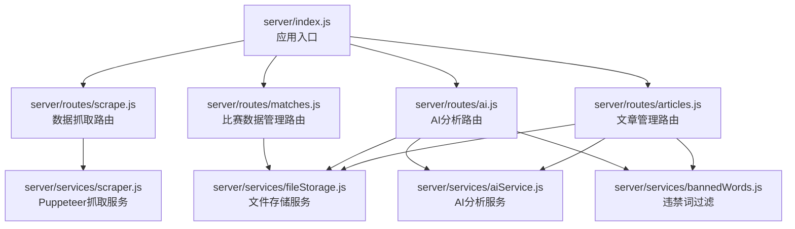
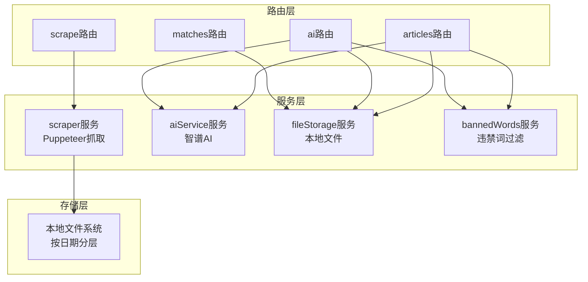
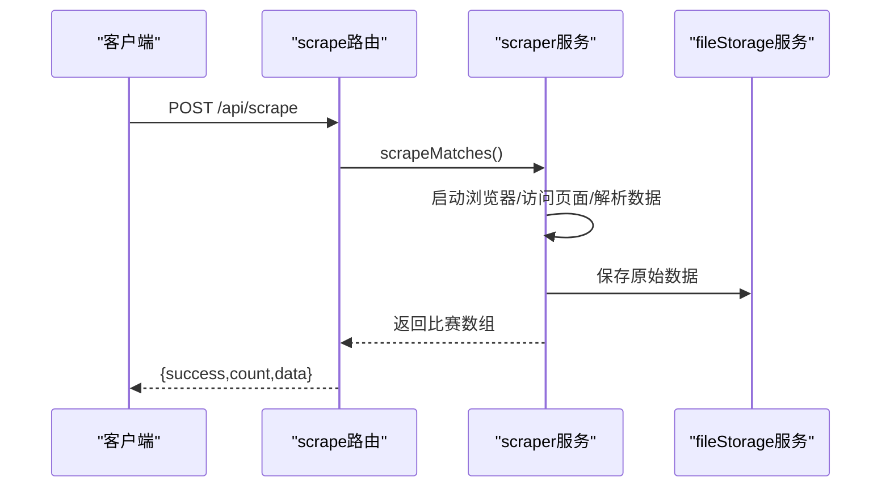
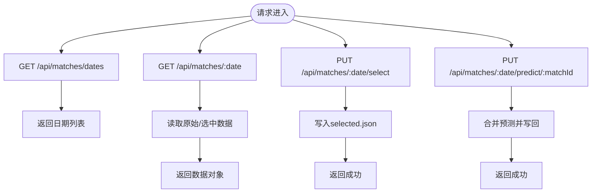
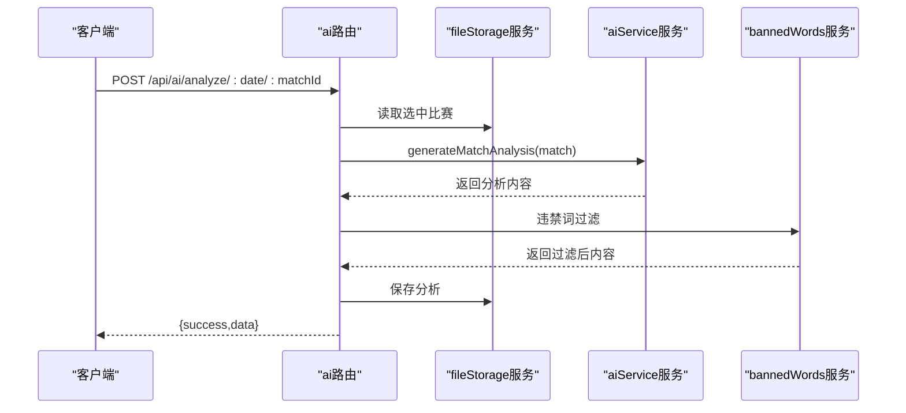
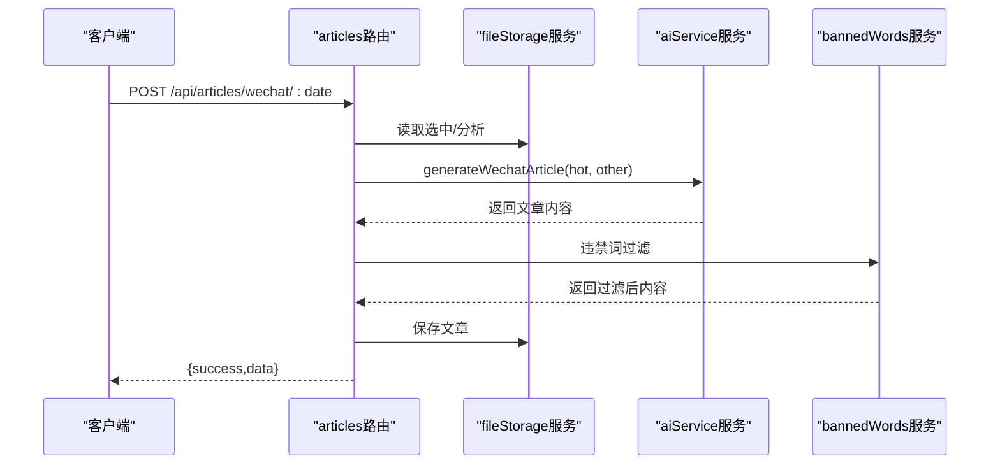
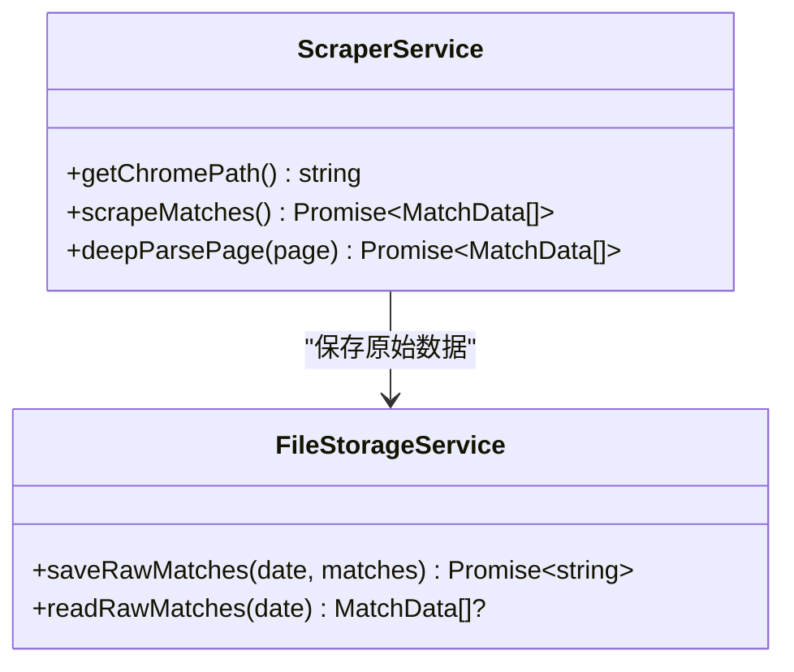
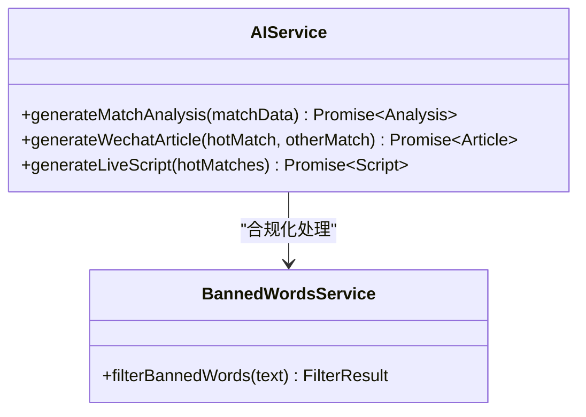
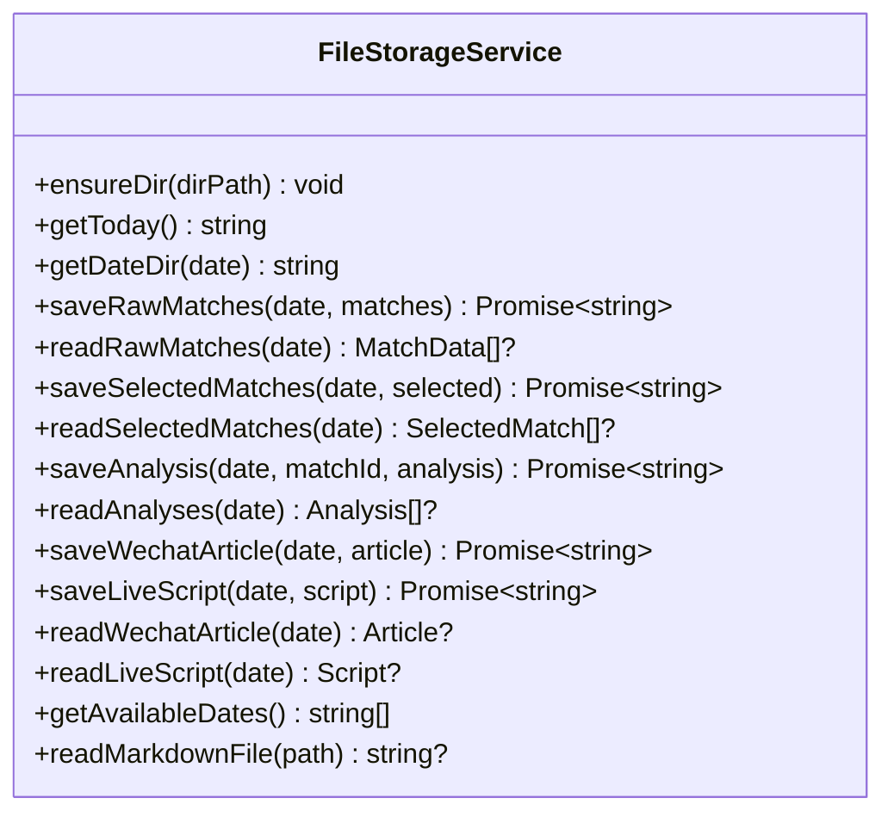
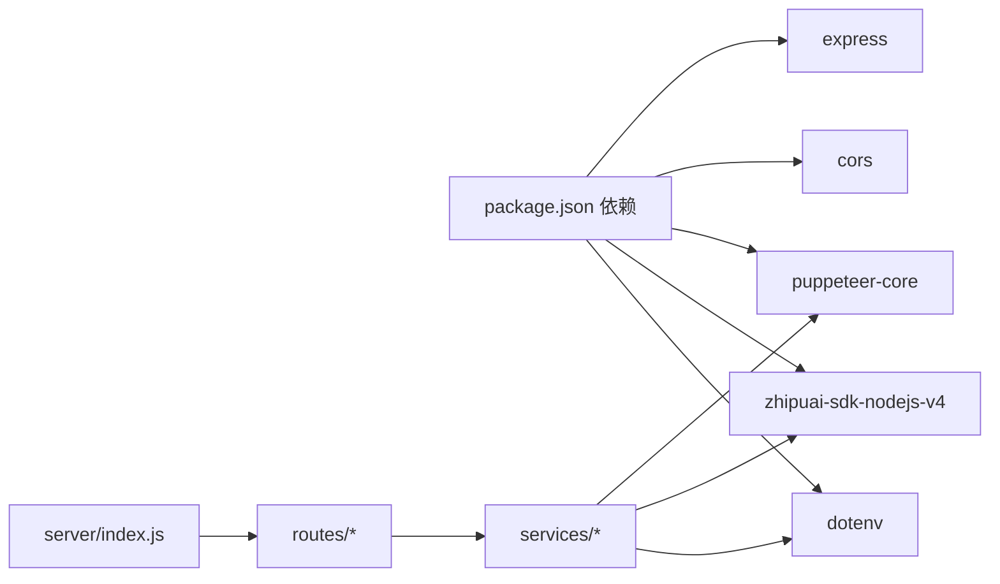

# 后端服务

<cite>
**本文引用的文件**
- [server/index.js](file://server/index.js)
- [server/routes/scrape.js](file://server/routes/scrape.js)
- [server/routes/matches.js](file://server/routes/matches.js)
- [server/routes/ai.js](file://server/routes/ai.js)
- [server/routes/articles.js](file://server/routes/articles.js)
- [server/services/scraper.js](file://server/services/scraper.js)
- [server/services/aiService.js](file://server/services/aiService.js)
- [server/services/fileStorage.js](file://server/services/fileStorage.js)
- [server/services/bannedWords.js](file://server/services/bannedWords.js)
- [package.json](file://package.json)
- [PRD.md](file://PRD.md)
</cite>

## 目录
1. [简介](#简介)
2. [项目结构](#项目结构)
3. [核心组件](#核心组件)
4. [架构总览](#架构总览)
5. [详细组件分析](#详细组件分析)
6. [依赖关系分析](#依赖关系分析)
7. [性能考量](#性能考量)
8. [故障排查指南](#故障排查指南)
9. [结论](#结论)
10. [附录](#附录)

## 简介
本项目是AutoMatch后端服务，基于Node.js + Express构建，提供数据抓取、比赛数据管理、AI分析与文章管理的完整API能力。后端采用模块化设计，结合Puppeteer自动化抓取、智谱AI生成服务以及本地文件存储，形成“抓取-选场-分析-文案”的完整工作流。系统通过CORS、静态文件服务、健康检查等基础配置保障可用性，并在各路由中统一错误处理，确保稳定性与可维护性。

## 项目结构
后端采用按功能模块划分的目录组织方式：
- server/index.js：应用入口，配置CORS、中间件、静态文件与路由挂载
- server/routes/*：按业务域拆分的路由模块
- server/services/*：服务层实现，包含抓取、AI、文件存储与违禁词过滤

图表来源
- [server/index.js:1-49](file://server/index.js#L1-L49)
- [server/routes/scrape.js:1-26](file://server/routes/scrape.js#L1-L26)
- [server/routes/matches.js:1-75](file://server/routes/matches.js#L1-L75)
- [server/routes/ai.js:1-102](file://server/routes/ai.js#L1-L102)
- [server/routes/articles.js:1-113](file://server/routes/articles.js#L1-L113)
- [server/services/scraper.js:1-295](file://server/services/scraper.js#L1-L295)
- [server/services/aiService.js:1-212](file://server/services/aiService.js#L1-L212)
- [server/services/fileStorage.js:1-196](file://server/services/fileStorage.js#L1-L196)
- [server/services/bannedWords.js:1-114](file://server/services/bannedWords.js#L1-L114)

章节来源
- [server/index.js:1-49](file://server/index.js#L1-L49)
- [package.json:1-23](file://package.json#L1-L23)

## 核心组件
- Express应用与中间件
  - CORS启用，允许跨域访问
  - JSON请求体解析，限制最大10MB
  - 静态文件服务，提供/data目录下的数据文件访问
  - 根路由返回状态页；/api/health提供健康检查
- 路由模块
  - /api/scrape：触发抓取
  - /api/matches：日期查询、读取/保存选中比赛、保存单场预测
  - /api/ai：单场/批量AI分析、读取/更新分析
  - /api/articles：公众号推文、直播文案生成与读取
- 服务层
  - Puppeteer抓取服务：无头浏览器访问、页面解析、数据持久化
  - AI分析服务：调用智谱GLM-4生成分析、推文、直播脚本
  - 文件存储服务：按日期组织目录，支持多类型数据文件读写
  - 违禁词过滤：合规化文本处理

章节来源
- [server/index.js:14-48](file://server/index.js#L14-L48)
- [server/routes/scrape.js:8-23](file://server/routes/scrape.js#L8-L23)
- [server/routes/matches.js:8-72](file://server/routes/matches.js#L8-L72)
- [server/routes/ai.js:10-99](file://server/routes/ai.js#L10-L99)
- [server/routes/articles.js:10-92](file://server/routes/articles.js#L10-L92)
- [server/services/scraper.js:22-214](file://server/services/scraper.js#L22-L214)
- [server/services/aiService.js:18-204](file://server/services/aiService.js#L18-L204)
- [server/services/fileStorage.js:32-157](file://server/services/fileStorage.js#L32-L157)
- [server/services/bannedWords.js:70-96](file://server/services/bannedWords.js#L70-L96)

## 架构总览
后端整体架构围绕“路由-服务-存储”三层展开，数据流自上而下：
- 路由层负责HTTP协议与参数校验
- 服务层封装业务逻辑（抓取、AI、文件操作）
- 存储层以本地文件系统承载数据，按日期分层组织

图表来源
- [server/routes/scrape.js:3](file://server/routes/scrape.js#L3)
- [server/routes/matches.js:3](file://server/routes/matches.js#L3)
- [server/routes/ai.js:3-5](file://server/routes/ai.js#L3-L5)
- [server/routes/articles.js:3-5](file://server/routes/articles.js#L3-L5)
- [server/services/scraper.js:1-3](file://server/services/scraper.js#L1-L3)
- [server/services/aiService.js:1-13](file://server/services/aiService.js#L1-L13)
- [server/services/fileStorage.js:1-4](file://server/services/fileStorage.js#L1-L4)
- [server/services/bannedWords.js:1-4](file://server/services/bannedWords.js#L1-L4)

## 详细组件分析

### Express应用与中间件配置
- CORS：全局启用，便于前端跨域访问
- JSON解析：限制请求体大小，避免过大负载
- 静态文件：/data目录映射至DATA_DIR，提供数据文件下载
- 根路由与健康检查：根路由返回状态页，/api/health返回服务健康状态

章节来源
- [server/index.js:14-48](file://server/index.js#L14-L48)

### 数据抓取路由（/api/scrape）
- 功能：触发抓取500彩票网竞彩数据
- 流程：调用抓取服务，返回成功/失败与数据条数
- 错误处理：捕获异常并返回错误信息

图表来源
- [server/routes/scrape.js:8-23](file://server/routes/scrape.js#L8-L23)
- [server/services/scraper.js:22-214](file://server/services/scraper.js#L22-L214)
- [server/services/fileStorage.js:32-39](file://server/services/fileStorage.js#L32-L39)

章节来源
- [server/routes/scrape.js:8-23](file://server/routes/scrape.js#L8-L23)

### 比赛数据管理路由（/api/matches）
- 查询日期：列出有数据的日期
- 读取数据：获取原始数据与选中比赛
- 保存选中：写入选中比赛列表
- 保存预测：按matchId更新预测字段

图表来源
- [server/routes/matches.js:8-72](file://server/routes/matches.js#L8-L72)
- [server/services/fileStorage.js:44-69](file://server/services/fileStorage.js#L44-L69)

章节来源
- [server/routes/matches.js:8-72](file://server/routes/matches.js#L8-L72)
- [server/services/fileStorage.js:44-69](file://server/services/fileStorage.js#L44-L69)

### AI分析路由（/api/ai）
- 单场分析：读取选中比赛，调用AI生成分析，过滤违禁词，保存并返回
- 批量分析：遍历选中比赛，逐个生成并保存，聚合结果返回
- 读取/更新分析：读取汇总或更新某场比赛分析内容

图表来源
- [server/routes/ai.js:10-34](file://server/routes/ai.js#L10-L34)
- [server/services/aiService.js:18-65](file://server/services/aiService.js#L18-L65)
- [server/services/fileStorage.js:74-98](file://server/services/fileStorage.js#L74-L98)
- [server/services/bannedWords.js:70-96](file://server/services/bannedWords.js#L70-L96)

章节来源
- [server/routes/ai.js:10-99](file://server/routes/ai.js#L10-L99)
- [server/services/aiService.js:18-65](file://server/services/aiService.js#L18-L65)
- [server/services/fileStorage.js:74-98](file://server/services/fileStorage.js#L74-L98)
- [server/services/bannedWords.js:70-96](file://server/services/bannedWords.js#L70-L96)

### 文章管理路由（/api/articles）
- 公众号推文：选择热门比赛（默认取前2场），合并AI分析，生成并保存
- 直播文案：生成直播脚本，过滤违禁词，保存
- 读取文章：返回公众号与直播文案

图表来源
- [server/routes/articles.js:10-51](file://server/routes/articles.js#L10-L51)
- [server/services/aiService.js:70-135](file://server/services/aiService.js#L70-L135)
- [server/services/fileStorage.js:112-123](file://server/services/fileStorage.js#L112-L123)
- [server/services/bannedWords.js:70-96](file://server/services/bannedWords.js#L70-L96)

章节来源
- [server/routes/articles.js:10-110](file://server/routes/articles.js#L10-L110)
- [server/services/aiService.js:70-135](file://server/services/aiService.js#L70-L135)
- [server/services/fileStorage.js:112-123](file://server/services/fileStorage.js#L112-L123)
- [server/services/bannedWords.js:70-96](file://server/services/bannedWords.js#L70-L96)

### 服务层设计模式与实现

#### Puppeteer自动化服务（scraper.js）
- 设计模式：服务类封装，职责单一
- 关键实现：
  - 无头浏览器启动与参数配置
  - 页面访问、等待与解析
  - 多种选择器与深度解析策略
  - 数据清洗与唯一ID生成
  - 结果持久化到文件

图表来源
- [server/services/scraper.js:10-214](file://server/services/scraper.js#L10-L214)
- [server/services/fileStorage.js:32-39](file://server/services/fileStorage.js#L32-L39)

章节来源
- [server/services/scraper.js:22-214](file://server/services/scraper.js#L22-L214)
- [server/services/fileStorage.js:32-39](file://server/services/fileStorage.js#L32-L39)

#### AI分析服务（aiService.js）
- 设计模式：函数式服务，按需调用
- 关键实现：
  - 智谱API客户端初始化与校验
  - 三种Prompt模板：单场分析、公众号推文、直播脚本
  - 统一响应结构与错误处理

图表来源
- [server/services/aiService.js:18-204](file://server/services/aiService.js#L18-L204)
- [server/services/bannedWords.js:70-96](file://server/services/bannedWords.js#L70-L96)

章节来源
- [server/services/aiService.js:18-204](file://server/services/aiService.js#L18-L204)
- [server/services/bannedWords.js:70-96](file://server/services/bannedWords.js#L70-L96)

#### 文件存储服务（fileStorage.js）
- 设计模式：工具类封装，统一路径与读写
- 关键实现：
  - 按日期分层目录结构
  - 多类型文件读写：原始数据、选中比赛、AI分析、公众号/直播文案
  - 汇总文件维护与Markdown读取

图表来源
- [server/services/fileStorage.js:9-157](file://server/services/fileStorage.js#L9-L157)

章节来源
- [server/services/fileStorage.js:32-157](file://server/services/fileStorage.js#L32-L157)

#### 违禁词过滤（bannedWords.js）
- 设计模式：纯函数式过滤
- 关键实现：
  - 违禁词映射表
  - 按词长降序匹配，优先替换
  - 清理多余空白与标点

章节来源
- [server/services/bannedWords.js:70-96](file://server/services/bannedWords.js#L70-L96)

## 依赖关系分析
- 外部依赖
  - Express：Web框架
  - CORS：跨域支持
  - Puppeteer-core：无头浏览器抓取
  - zhipuai-sdk-nodejs-v4：智谱AI SDK
  - dotenv：环境变量加载
- 内部依赖
  - 路由依赖服务层
  - 服务层依赖文件存储与第三方SDK
  - AI分析依赖违禁词过滤

图表来源
- [package.json:15-21](file://package.json#L15-L21)
- [server/index.js:6-9](file://server/index.js#L6-L9)

章节来源
- [package.json:15-21](file://package.json#L15-L21)
- [server/index.js:6-9](file://server/index.js#L6-L9)

## 性能考量
- 抓取性能
  - 无头浏览器启动与页面等待时间控制在合理范围
  - 多选择器与深度解析策略减少失败重试
- AI生成
  - 控制max_tokens与temperature平衡质量与速度
  - 批量分析时逐个处理，避免并发阻塞
- 存储性能
  - JSON/Markdown文件读写简单可靠，适合本地运行
  - 汇总文件按需更新，避免频繁I/O

[本节为通用性能建议，无需特定文件引用]

## 故障排查指南
- CORS问题
  - 确认CORS已启用且允许前端域名
- 请求体过大
  - 检查客户端请求体大小是否超过10MB限制
- 抓取失败
  - 检查Chrome路径配置与网络连接
  - 查看浏览器启动参数与页面等待条件
- AI生成失败
  - 检查ZHIPU_API_KEY是否正确配置
  - 确认网络可达与模型可用
- 文件读写异常
  - 检查DATA_DIR权限与磁盘空间
  - 确认日期目录结构与文件名格式

章节来源
- [server/index.js:14-15](file://server/index.js#L14-L15)
- [server/services/scraper.js:27-35](file://server/services/scraper.js#L27-L35)
- [server/services/aiService.js:9-13](file://server/services/aiService.js#L9-L13)
- [server/services/fileStorage.js:4-4](file://server/services/fileStorage.js#L4-L4)

## 结论
本后端服务以模块化设计实现了从数据抓取到AI分析再到文案生成的完整链路。通过Express中间件与路由的清晰分离、服务层的职责单一与可测试性、以及本地文件存储的简洁可靠，系统在满足产品需求的同时具备良好的可维护性与扩展性。建议后续可考虑引入日志系统、缓存层与更细粒度的错误码体系，进一步提升可观测性与用户体验。

[本节为总结性内容，无需特定文件引用]

## 附录

### API接口定义与使用示例

- 健康检查
  - GET /api/health
  - 返回：{ status: "ok", time: ISO时间字符串 }

- 数据抓取
  - POST /api/scrape
  - 返回：{ success: true/false, count: 数量, data: 比赛数组 或 error: 错误信息 }

- 比赛数据管理
  - GET /api/matches/dates
    - 返回：{ success: true, data: ["YYYY-MM-DD", ...] }
  - GET /api/matches/:date
    - 返回：{ success: true, data: { raw: [...], selected: [...] } }
  - PUT /api/matches/:date/select
    - 请求体：{ selectedMatches: [...] }
    - 返回：{ success: true }
  - PUT /api/matches/:date/predict/:matchId
    - 请求体：{ prediction, confidence, analysisNote, isHot, ... }
    - 返回：{ success: true }

- AI分析
  - POST /api/ai/analyze/:date/:matchId
    - 返回：{ success: true, data: 分析对象 }
  - POST /api/ai/analyze/:date/batch
    - 返回：{ success: true, data: [{ matchId, content?, error? }, ...] }
  - GET /api/ai/analyses/:date
    - 返回：{ success: true, data: 分析数组 }
  - PUT /api/ai/analyses/:date/:matchId
    - 请求体：{ content }
    - 返回：{ success: true }

- 文章管理
  - POST /api/articles/wechat/:date
    - 返回：{ success: true, data: 公众号文章对象 }
  - POST /api/articles/live/:date
    - 返回：{ success: true, data: 直播脚本对象 }
  - GET /api/articles/:date
    - 返回：{ success: true, data: { wechat, live } }

章节来源
- [server/index.js:41-43](file://server/index.js#L41-L43)
- [server/routes/scrape.js:8-23](file://server/routes/scrape.js#L8-L23)
- [server/routes/matches.js:8-72](file://server/routes/matches.js#L8-L72)
- [server/routes/ai.js:10-99](file://server/routes/ai.js#L10-L99)
- [server/routes/articles.js:10-110](file://server/routes/articles.js#L10-L110)
- [PRD.md:252-271](file://PRD.md#L252-L271)