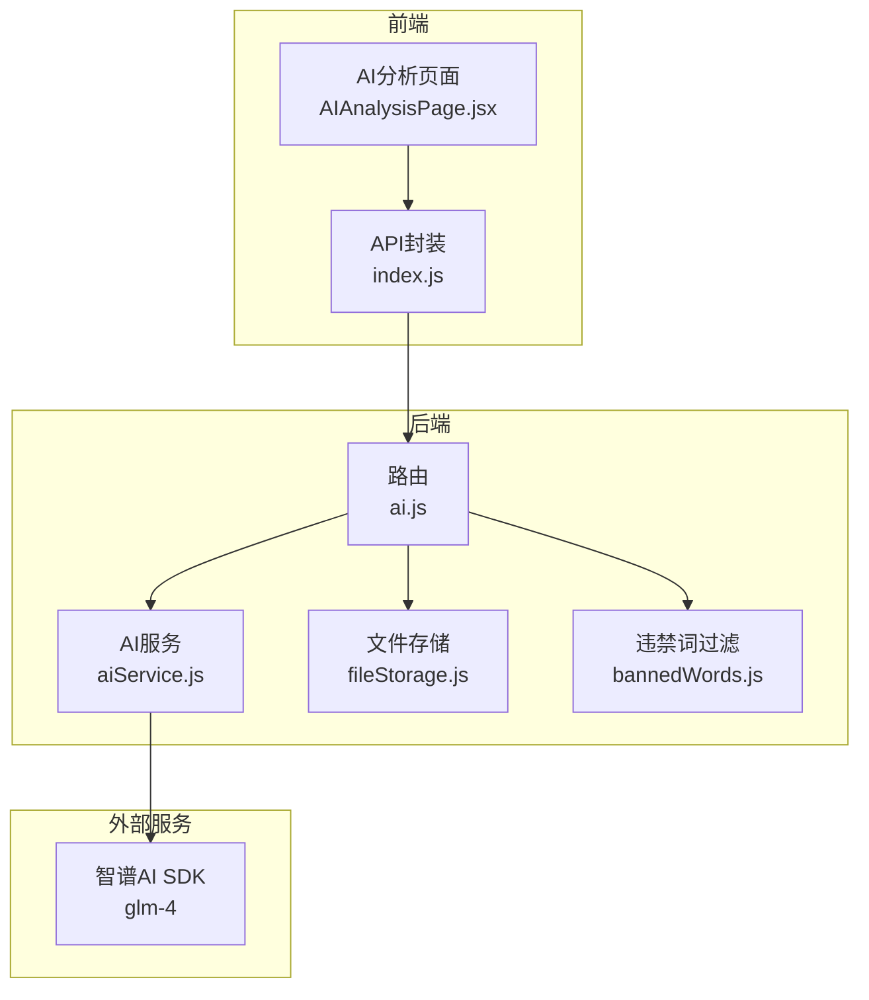
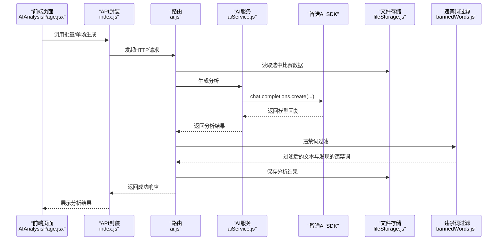
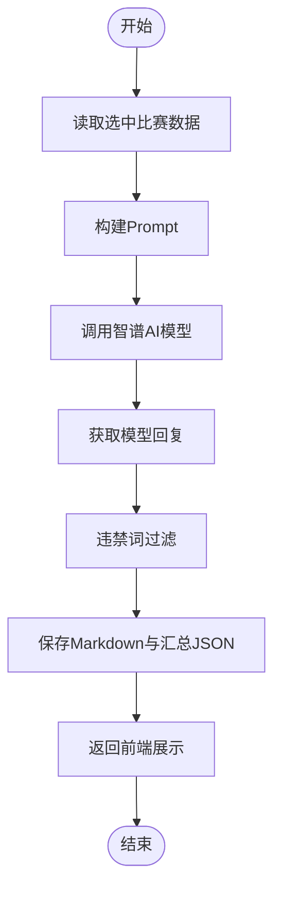
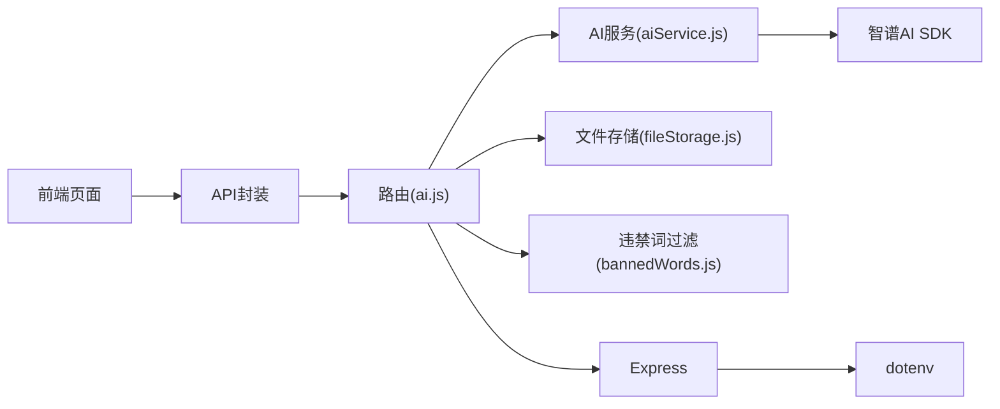

# AI分析服务

<cite>
**本文引用的文件**
- [server/services/aiService.js](file://server/services/aiService.js)
- [server/routes/ai.js](file://server/routes/ai.js)
- [server/services/bannedWords.js](file://server/services/bannedWords.js)
- [server/services/fileStorage.js](file://server/services/fileStorage.js)
- [client/src/pages/AIAnalysisPage.jsx](file://client/src/pages/AIAnalysisPage.jsx)
- [client/src/api/index.js](file://client/src/api/index.js)
- [server/index.js](file://server/index.js)
- [package.json](file://package.json)
- [PRD.md](file://PRD.md)
</cite>

## 目录
1. [简介](#简介)
2. [项目结构](#项目结构)
3. [核心组件](#核心组件)
4. [架构总览](#架构总览)
5. [详细组件分析](#详细组件分析)
6. [依赖关系分析](#依赖关系分析)
7. [性能考虑](#性能考虑)
8. [故障排查指南](#故障排查指南)
9. [结论](#结论)
10. [附录](#附录)

## 简介
本文件为AutoMatch项目的AI分析服务技术文档，聚焦于智谱AI SDK的集成实现、Prompt工程设计、违禁词过滤机制、AI分析结果处理流程以及性能优化与错误重试策略。文档旨在帮助开发者与运营人员理解AI分析服务的端到端工作流，涵盖后端服务、前端交互与数据持久化。

## 项目结构
AutoMatch采用前后端分离架构：
- 前端：React + Vite + Ant Design，负责用户交互与API调用
- 后端：Node.js + Express，提供REST接口与业务逻辑
- 数据层：本地文件系统，按日期组织结构化数据
- AI服务：调用智谱GLM-4模型，基于Prompt工程生成分析文案

图表来源
- [server/routes/ai.js:1-102](file://server/routes/ai.js#L1-L102)
- [server/services/aiService.js:1-212](file://server/services/aiService.js#L1-L212)
- [server/services/fileStorage.js:1-196](file://server/services/fileStorage.js#L1-L196)
- [server/services/bannedWords.js:1-114](file://server/services/bannedWords.js#L1-L114)
- [client/src/pages/AIAnalysisPage.jsx:1-203](file://client/src/pages/AIAnalysisPage.jsx#L1-L203)
- [client/src/api/index.js:1-50](file://client/src/api/index.js#L1-L50)

章节来源
- [server/index.js:1-49](file://server/index.js#L1-L49)
- [package.json:1-23](file://package.json#L1-L23)

## 核心组件
- 智谱AI SDK集成：负责API密钥配置、模型调用与响应解析
- Prompt工程：针对不同场景（单场分析、公众号推文、直播脚本）设计提示模板与约束
- 违禁词过滤：基于映射表进行关键词匹配与替换，确保合规
- 文件存储：按日期组织数据目录，支持分析结果的持久化与查询
- 前后端API：提供单场/批量分析、获取分析、更新分析等接口

章节来源
- [server/services/aiService.js:1-212](file://server/services/aiService.js#L1-L212)
- [server/routes/ai.js:1-102](file://server/routes/ai.js#L1-L102)
- [server/services/bannedWords.js:1-114](file://server/services/bannedWords.js#L1-L114)
- [server/services/fileStorage.js:1-196](file://server/services/fileStorage.js#L1-L196)
- [client/src/pages/AIAnalysisPage.jsx:1-203](file://client/src/pages/AIAnalysisPage.jsx#L1-L203)
- [client/src/api/index.js:1-50](file://client/src/api/index.js#L1-L50)

## 架构总览
AI分析服务的端到端流程如下：
- 前端触发“一键生成”或单场生成
- 后端路由读取选中比赛数据，调用AI服务生成分析
- AI服务构建Prompt并调用智谱SDK，返回模型回复
- 后端对内容执行违禁词过滤，写入文件并返回结果
- 前端展示分析结果、违规词提示与编辑能力

图表来源
- [server/routes/ai.js:10-34](file://server/routes/ai.js#L10-L34)
- [server/routes/ai.js:39-69](file://server/routes/ai.js#L39-L69)
- [server/services/aiService.js:18-65](file://server/services/aiService.js#L18-L65)
- [server/services/fileStorage.js:74-98](file://server/services/fileStorage.js#L74-L98)
- [server/services/bannedWords.js:70-96](file://server/services/bannedWords.js#L70-L96)
- [client/src/api/index.js:33-42](file://client/src/api/index.js#L33-L42)

## 详细组件分析

### 智谱AI SDK集成与配置
- API密钥配置
  - 通过环境变量读取密钥，若未配置或为占位符则抛出错误，防止误用
  - 初始化SDK客户端时传入密钥
- 请求参数设置
  - 模型：glm-4
  - 角色消息：system定义角色与风格；user携带完整Prompt
  - 温度与最大token：根据任务复杂度设定，平衡创造性与稳定性
- 响应处理
  - 解析choices[0].message.content作为最终文案
  - 包装统一结构，包含比赛标识、内容与时间戳

章节来源
- [server/services/aiService.js:3-13](file://server/services/aiService.js#L3-L13)
- [server/services/aiService.js:42-64](file://server/services/aiService.js#L42-L64)

### Prompt工程设计原理
- 单场分析Prompt
  - 输入：主队、客队、联赛、时间、初盘赔率、让球盘口、分析师预测、信心指数、分析师笔记
  - 约束：从赔率与让球角度切入，逻辑闭环，语言专业但不晦涩，字数约200字
  - 禁用词汇：明确列出违禁词及其替换方案，确保合规
- 公众号推文Prompt
  - 输入：最热比赛与另一场比赛的基础信息
  - 结构：标题吸引力、悬念开头、基本面分析、数据视角解读、结论与号召
  - 禁用词汇清单：覆盖盘口、庄家、博彩、投注、赔率、大小球、串关等
- 直播脚本Prompt
  - 输入：多场比赛信息
  - 结构：开场白、逐场分析（每场约300-400字）、结尾互动
  - 合规要求：仅从基本面分析，与预期结果逻辑一致，适合朗读

章节来源
- [server/services/aiService.js:21-39](file://server/services/aiService.js#L21-L39)
- [server/services/aiService.js:73-113](file://server/services/aiService.js#L73-L113)
- [server/services/aiService.js:153-183](file://server/services/aiService.js#L153-L183)
- [PRD.md:108-127](file://PRD.md#L108-L127)
- [PRD.md:146-180](file://PRD.md#L146-L180)
- [PRD.md:181-202](file://PRD.md#L181-L202)

### 违禁词过滤机制
- 过滤策略
  - 基于映射表进行关键词匹配与替换
  - 按词长降序优先匹配，减少误判
  - 对无替换词的违禁词直接删除
  - 清理多余空格与重复标点，保持文本整洁
- 输出结构
  - 返回过滤后的文本与发现的违禁词列表
  - 后端将发现的违禁词回传给前端，便于展示提示

章节来源
- [server/services/bannedWords.js:6-63](file://server/services/bannedWords.js#L6-L63)
- [server/services/bannedWords.js:70-96](file://server/services/bannedWords.js#L70-L96)
- [server/routes/ai.js:22-25](file://server/routes/ai.js#L22-L25)

### AI分析结果处理流程
- 数据预处理
  - 从前端触发开始，后端从文件存储读取选中比赛数据
  - 将比赛信息拼接到Prompt中，形成完整的上下文
- 模型调用
  - 调用智谱SDK的chat.completions.create接口
  - 设置合适的temperature与max_tokens，保证输出质量与时长
- 结果后处理
  - 违禁词过滤与合规化
  - 保存Markdown与汇总JSON，便于后续查阅与导出
  - 返回统一结构给前端展示

图表来源
- [server/routes/ai.js:10-34](file://server/routes/ai.js#L10-L34)
- [server/services/aiService.js:18-65](file://server/services/aiService.js#L18-L65)
- [server/services/fileStorage.js:74-98](file://server/services/fileStorage.js#L74-L98)
- [server/services/bannedWords.js:70-96](file://server/services/bannedWords.js#L70-L96)

章节来源
- [server/routes/ai.js:10-34](file://server/routes/ai.js#L10-L34)
- [server/services/aiService.js:18-65](file://server/services/aiService.js#L18-L65)
- [server/services/fileStorage.js:74-98](file://server/services/fileStorage.js#L74-L98)
- [server/services/bannedWords.js:70-96](file://server/services/bannedWords.js#L70-L96)

### 前后端交互与API设计
- 前端页面
  - 提供“一键生成所有AI分析”按钮，触发批量生成
  - 展示分析结果、复制与编辑能力，支持违规词提示
- API封装
  - 统一封装fetch请求，统一处理success字段与错误抛出
- 后端路由
  - 单场生成：校验比赛是否存在，生成并保存分析
  - 批量生成：遍历选中比赛，逐个生成并记录错误
  - 查询与更新：支持获取全部分析与更新单条分析内容

章节来源
- [client/src/pages/AIAnalysisPage.jsx:31-47](file://client/src/pages/AIAnalysisPage.jsx#L31-L47)
- [client/src/pages/AIAnalysisPage.jsx:115-199](file://client/src/pages/AIAnalysisPage.jsx#L115-L199)
- [client/src/api/index.js:33-42](file://client/src/api/index.js#L33-L42)
- [server/routes/ai.js:10-34](file://server/routes/ai.js#L10-L34)
- [server/routes/ai.js:39-69](file://server/routes/ai.js#L39-L69)
- [server/routes/ai.js:74-82](file://server/routes/ai.js#L74-L82)
- [server/routes/ai.js:87-99](file://server/routes/ai.js#L87-L99)

## 依赖关系分析
- 模块耦合
  - 路由层依赖AI服务与文件存储，同时调用违禁词过滤
  - AI服务依赖SDK与环境变量，内部封装Prompt与参数
  - 前端通过API封装调用后端路由
- 外部依赖
  - 智谱AI SDK：提供模型推理能力
  - dotenv：读取环境变量
  - express/cors：提供Web服务与跨域支持
- 数据依赖
  - 本地文件系统按日期组织数据，避免数据库依赖

图表来源
- [server/routes/ai.js:1-102](file://server/routes/ai.js#L1-L102)
- [server/services/aiService.js:1-212](file://server/services/aiService.js#L1-L212)
- [server/services/fileStorage.js:1-196](file://server/services/fileStorage.js#L1-L196)
- [server/services/bannedWords.js:1-114](file://server/services/bannedWords.js#L1-L114)
- [client/src/api/index.js:1-50](file://client/src/api/index.js#L1-L50)
- [server/index.js:1-49](file://server/index.js#L1-L49)
- [package.json:15-21](file://package.json#L15-L21)

章节来源
- [package.json:15-21](file://package.json#L15-L21)
- [server/index.js:14-25](file://server/index.js#L14-L25)

## 性能考虑
- 模型调用优化
  - 控制temperature与max_tokens，平衡质量与延迟
  - 批量生成时逐个处理，避免并发过高导致SDK限流
- 前端体验
  - 加载状态提示与错误消息，提升用户感知
  - 本地文件存储避免网络抖动影响
- 存储与IO
  - 按日期组织目录，避免单文件过大
  - JSON汇总文件增量更新，减少IO开销

[本节为通用性能建议，无需特定文件引用]

## 故障排查指南
- API密钥问题
  - 症状：初始化客户端时报错
  - 排查：确认环境变量已正确设置且非占位符
- 模型调用异常
  - 症状：生成分析失败
  - 排查：检查网络连通性、SDK版本与模型可用性
- 违禁词过滤异常
  - 症状：过滤后文本异常或缺失
  - 排查：核对映射表与过滤逻辑，确认替换词为空时的行为
- 文件存储异常
  - 症状：无法保存或读取分析
  - 排查：确认数据目录权限、磁盘空间与路径拼接

章节来源
- [server/services/aiService.js:3-13](file://server/services/aiService.js#L3-L13)
- [server/services/bannedWords.js:70-96](file://server/services/bannedWords.js#L70-L96)
- [server/services/fileStorage.js:74-98](file://server/services/fileStorage.js#L74-L98)

## 结论
AI分析服务通过清晰的模块划分与Prompt工程设计，实现了从数据输入到合规文案输出的完整链路。结合违禁词过滤与本地文件存储，既满足了合规要求，也提供了良好的可维护性与扩展性。未来可在错误重试、并发控制与缓存策略方面进一步优化。

[本节为总结性内容，无需特定文件引用]

## 附录

### API定义概览
- 单场生成
  - 方法：POST
  - 路径：/api/ai/analyze/:date/:matchId
  - 参数：路径参数date、matchId
  - 成功响应：包含分析内容与违规词发现列表
- 批量生成
  - 方法：POST
  - 路径：/api/ai/analyze/:date/batch
  - 参数：路径参数date
  - 成功响应：数组，包含每场比赛的分析或错误信息
- 获取分析
  - 方法：GET
  - 路径：/api/ai/analyses/:date
  - 成功响应：数组，包含指定日期的所有分析
- 更新分析
  - 方法：PUT
  - 路径：/api/ai/analyses/:date/:matchId
  - 参数：路径参数date、matchId，请求体content
  - 成功响应：空对象

章节来源
- [server/routes/ai.js:10-34](file://server/routes/ai.js#L10-L34)
- [server/routes/ai.js:39-69](file://server/routes/ai.js#L39-L69)
- [server/routes/ai.js:74-82](file://server/routes/ai.js#L74-L82)
- [server/routes/ai.js:87-99](file://server/routes/ai.js#L87-L99)
- [PRD.md:262-271](file://PRD.md#L262-L271)