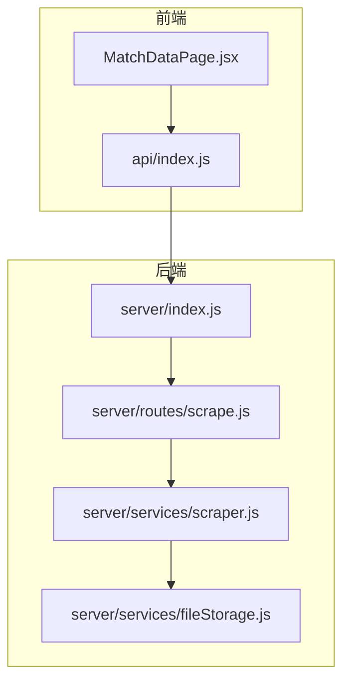
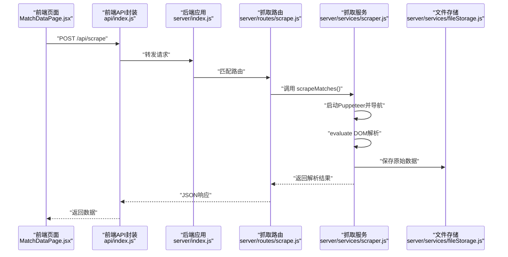
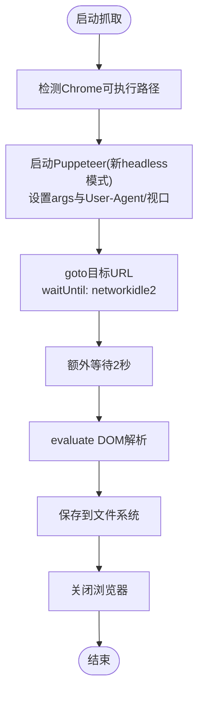
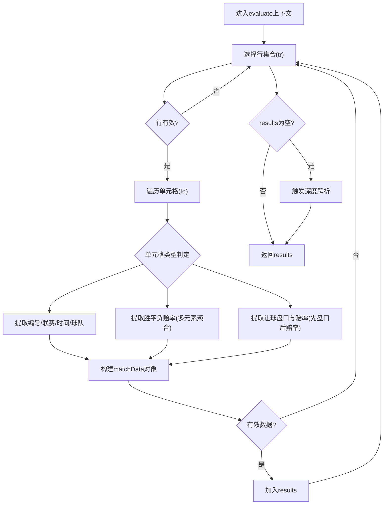
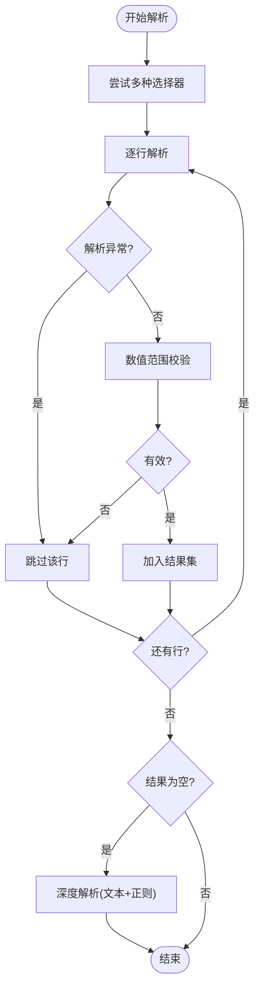
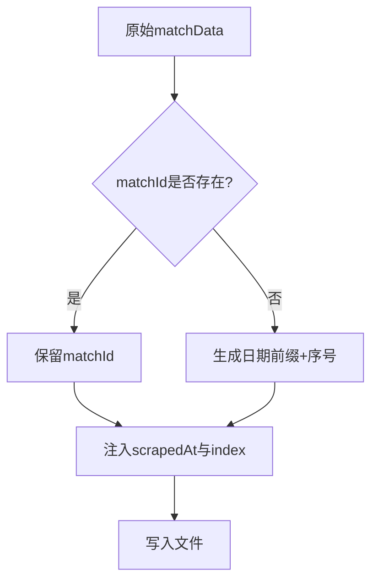
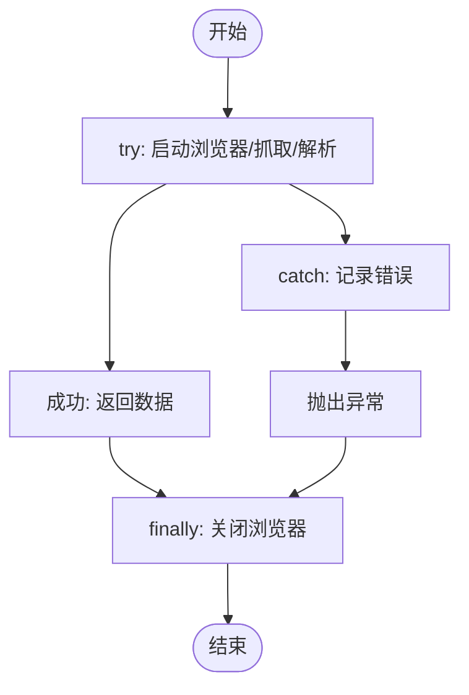
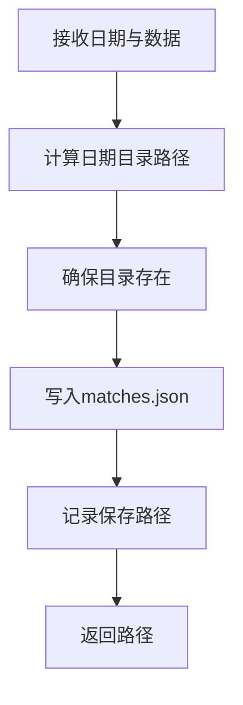
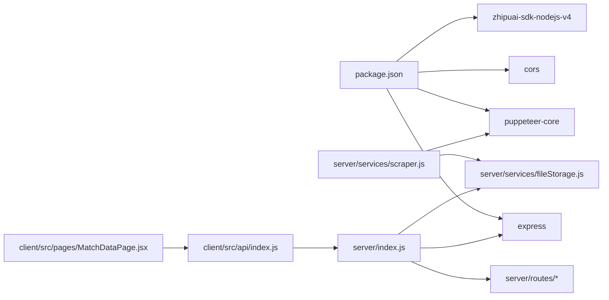

# 数据抓取服务

<cite>
**本文引用的文件**
- [server/services/scraper.js](file://server/services/scraper.js)
- [server/routes/scrape.js](file://server/routes/scrape.js)
- [server/services/fileStorage.js](file://server/services/fileStorage.js)
- [server/index.js](file://server/index.js)
- [client/src/pages/MatchDataPage.jsx](file://client/src/pages/MatchDataPage.jsx)
- [client/src/api/index.js](file://client/src/api/index.js)
- [package.json](file://package.json)
- [PRD.md](file://PRD.md)
</cite>

## 目录
1. [简介](#简介)
2. [项目结构](#项目结构)
3. [核心组件](#核心组件)
4. [架构总览](#架构总览)
5. [详细组件分析](#详细组件分析)
6. [依赖关系分析](#依赖关系分析)
7. [性能考量](#性能考量)
8. [故障排查指南](#故障排查指南)
9. [结论](#结论)
10. [附录](#附录)

## 简介
本文件聚焦AutoMatch项目的“数据抓取服务”，围绕Puppeteer无头浏览器的配置与使用、500彩票网竞彩足球数据抓取的实现机制、页面导航与DOM解析策略、健壮性设计（多层解析与回退）、数据结构转换与唯一ID生成、时间戳处理以及浏览器资源管理与错误处理的最佳实践进行系统化技术说明。文档旨在帮助开发者快速理解并维护该模块，同时为非技术读者提供可读性强的概念性说明。

## 项目结构
AutoMatch采用前后端分离架构：前端使用React + Ant Design，后端使用Node.js + Express；数据抓取由后端通过Puppeteer驱动无头浏览器完成，并将结果持久化至本地文件系统。关键文件与职责如下：
- 后端入口与路由：server/index.js、server/routes/scrape.js
- 抓取服务：server/services/scraper.js
- 文件存储服务：server/services/fileStorage.js
- 前端页面与API封装：client/src/pages/MatchDataPage.jsx、client/src/api/index.js
- 项目依赖与脚本：package.json
- 产品需求与API设计：PRD.md

图表来源
- [server/index.js:1-49](file://server/index.js#L1-L49)
- [server/routes/scrape.js:1-26](file://server/routes/scrape.js#L1-L26)
- [server/services/scraper.js:1-295](file://server/services/scraper.js#L1-L295)
- [server/services/fileStorage.js:1-196](file://server/services/fileStorage.js#L1-L196)
- [client/src/pages/MatchDataPage.jsx:1-198](file://client/src/pages/MatchDataPage.jsx#L1-L198)
- [client/src/api/index.js:1-50](file://client/src/api/index.js#L1-L50)

章节来源
- [server/index.js:1-49](file://server/index.js#L1-L49)
- [package.json:1-23](file://package.json#L1-L23)

## 核心组件
- Puppeteer无头浏览器配置与启动：负责Chrome可执行路径检测、启动参数设置、User-Agent与视口配置、页面导航与等待策略。
- 500彩票网数据抓取：基于DOM选择器策略提取比赛数据，支持多层解析与回退机制。
- 数据解析与健壮性：多选择器适配、异常处理、数值清洗与范围校验、缺失值补全。
- 数据结构转换与唯一ID生成：统一字段映射、日期前缀+序号生成唯一ID、时间戳注入。
- 浏览器资源管理与错误处理：浏览器生命周期管理、finally关闭、错误捕获与抛出。
- 文件存储服务：按日期组织目录、保存原始数据与后续阶段产物。

章节来源
- [server/services/scraper.js:10-214](file://server/services/scraper.js#L10-L214)
- [server/services/fileStorage.js:32-48](file://server/services/fileStorage.js#L32-L48)

## 架构总览
后端通过Express提供REST接口，前端页面通过API封装发起抓取请求，后端使用Puppeteer访问目标站点，解析DOM并持久化到本地文件系统。整体流程如下：

图表来源
- [client/src/pages/MatchDataPage.jsx:25-38](file://client/src/pages/MatchDataPage.jsx#L25-L38)
- [client/src/api/index.js:15-16](file://client/src/api/index.js#L15-L16)
- [server/index.js:22-25](file://server/index.js#L22-L25)
- [server/routes/scrape.js:8-23](file://server/routes/scrape.js#L8-L23)
- [server/services/scraper.js:22-214](file://server/services/scraper.js#L22-L214)
- [server/services/fileStorage.js:32-39](file://server/services/fileStorage.js#L32-L39)

## 详细组件分析

### Puppeteer无头浏览器配置与使用
- Chrome可执行路径检测：优先使用环境变量CHROME_PATH，其次尝试常见安装路径（macOS），提升跨平台兼容性。
- 启动参数：启用headless的新模式、禁用沙箱与setuid、隐藏自动化特征，降低被反爬识别风险。
- 页面行为：设置User-Agent模拟真实浏览器，设置视口尺寸，导航到目标URL并等待网络空闲，额外延时确保动态内容加载完成。
- 资源管理：在finally中确保浏览器关闭，避免进程泄漏。

图表来源
- [server/services/scraper.js:10-57](file://server/services/scraper.js#L10-L57)
- [server/services/scraper.js:206-213](file://server/services/scraper.js#L206-L213)

章节来源
- [server/services/scraper.js:10-57](file://server/services/scraper.js#L10-L57)
- [server/services/scraper.js:206-213](file://server/services/scraper.js#L206-L213)

### 500彩票网数据抓取实现机制
- 页面导航与等待：访问竞彩足球页面，等待包含比赛表格的选择器出现，再延时确保数据稳定。
- DOM元素选择器策略：优先使用带data属性的行节点，其次尝试表格主体行，遍历单元格提取信息。
- 多层解析机制：
  - 标准解析：按列顺序提取编号、联赛、时间、球队、胜平负赔率、让球盘口与赔率。
  - 深度解析：当标准解析无结果时，回退到全文扫描，基于正则匹配vs分隔、时间格式、常见联赛名、赔率数值等进行二次提取。
- 健壮性设计：
  - 多选择器适配：针对不同页面结构，提供多种类名与结构的匹配策略。
  - 异常处理：单行解析异常不影响整体流程，继续处理下一行。
  - 回退策略：标准解析失败时自动触发深度解析，提升成功率。
- 数据清洗与范围校验：对数值进行范围过滤（如赔率在合理区间），避免异常值污染。

图表来源
- [server/services/scraper.js:62-183](file://server/services/scraper.js#L62-L183)
- [server/services/scraper.js:219-292](file://server/services/scraper.js#L219-L292)

章节来源
- [server/services/scraper.js:54-191](file://server/services/scraper.js#L54-L191)
- [server/services/scraper.js:219-292](file://server/services/scraper.js#L219-L292)

### 数据解析健壮性设计
- 多选择器适配：同时尝试多种类名与结构，覆盖不同页面版本。
- 异常处理：单行try-catch，跳过解析失败的行，保证整体稳定性。
- 回退策略：标准解析失败时，基于文本匹配与正则表达式进行深度解析。
- 数值清洗：对赔率与让球数值进行范围校验，过滤异常值。
- 缺失值补全：若无matchId，使用日期+序号生成唯一ID，确保每条记录具备标识。

图表来源
- [server/services/scraper.js:66-180](file://server/services/scraper.js#L66-L180)
- [server/services/scraper.js:186-190](file://server/services/scraper.js#L186-L190)
- [server/services/scraper.js:219-292](file://server/services/scraper.js#L219-L292)

章节来源
- [server/services/scraper.js:66-180](file://server/services/scraper.js#L66-L180)
- [server/services/scraper.js:186-190](file://server/services/scraper.js#L186-L190)
- [server/services/scraper.js:219-292](file://server/services/scraper.js#L219-L292)

### 数据结构转换、唯一ID生成与时间戳处理
- 字段映射：将页面提取的信息映射到统一的结构，包含编号、联赛、主客队、时间、胜平负赔率、让球盘口与让球赔率等。
- 唯一ID生成：若页面未提供matchId，则以“日期-序号”生成唯一ID，序号按索引递增并补零。
- 时间戳处理：为每条记录注入抓取时间戳，便于后续审计与数据溯源。
- 索引字段：为前端展示提供序号字段，增强可读性。

图表来源
- [server/services/scraper.js:192-198](file://server/services/scraper.js#L192-L198)

章节来源
- [server/services/scraper.js:192-198](file://server/services/scraper.js#L192-L198)

### 浏览器资源管理与错误处理最佳实践
- 生命周期管理：在finally中确保浏览器关闭，避免进程泄露。
- 错误捕获：抓取过程中捕获异常并向上抛出，由路由层统一处理HTTP 500响应。
- 日志记录：关键步骤打印日志，便于问题定位与监控。

图表来源
- [server/services/scraper.js:22-213](file://server/services/scraper.js#L22-L213)
- [server/routes/scrape.js:16-22](file://server/routes/scrape.js#L16-L22)

章节来源
- [server/services/scraper.js:22-213](file://server/services/scraper.js#L22-L213)
- [server/routes/scrape.js:16-22](file://server/routes/scrape.js#L16-L22)

### 文件存储与数据持久化
- 目录结构：按日期分目录，子目录包含原始数据、重点比赛、AI分析、公众号文案、直播文案等。
- 保存策略：原始数据以JSON保存，AI分析同时生成Markdown与汇总JSON，文案生成对应的MD与JSON。
- 读取策略：提供读取函数，若文件不存在返回空或null，避免异常中断。
- 目录一致性：确保目录存在后再写入文件，避免IO错误。

图表来源
- [server/services/fileStorage.js:32-39](file://server/services/fileStorage.js#L32-L39)

章节来源
- [server/services/fileStorage.js:32-39](file://server/services/fileStorage.js#L32-L39)

## 依赖关系分析
- 后端依赖：Express提供Web服务与静态文件服务，CORS允许跨域，dotenv加载环境变量。
- 抓取依赖：puppeteer-core驱动无头浏览器，fileStorage提供文件系统操作。
- 前端依赖：React + Ant Design提供UI组件，fetch封装API请求。

图表来源
- [package.json:15-21](file://package.json#L15-L21)
- [server/services/scraper.js:1-3](file://server/services/scraper.js#L1-L3)
- [server/index.js:1-19](file://server/index.js#L1-L19)
- [client/src/pages/MatchDataPage.jsx:1-5](file://client/src/pages/MatchDataPage.jsx#L1-L5)
- [client/src/api/index.js:1-13](file://client/src/api/index.js#L1-L13)

章节来源
- [package.json:15-21](file://package.json#L15-L21)
- [server/index.js:1-19](file://server/index.js#L1-L19)

## 性能考量
- 抓取耗时控制：页面导航与等待策略需平衡稳定性与速度，建议结合实际页面加载情况微调等待时间与额外延时。
- 解析效率：DOM选择器尽量精准，减少不必要的遍历；深度解析仅在必要时触发，避免重复扫描。
- 资源占用：浏览器实例应尽快关闭，避免长时间占用内存与CPU。
- 前端交互：前端在抓取期间显示加载状态与进度提示，提升用户体验。

## 故障排查指南
- 无法找到Chrome可执行路径
  - 现象：启动Puppeteer报错或找不到浏览器。
  - 排查：确认CHROME_PATH环境变量是否正确设置；检查常见安装路径是否存在。
  - 参考
    - [server/services/scraper.js:10-17](file://server/services/scraper.js#L10-L17)
- 页面加载超时或数据为空
  - 现象：navigate超时或evaluate返回空数组。
  - 排查：检查waitUntil与timeout配置；确认目标URL可访问；验证选择器是否匹配当前页面结构；必要时启用深度解析。
  - 参考
    - [server/services/scraper.js:48-57](file://server/services/scraper.js#L48-L57)
    - [server/services/scraper.js:54](file://server/services/scraper.js#L54)
    - [server/services/scraper.js:186-190](file://server/services/scraper.js#L186-L190)
- 解析异常导致部分数据缺失
  - 现象：某些行解析失败，最终结果数量少于预期。
  - 排查：检查单行解析逻辑与异常处理；确认数值范围校验是否过于严格；必要时放宽阈值。
  - 参考
    - [server/services/scraper.js:177-180](file://server/services/scraper.js#L177-L180)
- 文件保存失败
  - 现象：保存原始数据时报错。
  - 排查：确认数据目录权限与磁盘空间；检查日期目录是否存在；确保JSON序列化无异常。
  - 参考
    - [server/services/fileStorage.js:32-39](file://server/services/fileStorage.js#L32-L39)
- 前端抓取按钮无响应
  - 现象：点击抓取按钮无反馈。
  - 排查：检查前端API封装与后端路由是否一致；确认CORS配置；查看浏览器控制台错误。
  - 参考
    - [client/src/pages/MatchDataPage.jsx:25-38](file://client/src/pages/MatchDataPage.jsx#L25-L38)
    - [client/src/api/index.js:15-16](file://client/src/api/index.js#L15-L16)
    - [server/routes/scrape.js:8-23](file://server/routes/scrape.js#L8-L23)

## 结论
AutoMatch的数据抓取服务通过Puppeteer无头浏览器实现了对500彩票网竞彩足球数据的稳定抓取。其设计强调健壮性与可维护性：多层解析与回退策略、异常处理与数值清洗、唯一ID生成与时间戳注入、以及完善的文件存储与资源管理。配合前端直观的交互与后端清晰的API，形成了从数据采集到持久化的完整链路。后续可在等待策略与解析精度上进一步优化，以提升整体性能与稳定性。

## 附录
- API定义（节选）
  - POST /api/scrape：触发抓取500彩票网数据，返回成功状态、数量与数据列表。
  - GET /api/matches/:date：获取指定日期的比赛数据。
  - PUT /api/matches/:date/select：保存选中的重点比赛。
  - PUT /api/matches/:date/predict/:matchId：保存预测信息。
  - POST /api/ai/analyze/:date/:matchId：生成单场比赛AI分析。
  - POST /api/ai/analyze/:date/batch：批量生成AI分析。
  - GET /api/analyses/:date：获取指定日期所有分析。
  - POST /api/article/wechat/:date：生成公众号推文。
  - POST /api/article/live/:date：生成直播文案。
  - GET /api/articles/:date：获取指定日期所有文案。
- 数据字段（节选）
  - matchId：比赛编号
  - league：联赛名称
  - homeTeam/awayTeam：主队/客队
  - matchTime：比赛时间
  - oddsWin/oddsDraw/oddsLoss：胜平负初盘赔率
  - handicapLine：让球数
  - handicapWin/handicapDraw/handicapLoss：让球胜平负赔率
  - scrapedAt：抓取时间戳
  - index：展示序号

章节来源
- [PRD.md:252-271](file://PRD.md#L252-L271)
- [PRD.md:35-50](file://PRD.md#L35-L50)