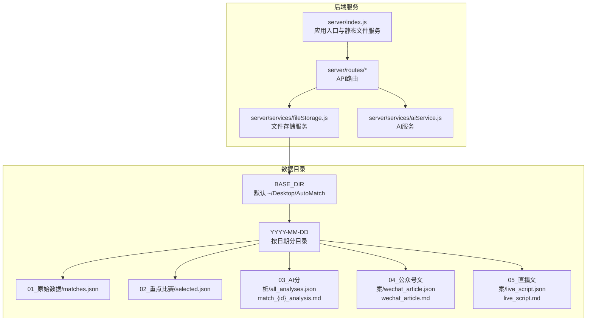
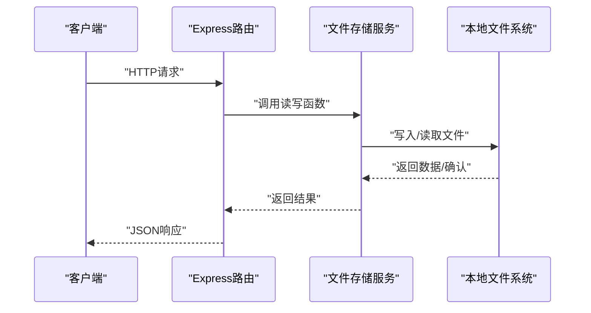
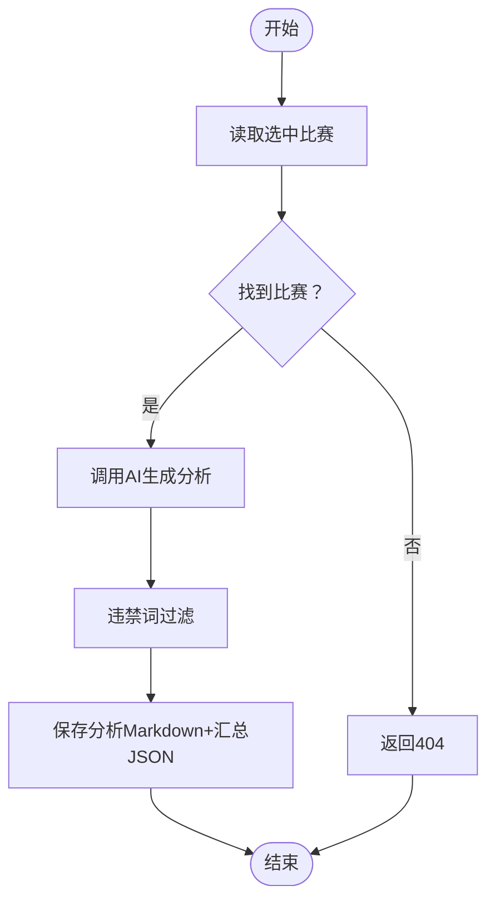
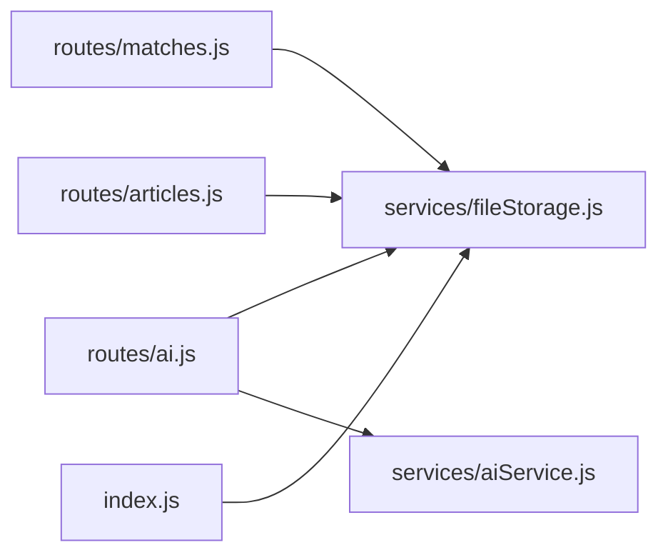

# 文件存储服务

<cite>
**本文引用的文件**
- [server/services/fileStorage.js](file://server/services/fileStorage.js)
- [server/index.js](file://server/index.js)
- [PRD.md](file://PRD.md)
- [server/routes/matches.js](file://server/routes/matches.js)
- [server/routes/ai.js](file://server/routes/ai.js)
- [server/routes/articles.js](file://server/routes/articles.js)
- [server/services/aiService.js](file://server/services/aiService.js)
- [package.json](file://package.json)
</cite>

## 目录
1. [简介](#简介)
2. [项目结构](#项目结构)
3. [核心组件](#核心组件)
4. [架构概览](#架构概览)
5. [详细组件分析](#详细组件分析)
6. [依赖关系分析](#依赖关系分析)
7. [性能考量](#性能考量)
8. [故障排查指南](#故障排查指南)
9. [结论](#结论)
10. [附录](#附录)

## 简介
本文件存储服务是AutoMatch项目的核心数据持久化层，负责将抓取的原始比赛数据、选中的重点比赛、AI生成的分析文案以及公众号/直播文案以结构化的方式保存到本地文件系统。该服务采用JSON与Markdown混合格式，结合日期分层目录组织，确保数据可读、可追溯且便于前端静态访问。

## 项目结构
AutoMatch后端采用Express框架，文件存储服务位于server/services目录下，配合多个路由模块对外提供REST API。静态文件服务通过Express的静态中间件暴露数据目录，使前端可直接访问本地数据文件。

图表来源
- [server/index.js:17-19](file://server/index.js#L17-L19)
- [server/services/fileStorage.js:4](file://server/services/fileStorage.js#L4-L4)
- [PRD.md:205-234](file://PRD.md#L205-L234)

章节来源
- [server/index.js:17-19](file://server/index.js#L17-L19)
- [PRD.md:205-234](file://PRD.md#L205-L234)

## 核心组件
- 目录与路径管理
  - 基础目录BASE_DIR可通过环境变量DATA_DIR覆盖，默认指向桌面目录下的AutoMatch文件夹。
  - 日期目录按“YYYY-MM-DD”命名，作为每日数据的根容器。
  - 子目录按功能划分：原始数据、重点比赛、AI分析、公众号文案、直播文案。
- 数据读写接口
  - 原始比赛数据：保存与读取matches.json。
  - 重点比赛：保存与读取selected.json。
  - AI分析：保存单场Markdown与汇总JSON；读取全部分析。
  - 文案：保存公众号与直播文案的Markdown与JSON两份副本。
- 辅助能力
  - 获取可用日期列表。
  - 读取任意Markdown文件内容。
  - 确保目录存在。

章节来源
- [server/services/fileStorage.js:4-196](file://server/services/fileStorage.js#L4-L196)
- [PRD.md:205-234](file://PRD.md#L205-L234)

## 架构概览
文件存储服务通过Express路由接收请求，调用文件存储服务进行数据读写，并将结果以JSON响应返回。静态文件服务将数据目录映射到HTTP路径，便于前端直接访问本地文件。

图表来源
- [server/routes/matches.js:10-35](file://server/routes/matches.js#L10-L35)
- [server/routes/ai.js:10-34](file://server/routes/ai.js#L10-L34)
- [server/routes/articles.js:10-51](file://server/routes/articles.js#L10-L51)
- [server/services/fileStorage.js:32-48](file://server/services/fileStorage.js#L32-L48)

## 详细组件分析

### 目录结构与命名策略
- 目录层级
  - BASE_DIR/日期/功能子目录/具体文件
  - 功能子目录命名包含序号与中文标识，便于人工识别与排序。
- 文件命名
  - 原始数据：matches.json
  - 重点比赛：selected.json
  - AI分析：match_{matchId}_analysis.md + all_analyses.json
  - 文案：wechat_article.md/json、live_script.md/json
- 优点
  - 结构清晰，便于手工检索与备份。
  - 日期分层天然支持归档与清理策略。
  - JSON与Markdown双写，兼顾机器解析与人类阅读。

章节来源
- [PRD.md:205-234](file://PRD.md#L205-L234)
- [server/services/fileStorage.js:32-139](file://server/services/fileStorage.js#L32-L139)

### JSON数据格式与优势
- 选择理由
  - 结构化程度高，便于前端直接解析与渲染。
  - 版本演进时可保留向后兼容字段，降低迁移成本。
  - 与AI服务输出契合，便于统一处理。
- 序列化与反序列化
  - 写入：使用UTF-8编码与缩进格式化，提升可读性。
  - 读取：严格异常捕获，缺失文件返回空值或空数组。
- 版本兼容性
  - 通过新增字段与条件判断实现渐进式演进。
  - 读取时忽略未知字段，保证稳定性。

章节来源
- [server/services/fileStorage.js:36-47](file://server/services/fileStorage.js#L36-L47)
- [server/services/fileStorage.js:57-68](file://server/services/fileStorage.js#L57-L68)
- [server/services/fileStorage.js:84-94](file://server/services/fileStorage.js#L84-L94)
- [server/services/fileStorage.js:118-135](file://server/services/fileStorage.js#L118-L135)

### 文件读写实现与异步处理
- 异步与同步
  - 路由层使用异步处理（如批量AI分析），内部读写采用同步方法，确保顺序一致性与原子性。
  - 对于AI分析的单场写入，先更新汇总JSON再写入Markdown，避免部分更新导致的数据不一致。
- 错误处理
  - 路由层统一try/catch，捕获存储服务抛出的异常并返回标准错误响应。
  - 文件不存在时返回null或空数组，避免中断流程。
- 资源清理
  - 采用一次性写入策略，减少并发冲突风险。
  - 未发现显式的锁机制，建议在高并发场景下增加外部锁或重试策略。

图表来源
- [server/routes/ai.js:10-34](file://server/routes/ai.js#L10-L34)
- [server/services/fileStorage.js:74-98](file://server/services/fileStorage.js#L74-L98)

章节来源
- [server/routes/ai.js:10-34](file://server/routes/ai.js#L10-L34)
- [server/services/fileStorage.js:74-98](file://server/services/fileStorage.js#L74-L98)

### 数据持久化最佳实践
- 事务性操作
  - 当前实现为多步写入（先写Markdown，再写汇总JSON），若中途失败会导致数据不一致。
  - 建议：采用临时文件写入后原子性重命名，或在AI分析保存处增加事务性封装。
- 备份策略
  - 基于日期分层的目录结构天然利于增量备份与归档。
  - 建议：定期将BASE_DIR打包为压缩包，保留最近N天的数据。
- 性能优化
  - 将大文件拆分为多份（如AI分析的单场Markdown与汇总JSON），减少单文件体积。
  - 对频繁读取的JSON文件（如all_analyses.json）可考虑缓存内存，但需注意进程重启后的失效问题。
  - 静态文件服务直接映射数据目录，避免重复读写，提高前端访问效率。

章节来源
- [server/services/fileStorage.js:84-94](file://server/services/fileStorage.js#L84-L94)
- [server/index.js:17-19](file://server/index.js#L17-L19)

### 安全考虑与访问控制
- 静态访问
  - 静态文件服务将数据目录映射到HTTP路径，仅限本地运行，不暴露公网。
  - 建议：在生产环境中关闭静态文件服务或限制访问范围。
- 环境变量
  - DATA_DIR通过环境变量控制，避免硬编码路径。
  - AI密钥通过环境变量注入，避免明文存储。
- 违禁词过滤
  - AI生成内容在保存前进行违禁词过滤，满足合规要求。
- 权限与隔离
  - 建议：为数据目录设置最小权限（仅当前用户可读写），避免跨用户访问。

章节来源
- [server/index.js:17-19](file://server/index.js#L17-L19)
- [server/services/aiService.js:3](file://server/services/aiService.js#L3-L3)
- [server/routes/ai.js:22-25](file://server/routes/ai.js#L22-L25)
- [server/routes/articles.js:39-42](file://server/routes/articles.js#L39-L42)

## 依赖关系分析
文件存储服务被多个路由模块依赖，形成清晰的分层：路由层负责请求处理与参数校验，存储层负责数据持久化，AI服务负责内容生成。

图表来源
- [server/routes/matches.js:3](file://server/routes/matches.js#L3-L3)
- [server/routes/ai.js:3-4](file://server/routes/ai.js#L3-L4)
- [server/routes/articles.js:3-5](file://server/routes/articles.js#L3-L5)
- [server/index.js:6-9](file://server/index.js#L6-L9)

章节来源
- [server/routes/matches.js:3](file://server/routes/matches.js#L3-L3)
- [server/routes/ai.js:3-4](file://server/routes/ai.js#L3-L4)
- [server/routes/articles.js:3-5](file://server/routes/articles.js#L3-L5)
- [server/index.js:6-9](file://server/index.js#L6-L9)

## 性能考量
- I/O模式
  - 读写均为本地磁盘操作，受磁盘吞吐影响。
  - 批量AI分析采用顺序循环，避免并发竞争，但可能增加总耗时。
- 缓存策略
  - 可对常用读取（如日期列表、选中比赛）进行内存缓存，减少重复I/O。
- 压缩与归档
  - 对历史数据进行压缩归档，释放空间并提升备份效率。
- 并发与锁
  - 在高并发场景下，建议引入文件锁或队列机制，避免竞态条件。

[本节为通用性能讨论，无需特定文件来源]

## 故障排查指南
- 常见问题
  - 数据目录不存在：检查DATA_DIR环境变量或手动创建目录。
  - 文件读取失败：确认文件是否存在、编码是否为UTF-8、JSON格式是否正确。
  - AI分析保存异常：检查AI服务密钥配置与网络连通性。
- 排查步骤
  - 确认BASE_DIR路径与权限。
  - 检查日期目录与子目录是否创建成功。
  - 核对JSON文件的字段完整性与类型。
  - 查看路由层错误响应中的错误信息。
- 日志与监控
  - 在关键写入点添加日志记录，便于定位问题。
  - 对批量操作统计耗时与成功率，及时发现异常批次。

章节来源
- [server/services/fileStorage.js:10-13](file://server/services/fileStorage.js#L10-L13)
- [server/routes/matches.js:12-14](file://server/routes/matches.js#L12-L14)
- [server/routes/ai.js:30-33](file://server/routes/ai.js#L30-L33)
- [server/routes/articles.js:48-50](file://server/routes/articles.js#L48-L50)

## 结论
文件存储服务以简洁可靠的本地文件系统为基础，结合JSON与Markdown格式，实现了AutoMatch从数据抓取到内容生成的全链路数据持久化。其清晰的目录结构与标准化的读写接口，既满足了自动化流程的需求，也为人工审计与备份提供了便利。未来可在事务性保障、并发控制与缓存策略方面进一步优化，以提升整体稳定性与性能。

[本节为总结性内容，无需特定文件来源]

## 附录
- 环境变量
  - DATA_DIR：数据根目录，默认为桌面AutoMatch文件夹。
  - ZHIPU_API_KEY：AI服务密钥，用于调用智谱GLM-4。
- 依赖库
  - Express：Web框架与静态文件服务。
  - dotenv：环境变量加载。
  - zhipuai-sdk-nodejs-v4：AI服务SDK。
- API参考
  - 赛事数据：获取日期列表、读取指定日期数据、保存选中比赛、保存单场预测。
  - AI分析：生成单场/批量分析、读取全部分析、更新分析内容。
  - 文案：生成公众号/直播文案、读取全部文案。

章节来源
- [server/index.js:17-19](file://server/index.js#L17-L19)
- [server/services/aiService.js:3](file://server/services/aiService.js#L3-L3)
- [package.json:15-21](file://package.json#L15-L21)
- [server/routes/matches.js:8-72](file://server/routes/matches.js#L8-L72)
- [server/routes/ai.js:10-99](file://server/routes/ai.js#L10-L99)
- [server/routes/articles.js:10-110](file://server/routes/articles.js#L10-L110)