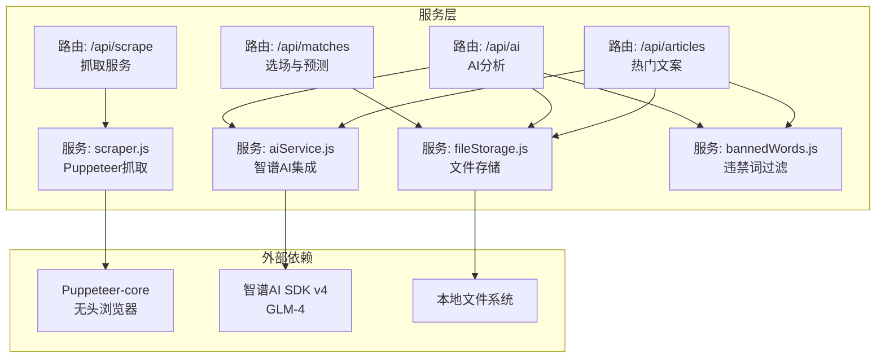
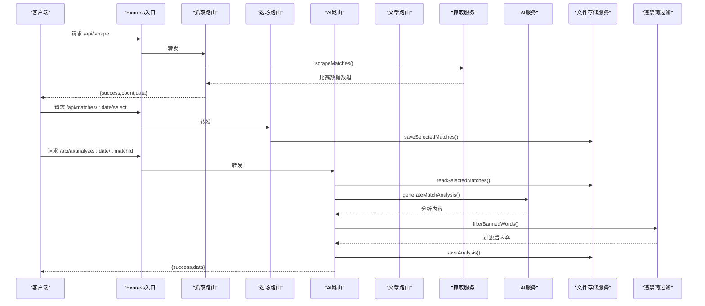
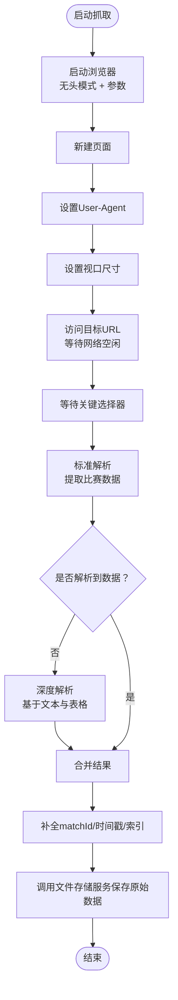
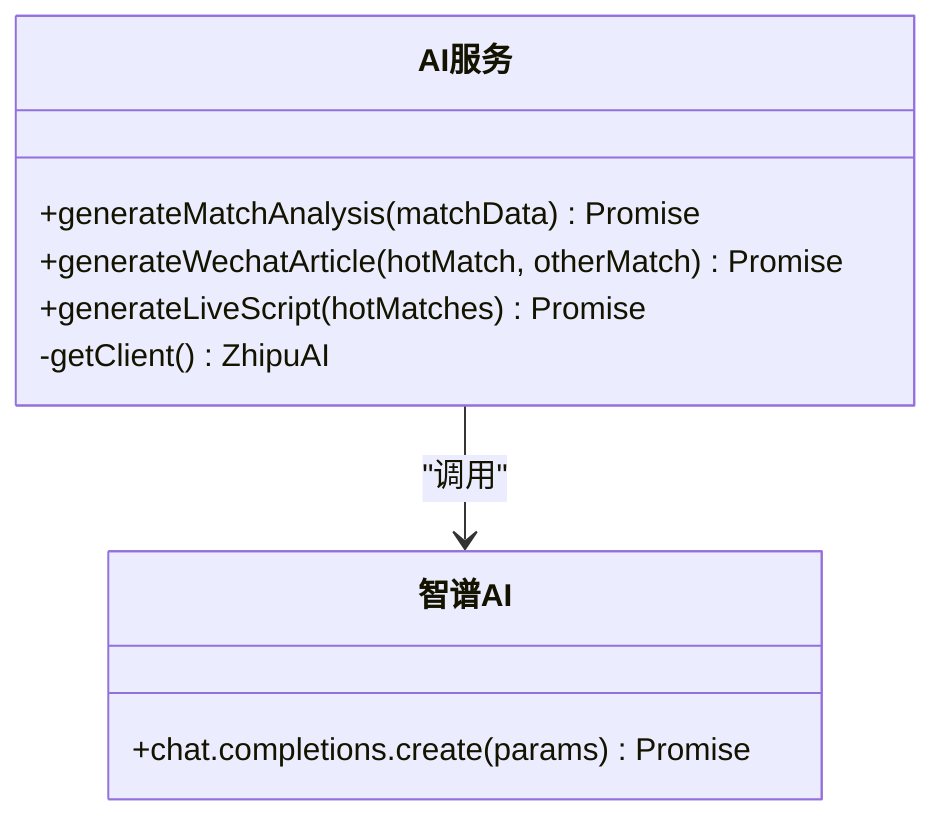
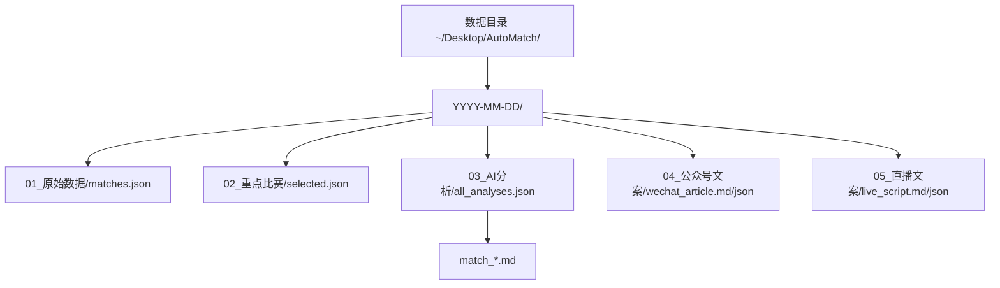
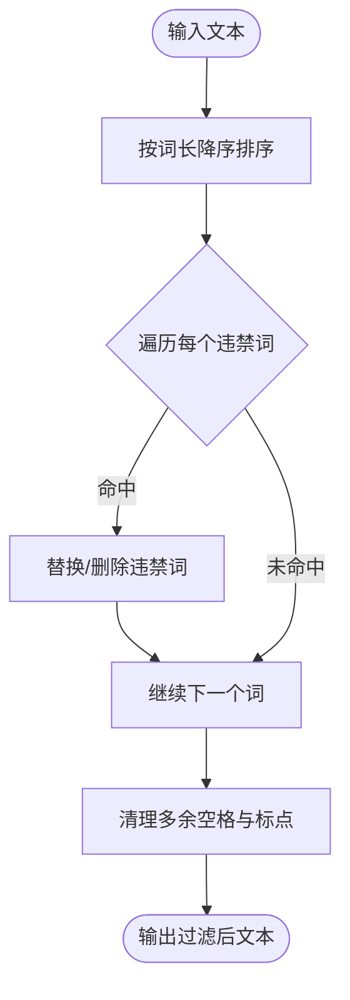
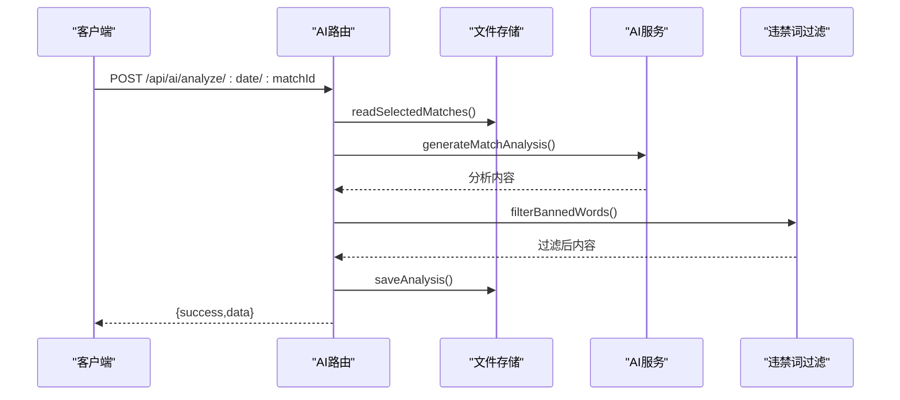
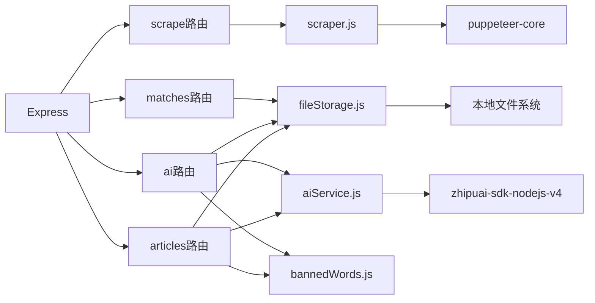

# 服务层架构

<cite>
**本文引用的文件**
- [server/index.js](file://server/index.js)
- [server/services/scraper.js](file://server/services/scraper.js)
- [server/services/fileStorage.js](file://server/services/fileStorage.js)
- [server/services/aiService.js](file://server/services/aiService.js)
- [server/services/bannedWords.js](file://server/services/bannedWords.js)
- [server/routes/scrape.js](file://server/routes/scrape.js)
- [server/routes/matches.js](file://server/routes/matches.js)
- [server/routes/ai.js](file://server/routes/ai.js)
- [server/routes/articles.js](file://server/routes/articles.js)
- [package.json](file://package.json)
- [PRD.md](file://PRD.md)
</cite>

## 目录
1. [简介](#简介)
2. [项目结构](#项目结构)
3. [核心组件](#核心组件)
4. [架构总览](#架构总览)
5. [详细组件分析](#详细组件分析)
6. [依赖关系分析](#依赖关系分析)
7. [性能考量](#性能考量)
8. [故障排查指南](#故障排查指南)
9. [结论](#结论)

## 简介
本文件聚焦AutoMatch服务层架构，系统化梳理服务层的设计模式、职责分离与协作机制。重点覆盖以下方面：
- Puppeteer自动化服务：无头浏览器配置、页面操作与数据提取策略
- AI分析服务：智谱AI SDK集成、Prompt工程设计与违禁词过滤
- 文件存储服务：数据持久化策略、目录组织与访问控制
- 服务间协作与错误处理
- 性能优化与并发处理策略

## 项目结构
服务层采用“路由-服务-存储”三层解耦架构：
- 路由层负责HTTP接口定义与请求参数校验
- 服务层封装业务逻辑（抓取、AI、存储）
- 存储层负责本地文件系统的读写与目录组织

图表来源
- [server/routes/scrape.js:1-26](file://server/routes/scrape.js#L1-L26)
- [server/routes/matches.js:1-75](file://server/routes/matches.js#L1-L75)
- [server/routes/ai.js:1-102](file://server/routes/ai.js#L1-L102)
- [server/routes/articles.js:1-113](file://server/routes/articles.js#L1-L113)
- [server/services/scraper.js:1-295](file://server/services/scraper.js#L1-L295)
- [server/services/aiService.js:1-212](file://server/services/aiService.js#L1-L212)
- [server/services/fileStorage.js:1-196](file://server/services/fileStorage.js#L1-L196)
- [server/services/bannedWords.js:1-114](file://server/services/bannedWords.js#L1-L114)

章节来源
- [server/index.js:1-49](file://server/index.js#L1-L49)
- [package.json:1-23](file://package.json#L1-L23)

## 核心组件
- 路由层：统一暴露REST接口，负责参数解析、状态码返回与错误捕获
- 服务层：
  - 抓取服务：基于Puppeteer的无头浏览器自动化，适配多类页面结构
  - AI服务：封装智谱AI SDK调用，提供多类型Prompt工程
  - 存储服务：按日期组织的本地文件系统，支持JSON与Markdown
  - 违禁词过滤：合规化文本处理
- 中间件与静态资源：CORS、JSON解析、静态文件服务

章节来源
- [server/routes/scrape.js:1-26](file://server/routes/scrape.js#L1-L26)
- [server/routes/matches.js:1-75](file://server/routes/matches.js#L1-L75)
- [server/routes/ai.js:1-102](file://server/routes/ai.js#L1-L102)
- [server/routes/articles.js:1-113](file://server/routes/articles.js#L1-L113)
- [server/services/scraper.js:1-295](file://server/services/scraper.js#L1-L295)
- [server/services/aiService.js:1-212](file://server/services/aiService.js#L1-L212)
- [server/services/fileStorage.js:1-196](file://server/services/fileStorage.js#L1-L196)
- [server/services/bannedWords.js:1-114](file://server/services/bannedWords.js#L1-L114)
- [server/index.js:1-49](file://server/index.js#L1-L49)

## 架构总览
服务层围绕“数据采集—智能分析—内容生成—持久化”的主流程运转，辅以合规过滤与静态资源访问。

图表来源
- [server/index.js:22-25](file://server/index.js#L22-L25)
- [server/routes/scrape.js:1-26](file://server/routes/scrape.js#L1-L26)
- [server/routes/matches.js:38-49](file://server/routes/matches.js#L38-L49)
- [server/routes/ai.js:7-34](file://server/routes/ai.js#L7-L34)
- [server/services/scraper.js:22-214](file://server/services/scraper.js#L22-L214)
- [server/services/aiService.js:18-65](file://server/services/aiService.js#L18-L65)
- [server/services/fileStorage.js:53-69](file://server/services/fileStorage.js#L53-L69)
- [server/services/bannedWords.js:70-96](file://server/services/bannedWords.js#L70-L96)

## 详细组件分析

### Puppeteer自动化服务（抓取服务）
职责与设计要点：
- 无头浏览器配置：通过可执行路径检测与参数设置，规避反爬特征
- 页面访问与等待：设置User-Agent、视口尺寸，等待网络空闲与关键选择器出现
- 数据提取：多选择器策略与正则匹配，兼容不同页面结构；失败时回退深度解析
- 数据清洗与落盘：补全唯一ID、时间戳，调用文件存储服务保存原始数据

图表来源
- [server/services/scraper.js:22-214](file://server/services/scraper.js#L22-L214)
- [server/services/scraper.js:219-292](file://server/services/scraper.js#L219-L292)

章节来源
- [server/services/scraper.js:1-295](file://server/services/scraper.js#L1-L295)
- [PRD.md:26-61](file://PRD.md#L26-L61)

### AI分析服务（智谱AI集成）
职责与设计要点：
- 客户端初始化：从环境变量读取API Key，校验有效性
- Prompt工程：
  - 单场分析：围绕赔率与让球盘口，强调逻辑闭环与专业语言
  - 公众号推文：标题吸睛、结构完整、合规用词
  - 直播脚本：口语化、可照读、仅基本面分析
- 输出处理：封装统一结构，包含时间戳与元数据
- 错误处理：捕获SDK异常并向上抛出

图表来源
- [server/services/aiService.js:1-212](file://server/services/aiService.js#L1-L212)

章节来源
- [server/services/aiService.js:1-212](file://server/services/aiService.js#L1-L212)
- [PRD.md:91-134](file://PRD.md#L91-L134)
- [PRD.md:136-203](file://PRD.md#L136-L203)

### 文件存储服务（数据持久化与组织）
职责与设计要点：
- 目录结构：按日期分目录，子目录按阶段命名（原始数据、重点比赛、AI分析、公众号文案、直播文案）
- 文件格式：原始数据与汇总JSON为JSON；AI分析、公众号、直播文案为Markdown，同时保留JSON便于程序消费
- 读写接口：提供读取/保存原始数据、选中比赛、单场AI分析、公众号/直播文案等方法
- 访问控制：通过静态文件中间件对外提供只读访问，路径映射至数据目录

图表来源
- [server/services/fileStorage.js:32-98](file://server/services/fileStorage.js#L32-L98)
- [server/services/fileStorage.js:112-139](file://server/services/fileStorage.js#L112-L139)
- [PRD.md:205-234](file://PRD.md#L205-L234)

章节来源
- [server/services/fileStorage.js:1-196](file://server/services/fileStorage.js#L1-L196)
- [server/index.js:17-19](file://server/index.js#L17-L19)
- [PRD.md:205-234](file://PRD.md#L205-L234)

### 违禁词过滤机制
职责与设计要点：
- 字典映射：提供违禁词到替换词的映射表，覆盖微信生态常用敏感表述
- 过滤策略：按词长降序匹配，优先替换长词；支持删除与替换两种策略
- 输出结构：返回过滤后的文本与发现的违禁词列表，便于审计与提示

图表来源
- [server/services/bannedWords.js:70-96](file://server/services/bannedWords.js#L70-L96)

章节来源
- [server/services/bannedWords.js:1-114](file://server/services/bannedWords.js#L1-L114)
- [server/routes/ai.js:22-25](file://server/routes/ai.js#L22-L25)
- [server/routes/articles.js:39-42](file://server/routes/articles.js#L39-L42)

### 路由层与服务协作
- 抓取路由：触发抓取服务，返回数量与数据
- 选场路由：读取/保存选中比赛，支持更新单场预测
- AI路由：读取选中比赛，调用AI服务生成分析，执行违禁词过滤，保存到文件存储
- 文章路由：聚合选中比赛与AI分析，生成公众号推文与直播脚本，执行违禁词过滤，保存到文件存储

图表来源
- [server/routes/ai.js:10-34](file://server/routes/ai.js#L10-L34)
- [server/services/aiService.js:18-65](file://server/services/aiService.js#L18-L65)
- [server/services/fileStorage.js:74-98](file://server/services/fileStorage.js#L74-L98)
- [server/services/bannedWords.js:70-96](file://server/services/bannedWords.js#L70-L96)

章节来源
- [server/routes/scrape.js:1-26](file://server/routes/scrape.js#L1-L26)
- [server/routes/matches.js:1-75](file://server/routes/matches.js#L1-L75)
- [server/routes/ai.js:1-102](file://server/routes/ai.js#L1-L102)
- [server/routes/articles.js:1-113](file://server/routes/articles.js#L1-L113)

## 依赖关系分析
- 外部依赖
  - Puppeteer-core：无头浏览器自动化
  - zhipuai-sdk-nodejs-v4：智谱AI SDK
  - dotenv：环境变量加载
  - cors、express：Web框架与跨域支持
- 内部依赖
  - 路由依赖服务层；服务层依赖存储层与外部SDK
  - AI路由与文章路由共同依赖AI服务与存储服务，形成高内聚低耦合

图表来源
- [server/index.js:6-9](file://server/index.js#L6-L9)
- [server/routes/scrape.js:1-26](file://server/routes/scrape.js#L1-L26)
- [server/routes/matches.js:1-75](file://server/routes/matches.js#L1-L75)
- [server/routes/ai.js:1-102](file://server/routes/ai.js#L1-L102)
- [server/routes/articles.js:1-113](file://server/routes/articles.js#L1-L113)
- [server/services/scraper.js:1-295](file://server/services/scraper.js#L1-L295)
- [server/services/aiService.js:1-212](file://server/services/aiService.js#L1-L212)
- [server/services/fileStorage.js:1-196](file://server/services/fileStorage.js#L1-L196)
- [server/services/bannedWords.js:1-114](file://server/services/bannedWords.js#L1-L114)
- [package.json:15-21](file://package.json#L15-L21)

章节来源
- [package.json:15-21](file://package.json#L15-L21)

## 性能考量
- 抓取性能
  - 无头模式与参数优化减少渲染开销
  - 等待策略平衡稳定性与速度（网络空闲、关键选择器、额外延时）
  - 失败回退：标准解析失败时启用深度解析，提升鲁棒性
- AI生成性能
  - 控制max_tokens与temperature，平衡质量与响应时间
  - 批量生成时逐条处理，便于错误隔离与重试
- 存储性能
  - JSON与Markdown双写，兼顾程序读取与人工阅读
  - 按日期分目录，避免单目录文件过多
- 并发与扩展
  - 当前实现为顺序处理；如需并发，建议引入任务队列与限流策略
  - AI调用建议增加重试与熔断机制

章节来源
- [server/services/scraper.js:27-57](file://server/services/scraper.js#L27-L57)
- [server/services/aiService.js:42-50](file://server/services/aiService.js#L42-L50)
- [PRD.md:276-279](file://PRD.md#L276-L279)

## 故障排查指南
- 抓取失败
  - 检查Chrome可执行路径与网络环境
  - 观察等待选择器是否生效，必要时调整选择器或延时
  - 查看浏览器关闭与finally块是否正常执行
- AI调用失败
  - 确认ZHIPU_API_KEY配置正确且非默认占位符
  - 检查Prompt长度与模型参数是否合理
- 违禁词过滤问题
  - 检查映射表是否覆盖目标违禁词
  - 确认过滤后文本是否符合平台规范
- 存储访问问题
  - 确认DATA_DIR环境变量与目录权限
  - 检查静态文件中间件路径映射

章节来源
- [server/services/scraper.js:10-17](file://server/services/scraper.js#L10-L17)
- [server/services/aiService.js:8-13](file://server/services/aiService.js#L8-L13)
- [server/services/bannedWords.js:70-96](file://server/services/bannedWords.js#L70-L96)
- [server/index.js:17-19](file://server/index.js#L17-L19)

## 结论
AutoMatch服务层通过清晰的职责划分与模块化设计，实现了从数据抓取、智能分析到内容生成与持久化的完整链路。Puppeteer服务具备良好的页面适配能力与回退策略；AI服务结合Prompt工程与合规过滤，满足内容生产的质量与合规要求；文件存储服务以日期为单位的层次化组织，既利于程序处理也便于人工查阅。未来可在并发与弹性扩展方面进一步完善，以应对更高负载与更复杂的业务场景。