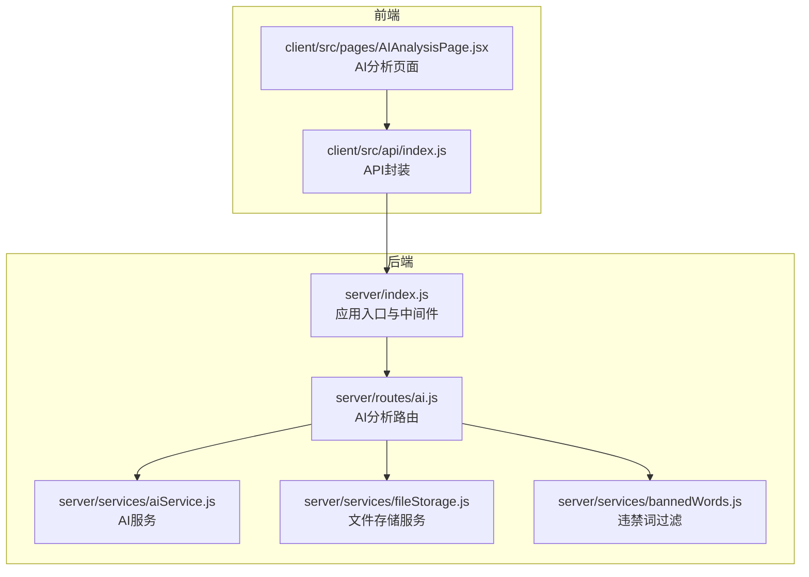
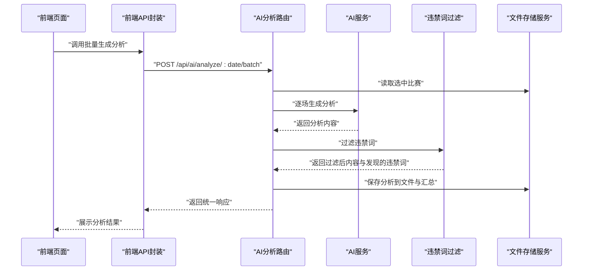
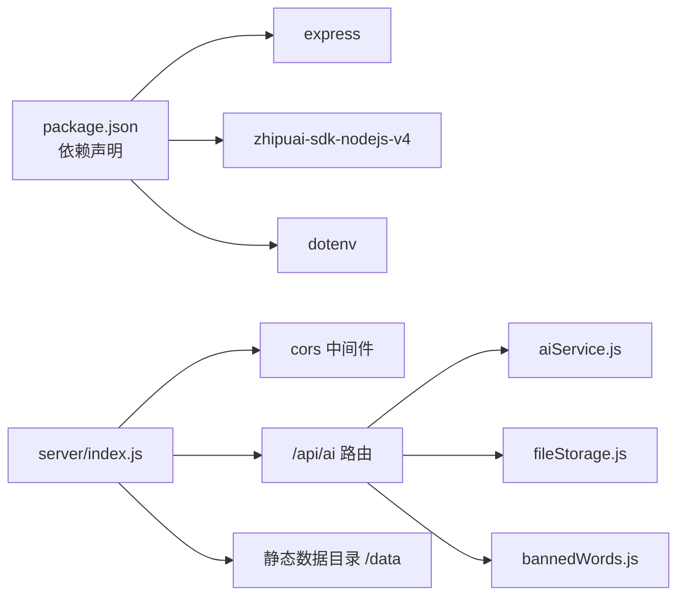

# AI分析路由

<cite>
**本文引用的文件**
- [server/index.js](file://server/index.js)
- [server/routes/ai.js](file://server/routes/ai.js)
- [server/services/aiService.js](file://server/services/aiService.js)
- [server/services/fileStorage.js](file://server/services/fileStorage.js)
- [server/services/bannedWords.js](file://server/services/bannedWords.js)
- [client/src/api/index.js](file://client/src/api/index.js)
- [client/src/pages/AIAnalysisPage.jsx](file://client/src/pages/AIAnalysisPage.jsx)
- [package.json](file://package.json)
</cite>

## 目录
1. [简介](#简介)
2. [项目结构](#项目结构)
3. [核心组件](#核心组件)
4. [架构总览](#架构总览)
5. [详细组件分析](#详细组件分析)
6. [依赖关系分析](#依赖关系分析)
7. [性能考量](#性能考量)
8. [故障排除指南](#故障排除指南)
9. [结论](#结论)
10. [附录](#附录)

## 简介
本文件聚焦于AI分析路由模块，围绕后端Express路由与服务层的协作，系统性梳理以下关键能力：
- GET /api/ai/analyses/:date 的实现与数据读取流程
- POST /api/ai/analyze/:date/:matchId 的单场AI分析生成流程
- POST /api/ai/analyze/:date/batch 的批量分析生成流程
- 智谱AI SDK集成与Prompt工程设计
- 违禁词过滤机制与内容合规策略
- 分析结果的持久化与响应格式
- 前端调用示例、错误处理与调试方法

## 项目结构
后端采用分层架构：路由层负责HTTP接口定义，服务层封装业务逻辑（AI生成、文件存储、违禁词过滤），前端通过统一API模块调用后端接口。

图表来源
- [server/index.js:1-49](file://server/index.js#L1-L49)
- [server/routes/ai.js:1-102](file://server/routes/ai.js#L1-L102)
- [server/services/aiService.js:1-212](file://server/services/aiService.js#L1-L212)
- [server/services/fileStorage.js:1-196](file://server/services/fileStorage.js#L1-L196)
- [server/services/bannedWords.js:1-114](file://server/services/bannedWords.js#L1-L114)
- [client/src/api/index.js:1-50](file://client/src/api/index.js#L1-L50)
- [client/src/pages/AIAnalysisPage.jsx:1-203](file://client/src/pages/AIAnalysisPage.jsx#L1-L203)

章节来源
- [server/index.js:1-49](file://server/index.js#L1-L49)
- [server/routes/ai.js:1-102](file://server/routes/ai.js#L1-L102)
- [client/src/api/index.js:1-50](file://client/src/api/index.js#L1-L50)

## 核心组件
- 路由层（AI分析路由）：提供单场分析生成、批量分析生成、查询分析、更新分析等接口；负责参数校验、调用服务层、执行违禁词过滤与持久化，并返回统一结构的响应。
- AI服务层：封装智谱AI SDK客户端初始化、Prompt工程、模型调用与响应解析。
- 文件存储服务：按日期组织数据目录，支持保存/读取原始数据、选中比赛、AI分析、公众号文案、直播文案等。
- 违禁词过滤：提供违禁词映射表与过滤函数，确保输出内容符合平台规范。
- 前端API封装：统一请求方法、错误处理与响应结构断言，便于页面组件调用。

章节来源
- [server/routes/ai.js:1-102](file://server/routes/ai.js#L1-L102)
- [server/services/aiService.js:1-212](file://server/services/aiService.js#L1-L212)
- [server/services/fileStorage.js:1-196](file://server/services/fileStorage.js#L1-L196)
- [server/services/bannedWords.js:1-114](file://server/services/bannedWords.js#L1-L114)
- [client/src/api/index.js:1-50](file://client/src/api/index.js#L1-L50)

## 架构总览
AI分析模块的端到端流程如下：前端触发分析请求，后端路由层读取选中比赛数据，调用AI服务生成分析，执行违禁词过滤，写入本地文件系统，最后返回统一响应。

图表来源
- [server/routes/ai.js:36-69](file://server/routes/ai.js#L36-L69)
- [server/services/aiService.js:18-65](file://server/services/aiService.js#L18-L65)
- [server/services/bannedWords.js:70-96](file://server/services/bannedWords.js#L70-L96)
- [server/services/fileStorage.js:74-98](file://server/services/fileStorage.js#L74-L98)
- [client/src/api/index.js:35-42](file://client/src/api/index.js#L35-L42)

## 详细组件分析

### 路由层：AI分析路由
- 单场分析生成
  - 路径：POST /api/ai/analyze/:date/:matchId
  - 流程要点：
    - 从文件存储读取选中比赛，定位目标matchId
    - 调用AI服务生成分析
    - 违禁词过滤：对content执行替换与清理，记录发现的违禁词
    - 保存分析至本地文件与汇总JSON
    - 返回统一响应结构
  - 错误处理：未找到比赛返回404；内部异常捕获并返回500
- 批量分析生成
  - 路径：POST /api/ai/analyze/:date/batch
  - 流程要点：
    - 读取选中比赛集合
    - 逐个生成分析，过滤违禁词，保存
    - 对单场异常单独记录错误，其余成功项仍返回
    - 返回统一响应结构
- 查询分析
  - 路径：GET /api/ai/analyses/:date
  - 流程要点：读取指定日期的分析汇总JSON并返回
- 更新分析
  - 路径：PUT /api/ai/analyses/:date/:matchId
  - 流程要点：接收content，更新本地文件与汇总JSON

章节来源
- [server/routes/ai.js:10-34](file://server/routes/ai.js#L10-L34)
- [server/routes/ai.js:39-69](file://server/routes/ai.js#L39-L69)
- [server/routes/ai.js:74-82](file://server/routes/ai.js#L74-L82)
- [server/routes/ai.js:87-99](file://server/routes/ai.js#L87-L99)

### 服务层：AI服务
- 智谱AI SDK集成
  - 客户端初始化：从环境变量读取API密钥，若未配置则抛错
  - 模型选择：统一使用glm-4
  - 调用方式：chat.completions.create，设置temperature与max_tokens
- Prompt工程设计
  - 单场分析Prompt：基于主队、客队、联赛、时间、初盘赔率、让球、分析师预测、信心指数、分析笔记等字段，要求逻辑闭环、语言专业、字数控制在约200字，并规避违禁词
  - 公众号推文Prompt：基于最热两场比赛，要求标题吸睛、开头制造悬念、重点分析最热比赛、逻辑层层递进、结尾有号召力，全文约800-1200字
  - 直播文案Prompt：基于多场比赛，要求开场白、逐场分析（每场约300-400字）、结尾总结，整篇适合朗读
- 响应解析与结构
  - 统一返回对象包含matchId、teams、prediction、content、createdAt等字段
  - 批量场景下，单场异常会以{matchId, error}形式返回，保证整体成功

章节来源
- [server/services/aiService.js:3-13](file://server/services/aiService.js#L3-L13)
- [server/services/aiService.js:18-65](file://server/services/aiService.js#L18-L65)
- [server/services/aiService.js:70-135](file://server/services/aiService.js#L70-L135)
- [server/services/aiService.js:140-205](file://server/services/aiService.js#L140-L205)

### 存储层：文件存储服务
- 目录结构
  - 以日期为根目录，子目录包含：原始数据、重点比赛、AI分析、公众号文案、直播文案
- 关键功能
  - 保存/读取选中比赛
  - 保存/读取AI分析：同时写入Markdown与汇总JSON
  - 读取分析汇总：返回all_analyses.json
  - 保存/读取公众号与直播文案
- 默认数据目录
  - 可通过DATA_DIR环境变量自定义；默认位于用户桌面的AutoMatch目录

章节来源
- [server/services/fileStorage.js:4-27](file://server/services/fileStorage.js#L4-L27)
- [server/services/fileStorage.js:53-69](file://server/services/fileStorage.js#L53-L69)
- [server/services/fileStorage.js:74-98](file://server/services/fileStorage.js#L74-L98)
- [server/services/fileStorage.js:103-107](file://server/services/fileStorage.js#L103-L107)
- [server/services/fileStorage.js:112-139](file://server/services/fileStorage.js#L112-L139)

### 违禁词过滤
- 过滤策略
  - 使用映射表将违禁词替换为合规表述；部分词直接删除
  - 按词长降序匹配，优先替换长词，避免短词覆盖长词
  - 过滤后清理多余空格与重复标点
- 输出结构
  - 返回过滤后的文本与发现的违禁词数组
- 应用范围
  - 在AI分析生成后立即执行，确保输出合规

章节来源
- [server/services/bannedWords.js:6-63](file://server/services/bannedWords.js#L6-L63)
- [server/services/bannedWords.js:70-96](file://server/services/bannedWords.js#L70-L96)
- [server/services/bannedWords.js:101-111](file://server/services/bannedWords.js#L101-L111)

### 前端调用与页面展示
- API封装
  - 统一请求方法、Content-Type、错误断言（success字段）
  - 提供批量生成分析、查询分析、更新分析等方法
- 页面逻辑
  - 加载选中比赛与分析结果
  - 触发批量生成，显示加载状态与消息提示
  - 支持编辑分析内容并保存
  - 复制分析内容到剪贴板
  - 若检测到违禁词，显示过滤标记

章节来源
- [client/src/api/index.js:1-50](file://client/src/api/index.js#L1-L50)
- [client/src/pages/AIAnalysisPage.jsx:16-29](file://client/src/pages/AIAnalysisPage.jsx#L16-L29)
- [client/src/pages/AIAnalysisPage.jsx:31-47](file://client/src/pages/AIAnalysisPage.jsx#L31-L47)
- [client/src/pages/AIAnalysisPage.jsx:49-58](file://client/src/pages/AIAnalysisPage.jsx#L49-L58)
- [client/src/pages/AIAnalysisPage.jsx:65-71](file://client/src/pages/AIAnalysisPage.jsx#L65-L71)
- [client/src/pages/AIAnalysisPage.jsx:115-199](file://client/src/pages/AIAnalysisPage.jsx#L115-L199)

## 依赖关系分析

图表来源
- [package.json:15-21](file://package.json#L15-L21)
- [server/index.js:14-25](file://server/index.js#L14-L25)
- [server/routes/ai.js:3-5](file://server/routes/ai.js#L3-L5)

章节来源
- [package.json:15-21](file://package.json#L15-L21)
- [server/index.js:14-25](file://server/index.js#L14-L25)

## 性能考量
- 模型参数
  - temperature与max_tokens在不同任务中分别设置，平衡创造性与稳定性
- 批量处理
  - 批量生成时逐个调用AI服务，异常单场不影响整体流程
- 存储策略
  - 将分析内容同时写入Markdown与汇总JSON，便于快速读取与后续处理
- 前端体验
  - 批量生成时显示加载状态与消息提示，提升交互反馈

章节来源
- [server/services/aiService.js:42-50](file://server/services/aiService.js#L42-L50)
- [server/routes/ai.js:48-63](file://server/routes/ai.js#L48-L63)
- [server/services/fileStorage.js:78-94](file://server/services/fileStorage.js#L78-L94)
- [client/src/pages/AIAnalysisPage.jsx:31-47](file://client/src/pages/AIAnalysisPage.jsx#L31-L47)

## 故障排除指南
- 环境变量缺失
  - 症状：初始化AI客户端时报错
  - 排查：确认ZHIPU_API_KEY已正确配置
- 未找到比赛
  - 症状：单场/批量生成返回404
  - 排查：确认选中比赛文件存在且matchId匹配
- AI调用失败
  - 症状：生成分析抛出异常
  - 排查：检查网络连接、API密钥有效性、模型可用性
- 违禁词过滤异常
  - 症状：过滤后文本出现多余空格或标点
  - 排查：检查过滤映射表与清理正则
- 前端调用失败
  - 症状：统一错误断言抛错
  - 排查：检查后端路由是否正确挂载、CORS配置、静态数据目录权限

章节来源
- [server/services/aiService.js:9-12](file://server/services/aiService.js#L9-L12)
- [server/routes/ai.js:16-18](file://server/routes/ai.js#L16-L18)
- [server/services/bannedWords.js:92-93](file://server/services/bannedWords.js#L92-L93)
- [client/src/api/index.js:9-12](file://client/src/api/index.js#L9-L12)
- [server/index.js:14-19](file://server/index.js#L14-L19)

## 结论
AI分析路由模块通过清晰的分层设计与完善的质量控制（Prompt工程、违禁词过滤、文件存储与统一响应），实现了从数据输入到分析输出的完整闭环。结合前端友好的交互与错误处理，为用户提供稳定可靠的AI分析能力。建议持续优化Prompt细节与过滤规则，以进一步提升输出质量与合规性。

## 附录

### API定义与调用示例
- 获取指定日期的所有AI分析
  - 方法：GET
  - 路径：/api/ai/analyses/:date
  - 成功响应：包含data数组（每项为分析对象）
  - 失败响应：包含error字段
- 更新某场比赛的AI分析内容
  - 方法：PUT
  - 路径：/api/ai/analyses/:date/:matchId
  - 请求体：{ content }
  - 成功响应：success为true
- 单场AI分析生成
  - 方法：POST
  - 路径：/api/ai/analyze/:date/:matchId
  - 成功响应：包含data（分析对象，含bannedWordsFound）
  - 失败响应：包含error字段
- 批量AI分析生成
  - 方法：POST
  - 路径：/api/ai/analyze/:date/batch
  - 成功响应：包含data数组（每项为分析对象或{matchId,error}）
  - 失败响应：包含error字段

章节来源
- [server/routes/ai.js:74-82](file://server/routes/ai.js#L74-L82)
- [server/routes/ai.js:87-99](file://server/routes/ai.js#L87-L99)
- [server/routes/ai.js:10-34](file://server/routes/ai.js#L10-L34)
- [server/routes/ai.js:39-69](file://server/routes/ai.js#L39-L69)

### 响应格式与字段说明
- 分析对象通用字段
  - matchId：比赛标识
  - homeTeam/awayTeam：主队/客队名称
  - prediction：分析师预测
  - content：分析内容
  - createdAt：创建时间
  - bannedWordsFound（可选）：过滤前发现的违禁词列表
- 批量响应
  - data数组中可能包含分析对象或错误对象（含matchId与error）

章节来源
- [server/services/aiService.js:53-60](file://server/services/aiService.js#L53-L60)
- [server/routes/ai.js:22-25](file://server/routes/ai.js#L22-L25)
- [server/routes/ai.js:57-62](file://server/routes/ai.js#L57-L62)

### 质量控制与合规策略
- Prompt工程
  - 明确字数、语气、逻辑与用词限制
  - 针对不同场景（单场、公众号、直播）定制Prompt
- 违禁词过滤
  - 基于映射表替换或删除违禁词
  - 过滤后清理多余空白与标点
- 内容审核
  - 建议在生产环境引入二次人工复核或自动化合规扫描

章节来源
- [server/services/aiService.js:21-39](file://server/services/aiService.js#L21-L39)
- [server/services/aiService.js:73-113](file://server/services/aiService.js#L73-L113)
- [server/services/aiService.js:153-183](file://server/services/aiService.js#L153-L183)
- [server/services/bannedWords.js:70-96](file://server/services/bannedWords.js#L70-L96)

### 调试工具与排障步骤
- 后端日志
  - 关注AI生成失败、文件保存路径、过滤结果
- 前端调试
  - 使用浏览器开发者工具查看网络请求与响应
  - 检查消息提示与加载状态
- 环境配置
  - 确认DATA_DIR与ZHIPU_API_KEY配置正确
- 数据目录
  - 确认各日期目录与文件存在且可读写

章节来源
- [server/services/aiService.js:62-64](file://server/services/aiService.js#L62-L64)
- [server/services/fileStorage.js:78-94](file://server/services/fileStorage.js#L78-L94)
- [server/services/bannedWords.js:92-93](file://server/services/bannedWords.js#L92-L93)
- [server/index.js:18-19](file://server/index.js#L18-L19)