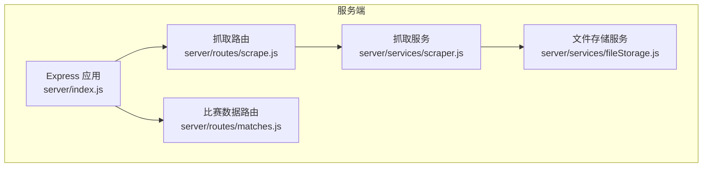
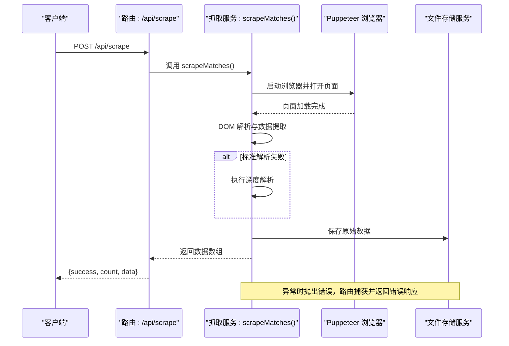
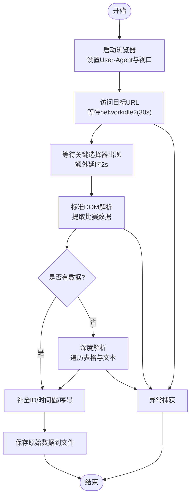
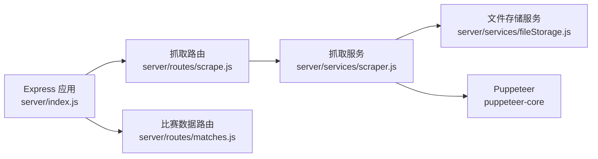

# 数据抓取路由

<cite>
**本文引用的文件**
- [server/index.js](file://server/index.js)
- [server/routes/scrape.js](file://server/routes/scrape.js)
- [server/services/scraper.js](file://server/services/scraper.js)
- [server/services/fileStorage.js](file://server/services/fileStorage.js)
- [server/routes/matches.js](file://server/routes/matches.js)
- [package.json](file://package.json)
</cite>

## 目录
1. [简介](#简介)
2. [项目结构](#项目结构)
3. [核心组件](#核心组件)
4. [架构总览](#架构总览)
5. [详细组件分析](#详细组件分析)
6. [依赖关系分析](#依赖关系分析)
7. [性能考虑](#性能考虑)
8. [故障排除指南](#故障排除指南)
9. [结论](#结论)
10. [附录](#附录)

## 简介
本技术文档聚焦于数据抓取路由模块，围绕 POST /api/scrape 端点展开，系统性解析以下内容：
- Puppeteer 无头浏览器自动化流程与页面交互
- 500彩票网竞彩足球数据抓取逻辑与 DOM 解析策略
- 错误处理机制与响应格式化
- 抓取服务的配置选项、超时设置与重试策略
- 完整的 API 调用示例（请求参数、响应结构、错误处理）
- 数据解析过程、DOM 操作技术与反爬虫应对策略
- 性能优化建议与故障排除指南

## 项目结构
后端采用 Express 框架，按“路由-服务”分层组织。数据抓取路由位于 server/routes/scrape.js，核心抓取逻辑封装在 server/services/scraper.js 中，文件存储由 server/services/fileStorage.js 提供。主入口 server/index.js 注册路由并提供静态数据访问。

图表来源
- [server/index.js:11-25](file://server/index.js#L11-L25)
- [server/routes/scrape.js:1-26](file://server/routes/scrape.js#L1-L26)
- [server/services/scraper.js:1-295](file://server/services/scraper.js#L1-L295)
- [server/services/fileStorage.js:1-196](file://server/services/fileStorage.js#L1-L196)
- [server/routes/matches.js:1-75](file://server/routes/matches.js#L1-L75)

章节来源
- [server/index.js:11-25](file://server/index.js#L11-L25)
- [server/routes/scrape.js:1-26](file://server/routes/scrape.js#L1-L26)
- [server/services/scraper.js:1-295](file://server/services/scraper.js#L1-L295)
- [server/services/fileStorage.js:1-196](file://server/services/fileStorage.js#L1-L196)
- [server/routes/matches.js:1-75](file://server/routes/matches.js#L1-L75)

## 核心组件
- 路由层：提供 /api/scrape POST 接口，负责接收请求、调用抓取服务并返回统一格式的响应。
- 服务层：封装 Puppeteer 无头浏览器启动、页面导航、DOM 解析与数据提取、文件落盘等核心逻辑。
- 存储层：提供按日期分层的数据目录结构，支持原始数据、重点比赛、AI 分析、公众号文案、直播文案等多类数据的读写。

章节来源
- [server/routes/scrape.js:8-23](file://server/routes/scrape.js#L8-L23)
- [server/services/scraper.js:22-214](file://server/services/scraper.js#L22-L214)
- [server/services/fileStorage.js:32-69](file://server/services/fileStorage.js#L32-L69)

## 架构总览
POST /api/scrape 的端到端流程如下：
- 客户端向 /api/scrape 发送 POST 请求
- 路由处理器调用抓取服务函数
- 抓取服务启动 Puppeteer 浏览器，访问目标页面，等待关键元素出现
- 在页面上下文中执行 DOM 解析，提取比赛数据
- 若标准解析失败，回退至深度解析策略
- 为每条记录补充唯一标识与时间戳，并保存到本地文件
- 返回成功响应；若异常则捕获并返回错误信息

图表来源
- [server/routes/scrape.js:8-23](file://server/routes/scrape.js#L8-L23)
- [server/services/scraper.js:22-214](file://server/services/scraper.js#L22-L214)
- [server/services/fileStorage.js:32-39](file://server/services/fileStorage.js#L32-L39)

## 详细组件分析

### 路由层：/api/scrape
- 职责：接收 POST 请求，调用抓取服务，统一响应格式，集中错误处理。
- 响应结构：
  - 成功：{ success: true, count: 数量, data: 比赛数组 }
  - 失败：{ success: false, error: 错误消息 }
- 错误处理：捕获异常并返回 500，同时在控制台输出错误日志。

章节来源
- [server/routes/scrape.js:8-23](file://server/routes/scrape.js#L8-L23)

### 抓取服务：scrapeMatches()
- 浏览器启动与配置
  - 使用 puppeteer-core，支持通过环境变量 CHROME_PATH 指定可执行路径
  - 无头模式启动，禁用沙箱与自动化特征检测
- 页面导航与等待
  - 访问目标 URL，等待 networkidle2，超时 30 秒
  - 等待关键表格选择器出现，额外延时确保数据渲染
- DOM 解析与数据提取
  - 支持多种选择器适配不同页面结构
  - 从行元素中提取编号、联赛、时间、球队、胜平负赔率、让球胜平负等字段
  - 对文本进行正则与数值过滤，保证数据有效性
- 回退解析策略
  - 当标准解析结果为空时，使用深度解析：遍历所有表格，基于文本模式识别比赛信息与赔率
- 数据增强与落盘
  - 为每条记录生成唯一 ID、抓取时间戳与序号
  - 保存到按日期分层的目录结构中

图表来源
- [server/services/scraper.js:22-214](file://server/services/scraper.js#L22-L214)
- [server/services/scraper.js:219-292](file://server/services/scraper.js#L219-L292)
- [server/services/fileStorage.js:32-39](file://server/services/fileStorage.js#L32-L39)

章节来源
- [server/services/scraper.js:22-214](file://server/services/scraper.js#L22-L214)
- [server/services/scraper.js:219-292](file://server/services/scraper.js#L219-L292)

### 文件存储服务：按日期分层的数据目录
- 目录结构：DATA_DIR/YYYY-MM-DD/{01_原始数据, 02_重点比赛, 03_AI分析, 04_公众号文案, 05_直播文案}
- 功能：保存原始数据、重点比赛、AI 分析 Markdown 与汇总 JSON、公众号/直播文案等
- 读写接口：提供按日期读取与写入的统一方法，便于前端通过静态资源访问

章节来源
- [server/services/fileStorage.js:4-48](file://server/services/fileStorage.js#L4-L48)
- [server/services/fileStorage.js:53-98](file://server/services/fileStorage.js#L53-L98)
- [server/services/fileStorage.js:112-139](file://server/services/fileStorage.js#L112-L139)
- [server/index.js:17-19](file://server/index.js#L17-L19)

### 配置选项、超时与重试策略
- 配置项
  - CHROME_PATH：指定 Chrome/Chromium 可执行路径，优先使用环境变量
  - DATA_DIR：数据根目录，默认桌面目录下的 AutoMatch 文件夹
- 超时设置
  - 页面导航超时：30 秒
  - 关键元素等待：15 秒
  - 额外延时：2 秒，确保数据渲染完成
- 重试策略
  - 当前实现未内置自动重试；如需增强，可在路由层或服务层增加指数退避重试逻辑

章节来源
- [server/services/scraper.js:10-17](file://server/services/scraper.js#L10-L17)
- [server/services/scraper.js:48-51](file://server/services/scraper.js#L48-L51)
- [server/services/scraper.js:54](file://server/services/scraper.js#L54)
- [server/services/scraper.js:57](file://server/services/scraper.js#L57)
- [server/services/fileStorage.js:4](file://server/services/fileStorage.js#L4)
- [server/index.js:18](file://server/index.js#L18)

### API 调用示例
- 端点：POST /api/scrape
- 请求体：无（空对象即可）
- 成功响应：
  - 结构：{ success: true, count: 整数, data: 数组 }
  - 示例字段：matchId, league, homeTeam, awayTeam, matchTime, oddsWin, oddsDraw, oddsLoss, handicapLine, handicapWin, handicapDraw, handicapLoss, scrapedAt, index
- 失败响应：
  - 结构：{ success: false, error: 字符串 }
- 错误处理：
  - 服务层抛出异常，路由层捕获并返回 500

章节来源
- [server/routes/scrape.js:8-23](file://server/routes/scrape.js#L8-L23)

### 数据解析过程与 DOM 操作技术
- 选择器策略：优先使用行级选择器与表格容器，兼容多种页面结构
- 文本解析：对单元格文本进行清洗、分割与正则匹配，提取编号、时间、联赛等信息
- 数值提取：从标签集合中筛选合理范围内的浮点数作为赔率
- 回退策略：当标准解析失败时，遍历表格文本，基于模式匹配识别比赛信息与赔率

章节来源
- [server/services/scraper.js:62-183](file://server/services/scraper.js#L62-L183)
- [server/services/scraper.js:219-292](file://server/services/scraper.js#L219-L292)

### 反爬虫应对策略
- User-Agent 设置：模拟真实浏览器 UA
- 视口设置：设定常见分辨率，避免异常尺寸触发风控
- 无头模式与参数：禁用沙箱与自动化特征检测，降低被识别概率
- 等待策略：等待网络空闲与关键元素出现，减少动态加载带来的不确定性

章节来源
- [server/services/scraper.js:39-45](file://server/services/scraper.js#L39-L45)
- [server/services/scraper.js:27-35](file://server/services/scraper.js#L27-L35)

## 依赖关系分析
- Express 应用注册多个路由，其中 /api/scrape 依赖抓取服务
- 抓取服务依赖 Puppeteer 与文件存储服务
- 文件存储服务依赖 Node.js 文件系统与环境变量

图表来源
- [server/index.js:6-25](file://server/index.js#L6-L25)
- [server/routes/scrape.js:3](file://server/routes/scrape.js#L3)
- [server/services/scraper.js:1](file://server/services/scraper.js#L1)
- [server/services/fileStorage.js:1](file://server/services/fileStorage.js#L1)
- [package.json:15-21](file://package.json#L15-L21)

章节来源
- [server/index.js:6-25](file://server/index.js#L6-L25)
- [package.json:15-21](file://package.json#L15-L21)

## 性能考虑
- 浏览器生命周期管理：确保在 finally 中关闭浏览器实例，避免资源泄漏
- 等待策略：合理设置等待条件与超时，平衡稳定性与响应速度
- 数据解析：尽量在页面上下文内完成 DOM 操作，减少跨上下文通信成本
- 文件 I/O：批量写入与目录结构清晰，便于后续读取与前端静态访问
- 可扩展性：当前未内置重试机制，可在服务层增加指数退避重试，提升鲁棒性

章节来源
- [server/services/scraper.js:209-213](file://server/services/scraper.js#L209-L213)
- [server/services/scraper.js:48-51](file://server/services/scraper.js#L48-L51)
- [server/services/scraper.js:54](file://server/services/scraper.js#L54)
- [server/services/scraper.js:57](file://server/services/scraper.js#L57)

## 故障排除指南
- 浏览器启动失败
  - 检查 CHROME_PATH 是否正确指向 Chrome/Chromium 可执行文件
  - 确认操作系统支持无头模式运行
- 页面加载超时
  - 调整页面导航超时与关键元素等待时间
  - 检查网络状况与目标站点可用性
- 数据解析为空
  - 使用深度解析回退逻辑
  - 检查页面结构变化，更新选择器与解析规则
- 文件保存失败
  - 检查 DATA_DIR 权限与磁盘空间
  - 确认日期目录创建与写入权限
- 路由返回错误
  - 查看服务端控制台日志定位异常
  - 确认依赖安装与版本兼容性

章节来源
- [server/services/scraper.js:10-17](file://server/services/scraper.js#L10-L17)
- [server/services/scraper.js:48-51](file://server/services/scraper.js#L48-L51)
- [server/services/scraper.js:219-292](file://server/services/scraper.js#L219-L292)
- [server/services/fileStorage.js:32-39](file://server/services/fileStorage.js#L32-L39)
- [server/routes/scrape.js:16-22](file://server/routes/scrape.js#L16-L22)

## 结论
该数据抓取路由模块通过 Puppeteer 实现对 500彩票网竞彩足球页面的自动化抓取，结合多策略 DOM 解析与回退机制，能够稳定地提取比赛数据并落盘。路由层提供统一的响应格式与错误处理，文件存储服务按日期分层组织数据，便于前端静态访问。建议在未来引入重试策略与更细粒度的监控指标，以进一步提升稳定性与可观测性。

## 附录
- 环境变量
  - CHROME_PATH：Chrome/Chromium 可执行路径
  - DATA_DIR：数据根目录
- 依赖包
  - puppeteer-core：无头浏览器自动化
  - dotenv：环境变量加载
  - cors：跨域支持
  - express：Web 框架

章节来源
- [server/services/scraper.js:10-17](file://server/services/scraper.js#L10-L17)
- [server/services/fileStorage.js:4](file://server/services/fileStorage.js#L4)
- [package.json:15-21](file://package.json#L15-L21)