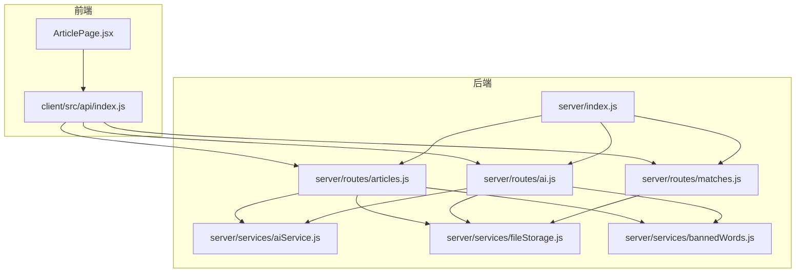
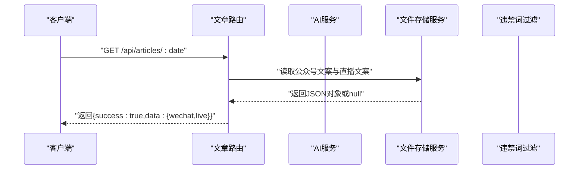
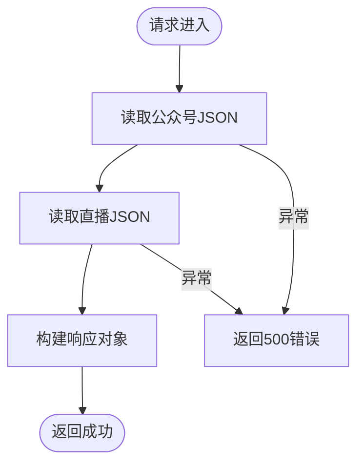
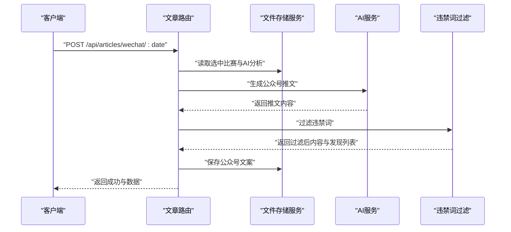
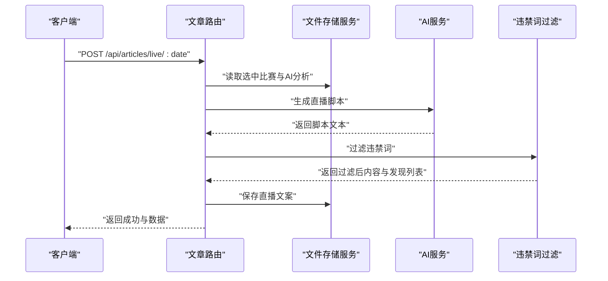
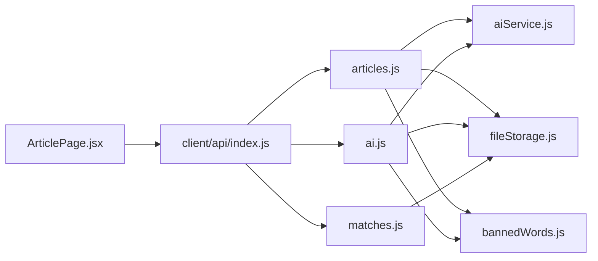

# 文章路由

<cite>
**本文引用的文件**
- [server/index.js](file://server/index.js)
- [server/routes/articles.js](file://server/routes/articles.js)
- [server/routes/ai.js](file://server/routes/ai.js)
- [server/routes/matches.js](file://server/routes/matches.js)
- [server/services/aiService.js](file://server/services/aiService.js)
- [server/services/fileStorage.js](file://server/services/fileStorage.js)
- [server/services/bannedWords.js](file://server/services/bannedWords.js)
- [client/src/pages/ArticlePage.jsx](file://client/src/pages/ArticlePage.jsx)
- [client/src/api/index.js](file://client/src/api/index.js)
- [PRD.md](file://PRD.md)
</cite>

## 目录
1. [简介](#简介)
2. [项目结构](#项目结构)
3. [核心组件](#核心组件)
4. [架构总览](#架构总览)
5. [详细组件分析](#详细组件分析)
6. [依赖关系分析](#依赖关系分析)
7. [性能考量](#性能考量)
8. [故障排查指南](#故障排查指南)
9. [结论](#结论)
10. [附录](#附录)

## 简介
本技术文档聚焦“文章路由”模块，围绕 GET /api/articles/:date 端点及其相关生成流程（公众号推文与直播文案），系统梳理从数据模型、模板系统、合规过滤到文件存储管理的完整实现。文档还提供 API 调用示例、内容生成算法要点、质量评估与用户体验优化策略，以及内容审核与风险控制措施，帮助开发者与运营人员快速理解与维护该模块。

## 项目结构
- 后端采用 Express 路由组织，文章路由位于 server/routes/articles.js，依赖 AI 服务与文件存储服务。
- 前端页面 ArticlePage.jsx 通过 client/src/api/index.js 发起请求，调用文章路由与 AI/匹配路由。
- PRD 文档提供了业务背景、数据模型与 API 设计的权威说明。

图表来源
- [server/index.js:1-49](file://server/index.js#L1-L49)
- [server/routes/articles.js:1-113](file://server/routes/articles.js#L1-L113)
- [server/routes/ai.js:1-102](file://server/routes/ai.js#L1-L102)
- [server/routes/matches.js:1-75](file://server/routes/matches.js#L1-L75)
- [server/services/aiService.js:1-212](file://server/services/aiService.js#L1-L212)
- [server/services/fileStorage.js:1-196](file://server/services/fileStorage.js#L1-L196)
- [server/services/bannedWords.js:1-114](file://server/services/bannedWords.js#L1-L114)
- [client/src/pages/ArticlePage.jsx:1-267](file://client/src/pages/ArticlePage.jsx#L1-L267)
- [client/src/api/index.js:1-50](file://client/src/api/index.js#L1-L50)

章节来源
- [server/index.js:1-49](file://server/index.js#L1-L49)
- [PRD.md:252-271](file://PRD.md#L252-L271)

## 核心组件
- 文章路由：负责公众号推文与直播文案的生成与聚合查询，统一调用 AI 服务与文件存储服务，并执行违禁词过滤。
- AI 服务：封装智谱 GLM-4 的调用，提供单场分析、公众号推文、直播脚本三种生成方法。
- 文件存储服务：提供按日期分层的本地文件系统存取，支持原始数据、重点比赛、AI 分析、公众号文案、直播文案的读写。
- 违禁词过滤：提供违禁词映射与过滤逻辑，确保文案合规。
- 前端页面与 API：ArticlePage.jsx 与 client/src/api/index.js 提供用户交互与请求封装。

章节来源
- [server/routes/articles.js:1-113](file://server/routes/articles.js#L1-L113)
- [server/services/aiService.js:1-212](file://server/services/aiService.js#L1-L212)
- [server/services/fileStorage.js:1-196](file://server/services/fileStorage.js#L1-L196)
- [server/services/bannedWords.js:1-114](file://server/services/bannedWords.js#L1-L114)
- [client/src/pages/ArticlePage.jsx:1-267](file://client/src/pages/ArticlePage.jsx#L1-L267)
- [client/src/api/index.js:1-50](file://client/src/api/index.js#L1-L50)

## 架构总览
文章路由模块遵循“路由层-服务层-存储层”的分层架构：
- 路由层：接收 HTTP 请求，解析参数与请求体，协调服务层。
- 服务层：AI 服务负责内容生成；违禁词过滤保证合规；文件存储服务负责持久化。
- 存储层：以日期为根目录，按功能模块子目录组织 JSON/Markdown 文件，便于人工审计与二次加工。

图表来源
- [server/routes/articles.js:95-110](file://server/routes/articles.js#L95-L110)
- [server/services/fileStorage.js:144-157](file://server/services/fileStorage.js#L144-L157)

## 详细组件分析

### GET /api/articles/:date 端点
- 功能：获取指定日期的公众号推文与直播文案聚合结果。
- 流程：
  - 从文件存储服务读取公众号文案与直播文案 JSON。
  - 将两者封装为 data 对象返回。
- 错误处理：捕获异常并返回 500 与错误信息。
- 响应结构：包含 success 与 data 字段，data 中包含 wechat 与 live 两个子字段。

图表来源
- [server/routes/articles.js:98-110](file://server/routes/articles.js#L98-L110)
- [server/services/fileStorage.js:144-157](file://server/services/fileStorage.js#L144-L157)

章节来源
- [server/routes/articles.js:95-110](file://server/routes/articles.js#L95-L110)
- [server/services/fileStorage.js:144-157](file://server/services/fileStorage.js#L144-L157)

### 公众号推文生成（POST /api/articles/wechat/:date）
- 输入：日期参数，依赖选中的重点比赛与 AI 分析。
- 热门比赛选择策略：
  - 优先取标记为 isHot 的比赛。
  - 若不足 2 场则取前 2 场。
  - 至少 1 场，否则返回错误。
- 内容生成：
  - 调用 AI 服务生成公众号推文。
  - 执行违禁词过滤，记录发现的违禁词。
  - 保存 Markdown 与 JSON。
- 输出：返回生成结果与 ban 检测信息。

图表来源
- [server/routes/articles.js:10-51](file://server/routes/articles.js#L10-L51)
- [server/services/aiService.js:70-135](file://server/services/aiService.js#L70-L135)
- [server/services/fileStorage.js:112-123](file://server/services/fileStorage.js#L112-L123)
- [server/services/bannedWords.js:70-96](file://server/services/bannedWords.js#L70-L96)

章节来源
- [server/routes/articles.js:10-51](file://server/routes/articles.js#L10-L51)
- [server/services/aiService.js:70-135](file://server/services/aiService.js#L70-L135)
- [server/services/fileStorage.js:112-123](file://server/services/fileStorage.js#L112-L123)
- [server/services/bannedWords.js:70-96](file://server/services/bannedWords.js#L70-L96)

### 直播文案生成（POST /api/articles/live/:date）
- 输入：日期参数，依赖选中的重点比赛与 AI 分析。
- 热门比赛选择策略：同上，至少 1 场。
- 内容生成：
  - 调用 AI 服务生成直播脚本。
  - 执行违禁词过滤，记录发现的违禁词。
  - 保存 Markdown 与 JSON。
- 输出：返回生成结果与 ban 检测信息。

图表来源
- [server/routes/articles.js:56-93](file://server/routes/articles.js#L56-L93)
- [server/services/aiService.js:140-205](file://server/services/aiService.js#L140-L205)
- [server/services/fileStorage.js:128-139](file://server/services/fileStorage.js#L128-L139)
- [server/services/bannedWords.js:70-96](file://server/services/bannedWords.js#L70-L96)

章节来源
- [server/routes/articles.js:56-93](file://server/routes/articles.js#L56-L93)
- [server/services/aiService.js:140-205](file://server/services/aiService.js#L140-L205)
- [server/services/fileStorage.js:128-139](file://server/services/fileStorage.js#L128-L139)
- [server/services/bannedWords.js:70-96](file://server/services/bannedWords.js#L70-L96)

### AI 服务与提示工程
- 单场分析：基于比赛基础信息与分析师预测生成约 200 字的分析文案，强调逻辑闭环与专业性。
- 公众号推文：围绕最热两场比赛，构造吸引人的开头、基本面分析、数据视角解读与明确结论，严格遵守违禁词替换表。
- 直播脚本：口语化、适合朗读，逐场分析，仅从基本面角度展开，逻辑与预期一致。
- 温度与令牌限制：通过温度与 max_tokens 控制创意与长度，兼顾质量与稳定性。

章节来源
- [server/services/aiService.js:18-65](file://server/services/aiService.js#L18-L65)
- [server/services/aiService.js:70-135](file://server/services/aiService.js#L70-L135)
- [server/services/aiService.js:140-205](file://server/services/aiService.js#L140-L205)

### 违禁词过滤与合规
- 违禁词映射：覆盖盘口、赔率、投注、博彩、赌博、让球等敏感词，提供替换词或删除策略。
- 过滤策略：按词长降序匹配，优先处理长词，清理多余空格与重复标点。
- 检测接口：提供检测与过滤双接口，便于在不同阶段使用。

章节来源
- [server/services/bannedWords.js:6-63](file://server/services/bannedWords.js#L6-L63)
- [server/services/bannedWords.js:70-96](file://server/services/bannedWords.js#L70-L96)
- [server/services/bannedWords.js:101-111](file://server/services/bannedWords.js#L101-L111)

### 文件存储与版本化
- 目录结构：以日期为根目录，按功能模块划分子目录，文件命名规范化。
- 存储策略：
  - 公众号文案：同时保存 Markdown 与 JSON，便于阅读与程序消费。
  - 直播文案：同样保存 Markdown 与 JSON。
  - AI 分析：单场 Markdown + 汇总 JSON，支持增量更新。
- 版本控制机制：通过文件名与目录层级体现版本与时间维度，便于回溯与审计。

章节来源
- [server/services/fileStorage.js:32-48](file://server/services/fileStorage.js#L32-L48)
- [server/services/fileStorage.js:53-69](file://server/services/fileStorage.js#L53-L69)
- [server/services/fileStorage.js:74-98](file://server/services/fileStorage.js#L74-L98)
- [server/services/fileStorage.js:112-139](file://server/services/fileStorage.js#L112-L139)
- [PRD.md:205-234](file://PRD.md#L205-L234)

### 数据模型与字段定义
- 选中比赛（selected.json）：包含 matchId、league、homeTeam、awayTeam、matchTime、oddsWin、oddsDraw、oddsLoss、handicapLine、handicapWin、handicapDraw、handicapLoss、prediction、confidence、analysisNote、isHot 等。
- AI 分析（match_*.md + all_analyses.json）：包含 matchId、content、createdAt、updatedAt 等。
- 文案（wechat_article.json / live_script.json）：包含 hotMatch/matches、content、createdAt、bannedWordsFound 等。

章节来源
- [PRD.md:35-50](file://PRD.md#L35-L50)
- [PRD.md:81-88](file://PRD.md#L81-L88)
- [PRD.md:96-107](file://PRD.md#L96-L107)
- [PRD.md:146-180](file://PRD.md#L146-L180)
- [PRD.md:181-202](file://PRD.md#L181-L202)

### API 调用示例
- 获取指定日期所有文案
  - 方法：GET
  - 路径：/api/articles/:date
  - 成功响应：包含 success 与 data 对象（wechat、live）
- 生成公众号推文
  - 方法：POST
  - 路径：/api/articles/wechat/:date
  - 成功响应：包含 success 与 data 对象（hotMatch、content、createdAt、bannedWordsFound）
- 生成直播文案
  - 方法：POST
  - 路径：/api/articles/live/:date
  - 成功响应：包含 success 与 data 对象（matches、content、createdAt、bannedWordsFound）

章节来源
- [client/src/api/index.js:45-49](file://client/src/api/index.js#L45-L49)
- [PRD.md:267-270](file://PRD.md#L267-L270)

### 内容生成算法与质量评估
- 算法要点：
  - 提示工程：明确结构、风格、字数与合规要求。
  - 温度与令牌：平衡创意与可控性。
  - 合规前置：违禁词过滤在生成后执行，确保输出符合平台规范。
- 质量评估标准：
  - 逻辑闭环：结论与前提一致。
  - 专业性：术语准确、表达清晰。
  - 合规性：违禁词清零或替换。
  - 可读性：公众号适合阅读、直播适合朗读。
- 用户体验优化：
  - 前端页面实时展示生成状态与违禁词检测结果。
  - 支持一键复制，减少二次编辑成本。
  - 热门比赛选择与 AI 分析前置，降低生成失败概率。

章节来源
- [server/services/aiService.js:18-65](file://server/services/aiService.js#L18-L65)
- [server/services/aiService.js:70-135](file://server/services/aiService.js#L70-L135)
- [server/services/aiService.js:140-205](file://server/services/aiService.js#L140-L205)
- [client/src/pages/ArticlePage.jsx:44-86](file://client/src/pages/ArticlePage.jsx#L44-L86)

### 内容审核流程与风险控制
- 审核流程：
  - 生成后立即执行违禁词过滤，记录发现的违禁词。
  - 前端展示过滤结果，供人工复核。
  - 重要文案建议二次校对，确保逻辑与事实一致。
- 风险控制：
  - API Key 环境变量保护。
  - 本地文件存储，避免外泄。
  - 严格的提示工程与合规词表，降低违规风险。
  - 前端状态提示与错误反馈，提升可用性。

章节来源
- [server/services/bannedWords.js:70-96](file://server/services/bannedWords.js#L70-L96)
- [server/services/aiService.js:8-13](file://server/services/aiService.js#L8-L13)
- [client/src/pages/ArticlePage.jsx:140-144](file://client/src/pages/ArticlePage.jsx#L140-L144)

## 依赖关系分析

图表来源
- [server/routes/articles.js:1-113](file://server/routes/articles.js#L1-L113)
- [server/routes/ai.js:1-102](file://server/routes/ai.js#L1-L102)
- [server/routes/matches.js:1-75](file://server/routes/matches.js#L1-L75)
- [server/services/aiService.js:1-212](file://server/services/aiService.js#L1-L212)
- [server/services/fileStorage.js:1-196](file://server/services/fileStorage.js#L1-L196)
- [server/services/bannedWords.js:1-114](file://server/services/bannedWords.js#L1-L114)
- [client/src/pages/ArticlePage.jsx:1-267](file://client/src/pages/ArticlePage.jsx#L1-L267)
- [client/src/api/index.js:1-50](file://client/src/api/index.js#L1-L50)

章节来源
- [server/routes/articles.js:1-113](file://server/routes/articles.js#L1-L113)
- [server/routes/ai.js:1-102](file://server/routes/ai.js#L1-L102)
- [server/routes/matches.js:1-75](file://server/routes/matches.js#L1-L75)
- [server/services/aiService.js:1-212](file://server/services/aiService.js#L1-L212)
- [server/services/fileStorage.js:1-196](file://server/services/fileStorage.js#L1-L196)
- [server/services/bannedWords.js:1-114](file://server/services/bannedWords.js#L1-L114)
- [client/src/pages/ArticlePage.jsx:1-267](file://client/src/pages/ArticlePage.jsx#L1-L267)
- [client/src/api/index.js:1-50](file://client/src/api/index.js#L1-L50)

## 性能考量
- 生成时延：AI 生成单场分析约 10 秒以内，公众号/直播文案生成受内容长度与平台限制，建议在前端显示加载状态。
- 存储开销：JSON/Markdown 文件体积较小，按日分目录，读写性能稳定。
- 并发与限流：当前实现未内置限流，建议在生产环境增加速率限制与重试策略。
- 缓存策略：可考虑在内存中缓存最近日期的文案，减少重复读取。

## 故障排查指南
- AI 服务不可用
  - 检查环境变量 ZHIPU_API_KEY 是否配置正确。
  - 确认网络可达与额度充足。
- 违禁词过滤异常
  - 检查过滤函数是否被正确调用，确认返回的 bannedWordsFound 是否为空。
- 文件存储异常
  - 检查 DATA_DIR 环境变量与目录权限。
  - 确认日期目录是否存在，文件是否可读写。
- 前端无法获取数据
  - 检查 CORS 设置与静态文件服务路径。
  - 确认日期参数格式与文件命名一致性。

章节来源
- [server/services/aiService.js:8-13](file://server/services/aiService.js#L8-L13)
- [server/services/bannedWords.js:70-96](file://server/services/bannedWords.js#L70-L96)
- [server/services/fileStorage.js:4-27](file://server/services/fileStorage.js#L4-L27)
- [server/index.js:14-19](file://server/index.js#L14-L19)

## 结论
文章路由模块通过清晰的分层设计与完善的合规流程，实现了从热门比赛筛选、AI 内容生成到文案落地与存储的完整链路。结合前端友好的交互与违禁词过滤机制，既提升了内容质量，也降低了合规风险。建议在生产环境中进一步完善限流、缓存与监控策略，持续优化生成质量与用户体验。

## 附录
- 相关 PRD 章节：数据存储设计、API 设计、文案生成要求等。
- 前端页面：ArticlePage.jsx 提供了完整的用户交互与状态反馈。

章节来源
- [PRD.md:205-234](file://PRD.md#L205-L234)
- [PRD.md:252-271](file://PRD.md#L252-L271)
- [PRD.md:136-202](file://PRD.md#L136-L202)
- [client/src/pages/ArticlePage.jsx:1-267](file://client/src/pages/ArticlePage.jsx#L1-L267)