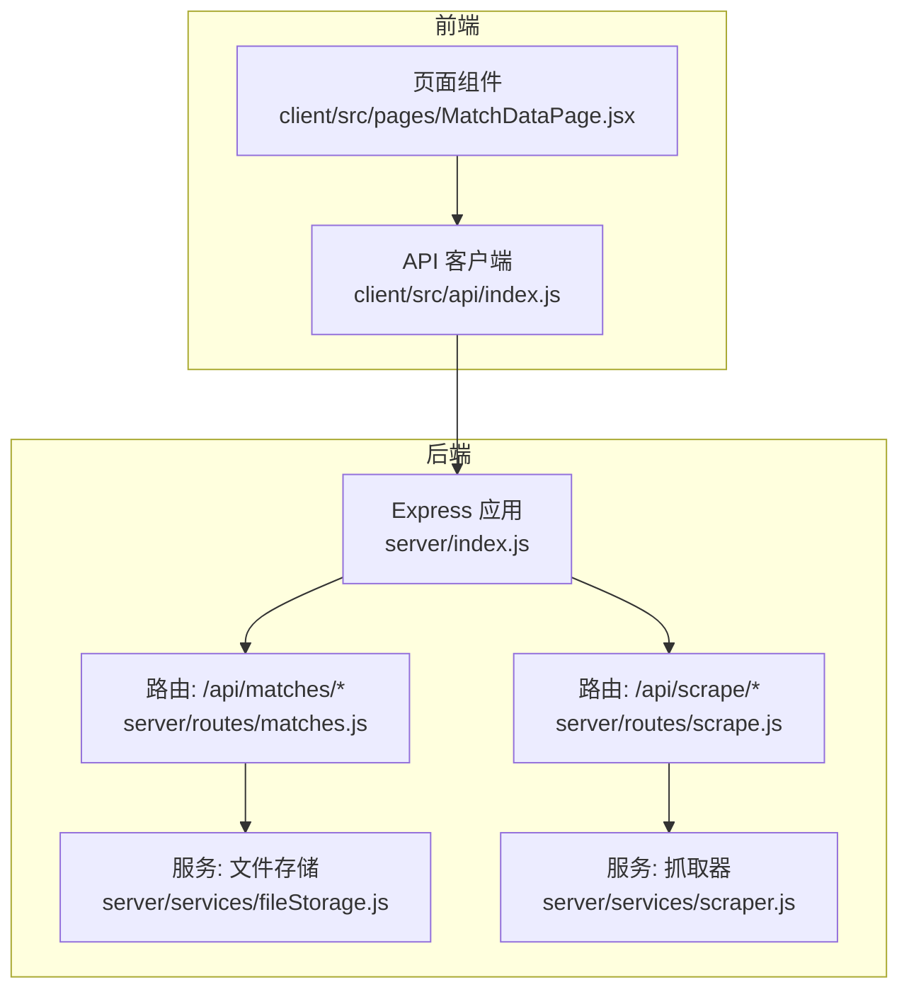
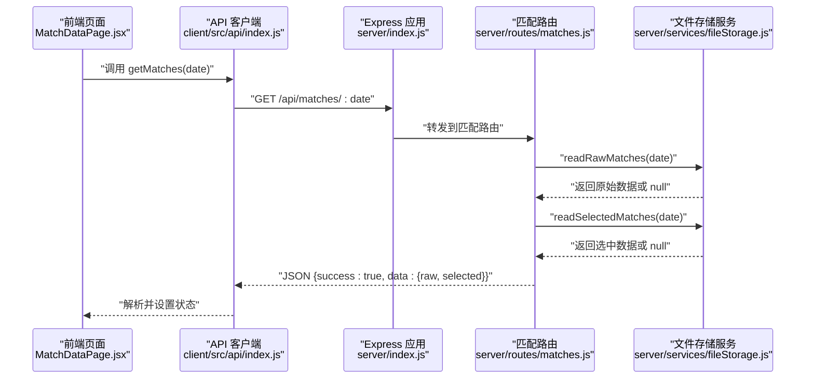
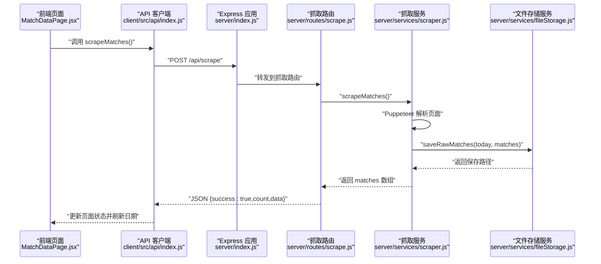
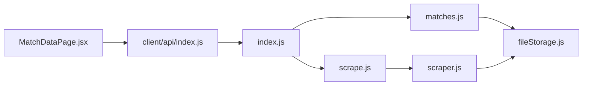

# 比赛数据路由

<cite>
**本文引用的文件**
- [server/index.js](file://server/index.js)
- [server/routes/matches.js](file://server/routes/matches.js)
- [server/services/fileStorage.js](file://server/services/fileStorage.js)
- [server/services/scraper.js](file://server/services/scraper.js)
- [server/routes/scrape.js](file://server/routes/scrape.js)
- [client/src/api/index.js](file://client/src/api/index.js)
- [client/src/pages/MatchDataPage.jsx](file://client/src/pages/MatchDataPage.jsx)
- [PRD.md](file://PRD.md)
- [package.json](file://package.json)
</cite>

## 目录
1. [简介](#简介)
2. [项目结构](#项目结构)
3. [核心组件](#核心组件)
4. [架构总览](#架构总览)
5. [详细组件分析](#详细组件分析)
6. [依赖关系分析](#依赖关系分析)
7. [性能考量](#性能考量)
8. [故障排查指南](#故障排查指南)
9. [结论](#结论)
10. [附录](#附录)

## 简介
本技术文档聚焦“比赛数据路由”模块，围绕 GET /api/matches/:date 及相关端点进行深入分析，涵盖：
- 日期参数校验与路径安全
- 文件系统数据读取与存储结构
- JSON 数据格式化与响应封装
- 缓存策略与并发访问控制现状
- 数据完整性检查与错误恢复
- 数据更新机制与抓取流程
- API 调用示例与前端集成
- 数据迁移与备份建议

## 项目结构
后端采用 Express 框架，路由集中在 server/routes，业务逻辑在 server/services，静态数据通过 /data 暴露给前端。

图表来源
- [server/index.js:1-49](file://server/index.js#L1-L49)
- [server/routes/matches.js:1-75](file://server/routes/matches.js#L1-L75)
- [server/routes/scrape.js:1-26](file://server/routes/scrape.js#L1-L26)
- [server/services/fileStorage.js:1-196](file://server/services/fileStorage.js#L1-L196)
- [server/services/scraper.js:1-295](file://server/services/scraper.js#L1-L295)
- [client/src/api/index.js:1-50](file://client/src/api/index.js#L1-L50)
- [client/src/pages/MatchDataPage.jsx:1-198](file://client/src/pages/MatchDataPage.jsx#L1-L198)

章节来源
- [server/index.js:1-49](file://server/index.js#L1-L49)
- [package.json:1-23](file://package.json#L1-L23)

## 核心组件
- 路由层：提供 /api/matches/dates、/api/matches/:date、/api/matches/:date/select、/api/matches/:date/predict/:matchId 等端点。
- 服务层：封装文件系统读写、目录结构管理、日期解析与可用日期枚举。
- 抓取服务：基于 Puppeteer 的无头浏览器抓取竞彩数据，保存为 JSON。
- 前端 API 客户端：统一请求封装与错误处理。
- 静态数据服务：通过 /data 暴露本地数据目录，便于直接下载与预览。

章节来源
- [server/routes/matches.js:1-75](file://server/routes/matches.js#L1-L75)
- [server/services/fileStorage.js:1-196](file://server/services/fileStorage.js#L1-L196)
- [server/services/scraper.js:1-295](file://server/services/scraper.js#L1-L295)
- [client/src/api/index.js:1-50](file://client/src/api/index.js#L1-L50)

## 架构总览
下面的序列图展示了 GET /api/matches/:date 的完整调用链路，从客户端到后端路由再到文件存储服务。

图表来源
- [client/src/pages/MatchDataPage.jsx:15-23](file://client/src/pages/MatchDataPage.jsx#L15-L23)
- [client/src/api/index.js:18-30](file://client/src/api/index.js#L18-L30)
- [server/index.js:21-25](file://server/index.js#L21-L25)
- [server/routes/matches.js:17-35](file://server/routes/matches.js#L17-L35)
- [server/services/fileStorage.js:41-69](file://server/services/fileStorage.js#L41-L69)

## 详细组件分析

### 路由与端点设计
- GET /api/matches/dates：列出所有有数据的日期，按日期降序排列。
- GET /api/matches/:date：读取指定日期的原始数据与选中数据，返回统一结构。
- PUT /api/matches/:date/select：保存选中的重点比赛集合。
- PUT /api/matches/:date/predict/:matchId：为某场比赛追加或更新预测信息。

这些端点均采用统一的响应结构 { success, data|error }，便于前端统一处理。

章节来源
- [server/routes/matches.js:5-75](file://server/routes/matches.js#L5-L75)

### 日期参数与路径安全
- 参数来源：req.params.date
- 路径拼接：基于 BASE_DIR/date 子目录
- 目录枚举：仅接受形如 YYYY-MM-DD 的目录名
- 读取策略：若文件不存在返回 null，调用方负责空值处理

注意：当前实现未对日期格式进行显式正则校验，仅依赖目录命名约束。建议在路由层增加格式校验，避免非法路径穿越风险。

章节来源
- [server/services/fileStorage.js:22-27](file://server/services/fileStorage.js#L22-L27)
- [server/services/fileStorage.js:160-168](file://server/services/fileStorage.js#L160-L168)
- [server/routes/matches.js:20-35](file://server/routes/matches.js#L20-L35)

### 文件系统数据读取与存储结构
- 存储根目录：可通过环境变量 DATA_DIR 指定，默认位于桌面 AutoMatch 目录
- 目录层级：按日期分目录，子目录包含“原始数据”“重点比赛”“AI分析”“公众号文案”“直播文案”
- 文件格式：
  - 原始数据：matches.json（数组）
  - 重点比赛：selected.json（数组，含预测字段）
  - AI分析：match_{id}_analysis.md（Markdown），all_analyses.json（汇总）
  - 文案：wechat_article.md / live_script.md 及对应 JSON

章节来源
- [server/services/fileStorage.js:4-48](file://server/services/fileStorage.js#L4-L48)
- [server/services/fileStorage.js:52-69](file://server/services/fileStorage.js#L52-L69)
- [server/services/fileStorage.js:73-98](file://server/services/fileStorage.js#L73-L98)
- [server/services/fileStorage.js:110-139](file://server/services/fileStorage.js#L110-L139)
- [PRD.md:205-234](file://PRD.md#L205-L234)

### JSON 数据格式化与响应封装
- 响应统一结构：{ success: boolean, data|error }
- GET /api/matches/:date 返回 { raw: [...], selected: [...] }
- 读取失败时返回 null，调用方需做空值保护
- 错误捕获：路由层 try/catch 包裹，异常转为 500 JSON

章节来源
- [server/routes/matches.js:8-15](file://server/routes/matches.js#L8-L15)
- [server/routes/matches.js:17-35](file://server/routes/matches.js#L17-L35)
- [server/routes/matches.js:37-72](file://server/routes/matches.js#L37-L72)

### 缓存策略与并发访问控制
- 现状：未实现应用层缓存；每次请求直接读取文件系统
- 并发：未见锁机制；多进程或多线程并发写入同一文件存在覆盖风险
- 建议：
  - 对读取频繁的数据（如原始数据）引入内存缓存与失效策略
  - 对写入操作（保存选中比赛、AI分析、文案）采用互斥锁或原子写入
  - 使用 etag 或 Last-Modified 实现条件请求，减少重复传输

章节来源
- [server/services/fileStorage.js:32-39](file://server/services/fileStorage.js#L32-L39)
- [server/services/fileStorage.js:53-60](file://server/services/fileStorage.js#L53-L60)
- [server/services/fileStorage.js:74-98](file://server/services/fileStorage.js#L74-L98)

### 数据完整性检查
- 目录命名：仅接受 YYYY-MM-DD
- 文件存在性：读取前检查文件是否存在，不存在返回 null
- JSON 解析：读取失败抛出异常，路由层捕获并返回错误
- 建议增强：
  - 对 JSON Schema 校验（原始数据、选中数据、AI分析）
  - 对关键字段（matchId、league、homeTeam、awayTeam、oddsWin 等）进行必填与类型校验
  - 对预测字段（prediction、confidence、analysisNote、isHot）进行范围与格式校验

章节来源
- [server/services/fileStorage.js:160-168](file://server/services/fileStorage.js#L160-L168)
- [server/services/fileStorage.js:41-48](file://server/services/fileStorage.js#L41-L48)
- [server/services/fileStorage.js:62-69](file://server/services/fileStorage.js#L62-L69)

### 数据更新机制与抓取流程
- 触发入口：POST /api/scrape
- 抓取实现：Puppeteer 访问竞彩页面，解析表格数据，补充唯一 ID 和时间戳
- 保存策略：当日日期作为目录，写入 matches.json
- 前端联动：抓取成功后刷新日期列表并加载最新数据

图表来源
- [client/src/pages/MatchDataPage.jsx:25-38](file://client/src/pages/MatchDataPage.jsx#L25-L38)
- [client/src/api/index.js:15-17](file://client/src/api/index.js#L15-L17)
- [server/index.js:21-25](file://server/index.js#L21-L25)
- [server/routes/scrape.js:5-23](file://server/routes/scrape.js#L5-L23)
- [server/services/scraper.js:22-214](file://server/services/scraper.js#L22-L214)
- [server/services/fileStorage.js:32-39](file://server/services/fileStorage.js#L32-L39)

章节来源
- [server/routes/scrape.js:5-23](file://server/routes/scrape.js#L5-L23)
- [server/services/scraper.js:22-214](file://server/services/scraper.js#L22-L214)
- [server/services/fileStorage.js:32-39](file://server/services/fileStorage.js#L32-L39)

### API 调用示例与前端集成
- 获取可用日期：GET /api/matches/dates
- 获取指定日期数据：GET /api/matches/{date}
- 保存选中比赛：PUT /api/matches/{date}/select
- 保存单场预测：PUT /api/matches/{date}/predict/{matchId}

前端通过 client/src/api/index.js 统一封装请求，统一处理 success/error 字段与错误抛出。

章节来源
- [client/src/api/index.js:18-30](file://client/src/api/index.js#L18-L30)
- [client/src/pages/MatchDataPage.jsx:15-23](file://client/src/pages/MatchDataPage.jsx#L15-L23)

### 数据迁移与备份方案
- 目录迁移：将 DATA_DIR 指向新的存储位置，重启服务后即可生效
- 备份建议：
  - 定期打包 AutoMatch 根目录
  - 对关键 JSON 文件进行校验和校验
  - 使用版本化命名（如 .bak）保留历史快照
- 恢复流程：停止服务 -> 恢复目录结构 -> 启动服务 -> 验证数据完整性

章节来源
- [server/services/fileStorage.js:4](file://server/services/fileStorage.js#L4)
- [PRD.md:205-234](file://PRD.md#L205-L234)

## 依赖关系分析

图表来源
- [server/routes/matches.js:1-75](file://server/routes/matches.js#L1-L75)
- [server/services/fileStorage.js:1-196](file://server/services/fileStorage.js#L1-L196)
- [server/routes/scrape.js:1-26](file://server/routes/scrape.js#L1-L26)
- [server/services/scraper.js:1-295](file://server/services/scraper.js#L1-L295)
- [server/index.js:1-49](file://server/index.js#L1-L49)
- [client/src/api/index.js:1-50](file://client/src/api/index.js#L1-L50)
- [client/src/pages/MatchDataPage.jsx:1-198](file://client/src/pages/MatchDataPage.jsx#L1-L198)

章节来源
- [server/index.js:6-25](file://server/index.js#L6-L25)
- [package.json:15-22](file://package.json#L15-L22)

## 性能考量
- I/O 密集：文件读写为主，建议：
  - 对热点数据引入 LRU 缓存
  - 批量读取与合并请求，减少多次 I/O
  - 合理设置 Node.js 的文件句柄上限与并发限制
- 抓取性能：Puppeteer 启动成本较高，建议：
  - 复用浏览器实例（当前实现每次抓取新建实例）
  - 限流与重试策略，避免目标站点限流
- 前端渲染：表格数据量大时建议虚拟滚动与分页

## 故障排查指南
- 500 错误：路由层捕获异常并返回 { success: false, error }，检查服务日志
- 404/空数据：确认日期目录存在且文件存在；检查 DATA_DIR 环境变量
- CORS 问题：确认已启用 cors 中间件
- 静态文件无法访问：确认 /data 静态目录映射正确

章节来源
- [server/routes/matches.js:12-14](file://server/routes/matches.js#L12-L14)
- [server/routes/matches.js:33-34](file://server/routes/matches.js#L33-L34)
- [server/index.js:14-19](file://server/index.js#L14-L19)

## 结论
比赛数据路由模块以简洁的文件系统为核心，实现了从抓取、存储到读取的完整闭环。当前实现具备良好的可维护性与扩展性，但在缓存、并发控制与数据校验方面仍有优化空间。建议逐步引入缓存与锁机制，完善 JSON Schema 校验与错误恢复策略，以提升稳定性与性能。

## 附录

### API 定义概览
- GET /api/matches/dates：返回可用日期列表
- GET /api/matches/:date：返回 { raw, selected }
- PUT /api/matches/:date/select：保存选中比赛
- PUT /api/matches/:date/predict/:matchId：保存单场预测

章节来源
- [PRD.md:252-271](file://PRD.md#L252-L271)
- [server/routes/matches.js:5-75](file://server/routes/matches.js#L5-L75)