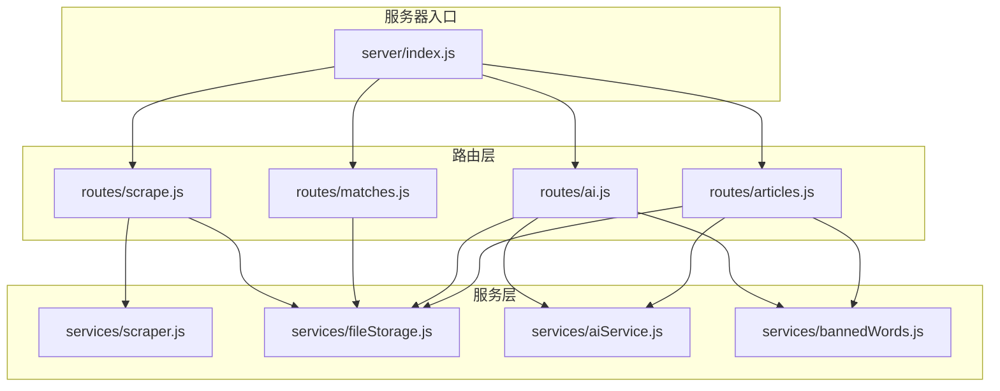
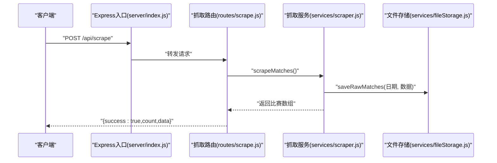
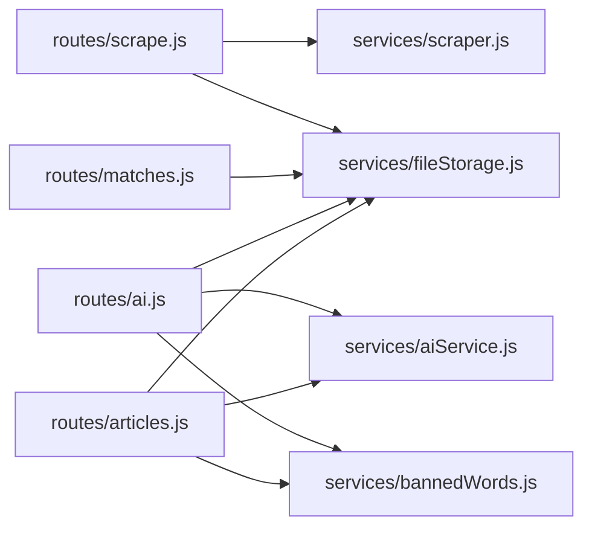

# 路由模块

<cite>
**本文引用的文件**
- [server/index.js](file://server/index.js)
- [server/routes/scrape.js](file://server/routes/scrape.js)
- [server/routes/matches.js](file://server/routes/matches.js)
- [server/routes/ai.js](file://server/routes/ai.js)
- [server/routes/articles.js](file://server/routes/articles.js)
- [server/services/scraper.js](file://server/services/scraper.js)
- [server/services/aiService.js](file://server/services/aiService.js)
- [server/services/fileStorage.js](file://server/services/fileStorage.js)
- [server/services/bannedWords.js](file://server/services/bannedWords.js)
- [PRD.md](file://PRD.md)
</cite>

## 目录
1. [简介](#简介)
2. [项目结构](#项目结构)
3. [核心组件](#核心组件)
4. [架构总览](#架构总览)
5. [详细组件分析](#详细组件分析)
6. [依赖关系分析](#依赖关系分析)
7. [性能考量](#性能考量)
8. [故障排查指南](#故障排查指南)
9. [结论](#结论)
10. [附录](#附录)

## 简介
本文件为 AutoMatch 的路由模块技术文档，聚焦于四个核心路由模块：数据抓取路由、比赛数据路由、AI分析路由、文章路由。文档将详细说明每个路由模块的职责、参数处理、请求校验、响应格式、错误处理策略与状态码、以及典型使用场景与调用示例。同时给出架构图、序列图与流程图，帮助开发者与使用者快速理解与使用。

## 项目结构
后端采用 Express 框架，路由集中在 server/routes 下，业务逻辑分布在 server/services 中；server/index.js 负责注册中间件与路由挂载，并提供静态文件服务与健康检查接口。

图表来源
- [server/index.js:1-49](file://server/index.js#L1-L49)
- [server/routes/scrape.js:1-26](file://server/routes/scrape.js#L1-L26)
- [server/routes/matches.js:1-75](file://server/routes/matches.js#L1-L75)
- [server/routes/ai.js:1-102](file://server/routes/ai.js#L1-L102)
- [server/routes/articles.js:1-113](file://server/routes/articles.js#L1-L113)
- [server/services/scraper.js:1-295](file://server/services/scraper.js#L1-L295)
- [server/services/fileStorage.js:1-196](file://server/services/fileStorage.js#L1-L196)
- [server/services/aiService.js:1-212](file://server/services/aiService.js#L1-L212)
- [server/services/bannedWords.js:1-114](file://server/services/bannedWords.js#L1-L114)

章节来源
- [server/index.js:1-49](file://server/index.js#L1-L49)

## 核心组件
- 数据抓取路由：负责触发从500彩票网抓取竞彩足球数据，返回成功计数与数据列表。
- 比赛数据路由：提供日期列表查询、指定日期原始与选中数据读取、选中比赛保存、单场预测更新。
- AI分析路由：支持单场与批量AI分析生成，读取与更新AI分析内容。
- 文章路由：基于选中与AI分析生成公众号推文与直播脚本，读取指定日期所有文案。

章节来源
- [server/routes/scrape.js:1-26](file://server/routes/scrape.js#L1-L26)
- [server/routes/matches.js:1-75](file://server/routes/matches.js#L1-L75)
- [server/routes/ai.js:1-102](file://server/routes/ai.js#L1-L102)
- [server/routes/articles.js:1-113](file://server/routes/articles.js#L1-L113)

## 架构总览
路由层通过 Express Router 定义 REST 接口，调用服务层完成业务处理。服务层与文件系统交互，实现数据持久化与读取；AI服务通过智谱AI SDK生成分析内容；违禁词过滤模块保障文案合规。

图表来源
- [server/index.js:21-25](file://server/index.js#L21-L25)
- [server/routes/scrape.js:8-23](file://server/routes/scrape.js#L8-L23)
- [server/services/scraper.js:22-214](file://server/services/scraper.js#L22-L214)
- [server/services/fileStorage.js:32-39](file://server/services/fileStorage.js#L32-L39)

## 详细组件分析

### 数据抓取路由 (/api/scrape)
- 职责：触发从500彩票网抓取竞彩足球数据，保存原始数据并返回抓取结果。
- 请求方式与URL：POST /api/scrape
- 请求体：无
- 响应结构：
  - 成功：{ success: true, count: 数量, data: 比赛数组 }
  - 失败：{ success: false, error: 错误消息 }
- 参数处理与校验：无参数
- 错误处理与状态码：
  - 500：抓取异常时返回错误信息
- 使用场景：
  - 每日定时或手动触发抓取
  - 前端“一键抓取”按钮调用
- 实际调用示例（curl）：
  - curl -X POST http://localhost:3001/api/scrape

章节来源
- [server/routes/scrape.js:5-23](file://server/routes/scrape.js#L5-L23)
- [server/services/scraper.js:22-214](file://server/services/scraper.js#L22-L214)
- [server/services/fileStorage.js:32-39](file://server/services/fileStorage.js#L32-L39)

### 比赛数据路由 (/api/matches)
- 职责：提供日期列表、指定日期原始与选中数据读取、保存选中比赛、保存单场预测。
- 请求方式与URL：
  - GET /api/matches/dates
  - GET /api/matches/:date
  - PUT /api/matches/:date/select
  - PUT /api/matches/:date/predict/:matchId
- 请求参数：
  - 路径参数：
    - :date（YYYY-MM-DD）
    - :matchId（比赛ID）
  - 请求体（PUT /select）：{ selectedMatches: 数组 }
  - 请求体（PUT /predict/:matchId）：任意对象（如 prediction、confidence、analysisNote、isHot 等）
- 响应结构：
  - GET /dates：{ success: true, data: 日期数组 }
  - GET /:date：{ success: true, data: { raw: 数组, selected: 数组 } }
  - PUT /:date/select：{ success: true }
  - PUT /:date/predict/:matchId：{ success: true }
  - 失败：{ success: false, error: 错误消息 }
- 错误处理与状态码：
  - 500：文件读写或业务异常
- 使用场景：
  - 展示可用日期
  - 加载某日原始与选中数据
  - 保存分析师选中的重点比赛
  - 为单场比赛补充预测与分析笔记
- 实际调用示例（curl）：
  - curl http://localhost:3001/api/matches/dates
  - curl http://localhost:3001/api/matches/2026-04-16
  - curl -X PUT -H "Content-Type: application/json" --data '{"selectedMatches":[...]}' http://localhost:3001/api/matches/2026-04-16/select
  - curl -X PUT -H "Content-Type: application/json" --data '{"prediction":"主胜","confidence":5,"analysisNote":"基本面优势明显"}' http://localhost:3001/api/matches/2026-04-16/predict/周日001

章节来源
- [server/routes/matches.js:5-72](file://server/routes/matches.js#L5-L72)
- [server/services/fileStorage.js:44-69](file://server/services/fileStorage.js#L44-L69)

### AI分析路由 (/api/ai)
- 职责：生成单场与批量AI分析，读取与更新AI分析内容。
- 请求方式与URL：
  - POST /api/ai/analyze/:date/:matchId
  - POST /api/ai/analyze/:date/batch
  - GET /api/ai/analyses/:date
  - PUT /api/ai/analyses/:date/:matchId
- 请求参数：
  - 路径参数：:date（YYYY-MM-DD）、:matchId（比赛ID）
  - 请求体（POST /batch）：无
  - 请求体（PUT /analyses/:date/:matchId）：{ content: 文案内容 }
- 响应结构：
  - POST /analyze/:date/:matchId：{ success: true, data: 分析对象 }
  - POST /analyze/:date/batch：{ success: true, data: 数组（每项含 matchId 或 error） }
  - GET /analyses/:date：{ success: true, data: 分析数组 }
  - PUT /analyses/:date/:matchId：{ success: true }
  - 失败：{ success: false, error: 错误消息 }
- 错误处理与状态码：
  - 404：未找到指定比赛
  - 400：批量分析时无选中比赛
  - 500：AI生成或文件保存异常
- 使用场景：
  - 为单场比赛生成AI分析
  - 批量生成多场比赛分析
  - 读取某日所有AI分析
  - 更新AI分析内容
- 实际调用示例（curl）：
  - curl -X POST http://localhost:3001/api/ai/analyze/2026-04-16/周日001
  - curl -X POST http://localhost:3001/api/ai/analyze/2026-04-16/batch
  - curl http://localhost:3001/api/ai/analyses/2026-04-16
  - curl -X PUT -H "Content-Type: application/json" --data '{"content":"更新后的分析内容"}' http://localhost:3001/api/ai/analyses/2026-04-16/周日001

章节来源
- [server/routes/ai.js:7-99](file://server/routes/ai.js#L7-L99)
- [server/services/aiService.js:18-65](file://server/services/aiService.js#L18-L65)
- [server/services/fileStorage.js:74-107](file://server/services/fileStorage.js#L74-L107)
- [server/services/bannedWords.js:70-96](file://server/services/bannedWords.js#L70-L96)

### 文章路由 (/api/articles)
- 职责：基于选中与AI分析生成公众号推文与直播脚本，读取指定日期所有文案。
- 请求方式与URL：
  - POST /api/articles/wechat/:date
  - POST /api/articles/live/:date
  - GET /api/articles/:date
- 请求参数：
  - 路径参数：:date（YYYY-MM-DD）
  - 请求体：无
- 响应结构：
  - POST /wechat/:date：{ success: true, data: 公众号文章对象 }
  - POST /live/:date：{ success: true, data: 直播脚本对象 }
  - GET /articles/:date：{ success: true, data: { wechat: 对象, live: 对象 } }
  - 失败：{ success: false, error: 错误消息 }
- 错误处理与状态码：
  - 400：无热门比赛或无选中比赛
  - 500：AI生成或文件保存异常
- 使用场景：
  - 生成公众号推文（默认取2场热门）
  - 生成直播脚本（可包含多场热门）
  - 读取某日所有文案
- 实际调用示例（curl）：
  - curl -X POST http://localhost:3001/api/articles/wechat/2026-04-16
  - curl -X POST http://localhost:3001/api/articles/live/2026-04-16
  - curl http://localhost:3001/api/articles/2026-04-16

章节来源
- [server/routes/articles.js:7-110](file://server/routes/articles.js#L7-L110)
- [server/services/aiService.js:70-135](file://server/services/aiService.js#L70-L135)
- [server/services/aiService.js:140-204](file://server/services/aiService.js#L140-L204)
- [server/services/fileStorage.js:112-157](file://server/services/fileStorage.js#L112-L157)
- [server/services/bannedWords.js:70-96](file://server/services/bannedWords.js#L70-L96)

## 依赖关系分析
- 路由到服务的依赖：
  - /api/scrape → scraper.scrapeMatches → fileStorage.saveRawMatches
  - /api/matches/* → fileStorage.readRawMatches/readSelectedMatches/saveSelectedMatches/readAnalyses/saveAnalysis
  - /api/ai/* → aiService.generateMatchAnalysis/generateWechatArticle/generateLiveScript → fileStorage.saveAnalysis/saveWechatArticle/saveLiveScript → bannedWords.filterBannedWords
  - /api/articles/* → aiService.generateWechatArticle/generateLiveScript → fileStorage.readSelectedMatches/readAnalyses/saveWechatArticle/saveLiveScript → bannedWords.filterBannedWords
- 外部依赖：
  - Puppeteer（无头浏览器）用于数据抓取
  - 智谱AI SDK 用于AI分析与文案生成
  - 本地文件系统用于数据持久化

图表来源
- [server/routes/scrape.js:3](file://server/routes/scrape.js#L3)
- [server/routes/matches.js:3](file://server/routes/matches.js#L3)
- [server/routes/ai.js:3-5](file://server/routes/ai.js#L3-L5)
- [server/routes/articles.js:3-5](file://server/routes/articles.js#L3-L5)
- [server/services/scraper.js:1](file://server/services/scraper.js#L1)
- [server/services/aiService.js:1](file://server/services/aiService.js#L1)
- [server/services/fileStorage.js:1](file://server/services/fileStorage.js#L1)
- [server/services/bannedWords.js:1](file://server/services/bannedWords.js#L1)

## 性能考量
- 抓取性能：Puppeteer 启动与页面渲染耗时较长，建议在业务空闲时段执行或限制并发。
- AI生成：单场分析与批量分析均受网络与模型响应影响，建议异步处理并在前端轮询结果。
- 文件IO：大量小文件读写可能成为瓶颈，建议定期归档与合并分析汇总文件。
- CORS与静态资源：已启用CORS与静态文件服务，注意生产环境的安全配置。

## 故障排查指南
- 抓取失败（500）：
  - 检查浏览器路径与网络连接
  - 确认页面结构变化导致的选择器失效
- AI生成失败（500）：
  - 检查智谱API Key配置
  - 确认网络可达与模型可用
- 违禁词过滤问题：
  - 检查过滤映射表是否覆盖所需词汇
  - 确认文案是否符合平台规范
- 文件读写失败（500）：
  - 检查 DATA_DIR 权限与磁盘空间
  - 确认日期目录结构是否存在

章节来源
- [server/routes/scrape.js:16-22](file://server/routes/scrape.js#L16-L22)
- [server/routes/ai.js:30-33](file://server/routes/ai.js#L30-L33)
- [server/routes/articles.js:47-50](file://server/routes/articles.js#L47-L50)
- [server/services/aiService.js:9-13](file://server/services/aiService.js#L9-L13)
- [server/services/fileStorage.js:162-168](file://server/services/fileStorage.js#L162-L168)

## 结论
路由模块围绕“数据抓取—选场—AI分析—文案生成”的完整链路构建，具备清晰的职责划分与稳健的错误处理机制。通过服务层抽象与文件系统持久化，实现了本地化的自动化分析流水线。建议在生产环境中完善异步任务调度、缓存策略与监控告警，以提升稳定性与可观测性。

## 附录

### API定义与使用示例

- 数据抓取
  - POST /api/scrape
  - 请求：无
  - 响应：{ success: true, count: 数量, data: 比赛数组 }
  - 示例：curl -X POST http://localhost:3001/api/scrape

- 比赛数据
  - GET /api/matches/dates
  - 响应：{ success: true, data: 日期数组 }
  - GET /api/matches/:date
  - 响应：{ success: true, data: { raw: 数组, selected: 数组 } }
  - PUT /api/matches/:date/select
  - 请求体：{ selectedMatches: 数组 }
  - PUT /api/matches/:date/predict/:matchId
  - 请求体：{ prediction, confidence, analysisNote, isHot, ... }

- AI分析
  - POST /api/ai/analyze/:date/:matchId
  - 响应：{ success: true, data: 分析对象 }
  - POST /api/ai/analyze/:date/batch
  - 响应：{ success: true, data: 数组 }
  - GET /api/ai/analyses/:date
  - 响应：{ success: true, data: 分析数组 }
  - PUT /api/ai/analyses/:date/:matchId
  - 请求体：{ content }

- 文章
  - POST /api/articles/wechat/:date
  - 响应：{ success: true, data: 公众号文章对象 }
  - POST /api/articles/live/:date
  - 响应：{ success: true, data: 直播脚本对象 }
  - GET /api/articles/:date
  - 响应：{ success: true, data: { wechat, live } }

章节来源
- [PRD.md:252-271](file://PRD.md#L252-L271)