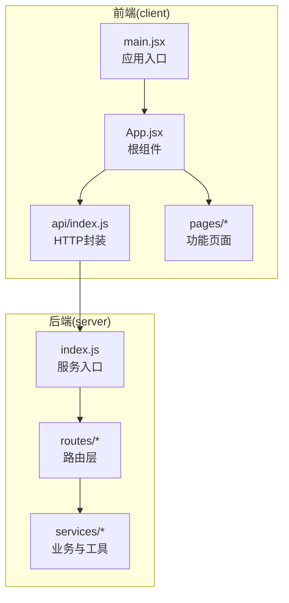
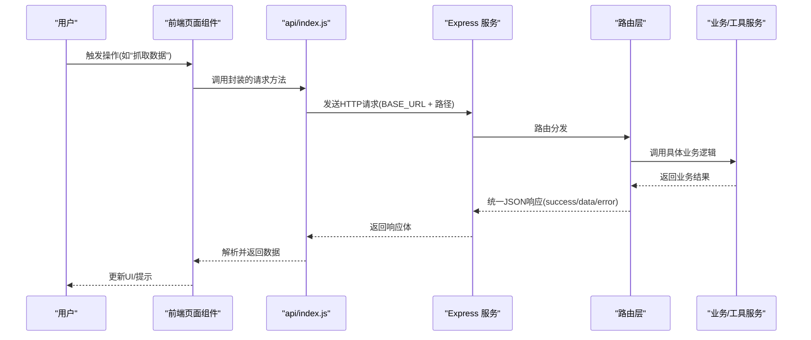
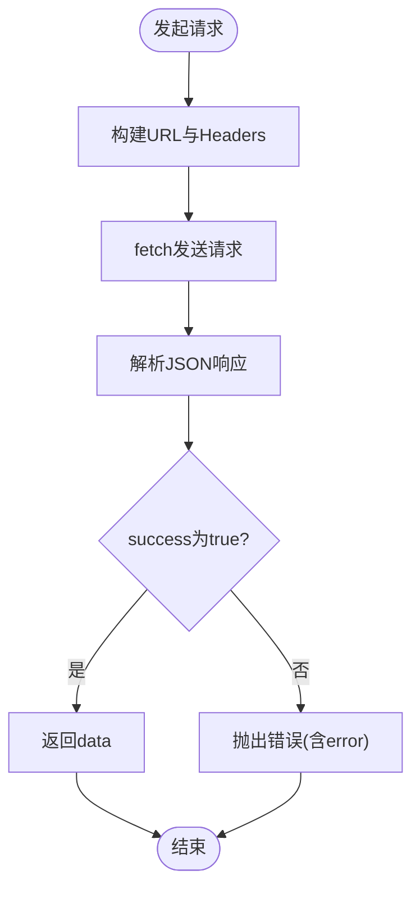
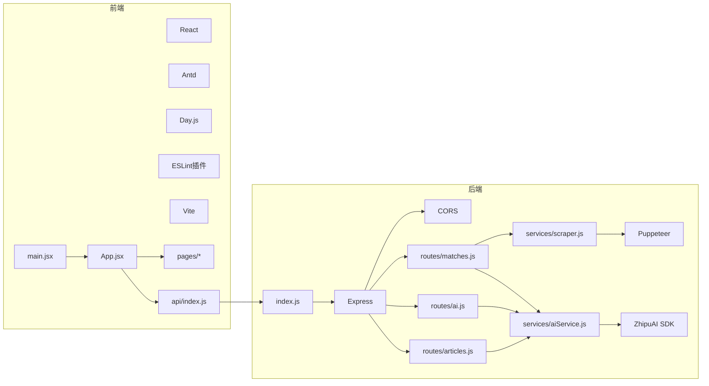

# 代码规范

<cite>
**本文引用的文件**
- [client/eslint.config.js](file://client/eslint.config.js)
- [client/package.json](file://client/package.json)
- [client/src/main.jsx](file://client/src/main.jsx)
- [client/src/App.jsx](file://client/src/App.jsx)
- [client/src/api/index.js](file://client/src/api/index.js)
- [client/src/pages/MatchDataPage.jsx](file://client/src/pages/MatchDataPage.jsx)
- [client/src/pages/PredictPage.jsx](file://client/src/pages/PredictPage.jsx)
- [client/src/pages/AIAnalysisPage.jsx](file://client/src/pages/AIAnalysisPage.jsx)
- [client/src/pages/ArticlePage.jsx](file://client/src/pages/ArticlePage.jsx)
- [server/index.js](file://server/index.js)
- [server/routes/matches.js](file://server/routes/matches.js)
- [server/routes/ai.js](file://server/routes/ai.js)
- [server/routes/articles.js](file://server/routes/articles.js)
- [server/services/aiService.js](file://server/services/aiService.js)
- [server/services/scraper.js](file://server/services/scraper.js)
</cite>

## 目录
1. [简介](#简介)
2. [项目结构](#项目结构)
3. [核心组件](#核心组件)
4. [架构总览](#架构总览)
5. [详细组件分析](#详细组件分析)
6. [依赖关系分析](#依赖关系分析)
7. [性能考量](#性能考量)
8. [故障排查指南](#故障排查指南)
9. [结论](#结论)
10. [附录](#附录)

## 简介
本文件为 AutoMatch 项目的代码规范文档，覆盖前端 JavaScript/JSX 编码标准、React 组件开发规范、API 设计规范、注释与命名约定、文件组织规范，并结合现有代码库提供正反例对比与改进建议，帮助团队统一风格、提升可维护性与协作效率。

## 项目结构
AutoMatch 采用前后端分离架构：
- 前端（React + Vite）位于 client 目录，负责用户界面与交互。
- 后端（Express）位于 server 目录，提供 RESTful API、静态资源服务与业务逻辑。

图表来源
- [client/src/main.jsx:1-11](file://client/src/main.jsx#L1-L11)
- [client/src/App.jsx:1-117](file://client/src/App.jsx#L1-L117)
- [client/src/api/index.js:1-50](file://client/src/api/index.js#L1-L50)
- [server/index.js:1-49](file://server/index.js#L1-L49)

章节来源
- [client/src/main.jsx:1-11](file://client/src/main.jsx#L1-L11)
- [client/src/App.jsx:1-117](file://client/src/App.jsx#L1-L117)
- [server/index.js:1-49](file://server/index.js#L1-L49)

## 核心组件
- ESLint 配置：基于官方推荐规则，启用 React Hooks 与 React Refresh 插件，支持 .jsx 文件，设置全局变量与语法特性。
- 包管理与脚本：定义 dev/build/preview/lint 等常用脚本，便于本地开发与质量保障。
- 应用入口：严格模式包裹根组件，挂载到 DOM。
- 根组件：集中管理侧边栏导航、顶部标题与日期选择，按菜单切换渲染不同页面。
- API 封装：统一请求方法、基础路径与错误处理，返回标准化结构。

章节来源
- [client/eslint.config.js:1-30](file://client/eslint.config.js#L1-L30)
- [client/package.json:1-31](file://client/package.json#L1-L31)
- [client/src/main.jsx:1-11](file://client/src/main.jsx#L1-L11)
- [client/src/App.jsx:1-117](file://client/src/App.jsx#L1-L117)
- [client/src/api/index.js:1-50](file://client/src/api/index.js#L1-L50)

## 架构总览
前端通过统一的请求封装调用后端 API；后端路由根据资源路径分发到对应服务模块，服务层负责业务处理与数据持久化。

图表来源
- [client/src/api/index.js:1-50](file://client/src/api/index.js#L1-L50)
- [server/index.js:1-49](file://server/index.js#L1-L49)
- [server/routes/matches.js:1-75](file://server/routes/matches.js#L1-L75)
- [server/routes/ai.js:1-102](file://server/routes/ai.js#L1-L102)
- [server/routes/articles.js:1-113](file://server/routes/articles.js#L1-L113)
- [server/services/aiService.js:1-212](file://server/services/aiService.js#L1-L212)
- [server/services/scraper.js:1-295](file://server/services/scraper.js#L1-L295)

## 详细组件分析

### ESLint 与代码质量
- 推荐规则：基于官方推荐规则集，启用 hooks 与 refresh 插件，确保 Hooks 使用正确与热更新稳定。
- 语言选项：启用 JSX 语法与最新 ECMAScript 特性，设置浏览器全局变量。
- 规则建议：可考虑增加 no-console、prefer-const、import/order 等规则以提升一致性与可读性。

章节来源
- [client/eslint.config.js:1-30](file://client/eslint.config.js#L1-L30)
- [client/package.json:19-29](file://client/package.json#L19-L29)

### React 组件开发规范
- 函数组件优先：所有页面组件均采用函数组件与 Hooks。
- 状态管理：
  - 使用 useState 管理本地 UI 状态（如日期、选中项、加载状态）。
  - 使用 useEffect 管理副作用（如首次加载与依赖变更时的数据拉取）。
- Props 传递：父组件通过 props 下发日期与回调，子组件仅消费与触发事件。
- 错误处理：统一 try/catch 包裹异步流程，避免未捕获异常导致崩溃。
- 渲染优化：合理拆分列配置与渲染逻辑，减少不必要的重渲染。
- 表单与弹窗：使用表单组件与模态框，配合校验与受控字段。

章节来源
- [client/src/App.jsx:1-117](file://client/src/App.jsx#L1-L117)
- [client/src/pages/MatchDataPage.jsx:1-198](file://client/src/pages/MatchDataPage.jsx#L1-L198)
- [client/src/pages/PredictPage.jsx:1-322](file://client/src/pages/PredictPage.jsx#L1-L322)
- [client/src/pages/AIAnalysisPage.jsx:1-203](file://client/src/pages/AIAnalysisPage.jsx#L1-L203)
- [client/src/pages/ArticlePage.jsx:1-267](file://client/src/pages/ArticlePage.jsx#L1-L267)

### API 设计规范
- 路由分层：按资源划分路由，清晰表达 RESTful 资源与动作。
- 响应格式：统一返回 { success, data?, error? } 结构，便于前端统一处理。
- 错误处理：服务端捕获异常并返回 500；对业务错误返回 4xx 并携带错误信息。
- 请求封装：前端统一请求方法，自动拼接基础路径与 JSON 头部，失败时抛出错误。

图表来源
- [client/src/api/index.js:1-50](file://client/src/api/index.js#L1-L50)
- [server/routes/matches.js:1-75](file://server/routes/matches.js#L1-L75)
- [server/routes/ai.js:1-102](file://server/routes/ai.js#L1-L102)
- [server/routes/articles.js:1-113](file://server/routes/articles.js#L1-L113)

章节来源
- [client/src/api/index.js:1-50](file://client/src/api/index.js#L1-L50)
- [server/routes/matches.js:1-75](file://server/routes/matches.js#L1-L75)
- [server/routes/ai.js:1-102](file://server/routes/ai.js#L1-L102)
- [server/routes/articles.js:1-113](file://server/routes/articles.js#L1-L113)

### 页面组件与交互
- 赛事数据页：展示比赛列表、抓取与刷新、选中高亮与统计卡片。
- 选场预测页：智能推荐、手动选择、预测弹窗、保存与状态反馈。
- AI 分析页：批量生成、编辑与复制、违禁词过滤提示。
- 文案生成页：公众号与直播文案生成、复制与时间戳显示。

章节来源
- [client/src/pages/MatchDataPage.jsx:1-198](file://client/src/pages/MatchDataPage.jsx#L1-L198)
- [client/src/pages/PredictPage.jsx:1-322](file://client/src/pages/PredictPage.jsx#L1-L322)
- [client/src/pages/AIAnalysisPage.jsx:1-203](file://client/src/pages/AIAnalysisPage.jsx#L1-L203)
- [client/src/pages/ArticlePage.jsx:1-267](file://client/src/pages/ArticlePage.jsx#L1-L267)

### 后端服务与业务逻辑
- Express 入口：CORS 支持、JSON 中间件、静态文件服务、健康检查。
- 路由层：按资源划分，统一返回 { success, data?, error? }。
- 业务服务：
  - AI 服务：调用第三方模型生成分析与文案，内置违禁词过滤。
  - 抓取服务：Puppeteer 自动化抓取竞彩网站数据，兼容多页面结构。

章节来源
- [server/index.js:1-49](file://server/index.js#L1-L49)
- [server/routes/matches.js:1-75](file://server/routes/matches.js#L1-L75)
- [server/routes/ai.js:1-102](file://server/routes/ai.js#L1-L102)
- [server/routes/articles.js:1-113](file://server/routes/articles.js#L1-L113)
- [server/services/aiService.js:1-212](file://server/services/aiService.js#L1-L212)
- [server/services/scraper.js:1-295](file://server/services/scraper.js#L1-L295)

## 依赖关系分析
- 前端依赖：React、Ant Design、Day.js、ESLint 插件与 Vite。
- 后端依赖：Express、CORS、Puppeteer、第三方 AI SDK。
- 关键耦合点：前端通过统一 API 封装与后端路由对接；AI 服务与抓取服务分别被路由层调用。

图表来源
- [client/src/main.jsx:1-11](file://client/src/main.jsx#L1-L11)
- [client/src/App.jsx:1-117](file://client/src/App.jsx#L1-L117)
- [client/src/api/index.js:1-50](file://client/src/api/index.js#L1-L50)
- [server/index.js:1-49](file://server/index.js#L1-L49)
- [server/routes/matches.js:1-75](file://server/routes/matches.js#L1-L75)
- [server/routes/ai.js:1-102](file://server/routes/ai.js#L1-L102)
- [server/routes/articles.js:1-113](file://server/routes/articles.js#L1-L113)
- [server/services/aiService.js:1-212](file://server/services/aiService.js#L1-L212)
- [server/services/scraper.js:1-295](file://server/services/scraper.js#L1-L295)

章节来源
- [client/package.json:12-29](file://client/package.json#L12-L29)
- [server/index.js:1-49](file://server/index.js#L1-L49)

## 性能考量
- 前端
  - 合理使用 useEffect 的依赖数组，避免重复请求与无限循环。
  - 表格滚动与列宽固定，减少重排与重绘。
  - 模态框与弹窗按需渲染，降低不必要的组件树更新。
- 后端
  - 抓取流程设置超时与重试策略，避免长时间占用资源。
  - 批量生成分析时逐条记录错误，保证整体成功率。
  - 静态文件服务限制访问范围，避免敏感目录泄露。

## 故障排查指南
- 前端
  - 请求失败：检查 API 封装中的错误抛出与消息提示，确认后端返回结构一致。
  - 状态未更新：核对 useEffect 依赖与 setState 调用时机。
- 后端
  - 路由 404/500：检查路由注册顺序与参数解析。
  - AI 服务报错：确认环境变量配置与模型可用性。
  - 抓取失败：查看浏览器启动参数、页面选择器与网络超时设置。

章节来源
- [client/src/api/index.js:1-50](file://client/src/api/index.js#L1-L50)
- [server/routes/ai.js:1-102](file://server/routes/ai.js#L1-L102)
- [server/services/aiService.js:1-212](file://server/services/aiService.js#L1-L212)
- [server/services/scraper.js:1-295](file://server/services/scraper.js#L1-L295)

## 结论
本规范以现有代码为基础，明确了前端编码标准、React 组件实践、API 设计与错误处理策略，并提供了可视化流程图与依赖关系图，便于团队落地与持续改进。建议在后续迭代中逐步完善 ESLint 规则、补充单元测试与接口文档，进一步提升代码质量与可维护性。

## 附录

### JavaScript/JSX 编码标准
- ESLint 配置要点
  - 使用官方推荐规则集，启用 React Hooks 与 React Refresh 插件。
  - 语言选项启用 JSX 与最新 ECMAScript 特性，设置浏览器全局变量。
  - 可选增强规则：no-console、prefer-const、import/order 等。
- 命名约定
  - 变量与函数：camelCase；常量：UPPER_SNAKE_CASE；类与组件：PascalCase。
  - 文件名：组件文件使用 PascalCase.jsx，工具文件使用 camelCase.js。
- 代码格式化
  - 建议使用 Prettier 或 ESLint 自动修复，保持缩进、空格与换行一致。
- 注释规范
  - 函数与复杂逻辑添加简要注释；对外接口与公共组件补充用途说明。
- 文件组织
  - 按功能模块划分目录（pages/components/assets），避免交叉引用混乱。

章节来源
- [client/eslint.config.js:1-30](file://client/eslint.config.js#L1-L30)
- [client/package.json:1-31](file://client/package.json#L1-L31)

### React 组件开发规范
- 函数组件与 Hooks
  - 优先使用函数组件与 Hooks；避免使用类组件。
  - 将副作用放入 useEffect，合理设置依赖数组。
- Props 与 State
  - Props 仅用于向下传递数据；State 仅在组件内部管理。
  - 使用解构赋值接收 props，避免深层嵌套读取。
- 异步处理
  - 使用 try/catch 包裹异步逻辑，统一错误处理与用户提示。
- 渲染与样式
  - 将样式抽离为 CSS/内联样式，避免在渲染函数中创建新对象。
  - 使用 Ant Design 组件库，保持一致的 UI 体验。

章节来源
- [client/src/App.jsx:1-117](file://client/src/App.jsx#L1-L117)
- [client/src/pages/MatchDataPage.jsx:1-198](file://client/src/pages/MatchDataPage.jsx#L1-L198)
- [client/src/pages/PredictPage.jsx:1-322](file://client/src/pages/PredictPage.jsx#L1-L322)
- [client/src/pages/AIAnalysisPage.jsx:1-203](file://client/src/pages/AIAnalysisPage.jsx#L1-L203)
- [client/src/pages/ArticlePage.jsx:1-267](file://client/src/pages/ArticlePage.jsx#L1-L267)

### API 设计规范
- RESTful 设计
  - 资源命名使用名词复数，动作为 HTTP 方法体现。
  - 使用语义化路径与参数，如 /api/matches/:date/select。
- 响应格式
  - 统一返回 { success, data?, error? }，便于前端统一处理。
- 错误处理
  - 业务错误返回 4xx 并携带错误信息；系统错误返回 500。
- 请求封装
  - 统一基础路径、头部与错误抛出，简化调用方逻辑。

章节来源
- [client/src/api/index.js:1-50](file://client/src/api/index.js#L1-L50)
- [server/routes/matches.js:1-75](file://server/routes/matches.js#L1-L75)
- [server/routes/ai.js:1-102](file://server/routes/ai.js#L1-L102)
- [server/routes/articles.js:1-113](file://server/routes/articles.js#L1-L113)

### 代码注释与变量命名规范
- 注释
  - 函数与复杂算法添加注释，说明输入输出与关键步骤。
  - 对外接口与公共组件补充用途与注意事项。
- 命名
  - 变量与函数：camelCase；常量：UPPER_SNAKE_CASE；类与组件：PascalCase。
  - 文件名：组件文件使用 PascalCase.jsx，工具文件使用 camelCase.js。

章节来源
- [client/src/api/index.js:1-50](file://client/src/api/index.js#L1-L50)
- [server/services/aiService.js:1-212](file://server/services/aiService.js#L1-L212)

### 文件组织结构规范
- 前端
  - src/pages：页面级组件，按功能划分。
  - src/components：可复用 UI 组件。
  - src/api：统一请求封装。
  - src/assets：静态资源。
- 后端
  - routes：路由层，按资源划分。
  - services：业务与工具服务。
  - 根目录：入口文件与配置。

章节来源
- [client/src/pages/MatchDataPage.jsx:1-198](file://client/src/pages/MatchDataPage.jsx#L1-L198)
- [client/src/pages/PredictPage.jsx:1-322](file://client/src/pages/PredictPage.jsx#L1-L322)
- [client/src/pages/AIAnalysisPage.jsx:1-203](file://client/src/pages/AIAnalysisPage.jsx#L1-L203)
- [client/src/pages/ArticlePage.jsx:1-267](file://client/src/pages/ArticlePage.jsx#L1-L267)
- [server/routes/matches.js:1-75](file://server/routes/matches.js#L1-L75)
- [server/routes/ai.js:1-102](file://server/routes/ai.js#L1-L102)
- [server/routes/articles.js:1-113](file://server/routes/articles.js#L1-L113)
- [server/services/aiService.js:1-212](file://server/services/aiService.js#L1-L212)
- [server/services/scraper.js:1-295](file://server/services/scraper.js#L1-L295)