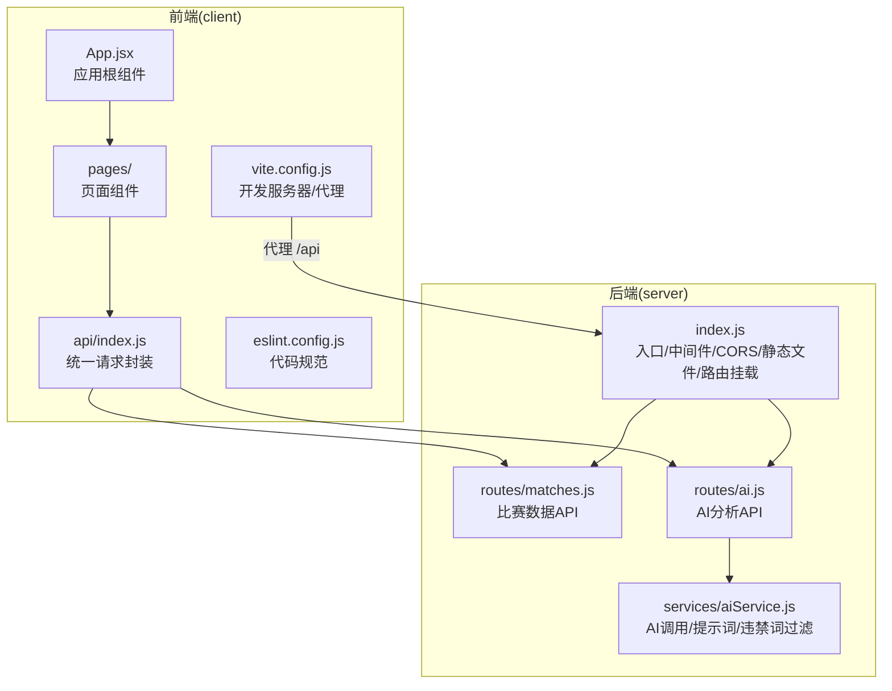
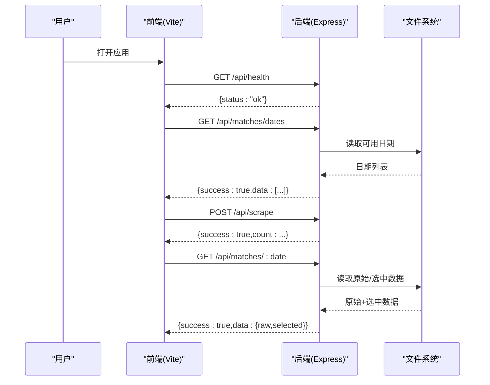
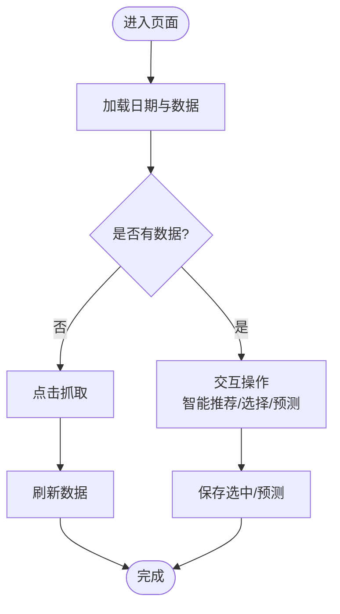
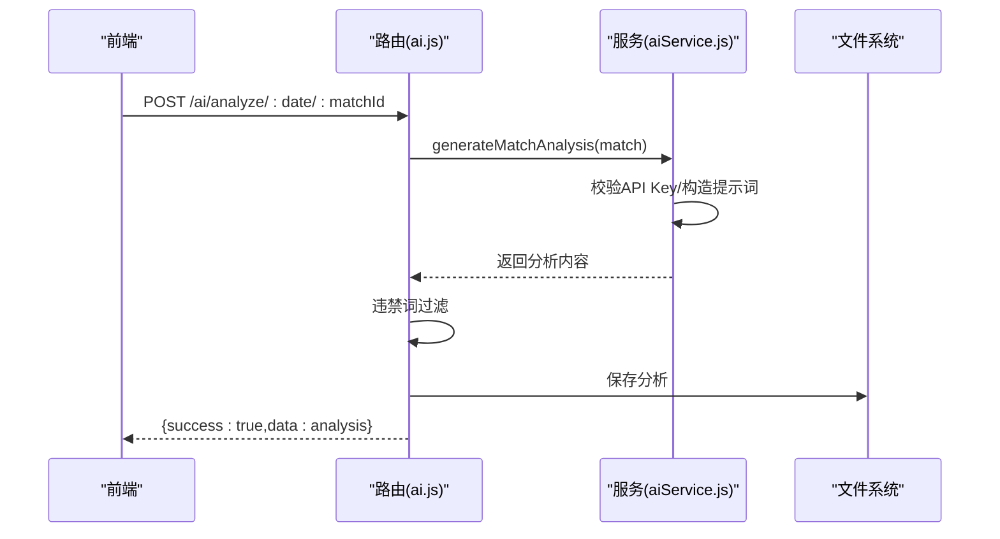
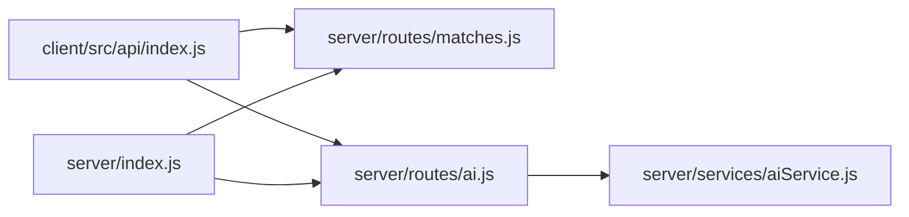

# 开发者指南

<cite>
**本文引用的文件**
- [package.json](file://client/package.json)
- [eslint.config.js](file://client/eslint.config.js)
- [vite.config.js](file://client/vite.config.js)
- [App.jsx](file://client/src/App.jsx)
- [index.js](file://client/src/api/index.js)
- [MatchDataPage.jsx](file://client/src/pages/MatchDataPage.jsx)
- [PredictPage.jsx](file://client/src/pages/PredictPage.jsx)
- [index.js](file://server/index.js)
- [matches.js](file://server/routes/matches.js)
- [ai.js](file://server/routes/ai.js)
- [aiService.js](file://server/services/aiService.js)
- [PRD.md](file://PRD.md)
</cite>

## 目录
1. [简介](#简介)
2. [项目结构](#项目结构)
3. [核心组件](#核心组件)
4. [架构总览](#架构总览)
5. [详细组件分析](#详细组件分析)
6. [依赖关系分析](#依赖关系分析)
7. [性能考虑](#性能考虑)
8. [故障排查指南](#故障排查指南)
9. [结论](#结论)
10. [附录](#附录)

## 简介
本指南面向AutoMatch项目的开发者，提供从代码规范、组件设计、API设计到测试、性能与安全、以及贡献流程的完整实践说明。项目采用前后端分离架构：前端基于React + Vite + Ant Design，后端基于Node.js + Express，数据抓取使用Puppeteer，AI分析对接智谱GLM-4，数据以本地文件系统存储。

## 项目结构
- 前端(client)
  - 构建工具：Vite
  - 代码规范：ESLint（含React Hooks、React Refresh）
  - UI库：Ant Design
  - 路由与页面：App.jsx作为根组件，页面组件位于src/pages
  - API封装：src/api/index.js统一发起请求
- 后端(server)
  - 入口：index.js，启用CORS、JSON解析、静态文件服务、健康检查
  - 路由：routes目录按功能划分（matches、ai、articles、scrape）
  - 服务层：services目录（aiService、fileStorage、scraper）

图表来源
- [App.jsx](file://client/src/App.jsx)
- [index.js](file://client/src/api/index.js)
- [vite.config.js](file://client/vite.config.js)
- [index.js](file://server/index.js)
- [matches.js](file://server/routes/matches.js)
- [ai.js](file://server/routes/ai.js)
- [aiService.js](file://server/services/aiService.js)

章节来源
- [package.json:1-31](file://client/package.json#L1-L31)
- [vite.config.js:1-17](file://client/vite.config.js#L1-L17)
- [eslint.config.js:1-30](file://client/eslint.config.js#L1-L30)
- [index.js:1-49](file://server/index.js#L1-L49)

## 核心组件
- 前端应用根组件负责全局布局、主题与国际化配置，以及页面切换与日期选择。
- API封装模块统一处理BASE_URL、错误响应与请求参数序列化。
- 页面组件负责业务交互与状态管理，如“赛事数据”“预测分析”等。
- 后端入口负责中间件、静态文件服务、路由挂载与健康检查。
- 路由模块提供REST风格接口，服务模块封装具体业务逻辑与外部调用。

章节来源
- [App.jsx:1-117](file://client/src/App.jsx#L1-L117)
- [index.js:1-50](file://client/src/api/index.js#L1-L50)
- [MatchDataPage.jsx:1-198](file://client/src/pages/MatchDataPage.jsx#L1-L198)
- [PredictPage.jsx:1-322](file://client/src/pages/PredictPage.jsx#L1-L322)
- [index.js:1-49](file://server/index.js#L1-L49)
- [matches.js:1-75](file://server/routes/matches.js#L1-L75)
- [ai.js:1-102](file://server/routes/ai.js#L1-L102)
- [aiService.js:1-212](file://server/services/aiService.js#L1-L212)

## 架构总览
AutoMatch采用前后端分离架构，前端通过代理访问后端API；后端提供REST接口，路由层负责参数校验与错误处理，服务层负责业务逻辑与外部服务调用；数据以本地文件系统存储，支持静态文件访问。

图表来源
- [index.js:1-49](file://server/index.js#L1-L49)
- [matches.js:1-75](file://server/routes/matches.js#L1-L75)
- [index.js:1-50](file://client/src/api/index.js#L1-L50)

## 详细组件分析

### 前端应用与页面组件
- App.jsx
  - 负责顶部导航、左侧菜单、内容区域渲染与日期选择联动
  - 使用Ant Design布局与主题配置，支持中文化
- MatchDataPage.jsx
  - 展示比赛表格、抓取按钮、刷新按钮与统计信息
  - 通过API封装调用后端接口，更新可用日期并回传给App
- PredictPage.jsx
  - 实现智能推荐选场、手动选择/取消、预测录入与保存
  - 使用表单校验与模态框交互，支持热门标记

图表来源
- [MatchDataPage.jsx:1-198](file://client/src/pages/MatchDataPage.jsx#L1-L198)
- [PredictPage.jsx:1-322](file://client/src/pages/PredictPage.jsx#L1-L322)
- [index.js:1-50](file://client/src/api/index.js#L1-L50)

章节来源
- [App.jsx:1-117](file://client/src/App.jsx#L1-L117)
- [MatchDataPage.jsx:1-198](file://client/src/pages/MatchDataPage.jsx#L1-L198)
- [PredictPage.jsx:1-322](file://client/src/pages/PredictPage.jsx#L1-L322)
- [index.js:1-50](file://client/src/api/index.js#L1-L50)

### 后端路由与服务
- server/index.js
  - 启用CORS与JSON解析，设置静态文件目录（默认指向桌面AutoMatch目录）
  - 挂载/api/scrape、/api/matches、/api/ai、/api/articles路由
  - 提供根路径HTML与/api/health健康检查
- routes/matches.js
  - 提供获取日期、按日期读取原始/选中数据、保存选中、保存预测等接口
  - 统一返回{success:true,data:...}或错误响应
- routes/ai.js
  - 提供单场/批量AI分析生成、获取分析、更新分析内容
  - 调用aiService生成分析，并进行违禁词过滤后写入文件
- services/aiService.js
  - 初始化智谱AI客户端（从环境变量读取API Key）
  - 定义生成单场分析、公众号推文、直播脚本的提示词与调用逻辑
  - 对输出进行违禁词替换与合规处理

图表来源
- [ai.js:1-102](file://server/routes/ai.js#L1-L102)
- [aiService.js:1-212](file://server/services/aiService.js#L1-L212)

章节来源
- [index.js:1-49](file://server/index.js#L1-L49)
- [matches.js:1-75](file://server/routes/matches.js#L1-L75)
- [ai.js:1-102](file://server/routes/ai.js#L1-L102)
- [aiService.js:1-212](file://server/services/aiService.js#L1-L212)

### API 设计规范
- 统一响应结构
  - 成功：{success:true,data:...}
  - 失败：{success:false,error:string}
- 请求方式
  - POST：触发抓取、生成分析/文案
  - GET：查询日期、查询数据、查询分析
  - PUT：保存选中、保存预测、更新分析
- 错误处理
  - 路由层捕获异常并返回统一错误格式
  - 前端API封装对非success响应抛出错误，便于UI提示

章节来源
- [index.js:1-50](file://client/src/api/index.js#L1-L50)
- [matches.js:1-75](file://server/routes/matches.js#L1-L75)
- [ai.js:1-102](file://server/routes/ai.js#L1-L102)

### 代码规范与最佳实践

- JavaScript 编码标准
  - 使用ESLint推荐规则，启用React Hooks与React Refresh规则
  - 语言选项：ECMAScript 2020，支持JSX
  - 变量命名：忽略大写字母前缀的未使用变量警告
- React 组件设计原则
  - 函数式组件 + Hooks：useState/useEffect/useMemo等
  - 组件职责单一：页面组件专注UI与交互，服务逻辑尽量下沉至API或服务层
  - 表单与校验：使用Ant Design Form与受控组件
  - 状态提升：日期选择在App中统一管理，向子页面传递props
- API 设计规范
  - REST风格：资源名词复数，路径参数明确
  - 统一响应：success字段与data/error字段二选一
  - 参数校验：路由层对必填参数进行校验，必要时返回404/400
- 代码组织
  - 前端：按功能拆分页面组件，统一在App中路由切换
  - 后端：按功能拆分路由与服务，保持服务无副作用

章节来源
- [eslint.config.js:1-30](file://client/eslint.config.js#L1-L30)
- [App.jsx:1-117](file://client/src/App.jsx#L1-L117)
- [MatchDataPage.jsx:1-198](file://client/src/pages/MatchDataPage.jsx#L1-L198)
- [PredictPage.jsx:1-322](file://client/src/pages/PredictPage.jsx#L1-L322)
- [matches.js:1-75](file://server/routes/matches.js#L1-L75)
- [ai.js:1-102](file://server/routes/ai.js#L1-L102)

### 开发流程与代码审查指南
- 开发流程
  - 前端：npm run dev 启动Vite，端口5173；通过代理访问后端API
  - 后端：node server/index.js 启动Express，端口3001；静态文件目录可通过环境变量DATA_DIR配置
  - 代码规范：npm run lint 执行ESLint检查
- 代码审查要点
  - 响应一致性：是否遵循{success,data|error}约定
  - 错误处理：是否对异常进行捕获并返回友好错误
  - 参数校验：路由参数与请求体字段是否校验
  - 安全：敏感信息（如API Key）是否来自环境变量
  - 可维护性：模块职责是否清晰，函数是否短小内聚

章节来源
- [package.json:1-31](file://client/package.json#L1-L31)
- [vite.config.js:1-17](file://client/vite.config.js#L1-L17)
- [index.js:1-49](file://server/index.js#L1-L49)
- [eslint.config.js:1-30](file://client/eslint.config.js#L1-L30)

### 扩展点与插件机制
- 插件机制
  - Vite插件：当前使用@vitejs/plugin-react，可按需扩展（如预处理器、别名、构建优化）
  - ESLint插件：已启用react-hooks与react-refresh规则，可根据团队规范增减
- 扩展点
  - 新增页面：在src/pages新增组件，在App中注册菜单与路由
  - 新增API：在server/routes新增路由，在server/services新增服务方法
  - 新增AI能力：在aiService.js扩展提示词与调用逻辑，或接入其他模型
  - 新增数据源：在services/scraper.js扩展抓取逻辑，更新路由与前端调用

章节来源
- [vite.config.js:1-17](file://client/vite.config.js#L1-L17)
- [eslint.config.js:1-30](file://client/eslint.config.js#L1-L30)
- [aiService.js:1-212](file://server/services/aiService.js#L1-L212)

### 测试指南（单元/集成/端到端）
- 单元测试
  - 建议使用Vitest或Jest，针对纯函数与工具函数进行测试
  - 覆盖范围：API封装的错误分支、路由层的参数校验、服务层的提示词构造
- 集成测试
  - 使用supertest或类似库对路由进行端到端测试
  - 覆盖场景：正常流程、异常流程、文件读写错误、AI调用失败
- 端到端测试
  - 使用Playwright或Cypress，模拟用户操作（抓取、选场、预测、生成分析）
  - 关注：页面渲染、交互反馈、网络错误提示、静态文件访问
- 建议的测试文件组织
  - 前端：client/src/__tests__ 或 client/src/tests
  - 后端：server/__tests__ 或 server/tests

章节来源
- [index.js:1-50](file://client/src/api/index.js#L1-L50)
- [matches.js:1-75](file://server/routes/matches.js#L1-L75)
- [ai.js:1-102](file://server/routes/ai.js#L1-L102)

### 性能优化与安全编码
- 性能
  - 前端：合理拆分组件、避免不必要的重渲染；表格滚动与分页减少DOM节点
  - 后端：限制请求体大小（已设置10MB），避免大文件上传；批量AI分析时并发控制
- 安全
  - 敏感信息：智谱API Key必须通过环境变量注入，避免硬编码
  - CORS：生产环境建议限定来源，开发阶段使用通配符
  - 静态文件：仅暴露必要的数据目录，避免泄露
  - 输入校验：对日期、matchId等参数进行严格校验，防止路径穿越

章节来源
- [index.js:1-49](file://server/index.js#L1-L49)
- [aiService.js:1-212](file://server/services/aiService.js#L1-L212)

### 贡献代码流程
- 分支策略
  - develop：日常开发
  - feature/<name>：功能开发
  - hotfix/<name>：紧急修复
- 提交流程
  - fork仓库 -> 创建feature分支 -> 编写代码与测试 -> 提交并推送 -> 发起Pull Request
  - PR需包含：变更说明、测试覆盖、性能影响评估（如有）
- 代码风格
  - 遵循ESLint规则，提交前执行npm run lint
  - 前端组件命名采用帕斯卡命名，文件名与组件名一致
  - 后端路由命名使用复数资源名，方法使用HTTP动词语义

章节来源
- [eslint.config.js:1-30](file://client/eslint.config.js#L1-L30)
- [package.json:1-31](file://client/package.json#L1-L31)

## 依赖关系分析

图表来源
- [index.js:1-50](file://client/src/api/index.js#L1-L50)
- [matches.js:1-75](file://server/routes/matches.js#L1-L75)
- [ai.js:1-102](file://server/routes/ai.js#L1-L102)
- [index.js:1-49](file://server/index.js#L1-L49)
- [aiService.js:1-212](file://server/services/aiService.js#L1-L212)

章节来源
- [index.js:1-50](file://client/src/api/index.js#L1-L50)
- [matches.js:1-75](file://server/routes/matches.js#L1-L75)
- [ai.js:1-102](file://server/routes/ai.js#L1-L102)
- [index.js:1-49](file://server/index.js#L1-L49)
- [aiService.js:1-212](file://server/services/aiService.js#L1-L212)

## 性能考虑
- 前端
  - 使用Ant Design组件按需加载与虚拟滚动（如表格过大）
  - 合理缓存：日期与选中数据在页面内缓存，减少重复请求
- 后端
  - 控制请求体大小，避免内存溢出
  - 批量任务异步化，避免阻塞主线程
- 数据
  - 本地文件系统读写注意磁盘IO，避免频繁小文件写入

## 故障排查指南
- 健康检查
  - 访问根路径或/api/health确认后端运行状态
- API错误
  - 统一响应失败时，检查后端日志与前端错误提示
- AI分析失败
  - 确认环境变量ZHIPU_API_KEY已正确配置
  - 检查违禁词过滤是否导致内容被替换
- 静态文件无法访问
  - 检查DATA_DIR环境变量与目录权限
- 前端代理
  - 确认Vite代理配置指向正确的后端地址

章节来源
- [index.js:1-49](file://server/index.js#L1-L49)
- [aiService.js:1-212](file://server/services/aiService.js#L1-L212)
- [vite.config.js:1-17](file://client/vite.config.js#L1-L17)

## 结论
本指南总结了AutoMatch项目的代码规范、组件设计、API设计、测试策略、性能与安全实践以及贡献流程。建议在开发过程中持续遵循这些规范，确保代码质量与可维护性。

## 附录
- 产品需求与技术背景参考PRD文档，了解模块边界、数据存储与合规要求。

章节来源
- [PRD.md:1-301](file://PRD.md#L1-L301)