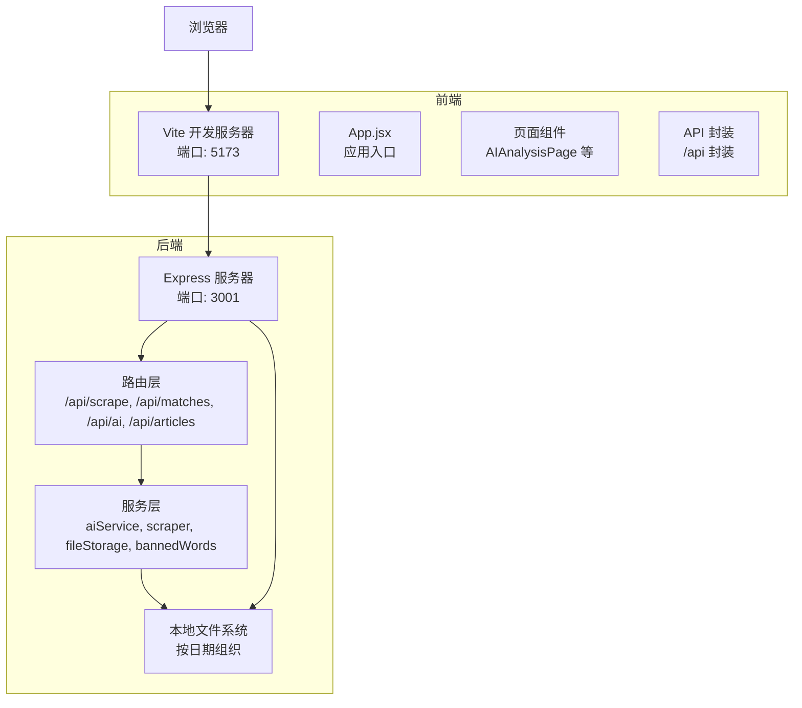
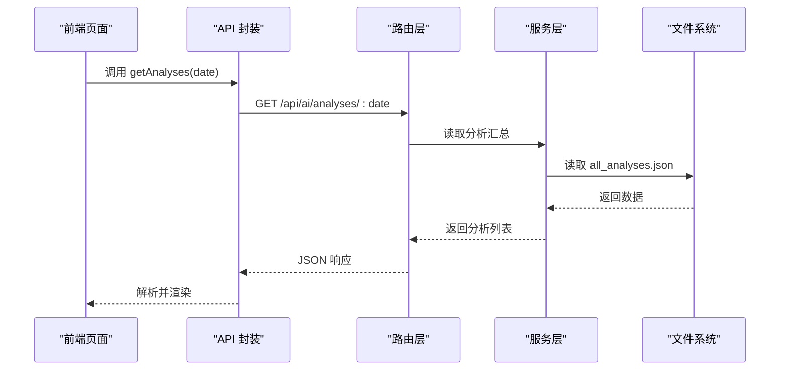
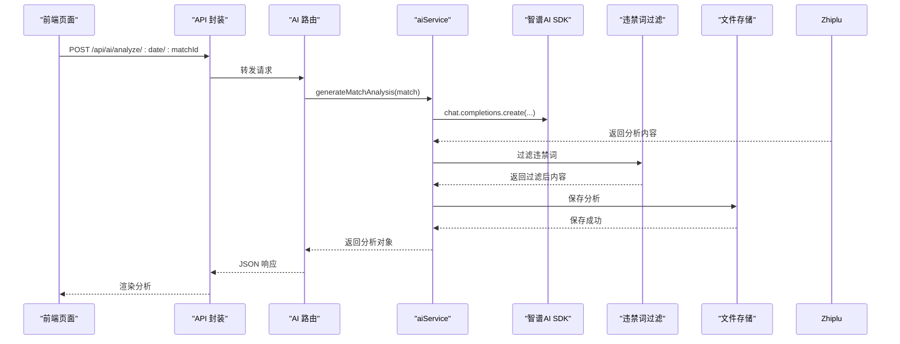
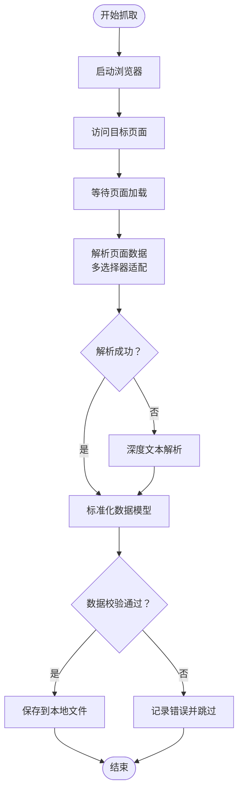
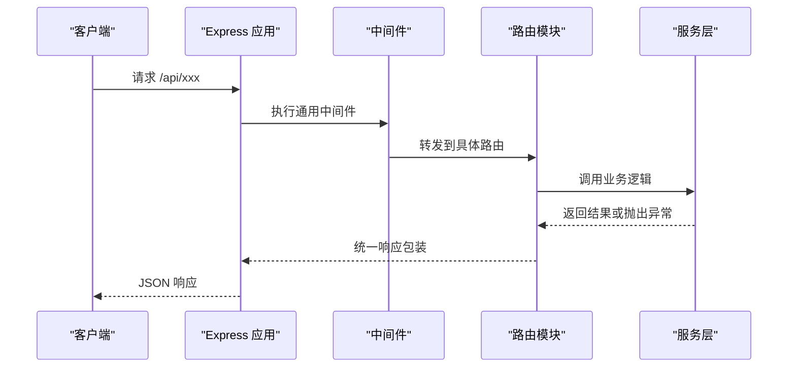
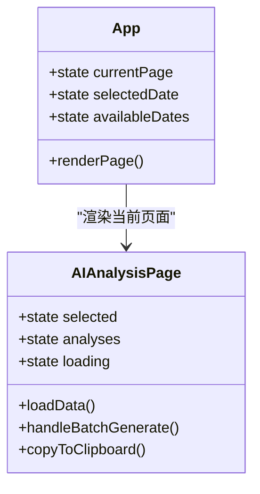
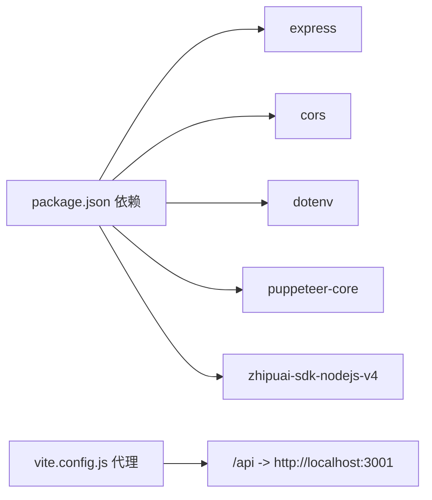

# 扩展开发

<cite>
**本文引用的文件**
- [server/index.js](file://server/index.js)
- [server/routes/ai.js](file://server/routes/ai.js)
- [server/routes/matches.js](file://server/routes/matches.js)
- [server/routes/scrape.js](file://server/routes/scrape.js)
- [server/services/aiService.js](file://server/services/aiService.js)
- [server/services/scraper.js](file://server/services/scraper.js)
- [server/services/fileStorage.js](file://server/services/fileStorage.js)
- [server/services/bannedWords.js](file://server/services/bannedWords.js)
- [client/src/App.jsx](file://client/src/App.jsx)
- [client/src/api/index.js](file://client/src/api/index.js)
- [client/src/pages/AIAnalysisPage.jsx](file://client/src/pages/AIAnalysisPage.jsx)
- [client/vite.config.js](file://client/vite.config.js)
- [package.json](file://package.json)
- [PRD.md](file://PRD.md)
</cite>

## 目录
1. [简介](#简介)
2. [项目结构](#项目结构)
3. [核心组件](#核心组件)
4. [架构总览](#架构总览)
5. [详细组件分析](#详细组件分析)
6. [依赖关系分析](#依赖关系分析)
7. [性能考量](#性能考量)
8. [故障排查指南](#故障排查指南)
9. [结论](#结论)
10. [附录](#附录)

## 简介
本指南面向希望为 AutoMatch 项目进行扩展开发的工程师，覆盖以下扩展方向：
- 新的AI服务集成（如智谱AI SDK扩展、新模型接入流程、Prompt工程最佳实践）
- 数据源扩展（新数据抓取器开发、数据格式适配、数据验证机制）
- API扩展（新路由添加、中间件开发、错误处理扩展）
- UI组件扩展（Ant Design组件使用、自定义组件开发、主题定制）
- 插件系统设计思路与实现方案
- 具体扩展示例与最佳实践

## 项目结构
AutoMatch 采用前后端分离架构：前端基于 React + Vite + Ant Design，后端基于 Node.js + Express，数据抓取使用 Puppeteer，AI服务集成智谱AI SDK，数据以本地文件系统存储。

图表来源
- [server/index.js:11-25](file://server/index.js#L11-L25)
- [client/vite.config.js:7-14](file://client/vite.config.js#L7-L14)
- [client/src/App.jsx:58-113](file://client/src/App.jsx#L58-L113)

章节来源
- [server/index.js:1-49](file://server/index.js#L1-L49)
- [client/vite.config.js:1-17](file://client/vite.config.js#L1-L17)
- [PRD.md:14-21](file://PRD.md#L14-L21)

## 核心组件
- 路由层：负责对外暴露 REST 接口，统一处理请求参数与响应格式。
- 服务层：封装业务逻辑，如AI分析、数据抓取、文件存储、违禁词过滤。
- 数据存储：以日期为根目录的本地文件系统，按模块划分子目录。
- 前端：基于 Ant Design 的页面组件，通过统一的 API 封装与后端交互。

章节来源
- [server/routes/ai.js:1-102](file://server/routes/ai.js#L1-L102)
- [server/routes/matches.js:1-75](file://server/routes/matches.js#L1-L75)
- [server/routes/scrape.js:1-26](file://server/routes/scrape.js#L1-L26)
- [server/services/aiService.js:1-212](file://server/services/aiService.js#L1-L212)
- [server/services/scraper.js:1-295](file://server/services/scraper.js#L1-L295)
- [server/services/fileStorage.js:1-196](file://server/services/fileStorage.js#L1-L196)
- [server/services/bannedWords.js:1-114](file://server/services/bannedWords.js#L1-L114)
- [client/src/api/index.js:1-50](file://client/src/api/index.js#L1-L50)

## 架构总览
后端通过 Express 注册多个路由模块，每个模块对应一个业务域；服务层封装具体实现；前端通过统一的 API 封装发起请求，Vite 代理转发到后端。

图表来源
- [client/src/api/index.js:32-39](file://client/src/api/index.js#L32-L39)
- [server/routes/ai.js:71-82](file://server/routes/ai.js#L71-L82)
- [server/services/fileStorage.js:100-107](file://server/services/fileStorage.js#L100-L107)

## 详细组件分析

### AI服务集成扩展（智谱AI SDK）
- 当前实现：在服务层封装了智谱AI客户端初始化、模型调用与错误处理；在路由层提供单场/批量AI分析接口，并集成违禁词过滤与本地存储。
- 扩展要点：
  - 新模型接入：在服务层新增模型工厂或配置映射，支持多模型切换与参数差异化。
  - Prompt工程：将 Prompt 模板化并支持变量注入，便于多场景复用与迭代。
  - 错误处理：统一捕获AI调用异常，返回可读错误信息并记录日志。
  - 合规与安全：保留违禁词过滤机制，必要时扩展为可配置的合规策略。

图表来源
- [server/routes/ai.js:8-34](file://server/routes/ai.js#L8-L34)
- [server/services/aiService.js:15-65](file://server/services/aiService.js#L15-L65)
- [server/services/bannedWords.js:65-96](file://server/services/bannedWords.js#L65-L96)
- [server/services/fileStorage.js:71-98](file://server/services/fileStorage.js#L71-L98)

章节来源
- [server/services/aiService.js:1-212](file://server/services/aiService.js#L1-L212)
- [server/routes/ai.js:1-102](file://server/routes/ai.js#L1-L102)
- [server/services/bannedWords.js:1-114](file://server/services/bannedWords.js#L1-L114)
- [server/services/fileStorage.js:1-196](file://server/services/fileStorage.js#L1-L196)

### 数据源扩展（新数据抓取器）
- 当前实现：使用 Puppeteer 无头浏览器访问目标站点，解析表格结构提取比赛数据，回退到文本模式解析，最后保存到本地文件。
- 扩展要点：
  - 新抓取器开发：新增抓取服务模块，遵循统一的输入输出约定（返回标准化比赛数据结构），并在路由层注册新接口。
  - 数据格式适配：定义统一的数据模型（字段名、类型、约束），对抓取结果进行清洗与校验。
  - 数据验证机制：在保存前进行字段完整性与范围校验，异常数据写入日志并跳过。
  - 反爬策略：可考虑随机延时、代理池、User-Agent轮换等策略，但需平衡稳定性与性能。

图表来源
- [server/services/scraper.js:20-214](file://server/services/scraper.js#L20-L214)
- [server/routes/scrape.js:5-23](file://server/routes/scrape.js#L5-L23)
- [server/services/fileStorage.js:29-48](file://server/services/fileStorage.js#L29-L48)

章节来源
- [server/services/scraper.js:1-295](file://server/services/scraper.js#L1-L295)
- [server/routes/scrape.js:1-26](file://server/routes/scrape.js#L1-L26)
- [server/services/fileStorage.js:1-196](file://server/services/fileStorage.js#L1-L196)

### API扩展指南（路由、中间件、错误处理）
- 新路由添加：在路由目录新增模块文件，定义HTTP方法与路径，调用服务层处理业务，返回统一的success/data/error结构。
- 中间件开发：可在Express实例上挂载通用中间件（如CORS、日志、限流、鉴权），在路由层按需启用。
- 错误处理扩展：统一捕获异常，记录日志，返回结构化错误响应；对业务异常与系统异常进行区分。

图表来源
- [server/index.js:14-25](file://server/index.js#L14-L25)
- [server/routes/ai.js:10-34](file://server/routes/ai.js#L10-L34)
- [server/routes/matches.js:17-35](file://server/routes/matches.js#L17-L35)

章节来源
- [server/index.js:1-49](file://server/index.js#L1-L49)
- [server/routes/ai.js:1-102](file://server/routes/ai.js#L1-L102)
- [server/routes/matches.js:1-75](file://server/routes/matches.js#L1-L75)

### UI组件扩展（Ant Design、自定义组件、主题）
- Ant Design使用：在页面组件中按需导入组件与图标，结合ConfigProvider进行全局主题与语言配置。
- 自定义组件开发：将重复使用的UI片段抽象为独立组件，传递props与事件回调，保持组件职责单一。
- 主题定制：通过ConfigProvider的token与algorithm进行颜色、圆角等样式定制，满足品牌一致性。

图表来源
- [client/src/App.jsx:23-114](file://client/src/App.jsx#L23-L114)
- [client/src/pages/AIAnalysisPage.jsx:9-202](file://client/src/pages/AIAnalysisPage.jsx#L9-L202)

章节来源
- [client/src/App.jsx:1-117](file://client/src/App.jsx#L1-L117)
- [client/src/pages/AIAnalysisPage.jsx:1-203](file://client/src/pages/AIAnalysisPage.jsx#L1-L203)
- [client/src/api/index.js:1-50](file://client/src/api/index.js#L1-L50)

### 插件系统设计思路与实现方案
- 设计思路：将可扩展的功能抽象为“插件接口”，通过配置文件或环境变量声明启用的插件，插件实现遵循统一协议（如：registerRoutes、registerHooks、validateConfig）。
- 实现方案：
  - 插件注册：在后端启动时扫描插件目录，动态注册路由与中间件。
  - 配置管理：集中管理插件开关、参数与优先级。
  - 生命周期：定义插件生命周期钩子（init、beforeRequest、afterResponse、destroy），在关键节点执行插件逻辑。
  - 安全与隔离：插件沙箱化执行，限制资源使用与权限，防止影响主系统稳定性。
  - 文档与示例：提供插件开发模板与示例，降低接入成本。

[本节为概念性设计，不直接分析具体文件，故无章节来源]

## 依赖关系分析
- 后端依赖：Express、CORS、dotenv、Puppeteer-core、zhipuai-sdk-nodejs-v4。
- 前端依赖：React、Ant Design、dayjs、@ant-design/icons。
- 代理配置：Vite 将 /api 前缀代理到后端服务端口。

图表来源
- [package.json:15-22](file://package.json#L15-L22)
- [client/vite.config.js:9-14](file://client/vite.config.js#L9-L14)

章节来源
- [package.json:1-23](file://package.json#L1-L23)
- [client/vite.config.js:1-17](file://client/vite.config.js#L1-L17)

## 性能考量
- 抓取性能：合理设置浏览器参数与等待策略，避免超时与资源浪费；对目标站点进行限速与重试。
- AI调用：控制温度与最大token，避免超时与费用过高；批量生成时并发控制与错误聚合。
- 前端渲染：对长列表进行虚拟滚动与懒加载；减少不必要的重渲染。
- 存储IO：批量写入与合并更新，避免频繁小文件写入；定期清理临时文件。

[本节提供一般性指导，不直接分析具体文件，故无章节来源]

## 故障排查指南
- AI服务不可用：检查环境变量中API Key配置；确认网络可达；查看服务层错误日志。
- 抓取失败：确认Chrome路径与可执行权限；检查目标站点结构变化；查看浏览器日志与异常堆栈。
- 文件存储异常：确认数据目录存在且有写权限；检查路径拼接与编码问题。
- 前端无法访问后端：确认Vite代理配置与后端端口；检查CORS设置；查看浏览器网络面板。

章节来源
- [server/services/aiService.js:3-13](file://server/services/aiService.js#L3-L13)
- [server/services/scraper.js:8-17](file://server/services/scraper.js#L8-L17)
- [server/services/fileStorage.js:9-13](file://server/services/fileStorage.js#L9-L13)
- [client/vite.config.js:9-14](file://client/vite.config.js#L9-L14)

## 结论
通过模块化设计与清晰的分层架构，AutoMatch 已具备良好的扩展基础。建议在新增功能时遵循统一的接口契约、数据模型与错误处理规范，确保系统的可维护性与可演进性。对于AI服务、数据源与UI组件的扩展，应优先考虑Prompt工程、数据清洗与主题一致性，以提升用户体验与业务价值。

[本节为总结性内容，不直接分析具体文件，故无章节来源]

## 附录

### 扩展示例与最佳实践
- 新AI模型接入
  - 在服务层新增模型工厂或配置映射，支持多模型切换与参数差异化。
  - 将Prompt模板化，支持变量注入与版本管理。
  - 对AI调用进行超时与重试控制，统一错误处理。
- 新数据抓取器
  - 定义统一数据模型，严格字段校验与范围检查。
  - 实现多策略解析（结构化解析 + 文本解析），增强鲁棒性。
  - 将抓取结果保存到本地文件，便于离线分析与审计。
- API扩展
  - 统一响应结构（success/data/error），便于前端处理。
  - 在路由层进行参数校验与权限控制，必要时引入中间件。
  - 对外部依赖（如AI服务）进行降级与熔断处理。
- UI组件扩展
  - 使用Ant Design组件库，结合ConfigProvider进行主题定制。
  - 将重复逻辑抽象为自定义组件，提高复用性与可测试性。
  - 对长列表与复杂表单进行性能优化与无障碍支持。

[本节为实践建议，不直接分析具体文件，故无章节来源]