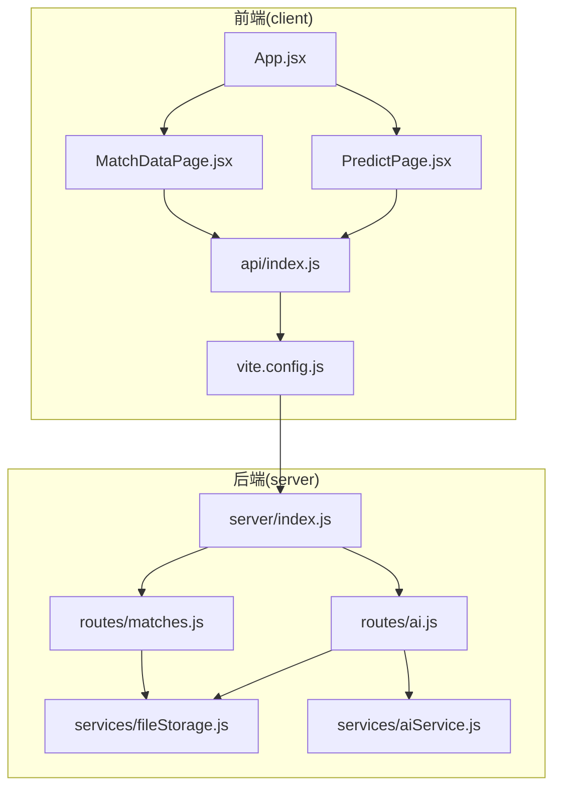
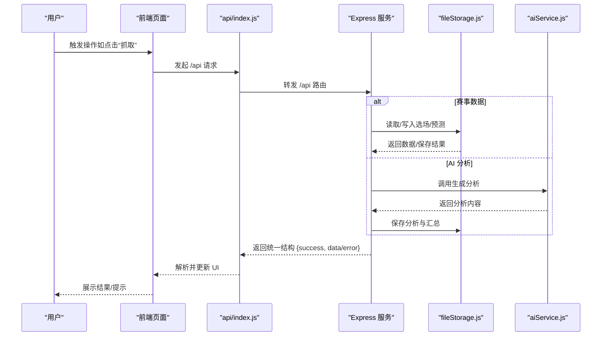
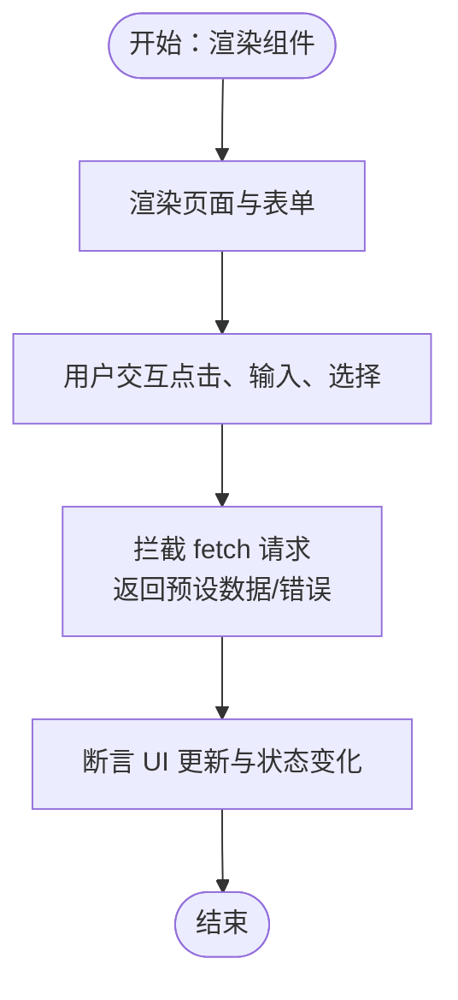
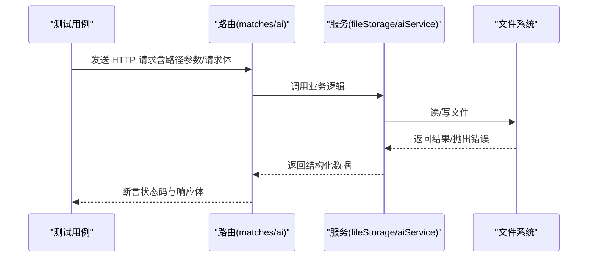
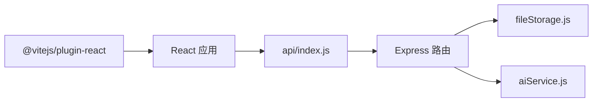

# 测试策略

<cite>
**本文引用的文件**
- [package.json](file://package.json)
- [server/index.js](file://server/index.js)
- [server/routes/matches.js](file://server/routes/matches.js)
- [server/routes/ai.js](file://server/routes/ai.js)
- [server/services/fileStorage.js](file://server/services/fileStorage.js)
- [server/services/aiService.js](file://server/services/aiService.js)
- [client/src/api/index.js](file://client/src/api/index.js)
- [client/src/App.jsx](file://client/src/App.jsx)
- [client/src/main.jsx](file://client/src/main.jsx)
- [client/src/pages/MatchDataPage.jsx](file://client/src/pages/MatchDataPage.jsx)
- [client/src/pages/PredictPage.jsx](file://client/src/pages/PredictPage.jsx)
- [client/vite.config.js](file://client/vite.config.js)
- [PRD.md](file://PRD.md)
</cite>

## 目录
1. [简介](#简介)
2. [项目结构](#项目结构)
3. [核心组件](#核心组件)
4. [架构总览](#架构总览)
5. [详细组件分析](#详细组件分析)
6. [依赖分析](#依赖分析)
7. [性能考虑](#性能考虑)
8. [故障排查指南](#故障排查指南)
9. [结论](#结论)
10. [附录](#附录)

## 简介
本测试策略文档面向 AutoMatch 项目，旨在建立覆盖单元测试、集成测试与端到端测试的完整测试体系。文档涵盖：
- Jest 测试框架配置与使用要点（含 Mock 策略、测试数据准备、异步测试处理）
- 前端组件测试（React Testing Library 使用、用户交互模拟、状态测试）
- 后端服务测试（API 测试、文件存储测试、第三方 AI 服务集成测试）
- 测试覆盖率要求与质量标准
- CI/CD 中的自动化测试流程配置建议

## 项目结构
AutoMatch 采用前后端分离架构：
- 前端：React + Vite + Ant Design，通过代理访问后端 /api 路由
- 后端：Node.js + Express，提供数据抓取、文件存储、AI 分析、文案生成等接口
- 数据存储：本地文件系统，按日期组织目录结构

图表来源
- [client/src/App.jsx:1-117](file://client/src/App.jsx#L1-L117)
- [client/src/pages/MatchDataPage.jsx:1-198](file://client/src/pages/MatchDataPage.jsx#L1-L198)
- [client/src/pages/PredictPage.jsx:1-322](file://client/src/pages/PredictPage.jsx#L1-L322)
- [client/src/api/index.js:1-50](file://client/src/api/index.js#L1-L50)
- [client/vite.config.js:1-17](file://client/vite.config.js#L1-L17)
- [server/index.js:1-49](file://server/index.js#L1-L49)
- [server/routes/matches.js:1-75](file://server/routes/matches.js#L1-L75)
- [server/routes/ai.js:1-102](file://server/routes/ai.js#L1-L102)
- [server/services/fileStorage.js:1-196](file://server/services/fileStorage.js#L1-L196)
- [server/services/aiService.js:1-212](file://server/services/aiService.js#L1-L212)

章节来源
- [package.json:1-23](file://package.json#L1-L23)
- [client/src/App.jsx:1-117](file://client/src/App.jsx#L1-L117)
- [server/index.js:1-49](file://server/index.js#L1-L49)

## 核心组件
- 前端应用与页面
  - 应用入口与全局状态：App.jsx 负责菜单、日期选择、页面渲染与日期加载
  - 数据页面：MatchDataPage.jsx 实现抓取、刷新、展示与选场状态
  - 预测页面：PredictPage.jsx 实现智能推荐、手动选择、预测录入与保存
  - API 封装：api/index.js 统一封装 /api 前缀请求与错误处理
- 后端路由与服务
  - 赛事数据路由：matches.js 提供日期列表、比赛数据读取、选场与预测保存
  - AI 分析路由：ai.js 提供单场/批量分析生成、查询与更新
  - 文件存储服务：fileStorage.js 提供本地文件读写、目录管理、日期枚举
  - AI 服务：aiService.js 封装智谱 GLM-4 调用与提示词构造
- 构建与代理
  - vite.config.js 配置前端开发服务器与 /api 代理至后端

章节来源
- [client/src/App.jsx:1-117](file://client/src/App.jsx#L1-L117)
- [client/src/pages/MatchDataPage.jsx:1-198](file://client/src/pages/MatchDataPage.jsx#L1-L198)
- [client/src/pages/PredictPage.jsx:1-322](file://client/src/pages/PredictPage.jsx#L1-L322)
- [client/src/api/index.js:1-50](file://client/src/api/index.js#L1-L50)
- [server/routes/matches.js:1-75](file://server/routes/matches.js#L1-L75)
- [server/routes/ai.js:1-102](file://server/routes/ai.js#L1-L102)
- [server/services/fileStorage.js:1-196](file://server/services/fileStorage.js#L1-L196)
- [server/services/aiService.js:1-212](file://server/services/aiService.js#L1-L212)
- [client/vite.config.js:1-17](file://client/vite.config.js#L1-L17)

## 架构总览
AutoMatch 的测试应围绕“请求-处理-持久化-响应”的链路进行验证，确保：
- 前端组件正确发起请求、处理响应与错误
- 后端路由正确解析参数、调用服务、返回结构化数据
- 文件存储服务稳定读写，满足目录结构与数据格式约定
- 第三方 AI 服务在可用时正常生成内容，在异常时返回可预期错误

图表来源
- [client/src/api/index.js:1-50](file://client/src/api/index.js#L1-L50)
- [server/routes/matches.js:1-75](file://server/routes/matches.js#L1-L75)
- [server/routes/ai.js:1-102](file://server/routes/ai.js#L1-L102)
- [server/services/fileStorage.js:1-196](file://server/services/fileStorage.js#L1-L196)
- [server/services/aiService.js:1-212](file://server/services/aiService.js#L1-L212)

## 详细组件分析

### 前端组件测试策略
- 测试目标
  - 组件渲染与交互（菜单切换、日期选择、按钮点击）
  - 异步数据加载与错误处理（抓取、刷新、保存）
  - 表单校验与状态更新（预测录入、信心指数、热门标记）
- 推荐技术栈
  - React Testing Library：基于可访问性标签与屏幕阅读器语义进行断言
  - MSW 或 Jest Mock（按需）：拦截 fetch 请求，模拟网络层
  - 用户事件模拟：fireEvent、userEvent（模拟点击、输入、选择）
- Mock 策略
  - 对 api/index.js 的请求函数进行模块级 Mock，返回预设数据或错误
  - 对 dayjs、Ant Design 组件进行浅层 Mock，避免复杂依赖
- 测试数据准备
  - 准备最小化、可复用的 mock 数据（原始比赛、选中比赛、分析结果）
  - 为不同分支（成功/失败、空数据、部分字段缺失）准备多套 fixtures
- 异步测试处理
  - 使用 async/await 与 waitFor、screen.findBy* 等查询等待 DOM 更新
  - 对消息提示（Ant Design message）进行隔离或 Mock，避免副作用

图表来源
- [client/src/pages/MatchDataPage.jsx:1-198](file://client/src/pages/MatchDataPage.jsx#L1-L198)
- [client/src/pages/PredictPage.jsx:1-322](file://client/src/pages/PredictPage.jsx#L1-L322)
- [client/src/api/index.js:1-50](file://client/src/api/index.js#L1-L50)

章节来源
- [client/src/pages/MatchDataPage.jsx:1-198](file://client/src/pages/MatchDataPage.jsx#L1-L198)
- [client/src/pages/PredictPage.jsx:1-322](file://client/src/pages/PredictPage.jsx#L1-L322)
- [client/src/api/index.js:1-50](file://client/src/api/index.js#L1-L50)

### 后端服务测试策略
- 测试目标
  - 路由正确解析路径参数与请求体，返回统一结构
  - 文件存储服务按约定创建目录、读写 JSON/Markdown 文件
  - AI 服务在配置正确时生成内容，异常时抛出可识别错误
- 推荐技术栈
  - Jest + Supertest：HTTP 层测试，无需启动生产服务器
  - 文件系统 Mock：fs 模块替换为内存或临时目录，避免真实磁盘
  - 环境变量隔离：通过 dotenv 测试配置或 jest-environment-jsdom 的方式注入
- Mock 策略
  - 对外部 AI SDK 进行模块级 Mock，返回稳定响应或错误
  - 对 Puppeteer（如存在）进行 Mock，或在 CI 中禁用真实无头浏览器
- 测试数据准备
  - 构造符合 PRD 的最小化数据结构（比赛、选场、分析、文案）
  - 为不同边界条件（空目录、文件不存在、非法日期）准备场景
- 错误处理与状态码
  - 404/400/500 等状态码与 success 字段一致性校验
  - 错误信息可读且不泄露敏感信息

图表来源
- [server/routes/matches.js:1-75](file://server/routes/matches.js#L1-L75)
- [server/routes/ai.js:1-102](file://server/routes/ai.js#L1-L102)
- [server/services/fileStorage.js:1-196](file://server/services/fileStorage.js#L1-L196)
- [server/services/aiService.js:1-212](file://server/services/aiService.js#L1-L212)

章节来源
- [server/routes/matches.js:1-75](file://server/routes/matches.js#L1-L75)
- [server/routes/ai.js:1-102](file://server/routes/ai.js#L1-L102)
- [server/services/fileStorage.js:1-196](file://server/services/fileStorage.js#L1-L196)
- [server/services/aiService.js:1-212](file://server/services/aiService.js#L1-L212)

### API 测试要点
- 路由清单与期望行为
  - 赛事数据：获取日期列表、按日期读取原始与选中数据、保存选场、保存预测
  - AI 分析：单场/批量生成、查询汇总、更新内容
  - 文案：生成公众号与直播文案、读取汇总
- 断言维度
  - HTTP 状态码、响应结构（success/data/error）、数据字段完整性
  - 文件落盘后的可读性与一致性（JSON/Markdown）

章节来源
- [PRD.md:252-271](file://PRD.md#L252-L271)
- [server/routes/matches.js:1-75](file://server/routes/matches.js#L1-L75)
- [server/routes/ai.js:1-102](file://server/routes/ai.js#L1-L102)

### 文件存储与数据一致性测试
- 目录结构与命名规范
  - 按日期创建目录，子目录命名与文件名遵循 PRD 约定
- 读写一致性
  - 读取不存在文件返回空/默认值，写入后可读
  - 选场/分析/文案的 JSON 与 Markdown 同步更新
- 边界与异常
  - 空目录、非法日期、权限不足等异常路径

章节来源
- [PRD.md:205-234](file://PRD.md#L205-L234)
- [server/services/fileStorage.js:1-196](file://server/services/fileStorage.js#L1-L196)

### 第三方服务集成测试
- AI 服务
  - 正常路径：返回结构化分析内容，包含匹配字段
  - 异常路径：API Key 缺失、网络错误、AI 返回异常
- Mock 建议
  - 使用 Jest Mock 实现稳定可控的响应
  - 在 CI 中可选择跳过真实调用或使用假响应

章节来源
- [server/services/aiService.js:1-212](file://server/services/aiService.js#L1-L212)

## 依赖分析
- 前端依赖
  - React、Ant Design、dayjs、@vitejs/plugin-react
- 后端依赖
  - Express、CORS、dotenv、puppeteer-core、zhipuai-sdk-nodejs-v4
- 关键耦合点
  - 前端通过 /api 代理访问后端路由
  - 路由依赖文件存储服务；AI 路由依赖 AI 服务与文件存储

图表来源
- [client/vite.config.js:1-17](file://client/vite.config.js#L1-L17)
- [client/src/api/index.js:1-50](file://client/src/api/index.js#L1-L50)
- [server/index.js:1-49](file://server/index.js#L1-L49)
- [server/services/fileStorage.js:1-196](file://server/services/fileStorage.js#L1-L196)
- [server/services/aiService.js:1-212](file://server/services/aiService.js#L1-L212)

章节来源
- [package.json:1-23](file://package.json#L1-L23)
- [client/vite.config.js:1-17](file://client/vite.config.js#L1-L17)

## 性能考虑
- 前端
  - 避免在渲染阶段进行大量计算，将复杂逻辑移至 useEffect 或自定义 Hook
  - 表格滚动与大数据集渲染时，合理分页或虚拟化
- 后端
  - 文件 I/O 与 AI 调用应设置超时与重试策略
  - 路由层尽量薄，将业务逻辑下沉至服务层，便于测试与优化
- 测试性能
  - 使用内存文件系统或临时目录，减少磁盘 IO
  - 对第三方服务使用 Mock，缩短测试执行时间

## 故障排查指南
- 常见问题与定位
  - 前端无法访问 /api：检查 vite 代理配置与后端 CORS 设置
  - 后端 500 错误：检查文件存储目录是否存在、AI API Key 是否配置
  - AI 服务异常：确认模型名称、温度与最大 token 设置是否合理
- 日志与可观测性
  - 后端在关键路径打印日志，便于测试与线上排障
  - 前端对错误消息进行统一提示，避免泄露内部细节

章节来源
- [client/vite.config.js:1-17](file://client/vite.config.js#L1-L17)
- [server/index.js:1-49](file://server/index.js#L1-L49)
- [server/services/aiService.js:1-212](file://server/services/aiService.js#L1-L212)

## 结论
通过构建以 Jest 为核心的测试体系，结合前端 RTL、后端 Supertest 与文件系统 Mock，AutoMatch 可在保证质量的同时提升交付效率。建议将测试纳入 CI/CD，确保每次提交均通过单元与集成测试。

## 附录

### Jest 配置与使用指南
- 基础配置
  - 测试文件命名：*.test.js 或 *.spec.js
  - 测试命令：在根目录 package.json 中添加 scripts 如 test、test:watch、test:coverage
- Mock 策略
  - 对 fetch 使用 jest.mock 与 global.fetch 重写
  - 对文件系统使用 fs 模块的内存替身或临时目录
  - 对 AI SDK 进行模块级 Mock，返回稳定响应
- 测试数据准备
  - 使用 fixtures 或工厂函数生成最小化、可复用的数据
  - 为成功/失败/边界场景分别准备数据集
- 异步测试
  - 使用 async/await 与 waitFor、findBy 查询
  - 对定时器与延时进行控制（jest.useFakeTimers）

章节来源
- [client/src/api/index.js:1-50](file://client/src/api/index.js#L1-L50)
- [server/services/fileStorage.js:1-196](file://server/services/fileStorage.js#L1-L196)
- [server/services/aiService.js:1-212](file://server/services/aiService.js#L1-L212)

### 测试覆盖率与质量标准
- 覆盖率要求（建议）
  - 语句覆盖率：≥80%
  - 分支覆盖率：≥70%
  - 函数覆盖率：≥85%
  - 行覆盖率：≥80%
- 质量标准
  - 每个公共函数至少一个正向与一个负向测试
  - 关键业务流程（抓取→选场→AI→文案）形成端到端场景
  - 通过 CI 的测试报告作为合并门槛

### CI/CD 自动化测试流程配置
- 建议步骤
  - 安装依赖：npm ci
  - 启动后端服务（或使用 Mock）：node server/index.js
  - 运行前端开发服务器（或构建产物）：vite dev/build
  - 执行测试：jest --coverage
  - 上传覆盖率报告（可选）
- 环境变量
  - 在 CI 中设置 DATA_DIR、ZHIPU_API_KEY 等必要变量
- 并行与缓存
  - 将测试拆分为前端与后端两组，按需并行执行
  - 缓存 node_modules 与依赖安装结果

章节来源
- [package.json:1-23](file://package.json#L1-L23)
- [server/index.js:1-49](file://server/index.js#L1-L49)