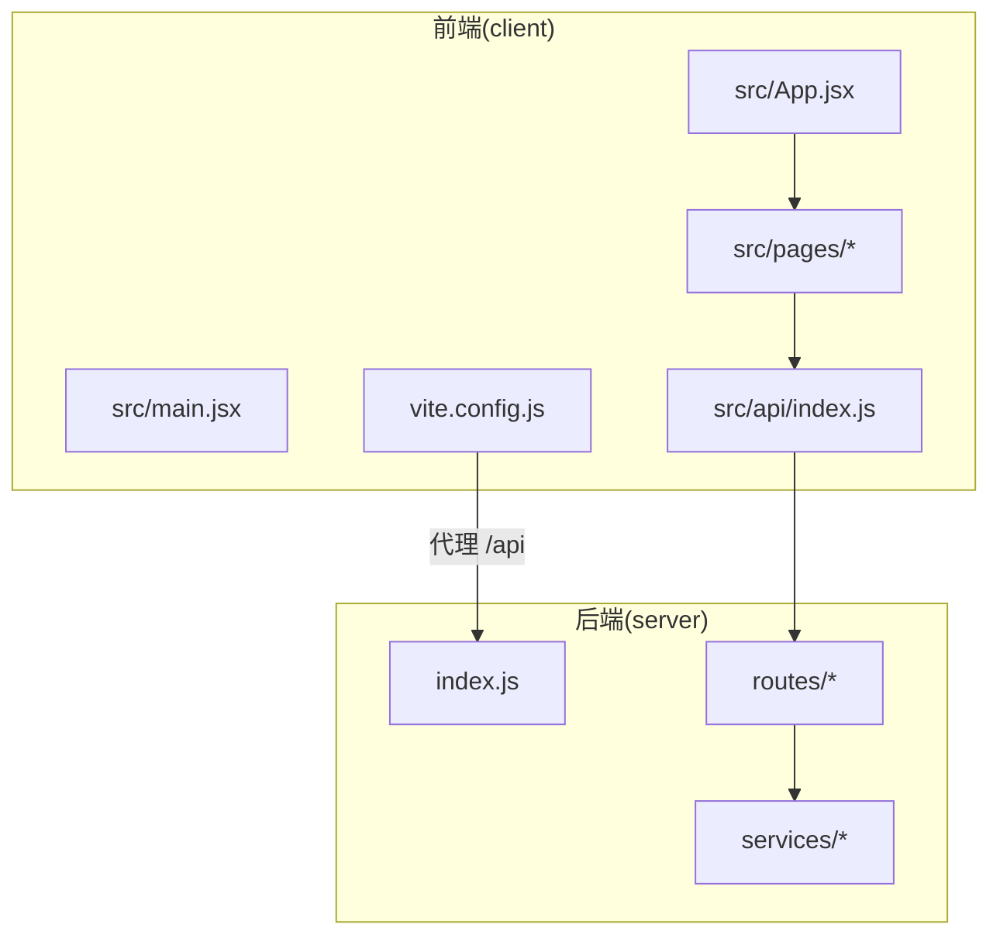
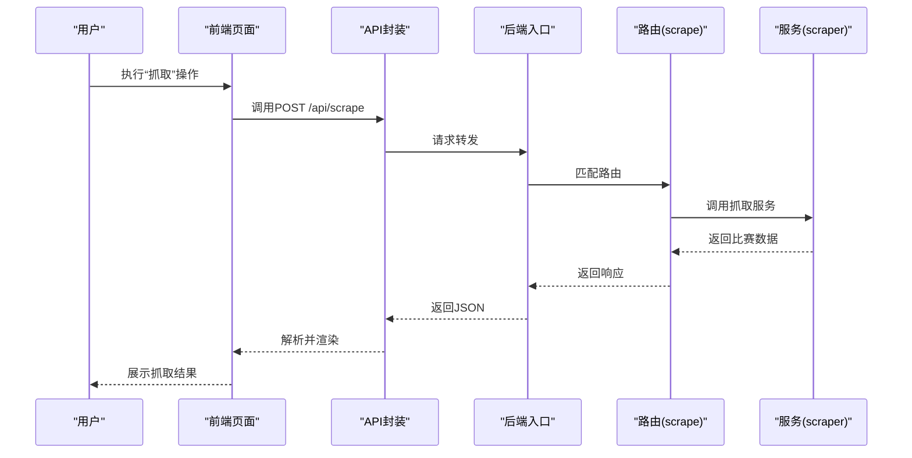
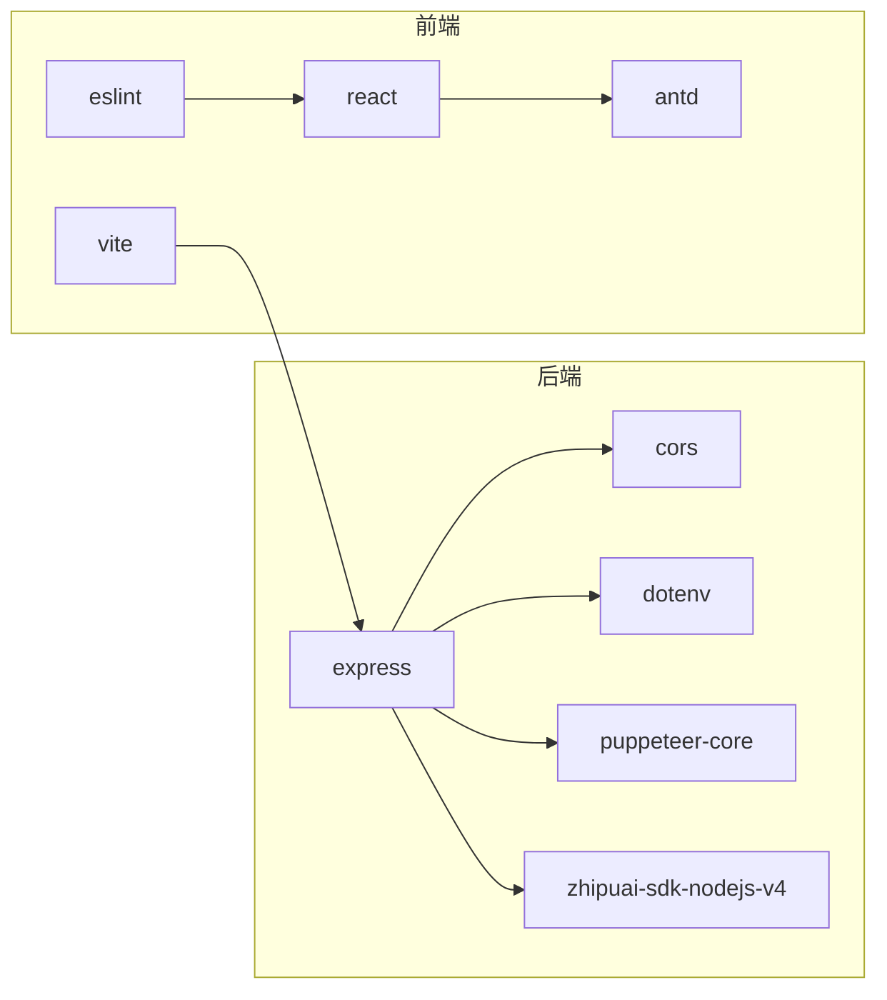

# 贡献流程

<cite>
**本文引用的文件**
- [PRD.md](file://PRD.md)
- [package.json](file://package.json)
- [server/index.js](file://server/index.js)
- [server/routes/scrape.js](file://server/routes/scrape.js)
- [server/services/scraper.js](file://server/services/scraper.js)
- [server/services/aiService.js](file://server/services/aiService.js)
- [client/package.json](file://client/package.json)
- [client/vite.config.js](file://client/vite.config.js)
- [.gitignore](file://.gitignore)
- [client/.gitignore](file://client/.gitignore)
- [client/src/main.jsx](file://client/src/main.jsx)
- [client/src/App.jsx](file://client/src/App.jsx)
- [client/src/pages/MatchDataPage.jsx](file://client/src/pages/MatchDataPage.jsx)
- [client/src/pages/AIAnalysisPage.jsx](file://client/src/pages/AIAnalysisPage.jsx)
- [client/src/api/index.js](file://client/src/api/index.js)
- [client/eslint.config.js](file://client/eslint.config.js)
- [client/README.md](file://client/README.md)
</cite>

## 目录
1. [简介](#简介)
2. [项目结构](#项目结构)
3. [核心组件](#核心组件)
4. [架构总览](#架构总览)
5. [详细组件分析](#详细组件分析)
6. [依赖关系分析](#依赖关系分析)
7. [性能考量](#性能考量)
8. [故障排查指南](#故障排查指南)
9. [结论](#结论)
10. [附录](#附录)

## 简介
本贡献流程文档面向AutoMatch项目的开发者与维护者，提供完整的协作规范，涵盖：
- Git工作流与分支策略、提交规范、合并请求流程
- 代码审查标准与流程（含Pull Request模板、审查清单、反馈处理）
- 开发环境设置（依赖安装、环境变量、本地调试）
- 问题报告与功能请求流程（Issue模板、优先级评估、任务分配）
- 发布流程与版本管理规范
- 社区行为准则与沟通指南

## 项目结构
AutoMatch采用前后端分离架构：
- 前端：React + Vite + Ant Design，通过代理访问后端API
- 后端：Node.js + Express，提供REST API与静态文件服务
- 数据：本地文件系统（JSON/Markdown），按日期组织
- 依赖与脚本：统一在根与client目录的package.json中定义

图表来源
- [client/src/main.jsx:1-11](file://client/src/main.jsx#L1-L11)
- [client/src/App.jsx:1-117](file://client/src/App.jsx#L1-L117)
- [client/src/api/index.js:1-50](file://client/src/api/index.js#L1-L50)
- [client/vite.config.js:1-17](file://client/vite.config.js#L1-L17)
- [server/index.js:1-49](file://server/index.js#L1-L49)
- [server/routes/scrape.js:1-26](file://server/routes/scrape.js#L1-L26)
- [server/services/scraper.js:1-295](file://server/services/scraper.js#L1-L295)
- [server/services/aiService.js:1-212](file://server/services/aiService.js#L1-L212)

章节来源
- [package.json:1-23](file://package.json#L1-L23)
- [client/package.json:1-31](file://client/package.json#L1-L31)
- [client/vite.config.js:1-17](file://client/vite.config.js#L1-L17)
- [server/index.js:1-49](file://server/index.js#L1-L49)

## 核心组件
- 前端应用入口与路由：负责页面切换、日期选择、国际化与主题配置
- API封装层：统一请求方法、错误处理与URL前缀
- 页面组件：赛事数据页、AI分析页等，承载业务交互
- 后端入口与中间件：CORS、JSON解析、静态文件服务、健康检查
- 路由与服务：抓取、匹配、AI分析、文章生成等模块化服务

章节来源
- [client/src/main.jsx:1-11](file://client/src/main.jsx#L1-L11)
- [client/src/App.jsx:1-117](file://client/src/App.jsx#L1-L117)
- [client/src/api/index.js:1-50](file://client/src/api/index.js#L1-L50)
- [client/src/pages/MatchDataPage.jsx:1-198](file://client/src/pages/MatchDataPage.jsx#L1-L198)
- [client/src/pages/AIAnalysisPage.jsx:1-203](file://client/src/pages/AIAnalysisPage.jsx#L1-L203)
- [server/index.js:1-49](file://server/index.js#L1-L49)
- [server/routes/scrape.js:1-26](file://server/routes/scrape.js#L1-L26)
- [server/services/scraper.js:1-295](file://server/services/scraper.js#L1-L295)
- [server/services/aiService.js:1-212](file://server/services/aiService.js#L1-L212)

## 架构总览
AutoMatch的前后端交互通过Vite代理实现，前端通过API封装层调用后端路由，后端路由委托至具体服务模块；静态数据目录通过Express静态服务对外提供。

图表来源
- [client/src/pages/MatchDataPage.jsx:25-38](file://client/src/pages/MatchDataPage.jsx#L25-L38)
- [client/src/api/index.js:15-16](file://client/src/api/index.js#L15-L16)
- [server/index.js:21-25](file://server/index.js#L21-L25)
- [server/routes/scrape.js:8-23](file://server/routes/scrape.js#L8-L23)
- [server/services/scraper.js:22-214](file://server/services/scraper.js#L22-L214)

## 详细组件分析

### Git工作流程与分支策略
- 分支命名规范
  - 功能开发：feature/issue-编号-简述
  - 修复缺陷：fix/编号-简述
  - 热修复：hotfix/编号-简述
  - 文档更新：docs/简述
- 合并策略
  - 使用squash合并，保持提交历史整洁
  - 合并前需通过CI与代码审查
- 提交信息规范
  - 类型(scope): 描述
  - 类型：feat、fix、docs、style、refactor、perf、test、chore
  - 示例：feat(client): 新增日期选择器交互

章节来源
- [client/src/pages/MatchDataPage.jsx:25-38](file://client/src/pages/MatchDataPage.jsx#L25-L38)
- [client/src/api/index.js:15-16](file://client/src/api/index.js#L15-L16)

### 代码审查标准与流程
- Pull Request模板
  - 概述：变更目的与背景
  - 影响范围：涉及模块/页面/接口
  - 测试要点：本地验证步骤、边界条件
  - 风险与回滚：潜在风险与回退方案
- 审查清单
  - 代码质量：命名规范、函数长度、重复逻辑
  - 安全性：环境变量使用、敏感信息处理
  - 性能：异步处理、资源释放、内存占用
  - 兼容性：跨平台、浏览器支持
  - 文档：变更说明、API更新
- 反馈处理
  - 使用线程化评论逐条回复
  - 修改后重新推送并@审查者
  - 通过审查后方可合并

章节来源
- [server/services/aiService.js:3-13](file://server/services/aiService.js#L3-L13)
- [client/eslint.config.js:1-30](file://client/eslint.config.js#L1-L30)

### 开发环境设置
- 依赖安装
  - 根目录：安装后端依赖
  - client目录：安装前端依赖
- 环境变量
  - 后端：DATA_DIR（数据目录）、PORT（端口）、ZHIPU_API_KEY（AI密钥）
  - 前端：Vite代理指向后端端口
- 本地调试
  - 启动后端：根目录脚本或直接运行后端入口
  - 启动前端：进入client目录运行开发服务器
  - 代理配置：Vite将/api前缀代理到后端地址
- 代码规范
  - 前端ESLint配置已启用推荐规则与React插件
  - 建议使用ESLint命令进行静态检查

章节来源
- [package.json:5-10](file://package.json#L5-L10)
- [client/package.json:6-11](file://client/package.json#L6-L11)
- [server/index.js:1-49](file://server/index.js#L1-L49)
- [client/vite.config.js:7-15](file://client/vite.config.js#L7-L15)
- [client/eslint.config.js:1-30](file://client/eslint.config.js#L1-L30)
- [.gitignore:1-4](file://.gitignore#L1-L4)
- [client/.gitignore:1-25](file://client/.gitignore#L1-L25)

### 问题报告与功能请求流程
- Issue模板
  - 标题：简洁描述问题/需求
  - 类型：Bug、Feature、Question
  - 复现步骤：最小可复现步骤
  - 期望与实际：明确对比
  - 环境信息：操作系统、浏览器、依赖版本
- 优先级评估
  - P0：阻塞性缺陷（影响核心功能）
  - P1：严重缺陷（影响日常使用）
  - P2：一般缺陷（影响体验）
  - P3：优化建议（提升可维护性/UX）
- 任务分配
  - 由维护者根据优先级与技术栈分配
  - 需求评审后拆分为子任务

章节来源
- [PRD.md:1-301](file://PRD.md#L1-L301)

### 发布流程与版本管理
- 版本号规范
  - 采用语义化版本：主.次.修订
  - 修订：修复类更新
  - 次：新增兼容功能
  - 主：破坏性变更
- 发布步骤
  - 合并目标分支至main
  - 更新版本号与变更日志
  - 推送标签并创建Release
  - 通知相关方
- 回滚策略
  - 若问题紧急，回退到上一个稳定标签
  - 保留最近一次发布产物以便快速恢复

章节来源
- [package.json:2-4](file://package.json#L2-L4)

### 社区行为准则与沟通指南
- 行为准则
  - 尊重与包容：禁止骚扰、歧视与攻击性言论
  - 建设性反馈：聚焦问题与改进，避免人身攻击
  - 开放协作：共享知识，鼓励新手参与
- 沟通渠道
  - Issue/PR评论：技术讨论与决策记录
  - 文档与Wiki：沉淀最佳实践
- 透明与可追溯
  - 所有变更均在版本控制中留痕
  - 重大决策形成文档并公开

章节来源
- [PRD.md:1-301](file://PRD.md#L1-L301)

## 依赖关系分析
- 前端依赖
  - React、Ant Design、dayjs等运行时依赖
  - Vite、ESLint等开发时依赖
- 后端依赖
  - Express、CORS、dotenv、puppeteer-core、zhipuai-sdk-nodejs-v4
- 代理与静态资源
  - Vite代理/api到后端
  - Express静态服务/data目录

图表来源
- [client/package.json:12-29](file://client/package.json#L12-L29)
- [package.json:15-21](file://package.json#L15-L21)

章节来源
- [client/package.json:1-31](file://client/package.json#L1-L31)
- [package.json:1-23](file://package.json#L1-L23)

## 性能考量
- 抓取性能
  - 无头浏览器启动与页面等待时间受网络与页面结构影响
  - 建议在稳定网络环境下执行抓取，必要时增加超时容忍
- AI生成性能
  - 单场分析与批量生成均受网络与模型响应时间影响
  - 建议在低并发场景下执行，避免频繁调用
- 前端性能
  - 大表格滚动与列表渲染可通过虚拟化进一步优化
  - 图片与静态资源建议CDN或本地缓存

## 故障排查指南
- 环境变量缺失
  - 症状：AI服务报错提示未配置密钥
  - 处理：在后端根目录创建.env文件并填入密钥
- 数据目录不可访问
  - 症状：静态数据无法加载
  - 处理：确认DATA_DIR路径存在且可读写
- 代理失败
  - 症状：前端无法访问后端API
  - 处理：检查Vite代理配置与后端端口
- 抓取失败
  - 症状：页面提示抓取异常
  - 处理：检查Chrome路径、网络连通性与页面结构变化

章节来源
- [server/services/aiService.js:9-13](file://server/services/aiService.js#L9-L13)
- [server/index.js:18-19](file://server/index.js#L18-L19)
- [client/vite.config.js:9-14](file://client/vite.config.js#L9-L14)
- [server/services/scraper.js:10-17](file://server/services/scraper.js#L10-L17)

## 结论
本贡献流程文档基于项目现有结构与配置，提供了可落地的协作规范与操作指引。建议团队在实践中持续迭代，结合PRD与产品演进动态调整流程细节，确保高质量交付与可持续发展。

## 附录
- 快速启动
  - 安装依赖：根目录与client目录分别执行安装
  - 启动后端：根目录脚本或直接运行后端入口
  - 启动前端：进入client目录运行开发服务器
  - 访问：前端默认端口，后端默认端口
- 常用脚本
  - 后端：server、dev、start
  - 前端：dev、build、lint、preview

章节来源
- [package.json:5-10](file://package.json#L5-L10)
- [client/package.json:6-11](file://client/package.json#L6-L11)
- [client/README.md:1-17](file://client/README.md#L1-L17)