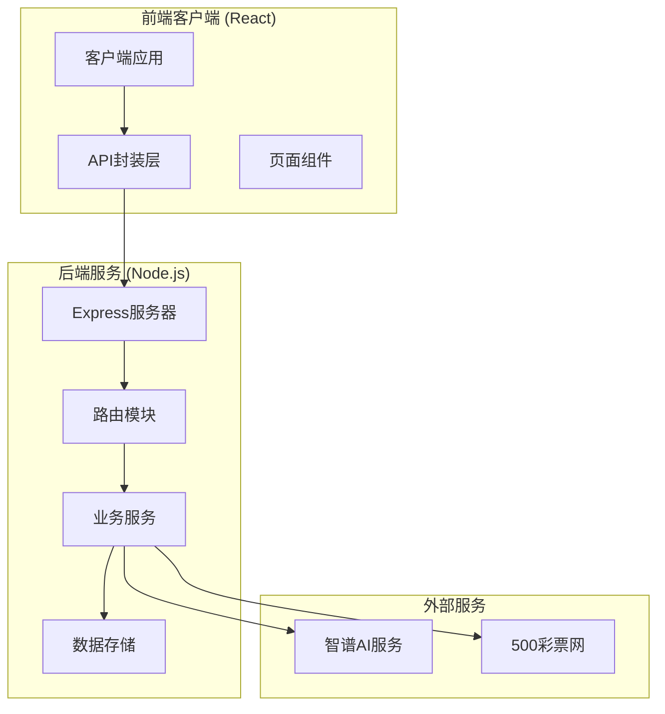
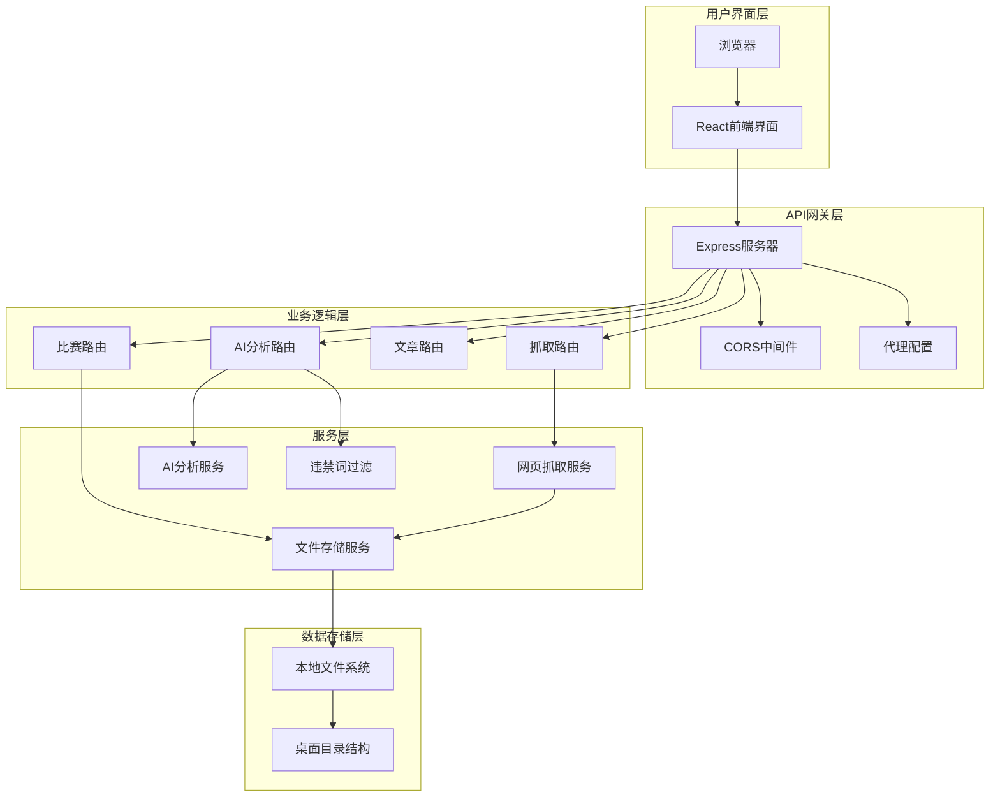
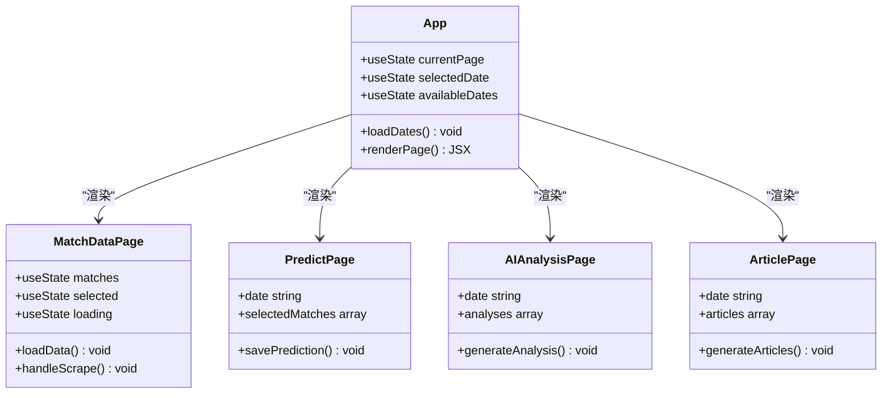
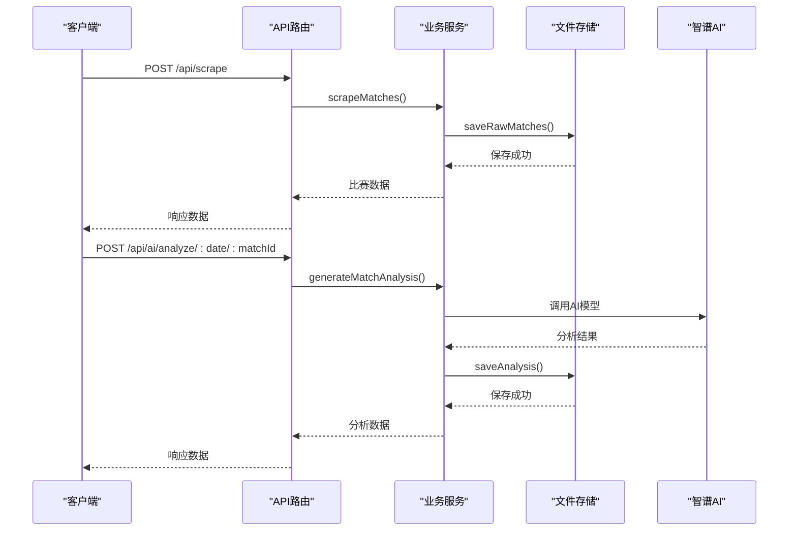
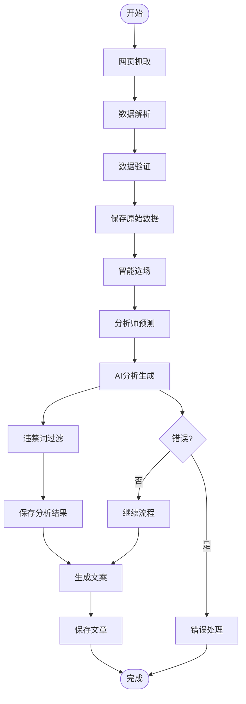

# 快速开始

<cite>
**本文引用的文件**
- [package.json](file://package.json)
- [client/package.json](file://client/package.json)
- [server/index.js](file://server/index.js)
- [client/vite.config.js](file://client/vite.config.js)
- [client/src/api/index.js](file://client/src/api/index.js)
- [server/services/aiService.js](file://server/services/aiService.js)
- [server/routes/ai.js](file://server/routes/ai.js)
- [server/routes/matches.js](file://server/routes/matches.js)
- [server/services/scraper.js](file://server/services/scraper.js)
- [PRD.md](file://PRD.md)
- [client/src/App.jsx](file://client/src/App.jsx)
- [client/src/pages/MatchDataPage.jsx](file://client/src/pages/MatchDataPage.jsx)
</cite>

## 目录
1. [简介](#简介)
2. [项目结构](#项目结构)
3. [核心组件](#核心组件)
4. [架构概览](#架构概览)
5. [详细组件分析](#详细组件分析)
6. [依赖分析](#依赖分析)
7. [性能考虑](#性能考虑)
8. [故障排除指南](#故障排除指南)
9. [结论](#结论)
10. [附录](#附录)

## 简介
AutoMatch 是一款面向足球竞彩分析师的本地化工具，集成了赛事数据抓取、智能选场、AI辅助分析、文案生成等功能。本指南将帮助您快速搭建开发环境，配置必要的环境变量，并启动前后端服务进行首次体验。

## 项目结构
AutoMatch 采用前后端分离的架构设计，主要包含以下核心组件：



**图表来源**
- [client/src/App.jsx:1-117](file://client/src/App.jsx#L1-L117)
- [server/index.js:1-49](file://server/index.js#L1-L49)

**章节来源**
- [PRD.md:14-21](file://PRD.md#L14-L21)
- [package.json:1-23](file://package.json#L1-L23)

## 核心组件

### 开发环境要求
- **Node.js**: 版本 18 或更高版本
- **npm**: 版本 8 或更高版本
- **macOS**: 推荐使用 macOS 系统运行
- **Chrome/Chromium**: 用于网页抓取功能

### 项目克隆与安装
1. 克隆项目仓库到本地
2. 进入项目根目录并安装后端依赖：
   ```bash
   npm install
   ```
3. 进入客户端目录安装前端依赖：
   ```bash
   cd client
   npm install
   ```

### 环境变量配置
创建 `.env` 文件配置智谱AI API密钥：
```env
ZHIPU_API_KEY=your_actual_api_key_here
PORT=3001
DATA_DIR=~/Desktop/AutoMatch
```

**章节来源**
- [server/services/aiService.js:3-13](file://server/services/aiService.js#L3-L13)
- [server/index.js:18-19](file://server/index.js#L18-L19)

## 架构概览

### 系统架构图


**图表来源**
- [server/index.js:1-49](file://server/index.js#L1-L49)
- [client/vite.config.js:7-15](file://client/vite.config.js#L7-L15)

## 详细组件分析

### 前端应用架构
前端采用 React + Vite + Ant Design 架构，提供四个核心功能模块：



**图表来源**
- [client/src/App.jsx:23-56](file://client/src/App.jsx#L23-L56)
- [client/src/pages/MatchDataPage.jsx:6-23](file://client/src/pages/MatchDataPage.jsx#L6-L23)

### 后端API架构
后端基于 Express.js 提供RESTful API服务：



**图表来源**
- [server/routes/ai.js:10-34](file://server/routes/ai.js#L10-L34)
- [server/services/aiService.js:18-65](file://server/services/aiService.js#L18-L65)

**章节来源**
- [client/src/App.jsx:41-56](file://client/src/App.jsx#L41-L56)
- [server/routes/ai.js:1-102](file://server/routes/ai.js#L1-L102)

### 数据流处理
系统采用本地文件系统存储所有数据，支持多层目录结构：



**图表来源**
- [server/services/scraper.js:22-214](file://server/services/scraper.js#L22-L214)
- [server/services/aiService.js:18-65](file://server/services/aiService.js#L18-L65)

**章节来源**
- [PRD.md:205-234](file://PRD.md#L205-L234)
- [server/services/scraper.js:1-295](file://server/services/scraper.js#L1-L295)

## 依赖分析

### 核心依赖关系
```mermaid
graph LR
subgraph "前端依赖"
React[react@^19.2.4]
ReactDOM[react-dom@^19.2.4]
Antd[antd@^6.3.5]
Vite[vite@^8.0.4]
Dayjs[dayjs@^1.11.20]
end
subgraph "后端依赖"
Express[express@^5.2.1]
Cors[cors@^2.8.6]
Puppeteer[puppeteer-core@^24.41.0]
Dotenv[dotenv@^17.4.2]
ZhipuSDK[zhipuai-sdk-nodejs-v4@^0.1.12]
end
subgraph "开发依赖"
VitePlugin[@vitejs/plugin-react@^6.0.1]
ESLint[eslint@^9.39.4]
Types[typescript-eslint@^7.0.1]
end
React --> Antd
Vite --> VitePlugin
Express --> Cors
Express --> Puppeteer
Express --> Dotenv
Express --> ZhipuSDK
```

**图表来源**
- [client/package.json:12-29](file://client/package.json#L12-L29)
- [package.json:15-21](file://package.json#L15-L21)

**章节来源**
- [client/package.json:1-31](file://client/package.json#L1-L31)
- [package.json:1-23](file://package.json#L1-L23)

## 性能考虑
- **抓取性能**: 使用无头浏览器模式，单次抓取控制在30秒内
- **AI分析性能**: 单场分析控制在10秒内
- **内存管理**: 自动清理浏览器实例，避免内存泄漏
- **并发处理**: AI分析采用串行处理，确保稳定性

## 故障排除指南

### 常见问题及解决方案

#### 1. 智谱AI API密钥配置错误
**问题症状**: 启动时提示API密钥未配置
**解决方法**:
1. 在项目根目录创建 `.env` 文件
2. 添加正确的API密钥配置
3. 重启后端服务

**章节来源**
- [server/services/aiService.js:9-11](file://server/services/aiService.js#L9-L11)

#### 2. Chrome浏览器路径问题
**问题症状**: 抓取功能无法启动或报错
**解决方法**:
1. 确保系统已安装Chrome或Chromium
2. 设置CHROME_PATH环境变量指向正确路径
3. 或使用默认路径 `/Applications/Google Chrome.app/Contents/MacOS/Google Chrome`

**章节来源**
- [server/services/scraper.js:10-17](file://server/services/scraper.js#L10-L17)

#### 3. 端口占用冲突
**问题症状**: 服务启动失败，提示端口被占用
**解决方法**:
1. 修改 `PORT` 环境变量为其他端口
2. 或关闭占用3001端口的进程

**章节来源**
- [server/index.js:12-12](file://server/index.js#L12-L12)

#### 4. CORS跨域问题
**问题症状**: 前端请求后端API时出现跨域错误
**解决方法**:
1. 确保前端Vite代理配置正确
2. 检查后端CORS中间件设置

**章节来源**
- [client/vite.config.js:9-14](file://client/vite.config.js#L9-L14)
- [server/index.js:14-14](file://server/index.js#L14-L14)

#### 5. 数据目录权限问题
**问题症状**: 无法保存文件到桌面目录
**解决方法**:
1. 确保对桌面目录有写入权限
2. 可以修改 `DATA_DIR` 环境变量指向其他目录

**章节来源**
- [server/index.js:18-19](file://server/index.js#L18-L19)

## 结论
AutoMatch 提供了一个完整的足球赛事分析工具链，从数据抓取到AI分析再到文案生成，形成了高效的本地化工作流程。通过合理的环境配置和依赖管理，您可以快速搭建起这套分析工具，提升日常工作的效率和质量。

## 附录

### 项目启动命令
```bash
# 启动后端服务
npm run server

# 启动前端开发服务器
cd client
npm run dev

# 同时启动前后端
npm run dev
```

### 访问方式
- **后端API**: http://localhost:3001
- **前端界面**: http://localhost:5173
- **健康检查**: http://localhost:3001/api/health

### 首次运行基本操作
1. **配置环境变量**: 创建 `.env` 文件并添加API密钥
2. **启动服务**: 先启动后端，再启动前端
3. **抓取数据**: 在"赛事数据"页面点击"抓取今日比赛数据"
4. **智能选场**: 选择重点比赛并录入预测
5. **AI分析**: 生成AI分析文案并进行编辑
6. **生成文案**: 选择热门比赛生成公众号推文和直播文案

**章节来源**
- [PRD.md:244-248](file://PRD.md#L244-L248)
- [client/src/pages/MatchDataPage.jsx:25-38](file://client/src/pages/MatchDataPage.jsx#L25-L38)