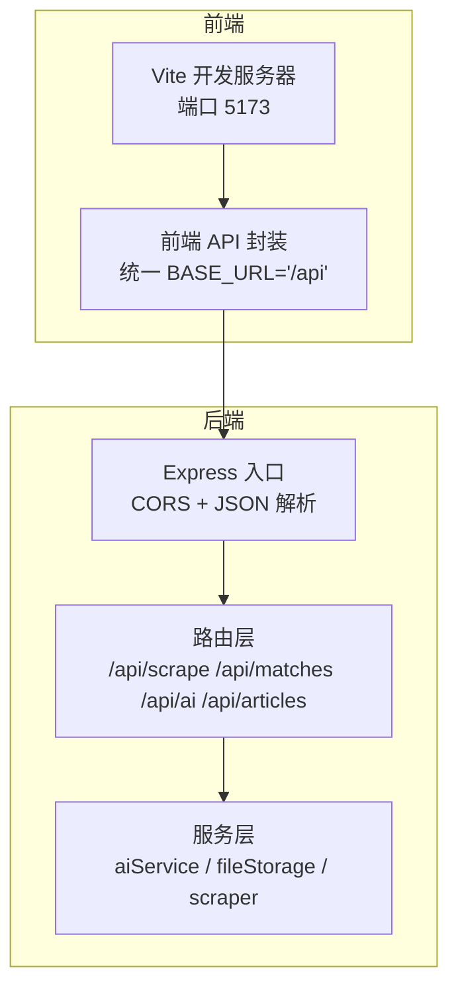
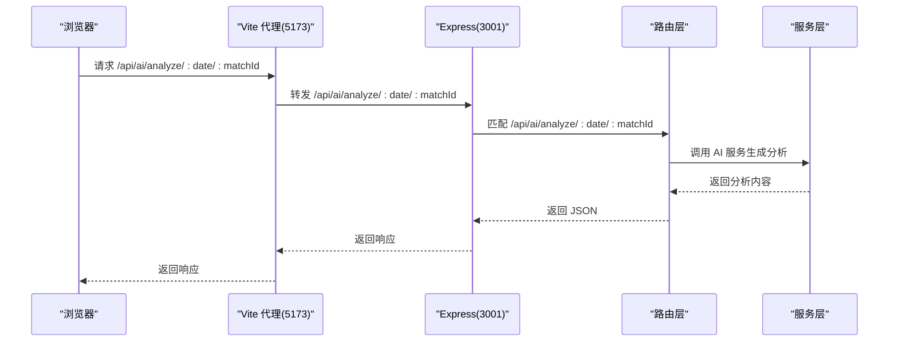
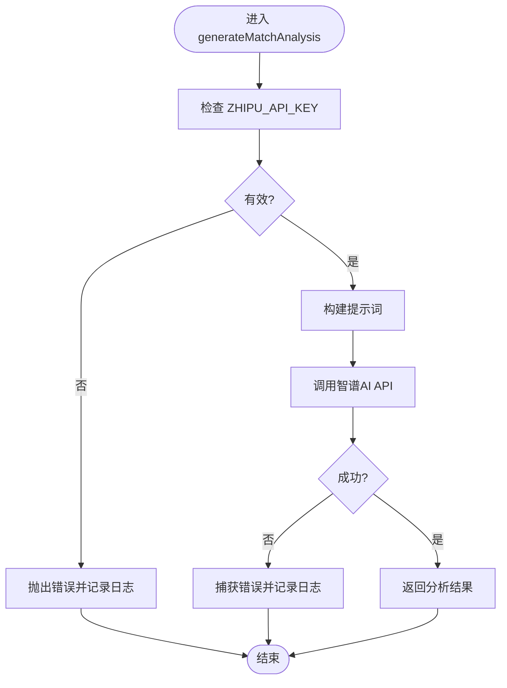
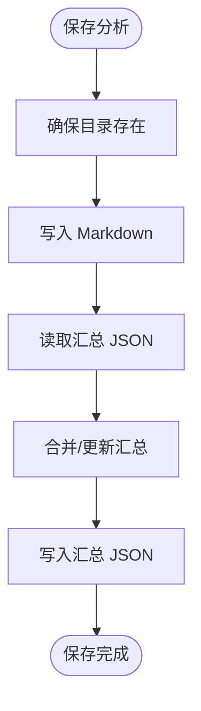
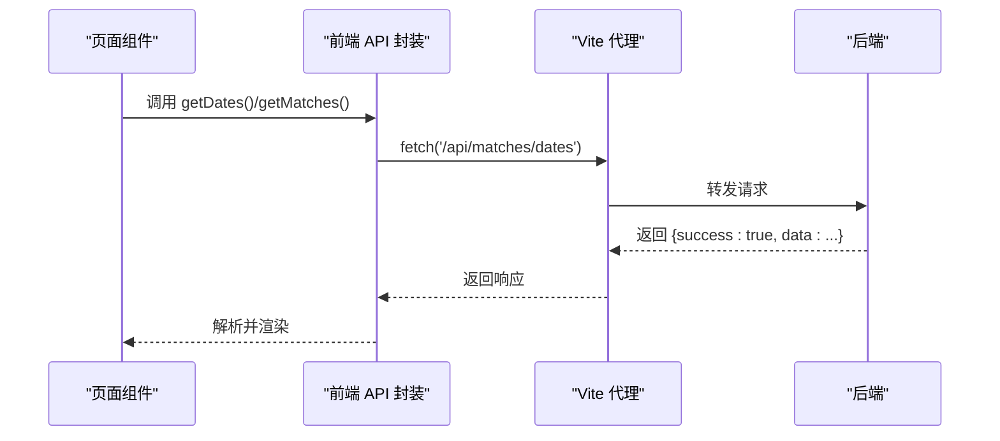
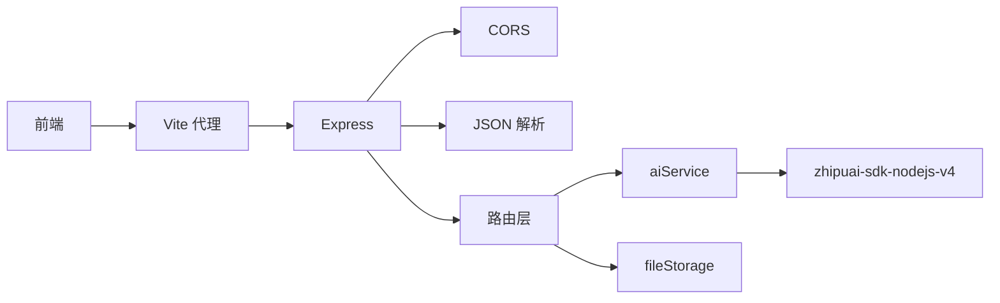

# 故障排除

<cite>
**本文引用的文件**
- [server/index.js](file://server/index.js)
- [client/vite.config.js](file://client/vite.config.js)
- [client/src/api/index.js](file://client/src/api/index.js)
- [server/routes/scrape.js](file://server/routes/scrape.js)
- [server/routes/matches.js](file://server/routes/matches.js)
- [server/routes/ai.js](file://server/routes/ai.js)
- [server/routes/articles.js](file://server/routes/articles.js)
- [server/services/aiService.js](file://server/services/aiService.js)
- [server/services/fileStorage.js](file://server/services/fileStorage.js)
- [PRD.md](file://PRD.md)
</cite>

## 目录
1. [简介](#简介)
2. [项目结构](#项目结构)
3. [核心组件](#核心组件)
4. [架构总览](#架构总览)
5. [详细组件分析](#详细组件分析)
6. [依赖关系分析](#依赖关系分析)
7. [性能考虑](#性能考虑)
8. [故障排除指南](#故障排除指南)
9. [结论](#结论)
10. [附录](#附录)

## 简介
本故障排除文档聚焦于AutoMatch项目的常见问题与系统化排障方法，覆盖环境配置、依赖安装、API调用错误、AI服务集成、网络与权限、数据存储、性能诊断与优化等方面。文档基于仓库现有源码进行分析，提供可操作的定位步骤、日志分析要点与修复建议。

## 项目结构
AutoMatch采用前后端分离架构：前端使用React + Vite，后端使用Express；数据抓取、AI分析、文案生成均通过REST接口对接；数据以本地文件系统存储，按日期分层组织。

图表来源
- [server/index.js:1-49](file://server/index.js#L1-L49)
- [client/vite.config.js:1-17](file://client/vite.config.js#L1-L17)
- [client/src/api/index.js:1-50](file://client/src/api/index.js#L1-L50)

章节来源
- [server/index.js:1-49](file://server/index.js#L1-L49)
- [client/vite.config.js:1-17](file://client/vite.config.js#L1-L17)
- [client/src/api/index.js:1-50](file://client/src/api/index.js#L1-L50)

## 核心组件
- 后端入口与中间件
  - CORS启用、JSON解析、静态文件服务、根路由与健康检查。
  - 数据目录默认位于用户桌面的AutoMatch目录，可通过环境变量DATA_DIR自定义。
- 路由与控制器
  - 抓取路由：触发数据抓取并返回结果。
  - 比赛路由：日期维度的数据读写、预测更新。
  - AI路由：单场/批量AI分析生成、读取与更新分析。
  - 文案路由：公众号与直播文案生成、读取。
- 服务层
  - AI服务：封装智谱AI SDK调用，校验API Key，构造提示词，捕获异常。
  - 文件存储：按日期分层保存原始数据、重点比赛、AI分析、公众号与直播文案，支持读取与汇总。
- 前端
  - API封装：统一请求、错误抛出与响应结构校验。
  - Vite代理：将/api转发至后端3001端口。

章节来源
- [server/index.js:1-49](file://server/index.js#L1-L49)
- [server/routes/scrape.js:1-26](file://server/routes/scrape.js#L1-L26)
- [server/routes/matches.js:1-75](file://server/routes/matches.js#L1-L75)
- [server/routes/ai.js:1-102](file://server/routes/ai.js#L1-L102)
- [server/routes/articles.js:1-113](file://server/routes/articles.js#L1-L113)
- [server/services/aiService.js:1-212](file://server/services/aiService.js#L1-L212)
- [server/services/fileStorage.js:1-196](file://server/services/fileStorage.js#L1-L196)
- [client/src/api/index.js:1-50](file://client/src/api/index.js#L1-L50)

## 架构总览
后端启动时加载环境变量，开启CORS与JSON解析，挂载静态文件服务指向数据目录，并注册各API路由。前端通过Vite代理将/api请求转发至后端。AI分析依赖外部智谱AI服务，文件存储依赖本地磁盘。

图表来源
- [client/vite.config.js:7-15](file://client/vite.config.js#L7-L15)
- [server/index.js:22-25](file://server/index.js#L22-L25)
- [server/routes/ai.js:10-34](file://server/routes/ai.js#L10-L34)
- [server/services/aiService.js:18-65](file://server/services/aiService.js#L18-L65)

## 详细组件分析

### 组件A：AI分析服务（aiService）
- 关键点
  - 通过环境变量读取API Key，若未配置则抛错。
  - 使用智谱AI模型生成分析，设置温度与最大token。
  - 错误捕获并记录日志，向上抛出。
- 常见问题
  - 未配置ZHIPU_API_KEY或值为占位符。
  - 智谱API调用失败（网络/配额/限流）。
  - 违禁词过滤导致内容被替换，需检查过滤规则。

图表来源
- [server/services/aiService.js:8-13](file://server/services/aiService.js#L8-L13)
- [server/services/aiService.js:41-64](file://server/services/aiService.js#L41-L64)

章节来源
- [server/services/aiService.js:1-212](file://server/services/aiService.js#L1-L212)

### 组件B：文件存储服务（fileStorage）
- 关键点
  - 默认数据目录位于用户桌面AutoMatch，可通过环境变量DATA_DIR覆盖。
  - 按日期分层保存原始数据、重点比赛、AI分析、公众号与直播文案。
  - 提供读取与写入、目录确保、日期列表查询等能力。
- 常见问题
  - 目录不存在或权限不足导致无法写入。
  - 日期格式不正确导致无法识别可用日期。
  - 文件损坏或缺失导致读取失败。

图表来源
- [server/services/fileStorage.js:74-98](file://server/services/fileStorage.js#L74-L98)

章节来源
- [server/services/fileStorage.js:1-196](file://server/services/fileStorage.js#L1-L196)

### 组件C：前端API封装与Vite代理
- 关键点
  - 统一BASE_URL为/api，封装fetch请求与错误处理。
  - Vite代理将/api转发至后端3001端口。
- 常见问题
  - 代理未生效或端口冲突。
  - 响应success=false时前端未正确处理错误。
  - CORS跨域错误（后端已启用CORS，仍可能出现代理配置问题）。

图表来源
- [client/src/api/index.js:15-31](file://client/src/api/index.js#L15-L31)
- [client/vite.config.js:9-14](file://client/vite.config.js#L9-L14)

章节来源
- [client/src/api/index.js:1-50](file://client/src/api/index.js#L1-L50)
- [client/vite.config.js:1-17](file://client/vite.config.js#L1-L17)

## 依赖关系分析
- 后端依赖
  - dotenv：加载环境变量。
  - express、cors：Web框架与跨域。
  - zhipuai-sdk-nodejs-v4：智谱AI SDK。
  - 本地文件系统：数据持久化。
- 前端依赖
  - React、Ant Design、dayjs、@vitejs/plugin-react。
  - Vite：开发服务器与代理。

图表来源
- [server/index.js:1-16](file://server/index.js#L1-L16)
- [server/services/aiService.js:1](file://server/services/aiService.js#L1)
- [client/vite.config.js:7-15](file://client/vite.config.js#L7-L15)

章节来源
- [server/index.js:1-49](file://server/index.js#L1-L49)
- [server/services/aiService.js:1-212](file://server/services/aiService.js#L1-L212)
- [client/vite.config.js:1-17](file://client/vite.config.js#L1-L17)

## 性能考虑
- 抓取与AI生成
  - 抓取应在30秒内完成，AI单场生成应在10秒内完成（来自PRD非功能性需求）。
  - 若超出阈值，优先检查网络稳定性、智谱API响应延迟与本地磁盘IO。
- 前端交互
  - Vite开发服务器默认端口5173，代理/api至3001端口，避免跨域与额外握手开销。
- 存储
  - 文件系统写入为顺序IO，建议避免在同一时间大量并发写入；批量分析时可考虑分批处理。

章节来源
- [PRD.md:276-279](file://PRD.md#L276-L279)
- [client/vite.config.js:7-15](file://client/vite.config.js#L7-L15)

## 故障排除指南

### 一、环境配置问题
- 症状
  - 后端启动后无法访问数据目录或保存失败。
  - AI分析报“未配置ZHIPU_API_KEY”。
- 排查步骤
  - 检查DATA_DIR环境变量是否正确设置，确认目录存在且具备读写权限。
  - 检查ZHIPU_API_KEY是否存在于.env文件中且非占位符。
  - 确认后端进程已重新加载环境变量（重启服务）。
- 修复建议
  - 在项目根目录创建或修正.env文件，设置DATA_DIR与ZHIPU_API_KEY。
  - 重启后端服务以加载新环境变量。

章节来源
- [server/index.js:18-19](file://server/index.js#L18-L19)
- [server/services/aiService.js:9-12](file://server/services/aiService.js#L9-L12)

### 二、依赖安装问题
- 症状
  - 前端或后端依赖缺失导致启动失败。
- 排查步骤
  - 检查package.json与lock文件一致性，确认node版本满足依赖要求。
  - 清理node_modules与lock文件后重装依赖。
- 修复建议
  - 使用包管理器执行完整安装，确保网络稳定。
  - 如使用代理，确保npm/yarn配置正确。

章节来源
- [client/package.json](file://client/package.json)
- [package.json](file://package.json)

### 三、API调用错误
- 常见错误类型
  - 404：路径参数错误或资源不存在（如未找到比赛）。
  - 400：缺少必填字段或业务参数非法（如批量分析时无选中比赛）。
  - 500：内部异常（AI调用失败、文件读写异常）。
- 排查步骤
  - 查看后端控制台日志（例如AI分析失败、抓取失败）。
  - 在前端Network面板检查响应体中的success与error字段。
  - 确认日期格式与路径参数匹配（YYYY-MM-DD）。
- 修复建议
  - 补充缺失参数，确保选中比赛后再发起批量分析。
  - 对AI服务异常进行重试与降级处理（例如缓存上次结果）。

章节来源
- [server/routes/ai.js:16-18](file://server/routes/ai.js#L16-L18)
- [server/routes/ai.js:44-46](file://server/routes/ai.js#L44-L46)
- [client/src/api/index.js:9-12](file://client/src/api/index.js#L9-L12)

### 四、AI服务集成问题
- 症状
  - “请在.env文件中配置ZHIPU_API_KEY”。
  - 智谱API返回错误或超时。
- 排查步骤
  - 确认ZHIPU_API_KEY已在.env中配置且非占位符。
  - 检查网络连通性与智谱API可用性。
  - 查看后端日志中的错误堆栈。
- 修复建议
  - 更换有效API Key或升级配额。
  - 在调用前增加Key有效性校验与降级策略。

章节来源
- [server/services/aiService.js:9-12](file://server/services/aiService.js#L9-L12)
- [server/services/aiService.js:61-64](file://server/services/aiService.js#L61-L64)

### 五、网络连接与跨域问题
- 症状
  - 前端请求/api时报跨域错误或代理无效。
- 排查步骤
  - 确认Vite代理配置正确，目标地址为http://localhost:3001。
  - 检查防火墙与端口占用（5173/3001）。
- 修复建议
  - 修改vite.config.js中的proxy.target为实际后端地址。
  - 如需HTTPS或特定域名，补充changeOrigin与headers。

章节来源
- [client/vite.config.js:7-15](file://client/vite.config.js#L7-L15)

### 六、权限配置问题
- 症状
  - 保存文件失败或无法创建目录。
- 排查步骤
  - 检查DATA_DIR指向的目录是否存在且具备写权限。
  - 在macOS中确认桌面目录权限未被限制。
- 修复建议
  - 更换DATA_DIR到有权限的目录（如用户家目录下的独立文件夹）。
  - 赋予相应读写权限或使用管理员账户运行。

章节来源
- [server/services/fileStorage.js:4](file://server/services/fileStorage.js#L4)
- [server/index.js:18-19](file://server/index.js#L18-L19)

### 七、数据存储相关问题
- 症状
  - 读取日期列表为空或部分文件缺失。
- 排查步骤
  - 确认日期目录命名符合YYYY-MM-DD格式。
  - 检查各子目录（原始数据、重点比赛、AI分析、公众号、直播）是否存在。
  - 校验JSON文件完整性（all_analyses.json、selected.json等）。
- 修复建议
  - 手动重建缺失目录与文件。
  - 对读取失败进行容错处理并提示用户重试抓取。

章节来源
- [server/services/fileStorage.js:162-168](file://server/services/fileStorage.js#L162-L168)
- [server/services/fileStorage.js:44-48](file://server/services/fileStorage.js#L44-L48)
- [server/services/fileStorage.js:65-69](file://server/services/fileStorage.js#L65-L69)
- [server/services/fileStorage.js:103-107](file://server/services/fileStorage.js#L103-L107)

### 八、错误日志分析与问题定位技巧
- 后端日志
  - 关注AI分析失败、抓取失败、文件读写异常等错误堆栈。
  - 健康检查接口可用于快速判断后端存活状态。
- 前端日志
  - 统一错误抛出逻辑会将后端返回的error字段抛出，便于前端捕获与提示。
- 定位技巧
  - 逐步缩小范围：先验证后端健康、再验证API路径与参数、最后检查AI与存储。
  - 使用curl或Postman直连后端接口，排除前端代理影响。

章节来源
- [server/index.js:41-43](file://server/index.js#L41-L43)
- [server/routes/ai.js:31-33](file://server/routes/ai.js#L31-L33)
- [server/routes/scrape.js:17-22](file://server/routes/scrape.js#L17-L22)
- [client/src/api/index.js:9-12](file://client/src/api/index.js#L9-L12)

### 九、性能问题诊断与优化
- 诊断
  - 抓取耗时：观察后端日志中抓取开始/结束时间。
  - AI生成耗时：记录每次生成的响应时间。
  - 存储写入：监控磁盘IO与文件数量增长。
- 优化建议
  - 减少不必要的并发写入，采用分批处理。
  - 缓存热点数据（如最近日期的分析结果）。
  - 优化提示词长度与模型参数，平衡质量与速度。

章节来源
- [PRD.md:276-279](file://PRD.md#L276-L279)
- [server/routes/ai.js:49-63](file://server/routes/ai.js#L49-L63)

## 结论
本故障排除文档围绕环境配置、依赖安装、API调用、AI服务、网络与权限、数据存储与性能优化等方面提供了系统化的排查思路与修复建议。建议在日常使用中：
- 建立标准化的环境变量与目录权限检查流程；
- 对AI与文件操作增加重试与降级策略；
- 使用健康检查与日志分析快速定位问题；
- 控制并发与批量规模，保障性能与稳定性。

## 附录
- 快速检查清单
  - 环境变量：DATA_DIR、ZHIPU_API_KEY。
  - 端口与代理：Vite 5173、代理到3001。
  - 健康检查：访问后端根路由与/api/health。
  - 日志：后端控制台与浏览器Network面板。
  - 存储：日期目录与各子目录完整性。