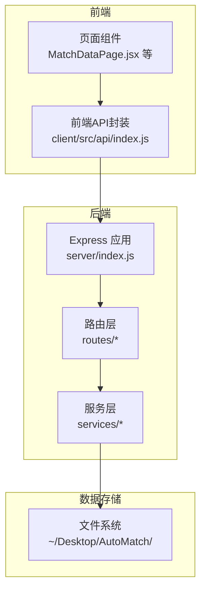
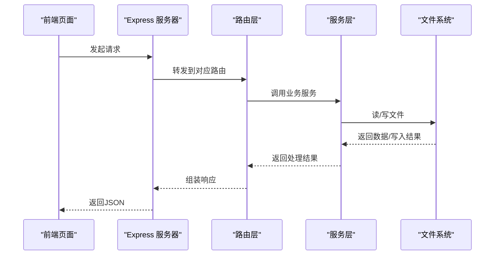
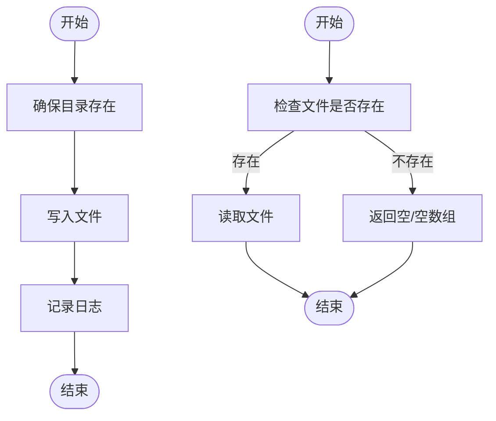
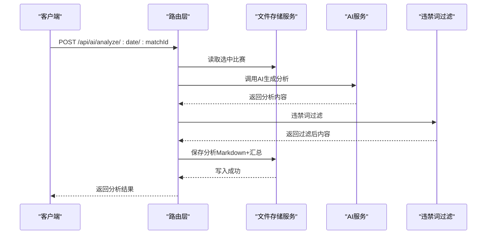
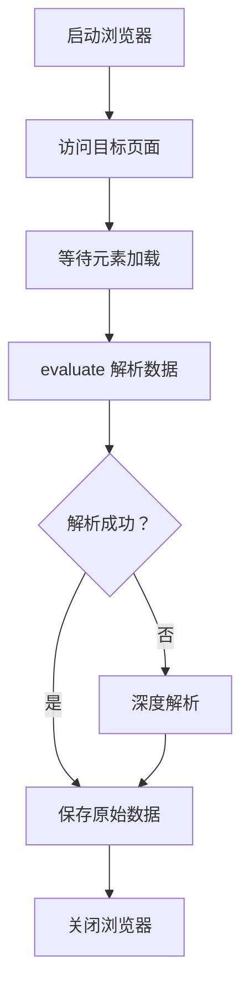
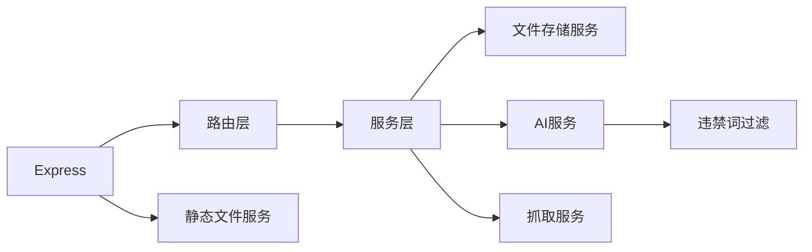
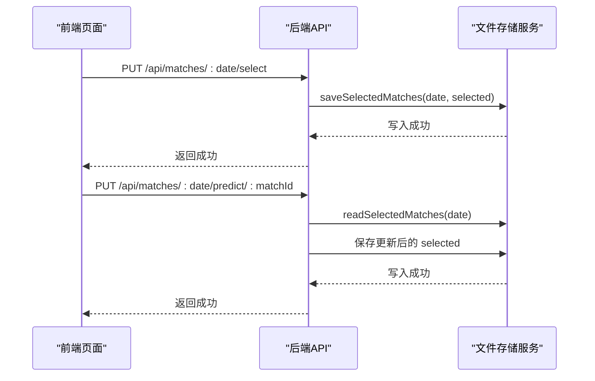

# 数据管理

<cite>
**本文引用的文件**
- [server/index.js](file://server/index.js)
- [server/services/fileStorage.js](file://server/services/fileStorage.js)
- [server/routes/matches.js](file://server/routes/matches.js)
- [server/routes/articles.js](file://server/routes/articles.js)
- [server/routes/ai.js](file://server/routes/ai.js)
- [server/routes/scrape.js](file://server/routes/scrape.js)
- [server/services/scraper.js](file://server/services/scraper.js)
- [server/services/aiService.js](file://server/services/aiService.js)
- [server/services/bannedWords.js](file://server/services/bannedWords.js)
- [client/src/api/index.js](file://client/src/api/index.js)
- [PRD.md](file://PRD.md)
- [package.json](file://package.json)
</cite>

## 目录
1. [简介](#简介)
2. [项目结构](#项目结构)
3. [核心组件](#核心组件)
4. [架构总览](#架构总览)
5. [详细组件分析](#详细组件分析)
6. [依赖关系分析](#依赖关系分析)
7. [性能考量](#性能考量)
8. [故障排查指南](#故障排查指南)
9. [结论](#结论)
10. [附录](#附录)

## 简介
本文件针对 AutoMatch 项目的“数据管理系统”进行系统化技术文档梳理，聚焦于基于文件系统的数据存储架构，涵盖数据模型设计、文件组织结构、存储策略、读写流程、数据验证与完整性检查、日期驱动的数据组织与生命周期管理、备份与恢复方案、安全与访问控制、以及维护与清理最佳实践。文档同时结合现有代码与 PRD 的设计说明，提供可视化图示与流程图，帮助非技术读者也能理解整体运作机制。

## 项目结构
AutoMatch 采用前后端分离架构：前端使用 Vite + React，后端使用 Node.js + Express；数据层完全基于本地文件系统，按“日期”维度组织，形成清晰的层级结构，便于检索与归档。

图表来源
- [server/index.js:1-49](file://server/index.js#L1-L49)
- [client/src/api/index.js:1-50](file://client/src/api/index.js#L1-L50)

章节来源
- [server/index.js:1-49](file://server/index.js#L1-L49)
- [PRD.md:205-234](file://PRD.md#L205-L234)

## 核心组件
- 文件存储服务：负责按日期组织数据、读写 JSON/Markdown 文件、提供可用日期列表、目录确保与静态文件服务。
- 路由层：提供抓取、选场、AI分析、文案生成等 API。
- 抓取服务：使用 Puppeteer 无头浏览器从指定站点抓取比赛数据，并保存到文件系统。
- AI 服务：调用智谱 GLM-4 生成分析与文案，内置违禁词过滤。
- 前端 API 封装：统一请求方法与错误处理，便于页面调用。

章节来源
- [server/services/fileStorage.js:1-196](file://server/services/fileStorage.js#L1-L196)
- [server/routes/matches.js:1-75](file://server/routes/matches.js#L1-L75)
- [server/routes/ai.js:1-102](file://server/routes/ai.js#L1-L102)
- [server/routes/articles.js:1-113](file://server/routes/articles.js#L1-L113)
- [server/routes/scrape.js:1-26](file://server/routes/scrape.js#L1-L26)
- [server/services/scraper.js:1-295](file://server/services/scraper.js#L1-L295)
- [server/services/aiService.js:1-212](file://server/services/aiService.js#L1-L212)
- [client/src/api/index.js:1-50](file://client/src/api/index.js#L1-L50)

## 架构总览
后端通过 Express 提供 REST API，前端通过统一的 fetch 封装调用 API。数据读写全部落地到文件系统，按“YYYY-MM-DD”日期目录分层，子目录包含“原始数据”、“重点比赛”、“AI分析”、“公众号文案”、“直播文案”。静态文件服务允许直接访问数据文件。

图表来源
- [server/index.js:14-25](file://server/index.js#L14-L25)
- [server/routes/matches.js:18-35](file://server/routes/matches.js#L18-L35)
- [server/services/fileStorage.js:32-48](file://server/services/fileStorage.js#L32-L48)

## 详细组件分析

### 文件存储服务（fileStorage）
- 目录结构与命名约定
  - 基础目录：可通过环境变量配置，默认位于桌面 AutoMatch 目录。
  - 日期目录：按“YYYY-MM-DD”命名。
  - 子目录：
    - 01_原始数据：保存当日抓取的原始比赛数据（matches.json）。
    - 02_重点比赛：保存选中的重点比赛与预测（selected.json）。
    - 03_AI分析：保存单场分析 Markdown 与汇总 JSON（all_analyses.json）。
    - 04_公众号文案：保存公众号推文 Markdown 与 JSON（wechat_article.md, wechat_article.json）。
    - 05_直播文案：保存直播脚本文档与 JSON（live_script.md, live_script.json）。
- 读写接口
  - 原始数据：saveRawMatches/readRawMatches
  - 重点比赛：saveSelectedMatches/readSelectedMatches
  - AI分析：saveAnalysis/readAnalyses（单场 Markdown + 汇总 JSON）
  - 文案：saveWechatArticle/saveLiveScript/readWechatArticle/readLiveScript
  - 辅助：ensureDir/getToday/getDateDir/getAvailableDates/readMarkdownFile
- 数据完整性与一致性
  - 读取时对文件存在性进行判断，不存在返回空值或空数组。
  - AI分析保存时先读取已有汇总，再更新或追加，保证多场分析的合并一致性。
  - 文案保存时同时写入 Markdown 与 JSON，便于展示与二次处理。
- 静态文件服务
  - 后端提供 /data 前缀静态服务，直接访问数据文件，便于调试与导出。

图表来源
- [server/services/fileStorage.js:9-13](file://server/services/fileStorage.js#L9-L13)
- [server/services/fileStorage.js:32-39](file://server/services/fileStorage.js#L32-L39)
- [server/services/fileStorage.js:44-48](file://server/services/fileStorage.js#L44-L48)

章节来源
- [server/services/fileStorage.js:1-196](file://server/services/fileStorage.js#L1-L196)
- [server/index.js:17-19](file://server/index.js#L17-L19)

### 路由层（API）
- 抓取相关
  - POST /api/scrape：触发抓取并返回结果数量与数据。
- 比赛数据
  - GET /api/matches/dates：获取所有有数据的日期列表。
  - GET /api/matches/:date：获取指定日期的原始数据与重点比赛。
  - PUT /api/matches/:date/select：保存选中的重点比赛。
  - PUT /api/matches/:date/predict/:matchId：保存单场预测。
- AI分析
  - POST /api/ai/analyze/:date/:matchId：生成单场 AI 分析。
  - POST /api/ai/analyze/:date/batch：批量生成 AI 分析。
  - GET /api/ai/analyses/:date：获取指定日期所有 AI 分析。
  - PUT /api/ai/analyses/:date/:matchId：更新 AI 分析内容。
- 文案生成
  - POST /api/articles/wechat/:date：生成公众号推文。
  - POST /api/articles/live/:date：生成直播脚本。
  - GET /api/articles/:date：获取指定日期所有文案。

图表来源
- [server/routes/ai.js:10-34](file://server/routes/ai.js#L10-L34)
- [server/services/aiService.js:18-65](file://server/services/aiService.js#L18-L65)
- [server/services/bannedWords.js:70-96](file://server/services/bannedWords.js#L70-L96)
- [server/services/fileStorage.js:74-98](file://server/services/fileStorage.js#L74-L98)

章节来源
- [server/routes/matches.js:1-75](file://server/routes/matches.js#L1-L75)
- [server/routes/ai.js:1-102](file://server/routes/ai.js#L1-L102)
- [server/routes/articles.js:1-113](file://server/routes/articles.js#L1-L113)
- [server/routes/scrape.js:1-26](file://server/routes/scrape.js#L1-L26)

### 抓取服务（scraper）
- 浏览器自动化
  - 使用 Puppeteer 启动无头浏览器，设置 User-Agent、视口与参数，访问目标页面。
  - 等待页面元素加载稳定后，通过 evaluate 解析表格数据。
- 数据解析
  - 支持多种选择器与结构，兼容页面变化。
  - 若标准解析失败，回退到深度解析（基于文本正则与常见联赛名识别）。
- 数据补全
  - 为每条数据补充唯一 ID（若缺失）、抓取时间戳与索引。
- 保存
  - 保存到当日日期目录下的“01_原始数据/matches.json”。

图表来源
- [server/services/scraper.js:22-214](file://server/services/scraper.js#L22-L214)
- [server/services/scraper.js:219-292](file://server/services/scraper.js#L219-L292)
- [server/services/fileStorage.js:32-39](file://server/services/fileStorage.js#L32-L39)

章节来源
- [server/services/scraper.js:1-295](file://server/services/scraper.js#L1-L295)

### AI 服务与违禁词过滤
- AI 服务
  - 通过智谱 SDK 调用 GLM-4，构造结构化 Prompt，生成分析文案与公众号/直播文案。
  - 对输出进行时间戳与元数据封装。
- 违禁词过滤
  - 提供映射表与过滤函数，支持检测与替换，按词长降序优先匹配，清理多余空白与标点。
  - 过滤后文案同时写入 Markdown 与 JSON，便于展示与二次处理。

章节来源
- [server/services/aiService.js:1-212](file://server/services/aiService.js#L1-L212)
- [server/services/bannedWords.js:1-114](file://server/services/bannedWords.js#L1-L114)

### 前端 API 封装
- 统一请求封装：自动附加 JSON Content-Type，统一错误处理（当响应 success=false 时抛错）。
- 暴露常用方法：抓取、日期查询、比赛读写、AI分析、文案生成等。
- 与后端 API 路由一一对应，便于页面组件直接调用。

章节来源
- [client/src/api/index.js:1-50](file://client/src/api/index.js#L1-L50)

## 依赖关系分析
- 后端依赖
  - Express：提供 Web 服务与静态文件服务。
  - Puppeteer：用于网页抓取。
  - zhipuai-sdk-nodejs-v4：调用智谱 AI。
  - dotenv：读取环境变量。
- 前端依赖
  - Vite + React：构建与运行前端应用。
- 内部模块耦合
  - 路由层依赖服务层；服务层依赖文件存储服务；AI 服务依赖违禁词过滤模块。
  - 抓取服务与文件存储服务耦合紧密，抓取完成后直接保存到文件系统。

图表来源
- [server/index.js:14-25](file://server/index.js#L14-L25)
- [package.json:15-21](file://package.json#L15-L21)

章节来源
- [package.json:15-21](file://package.json#L15-L21)
- [server/index.js:14-25](file://server/index.js#L14-L25)

## 性能考量
- 抓取性能
  - 无头浏览器启动与页面渲染耗时较长，建议在空闲时段执行，或限制并发。
  - 页面等待策略已优化，但仍需考虑网络波动与目标站点稳定性。
- AI 生成
  - 单场生成时间受网络与模型响应影响，建议批量生成时做好错误兜底与重试策略。
- 文件 I/O
  - JSON/Markdown 写入为同步操作，建议在后台任务中执行，避免阻塞主线程。
- 前端交互
  - 前端 fetch 默认超时较短，建议在 UI 中增加加载提示与错误反馈。

[本节为通用性能建议，无需特定文件来源]

## 故障排查指南
- 抓取失败
  - 检查浏览器路径与环境变量 CHROME_PATH 是否正确。
  - 确认目标站点结构变化导致的选择器失效，必要时更新解析逻辑。
  - 查看浏览器日志与异常堆栈，定位具体步骤。
- AI 生成失败
  - 确认 ZHIPU_API_KEY 已正确配置且未为默认占位符。
  - 检查网络连通性与模型可用性。
- 文件读写异常
  - 确认 DATA_DIR 或默认目录权限是否可写。
  - 检查文件是否存在与格式是否正确（JSON/Markdown）。
- 违禁词过滤问题
  - 如出现误删或漏删，检查映射表与匹配顺序，必要时扩展规则。
- 前端调用报错
  - 检查后端健康检查 /api/health 与 CORS 配置。
  - 确认前端 API 封装的错误处理逻辑是否被正确捕获。

章节来源
- [server/services/scraper.js:10-17](file://server/services/scraper.js#L10-L17)
- [server/services/aiService.js:8-13](file://server/services/aiService.js#L8-L13)
- [server/index.js:40-43](file://server/index.js#L40-L43)
- [server/services/bannedWords.js:70-96](file://server/services/bannedWords.js#L70-L96)
- [client/src/api/index.js:3-13](file://client/src/api/index.js#L3-L13)

## 结论
AutoMatch 的数据管理以“日期驱动”的文件系统为核心，实现了从数据抓取、选场预测、AI 分析到文案生成的完整流水线。通过清晰的目录结构与统一的服务接口，系统具备良好的可维护性与可扩展性。建议在生产环境中进一步完善错误监控、备份策略与访问控制，以提升稳定性与安全性。

[本节为总结性内容，无需特定文件来源]

## 附录

### 数据模型与文件组织
- 日期目录：YYYY-MM-DD
- 子目录与文件：
  - 01_原始数据/matches.json
  - 02_重点比赛/selected.json
  - 03_AI分析/match_{id}_analysis.md 与 all_analyses.json
  - 04_公众号文案/wechat_article.md 与 wechat_article.json
  - 05_直播文案/live_script.md 与 live_script.json

章节来源
- [PRD.md:210-228](file://PRD.md#L210-L228)
- [server/services/fileStorage.js:32-157](file://server/services/fileStorage.js#L32-L157)

### 数据读写流程（选场与预测）

图表来源
- [server/routes/matches.js:40-72](file://server/routes/matches.js#L40-L72)
- [server/services/fileStorage.js:53-69](file://server/services/fileStorage.js#L53-L69)

### 数据验证与完整性检查
- 文件存在性检查：读取前先判断文件是否存在，不存在返回空值或空数组。
- AI 分析合并：读取 all_analyses.json，若存在则更新同 matchId 的条目，否则追加。
- 文案保存：同时写入 Markdown 与 JSON，确保展示与二次处理的一致性。

章节来源
- [server/services/fileStorage.js:44-48](file://server/services/fileStorage.js#L44-L48)
- [server/services/fileStorage.js:84-94](file://server/services/fileStorage.js#L84-L94)
- [server/services/fileStorage.js:118-119](file://server/services/fileStorage.js#L118-L119)

### 日期驱动的数据组织与生命周期
- 组织方式：以日期为根目录，便于按日归档与检索。
- 生命周期：
  - 原始数据：抓取后保存，长期保留。
  - 重点比赛与预测：每日更新，可作为后续分析与文案的基础。
  - AI 分析与文案：按需生成，可长期保留用于复盘与知识沉淀。
- 清理建议：定期归档历史日期目录，删除不再使用的中间文件或仅保留关键产物。

章节来源
- [server/services/fileStorage.js:162-168](file://server/services/fileStorage.js#L162-L168)
- [PRD.md:205-234](file://PRD.md#L205-L234)

### 备份、恢复与迁移
- 备份
  - 直接复制 AutoMatch 目录至外部存储（云盘/移动硬盘）。
  - 建议在每次生成公众号/直播文案后进行一次增量备份。
- 恢复
  - 将备份目录覆盖到原位置，重启后端服务即可恢复。
- 迁移
  - 在新机器上安装依赖，配置 DATA_DIR 指向备份目录，启动服务。
  - 如需跨平台迁移，注意路径分隔符与权限设置。

章节来源
- [server/index.js:17-19](file://server/index.js#L17-L19)
- [PRD.md:207-208](file://PRD.md#L207-L208)

### 数据安全与访问控制
- 环境变量
  - ZHIPU_API_KEY 必须配置在 .env 文件中，避免硬编码。
- 本地运行
  - 服务默认不对外暴露，仅本地访问，降低泄露风险。
- 静态文件访问
  - /data 前缀可直接访问数据文件，建议仅在本地开发环境使用，生产环境谨慎开放。

章节来源
- [server/services/aiService.js:8-13](file://server/services/aiService.js#L8-L13)
- [server/index.js:17-19](file://server/index.js#L17-L19)

### 维护与清理最佳实践
- 定期巡检
  - 检查 DATA_DIR 权限与磁盘空间。
  - 校验 JSON/Markdown 文件格式有效性。
- 日常维护
  - 每日抓取后清理临时缓存与无用中间文件。
  - 对历史日期目录进行压缩归档，减少占用。
- 版本与变更
  - 修改文件结构或字段时，提供迁移脚本与兼容逻辑。
  - 记录每次变更日志，便于回溯。

[本节为通用维护建议，无需特定文件来源]