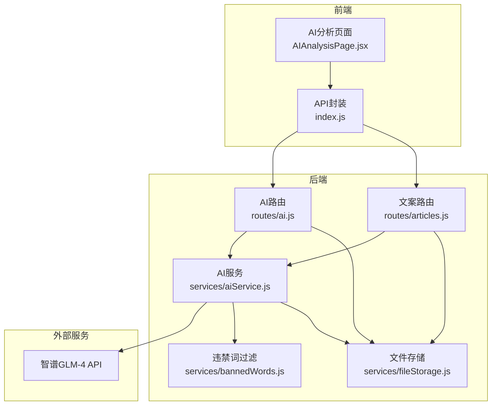
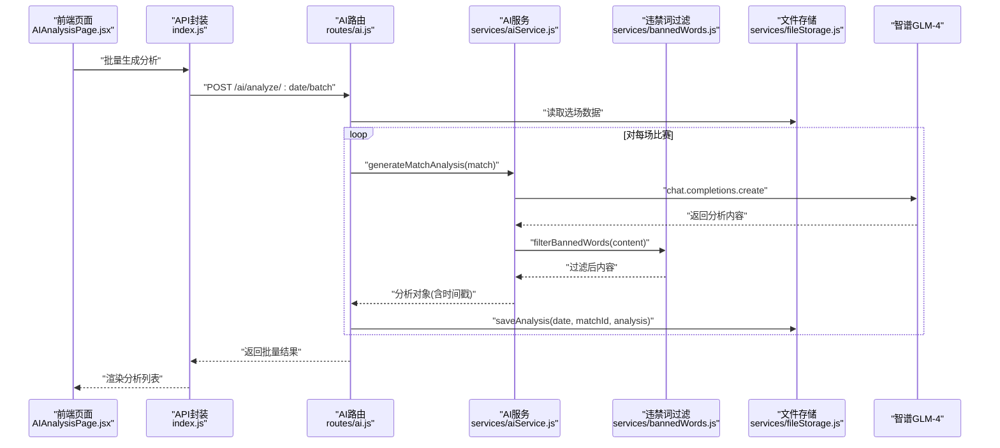
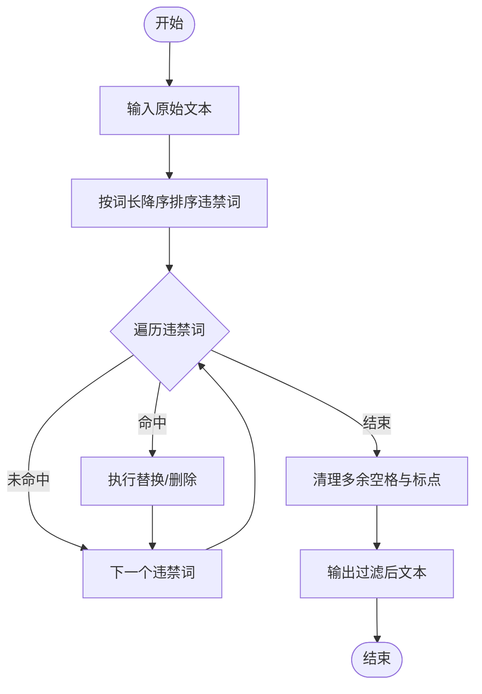
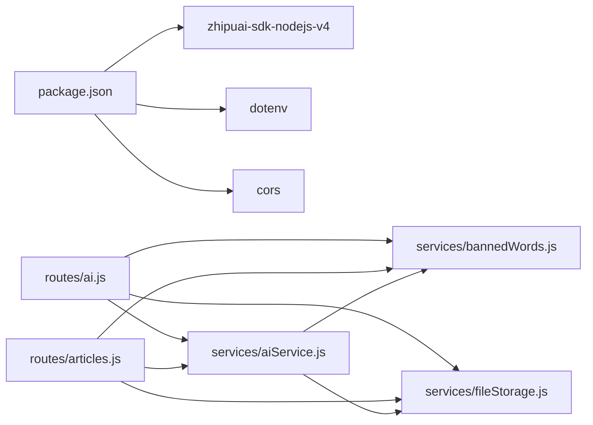

# AI辅助分析模块

<cite>
**本文档引用的文件**
- [aiService.js](file://server/services/aiService.js)
- [ai.js](file://server/routes/ai.js)
- [bannedWords.js](file://server/services/bannedWords.js)
- [fileStorage.js](file://server/services/fileStorage.js)
- [AIAnalysisPage.jsx](file://client/src/pages/AIAnalysisPage.jsx)
- [index.js](file://client/src/api/index.js)
- [articles.js](file://server/routes/articles.js)
- [PRD.md](file://PRD.md)
- [package.json](file://package.json)
</cite>

## 目录
1. [简介](#简介)
2. [项目结构](#项目结构)
3. [核心组件](#核心组件)
4. [架构概览](#架构概览)
5. [详细组件分析](#详细组件分析)
6. [依赖关系分析](#依赖关系分析)
7. [性能考虑](#性能考虑)
8. [故障排查指南](#故障排查指南)
9. [结论](#结论)
10. [附录](#附录)

## 简介
本模块为AutoMatch项目的AI辅助分析子系统，基于智谱GLM-4大模型实现“单场赛事分析”“公众号推文”“直播文案”的自动化生成。系统通过Prompt工程设计，确保输出符合合规要求；结合违禁词过滤机制，保障内容安全；并通过本地文件系统进行分析结果的持久化与版本管理。前端提供一键批量生成、查看/编辑、复制等交互能力，形成从数据到分析再到内容产出的完整工作流。

## 项目结构
AI辅助分析模块由后端服务、前端页面与数据存储三层组成：
- 后端服务层：Express路由与AI服务封装，负责API编排、调用智谱GLM-4、执行违禁词过滤与文件落盘。
- 前端页面层：React组件负责展示选场数据、触发AI分析、查看/编辑分析结果。
- 数据存储层：本地文件系统按日期组织，支持原始数据、选场预测、AI分析、公众号文案、直播文案的分层存储。

图表来源
- [ai.js:1-102](file://server/routes/ai.js#L1-L102)
- [articles.js:1-113](file://server/routes/articles.js#L1-L113)
- [aiService.js:1-212](file://server/services/aiService.js#L1-L212)
- [bannedWords.js:1-114](file://server/services/bannedWords.js#L1-L114)
- [fileStorage.js:1-196](file://server/services/fileStorage.js#L1-L196)

章节来源
- [ai.js:1-102](file://server/routes/ai.js#L1-L102)
- [articles.js:1-113](file://server/routes/articles.js#L1-L113)
- [aiService.js:1-212](file://server/services/aiService.js#L1-L212)
- [bannedWords.js:1-114](file://server/services/bannedWords.js#L1-L114)
- [fileStorage.js:1-196](file://server/services/fileStorage.js#L1-L196)
- [AIAnalysisPage.jsx:1-203](file://client/src/pages/AIAnalysisPage.jsx#L1-L203)
- [index.js:1-50](file://client/src/api/index.js#L1-L50)

## 核心组件
- 智谱AI服务封装：封装GLM-4调用、Prompt构造、温度与Token限制、错误处理。
- 违禁词过滤：提供违禁词映射表与过滤/检测函数，支持公众号与直播文案的合规化。
- 文件存储服务：按日期分层存储，支持单场分析Markdown与汇总JSON、公众号/直播文案的Markdown与JSON。
- AI分析路由：提供单场分析生成、批量分析生成、查询与更新分析内容的REST接口。
- 文案生成路由：基于选场与分析结果生成公众号推文与直播脚本，并执行违禁词过滤。
- 前端页面：展示选场与分析结果，支持一键批量生成、复制、编辑与保存。

章节来源
- [aiService.js:1-212](file://server/services/aiService.js#L1-L212)
- [bannedWords.js:1-114](file://server/services/bannedWords.js#L1-L114)
- [fileStorage.js:1-196](file://server/services/fileStorage.js#L1-L196)
- [ai.js:1-102](file://server/routes/ai.js#L1-L102)
- [articles.js:1-113](file://server/routes/articles.js#L1-L113)
- [AIAnalysisPage.jsx:1-203](file://client/src/pages/AIAnalysisPage.jsx#L1-L203)
- [index.js:1-50](file://client/src/api/index.js#L1-L50)

## 架构概览
AI辅助分析模块采用“前端请求—后端路由—AI服务—外部模型—存储服务”的链路。关键流程如下：
- 前端触发分析请求（单场/批量），后端路由读取选场数据，调用AI服务生成分析内容。
- AI服务构造Prompt并调用GLM-4，返回内容后执行违禁词过滤，再写入文件系统。
- 前端可查看/编辑分析结果，支持复制与保存更新。

图表来源
- [ai.js:36-69](file://server/routes/ai.js#L36-L69)
- [aiService.js:18-65](file://server/services/aiService.js#L18-L65)
- [bannedWords.js:70-96](file://server/services/bannedWords.js#L70-L96)
- [fileStorage.js:74-98](file://server/services/fileStorage.js#L74-L98)

## 详细组件分析

### 智谱GLM-4集成与Prompt工程
- 集成方式
  - 通过zhipuai-sdk-nodejs-v4 SDK初始化客户端，使用环境变量中的API Key。
  - 调用chat.completions.create接口，指定模型为glm-4，设置temperature与max_tokens。
- Prompt设计
  - 单场分析：围绕赔率与让球盘口切入，强调逻辑闭环、结论明确、语言专业但不晦涩，字数控制在约200字，并严格避免违禁词。
  - 公众号推文：标题吸睛、开头制造悬念、重点分析最热比赛、用“数据视角”替代敏感词、全文800-1200字。
  - 直播脚本：开场白、逐场分析（每场约300-400字）、结尾互动引导，总字数约1500-2500字，仅从基本面角度分析。
- 违禁词替换策略
  - 提供完整的违禁词映射表，覆盖“盘口/水位/庄家/博彩/投注/赔率/大小球/串关/让球盘”等高频敏感词，统一替换为合规表达或直接删除。

章节来源
- [aiService.js:1-212](file://server/services/aiService.js#L1-L212)
- [bannedWords.js:1-114](file://server/services/bannedWords.js#L1-L114)
- [PRD.md:91-202](file://PRD.md#L91-L202)

### 违禁词过滤机制
- 实现原理
  - 基于预定义映射表，按词长降序匹配，优先替换长词，避免短词误判。
  - 对无替换词的违禁词直接删除；对有替换词的进行替换。
  - 过滤后清理多余空格与重复标点，保证输出整洁。
- 过滤规则
  - 公众号/直播文案均适用同一映射表，确保跨渠道一致性。
  - 支持检测与过滤两种模式，便于前端展示“已过滤违禁词”提示。
- 处理策略
  - 生成内容后立即执行过滤，若发现违禁词，将found数组回传至前端，便于审计与复核。

图表来源
- [bannedWords.js:70-96](file://server/services/bannedWords.js#L70-L96)

章节来源
- [bannedWords.js:1-114](file://server/services/bannedWords.js#L1-L114)

### AI分析业务逻辑与输出规范
- 业务逻辑
  - 单场分析：基于选场数据与分析师预测生成约200字的专业分析，强调数据驱动与逻辑闭环。
  - 批量分析：遍历选场集合，逐场生成并落盘，异常场次记录错误信息，其余结果正常返回。
  - 查询与更新：支持按日期获取全部分析，以及按日期+比赛ID更新分析内容。
- 输出格式
  - 单场分析：包含matchId、homeTeam、awayTeam、prediction、content、createdAt等字段。
  - 批量分析：返回数组，元素为单场分析对象或错误对象。
  - 违禁词检测：在分析对象中附加bannedWordsFound字段，记录发现的违禁词列表。
- 合规要求
  - Prompt中明确禁止使用盘口、庄家、博彩、投注、赔率等敏感词，并提供替代词表。
  - 生成后再次执行过滤，确保输出合规。

章节来源
- [aiService.js:18-65](file://server/services/aiService.js#L18-L65)
- [ai.js:10-34](file://server/routes/ai.js#L10-L34)
- [ai.js:39-69](file://server/routes/ai.js#L39-L69)

### 分析结果存储结构与版本管理
- 存储位置与目录结构
  - 基于环境变量DATA_DIR或桌面AutoMatch目录，按日期分层组织。
  - AI分析目录包含每场比赛的Markdown文件与all_analyses.json汇总文件。
- 版本管理
  - 每场比赛独立文件，便于增量更新与版本对比。
  - 汇总JSON记录所有分析元数据，支持快速检索与二次加工。
- 质量评估
  - 前端展示bannedWordsFound，便于人工复核。
  - 支持编辑与保存，允许对AI生成内容进行二次优化。

章节来源
- [fileStorage.js:74-98](file://server/services/fileStorage.js#L74-L98)
- [PRD.md:205-234](file://PRD.md#L205-L234)

### API接口文档
- 单场AI分析
  - 方法与路径：POST /api/ai/analyze/:date/:matchId
  - 触发条件：选场数据中存在对应matchId且非空。
  - 参数：路径参数date、matchId；请求体为空。
  - 返回：success与data（分析对象），包含违禁词检测结果。
- 批量AI分析
  - 方法与路径：POST /api/ai/analyze/:date/batch
  - 触发条件：选场数据非空。
  - 参数：路径参数date；请求体为空。
  - 返回：success与data（数组，元素为分析对象或错误对象）。
- 查询分析
  - 方法与路径：GET /api/ai/analyses/:date
  - 触发条件：存在该日期的分析汇总。
  - 返回：success与data（分析数组）。
- 更新分析
  - 方法与路径：PUT /api/ai/analyses/:date/:matchId
  - 参数：content（分析内容）。
  - 返回：success。
- 前端调用封装
  - 提供generateAnalysis、batchGenerateAnalysis、getAnalyses、updateAnalysis等方法，统一错误处理与响应解析。

章节来源
- [ai.js:1-102](file://server/routes/ai.js#L1-L102)
- [index.js:32-42](file://client/src/api/index.js#L32-L42)

### 前端交互与用户体验
- 页面功能
  - 加载选场与分析数据，展示比赛信息与分析师预测。
  - 一键批量生成AI分析，显示进度与结果数量。
  - 支持复制分析内容、进入编辑模式并保存更新。
- 错误处理
  - 未选中比赛时提示警告；生成失败弹出错误消息；保存失败给出反馈。
- 与后端协作
  - 通过API封装统一调用，错误统一拦截，提升用户体验。

章节来源
- [AIAnalysisPage.jsx:1-203](file://client/src/pages/AIAnalysisPage.jsx#L1-L203)
- [index.js:1-50](file://client/src/api/index.js#L1-L50)

## 依赖关系分析
- 外部依赖
  - zhipuai-sdk-nodejs-v4：调用GLM-4模型。
  - dotenv：读取环境变量（如ZHIPU_API_KEY）。
  - cors：跨域支持。
- 内部依赖
  - routes依赖services（aiService、bannedWords、fileStorage）。
  - aiService依赖bannedWords与fileStorage。
  - 前端API封装依赖后端路由。

图表来源
- [package.json:15-21](file://package.json#L15-L21)
- [ai.js:1-102](file://server/routes/ai.js#L1-L102)
- [articles.js:1-113](file://server/routes/articles.js#L1-L113)
- [aiService.js:1-212](file://server/services/aiService.js#L1-L212)
- [bannedWords.js:1-114](file://server/services/bannedWords.js#L1-L114)
- [fileStorage.js:1-196](file://server/services/fileStorage.js#L1-L196)

章节来源
- [package.json:1-23](file://package.json#L1-L23)
- [ai.js:1-102](file://server/routes/ai.js#L1-L102)
- [articles.js:1-113](file://server/routes/articles.js#L1-L113)
- [aiService.js:1-212](file://server/services/aiService.js#L1-L212)
- [bannedWords.js:1-114](file://server/services/bannedWords.js#L1-L114)
- [fileStorage.js:1-196](file://server/services/fileStorage.js#L1-L196)

## 性能考虑
- 模型调用
  - 控制temperature与max_tokens，平衡创造性与稳定性；单场分析建议在10秒内完成。
- 批量处理
  - 批量生成时逐场处理并落盘，异常场次不影响整体流程，提高鲁棒性。
- 存储效率
  - 每场比赛独立Markdown文件，便于增量更新与版本对比；汇总JSON便于快速检索。
- 前端体验
  - 批量生成时显示加载状态与消息提示，避免重复提交。

## 故障排查指南
- 环境变量缺失
  - 症状：初始化客户端时报错，提示未配置ZHIPU_API_KEY。
  - 处理：在.env文件中正确配置API Key。
- 未找到比赛
  - 症状：单场分析返回404，提示未找到该比赛。
  - 处理：确认选场数据已保存且matchId正确。
- 生成失败
  - 症状：AI分析生成异常，后端打印错误日志。
  - 处理：检查网络连接、模型可用性与Prompt构造；前端弹出错误消息。
- 违禁词问题
  - 症状：前端显示“已过滤违禁词”标签。
  - 处理：人工复核并根据需要调整分析内容，必要时修改映射表。
- 存储异常
  - 症状：保存分析或文案失败。
  - 处理：检查DATA_DIR权限与磁盘空间，确认目录存在且可写。

章节来源
- [aiService.js:8-13](file://server/services/aiService.js#L8-L13)
- [ai.js:16-18](file://server/routes/ai.js#L16-L18)
- [AIAnalysisPage.jsx:42-47](file://client/src/pages/AIAnalysisPage.jsx#L42-L47)

## 结论
AI辅助分析模块通过Prompt工程与违禁词过滤，实现了从数据到分析再到合规内容的自动化生产。其模块化设计与本地存储方案，既满足了分析师的日常需求，也为后续扩展与审计提供了便利。建议持续优化Prompt与过滤规则，完善质量评估体系，并在前端增加更多可视化与复核工具，进一步提升使用体验。

## 附录
- 代码示例路径
  - 构建单场分析Prompt与调用GLM-4：[aiService.js:18-65](file://server/services/aiService.js#L18-L65)
  - 构建公众号推文Prompt与调用GLM-4：[aiService.js:70-135](file://server/services/aiService.js#L70-L135)
  - 构建直播脚本文案Prompt与调用GLM-4：[aiService.js:140-205](file://server/services/aiService.js#L140-L205)
  - 违禁词过滤函数：[bannedWords.js:70-96](file://server/services/bannedWords.js#L70-L96)
  - 单场分析API路由：[ai.js:10-34](file://server/routes/ai.js#L10-L34)
  - 批量分析API路由：[ai.js:39-69](file://server/routes/ai.js#L39-L69)
  - 查询与更新分析API：[ai.js:74-99](file://server/routes/ai.js#L74-L99)
  - 前端批量生成与编辑：[AIAnalysisPage.jsx:31-58](file://client/src/pages/AIAnalysisPage.jsx#L31-L58)
  - 前端API封装：[index.js:32-42](file://client/src/api/index.js#L32-L42)