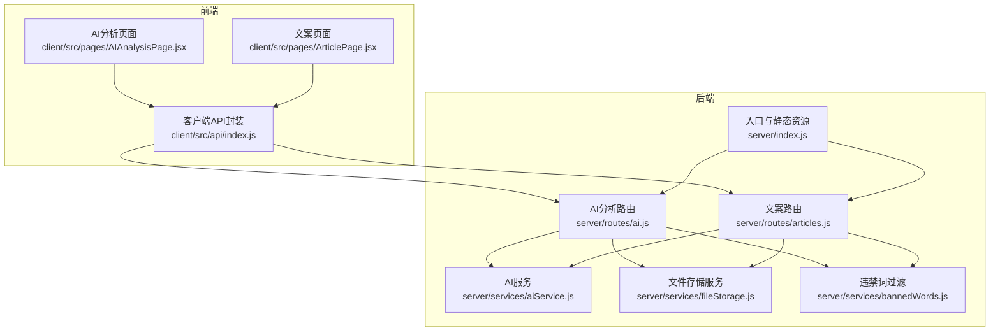
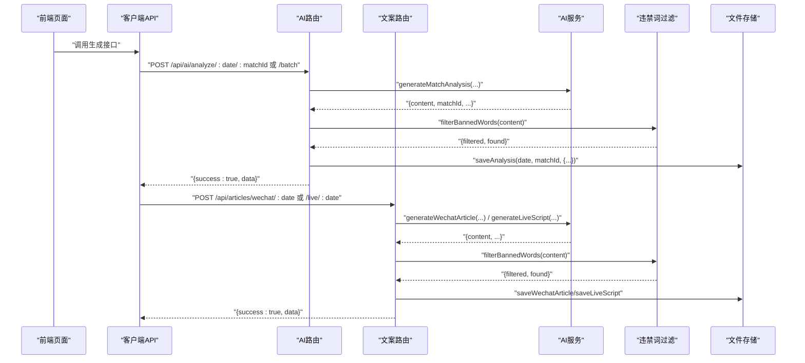
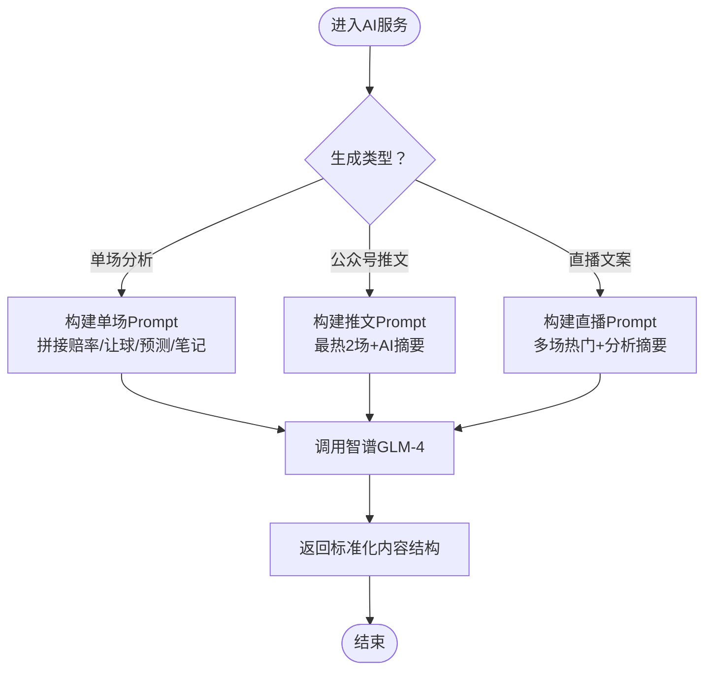
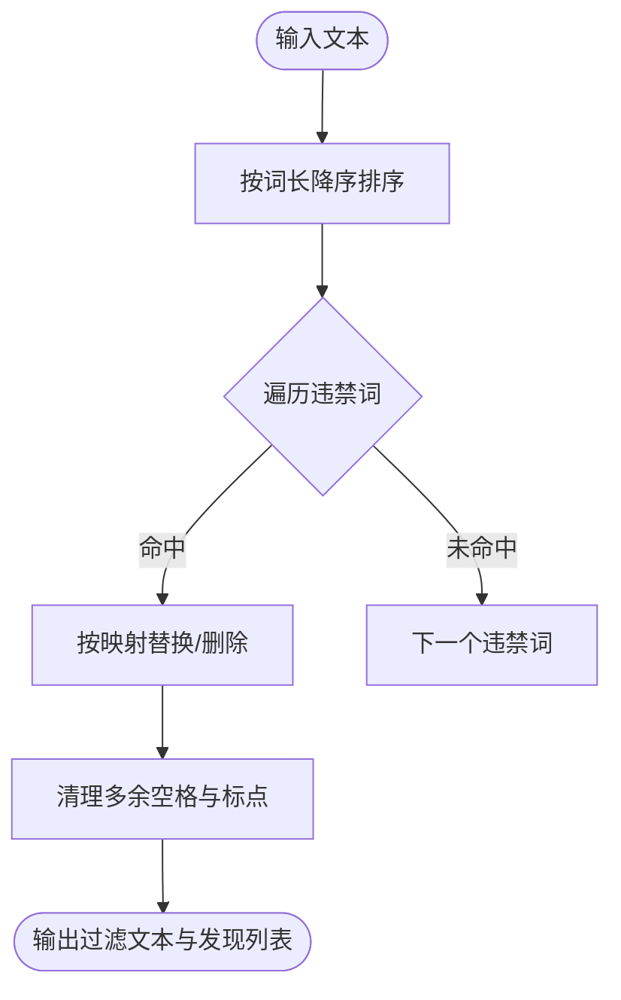
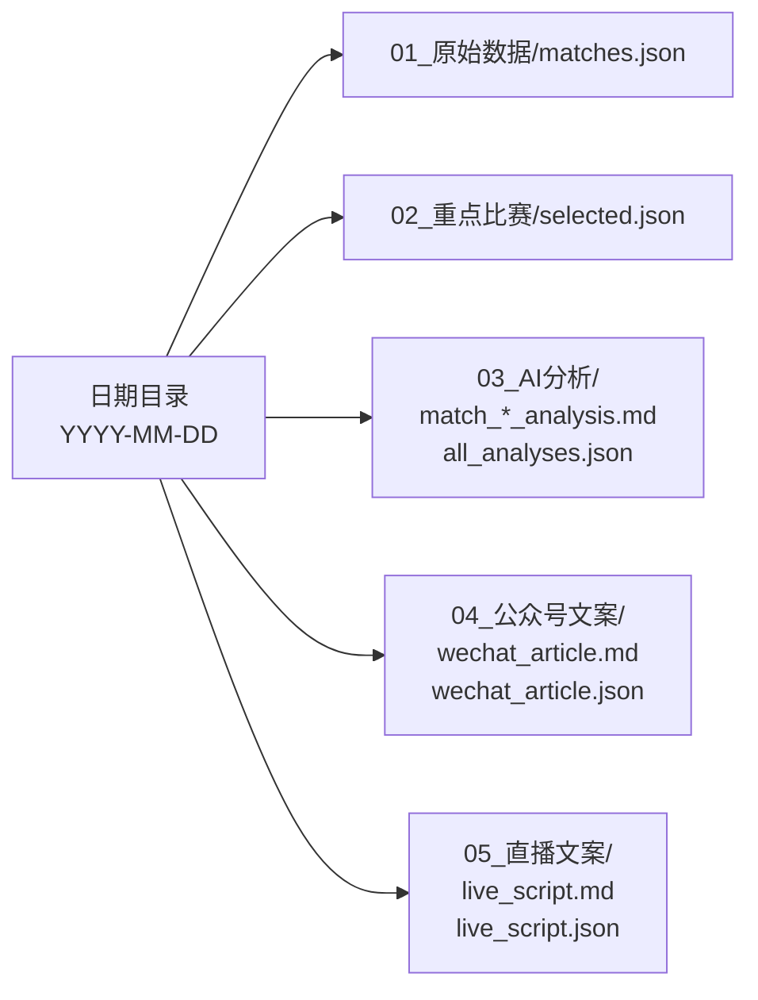
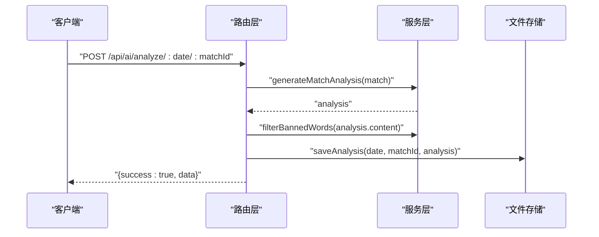
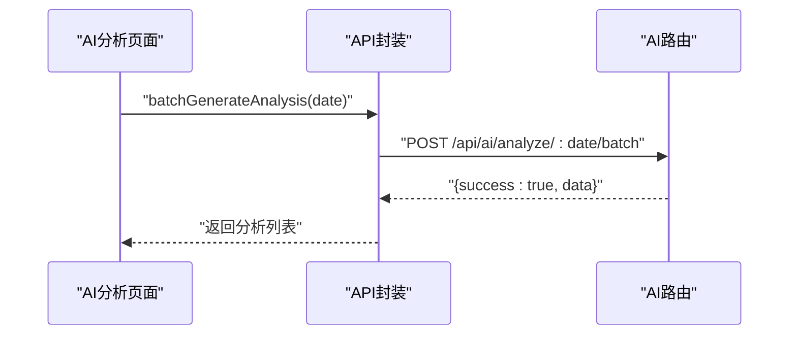
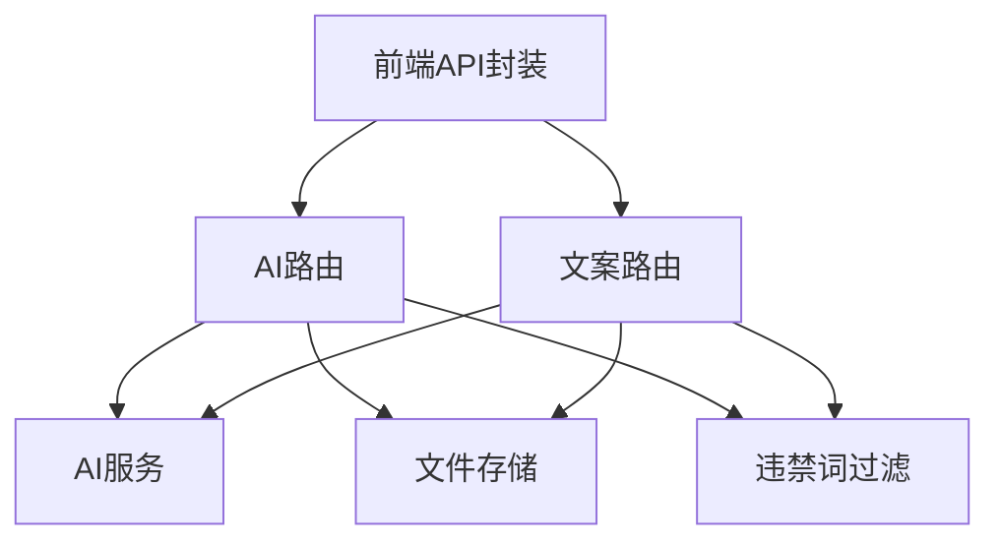

# 合规文案生成模块

<cite>
**本文引用的文件**
- [server/index.js](file://server/index.js)
- [server/routes/ai.js](file://server/routes/ai.js)
- [server/routes/articles.js](file://server/routes/articles.js)
- [server/services/aiService.js](file://server/services/aiService.js)
- [server/services/fileStorage.js](file://server/services/fileStorage.js)
- [server/services/bannedWords.js](file://server/services/bannedWords.js)
- [client/src/api/index.js](file://client/src/api/index.js)
- [client/src/pages/AIAnalysisPage.jsx](file://client/src/pages/AIAnalysisPage.jsx)
- [client/src/pages/ArticlePage.jsx](file://client/src/pages/ArticlePage.jsx)
- [PRD.md](file://PRD.md)
</cite>

## 目录
1. [简介](#简介)
2. [项目结构](#项目结构)
3. [核心组件](#核心组件)
4. [架构总览](#架构总览)
5. [详细组件分析](#详细组件分析)
6. [依赖关系分析](#依赖关系分析)
7. [性能考量](#性能考量)
8. [故障排查指南](#故障排查指南)
9. [结论](#结论)
10. [附录](#附录)

## 简介
本模块围绕AutoMatch项目的合规文案生成功能，提供公众号推文与直播文案的生成算法、模板设计与内容结构说明；解释合规性检查机制（关键词过滤与内容审核流程）、模板管理与动态参数替换、个性化定制能力；给出完整API接口文档（触发条件、输入参数、输出格式）；并通过代码示例路径展示模板引擎使用、内容渲染与多语言支持；最后说明文案存储策略、版本控制与质量评估标准。

## 项目结构
AutoMatch采用前后端分离架构：前端基于React + Ant Design，后端基于Node.js + Express，AI服务通过智谱GLM-4调用，数据存储采用本地文件系统（JSON/Markdown）。合规文案生成涉及AI分析、违禁词过滤、文案生成与存储四个关键环节。

图表来源
- [server/index.js:1-49](file://server/index.js#L1-L49)
- [server/routes/ai.js:1-102](file://server/routes/ai.js#L1-L102)
- [server/routes/articles.js:1-113](file://server/routes/articles.js#L1-L113)
- [server/services/aiService.js:1-212](file://server/services/aiService.js#L1-L212)
- [server/services/fileStorage.js:1-196](file://server/services/fileStorage.js#L1-L196)
- [server/services/bannedWords.js:1-114](file://server/services/bannedWords.js#L1-L114)
- [client/src/api/index.js:1-50](file://client/src/api/index.js#L1-L50)
- [client/src/pages/AIAnalysisPage.jsx:1-203](file://client/src/pages/AIAnalysisPage.jsx#L1-L203)
- [client/src/pages/ArticlePage.jsx:1-267](file://client/src/pages/ArticlePage.jsx#L1-L267)

章节来源
- [server/index.js:1-49](file://server/index.js#L1-L49)
- [PRD.md:205-234](file://PRD.md#L205-L234)

## 核心组件
- AI服务（aiService）：封装智谱GLM-4调用，负责生成单场AI分析、公众号推文与直播文案，内置Prompt与合规词表映射。
- 违禁词过滤（bannedWords）：提供违禁词检测与替换，支持批量过滤与统计。
- 文件存储（fileStorage）：统一管理按日期分层的数据目录，支持原始数据、重点比赛、AI分析、公众号文案、直播文案的读写与汇总。
- 路由层（ai.js、articles.js）：定义API端点，串联业务逻辑与存储服务，执行违禁词过滤与返回标准化响应。
- 前端页面（AIAnalysisPage.jsx、ArticlePage.jsx）：提供一键生成、批量生成、编辑、复制、查看违禁词过滤结果等交互。

章节来源
- [server/services/aiService.js:1-212](file://server/services/aiService.js#L1-L212)
- [server/services/bannedWords.js:1-114](file://server/services/bannedWords.js#L1-L114)
- [server/services/fileStorage.js:1-196](file://server/services/fileStorage.js#L1-L196)
- [server/routes/ai.js:1-102](file://server/routes/ai.js#L1-L102)
- [server/routes/articles.js:1-113](file://server/routes/articles.js#L1-L113)
- [client/src/pages/AIAnalysisPage.jsx:1-203](file://client/src/pages/AIAnalysisPage.jsx#L1-L203)
- [client/src/pages/ArticlePage.jsx:1-267](file://client/src/pages/ArticlePage.jsx#L1-L267)

## 架构总览
合规文案生成的端到端流程如下：
- 前端触发生成请求（AI分析或文案），后端路由接收请求。
- 路由层读取选中比赛与AI分析数据，构造Prompt并调用AI服务。
- AI服务调用智谱GLM-4生成内容，返回标准化结构。
- 路由层对生成内容执行违禁词过滤，记录发现的违禁词。
- 过滤后的文案写入文件系统，返回前端展示与复制。

图表来源
- [server/routes/ai.js:10-69](file://server/routes/ai.js#L10-L69)
- [server/routes/articles.js:10-93](file://server/routes/articles.js#L10-L93)
- [server/services/aiService.js:18-65](file://server/services/aiService.js#L18-L65)
- [server/services/aiService.js:70-135](file://server/services/aiService.js#L70-L135)
- [server/services/aiService.js:140-205](file://server/services/aiService.js#L140-L205)
- [server/services/bannedWords.js:70-96](file://server/services/bannedWords.js#L70-L96)
- [server/services/fileStorage.js:74-98](file://server/services/fileStorage.js#L74-L98)
- [server/services/fileStorage.js:112-139](file://server/services/fileStorage.js#L112-L139)

## 详细组件分析

### AI服务（aiService）
- 单场AI分析：接收比赛数据，拼装Prompt，调用智谱GLM-4生成约200字的分析，返回标准化结构（含matchId、teams、prediction、content、createdAt）。
- 公众号推文：接收最热两场比赛（含AI分析摘要），生成约800-1200字的推文，强调“数据视角”“基本面分析”，严格遵守违禁词替换清单。
- 直播文案：接收多场热门比赛，生成约1500-2500字的直播脚本，要求口语化、逻辑闭环、仅从基本面角度分析。

图表来源
- [server/services/aiService.js:18-65](file://server/services/aiService.js#L18-L65)
- [server/services/aiService.js:70-135](file://server/services/aiService.js#L70-L135)
- [server/services/aiService.js:140-205](file://server/services/aiService.js#L140-L205)

章节来源
- [server/services/aiService.js:1-212](file://server/services/aiService.js#L1-L212)

### 违禁词过滤（bannedWords）
- 违禁词映射表：覆盖“盘口/水位/庄家/博彩/投注/赔率/让球/大小球/串关”等敏感词，提供替换词或删除策略。
- 过滤策略：按词长降序匹配，优先替换长词，清理多余空格与重复标点，返回过滤后文本与发现的违禁词列表。
- 检查接口：提供快速检测是否存在违禁词的能力。

图表来源
- [server/services/bannedWords.js:70-96](file://server/services/bannedWords.js#L70-L96)
- [server/services/bannedWords.js:101-111](file://server/services/bannedWords.js#L101-L111)

章节来源
- [server/services/bannedWords.js:1-114](file://server/services/bannedWords.js#L1-L114)

### 文件存储（fileStorage）
- 目录结构：按日期分层，包含原始数据、重点比赛、AI分析、公众号文案、直播文案子目录。
- 读写策略：
  - 保存单场AI分析：Markdown文件 + all_analyses.json汇总。
  - 保存公众号/直播文案：Markdown与JSON双备份，便于前端展示与导出。
  - 读取接口：支持读取指定日期的全部分析、公众号文案、直播文案。
- 辅助功能：确保目录存在、获取可用日期列表、读取Markdown文件内容。

图表来源
- [server/services/fileStorage.js:25-48](file://server/services/fileStorage.js#L25-L48)
- [server/services/fileStorage.js:53-69](file://server/services/fileStorage.js#L53-L69)
- [server/services/fileStorage.js:74-98](file://server/services/fileStorage.js#L74-L98)
- [server/services/fileStorage.js:112-139](file://server/services/fileStorage.js#L112-L139)
- [PRD.md:210-228](file://PRD.md#L210-L228)

章节来源
- [server/services/fileStorage.js:1-196](file://server/services/fileStorage.js#L1-L196)
- [PRD.md:205-234](file://PRD.md#L205-L234)

### 路由层（ai.js、articles.js）
- AI分析路由：
  - 单场生成：校验比赛存在性，调用AI服务生成分析，执行违禁词过滤，保存并返回。
  - 批量生成：遍历选中比赛，逐个生成并保存，聚合结果返回。
  - 查询与更新：读取分析、更新分析内容（支持人工编辑）。
- 文案路由：
  - 公众号推文：从选中比赛筛选热门（isHot）或取前两场，合并AI摘要，生成并过滤后保存。
  - 直播文案：同上，生成直播脚本并过滤后保存。
  - 读取：返回公众号与直播文案的JSON结构。

图表来源
- [server/routes/ai.js:10-34](file://server/routes/ai.js#L10-L34)
- [server/routes/ai.js:39-69](file://server/routes/ai.js#L39-L69)
- [server/routes/ai.js:74-82](file://server/routes/ai.js#L74-L82)
- [server/routes/ai.js:87-99](file://server/routes/ai.js#L87-L99)
- [server/routes/articles.js:10-51](file://server/routes/articles.js#L10-L51)
- [server/routes/articles.js:56-93](file://server/routes/articles.js#L56-L93)
- [server/routes/articles.js:98-110](file://server/routes/articles.js#L98-L110)

章节来源
- [server/routes/ai.js:1-102](file://server/routes/ai.js#L1-L102)
- [server/routes/articles.js:1-113](file://server/routes/articles.js#L1-L113)

### 前端页面与API封装
- AI分析页面：支持一键批量生成、查看/编辑分析、复制、查看违禁词过滤提示。
- 文案页面：支持生成公众号推文与直播文案，复制文案、查看生成时间与违禁词过滤提示。
- API封装：统一请求方法、错误处理与响应结构断言，便于页面调用。

图表来源
- [client/src/pages/AIAnalysisPage.jsx:31-47](file://client/src/pages/AIAnalysisPage.jsx#L31-L47)
- [client/src/pages/AIAnalysisPage.jsx:49-58](file://client/src/pages/AIAnalysisPage.jsx#L49-L58)
- [client/src/api/index.js:35-37](file://client/src/api/index.js#L35-L37)
- [server/routes/ai.js:39-69](file://server/routes/ai.js#L39-L69)

章节来源
- [client/src/pages/AIAnalysisPage.jsx:1-203](file://client/src/pages/AIAnalysisPage.jsx#L1-L203)
- [client/src/pages/ArticlePage.jsx:1-267](file://client/src/pages/ArticlePage.jsx#L1-L267)
- [client/src/api/index.js:1-50](file://client/src/api/index.js#L1-L50)

## 依赖关系分析
- 路由层依赖AI服务与文件存储服务，同时调用违禁词过滤模块。
- AI服务依赖智谱SDK，内部包含Prompt与合规词表映射。
- 前端通过API封装统一调用后端接口，页面逻辑与后端解耦。
- 存储服务提供统一的文件读写与目录管理，保证数据一致性。

图表来源
- [server/routes/ai.js:3-5](file://server/routes/ai.js#L3-L5)
- [server/routes/articles.js:3-5](file://server/routes/articles.js#L3-L5)
- [server/services/aiService.js:1-13](file://server/services/aiService.js#L1-L13)
- [client/src/api/index.js:1-13](file://client/src/api/index.js#L1-L13)

章节来源
- [server/routes/ai.js:1-102](file://server/routes/ai.js#L1-L102)
- [server/routes/articles.js:1-113](file://server/routes/articles.js#L1-L113)
- [server/services/aiService.js:1-212](file://server/services/aiService.js#L1-L212)
- [client/src/api/index.js:1-50](file://client/src/api/index.js#L1-L50)

## 性能考量
- AI生成耗时：单场分析建议控制在10秒以内，批量生成需考虑并发与限流策略。
- 文案生成：公众号推文与直播文案字数较大，需合理设置max_tokens与temperature，平衡质量与速度。
- 存储IO：批量写入时建议合并写操作，减少磁盘抖动。
- 前端交互：生成过程中提供加载提示与进度反馈，避免重复提交。

## 故障排查指南
- API Key配置：若出现“请在.env文件中配置ZHIPU_API_KEY”的错误，请检查环境变量是否正确设置。
- 日期目录不存在：首次运行时确保DATA_DIR指向的目录存在或允许自动创建。
- 违禁词过滤异常：若发现过滤结果不符合预期，检查违禁词映射表是否覆盖目标词汇。
- 前端报错：统一错误处理会将后端返回的error字段抛出，前端通过message提示用户。

章节来源
- [server/services/aiService.js:9-13](file://server/services/aiService.js#L9-L13)
- [server/services/fileStorage.js:9-13](file://server/services/fileStorage.js#L9-L13)
- [client/src/api/index.js:9-12](file://client/src/api/index.js#L9-L12)

## 结论
本模块通过明确的流程设计与严格的合规机制，实现了从AI分析到公众号推文与直播文案的自动化生成。违禁词过滤与Prompt设计确保内容符合平台规范；文件存储与API封装提供了良好的扩展性与可维护性。建议在生产环境中进一步完善质量评估与版本控制策略，持续优化Prompt与过滤规则。

## 附录

### API接口文档

- 单场AI分析
  - 方法与路径：POST /api/ai/analyze/:date/:matchId
  - 触发条件：选中比赛且存在对应matchId
  - 输入参数：路径参数date、matchId
  - 输出格式：{ success: boolean, data: { matchId, homeTeam, awayTeam, prediction, content, createdAt, bannedWordsFound? } }
  - 说明：生成约200字分析，执行违禁词过滤，保存至03_AI分析目录

- 批量AI分析
  - 方法与路径：POST /api/ai/analyze/:date/batch
  - 触发条件：存在选中比赛
  - 输入参数：路径参数date
  - 输出格式：{ success: boolean, data: Array<{ matchId, content, createdAt, bannedWordsFound? }> }
  - 说明：逐场生成并保存，聚合结果返回

- 获取AI分析
  - 方法与路径：GET /api/ai/analyses/:date
  - 触发条件：存在该日期的AI分析
  - 输出格式：{ success: boolean, data: Array }

- 更新AI分析
  - 方法与路径：PUT /api/ai/analyses/:date/:matchId
  - 触发条件：存在该日期与matchId
  - 输入参数：{ content }
  - 输出格式：{ success: boolean }

- 公众号推文
  - 方法与路径：POST /api/articles/wechat/:date
  - 触发条件：存在至少1场热门比赛（isHot或前两场），且有AI分析
  - 输入参数：路径参数date
  - 输出格式：{ success: boolean, data: { hotMatch, content, createdAt, bannedWordsFound? } }
  - 说明：生成约800-1200字，过滤违禁词，保存至04_公众号文案

- 直播文案
  - 方法与路径：POST /api/articles/live/:date
  - 触发条件：存在至少1场热门比赛，且有AI分析
  - 输入参数：路径参数date
  - 输出格式：{ success: boolean, data: { matches, content, createdAt, bannedWordsFound? } }
  - 说明：生成约1500-2500字，过滤违禁词，保存至05_直播文案

- 获取所有文案
  - 方法与路径：GET /api/articles/:date
  - 触发条件：存在该日期的公众号与直播文案
  - 输出格式：{ success: boolean, data: { wechat?, live? } }

章节来源
- [server/routes/ai.js:10-99](file://server/routes/ai.js#L10-L99)
- [server/routes/articles.js:10-110](file://server/routes/articles.js#L10-L110)
- [PRD.md:252-271](file://PRD.md#L252-L271)

### 模板设计与动态参数替换
- 单场分析模板：以比赛基础信息（主客队、联赛、时间、赔率、让球、预测、信心指数、分析笔记）为动态参数，生成约200字分析。
- 公众号推文模板：以最热两场比赛（含AI摘要）为动态参数，生成约800-1200字推文，强调“数据视角”“基本面分析”。
- 直播文案模板：以多场热门比赛为动态参数，生成约1500-2500字直播脚本，要求口语化、逻辑闭环。
- 参数替换：通过字符串拼接与对象合并实现，AI服务内部完成Prompt组装与调用。

章节来源
- [server/services/aiService.js:21-39](file://server/services/aiService.js#L21-L39)
- [server/services/aiService.js:73-113](file://server/services/aiService.js#L73-L113)
- [server/services/aiService.js:153-183](file://server/services/aiService.js#L153-L183)

### 合规性检查机制
- 违禁词过滤：按词长降序匹配，优先替换长词，清理多余空格与标点，返回过滤后文本与发现的违禁词列表。
- 内容审核流程：AI生成后立即执行过滤，记录bannedWordsFound并在前端展示；文案保存前再次确认合规。
- 多语言支持：当前Prompt与过滤规则基于中文，如需国际化，建议将Prompt与映射表拆分为多语言版本并按语言环境选择。

章节来源
- [server/services/bannedWords.js:70-96](file://server/services/bannedWords.js#L70-L96)
- [server/routes/ai.js:22-25](file://server/routes/ai.js#L22-L25)
- [server/routes/articles.js:39-42](file://server/routes/articles.js#L39-L42)

### 文案模板管理与个性化定制
- 模板管理：AI服务内部维护Prompt与映射表，便于统一修改与版本控制。
- 动态参数：通过对象属性拼接到Prompt中，支持任意字段扩展。
- 个性化定制：前端支持编辑AI分析内容并保存，满足个性化润色需求。

章节来源
- [server/services/aiService.js:18-65](file://server/services/aiService.js#L18-L65)
- [client/src/pages/AIAnalysisPage.jsx:49-58](file://client/src/pages/AIAnalysisPage.jsx#L49-L58)

### 存储策略、版本控制与质量评估
- 存储策略：按日期分层，AI分析与文案分别保存Markdown与JSON，便于展示与导出。
- 版本控制：当前未实现Git版本控制，建议在CI/CD中加入自动备份与变更记录。
- 质量评估：可通过bannedWordsFound数量、生成时间、内容长度与业务反馈进行评估；建议引入人工抽检与A/B测试。

章节来源
- [server/services/fileStorage.js:74-98](file://server/services/fileStorage.js#L74-L98)
- [server/services/fileStorage.js:112-139](file://server/services/fileStorage.js#L112-L139)
- [PRD.md:205-234](file://PRD.md#L205-L234)