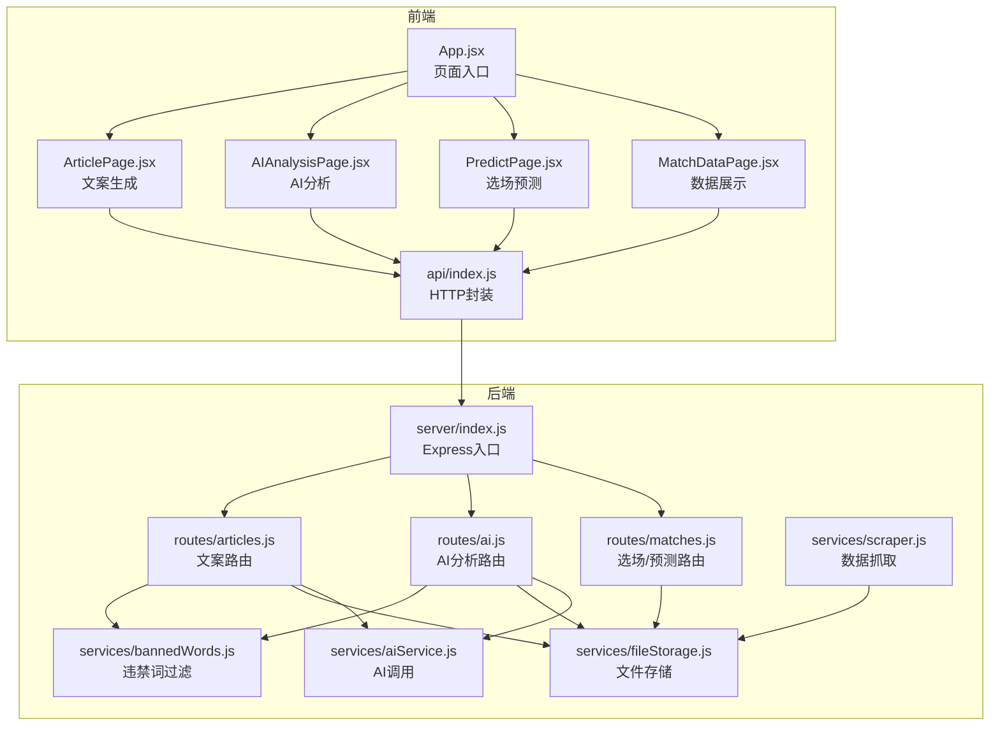
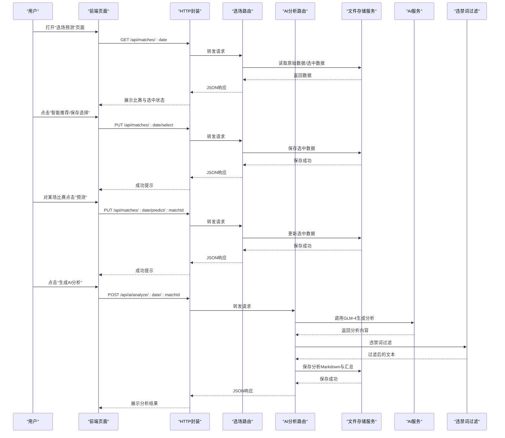
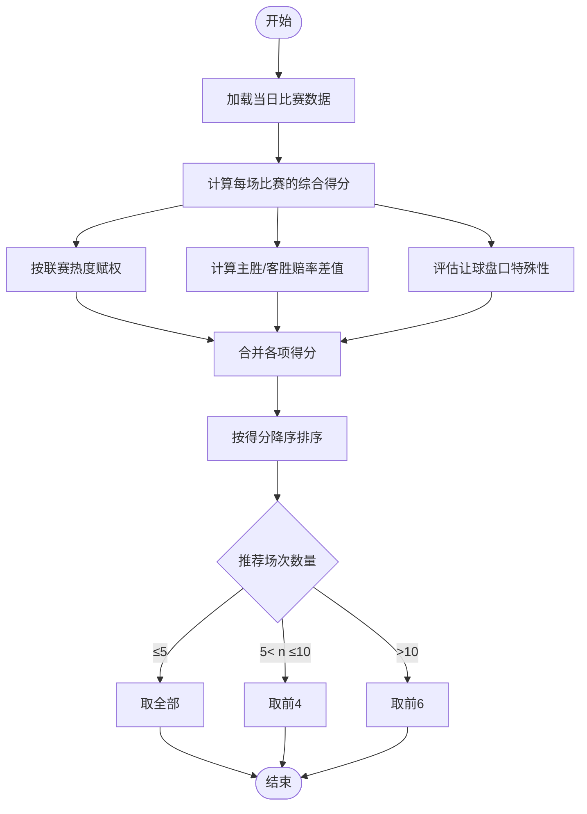
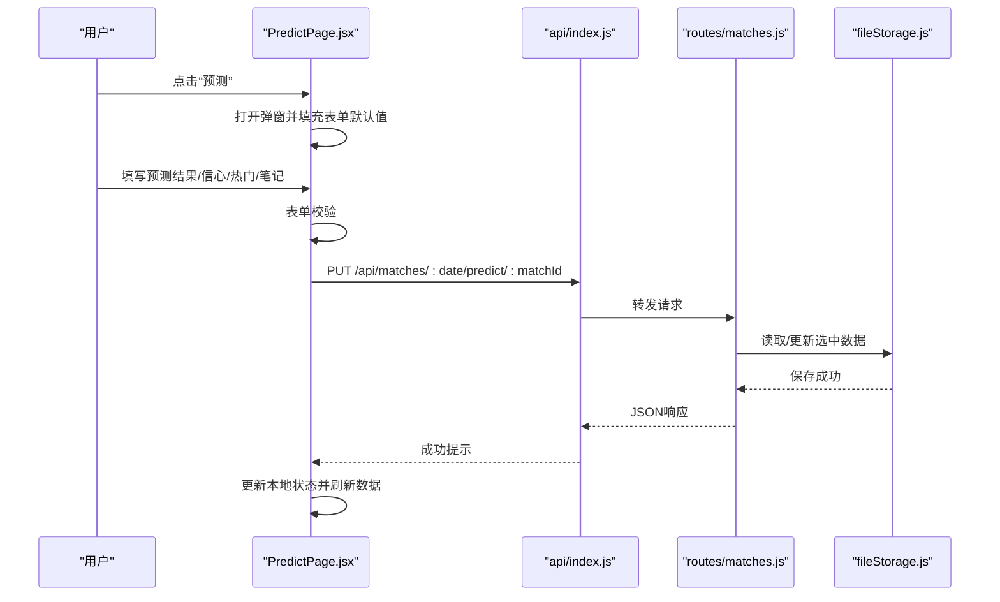
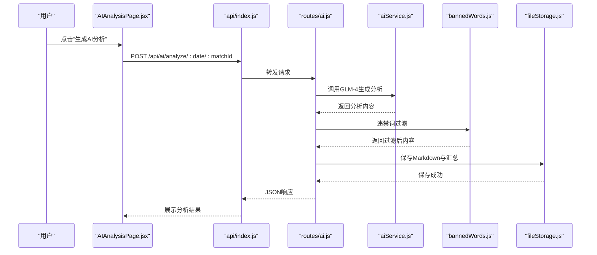
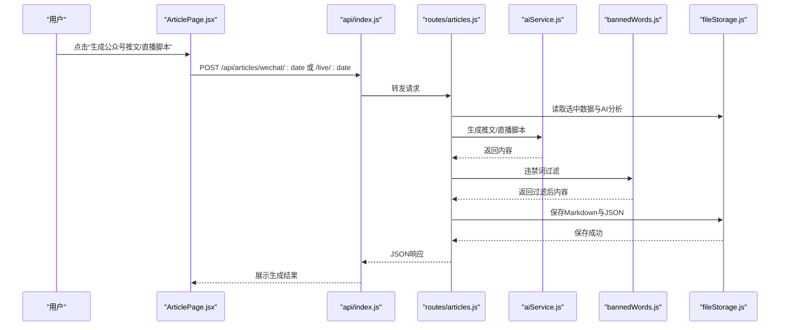
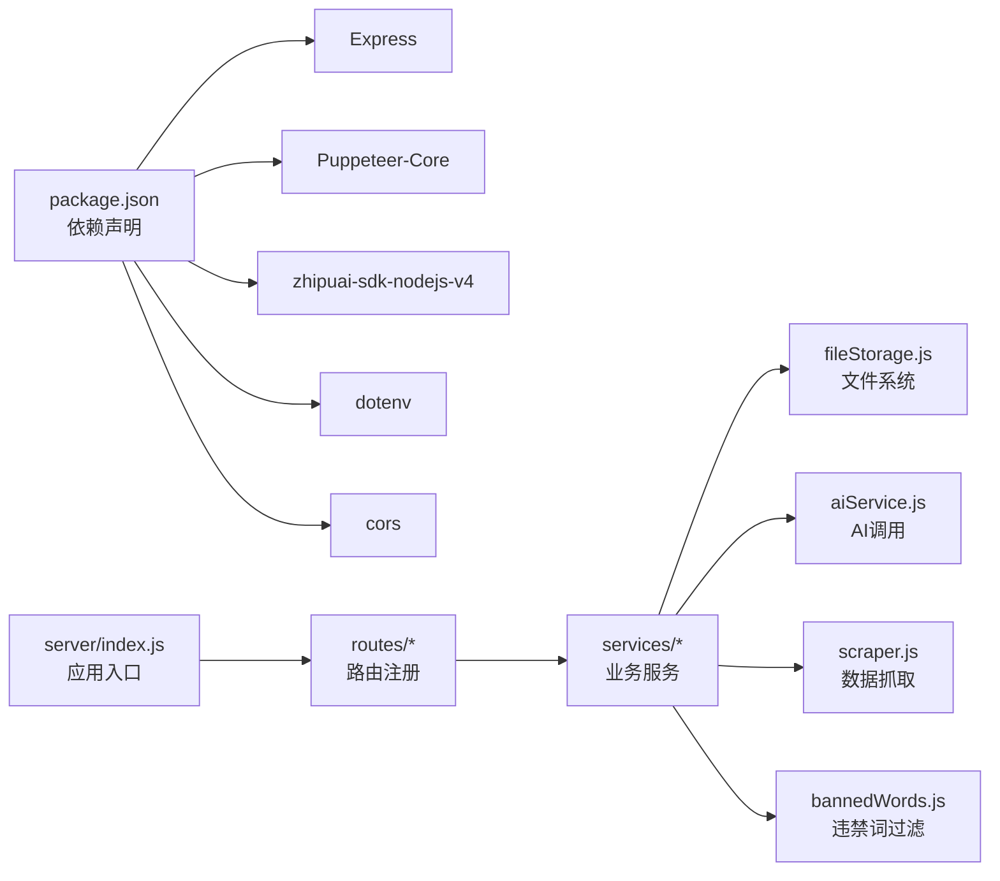

# 智能选场预测模块

<cite>
**本文档引用的文件**
- [PRD.md](file://PRD.md)
- [package.json](file://package.json)
- [server/index.js](file://server/index.js)
- [server/routes/matches.js](file://server/routes/matches.js)
- [server/routes/ai.js](file://server/routes/ai.js)
- [server/routes/articles.js](file://server/routes/articles.js)
- [server/services/aiService.js](file://server/services/aiService.js)
- [server/services/fileStorage.js](file://server/services/fileStorage.js)
- [server/services/scraper.js](file://server/services/scraper.js)
- [server/services/bannedWords.js](file://server/services/bannedWords.js)
- [client/src/App.jsx](file://client/src/App.jsx)
- [client/src/pages/MatchDataPage.jsx](file://client/src/pages/MatchDataPage.jsx)
- [client/src/pages/PredictPage.jsx](file://client/src/pages/PredictPage.jsx)
- [client/src/pages/AIAnalysisPage.jsx](file://client/src/pages/AIAnalysisPage.jsx)
- [client/src/pages/ArticlePage.jsx](file://client/src/pages/ArticlePage.jsx)
- [client/src/api/index.js](file://client/src/api/index.js)
</cite>

## 目录
1. [简介](#简介)
2. [项目结构](#项目结构)
3. [核心组件](#核心组件)
4. [架构总览](#架构总览)
5. [详细组件分析](#详细组件分析)
6. [依赖关系分析](#依赖关系分析)
7. [性能考虑](#性能考虑)
8. [故障排查指南](#故障排查指南)
9. [结论](#结论)
10. [附录](#附录)

## 简介
本文件聚焦AutoMatch项目的“智能选场预测模块”，围绕以下目标展开：
- 比赛数据的存储结构、查询接口与预测录入功能
- 选场策略算法的设计原理、参数配置与权重计算方法
- 用户界面中的预测录入流程、数据验证规则与实时更新机制
- 具体的API接口文档（GET/POST/PUT/DELETE），请求参数、响应格式与错误码说明
- 数据模型定义、索引设计与查询优化策略
- 预测数据的版本管理与历史记录功能

## 项目结构
AutoMatch采用前后端分离架构：
- 前端：React + Vite + Ant Design，负责用户交互与页面渲染
- 后端：Node.js + Express，提供RESTful API与业务逻辑
- 数据层：本地文件系统（按日期分目录），存储原始数据、选场预测、AI分析与文案
- AI服务：智谱GLM-4大模型API，用于生成分析文案与直播脚本
- 抓取服务：Puppeteer（无头浏览器）抓取500彩票网竞彩数据

图表来源
- [client/src/App.jsx:1-117](file://client/src/App.jsx#L1-L117)
- [client/src/pages/MatchDataPage.jsx:1-198](file://client/src/pages/MatchDataPage.jsx#L1-L198)
- [client/src/pages/PredictPage.jsx:1-322](file://client/src/pages/PredictPage.jsx#L1-L322)
- [client/src/pages/AIAnalysisPage.jsx](file://client/src/pages/AIAnalysisPage.jsx)
- [client/src/pages/ArticlePage.jsx](file://client/src/pages/ArticlePage.jsx)
- [client/src/api/index.js:1-50](file://client/src/api/index.js#L1-L50)
- [server/index.js](file://server/index.js)
- [server/routes/matches.js:1-75](file://server/routes/matches.js#L1-L75)
- [server/routes/ai.js:1-102](file://server/routes/ai.js#L1-L102)
- [server/routes/articles.js:1-113](file://server/routes/articles.js#L1-L113)
- [server/services/aiService.js:1-212](file://server/services/aiService.js#L1-L212)
- [server/services/fileStorage.js:1-196](file://server/services/fileStorage.js#L1-L196)
- [server/services/scraper.js:1-295](file://server/services/scraper.js#L1-L295)
- [server/services/bannedWords.js:1-114](file://server/services/bannedWords.js#L1-L114)

章节来源
- [PRD.md:14-21](file://PRD.md#L14-L21)
- [package.json:15-21](file://package.json#L15-L21)

## 核心组件
- 选场预测页面（PredictPage）：负责展示比赛数据、智能推荐、手动选择、预测录入与保存
- 选场/预测路由（matches.js）：提供获取/保存选场与预测的API
- AI分析路由（ai.js）：提供单场/批量AI分析生成、读取与更新
- 文案路由（articles.js）：提供公众号推文与直播脚本生成、读取
- 文件存储服务（fileStorage.js）：统一管理本地文件系统，按日期分目录组织
- AI服务（aiService.js）：封装智谱GLM-4调用与Prompt工程
- 抓取服务（scraper.js）：使用Puppeteer抓取500彩票网数据
- 违禁词过滤（bannedWords.js）：合规化处理AI生成内容

章节来源
- [client/src/pages/PredictPage.jsx:1-322](file://client/src/pages/PredictPage.jsx#L1-L322)
- [server/routes/matches.js:1-75](file://server/routes/matches.js#L1-L75)
- [server/routes/ai.js:1-102](file://server/routes/ai.js#L1-L102)
- [server/routes/articles.js:1-113](file://server/routes/articles.js#L1-L113)
- [server/services/fileStorage.js:1-196](file://server/services/fileStorage.js#L1-L196)
- [server/services/aiService.js:1-212](file://server/services/aiService.js#L1-L212)
- [server/services/scraper.js:1-295](file://server/services/scraper.js#L1-L295)
- [server/services/bannedWords.js:1-114](file://server/services/bannedWords.js#L1-L114)

## 架构总览
智能选场预测模块贯穿“数据抓取—存储—选场—AI分析—文案生成”的完整链路。前端通过统一的HTTP封装调用后端API；后端路由将请求转发至相应的服务层；文件存储服务负责本地持久化；AI服务对接外部大模型API；违禁词过滤保障内容合规。

图表来源
- [client/src/pages/PredictPage.jsx:1-322](file://client/src/pages/PredictPage.jsx#L1-L322)
- [client/src/api/index.js:1-50](file://client/src/api/index.js#L1-L50)
- [server/routes/matches.js:1-75](file://server/routes/matches.js#L1-L75)
- [server/routes/ai.js:1-102](file://server/routes/ai.js#L1-L102)
- [server/services/aiService.js:1-212](file://server/services/aiService.js#L1-L212)
- [server/services/fileStorage.js:1-196](file://server/services/fileStorage.js#L1-L196)
- [server/services/bannedWords.js:1-114](file://server/services/bannedWords.js#L1-L114)

## 详细组件分析

### 1) 选场策略算法与参数配置
- 推荐场次数量规则
  - 当日总比赛数 ≤ 5：推荐全部
  - 5 < 当日总比赛数 ≤ 10：推荐4场
  - 当日总比赛数 > 10：推荐6场
- 自动推荐评分维度
  - 联赛热度：按五大联赛 > 次级联赛 > 其他排序，赋予不同权重
  - 赔率差异度：主胜/客胜赔率差值越大，越有价值
  - 让球盘口：让球数较大或较小的比赛更具分析意义
- 评分与排序
  - 对每个比赛计算综合得分，按得分降序取前N名作为推荐
- 手动调整
  - 用户可对推荐结果进行增删改，上限受推荐规则约束

图表来源
- [client/src/pages/PredictPage.jsx:34-78](file://client/src/pages/PredictPage.jsx#L34-L78)

章节来源
- [PRD.md:68-88](file://PRD.md#L68-L88)
- [client/src/pages/PredictPage.jsx:34-78](file://client/src/pages/PredictPage.jsx#L34-L78)

### 2) 预测录入流程与数据验证
- 流程
  - 从“赛事数据”页面进入“选场预测”
  - 点击“智能推荐”或手动勾选比赛，形成选中集合
  - 点击“预测”打开弹窗，填写预测结果、信心指数、是否热门、分析笔记
  - 点击“保存”，后端更新选中数据并持久化
- 数据验证
  - 预测结果必填（主胜/平局/客胜）
  - 信心指数为1-5星
  - 热门开关为布尔值
  - 分析笔记为自由文本
- 实时更新
  - 选中状态与预测信息在前端即时反映
  - 保存成功后重新拉取最新数据，保证UI与后端一致

图表来源
- [client/src/pages/PredictPage.jsx:115-144](file://client/src/pages/PredictPage.jsx#L115-L144)
- [client/src/api/index.js:26-30](file://client/src/api/index.js#L26-L30)
- [server/routes/matches.js:52-72](file://server/routes/matches.js#L52-L72)
- [server/services/fileStorage.js:65-69](file://server/services/fileStorage.js#L65-L69)

章节来源
- [client/src/pages/PredictPage.jsx:115-144](file://client/src/pages/PredictPage.jsx#L115-L144)
- [client/src/api/index.js:26-30](file://client/src/api/index.js#L26-L30)
- [server/routes/matches.js:52-72](file://server/routes/matches.js#L52-L72)

### 3) AI分析生成与合规处理
- 输入
  - 比赛基本信息（对阵、联赛、时间）
  - 初盘/让球赔率
  - 分析师预测、信心指数、分析笔记
- 输出
  - 约200字的逻辑闭环分析文案
  - 保存为Markdown文件，并同步更新汇总JSON
- 合规处理
  - 使用违禁词映射表进行替换/删除
  - 记录发现的违禁词列表，便于审计

图表来源
- [server/routes/ai.js:10-34](file://server/routes/ai.js#L10-L34)
- [server/services/aiService.js:18-65](file://server/services/aiService.js#L18-L65)
- [server/services/bannedWords.js:70-96](file://server/services/bannedWords.js#L70-L96)
- [server/services/fileStorage.js:74-98](file://server/services/fileStorage.js#L74-L98)

章节来源
- [server/routes/ai.js:10-34](file://server/routes/ai.js#L10-L34)
- [server/services/aiService.js:18-65](file://server/services/aiService.js#L18-L65)
- [server/services/bannedWords.js:70-96](file://server/services/bannedWords.js#L70-L96)
- [server/services/fileStorage.js:74-98](file://server/services/fileStorage.js#L74-L98)

### 4) 文案生成（公众号推文/直播脚本）
- 热门比赛选择
  - 优先选择分析师标记的热门比赛（isHot=true）
  - 若未标记，则按选中顺序取前2场
- 公众号推文
  - 要求：悬念开头、基本面分析、数据视角解读、逻辑闭环、明确结论、号召关注
  - 违禁词过滤：严格替换/删除敏感词汇
- 直播脚本
  - 要求：口语化、适合朗读、仅从基本面分析、与预期一致
  - 违禁词过滤：严格合规

图表来源
- [server/routes/articles.js:10-51](file://server/routes/articles.js#L10-L51)
- [server/routes/articles.js:56-93](file://server/routes/articles.js#L56-L93)
- [server/services/aiService.js:70-135](file://server/services/aiService.js#L70-L135)
- [server/services/aiService.js:140-205](file://server/services/aiService.js#L140-L205)
- [server/services/bannedWords.js:70-96](file://server/services/bannedWords.js#L70-L96)
- [server/services/fileStorage.js:112-139](file://server/services/fileStorage.js#L112-L139)

章节来源
- [server/routes/articles.js:10-51](file://server/routes/articles.js#L10-L51)
- [server/routes/articles.js:56-93](file://server/routes/articles.js#L56-L93)
- [server/services/aiService.js:70-135](file://server/services/aiService.js#L70-L135)
- [server/services/aiService.js:140-205](file://server/services/aiService.js#L140-L205)
- [server/services/bannedWords.js:70-96](file://server/services/bannedWords.js#L70-L96)
- [server/services/fileStorage.js:112-139](file://server/services/fileStorage.js#L112-L139)

### 5) 数据模型定义
- 比赛基础字段
  - matchId：比赛编号（如周日001）
  - league：联赛名称
  - homeTeam/awayTeam：主队/客队
  - matchTime：比赛时间
  - oddsWin/oddsDraw/oddsLoss：初盘胜/平/负赔率
  - handicapLine：让球数
  - handicapWin/handicapDraw/handicapLoss：让球胜/平/负赔率
  - scrapedAt：抓取时间戳
  - index：序号
- 选中/预测字段
  - prediction：预测结果（主胜/平局/客胜）
  - confidence：信心指数（1-5星）
  - analysisNote：分析笔记
  - isHot：是否热门
  - createdAt/updatedAt：创建/更新时间戳
- AI分析字段
  - matchId/homeTeam/awayTeam/prediction/content/createdAt
- 文案字段
  - hotMatch/content/createdAt（公众号推文）
  - matches/content/createdAt（直播脚本）

章节来源
- [PRD.md:35-50](file://PRD.md#L35-L50)
- [PRD.md:81-87](file://PRD.md#L81-L87)
- [PRD.md:96-106](file://PRD.md#L96-L106)
- [PRD.md:146-180](file://PRD.md#L146-L180)
- [PRD.md:181-202](file://PRD.md#L181-L202)

### 6) 存储结构与索引设计
- 存储位置
  - 默认：桌面目录下的AutoMatch根目录
  - 可通过环境变量覆盖
- 目录结构（按日期分层）
  - 01_原始数据/matches.json：原始比赛数据（JSON）
  - 02_重点比赛/selected.json：选中比赛+预测（JSON）
  - 03_AI分析/match_{id}_analysis.md：单场AI分析（Markdown）
  - 03_AI分析/all_analyses.json：所有分析汇总（JSON）
  - 04_公众号文案/wechat_article.md / wechat_article.json
  - 05_直播文案/live_script.md / live_script.json
- 查询优化策略
  - 读取原始数据/选中数据/分析汇总均基于文件系统，按需读取
  - 选中数据更新采用内存读取+覆盖写入，避免频繁IO
  - AI分析保存时同步更新汇总JSON，便于快速检索

章节来源
- [PRD.md:205-234](file://PRD.md#L205-L234)
- [server/services/fileStorage.js:32-48](file://server/services/fileStorage.js#L32-L48)
- [server/services/fileStorage.js:53-69](file://server/services/fileStorage.js#L53-L69)
- [server/services/fileStorage.js:74-98](file://server/services/fileStorage.js#L74-L98)
- [server/services/fileStorage.js:112-139](file://server/services/fileStorage.js#L112-L139)

### 7) 版本管理与历史记录
- 选中数据与预测
  - 每日同一日期的选中数据为覆盖式更新，历史版本不保留
  - 如需历史对比，可通过文件系统备份或版本控制
- AI分析与文案
  - 单场分析以Markdown文件保存，便于Git追踪
  - 汇总JSON记录每次生成的最新版本
- 建议
  - 对关键日期的分析文件进行定期备份
  - 使用Git对Markdown文件进行版本管理

章节来源
- [server/services/fileStorage.js:74-98](file://server/services/fileStorage.js#L74-L98)
- [server/services/fileStorage.js:112-139](file://server/services/fileStorage.js#L112-L139)

## 依赖关系分析

图表来源
- [package.json:15-21](file://package.json#L15-L21)
- [server/index.js](file://server/index.js)
- [server/routes/matches.js:1-75](file://server/routes/matches.js#L1-L75)
- [server/routes/ai.js:1-102](file://server/routes/ai.js#L1-L102)
- [server/routes/articles.js:1-113](file://server/routes/articles.js#L1-L113)
- [server/services/fileStorage.js:1-196](file://server/services/fileStorage.js#L1-L196)
- [server/services/aiService.js:1-212](file://server/services/aiService.js#L1-L212)
- [server/services/scraper.js:1-295](file://server/services/scraper.js#L1-L295)
- [server/services/bannedWords.js:1-114](file://server/services/bannedWords.js#L1-L114)

章节来源
- [package.json:15-21](file://package.json#L15-L21)

## 性能考虑
- 抓取性能
  - 使用无头浏览器与合理等待策略，确保页面稳定加载
  - 重试与异常捕获，避免单点失败影响整体流程
- AI生成性能
  - 控制单场生成时间在10秒以内，批量生成时逐场处理并记录错误
- 前端交互
  - 表单校验在前端即时反馈，减少无效请求
  - 保存操作使用加载态与消息提示，提升用户体验

## 故障排查指南
- AI API Key未配置
  - 现象：调用AI服务时报错
  - 处理：在环境变量中设置正确的API Key
- 违禁词过滤异常
  - 现象：生成内容仍包含敏感词汇
  - 处理：检查违禁词映射表与过滤逻辑，确保替换词完整
- 文件存储权限问题
  - 现象：无法保存/读取文件
  - 处理：确认数据目录存在且具备读写权限，必要时修改环境变量
- 抓取失败
  - 现象：页面长时间无响应或报错
  - 处理：检查网络连接、Chrome路径配置与页面结构变化

章节来源
- [server/services/aiService.js:8-13](file://server/services/aiService.js#L8-L13)
- [server/services/bannedWords.js:70-96](file://server/services/bannedWords.js#L70-L96)
- [server/services/fileStorage.js:9-13](file://server/services/fileStorage.js#L9-L13)
- [server/services/scraper.js:22-214](file://server/services/scraper.js#L22-L214)

## 结论
智能选场预测模块通过清晰的数据流与职责划分，实现了从数据抓取、选场策略、预测录入、AI分析到文案生成的完整闭环。其设计兼顾了实用性与合规性，前端交互直观，后端服务稳定，文件存储结构清晰，便于扩展与维护。建议在生产环境中加强日志监控与备份策略，确保数据安全与可追溯性。

## 附录

### A. API接口文档

- 抓取相关
  - POST /api/scrape
    - 请求：无
    - 响应：包含成功计数与数据
    - 错误码：500（抓取失败）
  - GET /api/matches/dates
    - 请求：无
    - 响应：可用日期数组
    - 错误码：500（读取失败）

- 比赛相关
  - GET /api/matches/:date
    - 请求：日期参数
    - 响应：raw（原始数据）、selected（选中数据）
    - 错误码：500（读取失败）
  - PUT /api/matches/:date/select
    - 请求体：selectedMatches 数组
    - 响应：成功标志
    - 错误码：500（保存失败）
  - PUT /api/matches/:date/predict/:matchId
    - 请求体：prediction、confidence、analysisNote、isHot
    - 响应：成功标志
    - 错误码：500（保存失败）

- AI分析相关
  - POST /api/ai/analyze/:date/:matchId
    - 请求：日期与比赛ID
    - 响应：分析内容与创建时间
    - 错误码：404（未找到比赛）、500（生成失败）
  - POST /api/ai/analyze/:date/batch
    - 请求：日期
    - 响应：每场比赛的分析结果或错误
    - 错误码：400（无选中比赛）、500（生成失败）
  - GET /api/ai/analyses/:date
    - 请求：日期
    - 响应：所有分析汇总
    - 错误码：500（读取失败）
  - PUT /api/ai/analyses/:date/:matchId
    - 请求体：content
    - 响应：成功标志
    - 错误码：500（保存失败）

- 文案相关
  - POST /api/articles/wechat/:date
    - 请求：日期
    - 响应：公众号推文内容与创建时间
    - 错误码：400（无热门比赛）、500（生成失败）
  - POST /api/articles/live/:date
    - 请求：日期
    - 响应：直播脚本内容与创建时间
    - 错误码：400（无热门比赛）、500（生成失败）
  - GET /api/articles/:date
    - 请求：日期
    - 响应：公众号推文与直播脚本对象
    - 错误码：500（读取失败）

章节来源
- [PRD.md:252-271](file://PRD.md#L252-L271)
- [server/routes/matches.js:8-72](file://server/routes/matches.js#L8-L72)
- [server/routes/ai.js:10-99](file://server/routes/ai.js#L10-L99)
- [server/routes/articles.js:10-110](file://server/routes/articles.js#L10-L110)

### B. 违禁词过滤清单（节选）
- 盘口/盘口水位/水位 → 数据走势/数据变化
- 庄家/庄 → 删除
- 赌博/赌 → 删除
- 博彩 → 删除
- 投注/下注 → 关注/关注方向
- 赔率 → 数据指标
- 让球 → 让步
- 上盘/下盘 → 优势方/弱势方
- 临场盘 → 临近开场数据
- 亚盘/欧赔 → 亚洲数据/欧洲数据
- 大小球 → 进球数预期
- 串关 → 组合关注

章节来源
- [server/services/bannedWords.js:6-63](file://server/services/bannedWords.js#L6-L63)