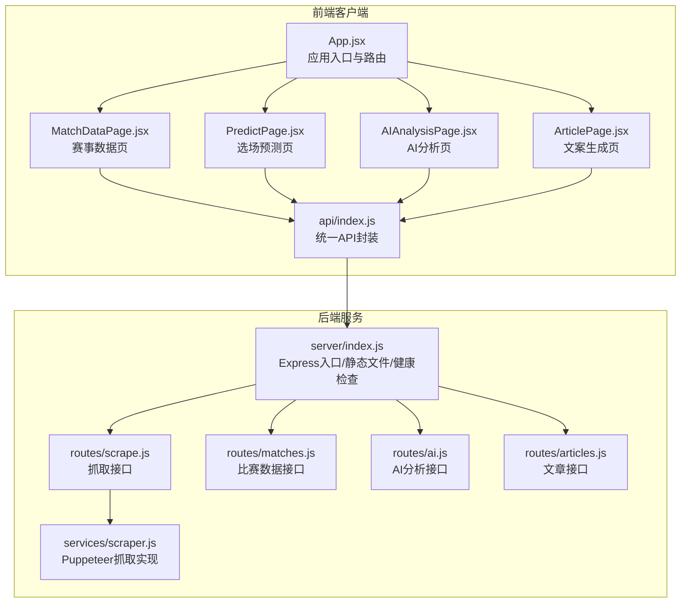
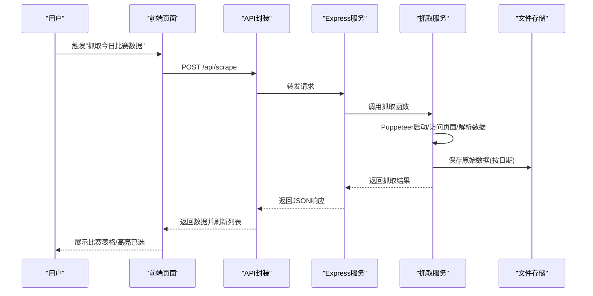
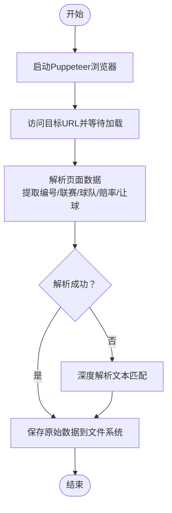
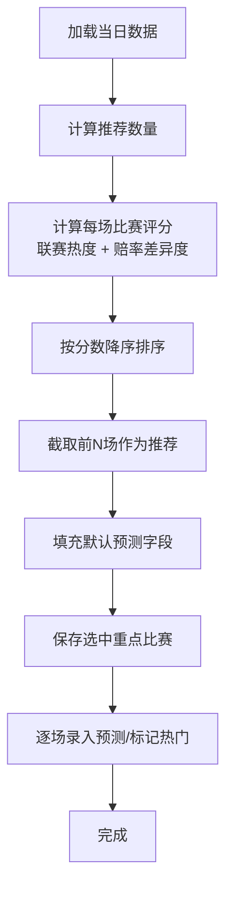
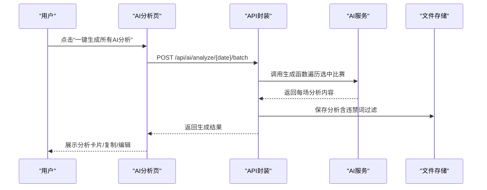
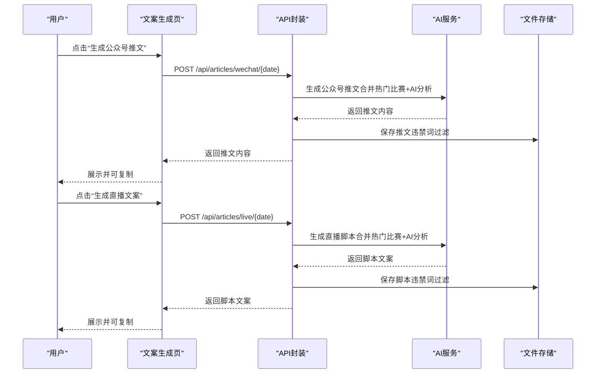
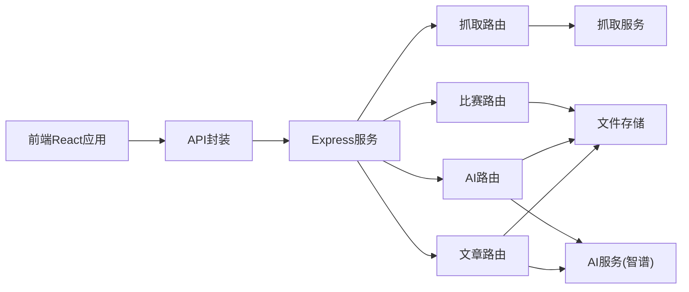

# 核心功能模块

<cite>
**本文引用的文件**
- [PRD.md](file://PRD.md)
- [App.jsx](file://client/src/App.jsx)
- [MatchDataPage.jsx](file://client/src/pages/MatchDataPage.jsx)
- [PredictPage.jsx](file://client/src/pages/PredictPage.jsx)
- [AIAnalysisPage.jsx](file://client/src/pages/AIAnalysisPage.jsx)
- [ArticlePage.jsx](file://client/src/pages/ArticlePage.jsx)
- [api/index.js](file://client/src/api/index.js)
- [server/index.js](file://server/index.js)
- [routes/scrape.js](file://server/routes/scrape.js)
- [routes/matches.js](file://server/routes/matches.js)
- [routes/ai.js](file://server/routes/ai.js)
- [routes/articles.js](file://server/routes/articles.js)
- [services/scraper.js](file://server/services/scraper.js)
</cite>

## 目录
1. [简介](#简介)
2. [项目结构](#项目结构)
3. [核心组件](#核心组件)
4. [架构总览](#架构总览)
5. [详细组件分析](#详细组件分析)
6. [依赖分析](#依赖分析)
7. [性能考虑](#性能考虑)
8. [故障排查指南](#故障排查指南)
9. [结论](#结论)
10. [附录](#附录)

## 简介
本文件面向AutoMatch项目的开发者与使用者，系统化梳理四大核心功能模块：赛事数据抓取、智能选场预测、AI辅助分析、合规文案生成。文档从业务逻辑、技术实现、用户交互流程、模块协作与数据传递机制等方面进行深入说明，并提供配置项、参数设置与使用方法，辅以可视化图示帮助理解与扩展。

## 项目结构
AutoMatch采用前后端分离架构：前端基于React + Vite + Ant Design，后端基于Node.js + Express，数据抓取通过Puppeteer（无头浏览器）实现，AI服务对接智谱GLM-4，数据持久化采用本地文件系统（JSON/Markdown），运行于macOS本地环境。

图表来源
- [server/index.js:1-49](file://server/index.js#L1-L49)
- [routes/scrape.js:1-26](file://server/routes/scrape.js#L1-L26)
- [routes/matches.js:1-75](file://server/routes/matches.js#L1-L75)
- [routes/ai.js:1-102](file://server/routes/ai.js#L1-L102)
- [routes/articles.js:1-113](file://server/routes/articles.js#L1-L113)
- [services/scraper.js:1-295](file://server/services/scraper.js#L1-L295)
- [App.jsx:1-117](file://client/src/App.jsx#L1-L117)
- [api/index.js:1-50](file://client/src/api/index.js#L1-L50)

章节来源
- [PRD.md:14-21](file://PRD.md#L14-L21)
- [server/index.js:1-49](file://server/index.js#L1-L49)
- [client/src/App.jsx:1-117](file://client/src/App.jsx#L1-L117)

## 核心组件
- 赛事数据抓取模块：通过Puppeteer访问500彩票网，解析并保存当日竞彩数据至本地文件系统。
- 智能选场预测模块：基于联赛热度、赔率差异度与让球盘口特征，自动推荐重点比赛，并支持分析师录入预测与标记热门。
- AI辅助分析模块：调用智谱GLM-4生成专业赛事分析文案，支持批量生成、编辑与违禁词过滤。
- 合规文案生成模块：从重点比赛中挑选热门组合，生成公众号推文与直播脚本，严格遵循违禁词过滤与合规要求。

章节来源
- [PRD.md:26-203](file://PRD.md#L26-L203)
- [server/services/scraper.js:22-214](file://server/services/scraper.js#L22-L214)
- [client/src/pages/PredictPage.jsx:33-78](file://client/src/pages/PredictPage.jsx#L33-L78)
- [client/src/pages/AIAnalysisPage.jsx:31-47](file://client/src/pages/AIAnalysisPage.jsx#L31-L47)
- [client/src/pages/ArticlePage.jsx:44-86](file://client/src/pages/ArticlePage.jsx#L44-L86)

## 架构总览
AutoMatch的前后端交互通过RESTful API完成，前端负责UI与用户交互，后端负责业务逻辑、数据持久化与第三方AI服务集成。数据流以“日期”为单位组织，形成“原始数据—重点比赛—AI分析—合规文案”的链路。

图表来源
- [client/src/pages/MatchDataPage.jsx:25-38](file://client/src/pages/MatchDataPage.jsx#L25-L38)
- [client/src/api/index.js:15-16](file://client/src/api/index.js#L15-L16)
- [server/routes/scrape.js:8-23](file://server/routes/scrape.js#L8-L23)
- [server/services/scraper.js:22-214](file://server/services/scraper.js#L22-L214)

## 详细组件分析

### 赛事数据抓取模块
- 业务逻辑
  - 定时从500彩票网抓取当日竞彩足球比赛数据，支持手动触发与自动调度。
  - 解析字段包括：比赛编号、联赛、主队、客队、比赛时间、初盘与让球盘口的胜平负赔率。
- 技术实现
  - 使用Puppeteer（无头浏览器）模拟真实用户行为，绕过反爬；设置User-Agent与视口大小，等待网络空闲后解析页面。
  - 多种DOM选择器与文本模式匹配，增强对页面结构变化的鲁棒性；若标准解析失败则回退深度解析。
  - 将解析结果按日期保存为JSON文件，附加抓取时间戳与序号。
- 用户交互
  - “抓取今日比赛数据”按钮触发后显示进度消息，成功后刷新表格并通知已抓取场次数量。
- 配置与参数
  - 浏览器可执行路径可通过环境变量配置；默认指向macOS常见Chrome/Chromium安装路径。
  - 数据存储目录由环境变量DATA_DIR决定，默认位于桌面AutoMatch目录。
- 使用方法
  - 在“赛事数据页”点击抓取按钮；抓取完成后可在表格中查看并进入“选场预测”模块。

图表来源
- [server/services/scraper.js:22-214](file://server/services/scraper.js#L22-L214)

章节来源
- [PRD.md:26-60](file://PRD.md#L26-L60)
- [server/routes/scrape.js:8-23](file://server/routes/scrape.js#L8-L23)
- [client/src/pages/MatchDataPage.jsx:25-38](file://client/src/pages/MatchDataPage.jsx#L25-L38)
- [server/services/scraper.js:10-17](file://server/services/scraper.js#L10-L17)
- [server/index.js:18-19](file://server/index.js#L18-L19)

### 智能选场与预测录入模块
- 业务逻辑
  - 根据当日总比赛数自动确定重点场次数（5~10场取4场，>10场取6场，<5场全选）。
  - 推荐策略：优先五大联赛，结合胜平负赔率差异度与让球盘口特殊性。
  - 分析师可手动增删重点场，录入预测结果、信心指数、分析笔记与热门标记。
- 技术实现
  - 前端计算推荐数量与评分，按联赛热度与赔率差异排序后截取前N名作为推荐集。
  - 保存接口支持整体保存重点比赛与单项保存预测，后端写入本地文件。
- 用户交互
  - “智能推荐”按钮一键填充推荐重点场；支持逐项勾选/取消；打开预测弹窗填写预测并保存。
- 配置与参数
  - 联赛热度映射表定义了优先级权重；赔率差异度按主客胜差值加权。
- 使用方法
  - 在“选场预测”页查看推荐数量提示，点击“智能推荐”后核对并保存；随后为每场填写预测。

图表来源
- [client/src/pages/PredictPage.jsx:33-78](file://client/src/pages/PredictPage.jsx#L33-L78)
- [client/src/pages/PredictPage.jsx:80-113](file://client/src/pages/PredictPage.jsx#L80-L113)

章节来源
- [PRD.md:63-89](file://PRD.md#L63-L89)
- [client/src/pages/PredictPage.jsx:33-113](file://client/src/pages/PredictPage.jsx#L33-L113)
- [server/routes/matches.js:37-72](file://server/routes/matches.js#L37-L72)

### AI辅助分析模块
- 业务逻辑
  - 基于选中比赛与分析师预测生成专业分析文案，要求逻辑闭环、字数控制、语言专业。
  - 支持单场与批量生成；生成后可编辑、复制与保存。
- 技术实现
  - 调用智谱GLM-4生成分析内容；对生成结果进行违禁词过滤，记录发现词汇以便审计。
  - 将分析内容以Markdown格式保存，便于网页查看与二次编辑。
- 用户交互
  - “一键生成所有AI分析”触发批量生成；生成后卡片展示内容与违禁词提示；支持复制与编辑。
- 配置与参数
  - AI生成依赖选中比赛集合；违禁词过滤清单集中维护。
- 使用方法
  - 在“AI分析”页确认已选重点场与预测，点击生成；生成后可复制或编辑优化。

图表来源
- [client/src/pages/AIAnalysisPage.jsx:31-47](file://client/src/pages/AIAnalysisPage.jsx#L31-L47)
- [client/src/api/index.js:35-42](file://client/src/api/index.js#L35-L42)
- [server/routes/ai.js:36-69](file://server/routes/ai.js#L36-L69)

章节来源
- [PRD.md:91-134](file://PRD.md#L91-L134)
- [client/src/pages/AIAnalysisPage.jsx:31-79](file://client/src/pages/AIAnalysisPage.jsx#L31-L79)
- [server/routes/ai.js:7-34](file://server/routes/ai.js#L7-L34)

### 合规文案生成模块
- 业务逻辑
  - 从重点比赛中选出最热的2场（优先isHot标记，不足时取前2场），分别生成公众号推文与直播脚本。
  - 公众号推文强调逻辑闭环与文采，直播脚本强调口语化与节奏感。
  - 严格遵守违禁词过滤清单，确保合规。
- 技术实现
  - 合并选中比赛与AI分析内容，调用AI服务生成文案；对生成内容进行违禁词过滤并记录。
  - 保存为Markdown文件，支持复制与查看生成时间。
- 用户交互
  - “生成公众号推文/直播文案”按钮触发生成；生成后可复制到剪贴板。
- 配置与参数
  - 热门比赛选择策略与违禁词过滤规则集中定义。
- 使用方法
  - 在“文案生成”页确认热门标记与AI分析完成，点击相应按钮生成；生成后复制使用。

图表来源
- [client/src/pages/ArticlePage.jsx:44-86](file://client/src/pages/ArticlePage.jsx#L44-L86)
- [client/src/api/index.js:45-49](file://client/src/api/index.js#L45-L49)
- [server/routes/articles.js:7-51](file://server/routes/articles.js#L7-L51)
- [server/routes/articles.js:53-93](file://server/routes/articles.js#L53-L93)

章节来源
- [PRD.md:136-203](file://PRD.md#L136-L203)
- [client/src/pages/ArticlePage.jsx:40-86](file://client/src/pages/ArticlePage.jsx#L40-L86)
- [server/routes/articles.js:95-110](file://server/routes/articles.js#L95-L110)

## 依赖分析
- 前端依赖
  - React生态：React、React DOM、Ant Design UI库、Day.js日期处理。
  - 构建工具：Vite、ESLint。
- 后端依赖
  - Web框架：Express、CORS、dotenv。
  - 爬虫：puppeteer-core（无头浏览器）。
  - 文件系统：Node原生fs与path。
- 模块间耦合
  - 前端通过统一API封装调用后端路由；后端路由依赖文件存储服务与AI服务。
  - 抓取服务与文件存储服务耦合度较高，便于按日期组织数据。

图表来源
- [client/src/api/index.js:1-50](file://client/src/api/index.js#L1-L50)
- [server/index.js:11-25](file://server/index.js#L11-L25)
- [server/routes/scrape.js:1-26](file://server/routes/scrape.js#L1-L26)
- [server/routes/matches.js:1-75](file://server/routes/matches.js#L1-L75)
- [server/routes/ai.js:1-102](file://server/routes/ai.js#L1-L102)
- [server/routes/articles.js:1-113](file://server/routes/articles.js#L1-L113)

章节来源
- [client/package.json:12-29](file://client/package.json#L12-L29)
- [server/index.js:1-10](file://server/index.js#L1-L10)

## 性能考虑
- 抓取性能：Puppeteer启动与页面渲染耗时较长，建议在macOS本地运行并合理设置浏览器参数；页面等待策略避免过早超时。
- AI生成性能：单场生成控制在10秒内，批量生成需注意并发与错误聚合，避免阻塞。
- 前端交互：表格与卡片渲染较多时，建议分页或虚拟滚动优化（当前项目未实现，但可作为扩展点）。
- 存储性能：按日期分目录与文件命名规范化，减少文件系统压力。

## 故障排查指南
- 抓取失败
  - 症状：抓取接口返回错误。
  - 排查：检查浏览器可执行路径配置、网络连通性、页面结构变化导致的选择器失效。
  - 参考
    - [server/routes/scrape.js:16-22](file://server/routes/scrape.js#L16-L22)
    - [server/services/scraper.js:22-214](file://server/services/scraper.js#L22-L214)
- 选场保存失败
  - 症状：保存选中或预测失败。
  - 排查：确认日期参数正确、请求体格式符合PUT接口约定。
  - 参考
    - [server/routes/matches.js:37-72](file://server/routes/matches.js#L37-L72)
- AI分析生成异常
  - 症状：批量生成部分场次失败。
  - 排查：检查AI服务可用性、违禁词过滤是否影响内容；查看返回的错误数组。
  - 参考
    - [server/routes/ai.js:36-69](file://server/routes/ai.js#L36-L69)
- 文案生成失败
  - 症状：公众号或直播文案生成报错。
  - 排查：确认热门比赛数量、AI分析是否存在；检查违禁词过滤后的结果。
  - 参考
    - [server/routes/articles.js:7-51](file://server/routes/articles.js#L7-L51)
    - [server/routes/articles.js:53-93](file://server/routes/articles.js#L53-L93)

章节来源
- [server/routes/scrape.js:16-22](file://server/routes/scrape.js#L16-L22)
- [server/routes/matches.js:37-72](file://server/routes/matches.js#L37-L72)
- [server/routes/ai.js:36-69](file://server/routes/ai.js#L36-L69)
- [server/routes/articles.js:7-51](file://server/routes/articles.js#L7-L51)

## 结论
AutoMatch通过模块化的前后端设计，实现了从数据抓取到合规文案生成的完整工作流。模块之间职责清晰、数据传递有序，配合违禁词过滤与本地文件存储，满足分析师日常工作的高效与合规需求。建议后续在前端增加虚拟滚动与缓存策略，在后端完善重试与监控告警，进一步提升稳定性与用户体验。

## 附录
- API一览（按模块）
  - 抓取相关
    - POST /api/scrape：触发抓取500彩票网数据
    - GET /api/matches/:date：获取指定日期的比赛数据
  - 选场相关
    - PUT /api/matches/:date/select：保存选中的重点比赛
    - PUT /api/matches/:date/predict/:matchId：保存预测信息
  - AI分析相关
    - POST /api/ai/analyze/:date/:matchId：生成单场比赛AI分析
    - POST /api/ai/analyze/:date/batch：批量生成AI分析
    - GET /api/ai/analyses/:date：获取指定日期所有分析
    - PUT /api/ai/analyses/:date/:matchId：更新AI分析内容
  - 文案相关
    - POST /api/articles/wechat/:date：生成公众号推文
    - POST /api/articles/live/:date：生成直播文案
    - GET /api/articles/:date：获取指定日期所有文案
- 配置项
  - 环境变量
    - PORT：后端监听端口（默认3001）
    - DATA_DIR：数据存储根目录（默认桌面AutoMatch）
    - CHROME_PATH：浏览器可执行路径（macOS常用Chrome/Chromium）
  - 违禁词过滤
    - 清单覆盖“盘口/庄家/博彩/投注/让球/赔率”等敏感词替换与删除策略
- 使用场景示例
  - 每日运营：抓取→选场→AI分析→生成公众号推文与直播脚本→复制使用
  - 批量优化：批量生成AI分析后逐条编辑，再生成合规文案

章节来源
- [PRD.md:252-271](file://PRD.md#L252-L271)
- [PRD.md:205-234](file://PRD.md#L205-L234)
- [server/index.js:12-19](file://server/index.js#L12-L19)
- [server/services/scraper.js:10-17](file://server/services/scraper.js#L10-L17)
- [PRD.md:158-174](file://PRD.md#L158-L174)