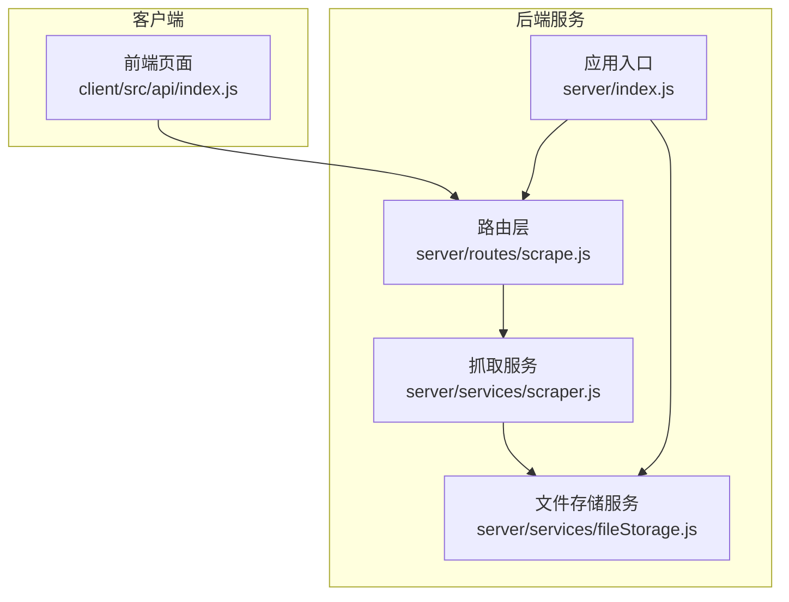
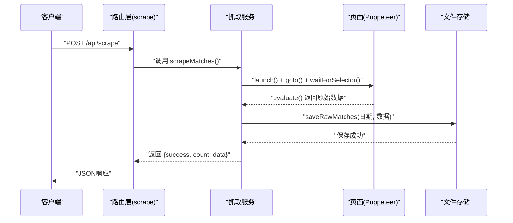
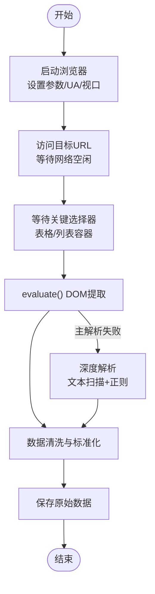
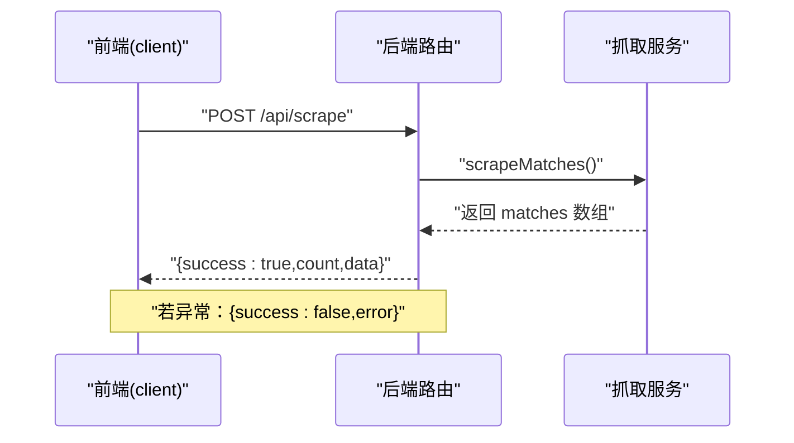
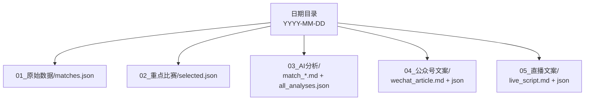
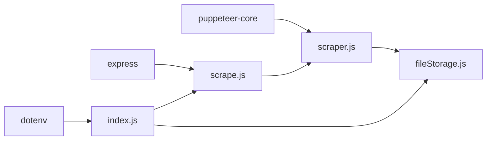

# 赛事数据抓取模块

<cite>
**本文档引用的文件**
- [server/services/scraper.js](file://server/services/scraper.js)
- [server/routes/scrape.js](file://server/routes/scrape.js)
- [server/services/fileStorage.js](file://server/services/fileStorage.js)
- [server/index.js](file://server/index.js)
- [client/src/api/index.js](file://client/src/api/index.js)
- [package.json](file://package.json)
- [PRD.md](file://PRD.md)
</cite>

## 目录
1. [简介](#简介)
2. [项目结构](#项目结构)
3. [核心组件](#核心组件)
4. [架构总览](#架构总览)
5. [详细组件分析](#详细组件分析)
6. [依赖关系分析](#依赖关系分析)
7. [性能考量](#性能考量)
8. [故障排查指南](#故障排查指南)
9. [结论](#结论)
10. [附录](#附录)

## 简介
本文件针对AutoMatch项目的“赛事数据抓取模块”进行系统化技术文档编写，聚焦于Puppeteer无头浏览器在500彩票网竞彩足球数据抓取中的应用。内容涵盖页面导航、元素定位、数据提取、错误处理、反爬虫策略、数据清洗与存储准备等关键环节，并提供最佳实践建议与可视化图示，帮助开发者快速理解与优化该模块。

## 项目结构
该模块位于后端服务中，采用“服务层 + 路由层”的分层设计：
- 路由层负责HTTP接口定义与请求转发
- 服务层封装Puppeteer抓取逻辑与数据清洗
- 文件存储服务负责本地数据持久化

图表来源
- [server/routes/scrape.js:1-26](file://server/routes/scrape.js#L1-L26)
- [server/services/scraper.js:1-295](file://server/services/scraper.js#L1-L295)
- [server/services/fileStorage.js:1-196](file://server/services/fileStorage.js#L1-L196)
- [server/index.js:1-49](file://server/index.js#L1-L49)
- [client/src/api/index.js:1-50](file://client/src/api/index.js#L1-L50)

章节来源
- [server/routes/scrape.js:1-26](file://server/routes/scrape.js#L1-L26)
- [server/services/scraper.js:1-295](file://server/services/scraper.js#L1-L295)
- [server/services/fileStorage.js:1-196](file://server/services/fileStorage.js#L1-L196)
- [server/index.js:1-49](file://server/index.js#L1-L49)
- [client/src/api/index.js:1-50](file://client/src/api/index.js#L1-L50)

## 核心组件
- 抓取服务（Puppeteer）：负责启动浏览器、访问目标URL、等待页面渲染、提取DOM数据、回退解析策略与数据清洗。
- 路由层：提供REST接口触发抓取任务，并返回结构化响应。
- 文件存储服务：负责按日期组织目录、保存原始数据与中间产物。
- 应用入口：统一注册路由、静态资源与健康检查。

章节来源
- [server/services/scraper.js:22-214](file://server/services/scraper.js#L22-L214)
- [server/routes/scrape.js:8-23](file://server/routes/scrape.js#L8-L23)
- [server/services/fileStorage.js:32-39](file://server/services/fileStorage.js#L32-L39)
- [server/index.js:22-25](file://server/index.js#L22-L25)

## 架构总览
下图展示了从客户端发起请求到数据落库的完整链路：

图表来源
- [server/routes/scrape.js:8-23](file://server/routes/scrape.js#L8-L23)
- [server/services/scraper.js:22-214](file://server/services/scraper.js#L22-L214)
- [server/services/fileStorage.js:32-39](file://server/services/fileStorage.js#L32-L39)

## 详细组件分析

### 抓取服务（Puppeteer）设计与实现
- 浏览器启动与参数
  - 使用无头模式，设置User-Agent与视口尺寸，规避基础反爬特征。
  - 通过环境变量或候选路径选择Chrome可执行文件，提升跨平台兼容性。
- 页面导航与等待策略
  - 访问目标URL并等待网络空闲；对关键表格选择器进行显式等待；额外延时确保动态渲染完成。
- 数据提取与多策略解析
  - 主解析：基于行级结构与类名映射提取字段，支持多种页面结构。
  - 回退解析：当主解析无结果时，采用文本扫描与正则匹配进行二次提取。
- 数据清洗与标准化
  - 为每条记录补充唯一ID、抓取时间戳与序号；对赔率与让球值进行数值过滤与截取。
- 错误处理与资源回收
  - try/catch捕获异常并抛出；finally确保浏览器实例关闭，避免资源泄漏。

图表来源
- [server/services/scraper.js:27-51](file://server/services/scraper.js#L27-L51)
- [server/services/scraper.js:62-183](file://server/services/scraper.js#L62-L183)
- [server/services/scraper.js:219-292](file://server/services/scraper.js#L219-L292)
- [server/services/scraper.js:192-199](file://server/services/scraper.js#L192-L199)

章节来源
- [server/services/scraper.js:10-17](file://server/services/scraper.js#L10-L17)
- [server/services/scraper.js:27-51](file://server/services/scraper.js#L27-L51)
- [server/services/scraper.js:54-57](file://server/services/scraper.js#L54-L57)
- [server/services/scraper.js:62-183](file://server/services/scraper.js#L62-L183)
- [server/services/scraper.js:186-191](file://server/services/scraper.js#L186-L191)
- [server/services/scraper.js:192-199](file://server/services/scraper.js#L192-L199)
- [server/services/scraper.js:219-292](file://server/services/scraper.js#L219-L292)

### 路由层与API交互
- 接口定义
  - POST /api/scrape：触发抓取任务，返回成功状态、数量与数据。
- 错误处理
  - 捕获抓取异常并返回500与错误信息，前端统一校验响应success字段。

图表来源
- [client/src/api/index.js:15-16](file://client/src/api/index.js#L15-L16)
- [server/routes/scrape.js:8-23](file://server/routes/scrape.js#L8-L23)

章节来源
- [server/routes/scrape.js:8-23](file://server/routes/scrape.js#L8-L23)
- [client/src/api/index.js:15-16](file://client/src/api/index.js#L15-L16)

### 文件存储与数据结构
- 目录结构
  - 以日期为一级目录，子目录按阶段命名（原始数据、重点比赛、AI分析、公众号文案、直播文案）。
- 保存策略
  - 原始数据：matches.json（JSON格式）
  - 重点比赛：selected.json（JSON格式）
  - AI分析：单场Markdown + 汇总JSON
  - 文案：Markdown + JSON
- 读取策略
  - 提供读取函数，若文件不存在返回空/空数组，便于前端容错。

图表来源
- [server/services/fileStorage.js:32-39](file://server/services/fileStorage.js#L32-L39)
- [server/services/fileStorage.js:53-69](file://server/services/fileStorage.js#L53-L69)
- [server/services/fileStorage.js:74-98](file://server/services/fileStorage.js#L74-L98)
- [server/services/fileStorage.js:112-139](file://server/services/fileStorage.js#L112-L139)
- [server/services/fileStorage.js:144-157](file://server/services/fileStorage.js#L144-L157)

章节来源
- [server/services/fileStorage.js:32-39](file://server/services/fileStorage.js#L32-L39)
- [server/services/fileStorage.js:53-69](file://server/services/fileStorage.js#L53-L69)
- [server/services/fileStorage.js:74-98](file://server/services/fileStorage.js#L74-L98)
- [server/services/fileStorage.js:112-139](file://server/services/fileStorage.js#L112-L139)
- [server/services/fileStorage.js:144-157](file://server/services/fileStorage.js#L144-L157)

### 反爬虫策略与应对
- 用户代理与视口
  - 设置真实浏览器UA与固定视口，降低被识别为自动化概率。
- 无头模式与参数
  - 使用无头模式与常用启动参数，减少指纹特征。
- 等待策略
  - 等待网络空闲与关键选择器，避免因页面未完全渲染导致的数据缺失。
- 回退解析
  - 当结构化选择器无法命中时，采用文本扫描与正则匹配作为兜底。

章节来源
- [server/services/scraper.js:39-45](file://server/services/scraper.js#L39-L45)
- [server/services/scraper.js:48-51](file://server/services/scraper.js#L48-L51)
- [server/services/scraper.js:54-57](file://server/services/scraper.js#L54-L57)
- [server/services/scraper.js:186-191](file://server/services/scraper.js#L186-L191)
- [server/services/scraper.js:219-292](file://server/services/scraper.js#L219-L292)

### 数据清洗与格式标准化
- 字段映射与过滤
  - 对赔率与让球值进行数值范围过滤，剔除异常值。
- 统一标识与时间戳
  - 为无ID的记录生成基于日期与序号的唯一ID；添加抓取时间戳与索引。
- 输出结构
  - 返回数组对象，字段包含比赛编号、联赛、球队、时间、初盘与让球盘口等。

章节来源
- [server/services/scraper.js:74-87](file://server/services/scraper.js#L74-L87)
- [server/services/scraper.js:130-170](file://server/services/scraper.js#L130-L170)
- [server/services/scraper.js:192-199](file://server/services/scraper.js#L192-L199)

## 依赖关系分析
- 外部依赖
  - Puppeteer-Core：无头浏览器自动化
  - Express：HTTP服务与静态资源
  - Dotenv：环境变量加载
- 内部依赖
  - 路由依赖抓取服务；抓取服务依赖文件存储服务；应用入口统一注册路由与静态资源。

图表来源
- [package.json:15-21](file://package.json#L15-L21)
- [server/routes/scrape.js:3](file://server/routes/scrape.js#L3)
- [server/services/scraper.js:1](file://server/services/scraper.js#L1)
- [server/services/fileStorage.js:1](file://server/services/fileStorage.js#L1)
- [server/index.js:14-19](file://server/index.js#L14-L19)

章节来源
- [package.json:15-21](file://package.json#L15-L21)
- [server/routes/scrape.js:3](file://server/routes/scrape.js#L3)
- [server/services/scraper.js:1](file://server/services/scraper.js#L1)
- [server/services/fileStorage.js:1](file://server/services/fileStorage.js#L1)
- [server/index.js:14-19](file://server/index.js#L14-L19)

## 性能考量
- 抓取耗时控制
  - 合理设置等待阈值与超时，避免长时间阻塞；必要时增加重试与降级策略。
- 资源管理
  - 每次抓取独立启动/关闭浏览器实例，防止内存泄漏；在finally中确保关闭。
- 数据落库
  - 采用同步写入，保证一致性；如需更高吞吐，可考虑批量写入或异步队列。
- 前端交互
  - 前端请求统一校验success字段，避免UI异常渲染。

章节来源
- [server/services/scraper.js:206-213](file://server/services/scraper.js#L206-L213)
- [client/src/api/index.js:9-12](file://client/src/api/index.js#L9-L12)

## 故障排查指南
- 常见问题
  - 页面未加载完成：检查等待条件与超时设置；确认网络环境稳定。
  - 选择器失效：启用回退解析；定期更新选择器以适配页面结构变更。
  - 浏览器启动失败：核对Chrome路径与权限；确保系统安装了所需依赖。
  - 数据为空：确认目标URL可访问；检查回退解析逻辑是否生效。
- 日志与监控
  - 在关键节点打印日志（启动、访问、解析、保存），便于定位问题。
  - 前端统一错误处理，提示用户重试或检查网络。

章节来源
- [server/services/scraper.js:25-26](file://server/services/scraper.js#L25-L26)
- [server/services/scraper.js:48-51](file://server/services/scraper.js#L48-L51)
- [server/services/scraper.js:186-191](file://server/services/scraper.js#L186-L191)
- [server/routes/scrape.js:16-22](file://server/routes/scrape.js#L16-L22)

## 结论
该模块通过Puppeteer实现了对500彩票网竞彩数据的稳定抓取，结合多策略解析与回退机制，提升了在页面结构变化时的鲁棒性。配合本地文件存储与清晰的目录结构，为后续的选场、AI分析与文案生成提供了可靠的数据基础。建议持续优化等待策略、增强异常恢复能力，并在生产环境中引入限流与重试机制以进一步提升稳定性。

## 附录
- API定义
  - POST /api/scrape：触发抓取，返回 {success, count, data}
- 数据字段参考
  - 包括比赛编号、联赛、主客队、时间、初盘与让球盘口等字段，详见PRD文档。

章节来源
- [server/routes/scrape.js:8-23](file://server/routes/scrape.js#L8-L23)
- [PRD.md:35-50](file://PRD.md#L35-L50)