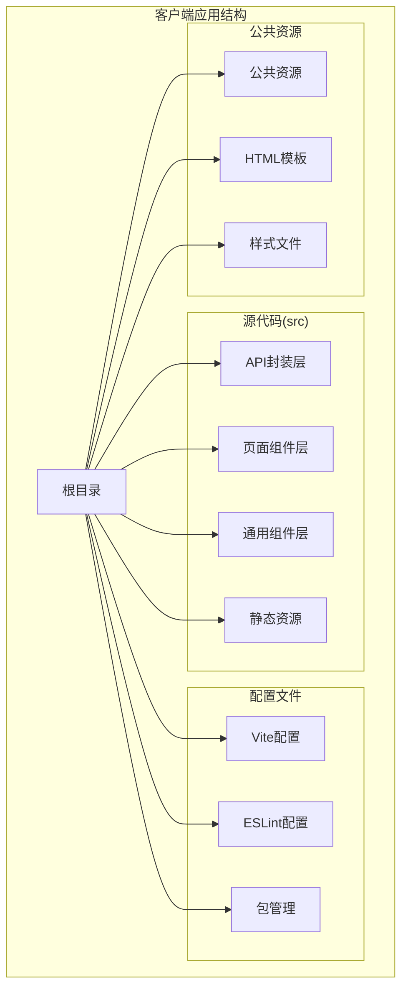
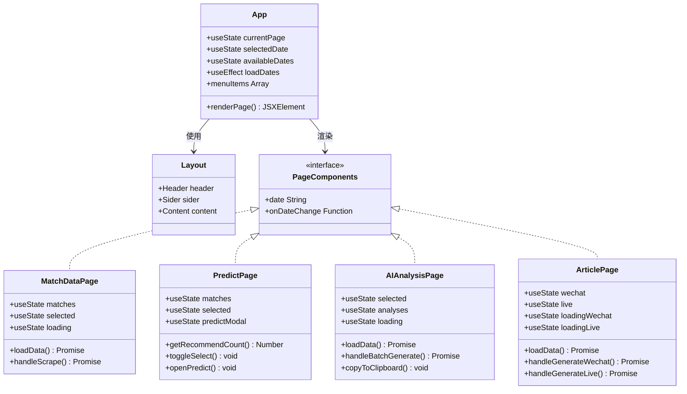
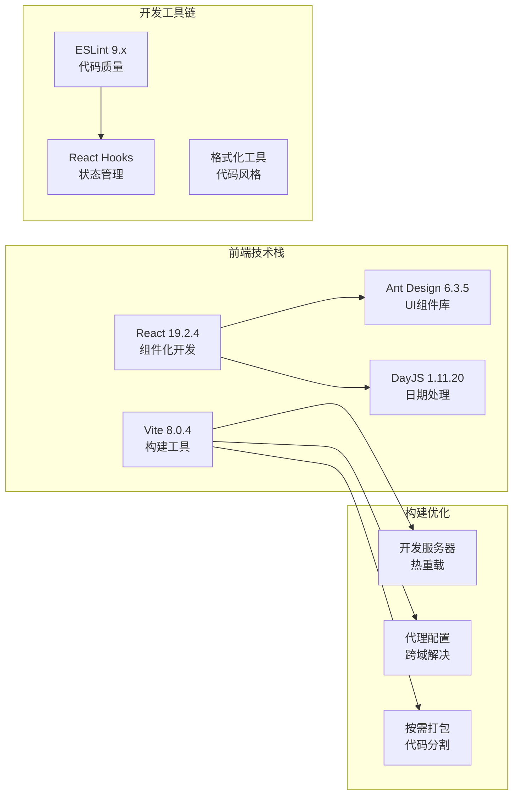
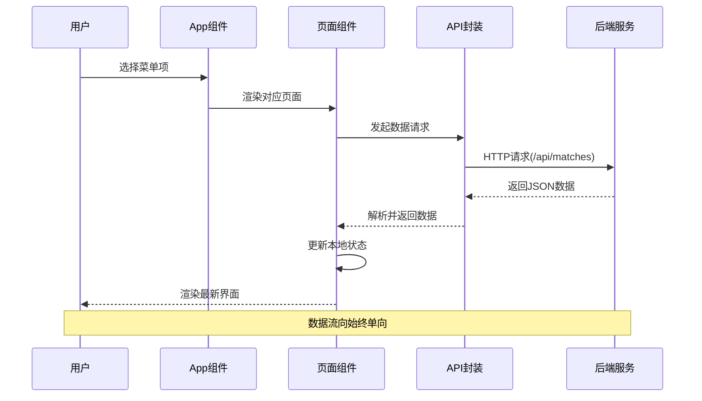
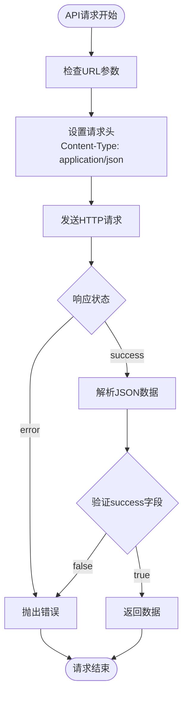
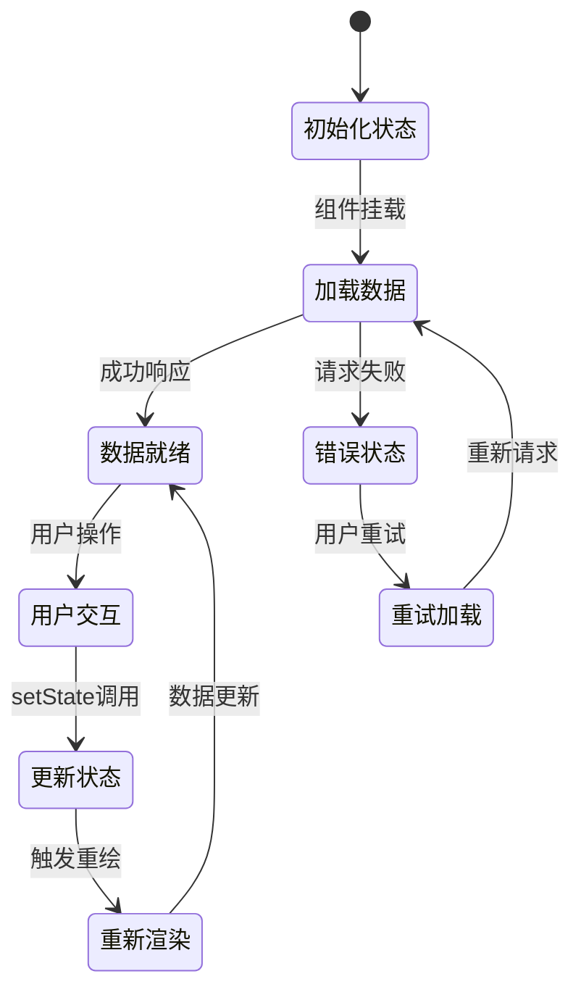
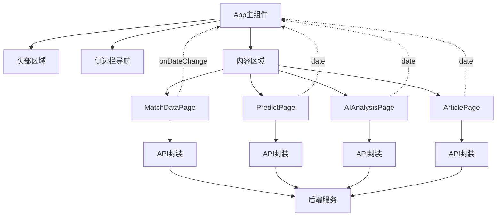
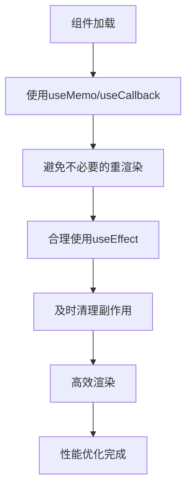
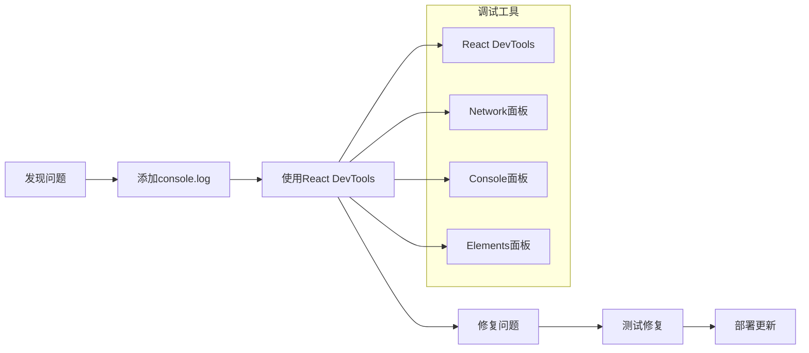

# 前端架构设计

<cite>
**本文档引用的文件**
- [client/src/App.jsx](file://client/src/App.jsx)
- [client/src/main.jsx](file://client/src/main.jsx)
- [client/vite.config.js](file://client/vite.config.js)
- [client/package.json](file://client/package.json)
- [client/src/api/index.js](file://client/src/api/index.js)
- [client/src/pages/MatchDataPage.jsx](file://client/src/pages/MatchDataPage.jsx)
- [client/src/pages/PredictPage.jsx](file://client/src/pages/PredictPage.jsx)
- [client/src/pages/AIAnalysisPage.jsx](file://client/src/pages/AIAnalysisPage.jsx)
- [client/src/pages/ArticlePage.jsx](file://client/src/pages/ArticlePage.jsx)
- [client/src/index.css](file://client/src/index.css)
- [client/index.html](file://client/index.html)
- [client/eslint.config.js](file://client/eslint.config.js)
</cite>

## 目录
1. [引言](#引言)
2. [项目结构](#项目结构)
3. [核心组件](#核心组件)
4. [架构概览](#架构概览)
5. [详细组件分析](#详细组件分析)
6. [依赖关系分析](#依赖关系分析)
7. [性能考虑](#性能考虑)
8. [故障排除指南](#故障排除指南)
9. [结论](#结论)

## 引言

AutoMatch项目是一个基于React 19.2.4和Vite 8.0.4构建的现代前端应用，专注于足球赛事智能分析。该应用提供了四个核心功能模块：赛事数据分析、智能选场预测、AI深度分析和内容生成，旨在为用户提供一站式的足球赛事分析解决方案。

## 项目结构

项目采用清晰的分层架构设计，主要分为以下层次：



**图表来源**
- [client/src/App.jsx:1-117](file://client/src/App.jsx#L1-L117)
- [client/src/main.jsx:1-11](file://client/src/main.jsx#L1-L11)
- [client/vite.config.js:1-17](file://client/vite.config.js#L1-L17)

**章节来源**
- [client/src/App.jsx:1-117](file://client/src/App.jsx#L1-L117)
- [client/src/main.jsx:1-11](file://client/src/main.jsx#L1-L11)
- [client/vite.config.js:1-17](file://client/vite.config.js#L1-L17)

## 核心组件

### 应用主组件架构

应用的核心是App.jsx主组件，它采用了Ant Design的设计系统和响应式布局：



**图表来源**
- [client/src/App.jsx:23-117](file://client/src/App.jsx#L23-L117)
- [client/src/pages/MatchDataPage.jsx:6-198](file://client/src/pages/MatchDataPage.jsx#L6-L198)
- [client/src/pages/PredictPage.jsx:9-322](file://client/src/pages/PredictPage.jsx#L9-L322)
- [client/src/pages/AIAnalysisPage.jsx:9-203](file://client/src/pages/AIAnalysisPage.jsx#L9-L203)
- [client/src/pages/ArticlePage.jsx:14-267](file://client/src/pages/ArticlePage.jsx#L14-L267)

### 页面级组件组织

四个核心页面组件按照功能职责进行组织，每个组件都遵循统一的状态管理模式：

| 组件名称 | 主要功能 | 数据流 | 状态管理 |
|---------|----------|--------|----------|
| MatchDataPage | 赛事数据展示与抓取 | API → 状态 → 表格渲染 | matches, selected, loading |
| PredictPage | 智能选场预测与保存 | 用户交互 → 状态 → API调用 | matches, selected, modal |
| AIAnalysisPage | AI分析生成与编辑 | 批量生成 → 状态 → 列表展示 | selected, analyses, loading |
| ArticlePage | 内容生成与发布 | 分析结果 → 文案生成 → 展示 | wechat, live, loading |

**章节来源**
- [client/src/App.jsx:48-56](file://client/src/App.jsx#L48-L56)
- [client/src/pages/MatchDataPage.jsx:6-23](file://client/src/pages/MatchDataPage.jsx#L6-L23)
- [client/src/pages/PredictPage.jsx:9-29](file://client/src/pages/PredictPage.jsx#L9-L29)
- [client/src/pages/AIAnalysisPage.jsx:9-29](file://client/src/pages/AIAnalysisPage.jsx#L9-L29)
- [client/src/pages/ArticlePage.jsx:14-38](file://client/src/pages/ArticlePage.jsx#L14-L38)

## 架构概览

### 现代前端技术栈

应用采用现代化的前端技术栈，确保开发效率和运行性能：



**图表来源**
- [client/package.json:12-28](file://client/package.json#L12-L28)
- [client/vite.config.js:5-16](file://client/vite.config.js#L5-L16)

### 数据流架构

应用采用单向数据流模式，确保数据的一致性和可预测性：



**图表来源**
- [client/src/App.jsx:48-56](file://client/src/App.jsx#L48-L56)
- [client/src/api/index.js:1-50](file://client/src/api/index.js#L1-L50)

**章节来源**
- [client/package.json:12-28](file://client/package.json#L12-L28)
- [client/vite.config.js:5-16](file://client/vite.config.js#L5-L16)

## 详细组件分析

### API客户端封装

API客户端采用统一的请求封装，提供类型安全的接口：



**图表来源**
- [client/src/api/index.js:3-13](file://client/src/api/index.js#L3-L13)

API封装支持的功能模块：

| 功能模块 | 接口方法 | 请求类型 | 描述 |
|---------|----------|----------|------|
| 抓取模块 | scrapeMatches | POST /api/scrape | 从500彩票网抓取比赛数据 |
| 比赛模块 | getDates, getMatches, saveSelected, savePrediction | GET/PUT | 赛事数据查询与保存 |
| AI分析模块 | generateAnalysis, batchGenerateAnalysis, getAnalyses, updateAnalysis | POST/GET/PUT | AI分析生成与管理 |
| 文章模块 | generateWechatArticle, generateLiveScript, getArticles | POST/GET | 文案生成与获取 |

**章节来源**
- [client/src/api/index.js:15-50](file://client/src/api/index.js#L15-L50)

### 状态管理模式

应用采用React Hooks进行状态管理，实现了组件间的高效数据共享：



**图表来源**
- [client/src/App.jsx:23-40](file://client/src/App.jsx#L23-L40)
- [client/src/pages/MatchDataPage.jsx:11-23](file://client/src/pages/MatchDataPage.jsx#L11-L23)

### 组件间通信模式

应用采用props传递和回调函数的方式实现组件间通信：



**图表来源**
- [client/src/App.jsx:10-13](file://client/src/App.jsx#L10-L13)
- [client/src/App.jsx:48-56](file://client/src/App.jsx#L48-L56)

**章节来源**
- [client/src/App.jsx:24-56](file://client/src/App.jsx#L24-L56)

## 依赖关系分析

### 核心依赖关系

应用的依赖关系清晰明确，遵循单一职责原则：

```mermaid
graph TB
subgraph "运行时依赖"
React[react@19.2.4]
ReactDOM[react-dom@19.2.4]
AntD[antd@6.3.5]
Icons[@ant-design/icons@6.1.1]
DayJS[dayjs@1.11.20]
end
subgraph "开发时依赖"
Vite[vite@8.0.4]
ReactPlugin[@vitejs/plugin-react@6.0.1]
ESLint[eslint@9.x]
Types[typescript类型定义]
end
subgraph "项目内部"
App[App.jsx]
Pages[页面组件]
API[API封装]
Styles[样式文件]
end
App --> React
App --> ReactDOM
App --> AntD
App --> Icons
App --> DayJS
Pages --> App
Pages --> API
API --> React
Vite --> ReactPlugin
ESLint --> Types
```

**图表来源**
- [client/package.json:12-28](file://client/package.json#L12-L28)

### 开发工具链集成

应用集成了完整的开发工具链，确保代码质量和开发体验：

| 工具类别 | 工具名称 | 版本 | 功能描述 |
|---------|----------|------|----------|
| 构建工具 | Vite | 8.0.4 | 快速开发服务器和生产构建 |
| React插件 | @vitejs/plugin-react | 6.0.1 | React开发支持 |
| 代码检查 | ESLint | 9.x | JavaScript/JSX代码质量 |
| React钩子 | eslint-plugin-react-hooks | 7.0.1 | React Hooks最佳实践 |
| React刷新 | eslint-plugin-react-refresh | 0.5.2 | 热重载支持 |
| 类型定义 | @types/react | 19.2.14 | TypeScript类型支持 |

**章节来源**
- [client/package.json:12-28](file://client/package.json#L12-L28)
- [client/eslint.config.js:1-30](file://client/eslint.config.js#L1-L30)

## 性能考虑

### 构建优化策略

应用采用多种优化策略提升性能：

1. **Tree Shaking**: 通过ES模块导入实现按需打包
2. **代码分割**: 将大型组件拆分为独立模块
3. **懒加载**: 对不常用功能采用动态导入
4. **缓存策略**: 利用浏览器缓存机制

### 运行时优化



**图表来源**
- [client/src/pages/PredictPage.jsx:34-78](file://client/src/pages/PredictPage.jsx#L34-L78)
- [client/src/pages/AIAnalysisPage.jsx:31-47](file://client/src/pages/AIAnalysisPage.jsx#L31-L47)

### 响应式设计策略

应用采用Ant Design的响应式栅格系统：

| 断点 | 设备类型 | 栅格配置 |
|------|----------|----------|
| < 576px | 移动设备 | 1列布局 |
| 576px-768px | 平板设备 | 2列布局 |
| 768px-992px | 小屏桌面 | 3列布局 |
| 992px-1200px | 中等桌面 | 4列布局 |
| > 1200px | 大屏桌面 | 6列布局 |

**章节来源**
- [client/src/index.css:17-24](file://client/src/index.css#L17-L24)
- [client/src/pages/MatchDataPage.jsx:177-185](file://client/src/pages/MatchDataPage.jsx#L177-L185)

## 故障排除指南

### 常见问题诊断

1. **API请求失败**
   - 检查代理配置是否正确
   - 验证后端服务是否启动
   - 查看网络面板中的具体错误信息

2. **组件渲染异常**
   - 检查props传递是否正确
   - 验证状态更新逻辑
   - 确认事件处理器绑定

3. **样式显示问题**
   - 检查CSS类名冲突
   - 验证Ant Design主题配置
   - 确认媒体查询断点

### 开发调试技巧



**图表来源**
- [client/src/App.jsx:32-39](file://client/src/App.jsx#L32-L39)
- [client/src/pages/MatchDataPage.jsx:25-38](file://client/src/pages/MatchDataPage.jsx#L25-L38)

**章节来源**
- [client/src/App.jsx:32-39](file://client/src/App.jsx#L32-L39)
- [client/src/pages/MatchDataPage.jsx:25-38](file://client/src/pages/MatchDataPage.jsx#L25-L38)

## 结论

AutoMatch项目的前端架构展现了现代React应用的最佳实践。通过合理的组件分层、清晰的数据流管理和完善的工具链配置，该应用实现了良好的可维护性和扩展性。

### 架构优势

1. **模块化设计**: 清晰的组件层次结构便于维护和测试
2. **状态管理**: 基于React Hooks的状态管理模式简洁高效
3. **开发体验**: Vite提供的快速开发服务器显著提升开发效率
4. **代码质量**: 完整的ESLint配置确保代码一致性
5. **用户体验**: Ant Design提供丰富的UI组件和良好的响应式支持

### 技术亮点

- **现代化技术栈**: React 19.2.4 + Vite 8.0.4的组合提供了优秀的开发体验
- **类型安全**: 完整的TypeScript类型定义提升代码可靠性
- **性能优化**: 多层次的性能优化策略确保应用流畅运行
- **可扩展性**: 模块化的架构设计便于功能扩展和维护

该架构为类似的数据分析类应用提供了优秀的参考模板，特别是在组件化开发、状态管理和构建优化方面具有重要的借鉴意义。