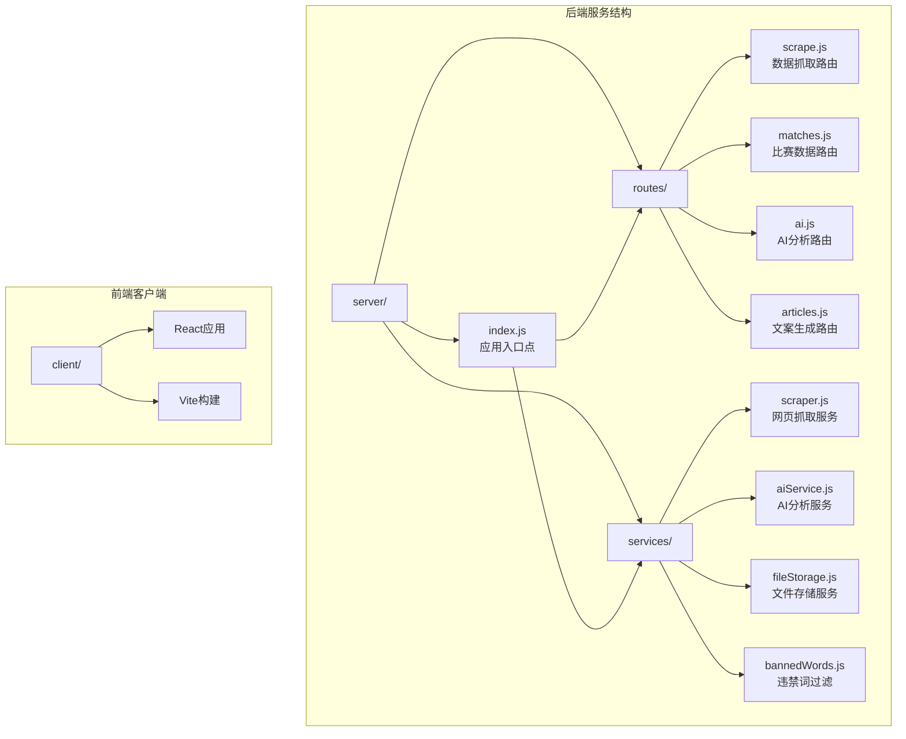
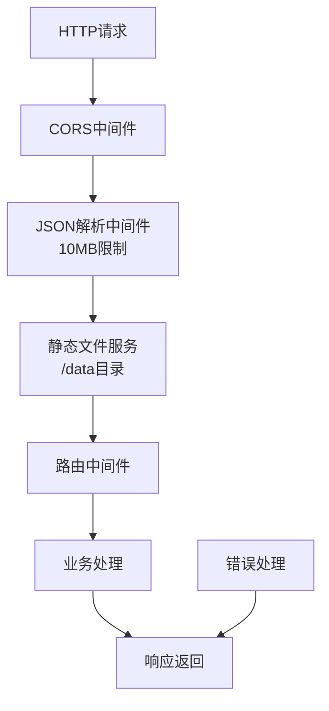
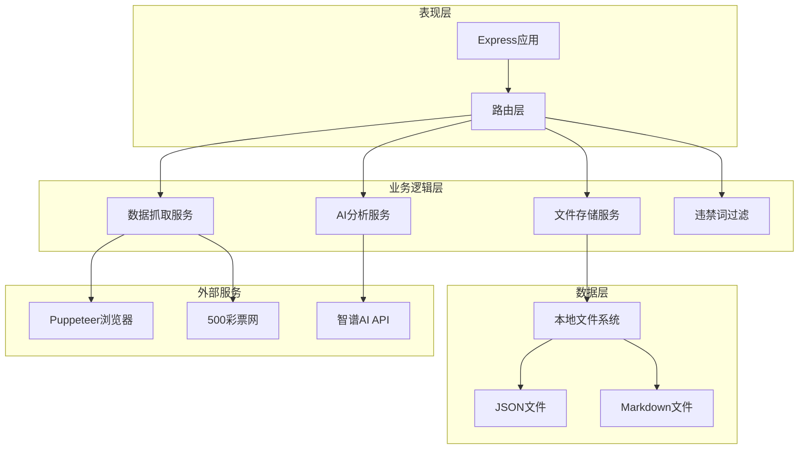
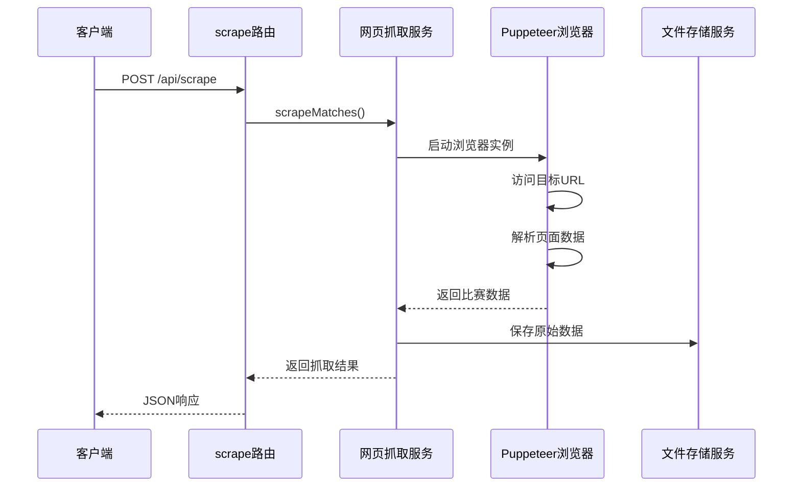
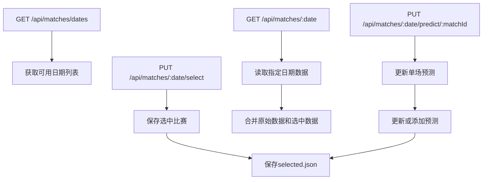
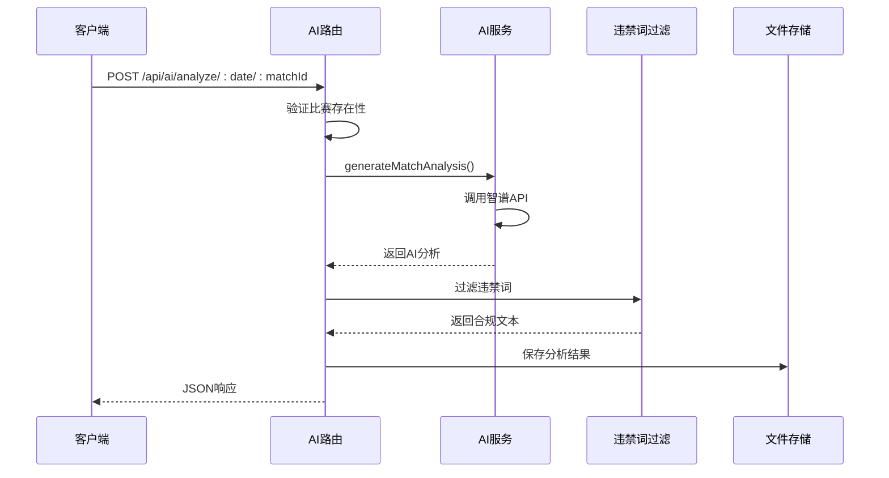
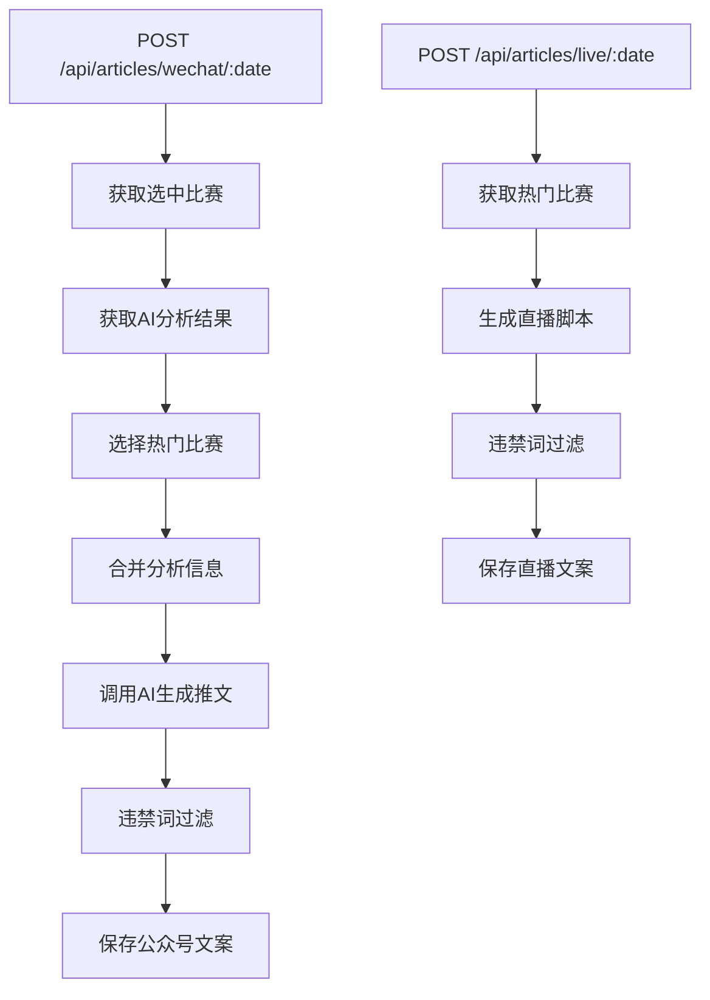
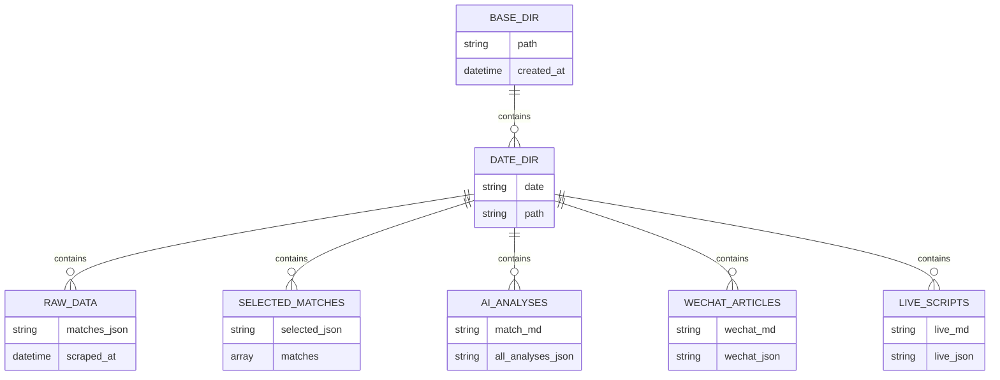
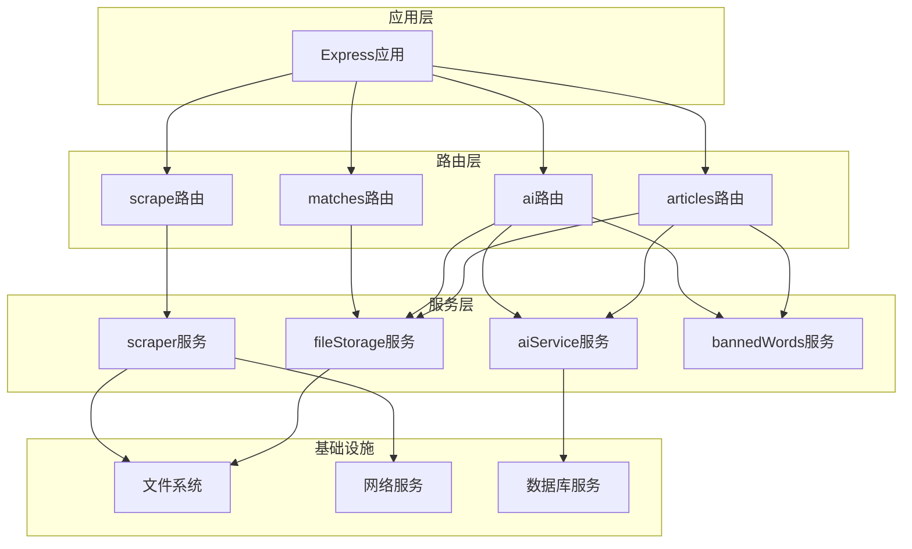
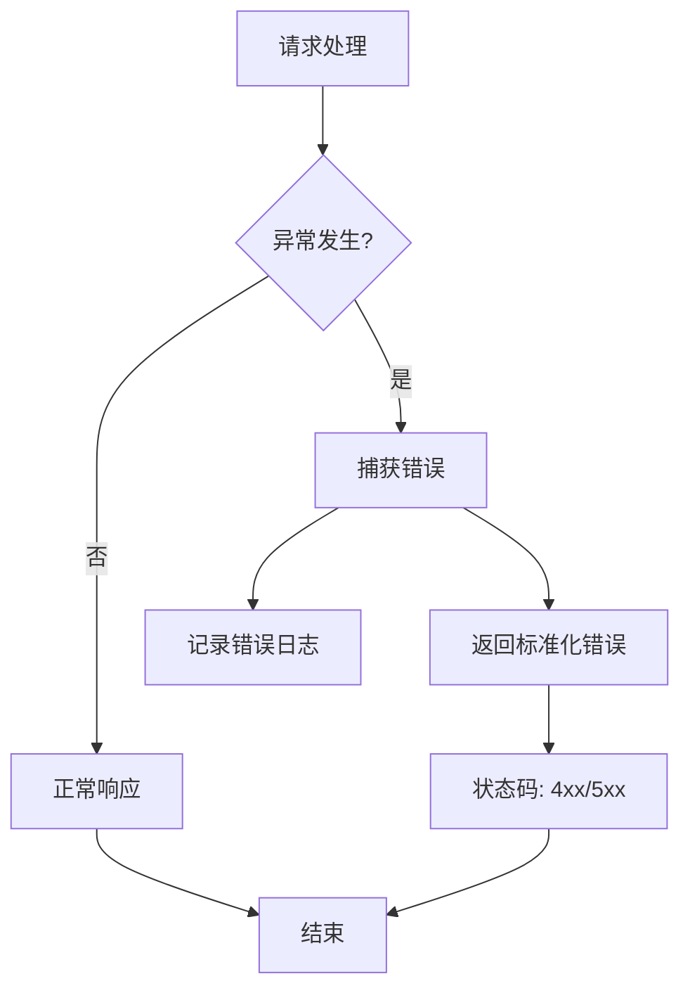

# 后端服务架构

<cite>
**本文档引用的文件**
- [server/index.js](file://server/index.js)
- [package.json](file://package.json)
- [server/routes/scrape.js](file://server/routes/scrape.js)
- [server/routes/matches.js](file://server/routes/matches.js)
- [server/routes/ai.js](file://server/routes/ai.js)
- [server/routes/articles.js](file://server/routes/articles.js)
- [server/services/scraper.js](file://server/services/scraper.js)
- [server/services/aiService.js](file://server/services/aiService.js)
- [server/services/fileStorage.js](file://server/services/fileStorage.js)
- [server/services/bannedWords.js](file://server/services/bannedWords.js)
- [PRD.md](file://PRD.md)
</cite>

## 目录
1. [简介](#简介)
2. [项目结构](#项目结构)
3. [核心组件](#核心组件)
4. [架构概览](#架构概览)
5. [详细组件分析](#详细组件分析)
6. [依赖关系分析](#依赖关系分析)
7. [性能考虑](#性能考虑)
8. [故障排除指南](#故障排除指南)
9. [结论](#结论)

## 简介

AutoMatch是一个基于Express 5.2.1构建的RESTful API服务，专为足球赛事智能分析而设计。该系统集成了数据抓取、智能选场、AI辅助分析和文案生成功能，为足球竞彩分析师提供完整的本地化解决方案。

该项目采用模块化架构设计，将业务逻辑分为独立的服务层，通过清晰的路由组织实现了功能模块的解耦。系统支持本地文件存储，提供完整的数据生命周期管理，包括原始数据抓取、分析处理和最终产物生成。

## 项目结构

AutoMatch项目采用前后端分离的结构设计，后端服务位于server目录中，包含路由定义、业务服务和数据存储层。

**图表来源**
- [server/index.js:1-49](file://server/index.js#L1-L49)
- [server/routes/scrape.js:1-26](file://server/routes/scrape.js#L1-L26)
- [server/routes/matches.js:1-75](file://server/routes/matches.js#L1-L75)
- [server/routes/ai.js:1-102](file://server/routes/ai.js#L1-L102)
- [server/routes/articles.js:1-113](file://server/routes/articles.js#L1-L113)

**章节来源**
- [server/index.js:1-49](file://server/index.js#L1-L49)
- [package.json:1-23](file://package.json#L1-L23)

## 核心组件

### 应用入口点配置

应用入口点位于server/index.js，负责初始化Express应用、配置中间件和路由注册。

**核心特性：**
- 环境变量配置加载（dotenv）
- CORS跨域资源共享支持
- JSON请求体解析（10MB限制）
- 静态文件服务（数据文件访问）
- 健康检查端点
- 根路由状态页面

### 中间件堆栈

系统采用简洁高效的中间件配置：

**图表来源**
- [server/index.js:14-19](file://server/index.js#L14-L19)

### 路由组织结构

系统采用RESTful API设计，四个主要功能模块通过独立路由文件管理：

- **scrape模块**：数据抓取功能
- **matches模块**：比赛数据管理
- **ai模块**：AI分析服务
- **articles模块**：文案生成服务

**章节来源**
- [server/index.js:6-25](file://server/index.js#L6-L25)

## 架构概览

AutoMatch采用分层架构设计，实现了业务逻辑与基础设施的清晰分离。

**图表来源**
- [server/index.js:1-49](file://server/index.js#L1-L49)
- [server/services/scraper.js:1-295](file://server/services/scraper.js#L1-L295)
- [server/services/aiService.js:1-212](file://server/services/aiService.js#L1-L212)
- [server/services/fileStorage.js:1-196](file://server/services/fileStorage.js#L1-L196)

## 详细组件分析

### 数据抓取模块 (scrape.js)

数据抓取模块负责从500彩票网获取竞彩足球比赛数据，采用Puppeteer无头浏览器技术绕过反爬虫机制。

**图表来源**
- [server/routes/scrape.js:8-23](file://server/routes/scrape.js#L8-L23)
- [server/services/scraper.js:22-214](file://server/services/scraper.js#L22-L214)

**核心功能：**
- 多种页面解析策略（标准解析+深度解析）
- 智能数据提取算法
- 错误恢复机制
- 数据验证和清洗

**章节来源**
- [server/routes/scrape.js:1-26](file://server/routes/scrape.js#L1-L26)
- [server/services/scraper.js:1-295](file://server/services/scraper.js#L1-L295)

### 比赛数据管理模块 (matches.js)

比赛数据管理模块提供完整的CRUD操作，支持比赛数据的查询、选择和预测录入。

**图表来源**
- [server/routes/matches.js:8-72](file://server/routes/matches.js#L8-L72)

**数据流处理：**
- 原始数据与选中数据的合并
- 预测数据的增量更新
- 数据一致性保证

**章节来源**
- [server/routes/matches.js:1-75](file://server/routes/matches.js#L1-L75)

### AI分析模块 (ai.js)

AI分析模块集成智谱GLM-4大模型API，提供单场分析和批量分析功能。

**图表来源**
- [server/routes/ai.js:10-34](file://server/routes/ai.js#L10-L34)
- [server/services/aiService.js:18-65](file://server/services/aiService.js#L18-L65)

**批量处理流程：**
- 逐个处理每个比赛
- 错误隔离和继续执行
- 结果聚合返回

**章节来源**
- [server/routes/ai.js:1-102](file://server/routes/ai.js#L1-L102)
- [server/services/aiService.js:1-212](file://server/services/aiService.js#L1-L212)

### 文案生成模块 (articles.js)

文案生成模块提供微信公众号推文和直播文案的自动生成功能。

**图表来源**
- [server/routes/articles.js:10-51](file://server/routes/articles.js#L10-L51)
- [server/routes/articles.js:56-93](file://server/routes/articles.js#L56-L93)

**热门比赛选择策略：**
- 优先选择标记为热门的比赛
- 默认选择前两场比赛
- 自动合并AI分析摘要

**章节来源**
- [server/routes/articles.js:1-113](file://server/routes/articles.js#L1-L113)

### 文件存储服务 (fileStorage.js)

文件存储服务提供统一的数据持久化接口，采用层次化的目录结构管理不同类型的数据。

**图表来源**
- [server/services/fileStorage.js:32-157](file://server/services/fileStorage.js#L32-L157)

**存储策略：**
- 按日期分目录组织
- 多格式文件保存（JSON + Markdown）
- 数据完整性保证
- 目录自动创建机制

**章节来源**
- [server/services/fileStorage.js:1-196](file://server/services/fileStorage.js#L1-L196)

### 违禁词过滤服务 (bannedWords.js)

违禁词过滤服务确保生成的文案符合微信平台的内容规范。

**过滤策略：**
- 基于映射表的词替换
- 按词长降序匹配，优先处理长词
- 自动清理多余空白字符
- 支持检查和过滤两种模式

**章节来源**
- [server/services/bannedWords.js:1-114](file://server/services/bannedWords.js#L1-L114)

## 依赖关系分析

系统采用模块化设计，各组件之间保持松耦合的依赖关系。

**图表来源**
- [server/index.js:6-9](file://server/index.js#L6-L9)
- [server/routes/scrape.js:3](file://server/routes/scrape.js#L3)
- [server/routes/ai.js:3-5](file://server/routes/ai.js#L3-L5)

**依赖特点：**
- 路由层仅依赖服务层接口
- 服务层相互独立，无循环依赖
- 数据持久化抽象化
- 外部服务接口标准化

**章节来源**
- [package.json:15-21](file://package.json#L15-L21)

## 性能考虑

### 并发处理能力

系统采用单进程多线程模型，具备良好的并发处理能力：

- **请求并发**：Express默认支持高并发请求处理
- **I/O密集型**：文件操作和网络请求采用异步非阻塞模式
- **内存管理**：合理使用内存，避免大数据对象长时间驻留

### 性能优化策略

**数据抓取优化：**
- Puppeteer浏览器复用机制
- 智能等待策略，避免过度等待
- 多种解析策略提高成功率

**AI服务优化：**
- API调用参数优化（温度系数、最大令牌数）
- 错误隔离处理，单场失败不影响整体流程
- 结果缓存机制

**存储优化：**
- 分层目录结构减少单文件过大
- JSON和Markdown双格式保存便于不同场景使用
- 自动目录创建避免运行时错误

### 资源管理

**内存使用：**
- 流式文件处理避免大文件加载到内存
- 及时释放Puppeteer浏览器实例
- 合理设置JSON解析大小限制

**网络资源：**
- 智谱AI API连接池管理
- 500彩票网访问频率控制
- 超时和重试机制

## 故障排除指南

### 常见问题诊断

**数据抓取失败：**
- 检查Chrome浏览器路径配置
- 验证网络连接和目标网站可达性
- 查看浏览器启动参数配置

**AI服务异常：**
- 确认ZHIPU_API_KEY环境变量配置
- 检查API配额和使用限制
- 验证网络连接稳定性

**文件存储错误：**
- 检查DATA_DIR目录权限
- 验证磁盘空间充足
- 确认目录结构正确性

### 错误处理机制

系统采用统一的错误处理模式：

**错误响应格式：**
- success: false
- error: 错误消息
- 适当的HTTP状态码

**章节来源**
- [server/routes/scrape.js:16-22](file://server/routes/scrape.js#L16-L22)
- [server/routes/matches.js:12-14](file://server/routes/matches.js#L12-L14)
- [server/routes/ai.js:30-33](file://server/routes/ai.js#L30-L33)

### 环境配置管理

**必需环境变量：**
- ZHIPU_API_KEY：智谱AI API密钥
- DATA_DIR：数据存储根目录
- CHROME_PATH：Chrome浏览器路径

**配置最佳实践：**
- 使用.env文件管理敏感配置
- 提供默认值确保系统可用性
- 配置验证和错误提示

**章节来源**
- [server/services/aiService.js:3-13](file://server/services/aiService.js#L3-L13)
- [server/index.js:18-19](file://server/index.js#L18-L19)

## 结论

AutoMatch后端服务架构展现了现代Node.js应用的最佳实践：

**架构优势：**
- 清晰的分层设计，职责分离明确
- 模块化服务，易于维护和扩展
- 完善的错误处理和监控机制
- 合理的性能优化策略

**技术特色：**
- 集成Puppeteer实现复杂网页抓取
- 智谱AI API提供高质量内容生成
- 本地文件系统实现数据持久化
- 违禁词过滤确保内容合规

**扩展建议：**
- 添加API版本控制机制
- 实现请求限流和防刷机制
- 增加缓存层提升响应速度
- 完善监控和日志系统

该架构为足球竞彩分析师提供了完整的技术解决方案，通过自动化数据处理和AI辅助分析，显著提升了工作效率和内容质量。