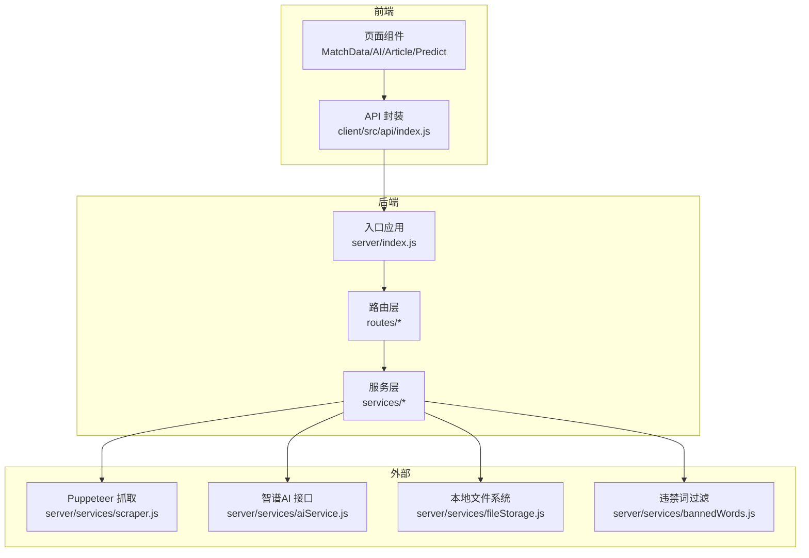
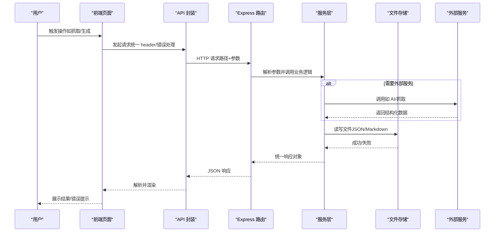
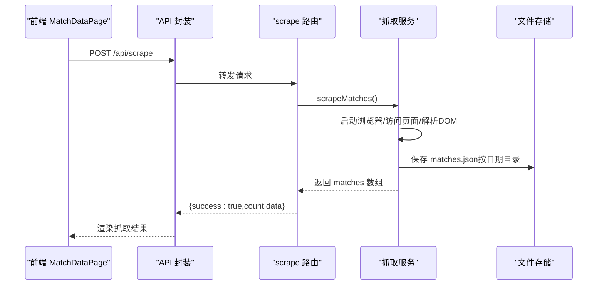
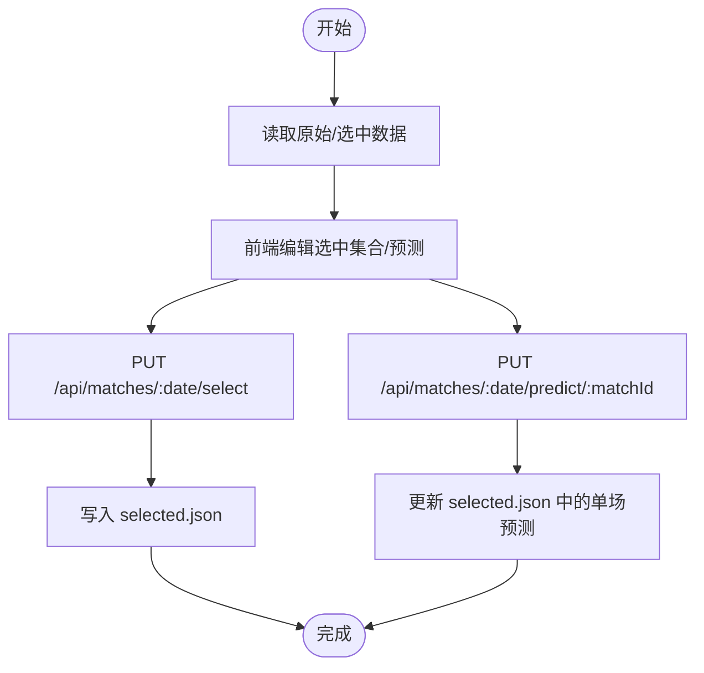
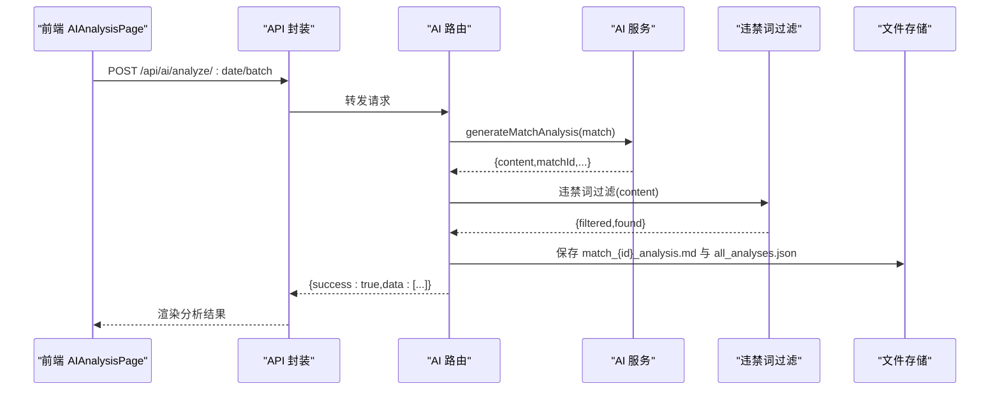
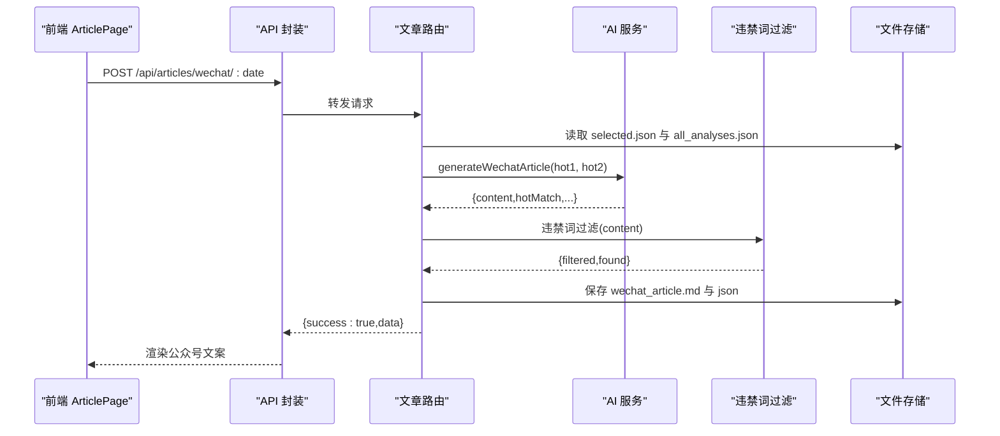
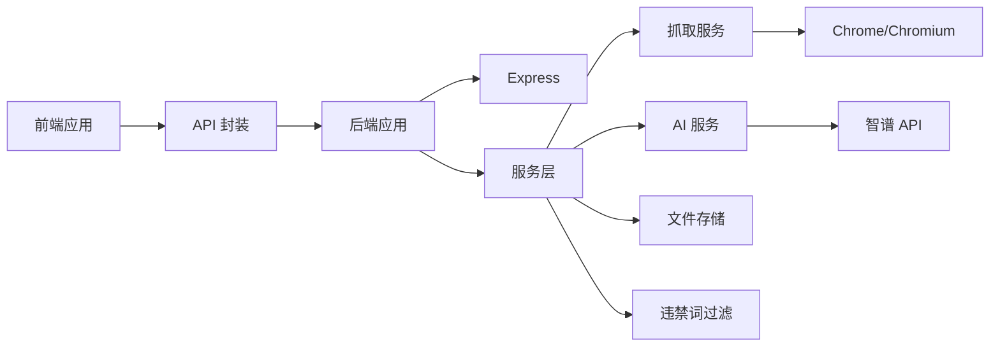

# 数据流设计

<cite>
**本文引用的文件**
- [server/index.js](file://server/index.js)
- [server/routes/scrape.js](file://server/routes/scrape.js)
- [server/routes/matches.js](file://server/routes/matches.js)
- [server/routes/ai.js](file://server/routes/ai.js)
- [server/routes/articles.js](file://server/routes/articles.js)
- [server/services/scraper.js](file://server/services/scraper.js)
- [server/services/aiService.js](file://server/services/aiService.js)
- [server/services/fileStorage.js](file://server/services/fileStorage.js)
- [server/services/bannedWords.js](file://server/services/bannedWords.js)
- [client/src/api/index.js](file://client/src/api/index.js)
- [client/src/pages/MatchDataPage.jsx](file://client/src/pages/MatchDataPage.jsx)
- [client/src/pages/PredictPage.jsx](file://client/src/pages/PredictPage.jsx)
- [client/src/pages/AIAnalysisPage.jsx](file://client/src/pages/AIAnalysisPage.jsx)
- [client/src/pages/ArticlePage.jsx](file://client/src/pages/ArticlePage.jsx)
- [package.json](file://package.json)
- [client/package.json](file://client/package.json)
- [PRD.md](file://PRD.md)
</cite>

## 目录
1. [简介](#简介)
2. [项目结构](#项目结构)
3. [核心组件](#核心组件)
4. [架构总览](#架构总览)
5. [详细组件分析](#详细组件分析)
6. [依赖关系分析](#依赖关系分析)
7. [性能考量](#性能考量)
8. [故障排查指南](#故障排查指南)
9. [结论](#结论)
10. [附录](#附录)

## 简介
本文件为 AutoMatch 项目的“数据流设计”文档，聚焦于从数据抓取到最终展示的完整数据流转过程。文档覆盖前端 API 调用、后端路由处理、服务层逻辑执行以及文件系统存储的完整链路；详细说明数据在各层级之间的传递格式与转换规则；解释异步处理模式、错误传播机制与数据一致性保障策略；并提供数据流图与时序图，展示典型用户操作的数据流向，最后讨论缓存策略与性能优化方案。

## 项目结构
AutoMatch 采用前后端分离架构：
- 前端：React + Vite + Ant Design，负责用户交互与 API 请求封装
- 后端：Node.js + Express，提供 REST API 与静态资源服务
- 数据层：本地文件系统，按日期组织结构化数据
- 外部服务：Puppeteer 无头浏览器抓取竞彩数据，智谱 GLM-4 生成文案，违禁词过滤

图表来源
- [server/index.js:1-49](file://server/index.js#L1-L49)
- [server/routes/scrape.js:1-26](file://server/routes/scrape.js#L1-L26)
- [server/routes/matches.js:1-75](file://server/routes/matches.js#L1-L75)
- [server/routes/ai.js:1-102](file://server/routes/ai.js#L1-L102)
- [server/routes/articles.js:1-113](file://server/routes/articles.js#L1-L113)
- [server/services/scraper.js:1-295](file://server/services/scraper.js#L1-L295)
- [server/services/aiService.js:1-212](file://server/services/aiService.js#L1-L212)
- [server/services/fileStorage.js:1-196](file://server/services/fileStorage.js#L1-L196)
- [server/services/bannedWords.js:1-114](file://server/services/bannedWords.js#L1-L114)
- [client/src/api/index.js:1-50](file://client/src/api/index.js#L1-L50)

章节来源
- [server/index.js:1-49](file://server/index.js#L1-L49)
- [package.json:1-23](file://package.json#L1-L23)
- [client/package.json:1-31](file://client/package.json#L1-L31)
- [PRD.md:14-21](file://PRD.md#L14-L21)

## 核心组件
- 前端 API 封装：统一请求头、错误处理与响应结构校验
- 路由层：REST API 定义与参数解析
- 服务层：
  - 抓取服务：Puppeteer 无头浏览器访问竞彩网站，解析并保存原始数据
  - AI 服务：调用智谱 GLM-4 生成分析与文案，内置提示词工程
  - 文件存储：按日期组织目录，保存 JSON/Markdown 文件
  - 违禁词过滤：合规化文案生成
- 静态资源：后端提供数据目录静态访问

章节来源
- [client/src/api/index.js:1-50](file://client/src/api/index.js#L1-L50)
- [server/routes/scrape.js:1-26](file://server/routes/scrape.js#L1-L26)
- [server/routes/matches.js:1-75](file://server/routes/matches.js#L1-L75)
- [server/routes/ai.js:1-102](file://server/routes/ai.js#L1-L102)
- [server/routes/articles.js:1-113](file://server/routes/articles.js#L1-L113)
- [server/services/scraper.js:1-295](file://server/services/scraper.js#L1-L295)
- [server/services/aiService.js:1-212](file://server/services/aiService.js#L1-L212)
- [server/services/fileStorage.js:1-196](file://server/services/fileStorage.js#L1-L196)
- [server/services/bannedWords.js:1-114](file://server/services/bannedWords.js#L1-L114)

## 架构总览
系统采用“请求-路由-服务-存储”的分层设计，前端通过统一 API 封装发起请求，后端路由解析参数并调用服务层，服务层完成业务逻辑与外部集成，最终落盘到本地文件系统。静态资源通过后端挂载提供访问。

图表来源
- [client/src/pages/MatchDataPage.jsx:25-38](file://client/src/pages/MatchDataPage.jsx#L25-L38)
- [client/src/pages/AIAnalysisPage.jsx:31-47](file://client/src/pages/AIAnalysisPage.jsx#L31-L47)
- [client/src/pages/ArticlePage.jsx:44-86](file://client/src/pages/ArticlePage.jsx#L44-L86)
- [client/src/api/index.js:15-50](file://client/src/api/index.js#L15-L50)
- [server/routes/scrape.js:8-23](file://server/routes/scrape.js#L8-L23)
- [server/routes/ai.js:10-34](file://server/routes/ai.js#L10-L34)
- [server/routes/articles.js:10-51](file://server/routes/articles.js#L10-L51)
- [server/services/scraper.js:22-214](file://server/services/scraper.js#L22-L214)
- [server/services/aiService.js:18-65](file://server/services/aiService.js#L18-L65)
- [server/services/fileStorage.js:32-39](file://server/services/fileStorage.js#L32-L39)

## 详细组件分析

### 数据抓取链路（从抓取到存储）
- 前端触发：MatchDataPage 调用抓取 API
- 后端路由：接收 POST 请求，调用抓取服务
- 服务层：Puppeteer 启动浏览器、访问目标站点、解析 DOM、构造数据结构
- 存储层：按日期目录保存原始 JSON，并记录抓取时间戳
- 响应返回：返回成功标志、数量与数据

图表来源
- [client/src/pages/MatchDataPage.jsx:25-38](file://client/src/pages/MatchDataPage.jsx#L25-L38)
- [client/src/api/index.js:16](file://client/src/api/index.js#L16)
- [server/routes/scrape.js:8-23](file://server/routes/scrape.js#L8-L23)
- [server/services/scraper.js:22-214](file://server/services/scraper.js#L22-L214)
- [server/services/fileStorage.js:32-39](file://server/services/fileStorage.js#L32-L39)

章节来源
- [server/routes/scrape.js:1-26](file://server/routes/scrape.js#L1-L26)
- [server/services/scraper.js:1-295](file://server/services/scraper.js#L1-L295)
- [server/services/fileStorage.js:1-196](file://server/services/fileStorage.js#L1-L196)
- [PRD.md:26-60](file://PRD.md#L26-L60)

### 选场与预测链路（从录入到存储）
- 前端：PredictPage 支持智能推荐、手动选择、预测录入与保存
- 后端：
  - 读取：按日期获取原始与选中数据
  - 保存：选中集合与单场预测写入文件
- 数据一致性：后端在保存预测时合并更新，避免覆盖

图表来源
- [client/src/pages/PredictPage.jsx:42-144](file://client/src/pages/PredictPage.jsx#L42-L144)
- [client/src/api/index.js:19-30](file://client/src/api/index.js#L19-L30)
- [server/routes/matches.js:40-72](file://server/routes/matches.js#L40-L72)
- [server/services/fileStorage.js:53-69](file://server/services/fileStorage.js#L53-L69)

章节来源
- [server/routes/matches.js:1-75](file://server/routes/matches.js#L1-L75)
- [server/services/fileStorage.js:1-196](file://server/services/fileStorage.js#L1-L196)
- [client/src/pages/PredictPage.jsx:1-322](file://client/src/pages/PredictPage.jsx#L1-L322)

### AI 分析链路（从生成到存储）
- 前端：AIAnalysisPage 支持批量生成、查看/编辑、复制
- 后端：
  - 单场：读取选中比赛，调用 AI 服务生成分析，违禁词过滤，保存 Markdown 与汇总 JSON
  - 批量：遍历选中集合，逐个生成并聚合结果
- 数据格式：AI 输出包含 matchId、内容、时间戳等字段，存储为 Markdown 与 JSON 汇总

图表来源
- [client/src/pages/AIAnalysisPage.jsx:31-58](file://client/src/pages/AIAnalysisPage.jsx#L31-L58)
- [client/src/api/index.js:33-42](file://client/src/api/index.js#L33-L42)
- [server/routes/ai.js:39-69](file://server/routes/ai.js#L39-L69)
- [server/services/aiService.js:18-65](file://server/services/aiService.js#L18-L65)
- [server/services/bannedWords.js:70-96](file://server/services/bannedWords.js#L70-L96)
- [server/services/fileStorage.js:74-98](file://server/services/fileStorage.js#L74-L98)

章节来源
- [server/routes/ai.js:1-102](file://server/routes/ai.js#L1-L102)
- [server/services/aiService.js:1-212](file://server/services/aiService.js#L1-L212)
- [server/services/bannedWords.js:1-114](file://server/services/bannedWords.js#L1-L114)
- [server/services/fileStorage.js:1-196](file://server/services/fileStorage.js#L1-L196)
- [client/src/pages/AIAnalysisPage.jsx:1-203](file://client/src/pages/AIAnalysisPage.jsx#L1-L203)

### 文案生成链路（公众号/直播）
- 前端：ArticlePage 选择热门比赛，生成公众号推文与直播脚本
- 后端：
  - 公众号：合并热门比赛与 AI 分析，调用 AI 服务生成文章，违禁词过滤，保存 Markdown 与 JSON
  - 直播：合并多场热门分析，生成直播脚本，同样进行过滤与落盘
- 数据来源：选中集合与 AI 分析结果

图表来源
- [client/src/pages/ArticlePage.jsx:44-86](file://client/src/pages/ArticlePage.jsx#L44-L86)
- [client/src/api/index.js:45-49](file://client/src/api/index.js#L45-L49)
- [server/routes/articles.js:10-51](file://server/routes/articles.js#L10-L51)
- [server/services/aiService.js:70-135](file://server/services/aiService.js#L70-L135)
- [server/services/bannedWords.js:70-96](file://server/services/bannedWords.js#L70-L96)
- [server/services/fileStorage.js:112-123](file://server/services/fileStorage.js#L112-L123)

章节来源
- [server/routes/articles.js:1-113](file://server/routes/articles.js#L1-L113)
- [server/services/aiService.js:1-212](file://server/services/aiService.js#L1-L212)
- [server/services/fileStorage.js:1-196](file://server/services/fileStorage.js#L1-L196)
- [client/src/pages/ArticlePage.jsx:1-267](file://client/src/pages/ArticlePage.jsx#L1-L267)

### 错误传播与一致性保障
- 错误传播：路由层捕获异常并返回统一结构；前端统一校验响应 success 字段并提示
- 一致性保障：
  - 选场预测保存时，后端基于 matchId 合并更新，避免覆盖
  - AI 分析保存时，既写 Markdown 也更新 all_analyses.json 汇总
  - 违禁词过滤在 AI 生成后立即执行，确保输出合规

章节来源
- [server/routes/matches.js:54-68](file://server/routes/matches.js#L54-L68)
- [server/routes/ai.js:20-28](file://server/routes/ai.js#L20-L28)
- [server/services/fileStorage.js:82-94](file://server/services/fileStorage.js#L82-L94)
- [client/src/api/index.js:9-12](file://client/src/api/index.js#L9-L12)

## 依赖关系分析
- 前端依赖：React 生态、Ant Design、dayjs；通过 API 封装与后端通信
- 后端依赖：Express、CORS、dotenv；服务层依赖 Puppeteer、智谱 SDK、本地文件系统
- 外部依赖：500彩票网（抓取）、智谱 GLM-4（AI）

图表来源
- [package.json:15-21](file://package.json#L15-L21)
- [client/package.json:12-17](file://client/package.json#L12-L17)
- [server/services/scraper.js:1-295](file://server/services/scraper.js#L1-L295)
- [server/services/aiService.js:1-212](file://server/services/aiService.js#L1-L212)
- [server/services/fileStorage.js:1-196](file://server/services/fileStorage.js#L1-L196)
- [server/services/bannedWords.js:1-114](file://server/services/bannedWords.js#L1-L114)

章节来源
- [package.json:1-23](file://package.json#L1-L23)
- [client/package.json:1-31](file://client/package.json#L1-L31)

## 性能考量
- 抓取性能：Puppeteer 无头模式，合理设置 User-Agent 与 viewport；页面等待策略避免过早超时
- AI 生成：控制温度与最大 token，避免超时；批量生成时逐个处理并聚合结果
- 存储性能：本地文件系统顺序写入，避免频繁随机 IO；目录按日期分层，减少根目录压力
- 前端体验：统一 loading 状态与消息提示，避免重复请求；批量操作时聚合反馈

[本节为通用性能指导，无需特定文件引用]

## 故障排查指南
- 抓取失败：检查 Chrome/Chromium 路径与可执行权限；确认网络可达与页面结构变化
- AI 失败：检查智谱 API Key 配置；查看服务端日志中的错误堆栈
- 违禁词过滤：确认过滤映射表与文本编码；必要时清理多余空白字符
- 文件存储：确认 DATA_DIR 权限与磁盘空间；检查日期目录是否存在

章节来源
- [server/services/scraper.js:10-17](file://server/services/scraper.js#L10-L17)
- [server/services/aiService.js:9-13](file://server/services/aiService.js#L9-L13)
- [server/services/bannedWords.js:70-96](file://server/services/bannedWords.js#L70-L96)
- [server/services/fileStorage.js:9-13](file://server/services/fileStorage.js#L9-L13)

## 结论
AutoMatch 的数据流以“前端 API 封装—后端路由—服务层—文件存储”为主线，结合 Puppeteer 抓取与智谱 AI 生成，形成从原始数据到成品文案的完整流水线。通过统一的响应结构、严格的错误传播与违禁词过滤，系统在本地化运行环境下实现了稳定、合规与高效的自动化分析与内容生产。

[本节为总结性内容，无需特定文件引用]

## 附录
- 数据目录结构参考 PRD 中的目录设计
- API 设计参考 PRD 的接口定义

章节来源
- [PRD.md:205-234](file://PRD.md#L205-L234)
- [PRD.md:252-271](file://PRD.md#L252-L271)