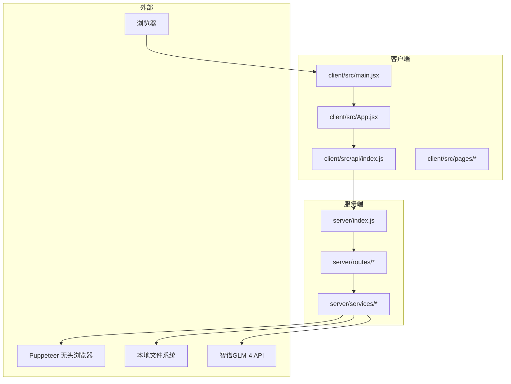
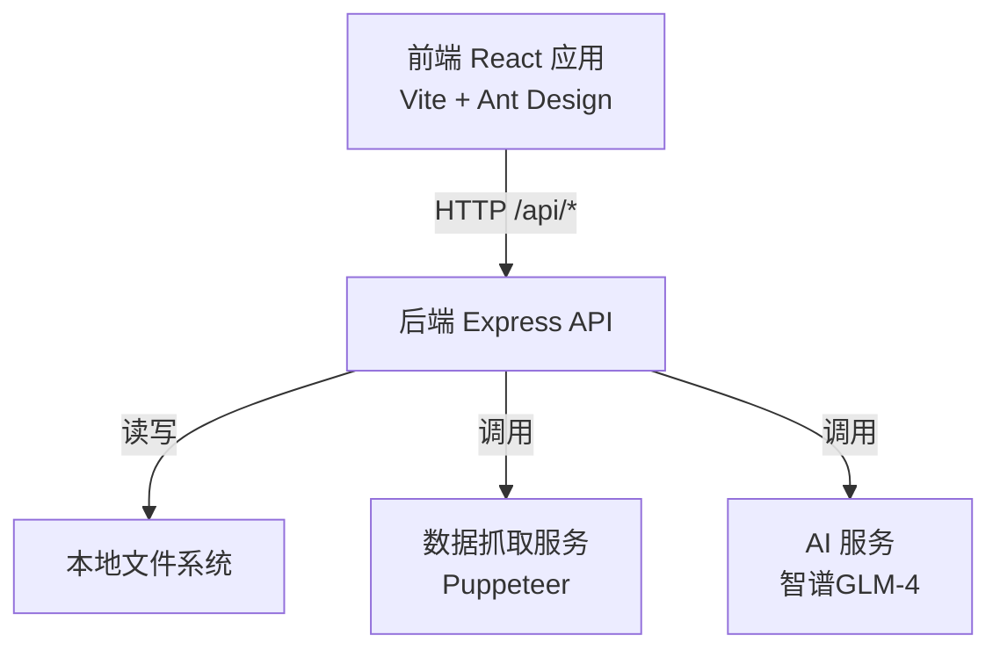
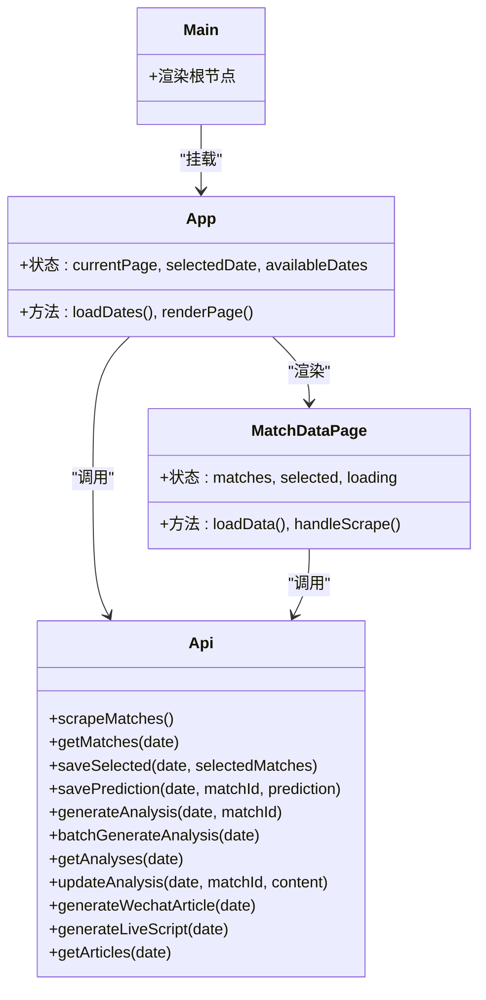
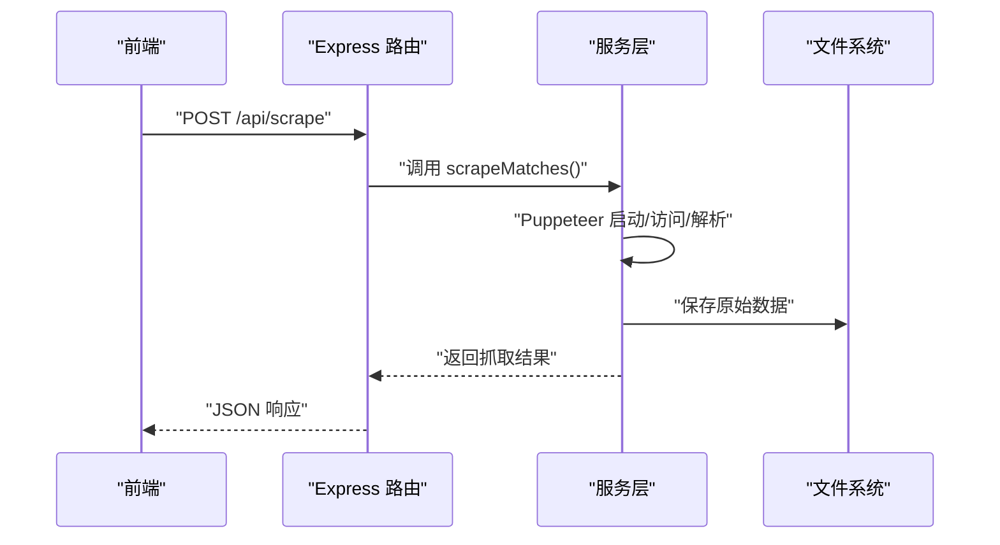
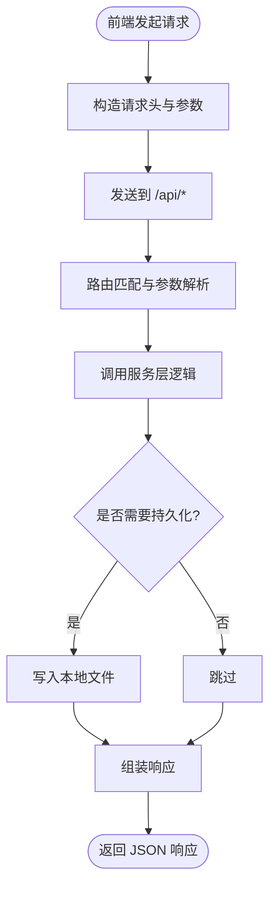
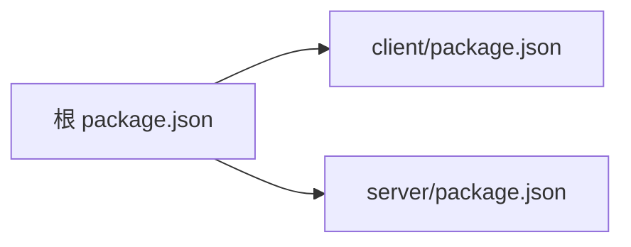

# 系统架构

<cite>
**本文引用的文件**
- [package.json](file://package.json)
- [PRD.md](file://PRD.md)
- [server/index.js](file://server/index.js)
- [server/routes/scrape.js](file://server/routes/scrape.js)
- [server/routes/matches.js](file://server/routes/matches.js)
- [server/routes/ai.js](file://server/routes/ai.js)
- [server/routes/articles.js](file://server/routes/articles.js)
- [server/services/scraper.js](file://server/services/scraper.js)
- [server/services/fileStorage.js](file://server/services/fileStorage.js)
- [client/package.json](file://client/package.json)
- [client/vite.config.js](file://client/vite.config.js)
- [client/src/main.jsx](file://client/src/main.jsx)
- [client/src/App.jsx](file://client/src/App.jsx)
- [client/src/api/index.js](file://client/src/api/index.js)
- [client/src/pages/MatchDataPage.jsx](file://client/src/pages/MatchDataPage.jsx)
</cite>

## 目录
1. [简介](#简介)
2. [项目结构](#项目结构)
3. [核心组件](#核心组件)
4. [架构总览](#架构总览)
5. [详细组件分析](#详细组件分析)
6. [依赖分析](#依赖分析)
7. [性能考虑](#性能考虑)
8. [故障排查指南](#故障排查指南)
9. [结论](#结论)
10. [附录](#附录)

## 简介
AutoMatch 是一款面向足球竞彩分析师的本地化智能分析工具，采用前后端分离架构：前端基于 React + Vite + Ant Design 构建，后端基于 Node.js + Express 提供 REST API。系统通过 Puppeteer 无头浏览器抓取竞彩数据，结合本地文件系统进行数据持久化，并集成智谱 GLM-4 大模型进行 AI 分析与文案生成，满足分析师日常赛事分析、公众号推文与直播脚本撰写的工作流。

## 项目结构
项目采用根级 monorepo 结构，前后端代码分离：
- client：React 前端应用，负责用户界面与交互，通过代理访问后端 API。
- server：Express 后端服务，提供 REST 接口、静态文件服务与业务逻辑。
- 根目录配置：统一的开发脚本与依赖管理。

图表来源
- [client/src/main.jsx:1-11](file://client/src/main.jsx#L1-L11)
- [client/src/App.jsx:1-117](file://client/src/App.jsx#L1-L117)
- [client/src/api/index.js:1-50](file://client/src/api/index.js#L1-L50)
- [server/index.js:1-49](file://server/index.js#L1-L49)
- [server/routes/scrape.js:1-26](file://server/routes/scrape.js#L1-L26)
- [server/routes/matches.js:1-75](file://server/routes/matches.js#L1-L75)
- [server/routes/ai.js:1-102](file://server/routes/ai.js#L1-L102)
- [server/routes/articles.js:1-113](file://server/routes/articles.js#L1-L113)
- [server/services/scraper.js:1-295](file://server/services/scraper.js#L1-L295)
- [server/services/fileStorage.js:1-196](file://server/services/fileStorage.js#L1-L196)

章节来源
- [package.json:1-23](file://package.json#L1-L23)
- [client/package.json:1-31](file://client/package.json#L1-L31)
- [client/vite.config.js:1-17](file://client/vite.config.js#L1-L17)
- [server/index.js:1-49](file://server/index.js#L1-L49)

## 核心组件
- 前端应用
  - 入口与主题：入口文件负责挂载 React 根节点；App 组件提供布局、菜单与日期选择。
  - API 层：封装统一的请求方法与错误处理，统一前缀 /api。
  - 页面组件：如 MatchDataPage 负责数据抓取、展示与交互。
- 后端服务
  - 应用入口：配置 CORS、中间件、静态文件与路由。
  - 路由层：按模块拆分 scrape、matches、ai、articles，职责清晰。
  - 服务层：文件存储、数据抓取、AI 与文案生成等业务逻辑。
- 技术栈与优势
  - 前端：React 生态成熟、Vite 构建快速、Ant Design 组件丰富，适合快速搭建专业工作台。
  - 后端：Express 轻量灵活、模块化路由便于扩展、Puppeteer 解决反爬与动态渲染。
  - 数据：本地文件系统存储，无需数据库，降低运维复杂度，适合本地化部署。

章节来源
- [client/src/main.jsx:1-11](file://client/src/main.jsx#L1-L11)
- [client/src/App.jsx:1-117](file://client/src/App.jsx#L1-L117)
- [client/src/api/index.js:1-50](file://client/src/api/index.js#L1-L50)
- [client/src/pages/MatchDataPage.jsx:1-198](file://client/src/pages/MatchDataPage.jsx#L1-L198)
- [server/index.js:1-49](file://server/index.js#L1-L49)
- [server/routes/scrape.js:1-26](file://server/routes/scrape.js#L1-L26)
- [server/routes/matches.js:1-75](file://server/routes/matches.js#L1-L75)
- [server/routes/ai.js:1-102](file://server/routes/ai.js#L1-L102)
- [server/routes/articles.js:1-113](file://server/routes/articles.js#L1-L113)
- [server/services/scraper.js:1-295](file://server/services/scraper.js#L1-L295)
- [server/services/fileStorage.js:1-196](file://server/services/fileStorage.js#L1-L196)

## 架构总览
系统采用典型的前后端分离架构：
- 前端通过 Vite 开发服务器提供本地调试体验，开发时启用 /api 代理指向后端服务。
- 后端提供 REST API，支持数据抓取、选场预测、AI 分析与文案生成。
- 服务层通过文件存储模块实现本地持久化，静态文件服务对外提供数据文件访问。
- 数据流自上而下贯穿：前端页面 -> API 请求 -> 路由处理 -> 服务层 -> 文件系统/外部服务。

图表来源
- [client/vite.config.js:1-17](file://client/vite.config.js#L1-L17)
- [server/index.js:1-49](file://server/index.js#L1-L49)
- [server/services/scraper.js:1-295](file://server/services/scraper.js#L1-L295)
- [server/services/fileStorage.js:1-196](file://server/services/fileStorage.js#L1-L196)

## 详细组件分析

### 前端组件分析
- 入口与布局
  - main.jsx 负责挂载根节点，App.jsx 提供顶部标题栏、左侧菜单与内容区域，支持日期切换与页面渲染。
- API 层
  - api/index.js 统一封装 fetch 请求，设置通用头部与错误处理，导出各模块 API 方法。
- 页面组件
  - MatchDataPage 展示比赛表格、抓取按钮与统计信息，调用 API 获取数据并刷新日期列表。

图表来源
- [client/src/main.jsx:1-11](file://client/src/main.jsx#L1-L11)
- [client/src/App.jsx:1-117](file://client/src/App.jsx#L1-L117)
- [client/src/api/index.js:1-50](file://client/src/api/index.js#L1-L50)
- [client/src/pages/MatchDataPage.jsx:1-198](file://client/src/pages/MatchDataPage.jsx#L1-L198)

章节来源
- [client/src/main.jsx:1-11](file://client/src/main.jsx#L1-L11)
- [client/src/App.jsx:1-117](file://client/src/App.jsx#L1-L117)
- [client/src/api/index.js:1-50](file://client/src/api/index.js#L1-L50)
- [client/src/pages/MatchDataPage.jsx:1-198](file://client/src/pages/MatchDataPage.jsx#L1-L198)

### 后端路由与服务分析
- 应用入口
  - server/index.js 配置 CORS、JSON 中间件、静态文件服务与健康检查，注册各模块路由。
- 路由层
  - scrape：触发数据抓取并返回结果。
  - matches：提供日期列表、原始数据与选场数据的读写。
  - ai：单场/批量 AI 分析生成与更新，以及分析查询。
  - articles：公众号与直播文案生成、查询。
- 服务层
  - scraper：使用 Puppeteer 访问目标站点，解析表格数据，回写文件系统。
  - fileStorage：封装本地文件读写、目录结构管理与日期索引。

图表来源
- [server/index.js:1-49](file://server/index.js#L1-L49)
- [server/routes/scrape.js:1-26](file://server/routes/scrape.js#L1-L26)
- [server/services/scraper.js:1-295](file://server/services/scraper.js#L1-L295)
- [server/services/fileStorage.js:1-196](file://server/services/fileStorage.js#L1-L196)

章节来源
- [server/index.js:1-49](file://server/index.js#L1-L49)
- [server/routes/scrape.js:1-26](file://server/routes/scrape.js#L1-L26)
- [server/routes/matches.js:1-75](file://server/routes/matches.js#L1-L75)
- [server/routes/ai.js:1-102](file://server/routes/ai.js#L1-L102)
- [server/routes/articles.js:1-113](file://server/routes/articles.js#L1-L113)
- [server/services/scraper.js:1-295](file://server/services/scraper.js#L1-L295)
- [server/services/fileStorage.js:1-196](file://server/services/fileStorage.js#L1-L196)

### 数据流与交互模式
- 前端 API 调用
  - 通过 api/index.js 的统一方法发起请求，设置 Content-Type 为 application/json。
- 后端路由处理
  - 各路由根据 HTTP 方法与参数执行业务逻辑，返回统一结构 { success, data/error }。
- 服务层逻辑
  - scraper 负责网络请求与页面解析；fileStorage 负责本地文件读写与目录组织。
- 静态文件服务
  - 后端提供 /data 前缀静态文件服务，前端可直接访问本地数据文件。

图表来源
- [client/src/api/index.js:1-50](file://client/src/api/index.js#L1-L50)
- [server/index.js:1-49](file://server/index.js#L1-L49)
- [server/routes/matches.js:1-75](file://server/routes/matches.js#L1-L75)
- [server/services/fileStorage.js:1-196](file://server/services/fileStorage.js#L1-L196)

章节来源
- [client/src/api/index.js:1-50](file://client/src/api/index.js#L1-L50)
- [server/index.js:1-49](file://server/index.js#L1-L49)
- [server/routes/matches.js:1-75](file://server/routes/matches.js#L1-L75)
- [server/services/fileStorage.js:1-196](file://server/services/fileStorage.js#L1-L196)

## 依赖分析
- 前端依赖
  - React、ReactDOM、Ant Design、dayjs、@vitejs/plugin-react、eslint 等。
- 后端依赖
  - express、cors、dotenv、puppeteer-core、zhipuai-sdk-nodejs-v4 等。
- 开发脚本
  - 根目录提供 server、client、start 等脚本，便于统一启动前后端。

图表来源
- [package.json:1-23](file://package.json#L1-L23)
- [client/package.json:1-31](file://client/package.json#L1-L31)

章节来源
- [package.json:1-23](file://package.json#L1-L23)
- [client/package.json:1-31](file://client/package.json#L1-L31)

## 性能考虑
- 前端
  - Vite 提供快速冷启动与热更新，减少开发等待时间。
  - Ant Design 组件按需加载与样式优化有助于提升首屏渲染效率。
- 后端
  - Express 中间件限制 JSON 体积，避免过大请求导致内存压力。
  - Puppeteer 无头模式与合理参数（如 --no-sandbox）平衡稳定性与性能。
  - 文件系统读写采用同步写入，保证一致性；若数据量增大可考虑异步写入与缓存策略。
- 数据与接口
  - API 返回统一结构，前端可快速判断成功/失败，减少重复判断逻辑。
  - 静态文件服务直接提供数据文件，避免额外序列化开销。

## 故障排查指南
- 常见问题
  - Chrome/Chromium 路径问题：scraper 会尝试多个候选路径，可通过环境变量指定可执行路径。
  - 抓取失败：检查网络连通性、目标站点结构变化与 Puppeteer 参数。
  - CORS 错误：确认后端已启用 CORS，前端代理配置正确。
  - 文件权限：确保 DATA_DIR 或桌面目录具有读写权限。
- 日志与监控
  - 后端在关键流程打印日志，便于定位问题。
  - 健康检查接口 /api/health 可用于快速验证服务可用性。

章节来源
- [server/services/scraper.js:1-295](file://server/services/scraper.js#L1-L295)
- [server/index.js:1-49](file://server/index.js#L1-L49)

## 结论
AutoMatch 通过前后端分离架构实现了清晰的职责划分与良好的扩展性。前端专注于用户体验与交互，后端专注数据处理与业务逻辑，配合本地文件系统与外部 AI 服务，满足了分析师从数据抓取到文案生成的完整工作流。建议在后续迭代中引入异步写入、缓存与更细粒度的日志监控，进一步提升性能与可观测性。

## 附录
- API 设计概览（节选）
  - 抓取相关：POST /api/scrape、GET /api/matches/:date
  - 选场相关：PUT /api/matches/:date/select、PUT /api/matches/:date/predict/:matchId
  - AI 分析：POST /api/ai/analyze/:date/:matchId、POST /api/ai/analyze/:date/batch、GET /api/ai/analyses/:date、PUT /api/ai/analyses/:date/:matchId
  - 文案相关：POST /api/articles/wechat/:date、POST /api/articles/live/:date、GET /api/articles/:date

章节来源
- [PRD.md:252-271](file://PRD.md#L252-L271)