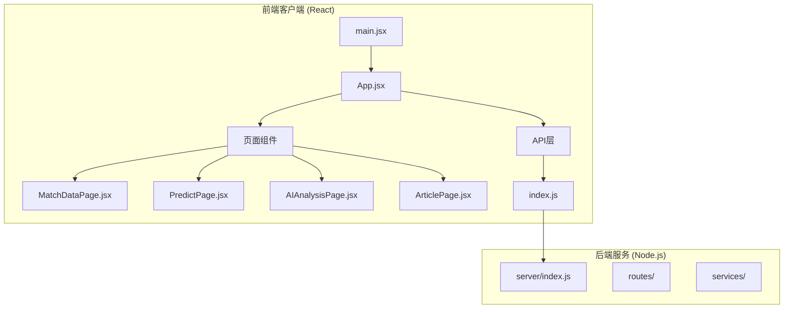
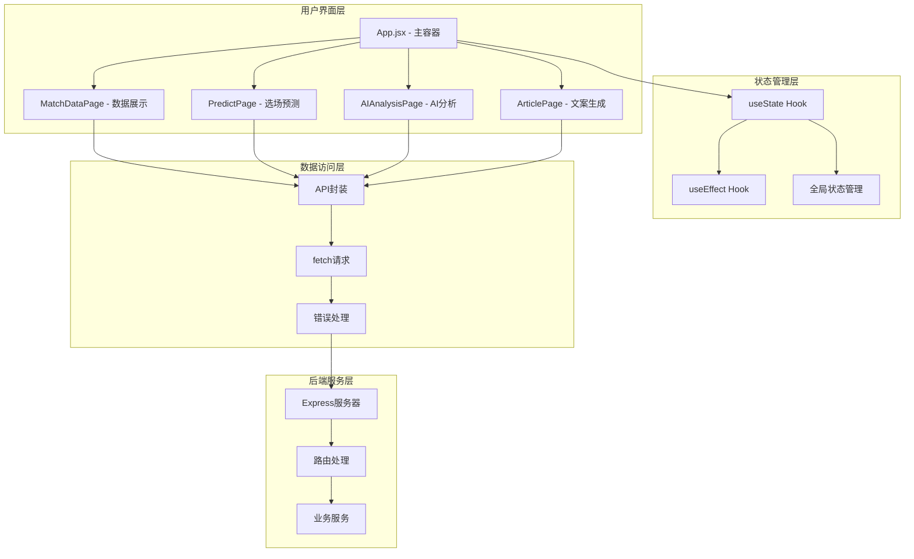
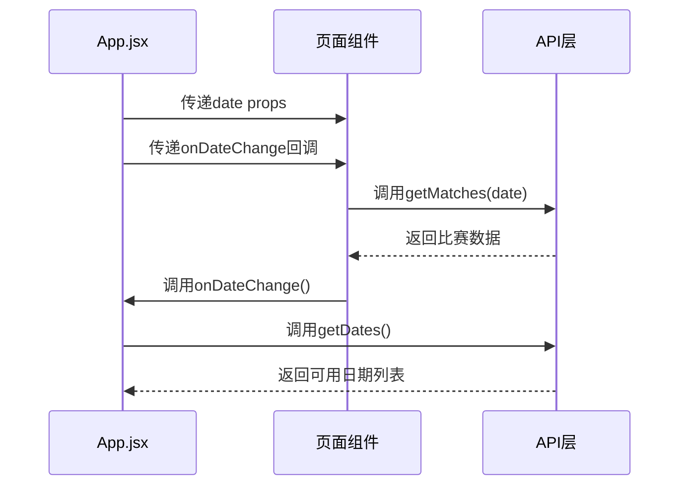
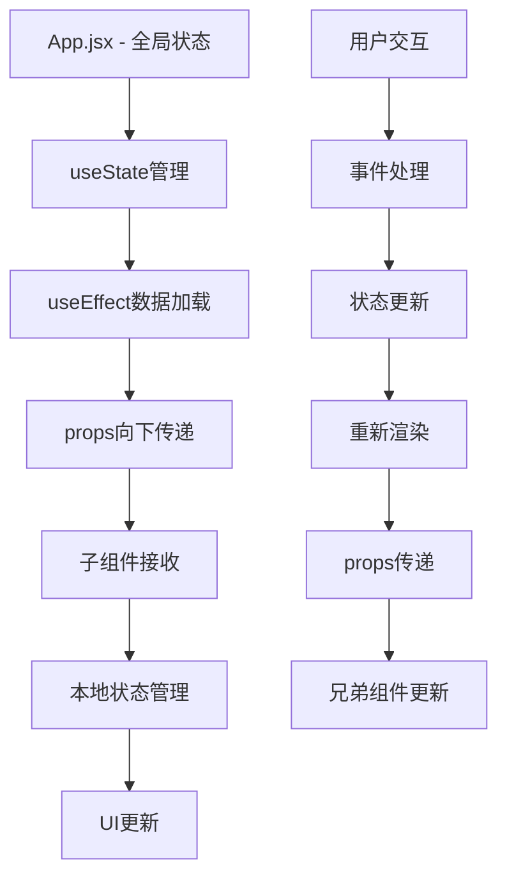
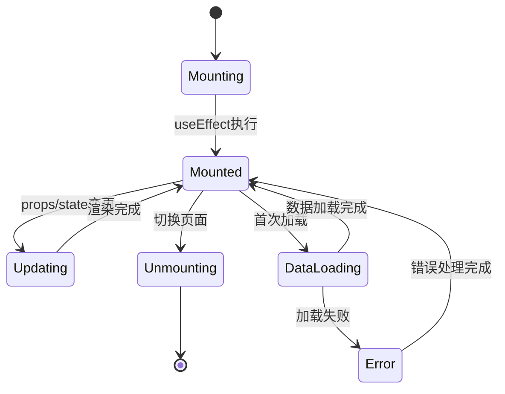
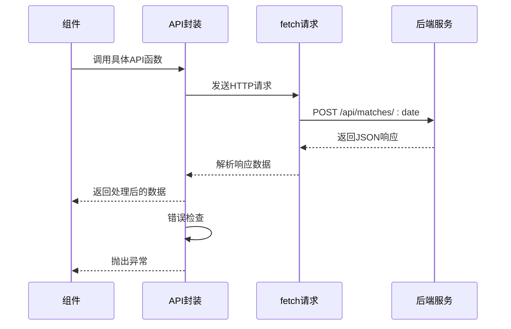
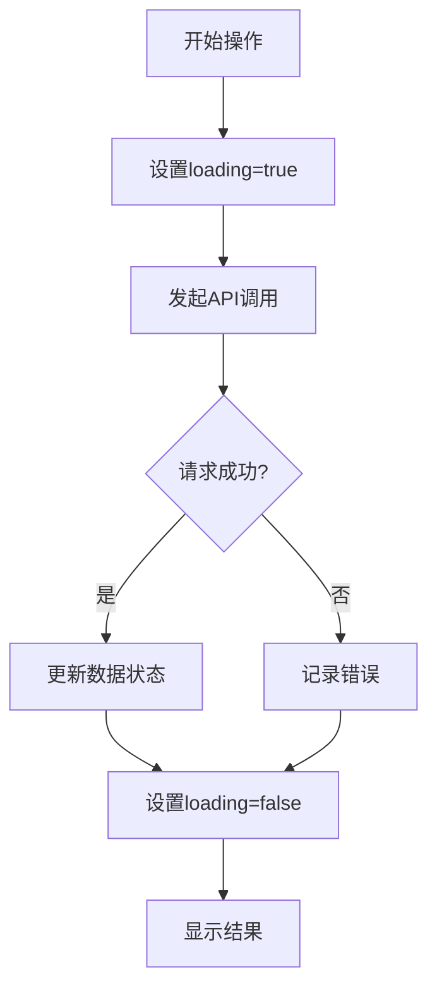
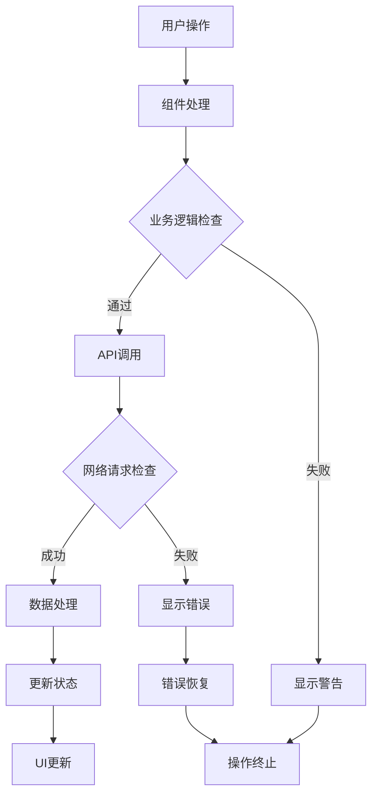
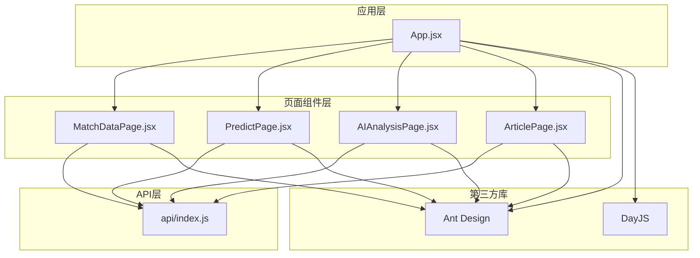
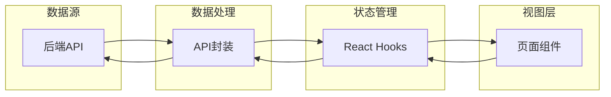

# 组件交互模式

<cite>
**本文档引用的文件**
- [App.jsx](file://client/src/App.jsx)
- [main.jsx](file://client/src/main.jsx)
- [MatchDataPage.jsx](file://client/src/pages/MatchDataPage.jsx)
- [PredictPage.jsx](file://client/src/pages/PredictPage.jsx)
- [AIAnalysisPage.jsx](file://client/src/pages/AIAnalysisPage.jsx)
- [ArticlePage.jsx](file://client/src/pages/ArticlePage.jsx)
- [index.js](file://client/src/api/index.js)
- [PRD.md](file://PRD.md)
</cite>

## 目录
1. [简介](#简介)
2. [项目结构](#项目结构)
3. [核心组件](#核心组件)
4. [架构概览](#架构概览)
5. [详细组件分析](#详细组件分析)
6. [依赖关系分析](#依赖关系分析)
7. [性能考虑](#性能考虑)
8. [故障排除指南](#故障排除指南)
9. [结论](#结论)

## 简介

AutoMatch是一个面向足球竞彩分析师的本地化工具，集成了赛事数据抓取、智能选场、AI辅助分析、文案生成等功能。该项目采用React + Vite + Ant Design技术栈构建，通过清晰的组件层次结构实现了高效的组件间通信和数据传递模式。

该系统的核心目标是帮助分析师高效完成每日赛事分析、公众号推文和直播文案撰写工作，通过模块化的组件设计和标准化的数据流管理，确保了系统的可维护性和扩展性。

## 项目结构

AutoMatch项目采用清晰的功能模块化组织方式，主要分为前端客户端和后端服务两大部分：

**图表来源**
- [main.jsx:1-11](file://client/src/main.jsx#L1-L11)
- [App.jsx:1-117](file://client/src/App.jsx#L1-L117)

项目采用分层架构设计：
- **入口层**: main.jsx负责应用启动和根组件渲染
- **容器层**: App.jsx作为应用主容器，管理全局状态和页面路由
- **页面层**: 四个功能页面组件，每个负责特定业务功能
- **API层**: 统一的API接口封装，提供数据访问抽象

**章节来源**
- [main.jsx:1-11](file://client/src/main.jsx#L1-L11)
- [App.jsx:1-117](file://client/src/App.jsx#L1-L117)

## 核心组件

### 应用主容器 (App.jsx)

App.jsx是整个应用的根组件，承担着全局状态管理、页面路由控制和组件协调的重要职责。它实现了以下核心功能：

- **全局状态管理**: 维护当前页面标识、选中日期、可用日期列表等全局状态
- **页面路由控制**: 通过菜单选择控制不同页面组件的渲染
- **日期选择器集成**: 提供统一的日期选择功能，支持跨组件的状态同步
- **主题配置**: 集成Ant Design的主题配置和国际化设置

### 页面级组件

系统包含四个核心页面组件，每个都专注于特定的业务功能：

1. **MatchDataPage**: 赛事数据展示和抓取
2. **PredictPage**: 智能选场和预测录入
3. **AIAnalysisPage**: AI辅助分析生成和编辑
4. **ArticlePage**: 热门文案生成和管理

**章节来源**
- [App.jsx:23-117](file://client/src/App.jsx#L23-L117)
- [MatchDataPage.jsx:1-198](file://client/src/pages/MatchDataPage.jsx#L1-L198)
- [PredictPage.jsx:1-322](file://client/src/pages/PredictPage.jsx#L1-L322)
- [AIAnalysisPage.jsx:1-203](file://client/src/pages/AIAnalysisPage.jsx#L1-L203)
- [ArticlePage.jsx:1-267](file://client/src/pages/ArticlePage.jsx#L1-L267)

## 架构概览

AutoMatch采用了典型的单页应用(SPA)架构，结合了组件化设计和模块化数据流管理：

**图表来源**
- [App.jsx:23-117](file://client/src/App.jsx#L23-L117)
- [index.js:1-50](file://client/src/api/index.js#L1-L50)

该架构实现了以下设计原则：
- **单一职责**: 每个组件专注于特定功能领域
- **数据流向**: 自上而下的单向数据流，便于调试和维护
- **状态集中**: 全局状态在App.jsx中统一管理
- **API抽象**: 所有网络请求通过统一的API层处理

## 详细组件分析

### 父子组件通信模式

#### App.jsx → 页面组件 (Props传递)

App.jsx通过props向子组件传递关键数据和回调函数：

**图表来源**
- [App.jsx:48-56](file://client/src/App.jsx#L48-L56)
- [MatchDataPage.jsx:6-23](file://client/src/pages/MatchDataPage.jsx#L6-L23)

#### 状态提升模式

当子组件需要修改父组件状态时，采用回调函数模式：

1. **日期变更**: MatchDataPage通过onDateChange回调通知App.jsx更新可用日期
2. **数据同步**: 各页面组件通过props接收最新数据，保持状态一致性

**章节来源**
- [App.jsx:48-56](file://client/src/App.jsx#L48-L56)
- [MatchDataPage.jsx:32](file://client/src/pages/MatchDataPage.jsx#L32)

### 兄弟组件协作机制

虽然AutoMatch采用单向数据流架构，但通过以下机制实现组件间协作：

#### 全局状态共享

所有页面组件共享来自App.jsx的日期状态，确保：
- **数据一致性**: 同一日期下的所有操作使用相同的时间维度
- **状态同步**: 任一组件的状态变更都能影响其他组件

#### 条件渲染策略

App.jsx根据currentPage状态动态渲染不同页面组件，实现：
- **资源优化**: 只渲染当前激活的页面
- **内存管理**: 避免不必要的组件实例化

**章节来源**
- [App.jsx:24-56](file://client/src/App.jsx#L24-L56)

### 全局状态管理策略

#### React Hooks + Props Drilling

系统采用React Hooks配合props传递的方式管理状态：

**图表来源**
- [App.jsx:23-40](file://client/src/App.jsx#L23-L40)
- [PredictPage.jsx:9-29](file://client/src/pages/PredictPage.jsx#L9-L29)

#### 状态更新流程

1. **用户触发**: 用户在某个组件执行操作
2. **状态变更**: 组件内部状态更新
3. **数据同步**: 通过props传递给相关组件
4. **UI响应**: 相关组件重新渲染显示最新数据

**章节来源**
- [App.jsx:23-40](file://client/src/App.jsx#L23-L40)
- [AIAnalysisPage.jsx:16-29](file://client/src/pages/AIAnalysisPage.jsx#L16-L29)

### 页面生命周期管理

#### 组件挂载和卸载

**图表来源**
- [MatchDataPage.jsx:11-23](file://client/src/pages/MatchDataPage.jsx#L11-L23)
- [PredictPage.jsx:17-29](file://client/src/pages/PredictPage.jsx#L17-L29)

#### 数据加载策略

每个页面组件都有独立的数据加载生命周期：
- **首次挂载**: 自动加载对应日期的数据
- **依赖变更**: 当日期props变化时重新加载
- **手动刷新**: 提供刷新按钮手动触发数据更新

**章节来源**
- [MatchDataPage.jsx:11-23](file://client/src/pages/MatchDataPage.jsx#L11-L23)
- [AIAnalysisPage.jsx:16-29](file://client/src/pages/AIAnalysisPage.jsx#L16-L29)

### API调用模式

#### 统一API封装

所有网络请求通过index.js中的request函数进行统一处理：

**图表来源**
- [index.js:3-13](file://client/src/api/index.js#L3-L13)
- [index.js:15-50](file://client/src/api/index.js#L15-L50)

#### 错误处理机制

API封装实现了统一的错误处理：
- **响应验证**: 检查success字段确认请求是否成功
- **错误抛出**: 将错误信息包装为标准Error对象
- **状态反馈**: 通过message组件向用户显示友好提示

**章节来源**
- [index.js:3-13](file://client/src/api/index.js#L3-L13)

### 数据加载状态管理

#### 加载状态控制

每个组件都实现了完整的加载状态管理：

**图表来源**
- [MatchDataPage.jsx:25-38](file://client/src/pages/MatchDataPage.jsx#L25-L38)
- [AIAnalysisPage.jsx:31-47](file://client/src/pages/AIAnalysisPage.jsx#L31-L47)

#### 用户体验优化

- **加载指示器**: 使用Spin组件提供视觉反馈
- **消息提示**: 通过message组件提供操作结果反馈
- **禁用交互**: 在加载期间禁用相关按钮防止重复操作

**章节来源**
- [AIAnalysisPage.jsx:31-47](file://client/src/pages/AIAnalysisPage.jsx#L31-L47)
- [ArticlePage.jsx:44-86](file://client/src/pages/ArticlePage.jsx#L44-L86)

### 错误处理策略

#### 分层错误处理

系统实现了多层错误处理机制：

1. **API层**: 统一的网络请求错误处理
2. **组件层**: 页面级的业务逻辑错误处理
3. **用户层**: 友好的错误提示和恢复机制

**图表来源**
- [MatchDataPage.jsx:33-37](file://client/src/pages/MatchDataPage.jsx#L33-L37)
- [PredictPage.jsx:102-113](file://client/src/pages/PredictPage.jsx#L102-L113)

#### 错误恢复机制

- **自动重试**: 对于临时性错误提供重试机会
- **降级处理**: 在部分功能不可用时提供基础功能
- **状态回滚**: 保持数据一致性，避免部分更新导致的数据不一致

**章节来源**
- [ArticlePage.jsx:44-86](file://client/src/pages/ArticlePage.jsx#L44-L86)
- [PredictPage.jsx:129-144](file://client/src/pages/PredictPage.jsx#L129-L144)

## 依赖关系分析

### 组件依赖图

**图表来源**
- [App.jsx:1-18](file://client/src/App.jsx#L1-L18)
- [MatchDataPage.jsx:1-5](file://client/src/pages/MatchDataPage.jsx#L1-L5)

### 数据流依赖

系统实现了清晰的数据流依赖关系：

**图表来源**
- [index.js:1-50](file://client/src/api/index.js#L1-L50)
- [App.jsx:23-40](file://client/src/App.jsx#L23-L40)

**章节来源**
- [App.jsx:1-18](file://client/src/App.jsx#L1-L18)
- [index.js:1-50](file://client/src/api/index.js#L1-L50)

## 性能考虑

### 渲染优化

#### 条件渲染策略

系统通过条件渲染减少不必要的组件实例化：
- **按需渲染**: 只渲染当前激活的页面组件
- **状态隔离**: 每个页面组件维护独立的状态树
- **内存管理**: 切换页面时自动清理未使用的组件

#### 数据缓存机制

- **本地缓存**: 组件内部维护数据缓存，避免重复请求
- **状态持久化**: 通过props传递确保跨组件数据一致性
- **防抖处理**: 对频繁触发的操作进行防抖优化

### 网络请求优化

#### 请求合并策略

- **批量操作**: 支持批量生成AI分析，减少API调用次数
- **并发控制**: 合理控制并发请求数量，避免服务器压力
- **错误重试**: 实现智能重试机制，提高请求成功率

### 用户体验优化

#### 加载状态管理

- **渐进式加载**: 分步骤显示数据，提供更好的用户体验
- **进度反馈**: 通过Spin组件和消息提示提供实时反馈
- **交互锁定**: 在加载期间禁用相关交互，防止用户误操作

## 故障排除指南

### 常见问题诊断

#### API请求失败

**症状**: 组件加载失败，控制台显示网络错误

**诊断步骤**:
1. 检查后端服务是否正常运行
2. 验证API端点是否可达
3. 确认CORS配置正确
4. 检查网络连接状态

**解决方案**:
- 重启后端服务
- 检查防火墙设置
- 验证API密钥配置
- 清除浏览器缓存

#### 数据不一致

**症状**: 不同页面显示不同的数据状态

**诊断步骤**:
1. 检查props传递是否正确
2. 验证状态提升是否生效
3. 确认useEffect依赖数组配置
4. 检查组件卸载和重新挂载时机

**解决方案**:
- 确保所有依赖的日期参数正确传递
- 检查useEffect的依赖项配置
- 实现适当的错误边界处理
- 添加数据版本控制机制

#### 性能问题

**症状**: 页面切换缓慢，组件渲染卡顿

**诊断步骤**:
1. 检查组件树复杂度
2. 分析内存使用情况
3. 监控网络请求频率
4. 评估第三方库使用情况

**解决方案**:
- 实现组件懒加载
- 优化数据结构
- 减少不必要的重渲染
- 使用React.memo进行优化

**章节来源**
- [index.js:3-13](file://client/src/api/index.js#L3-L13)
- [App.jsx:28-39](file://client/src/App.jsx#L28-L39)

### 调试技巧

#### 开发工具使用

- **React DevTools**: 检查组件树和状态变化
- **Network面板**: 监控API请求和响应
- **Console面板**: 查看错误日志和警告信息
- **Performance面板**: 分析渲染性能瓶颈

#### 日志记录策略

- **关键操作日志**: 记录重要的用户操作和系统事件
- **错误日志**: 详细记录错误发生的时间、地点和上下文
- **性能指标**: 收集关键的性能数据用于分析
- **用户行为追踪**: 记录用户在系统中的行为路径

## 结论

AutoMatch项目通过精心设计的组件交互模式和数据流管理，成功构建了一个功能完整、易于维护的足球赛事分析工具。项目的主要特点包括：

### 设计优势

1. **清晰的架构层次**: 从应用容器到页面组件的分层设计，确保了良好的可维护性
2. **统一的状态管理模式**: 通过React Hooks和props传递实现了简洁高效的状态管理
3. **标准化的API封装**: 统一的错误处理和数据验证机制提高了系统的可靠性
4. **用户友好的交互设计**: 完善的加载状态管理和错误提示提升了用户体验

### 技术亮点

- **组件复用策略**: 通过props传递和状态提升实现了组件间的松耦合
- **数据流管理**: 单向数据流确保了状态变更的可预测性和可调试性
- **性能优化**: 条件渲染和状态隔离有效减少了不必要的渲染开销
- **错误处理**: 分层的错误处理机制提供了健壮的系统稳定性

### 改进建议

1. **状态管理升级**: 考虑引入Redux或Zustand等状态管理库处理更复杂的全局状态
2. **组件库扩展**: 基于现有组件模式开发通用的业务组件库
3. **测试覆盖**: 建立完善的单元测试和集成测试体系
4. **文档完善**: 补充组件API文档和使用示例

该系统为类似的数据分析类应用提供了优秀的参考范例，其模块化的设计理念和清晰的组件交互模式值得在其他项目中借鉴和应用。