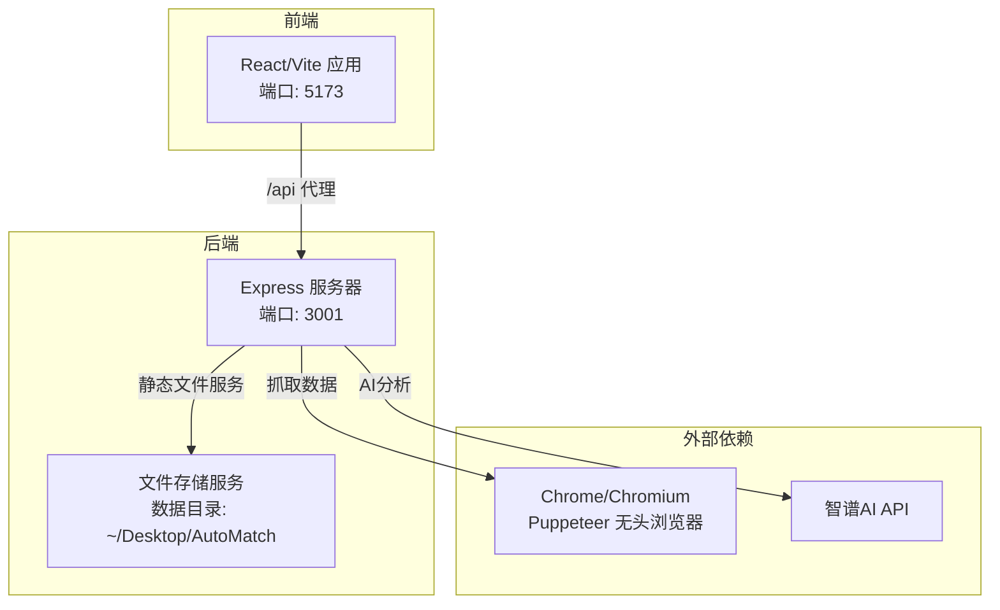
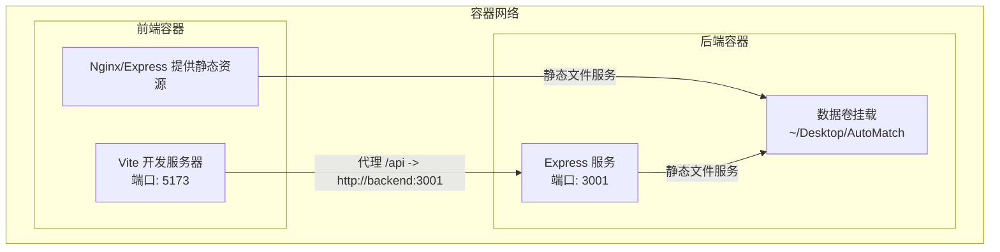
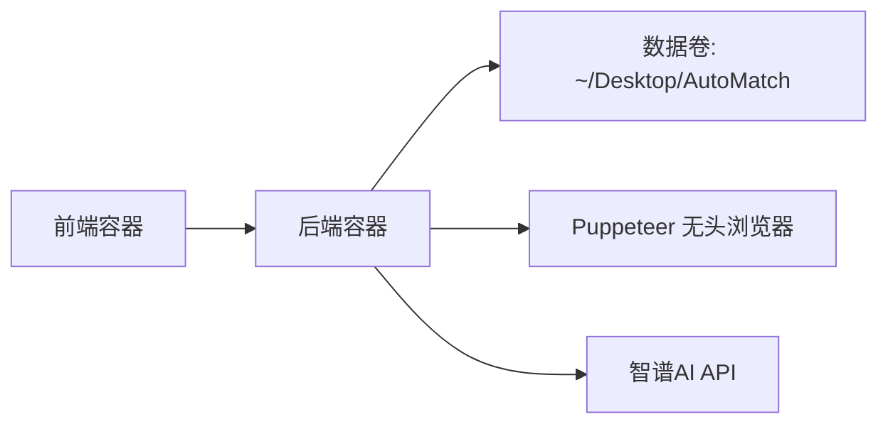
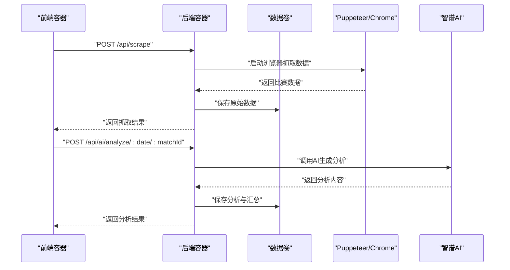

# Docker容器化部署

<cite>
**本文引用的文件**
- [package.json](file://package.json)
- [client/package.json](file://client/package.json)
- [server/index.js](file://server/index.js)
- [client/vite.config.js](file://client/vite.config.js)
- [PRD.md](file://PRD.md)
- [server/routes/scrape.js](file://server/routes/scrape.js)
- [server/services/scraper.js](file://server/services/scraper.js)
- [server/services/aiService.js](file://server/services/aiService.js)
- [server/services/fileStorage.js](file://server/services/fileStorage.js)
- [client/src/api/index.js](file://client/src/api/index.js)
</cite>

## 目录
1. [简介](#简介)
2. [项目结构](#项目结构)
3. [核心组件](#核心组件)
4. [架构总览](#架构总览)
5. [详细组件分析](#详细组件分析)
6. [依赖关系分析](#依赖关系分析)
7. [性能考量](#性能考量)
8. [故障排查指南](#故障排查指南)
9. [结论](#结论)
10. [附录](#附录)

## 简介
本方案为AutoMatch项目提供完整的Docker容器化部署指南，涵盖：
- Dockerfile多阶段构建优化与镜像体积控制
- docker-compose.yml服务编排、数据卷挂载与网络配置
- 环境变量与数据持久化配置
- 容器运行最佳实践（资源限制、健康检查、日志管理）
- 高级编排与集群部署建议（Swarm/Kubernetes）

AutoMatch是一个本地化的足球赛事智能分析工具，包含前端React应用与后端Express服务，支持数据抓取、AI分析与文案生成，并将数据持久化到本地文件系统。容器化部署将使项目具备更好的可移植性与一致性。

## 项目结构
AutoMatch采用前后端分离架构：
- 前端：React + Vite，开发时通过代理转发API请求至后端
- 后端：Node.js + Express，提供REST API与静态文件服务
- 数据：本地文件系统，按日期组织数据目录

图表来源
- [server/index.js:11-48](file://server/index.js#L11-L48)
- [client/vite.config.js:7-15](file://client/vite.config.js#L7-L15)
- [server/services/scraper.js:22-214](file://server/services/scraper.js#L22-L214)
- [server/services/aiService.js:18-65](file://server/services/aiService.js#L18-L65)
- [server/services/fileStorage.js:32-139](file://server/services/fileStorage.js#L32-L139)

章节来源
- [package.json:1-23](file://package.json#L1-L23)
- [client/package.json:1-31](file://client/package.json#L1-L31)
- [server/index.js:11-48](file://server/index.js#L11-L48)
- [client/vite.config.js:7-15](file://client/vite.config.js#L7-L15)
- [PRD.md:205-234](file://PRD.md#L205-L234)

## 核心组件
- 前端应用
  - 构建产物由后端静态文件服务提供
  - 开发模式通过Vite代理转发/api请求至后端
- 后端服务
  - Express提供REST API与静态文件服务
  - 环境变量控制端口与数据目录
  - 健康检查接口便于容器健康探测
- 数据存储
  - 本地文件系统，按日期分层目录
  - 支持跨平台（macOS默认路径）
- 外部依赖
  - Puppeteer无头浏览器用于数据抓取
  - 智谱AI SDK用于生成分析文案

章节来源
- [server/index.js:11-48](file://server/index.js#L11-L48)
- [server/services/fileStorage.js:32-139](file://server/services/fileStorage.js#L32-L139)
- [server/services/scraper.js:22-214](file://server/services/scraper.js#L22-L214)
- [server/services/aiService.js:18-65](file://server/services/aiService.js#L18-L65)
- [PRD.md:205-234](file://PRD.md#L205-L234)

## 架构总览
容器化后的整体架构如下：
- 前端容器：构建静态资源并通过Nginx或后端Express提供
- 后端容器：运行Express服务，提供API与静态文件
- 数据卷：挂载宿主机桌面目录，实现数据持久化
- 网络：默认桥接网络，前端通过/api代理访问后端

图表来源
- [client/vite.config.js:7-15](file://client/vite.config.js#L7-L15)
- [server/index.js:17-19](file://server/index.js#L17-L19)
- [server/services/fileStorage.js:32-139](file://server/services/fileStorage.js#L32-L139)

## 详细组件分析

### Dockerfile编写指南（多阶段构建与镜像优化）
目标
- 最小化镜像体积，提升构建与拉取效率
- 明确前后端构建流程，减少冗余层

策略
- 前端构建阶段
  - 使用Node基础镜像进行Vite构建
  - 输出静态资源到dist目录
- 静态资源提供阶段
  - 使用轻量Nginx或Express作为静态文件服务器
  - 仅复制dist目录与必要配置
- 后端构建阶段
  - 使用Node基础镜像安装依赖并构建
  - 生产环境仅保留运行时依赖
- 运行阶段
  - 使用最小化Node镜像运行Express
  - 设置非root用户与只读根文件系统

镜像分层建议
- 第一阶段：前端构建（Node）
- 第二阶段：静态资源提供（Nginx/Express）
- 第三阶段：后端构建（Node）
- 第四阶段：后端运行（Node）

安全与权限
- 使用非root用户运行容器进程
- 设置只读根文件系统，仅挂载必要的数据卷
- 限制容器能力（capabilities），移除不必要的sysctl

章节来源
- [client/package.json:6-10](file://client/package.json#L6-L10)
- [package.json:5-9](file://package.json#L5-L9)
- [server/index.js:12](file://server/index.js#L12)
- [server/services/fileStorage.js:4](file://server/services/fileStorage.js#L4)

### docker-compose.yml配置要点
服务编排
- 前端服务
  - 端口映射：5173（开发）或80（生产）
  - 依赖：后端服务
  - 环境变量：NODE_ENV、API_BASE_URL
- 后端服务
  - 端口映射：3001
  - 环境变量：PORT、DATA_DIR、ZHIPU_API_KEY
  - 数据卷：挂载桌面AutoMatch目录
  - 依赖：无（或可选：数据库服务，如需扩展）

网络配置
- 默认bridge网络
- 前端通过/api代理访问后端

数据卷挂载
- 挂载宿主机桌面目录至容器内数据目录
- 确保目录权限与用户一致

健康检查
- GET /api/health
- 超时与重试策略

章节来源
- [client/vite.config.js:7-15](file://client/vite.config.js#L7-L15)
- [server/index.js:40-43](file://server/index.js#L40-L43)
- [server/services/fileStorage.js:4](file://server/services/fileStorage.js#L4)
- [server/services/aiService.js:3](file://server/services/aiService.js#L3)

### 环境变量与数据持久化
环境变量
- 后端
  - PORT：服务监听端口
  - DATA_DIR：数据目录路径
  - ZHIPU_API_KEY：智谱AI密钥
- 前端
  - NODE_ENV：开发/生产模式
  - API_BASE_URL：API基础URL（生产时指向后端域名）

数据持久化
- 使用bind mount挂载宿主机桌面目录
- 目录结构按日期分层，便于备份与迁移

章节来源
- [server/index.js:12](file://server/index.js#L12)
- [server/index.js:18](file://server/index.js#L18)
- [server/services/aiService.js:3](file://server/services/aiService.js#L3)
- [PRD.md:205-234](file://PRD.md#L205-L234)

### 容器运行最佳实践
资源限制
- CPU/内存限额，防止资源争用
- 为Puppeteer设置合理的内存上限

健康检查
- 健康探针：GET /api/health
- 超时与重试参数合理设置

日志管理
- 使用stdout/stderr输出日志
- 配置日志驱动（如json-file）与轮转策略

安全加固
- 非root用户运行
- 只读根文件系统
- 限制网络访问（仅开放必要端口）

章节来源
- [server/index.js:40-43](file://server/index.js#L40-L43)

### 高级编排与集群部署
Swarm
- 使用stack部署，定义服务副本与更新策略
- 配置滚动更新与回滚
- 使用overlay网络与外部负载均衡

Kubernetes
- Deployment + Service + ConfigMap + Secret
- PersistentVolume + PersistentVolumeClaim
- HorizontalPodAutoscaler（HPA）
- Ingress控制器（Nginx/Contour）暴露API与静态资源

章节来源
- [server/index.js:12](file://server/index.js#L12)
- [server/services/fileStorage.js:4](file://server/services/fileStorage.js#L4)

## 依赖关系分析
容器化涉及的关键依赖与交互如下：

图表来源
- [server/services/scraper.js:22-214](file://server/services/scraper.js#L22-L214)
- [server/services/aiService.js:18-65](file://server/services/aiService.js#L18-L65)
- [server/services/fileStorage.js:32-139](file://server/services/fileStorage.js#L32-L139)

章节来源
- [server/services/scraper.js:22-214](file://server/services/scraper.js#L22-L214)
- [server/services/aiService.js:18-65](file://server/services/aiService.js#L18-L65)
- [server/services/fileStorage.js:32-139](file://server/services/fileStorage.js#L32-L139)

## 性能考量
- 前端构建缓存：复用npm/yarn缓存层，减少重复下载
- 镜像分层：将频繁变更的源码层置于底部，依赖层置于顶部
- Puppeteer资源：限制并发抓取任务数量，避免内存溢出
- AI调用：批量请求与限流，避免API配额耗尽
- 静态资源：启用gzip/br压缩与CDN缓存（生产环境）

## 故障排查指南
常见问题与解决思路
- 健康检查失败
  - 检查后端端口与健康接口
  - 查看容器日志与网络连通性
- 数据无法持久化
  - 确认数据卷挂载路径与权限
  - 检查宿主机目录是否存在
- Puppeteer启动失败
  - 确认Chrome/Chromium可执行路径
  - 检查无头模式参数与沙箱设置
- AI调用异常
  - 检查ZHIPU_API_KEY是否正确配置
  - 查看API响应与配额状态

章节来源
- [server/index.js:40-43](file://server/index.js#L40-L43)
- [server/services/fileStorage.js:4](file://server/services/fileStorage.js#L4)
- [server/services/scraper.js:27-35](file://server/services/scraper.js#L27-L35)
- [server/services/aiService.js:9-13](file://server/services/aiService.js#L9-L13)

## 结论
通过多阶段Docker构建与compose编排，AutoMatch可以在本地与生产环境中实现一致、可移植且高性能的部署。结合数据卷持久化、健康检查与资源限制，可显著提升系统的稳定性与可维护性。对于更高规模的部署，建议采用Swarm或Kubernetes进行弹性扩缩容与自动化运维。

## 附录

### API调用序列（容器内）

图表来源
- [client/src/api/index.js:15-50](file://client/src/api/index.js#L15-L50)
- [server/routes/scrape.js:8-23](file://server/routes/scrape.js#L8-L23)
- [server/services/scraper.js:22-214](file://server/services/scraper.js#L22-L214)
- [server/services/aiService.js:18-65](file://server/services/aiService.js#L18-L65)
- [server/services/fileStorage.js:32-139](file://server/services/fileStorage.js#L32-L139)