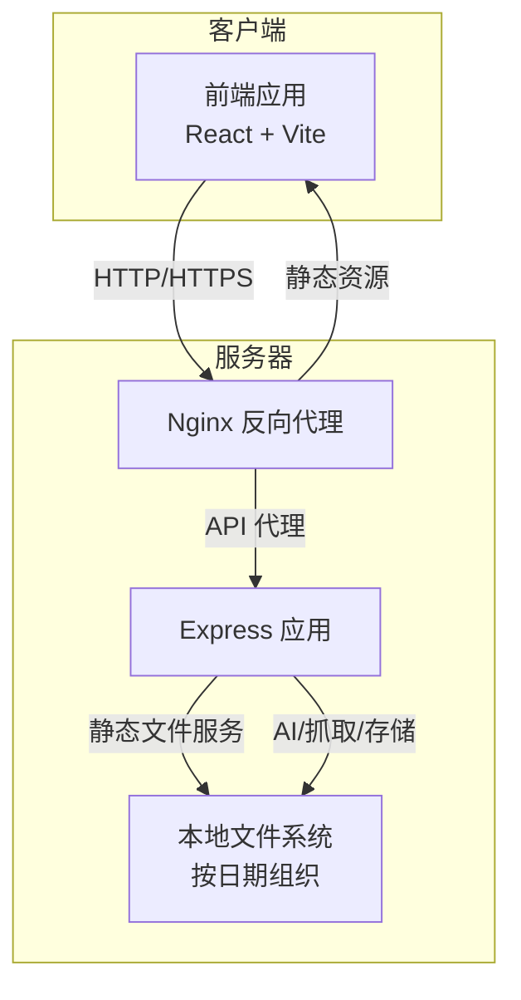
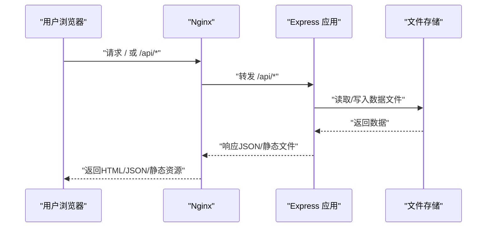
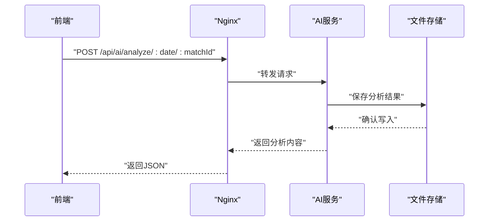
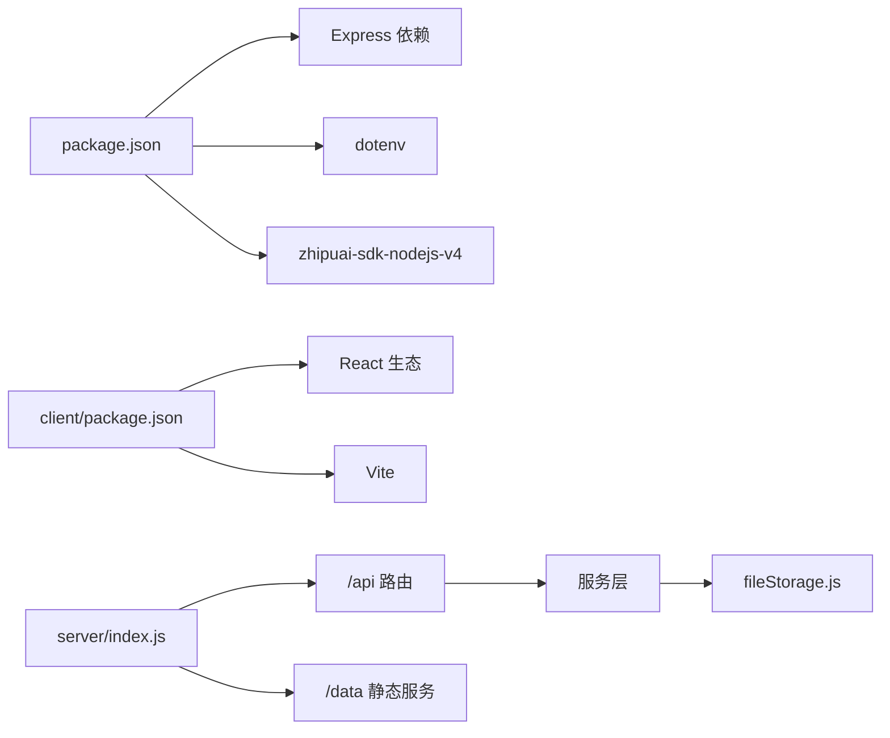

# 生产环境部署

<cite>
**本文引用的文件**
- [package.json](file://package.json)
- [server/index.js](file://server/index.js)
- [server/routes/scrape.js](file://server/routes/scrape.js)
- [server/routes/matches.js](file://server/routes/matches.js)
- [server/routes/ai.js](file://server/routes/ai.js)
- [server/routes/articles.js](file://server/routes/articles.js)
- [server/services/scraper.js](file://server/services/scraper.js)
- [server/services/aiService.js](file://server/services/aiService.js)
- [server/services/fileStorage.js](file://server/services/fileStorage.js)
- [client/package.json](file://client/package.json)
- [client/vite.config.js](file://client/vite.config.js)
- [client/src/api/index.js](file://client/src/api/index.js)
- [.gitignore](file://.gitignore)
- [PRD.md](file://PRD.md)
</cite>

## 目录
1. [简介](#简介)
2. [项目结构](#项目结构)
3. [核心组件](#核心组件)
4. [架构总览](#架构总览)
5. [详细组件分析](#详细组件分析)
6. [依赖关系分析](#依赖关系分析)
7. [性能考虑](#性能考虑)
8. [故障排查指南](#故障排查指南)
9. [结论](#结论)
10. [附录](#附录)

## 简介
本方案面向AutoMatch项目的生产环境部署，覆盖服务器配置要求（Node.js版本、操作系统兼容性、硬件资源）、前端静态资源构建与部署、Express应用部署、Nginx反向代理配置（静态文件服务、API代理、CORS）、PM2进程管理（启动、重启、监控）、SSL证书与HTTPS设置。方案基于仓库现有代码与配置进行落地，确保前后端协同、数据持久化与安全稳定运行。

## 项目结构
AutoMatch采用前后端分离架构：
- 前端：React + Vite，开发时通过Vite内置服务器提供静态资源与API代理；生产时构建为静态站点，由Nginx统一对外提供服务。
- 后端：Node.js + Express，提供REST API与静态文件服务（/data），支持健康检查与数据目录挂载。
- 数据存储：本地文件系统，按日期组织原始数据、重点比赛、AI分析、公众号与直播文案等目录。

图表来源
- [server/index.js:1-49](file://server/index.js#L1-L49)
- [client/vite.config.js:1-17](file://client/vite.config.js#L1-L17)

章节来源
- [package.json:1-23](file://package.json#L1-L23)
- [client/package.json:1-31](file://client/package.json#L1-L31)
- [PRD.md:14-21](file://PRD.md#L14-L21)

## 核心组件
- Express后端服务
  - CORS启用、JSON中间件、静态文件服务（/data）、健康检查接口、API路由注册。
  - 端口默认来自环境变量，未设置时使用固定端口。
- 路由层
  - 抓取、比赛、AI分析、文章生成四大模块路由，统一前缀/api。
- 服务层
  - 抓取服务：基于Puppeteer（无头浏览器）访问外部站点，解析并保存原始数据。
  - AI服务：调用智谱GLM-4生成分析与文案，支持违禁词过滤。
  - 文件存储：按日期目录结构写入JSON/Markdown文件，提供读写与汇总。
- 前端
  - Vite开发服务器配置了/api代理至后端；生产构建产物部署于Nginx。

章节来源
- [server/index.js:1-49](file://server/index.js#L1-L49)
- [server/routes/scrape.js:1-26](file://server/routes/scrape.js#L1-L26)
- [server/routes/matches.js:1-75](file://server/routes/matches.js#L1-L75)
- [server/routes/ai.js:1-102](file://server/routes/ai.js#L1-L102)
- [server/routes/articles.js:1-113](file://server/routes/articles.js#L1-L113)
- [server/services/scraper.js:1-295](file://server/services/scraper.js#L1-L295)
- [server/services/aiService.js:1-212](file://server/services/aiService.js#L1-L212)
- [server/services/fileStorage.js:1-196](file://server/services/fileStorage.js#L1-L196)
- [client/vite.config.js:1-17](file://client/vite.config.js#L1-L17)
- [client/src/api/index.js:1-50](file://client/src/api/index.js#L1-L50)

## 架构总览
生产环境建议采用“Nginx + PM2 + Express + 本地文件存储”的组合：
- Nginx负责静态资源分发、API反向代理、CORS与HTTPS终止。
- PM2负责Express应用的守护、自动重启与日志管理。
- Express提供API与静态文件服务，挂载/data目录供前端访问。
- 本地文件系统作为数据持久化介质，按日期组织。

图表来源
- [server/index.js:17-25](file://server/index.js#L17-L25)
- [server/services/fileStorage.js:32-48](file://server/services/fileStorage.js#L32-L48)

## 详细组件分析

### 服务器配置要求
- Node.js版本
  - 后端依赖使用Express 5.x与CORS等模块，建议使用长期支持（LTS）版本的Node.js（如18.x/20.x）以获得最佳稳定性与性能。
- 操作系统兼容性
  - 抓取服务使用Puppeteer-core，需在目标系统安装Chrome/Chromium可执行文件；当前实现包含macOS路径示例，部署至Linux需自行配置Chrome路径或使用容器镜像预装浏览器。
- 硬件资源需求
  - CPU：根据并发API请求与AI生成任务量评估；建议至少2核CPU起步。
  - 内存：Node.js进程+浏览器实例占用内存较高，建议4GB以上。
  - 磁盘：按日均数据量估算，保留足够的磁盘空间用于原始数据、分析与文案文件。
  - 网络：抓取与AI调用依赖网络访问，建议稳定带宽与低延迟。

章节来源
- [server/services/scraper.js:10-17](file://server/services/scraper.js#L10-L17)
- [package.json:15-21](file://package.json#L15-L21)

### 前端静态资源构建与部署
- 构建命令
  - 使用Vite进行生产构建，生成静态资源目录（默认dist）。
- 部署方式
  - 将dist目录部署至Nginx根目录，或通过CDN分发。
  - 无需额外打包后端，仅需保证Nginx正确代理/api请求至后端。

章节来源
- [client/package.json:6-11](file://client/package.json#L6-L11)
- [client/vite.config.js:1-17](file://client/vite.config.js#L1-L17)

### Express应用部署流程
- 环境准备
  - 安装Node.js与npm，拉取代码后安装依赖。
  - 准备数据目录（默认位于用户桌面AutoMatch目录，可通过环境变量覆盖）。
- 启动方式
  - 直接运行或通过PM2托管。
- 关键配置
  - 端口：可通过环境变量设置，默认端口见后端入口。
  - CORS：已全局启用，满足前端跨域需求。
  - 静态文件：/data目录指向数据目录，供前端直接访问。

章节来源
- [server/index.js:11-19](file://server/index.js#L11-L19)
- [server/index.js:45-48](file://server/index.js#L45-L48)
- [server/services/fileStorage.js:4](file://server/services/fileStorage.js#L4)

### Nginx反向代理配置要点
- 静态文件服务
  - 将前端构建产物目录映射为静态站点根目录。
- API代理
  - 将/api前缀代理至后端Express服务地址与端口。
- CORS配置
  - 若前端与后端同源部署，可省略；跨域时建议在Nginx层面统一处理或保持后端CORS策略。
- 示例要点
  - 代理目标：http://127.0.0.1:后端端口
  - 静态根：dist目录
  - /data静态资源：可直接映射到后端数据目录，或通过后端路由提供

章节来源
- [client/vite.config.js:9-14](file://client/vite.config.js#L9-L14)
- [server/index.js:17-19](file://server/index.js#L17-L19)

### PM2进程管理器使用
- 安装与启动
  - 全局安装PM2后，使用PM2启动后端入口文件。
- 应用管理
  - 重启：pm2 restart <应用名或ID>
  - 监控：pm2 monit
  - 日志：pm2 logs
- 建议
  - 设置最大内存重启阈值与异常重启策略，结合Nginx健康检查实现高可用。

章节来源
- [package.json:5-10](file://package.json#L5-L10)

### SSL证书与HTTPS设置
- 方案
  - 使用Nginx终止TLS，配置证书与私钥路径。
  - 建议开启HSTS、现代密码套件与TLS版本策略。
- 注意
  - 若后端仍暴露HTTP端口，需在Nginx层强制跳转HTTPS或仅监听本地回环。

章节来源
- [server/index.js:12](file://server/index.js#L12)

### 数据流与API交互
- 前端API调用
  - 前端通过相对路径/api访问后端接口，代理由Vite开发服务器或Nginx生产代理完成。
- 后端路由
  - 抓取、比赛、AI分析、文章生成四大模块，统一前缀/api。
- 文件存储
  - 按日期组织目录，写入JSON/Markdown文件，支持读取与汇总。

图表来源
- [client/src/api/index.js:33-34](file://client/src/api/index.js#L33-L34)
- [server/routes/ai.js:10-34](file://server/routes/ai.js#L10-L34)
- [server/services/aiService.js:18-65](file://server/services/aiService.js#L18-L65)
- [server/services/fileStorage.js:74-98](file://server/services/fileStorage.js#L74-L98)

## 依赖关系分析
- 后端依赖
  - Express、CORS、dotenv、puppeteer-core、zhipuai-sdk-nodejs-v4等。
- 前端依赖
  - React、Ant Design、Vite、ESLint等。
- 关键耦合点
  - /data静态文件服务与文件存储服务耦合，需确保数据目录权限与路径正确。
  - AI服务依赖环境变量ZHIPU_API_KEY，需在生产环境注入。

图表来源
- [package.json:15-21](file://package.json#L15-L21)
- [client/package.json:12-29](file://client/package.json#L12-L29)
- [server/index.js:6-25](file://server/index.js#L6-L25)
- [server/services/fileStorage.js:1-196](file://server/services/fileStorage.js#L1-L196)

章节来源
- [package.json:15-21](file://package.json#L15-L21)
- [client/package.json:12-29](file://client/package.json#L12-L29)
- [server/index.js:6-25](file://server/index.js#L6-L25)

## 性能考虑
- 抓取性能
  - Puppeteer启动成本较高，建议复用浏览器实例或限制并发；合理设置超时与重试。
- AI生成
  - 控制请求频率与批量大小，避免触发限流；必要时增加缓存与降级策略。
- 静态资源
  - 启用Gzip/Brotli压缩与缓存头，提升首屏加载速度。
- 数据存储
  - 大文件读写建议异步化与分批处理，避免阻塞主线程。

## 故障排查指南
- 后端无法启动
  - 检查端口占用与环境变量（DATA_DIR、PORT、ZHIPU_API_KEY）。
- 抓取失败
  - 确认Chrome/Chromium可执行路径与网络连通性；查看浏览器启动参数与页面选择器是否匹配。
- AI服务报错
  - 核对ZHIPU_API_KEY是否正确配置；检查模型调用限额与网络策略。
- 前端无法访问API
  - 检查Nginx代理配置与/api前缀转发；确认CORS策略与跨域头。
- /data静态资源不可访问
  - 确认数据目录存在且具备读权限；检查路径映射与Express静态服务配置。

章节来源
- [server/services/scraper.js:22-35](file://server/services/scraper.js#L22-L35)
- [server/services/aiService.js:8-13](file://server/services/aiService.js#L8-L13)
- [server/index.js:17-19](file://server/index.js#L17-L19)
- [server/services/fileStorage.js:4](file://server/services/fileStorage.js#L4)

## 结论
本部署方案以Nginx为入口、PM2为进程守护、Express提供API与静态资源、本地文件系统承载数据，形成稳定高效的生产架构。建议在上线前完善环境变量管理、监控告警与备份策略，并针对抓取与AI生成场景制定容量与限流预案。

## 附录

### 环境变量与配置清单
- 后端
  - PORT：后端监听端口
  - DATA_DIR：数据目录路径
  - ZHIPU_API_KEY：智谱AI密钥
- 前端
  - Vite开发代理：/api -> http://localhost:后端端口
- 部署
  - Nginx：静态根、/api代理、/data静态映射、HTTPS证书

章节来源
- [server/index.js:12](file://server/index.js#L12)
- [server/services/fileStorage.js:4](file://server/services/fileStorage.js#L4)
- [server/services/aiService.js:3](file://server/services/aiService.js#L3)
- [client/vite.config.js:7-14](file://client/vite.config.js#L7-L14)