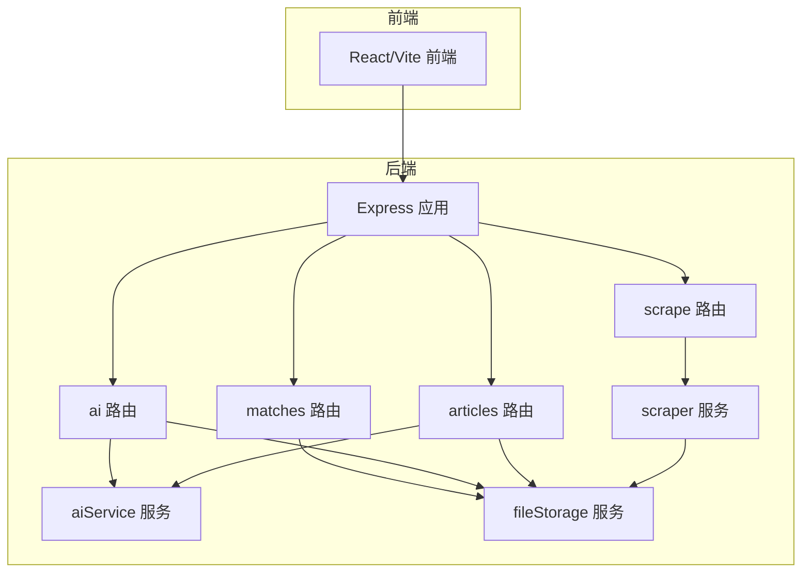
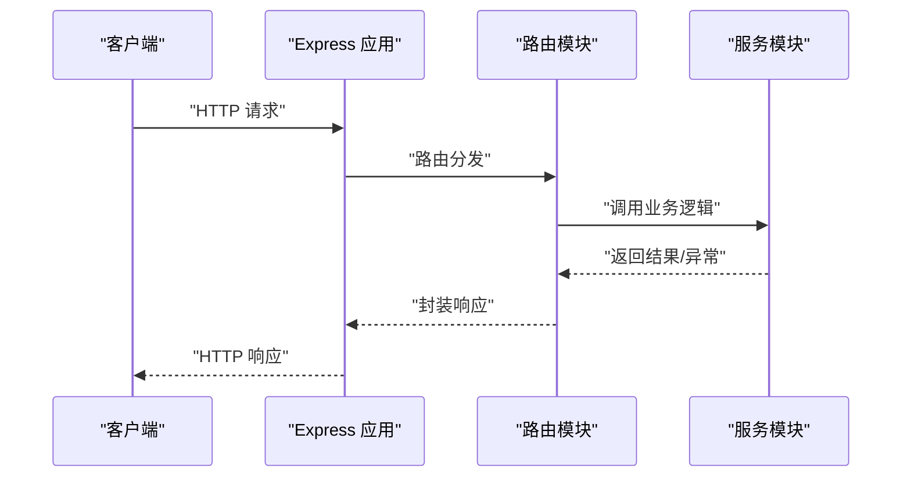
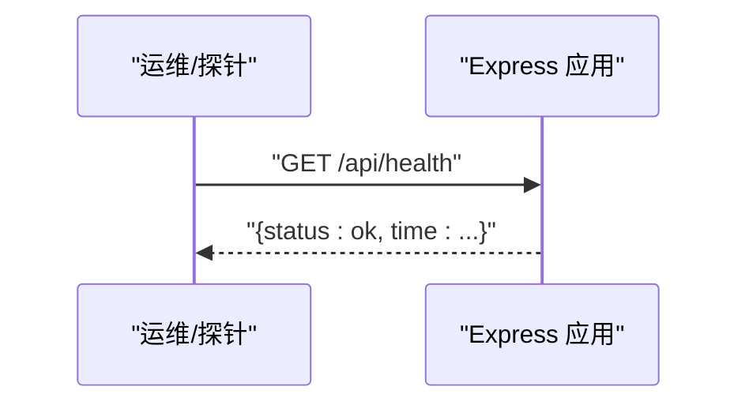
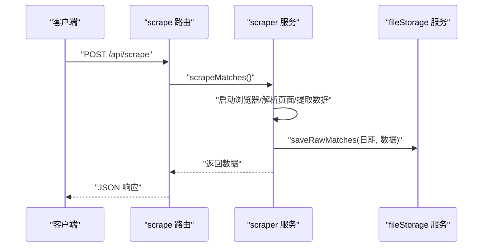
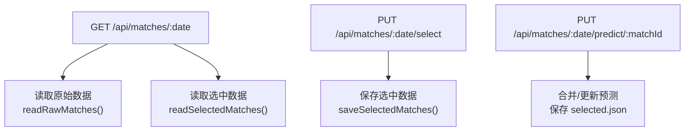
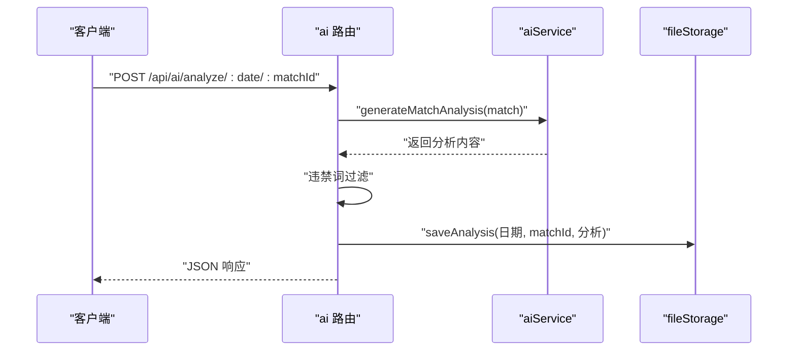
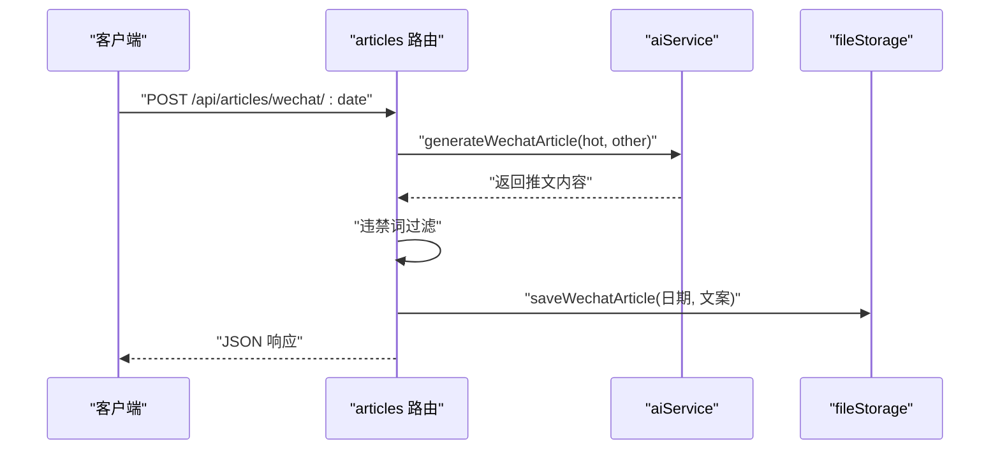
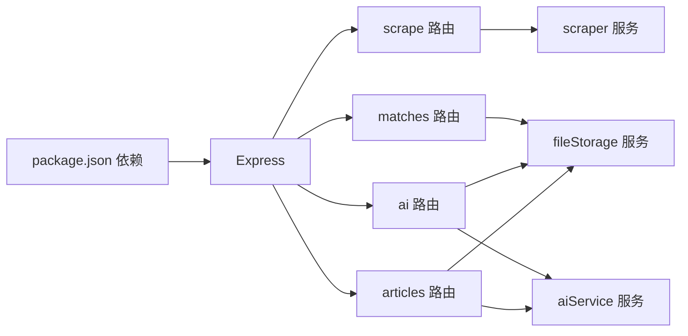

# 监控与日志

<cite>
**本文引用的文件**
- [server/index.js](file://server/index.js)
- [package.json](file://package.json)
- [PRD.md](file://PRD.md)
- [server/routes/scrape.js](file://server/routes/scrape.js)
- [server/routes/matches.js](file://server/routes/matches.js)
- [server/routes/ai.js](file://server/routes/ai.js)
- [server/routes/articles.js](file://server/routes/articles.js)
- [server/services/scraper.js](file://server/services/scraper.js)
- [server/services/aiService.js](file://server/services/aiService.js)
- [server/services/fileStorage.js](file://server/services/fileStorage.js)
</cite>

## 目录
1. [简介](#简介)
2. [项目结构](#项目结构)
3. [核心组件](#核心组件)
4. [架构总览](#架构总览)
5. [详细组件分析](#详细组件分析)
6. [依赖关系分析](#依赖关系分析)
7. [性能考虑](#性能考虑)
8. [故障排查指南](#故障排查指南)
9. [结论](#结论)
10. [附录](#附录)

## 简介
本方案围绕 AutoMatch 项目的监控与日志管理进行系统化设计，目标包括：
- 设定应用健康检查端点与性能指标监控
- 建立日志收集与分类管理策略（错误日志、访问日志、业务日志）
- 提供 Prometheus 与 Grafana 的集成建议，用于系统监控与可视化
- 设定告警规则与通知机制
- 规划日志轮转与存储策略，以及日志分析工具使用方法
- 给出系统性能优化与瓶颈排查的实用技巧

## 项目结构
AutoMatch 采用前后端分离架构：前端基于 React/Vite，后端基于 Node.js/Express，数据抓取使用 Puppeteer，AI 分析对接智谱 GLM-4。后端通过多个路由模块提供 API，业务逻辑分布在服务层，数据持久化采用本地文件系统。

图表来源
- [server/index.js:11-25](file://server/index.js#L11-L25)
- [server/routes/scrape.js:1-26](file://server/routes/scrape.js#L1-L26)
- [server/routes/matches.js:1-75](file://server/routes/matches.js#L1-L75)
- [server/routes/ai.js:1-102](file://server/routes/ai.js#L1-L102)
- [server/routes/articles.js:1-113](file://server/routes/articles.js#L1-L113)
- [server/services/scraper.js:1-295](file://server/services/scraper.js#L1-L295)
- [server/services/aiService.js:1-212](file://server/services/aiService.js#L1-L212)
- [server/services/fileStorage.js:1-196](file://server/services/fileStorage.js#L1-L196)

章节来源
- [server/index.js:11-49](file://server/index.js#L11-L49)
- [package.json:1-23](file://package.json#L1-L23)

## 核心组件
- 健康检查端点：后端根路由与 /api/health，便于外部探活与容器编排健康检查
- 路由模块：scrape、matches、ai、articles，分别负责抓取、数据读写、AI 分析与文案生成
- 服务模块：scraper（Puppeteer 抓取）、aiService（智谱 AI 对接）、fileStorage（本地文件存储）
- 数据存储：按日期组织的本地目录结构，支持 JSON/Markdown 格式

章节来源
- [server/index.js:27-43](file://server/index.js#L27-L43)
- [server/routes/scrape.js:8-23](file://server/routes/scrape.js#L8-L23)
- [server/routes/matches.js:8-72](file://server/routes/matches.js#L8-L72)
- [server/routes/ai.js:10-69](file://server/routes/ai.js#L10-L69)
- [server/routes/articles.js:10-92](file://server/routes/articles.js#L10-L92)
- [server/services/scraper.js:22-214](file://server/services/scraper.js#L22-L214)
- [server/services/aiService.js:18-65](file://server/services/aiService.js#L18-L65)
- [server/services/fileStorage.js:32-157](file://server/services/fileStorage.js#L32-L157)

## 架构总览
后端通过 Express 提供 REST API，前端通过 HTTP 请求与后端交互；AI 分析与数据抓取为关键耗时操作，需纳入监控与日志体系。

图表来源
- [server/index.js:11-25](file://server/index.js#L11-L25)
- [server/routes/scrape.js:8-23](file://server/routes/scrape.js#L8-L23)
- [server/routes/matches.js:20-35](file://server/routes/matches.js#L20-L35)
- [server/routes/ai.js:10-34](file://server/routes/ai.js#L10-L34)
- [server/routes/articles.js:10-51](file://server/routes/articles.js#L10-L51)

## 详细组件分析

### 健康检查与根路由
- 根路由提供基础状态页，包含健康检查链接
- /api/health 返回服务状态与时间戳，便于探活与编排

图表来源
- [server/index.js:27-43](file://server/index.js#L27-L43)

章节来源
- [server/index.js:27-43](file://server/index.js#L27-L43)

### 数据抓取流程（scrape）
- 路由接收请求，调用 scraper 服务执行 Puppeteer 抓取
- 抓取完成后保存原始数据至本地文件系统
- 错误通过路由层捕获并返回统一结构

图表来源
- [server/routes/scrape.js:8-23](file://server/routes/scrape.js#L8-L23)
- [server/services/scraper.js:22-214](file://server/services/scraper.js#L22-L214)
- [server/services/fileStorage.js:32-39](file://server/services/fileStorage.js#L32-L39)

章节来源
- [server/routes/scrape.js:8-23](file://server/routes/scrape.js#L8-L23)
- [server/services/scraper.js:22-214](file://server/services/scraper.js#L22-L214)
- [server/services/fileStorage.js:32-39](file://server/services/fileStorage.js#L32-L39)

### 选场与预测（matches）
- 提供日期列表查询、指定日期数据读取、重点比赛保存、单场预测更新
- 通过 fileStorage 读写 selected.json

图表来源
- [server/routes/matches.js:8-72](file://server/routes/matches.js#L8-L72)
- [server/services/fileStorage.js:44-69](file://server/services/fileStorage.js#L44-L69)

章节来源
- [server/routes/matches.js:8-72](file://server/routes/matches.js#L8-L72)
- [server/services/fileStorage.js:44-69](file://server/services/fileStorage.js#L44-L69)

### AI 分析与违禁词过滤（ai）
- 单场与批量生成 AI 分析，调用智谱 SDK
- 生成后进行违禁词过滤，再保存 Markdown 与汇总 JSON
- 错误在路由层捕获并返回

图表来源
- [server/routes/ai.js:10-34](file://server/routes/ai.js#L10-L34)
- [server/services/aiService.js:18-65](file://server/services/aiService.js#L18-L65)
- [server/services/fileStorage.js:74-98](file://server/services/fileStorage.js#L74-L98)

章节来源
- [server/routes/ai.js:10-34](file://server/routes/ai.js#L10-L34)
- [server/services/aiService.js:18-65](file://server/services/aiService.js#L18-L65)
- [server/services/fileStorage.js:74-98](file://server/services/fileStorage.js#L74-L98)

### 文案生成（articles）
- 公众号推文与直播文案生成，结合热门比赛与 AI 分析
- 生成后进行违禁词过滤并保存 Markdown/JSON

图表来源
- [server/routes/articles.js:10-51](file://server/routes/articles.js#L10-L51)
- [server/services/aiService.js:70-135](file://server/services/aiService.js#L70-L135)
- [server/services/fileStorage.js:112-123](file://server/services/fileStorage.js#L112-L123)

章节来源
- [server/routes/articles.js:10-51](file://server/routes/articles.js#L10-L51)
- [server/services/aiService.js:70-135](file://server/services/aiService.js#L70-L135)
- [server/services/fileStorage.js:112-123](file://server/services/fileStorage.js#L112-L123)

## 依赖关系分析
- Express 应用依赖 CORS、dotenv、express
- 路由层依赖对应服务模块
- 服务层依赖第三方 SDK（智谱）、无头浏览器（Puppeteer）与本地文件系统
- 产品需求文档定义了 API、数据存储与性能目标

图表来源
- [package.json:15-21](file://package.json#L15-L21)
- [server/index.js:6-9](file://server/index.js#L6-L9)
- [server/routes/scrape.js:3](file://server/routes/scrape.js#L3)
- [server/routes/matches.js:3](file://server/routes/matches.js#L3)
- [server/routes/ai.js:3-4](file://server/routes/ai.js#L3-L4)
- [server/routes/articles.js:3-5](file://server/routes/articles.js#L3-L5)

章节来源
- [package.json:15-21](file://package.json#L15-L21)
- [PRD.md:252-271](file://PRD.md#L252-L271)

## 性能考虑
- 抓取性能：Puppeteer 启动与页面渲染是主要耗时点，建议：
  - 固定浏览器参数，减少不必要的渲染
  - 控制并发抓取数量，避免资源争用
  - 优化等待策略，避免过长超时
- AI 生成性能：智谱 API 调用受网络与配额影响，建议：
  - 批量生成时增加重试与熔断
  - 限制单次请求最大并发，避免阻塞
- 文件 I/O：大量小文件写入可能成为瓶颈，建议：
  - 合理合并写入批次
  - 使用异步写入，避免阻塞主线程
- 前端交互：避免频繁刷新与重复请求，合理缓存与节流

## 故障排查指南
- 健康检查
  - 使用 /api/health 快速判断服务可用性
  - 若不可用，检查进程日志与端口占用
- 抓取失败
  - 检查浏览器路径与权限
  - 网络不稳定时增加重试与超时配置
  - 页面结构变化导致解析失败时，参考深度解析逻辑
- AI 生成失败
  - 确认智谱 API Key 配置正确
  - 检查提示词长度与模型参数
- 文件存储
  - 确认 DATA_DIR 目录存在且可写
  - 检查磁盘空间与权限

章节来源
- [server/index.js:40-43](file://server/index.js#L40-L43)
- [server/services/scraper.js:10-17](file://server/services/scraper.js#L10-L17)
- [server/services/aiService.js:9-13](file://server/services/aiService.js#L9-L13)
- [server/services/fileStorage.js:4-4](file://server/services/fileStorage.js#L4-L4)

## 结论
通过健康检查端点、完善的日志分类与存储策略、以及 Prometheus/Grafana 的集成，AutoMatch 可实现对关键业务流程（抓取、AI 分析、文案生成）的可观测性与稳定性保障。配合合理的性能优化与告警机制，可显著提升系统的可靠性与可维护性。

## 附录

### 日志分类与管理策略
- 错误日志
  - 路由层与服务层捕获异常并记录，包含错误码、消息与上下文
  - 便于快速定位问题与回溯
- 访问日志
  - 建议接入中间件统一记录请求方法、URL、状态码、耗时与客户端 IP
  - 用于流量分析与安全审计
- 业务日志
  - 抓取开始/结束、AI 生成开始/结束、文件保存成功/失败
  - 用于业务流程追踪与性能评估

章节来源
- [server/routes/scrape.js:16-22](file://server/routes/scrape.js#L16-L22)
- [server/routes/ai.js:30-33](file://server/routes/ai.js#L30-L33)
- [server/routes/articles.js:47-50](file://server/routes/articles.js#L47-L50)
- [server/services/scraper.js:25-200](file://server/services/scraper.js#L25-L200)
- [server/services/aiService.js:61-64](file://server/services/aiService.js#L61-L64)

### Prometheus 与 Grafana 集成方案
- 指标采集
  - 使用中间件统计请求总量、成功率、响应时间分布
  - 业务指标：抓取任务耗时、AI 生成耗时、文件写入耗时
- 监控面板
  - 仪表盘：请求速率、错误率、P95/P99 延迟、并发连接数
  - 业务看板：抓取成功率、AI 生成吞吐、存储使用率
- 告警规则
  - 错误率超过阈值持续一段时间
  - 响应时间超过阈值
  - 抓取/AI 生成耗时异常升高
- 通知机制
  - 邮件、IM 或企业微信机器人推送告警

[本节为概念性方案，无需“章节来源”]

### 日志轮转与存储策略
- 轮转
  - 基于大小与时间的轮转，保留最近 N 份日志
- 存储
  - 本地磁盘：按日期归档，定期清理旧数据
  - 远程备份：将关键日志上传至对象存储或日志平台
- 分析工具
  - 使用日志分析工具（如 ELK/Fluentd/Loki/Promtail）进行检索与聚合
  - 预设常用查询与仪表盘，提高排查效率

[本节为通用实践，无需“章节来源”]