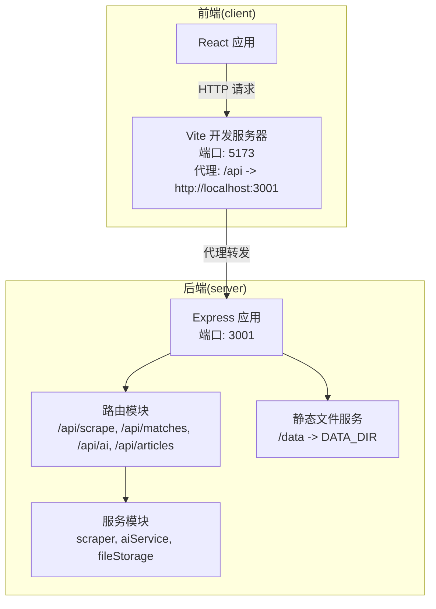
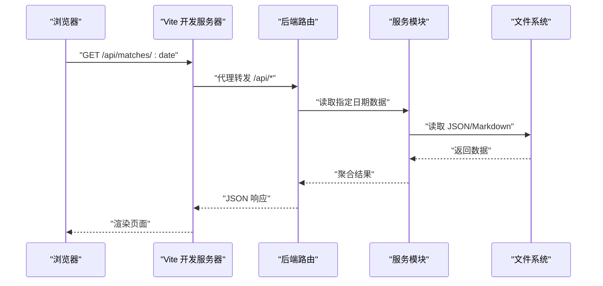
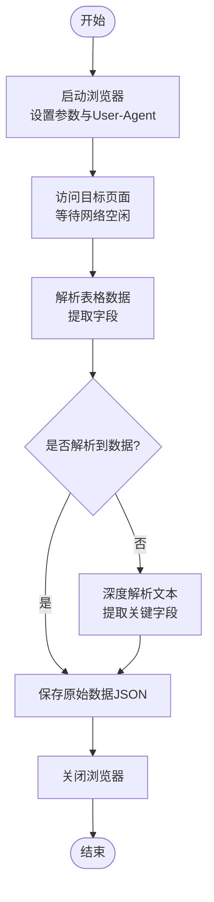
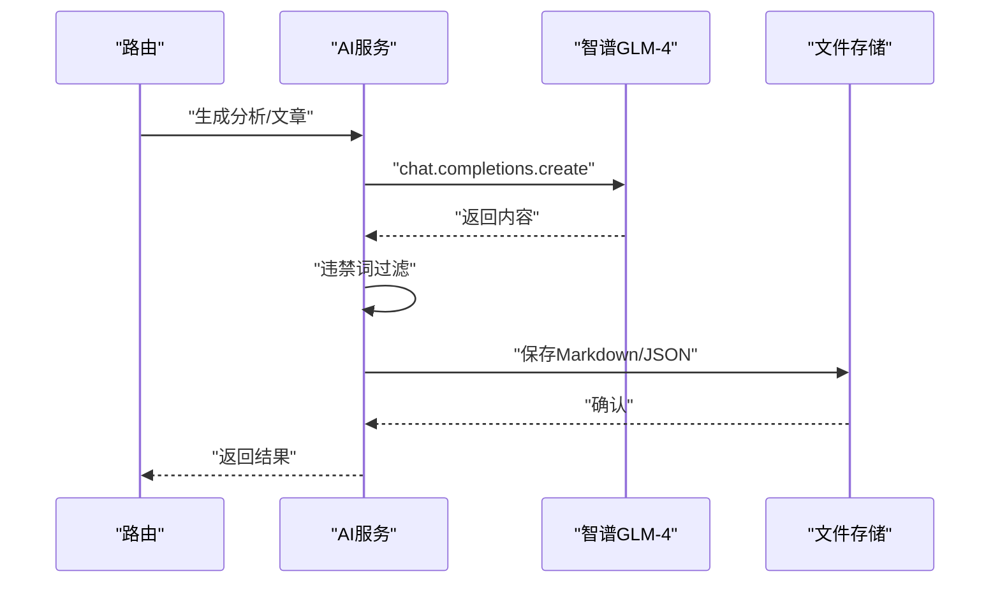
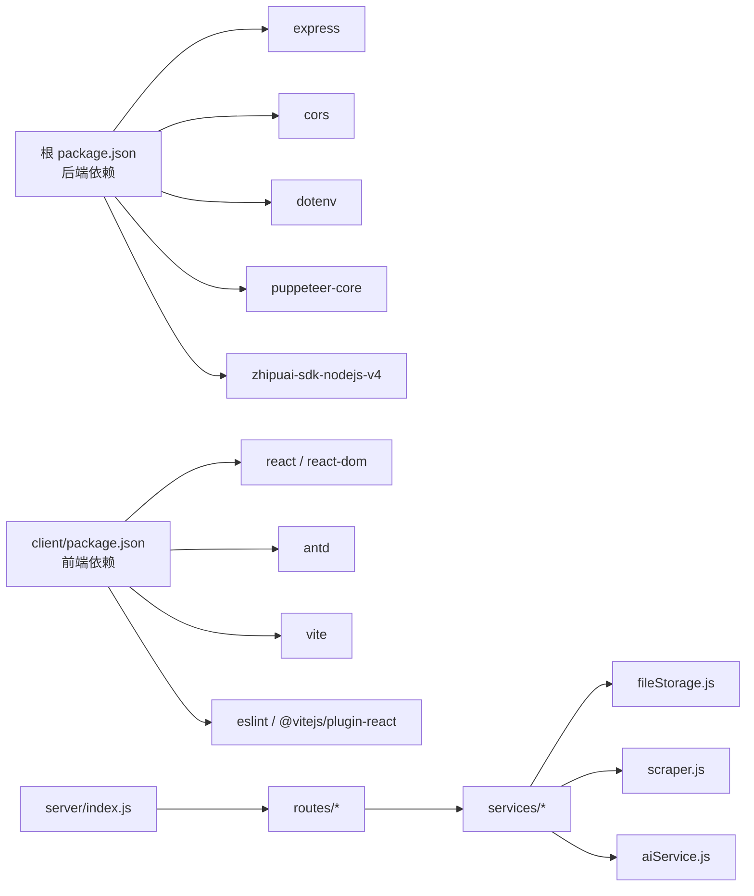

# 部署指南

<cite>
**本文引用的文件**
- [package.json](file://package.json)
- [server/index.js](file://server/index.js)
- [server/routes/scrape.js](file://server/routes/scrape.js)
- [server/routes/matches.js](file://server/routes/matches.js)
- [server/routes/ai.js](file://server/routes/ai.js)
- [server/routes/articles.js](file://server/routes/articles.js)
- [server/services/scraper.js](file://server/services/scraper.js)
- [server/services/aiService.js](file://server/services/aiService.js)
- [server/services/fileStorage.js](file://server/services/fileStorage.js)
- [client/package.json](file://client/package.json)
- [client/vite.config.js](file://client/vite.config.js)
- [client/src/api/index.js](file://client/src/api/index.js)
- [PRD.md](file://PRD.md)
</cite>

## 目录
1. [简介](#简介)
2. [项目结构](#项目结构)
3. [核心组件](#核心组件)
4. [架构总览](#架构总览)
5. [详细组件分析](#详细组件分析)
6. [依赖关系分析](#依赖关系分析)
7. [性能考虑](#性能考虑)
8. [故障排除指南](#故障排除指南)
9. [结论](#结论)
10. [附录](#附录)

## 简介
本指南面向AutoMatch项目的部署与运维，覆盖开发与生产环境的配置要点、环境变量、依赖安装、服务器配置、前端构建与部署、容器化与云平台策略、负载均衡与反向代理、SSL证书、监控与日志、性能优化以及故障排除与回滚策略。项目采用前后端分离架构：前端基于React/Vite，后端基于Node.js/Express，数据抓取使用Puppeteer（无头浏览器），AI分析通过智谱GLM-4接口完成，数据以本地文件系统存储。

## 项目结构
- 顶层脚本与依赖：根目录提供后端启动脚本与依赖声明；客户端独立目录包含前端工程。
- 后端服务：入口文件负责加载环境变量、启用CORS、配置静态文件服务、挂载路由并提供健康检查。
- 路由层：按功能拆分为抓取、比赛、AI分析、文章生成四个路由模块。
- 服务层：封装数据抓取、AI调用、文件存储等业务逻辑。
- 前端工程：Vite提供开发服务器与代理，React组件通过API模块调用后端接口。

图表来源
- [server/index.js:1-49](file://server/index.js#L1-L49)
- [client/vite.config.js:1-17](file://client/vite.config.js#L1-L17)

章节来源
- [package.json:1-23](file://package.json#L1-L23)
- [client/package.json:1-31](file://client/package.json#L1-L31)
- [server/index.js:1-49](file://server/index.js#L1-L49)
- [client/vite.config.js:1-17](file://client/vite.config.js#L1-L17)

## 核心组件
- 后端入口与中间件
  - 加载环境变量、启用CORS、解析JSON请求体、配置静态文件服务（对外提供/data目录）、挂载API路由、根路径返回状态页、健康检查接口。
- 路由模块
  - 抓取：触发数据抓取并返回结果。
  - 比赛：日期列表、指定日期原始与选中比赛数据查询、保存选中与预测。
  - AI分析：单场/批量生成分析、读取与更新分析内容。
  - 文章：生成公众号推文与直播脚本、读取文章。
- 服务模块
  - 数据抓取：启动Chrome/Chromium，访问目标站点，解析表格数据，保存至本地文件。
  - AI服务：校验API Key，调用智谱GLM-4生成分析与文案，内置违禁词过滤。
  - 文件存储：按日期组织目录结构，支持原始数据、重点比赛、AI分析、公众号与直播文案的读写与汇总。
- 前端API模块
  - 统一封装fetch请求，统一错误处理，定义各模块API函数。

章节来源
- [server/index.js:1-49](file://server/index.js#L1-L49)
- [server/routes/scrape.js:1-26](file://server/routes/scrape.js#L1-L26)
- [server/routes/matches.js:1-75](file://server/routes/matches.js#L1-L75)
- [server/routes/ai.js:1-102](file://server/routes/ai.js#L1-L102)
- [server/routes/articles.js:1-113](file://server/routes/articles.js#L1-L113)
- [server/services/scraper.js:1-295](file://server/services/scraper.js#L1-L295)
- [server/services/aiService.js:1-212](file://server/services/aiService.js#L1-L212)
- [server/services/fileStorage.js:1-196](file://server/services/fileStorage.js#L1-L196)
- [client/src/api/index.js:1-50](file://client/src/api/index.js#L1-L50)

## 架构总览
后端作为统一入口，前端通过Vite代理访问后端API；后端路由将请求分发到对应服务模块，服务模块负责调用外部依赖（如智谱AI）与本地文件系统。数据流自上而下贯穿“前端界面 -> 代理 -> 后端路由 -> 服务 -> 存储”。

图表来源
- [client/vite.config.js:7-15](file://client/vite.config.js#L7-L15)
- [client/src/api/index.js:19-25](file://client/src/api/index.js#L19-L25)
- [server/routes/matches.js:18-35](file://server/routes/matches.js#L18-L35)
- [server/services/fileStorage.js:44-69](file://server/services/fileStorage.js#L44-L69)

## 详细组件分析

### 后端入口与服务器配置
- 环境变量
  - PORT：后端监听端口，默认3001。
  - DATA_DIR：静态文件目录，用于对外提供数据文件访问。
- 中间件
  - CORS启用跨域。
  - JSON解析限制为10MB。
- 静态文件
  - 对外提供/data目录，指向DATA_DIR。
- 健康检查
  - GET /api/health 返回服务状态与时钟。
- 日志
  - 启动时打印服务地址与数据目录。

章节来源
- [server/index.js:11-48](file://server/index.js#L11-L48)

### 路由与API定义
- 抓取相关
  - POST /api/scrape：触发抓取500彩票网数据。
- 比赛相关
  - GET /api/matches/dates：获取可用日期列表。
  - GET /api/matches/:date：获取指定日期原始与选中比赛。
  - PUT /api/matches/:date/select：保存选中比赛。
  - PUT /api/matches/:date/predict/:matchId：保存单场预测。
- AI分析相关
  - POST /api/ai/analyze/:date/:matchId：生成单场AI分析。
  - POST /api/ai/analyze/:date/batch：批量生成AI分析。
  - GET /api/ai/analyses/:date：获取指定日期所有分析。
  - PUT /api/ai/analyses/:date/:matchId：更新AI分析内容。
- 文案相关
  - POST /api/articles/wechat/:date：生成公众号推文。
  - POST /api/articles/live/:date：生成直播脚本。
  - GET /api/articles/:date：获取指定日期所有文案。

章节来源
- [server/routes/scrape.js:5-23](file://server/routes/scrape.js#L5-L23)
- [server/routes/matches.js:5-72](file://server/routes/matches.js#L5-L72)
- [server/routes/ai.js:7-99](file://server/routes/ai.js#L7-L99)
- [server/routes/articles.js:7-92](file://server/routes/articles.js#L7-L92)

### 服务模块详解

#### 数据抓取服务
- 浏览器与页面行为
  - 通过Puppeteer启动Chrome/Chromium，设置User-Agent与视口，访问目标URL，等待网络空闲与表格元素加载。
  - 若标准解析失败，进行深度解析以提取表格文本中的比赛信息。
- 数据清洗与落盘
  - 为每条记录补全唯一ID与抓取时间戳，保存为JSON文件。
- 错误处理
  - 捕获异常并抛出，便于上层路由统一处理。

图表来源
- [server/services/scraper.js:22-214](file://server/services/scraper.js#L22-L214)
- [server/services/scraper.js:219-292](file://server/services/scraper.js#L219-L292)

章节来源
- [server/services/scraper.js:1-295](file://server/services/scraper.js#L1-L295)

#### AI服务
- 配置与校验
  - 从环境变量读取API Key，若未配置则抛错。
- 接口调用
  - 单场分析：根据比赛信息与分析师输入生成分析文案。
  - 公众号推文：整合两场热门比赛生成推文。
  - 直播脚本：整合多场热门比赛生成直播脚本文案。
- 违禁词过滤
  - 生成后对内容进行违禁词替换，保留发现记录以便审计。

图表来源
- [server/routes/ai.js:10-34](file://server/routes/ai.js#L10-L34)
- [server/routes/articles.js:37-51](file://server/routes/articles.js#L37-L51)
- [server/services/aiService.js:18-65](file://server/services/aiService.js#L18-L65)
- [server/services/aiService.js:70-135](file://server/services/aiService.js#L70-L135)
- [server/services/aiService.js:140-205](file://server/services/aiService.js#L140-L205)

章节来源
- [server/services/aiService.js:1-212](file://server/services/aiService.js#L1-L212)

#### 文件存储服务
- 目录结构
  - 以日期为单位创建目录，包含原始数据、重点比赛、AI分析、公众号文案、直播文案子目录。
- 读写策略
  - 原始数据与重点比赛保存JSON；AI分析与文章保存Markdown与JSON汇总；提供按日期读取与遍历可用日期。
- 辅助方法
  - 确保目录存在、读取Markdown文件、获取今日日期等。

章节来源
- [server/services/fileStorage.js:1-196](file://server/services/fileStorage.js#L1-L196)

### 前端构建与部署流程
- 开发与预览
  - Vite开发服务器默认端口5173，通过代理将/api前缀转发至后端3001端口。
- 构建产物
  - 生产构建生成静态资源，建议部署至Nginx/Apache等静态Web服务器或CDN。
- 前端API调用
  - 统一通过BASE_URL='/api'发起请求，配合后端代理实现跨域与跨主机访问。

章节来源
- [client/vite.config.js:7-15](file://client/vite.config.js#L7-L15)
- [client/src/api/index.js:1-13](file://client/src/api/index.js#L1-L13)

## 依赖关系分析

图表来源
- [package.json:15-21](file://package.json#L15-L21)
- [client/package.json:12-28](file://client/package.json#L12-L28)
- [server/index.js:6-9](file://server/index.js#L6-L9)
- [server/routes/scrape.js:1-3](file://server/routes/scrape.js#L1-L3)
- [server/routes/matches.js:1-3](file://server/routes/matches.js#L1-L3)
- [server/routes/ai.js:1-5](file://server/routes/ai.js#L1-L5)
- [server/routes/articles.js:1-5](file://server/routes/articles.js#L1-L5)
- [server/services/fileStorage.js:1-4](file://server/services/fileStorage.js#L1-L4)
- [server/services/scraper.js:1-3](file://server/services/scraper.js#L1-L3)
- [server/services/aiService.js:1-3](file://server/services/aiService.js#L1-L3)

章节来源
- [package.json:1-23](file://package.json#L1-L23)
- [client/package.json:1-31](file://client/package.json#L1-L31)
- [server/index.js:1-49](file://server/index.js#L1-L49)

## 性能考虑
- 数据抓取
  - 无头浏览器启动成本较高，建议在专用机器或容器内运行，避免与UI交互竞争资源。
  - 控制并发与重试策略，必要时增加超时与重试机制。
- AI调用
  - 合理设置温度与最大token，避免长文本导致延迟。
  - 对批量生成任务进行限速与队列化，防止瞬时高峰。
- 文件I/O
  - 读写JSON/Markdown时尽量减少频繁小文件操作，合并写入与增量更新。
- 前端构建
  - 启用压缩与缓存策略，合理拆分代码，提升首屏加载速度。

## 故障排除指南
- 后端无法启动
  - 检查端口占用与权限，确认环境变量PORT与DATA_DIR是否正确。
- 抓取失败
  - 确认Chrome/Chromium可执行路径，检查网络与目标站点结构变更。
  - 查看浏览器启动参数与User-Agent设置。
- AI服务报错
  - 确认ZHIPU_API_KEY已配置且有效。
  - 检查智谱接口可用性与配额。
- 静态文件不可访问
  - 确认DATA_DIR目录存在且具备读权限，检查代理与静态文件映射。
- 前端代理无效
  - 检查Vite代理配置与后端实际端口一致性。

章节来源
- [server/index.js:12-19](file://server/index.js#L12-L19)
- [server/services/scraper.js:10-17](file://server/services/scraper.js#L10-L17)
- [server/services/aiService.js:8-13](file://server/services/aiService.js#L8-L13)
- [client/vite.config.js:7-15](file://client/vite.config.js#L7-L15)

## 结论
本部署指南提供了从开发到生产的完整路径：明确环境变量、安装依赖、配置服务器、构建前端、部署静态资源、接入负载均衡与反向代理、配置SSL证书、建立监控与日志体系、实施性能优化与故障排除策略。结合项目的技术栈与数据存储方式，建议在专用服务器或容器中运行后端，前端静态资源托管于CDN或Web服务器，确保数据安全与访问稳定。

## 附录

### 环境变量清单
- 后端
  - PORT：后端监听端口（默认3001）
  - DATA_DIR：静态文件目录（对外提供/data访问）
  - ZHIPU_API_KEY：智谱AI API密钥
- 前端
  - Vite开发服务器端口：5173
  - 代理：/api -> http://localhost:3001

章节来源
- [server/index.js:12-19](file://server/index.js#L12-L19)
- [server/services/aiService.js:3-13](file://server/services/aiService.js#L3-L13)
- [client/vite.config.js:7-15](file://client/vite.config.js#L7-L15)

### 依赖安装步骤
- 安装后端依赖
  - 在根目录执行安装命令，确保Express、CORS、dotenv、Puppeteer、智谱SDK等依赖就绪。
- 安装前端依赖
  - 在client目录执行安装命令，确保React、Ant Design、Vite及相关开发依赖可用。
- 开发启动
  - 根目录启动后端服务；client目录启动Vite开发服务器。

章节来源
- [package.json:15-21](file://package.json#L15-L21)
- [client/package.json:12-28](file://client/package.json#L12-L28)
- [package.json:5-10](file://package.json#L5-L10)
- [client/package.json:6-11](file://client/package.json#L6-L11)

### 服务器配置要点
- 反向代理
  - Nginx/Apache将/api前缀转发至后端3001端口；静态资源指向前端构建目录。
- 静态文件
  - /data路径映射至DATA_DIR，确保读权限与目录存在。
- 健康检查
  - 对外暴露/health接口，便于负载均衡探活。

章节来源
- [server/index.js:17-25](file://server/index.js#L17-L25)
- [server/index.js:40-43](file://server/index.js#L40-L43)

### Docker容器化部署方案
- 镜像基础
  - 使用Node.js官方镜像作为后端基础，安装所需系统依赖（如libnss3、libatk等）以支持Puppeteer。
- 构建步骤
  - 复制后端与前端依赖，分别安装后端与前端依赖；构建前端产物。
- 容器运行
  - 挂载DATA_DIR持久化目录；映射PORT端口；设置环境变量。
- 前端静态部署
  - 使用Nginx镜像提供静态资源服务，将构建产物挂载至只读目录。

章节来源
- [server/services/scraper.js:27-35](file://server/services/scraper.js#L27-L35)
- [client/package.json:6-11](file://client/package.json#L6-L11)
- [package.json:5-10](file://package.json#L5-L10)

### 云平台部署策略
- 云服务器
  - 选择具备稳定网络与足够磁盘空间的实例，安装Node.js与Chrome/Chromium。
- 容器编排
  - 使用Docker Compose或Kubernetes编排后端与Nginx，挂载持久卷至DATA_DIR。
- CDN与对象存储
  - 前端静态资源上传至CDN或对象存储，降低带宽与延迟。
- 监控与告警
  - 集成日志收集与指标监控，设置CPU/内存/磁盘/请求延迟告警。

### 负载均衡、反向代理与SSL证书
- 负载均衡
  - 使用Nginx或云厂商LB，将流量分发至多个后端实例。
- 反向代理
  - /api前缀转发至后端集群；静态资源走CDN。
- SSL证书
  - 通过Let’s Encrypt或云平台证书服务申请免费证书，配置HTTPS终止。

### 监控、日志与性能优化
- 监控
  - 指标：QPS、响应时间、错误率、内存/CPU使用率。
  - 日志：后端应用日志、访问日志、AI调用日志、抓取日志。
- 日志
  - 统一日志格式与采集，集中存储与检索。
- 性能优化
  - 后端：连接池、请求体大小限制、静态资源缓存。
  - 前端：代码分割、懒加载、Gzip/Brotli压缩。

### 故障排除与回滚策略
- 常见问题
  - 端口冲突、依赖缺失、Chrome路径错误、API Key无效、权限不足。
- 回滚策略
  - 版本化镜像与配置；蓝绿/金丝雀发布；快速回滚至上一个稳定版本。