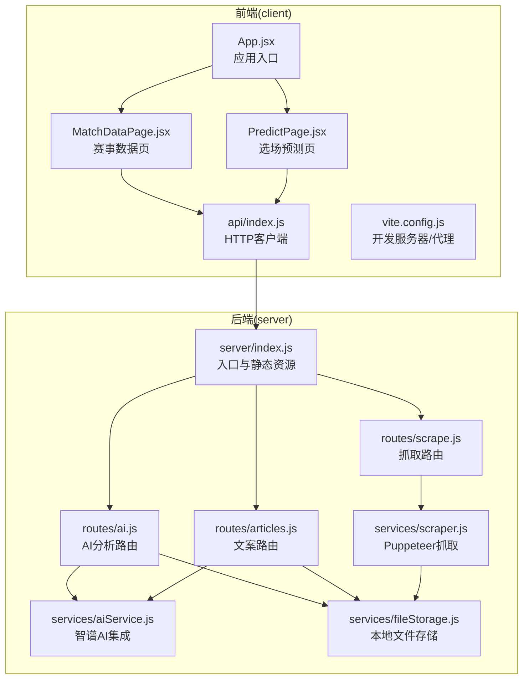
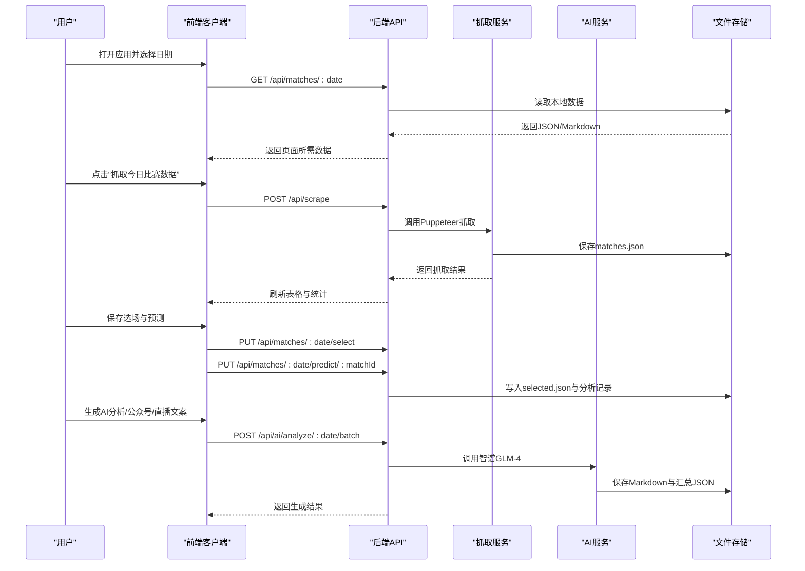
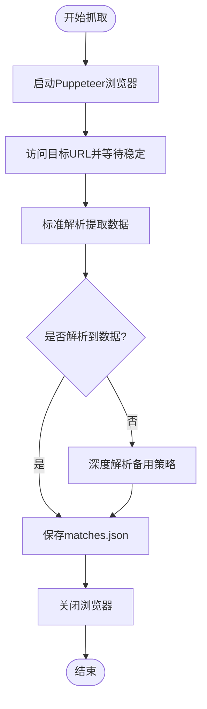
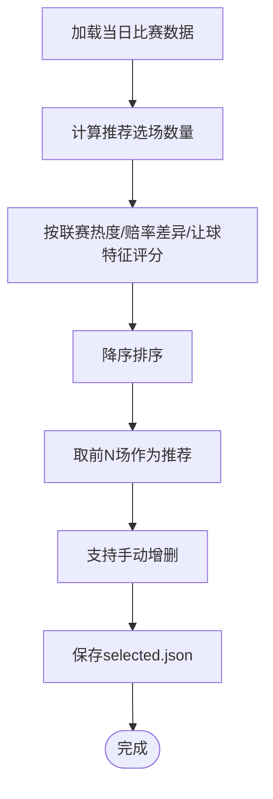
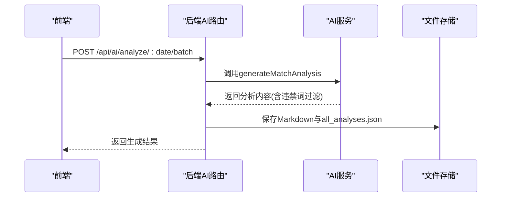
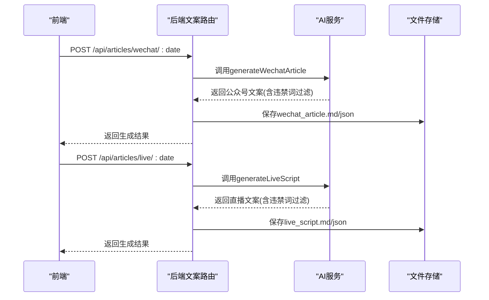
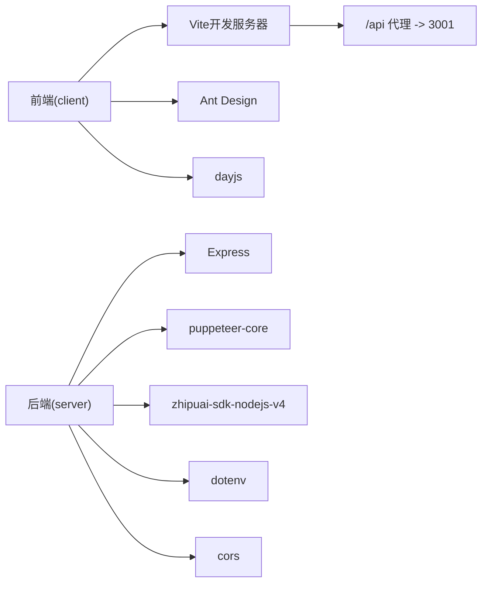

# 项目概述

<cite>
**本文档引用的文件**
- [PRD.md](file://PRD.md)
- [package.json](file://package.json)
- [client/package.json](file://client/package.json)
- [server/index.js](file://server/index.js)
- [client/src/App.jsx](file://client/src/App.jsx)
- [client/src/pages/MatchDataPage.jsx](file://client/src/pages/MatchDataPage.jsx)
- [client/src/pages/PredictPage.jsx](file://client/src/pages/PredictPage.jsx)
- [client/src/api/index.js](file://client/src/api/index.js)
- [client/vite.config.js](file://client/vite.config.js)
- [server/routes/scrape.js](file://server/routes/scrape.js)
- [server/services/scraper.js](file://server/services/scraper.js)
- [server/services/aiService.js](file://server/services/aiService.js)
- [server/routes/ai.js](file://server/routes/ai.js)
- [server/routes/articles.js](file://server/routes/articles.js)
- [server/services/fileStorage.js](file://server/services/fileStorage.js)
</cite>

## 目录
1. [简介](#简介)
2. [项目结构](#项目结构)
3. [核心组件](#核心组件)
4. [架构总览](#架构总览)
5. [详细组件分析](#详细组件分析)
6. [依赖关系分析](#依赖关系分析)
7. [性能考虑](#性能考虑)
8. [故障排除指南](#故障排除指南)
9. [结论](#结论)
10. [附录](#附录)

## 简介
AutoMatch 是一款面向足球竞彩分析师的本地化智能分析工具，旨在提升每日赛事分析、公众号推文与直播文案的产出效率。项目通过自动化数据抓取、智能选场推荐、AI辅助分析以及合规文案生成四大核心能力，帮助分析师在 macOS 本地环境中高效完成从数据采集到内容发布的全流程工作。

- 核心定位：足球竞彩分析师的智能分析助手
- 主要功能：赛事数据抓取、智能选场预测、AI辅助分析、合规文案生成
- 技术架构：前后端分离的全栈应用，前端采用 React + Vite + Ant Design，后端基于 Node.js + Express，数据抓取使用 Puppeteer，AI集成智谱 GLM-4，数据存储为本地文件系统

**章节来源**
- [PRD.md:1-301](file://PRD.md#L1-L301)

## 项目结构
项目采用前后端分离的组织方式，根目录包含后端 server 与前端 client 两个子项目，配合统一的包管理与脚本配置：

- 后端 server
  - 路由层：/routes 下按功能划分（scrape、matches、ai、articles）
  - 服务层：/services 下封装抓取、AI、文件存储等业务逻辑
  - 入口：/server/index.js 提供 API 服务与静态文件托管
- 前端 client
  - 页面：/src/pages 下包含赛事数据、选场预测、AI分析、文案生成四个页面
  - 组件与工具：/src/components、/src/api、/src/assets 等
  - 构建：Vite 配置代理后端 /api 请求至本地 3001 端口

**图表来源**
- [server/index.js:1-49](file://server/index.js#L1-L49)
- [client/src/App.jsx:1-117](file://client/src/App.jsx#L1-L117)
- [client/src/pages/MatchDataPage.jsx:1-198](file://client/src/pages/MatchDataPage.jsx#L1-L198)
- [client/src/pages/PredictPage.jsx:1-322](file://client/src/pages/PredictPage.jsx#L1-L322)
- [client/src/api/index.js:1-50](file://client/src/api/index.js#L1-L50)
- [client/vite.config.js:1-17](file://client/vite.config.js#L1-L17)
- [server/routes/scrape.js:1-26](file://server/routes/scrape.js#L1-L26)
- [server/routes/ai.js:1-102](file://server/routes/ai.js#L1-L102)
- [server/routes/articles.js:1-113](file://server/routes/articles.js#L1-L113)
- [server/services/scraper.js:1-295](file://server/services/scraper.js#L1-L295)
- [server/services/aiService.js:1-212](file://server/services/aiService.js#L1-L212)
- [server/services/fileStorage.js:1-196](file://server/services/fileStorage.js#L1-L196)

**章节来源**
- [package.json:1-23](file://package.json#L1-L23)
- [client/package.json:1-31](file://client/package.json#L1-L31)
- [server/index.js:1-49](file://server/index.js#L1-L49)
- [client/vite.config.js:1-17](file://client/vite.config.js#L1-L17)

## 核心组件
- 赛事数据抓取模块
  - 使用 Puppeteer 无头浏览器访问目标站点，解析表格数据并保存为 JSON
  - 支持标准解析与深度解析两种策略，保证在页面结构变化时仍能稳定提取
- 智能选场与预测录入
  - 基于联赛热度、赔率差异度与让球盘口特征进行自动推荐
  - 支持手动选择与批量保存，便于分析师快速锁定重点场次并录入预测
- AI辅助分析
  - 调用智谱 GLM-4 生成专业赛事分析文案，支持单场与批量生成
  - 输出内容自动进行违禁词过滤，满足合规要求
- 合规文案生成
  - 自动生成公众号推文与直播文案，严格遵循微信视频号直播规范
  - 提供违禁词替换策略，确保内容安全与专业性

**章节来源**
- [server/services/scraper.js:1-295](file://server/services/scraper.js#L1-L295)
- [client/src/pages/PredictPage.jsx:1-322](file://client/src/pages/PredictPage.jsx#L1-L322)
- [server/services/aiService.js:1-212](file://server/services/aiService.js#L1-L212)
- [server/routes/ai.js:1-102](file://server/routes/ai.js#L1-L102)
- [server/routes/articles.js:1-113](file://server/routes/articles.js#L1-L113)

## 架构总览
AutoMatch 采用前后端分离的全栈架构，前端负责交互与数据展示，后端提供 API 服务与业务逻辑，数据通过本地文件系统持久化。整体流程如下：

**图表来源**
- [client/src/pages/MatchDataPage.jsx:1-198](file://client/src/pages/MatchDataPage.jsx#L1-L198)
- [client/src/pages/PredictPage.jsx:1-322](file://client/src/pages/PredictPage.jsx#L1-L322)
- [client/src/api/index.js:1-50](file://client/src/api/index.js#L1-L50)
- [server/routes/scrape.js:1-26](file://server/routes/scrape.js#L1-L26)
- [server/routes/ai.js:1-102](file://server/routes/ai.js#L1-L102)
- [server/routes/articles.js:1-113](file://server/routes/articles.js#L1-L113)
- [server/services/scraper.js:1-295](file://server/services/scraper.js#L1-L295)
- [server/services/aiService.js:1-212](file://server/services/aiService.js#L1-L212)
- [server/services/fileStorage.js:1-196](file://server/services/fileStorage.js#L1-L196)

## 详细组件分析

### 赛事数据抓取组件
- 设计要点
  - 通过 Puppeteer 启动浏览器，设置合适的 User-Agent 与视口，等待页面稳定后再解析
  - 提供标准解析与深度解析双策略，增强对页面结构变化的适应性
  - 抓取完成后写入本地 JSON 文件，便于前端直接读取与展示
- 数据流
  - 用户触发抓取 → 后端调用抓取服务 → 解析页面 → 保存文件 → 返回结果
- 错误处理
  - 对浏览器启动、页面加载、解析异常进行捕获与错误返回
  - 最终关闭浏览器实例，避免资源泄漏

**图表来源**
- [server/services/scraper.js:22-214](file://server/services/scraper.js#L22-L214)

**章节来源**
- [server/services/scraper.js:1-295](file://server/services/scraper.js#L1-L295)
- [server/routes/scrape.js:1-26](file://server/routes/scrape.js#L1-L26)

### 智能选场与预测录入组件
- 设计要点
  - 根据当日比赛总数自动推荐选场数量（5~10场4场，>10场6场，<5场全选）
  - 联赛热度优先，结合赔率差异度与让球盘口特征进行评分排序
  - 支持手动勾选与批量保存，预测字段包含预测结果、信心指数、分析笔记与热门标记
- 流程图

**图表来源**
- [client/src/pages/PredictPage.jsx:33-78](file://client/src/pages/PredictPage.jsx#L33-L78)
- [client/src/pages/PredictPage.jsx:80-113](file://client/src/pages/PredictPage.jsx#L80-L113)

**章节来源**
- [client/src/pages/PredictPage.jsx:1-322](file://client/src/pages/PredictPage.jsx#L1-L322)

### AI辅助分析组件
- 设计要点
  - 调用智谱 GLM-4 生成约200字的专业分析文案，强调从赔率与让球角度切入
  - 支持单场与批量生成，输出 Markdown 与汇总 JSON，便于查看与编辑
  - 生成内容进行违禁词过滤，确保合规
- 时序图

**图表来源**
- [server/routes/ai.js:36-69](file://server/routes/ai.js#L36-L69)
- [server/services/aiService.js:18-65](file://server/services/aiService.js#L18-L65)
- [server/services/fileStorage.js:74-98](file://server/services/fileStorage.js#L74-L98)

**章节来源**
- [server/routes/ai.js:1-102](file://server/routes/ai.js#L1-L102)
- [server/services/aiService.js:1-212](file://server/services/aiService.js#L1-L212)
- [server/services/fileStorage.js:1-196](file://server/services/fileStorage.js#L1-L196)

### 合规文案生成组件
- 设计要点
  - 公众号推文：突出热点比赛，从基本面角度分析，提供吸引人的开头与号召性结尾
  - 直播文案：口语化表达，适合朗读，严格限制违禁词，仅从基本面角度分析
  - 热门比赛选择：优先 isHot 标记，不足时取前两场
- 时序图

**图表来源**
- [server/routes/articles.js:7-51](file://server/routes/articles.js#L7-L51)
- [server/routes/articles.js:53-93](file://server/routes/articles.js#L53-L93)
- [server/services/aiService.js:69-205](file://server/services/aiService.js#L69-L205)
- [server/services/fileStorage.js:112-139](file://server/services/fileStorage.js#L112-L139)

**章节来源**
- [server/routes/articles.js:1-113](file://server/routes/articles.js#L1-L113)
- [server/services/aiService.js:1-212](file://server/services/aiService.js#L1-L212)
- [server/services/fileStorage.js:1-196](file://server/services/fileStorage.js#L1-L196)

## 依赖关系分析
- 前端依赖
  - React + Vite：构建与开发体验
  - Ant Design：UI 组件库，提供表格、表单、模态框等
  - dayjs：日期处理
- 后端依赖
  - Express：Web 框架
  - Puppeteer-core：无头浏览器抓取
  - zhipuai-sdk-nodejs-v4：智谱 AI SDK
  - dotenv：环境变量加载
  - cors：跨域支持
- 代理与开发
  - 前端 Vite 通过代理将 /api 请求转发至后端 3001 端口

**图表来源**
- [client/package.json:12-18](file://client/package.json#L12-L18)
- [package.json:15-21](file://package.json#L15-L21)
- [client/vite.config.js:7-15](file://client/vite.config.js#L7-L15)

**章节来源**
- [client/package.json:1-31](file://client/package.json#L1-31)
- [package.json:1-23](file://package.json#L1-L23)
- [client/vite.config.js:1-17](file://client/vite.config.js#L1-L17)

## 性能考虑
- 抓取性能
  - 控制在 30 秒内完成，避免长时间阻塞
  - 使用无头浏览器与稳定等待策略，减少重试与失败
- AI 生成性能
  - 单场分析控制在 10 秒内，保证交互流畅
  - 批量生成时采用顺序处理，确保稳定性
- 前端性能
  - 表格横向滚动优化，减少渲染压力
  - 按日期分目录存储，避免单文件过大

[本节为通用性能指导，无需具体文件引用]

## 故障排除指南
- 抓取失败
  - 检查网络连通性与目标站点可用性
  - 确认浏览器可执行路径配置正确（可通过环境变量覆盖）
  - 查看后端日志中的错误堆栈
- AI 生成失败
  - 确认智谱 API Key 已正确配置
  - 检查网络与模型可用性
- 文案生成失败
  - 确认已保存选场与预测
  - 检查违禁词过滤后的输出是否为空
- 前端无法访问 API
  - 确认后端服务已启动且监听 3001 端口
  - 检查 Vite 代理配置是否指向正确的后端地址

**章节来源**
- [server/services/scraper.js:10-17](file://server/services/scraper.js#L10-L17)
- [server/services/aiService.js:8-13](file://server/services/aiService.js#L8-L13)
- [client/vite.config.js:7-15](file://client/vite.config.js#L7-L15)
- [server/index.js:45-48](file://server/index.js#L45-L48)

## 结论
AutoMatch 通过前后端分离的架构设计，结合 Puppeteer 数据抓取、智谱 AI 分析与合规文案生成，为足球竞彩分析师提供了从数据采集到内容发布的完整解决方案。项目结构清晰、模块职责明确，具备良好的扩展性与可维护性，能够显著提升分析师的工作效率与内容质量。

[本节为总结性内容，无需具体文件引用]

## 附录

### 技术选型说明
- 前端：React + Vite + Ant Design
  - 快速开发与良好用户体验
- 后端：Node.js + Express
  - 轻量、易部署，适合本地化工具
- 数据抓取：Puppeteer
  - 绕过反爬机制，稳定解析动态页面
- AI 集成：智谱 GLM-4
  - 专业模型，支持合规文案生成
- 数据存储：本地文件系统
  - 简单可靠，便于版本管理与备份

**章节来源**
- [PRD.md:14-20](file://PRD.md#L14-L20)

### 业务价值与应用场景
- 业务价值
  - 提升分析师每日工作流效率，降低重复劳动
  - 通过 AI 辅助生成高质量分析与文案，增强内容专业度
  - 合规文案生成保障内容安全，规避风险
- 应用场景
  - 日常赛事分析与选场
  - 公众号推文与直播内容生产
  - 团队协作与知识沉淀（本地化存储）

**章节来源**
- [PRD.md:8-12](file://PRD.md#L8-L12)

### 发展历程与规划
- 开发阶段
  - 项目初始化与后端框架搭建
  - 数据抓取模块实现
  - 文件存储服务实现
  - 智谱 AI 集成与违禁词过滤
  - 前端页面开发
  - 联调测试与上线准备

**章节来源**
- [PRD.md:291-301](file://PRD.md#L291-L301)